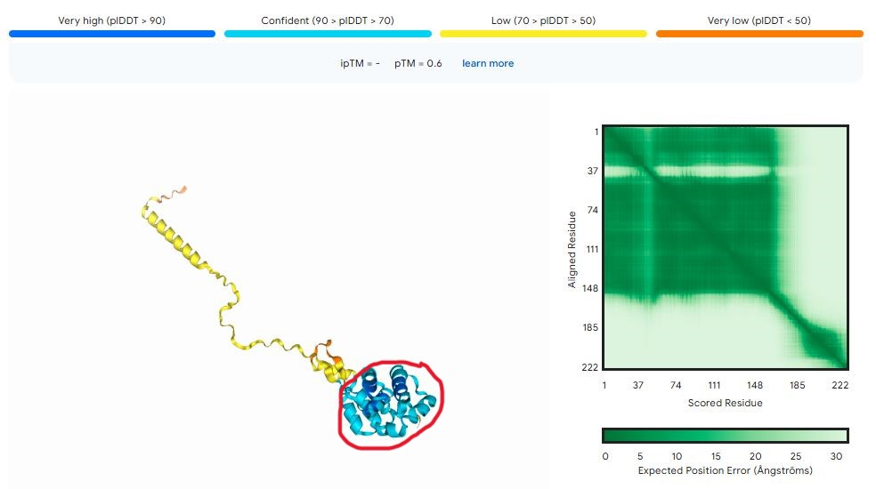

# Preliminary research indicates association between novel obelisk Clostridiae-associata centralis and Clostridia bacteria
written by: Jana van Heeswyk

### Clostridiae-associata centralis
This means Clostridia-associated (for the relation to Clostridia bacteria observed herein) and central (for the main obelisk in my assigned cluster).


## Abstract

The sequences of newly discovered viroid-like elements, obelisks, have recently been found to be ubiquitous in publicly available sequencing data. Most have yet to be characterized, but given their ubiquity, research into obelisks could reveal some with key roles in our environment and in human health. Here I conducted preliminary research characterizing one such newly discovered obelisk, termed Clostridiae-associata centralis. I investigated the ecology and molecular attributes of Clostridiae-associata centralis, and found it has a high environmental association and sequence overlap with Clostridium beijerinckii bacteria, which is of interest in the biotechnology field. Further research must be done to further characterize this relationship and determine if Clostridiae-associata centralis could play a role in Clostridium beijerinckii function.

## Results

## Clostridiae-associata discovery and ecosystem

Clostridiae-associata centralis RNA sequence was discovered in publicly available single run accession (SRR6214849) data on SRA, associated with BioProject PRJNA315559. Researchers on this project sampled anaerobic sludge from a bioreactor located near Cologne, Germany, and sequenced its metagenome. The goal of the project was to evaluate primers for the amplification of the archaeal 16S rRNA gene data, in comparison to more widely used bacterial primers, in the sampled microbial population [Fischer 2016]. As part of this the researchers evaluated sequence composition of the sampled microbial communities across bacterial taxonomic classes [Fischer 2016]. They observed a high sequence composition of Clostridia bacteria, ranging from 20-40% across the use of several different bacterial primers for sequence amplification [Fischer 2016]. I thus concluded with high confidence that Clostridiae-associata centralis co-occurs with Clostridia bacteria.

This high occurence of Clostridia bacteria in the sample in which Clostridiae-associata centralis was discovered was an intriguing insight into its ecology. Numerous other obelisk sequences were determined to cluster with Clostridiae-associata centralis (via uclust), termed here Clostridiae-associata obelisks. I examined the BioProjects associated with the sequencing runs in which some of the Clostridiae-associata obelisks were discovered, and I found a BioProject (PRJEB20771) in which the researchers sampled bioreactor sludge in Hong Kong, China and sequenced Clostridium beijerinckii NCIMB 8052 (ERR1960626), a bacteria belonging to the class Clostridia [Ju 2016]. Clostridium beijerinckii is an anaerobic rod-shaped bacteria that is of interest to microbiologists due to its biotechnological potential, given that it produces sought-after chemicals like butanol, acetone, and isopropanol during fermentation [JGI Genome Portal 2024]. Given the interest in Clostridium beijerinckii and its observed association with Clostridiae-associata obelisks, I chose to investigate whether Clostridium beijerinckii is a possible host for Clostridiae-associata centralis. 

## Characterizing Clostridiae-associata centralis and its relation to Clostridium beijerinckii

## Finding open reading frames (ORFs) and predicting protein structure

I ran NCBI ORFfinder on Clostridiae-associata centralis sequencing data, and identified 4 ORFs (see Fig. 1). I then used AlphaFold3 to predict protein structure. Prediction with all 4 ORFs gave values of ipTM = 0.25 pTM = 0.53, indicating a low-confidence prediction of interaction between the ORFs [EMBL-EBI 2024]. This low-confidence prediction is likely partly due to the fact that ORF2 and ORF4 are not complete CDS. Structure prediction of ORF2 alone showed a confident structure prediction for conserved Oblin-1 structures, but low-confidence prediction of the structure elsewhere in the protein (see Fig. 3). It is thus likely that the sequence encoding the low-confident regions is incomplete, and the structure of these regions may mirror the structure of Oblin-1 when complete.

## Sequence comparison of Clostridiae-associata centralis with experimental sequencing data from BioProject 

To investigate whether Clostridiae-associata centralis is present in the Clostridium beijerinckii genome, I performed a tBLASTn search [NCBI BLAST] with my query sequence as ORF2 from Clostridiae-associata centralis and my chosen search set as the experimental data associated with BioProject PRJNA315559 (ERX2023530). My goal was to see if the putative Oblin-1 ORF in Clostridiae-associata centralis was present in the BioProject sequencing data, which would provide insight as to whether functional sequence from Clostridiae-associata centralis could be found in Clostridium beijerinckii. The result returned over 100 alignments with percent identity over 85% and E values under 0.01 (see Fig. 2).


### Virus Genome {Q3}


### Other (bonus) sections

## RNA secondary structures of Clostridiae-associata centralis and another Clostridiae-associata obelisk for comparison [RNAfold]


## Conserved regions between Oblin-1 protein structure and predicted protein structure of ORF2 of Clostridiae-associata centralis




#Limericks incorporating facts discovered about Clostridiae-associata centralis

In the sludge where Clostridia thrive,
An obelisk with secrets alive,
It encodes Oblin-1,
And four ORFs, each alone—
In RNA worlds, they survive.

From Hong Kong to Bonn, they appear,
Clostridiae obelisks near.
With structures distinct,
But genomes linked,
Their roles remain unclear.

## Discussion

Here I characterized the newly discovered Clostridiae-associata centralis obelisk. I determined with high confidence that Clostridiae-associata centralis encodes the Oblin-1 protein, a commonality among obelisks that helps affirm the identity of Clostridiae-associata centralis. Clostridiae-associata obelisks were also determined to be found in diverse microbial communities, in this case in anaerobic sludge, another common obelisk trait. However, this preliminary research uncovered an association between Clostridiae-associata centralis and Clostridia bacteria, and more interestingly, a high-confidence association between Clostridium beijerinckii and Clostridiae-associata centralis. Association with Clostridium beijerinckii has not been studied widely in obelisks, so much more work must be done to determine whether this is a novel association or a widespread obelisk trait. This research should also be extended to investigate whether Clostridium beijerinckii has a host relationship with Clostridiae-associata obelisks, and whether Clostridiae-associata obelisks could play a role in the useful metabolic functions of Clostridium beijerinckii.

## References

Zheludev IN, Edgar RC, Lopez-Galiano MJ, de la Peña M, Babaian A, Bhatt A, Fire AZ. Viroid-like colonists of human microbiomes, Cell, Volume 187, Issue 23, 2024, Pages 6521-6536.e18,ISSN 0092-8674, https://doi.org/10.1016/j.cell.2024.09.033.

Fischer MA, Güllert S, Neulinger SC, Streit WR, Schmitz RA. Evaluation of 16S rRNA Gene Primer Pairs for Monitoring Microbial Community Structures Showed High Reproducibility within and Low Comparability between Datasets Generated with Multiple Archaeal and Bacterial Primer Pairs. Front Microbiol. 2016 Aug 23;7:1297. doi: 10.3389/fmicb.2016.01297. PMID: 27602022; PMCID: PMC4994424.

Ju, F., Wang, Y., Lau, F.T.K. et al. Anaerobic digestion of chemically enhanced primary treatment (CEPT) sludge and the microbial community structure. Appl Microbiol Biotechnol 100, 8975–8982 (2016). https://doi.org/10.1007/s00253-016-7730-2

EMBL-EBI, AlphaFold (2024). Retrieved from: https://www.ebi.ac.uk/training/online/courses/alphafold/inputs-and-outputs/evaluating-alphafolds-predicted-structures-using-confidence-scores/confidence-scores-in-alphafold-multimer/

Maus, I., Koeck, D.E., Cibis, K.G. et al. Unraveling the microbiome of a thermophilic biogas plant by metagenome and metatranscriptome analysis complemented by characterization of bacterial and archaeal isolates. Biotechnol Biofuels 9, 171 (2016). https://doi.org/10.1186/s13068-016-0581-3

GitHub, PuravG/Computational-Virus-Discovery. Retrieved from: https://github.com/PuravG/Computational-Virus-Discovery/blob/main/Workflow%20Summary.md

JGI Genome Portal, Clostridium beijerincki NCIMB 8052 (2024). Retrieved from: https://genome.jgi.doe.gov/portal/clobe/clobe.home.html

AlphaFold3.Retrieved from: https://alphafoldserver.com/fold/72f1832be1ddbc4e

RNAfold.Retrieved from:http://rna.tbi.univie.ac.at//cgi-bin/RNAWebSuite/RNAfold.cgi?PAGE=3&ID=vTQ2umJPTu

NCBI BLAST. Retrieved from https://blast.ncbi.nlm.nih.gov/Blast.cgi#alnHdr_A7HWM6.

# Viral Short Story

```
Oh, have you heard of the Centralis obelisk?
A newly discovered RNA thing that exists!
Down where Clostridia live in the slop,
The Centralis thrives where most others would stop.

It’s not quite understood but not unknown,
It thrives with bacteria, but never alone.
Its RNA genome is twisty and bright,
With four little ORFs, oh, what a sight!

“Oh, Centralis!” the microbes all cheer,
But don’t get too close — it’s a little unclear.
Its proteins, you see, just won’t hold a hand,
Each one’s a loner in RNA land.

Now the Centralis also has cousins abroad,
In Cologne and in Hong Kong, isn’t that odd?
Each has a structure distinct and unique,
what could be the reason for their physiques?

It thrives in the sludge, deep and anaerobic,
And puzzles minds both great and myopic.
“Why does it exist? What's its ecology?”
The answers, for sure, are a much longer story.

So here’s to the Centralis and its RNA folds,
In tales of the sludge, its story is told.
With microbes and mysteries, it does persist,
An obelisk marvel— how can we resist?
```