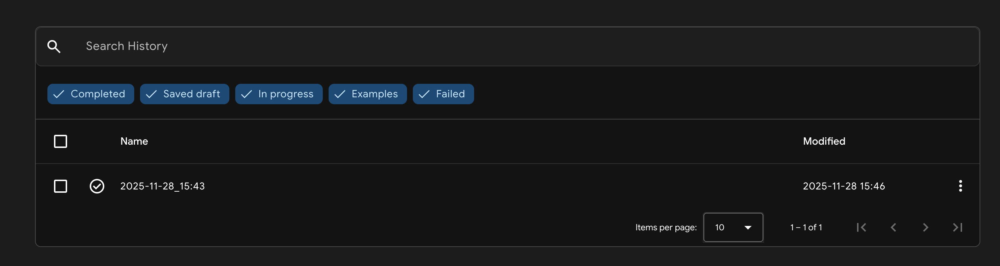
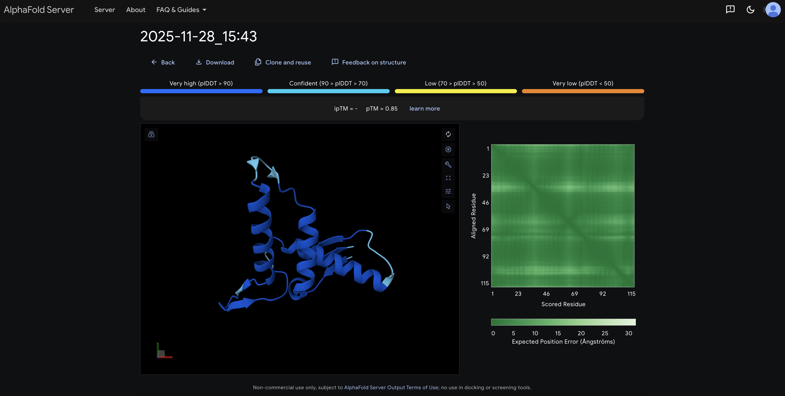
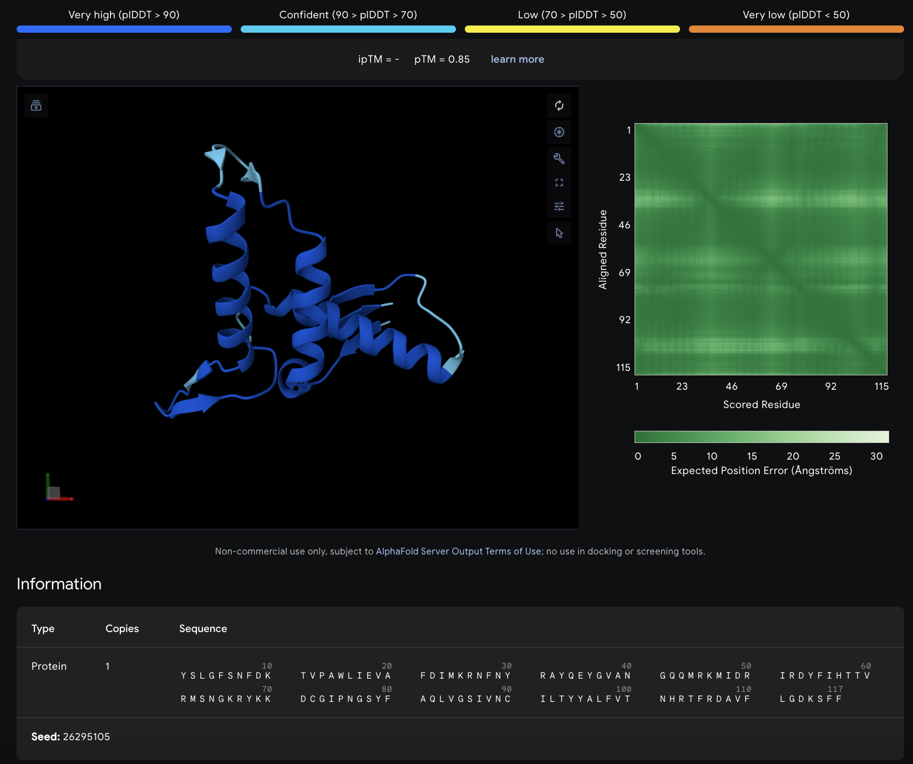
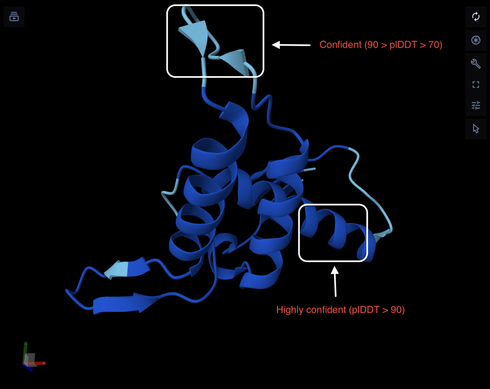

# AlphaFold3

Written by: Anzar Alvi

[10 minute] This tutorial focuses on an AI-based tool called AlphaFold 3, which predicts protein structure from amino acid, DNA, or RNA sequences and also visualizes these predictions as high-resolution 3D models. AlphaFold 3 can additionally incorporate DNA/RNA, ions, ligands, antibodies, and other molecular entities to show potential interaction sites within a unified 3D structure. Together, these prediction and visualization features make AlphaFold 3 a powerful tool for interpreting protein folding, identifying conserved domains, and inferring molecular function.

AlphaFold 3 is highly relevant in virus discovery because structural information helps classify novel viruses by revealing folding patterns, conserved motifs, and interaction information, providing valuable insights into potential protein roles, viral family assignment, and biological origins.

**Tutorial objective:** In this tutorial you will learn how to apply AlphaFold 3 to generate a viral protein structure from an uncharacterized viral sequence and obtain information from this structure to help define the virus.

## Input / Prerequisites

-   A web browser with internet connection to use AlphaFold 3 (<https://alphafoldserver.com/welcome>)

-   A DNA, RNA, Protein, ligand, ion, or antibody sequence/molecule to input into AlphaFold 3 and generate a 3D structure.

    -   *Note:* This tutorial uses the amino acid sequence (shown below in Step 3) translated from the sequence from run SRR7666026, but you can apply these steps to any sequence relevant to your analysis.

## Output

A 3D image of the protein structure generated from your input sequence with color-coded regions depicting high or low confidence in structure accuracy, along with a Predicted Aligned Error Plot which reflects structure reliability.

AlphaFold 3 returns multiple layers of structural information, including:

-   A 3D image of the predicted protein structure generated from your input sequence

-   Color-coded confidence scores (high → low) representing predicted structural accuracy

-   A Predicted Aligned Error (PAE) plot reflecting structural reliability and domain-level confidence

-   3D atomic coordinates

-   Interaction-level predictions, including protein–DNA, protein–RNA, and protein–ligand interfaces

-   Multimeric output, where all entities are shown as a single unified 3D molecular system

These features support downstream interpretation, allowing you to explore folding, conserved domains, and potential biological functions—all crucial in characterizing novel viral proteins.

### Tutorial Walkthrough

### **1. Obtain a relevant amino acid sequence.**

This tutorial is designed to cater to researchers in Virus Discovery which means your starting point will likely be a DNA sequence generated from raw field data - in this case we will use SRR7666026 sequence that was collected from transcriptome sequencing of *Anastrepha fraterculus.* AlphaFold 3 provides useful protein structure information so, prior to using AlphaFold 3, we need to get a potential 'Protein' sequence from our raw data.

This step involves applications of other databases which just shows that AlphaFold 3 is applied towards the end stages of Virus Discovery projects - after other information from raw data has already been studied,

We need to submit our sequence to the NCBI ORF Finder (<https://www.ncbi.nlm.nih.gov/orffinder/>) and identify potential ORFs for translation. In this case, we use our node sequence as input. Now we have our input 'Protein' sequence and can start using AlphaFold 3!

### **2. Go to the AlphaFold 3 tool (**<https://alphafoldserver.com/welcome>**).**

### **3. Pick your Entity Type and enter the seuqence into the box provided (our example is still following the 'Protein' sequence we obtained in Step 1).**

In this case we pick Protein as the Entity Type and enter our 'Protein' Sequence from Step 1. Users should make sure that their translated protein sequence contains only valid amino acid letters and nothing ambigious like "X", i.e., ensure correct input sequence cleaning. AlphaFold 3 visually displays the sequence in formatted blocks, without altering the input sequence

Tip: Explore this page of AlphaFold 3 - it has many elements that can be used for different analyses. We are only inputting one 'Protein' sequence but notice the 'Add Entity' icon on the bottom left - this can be used to input additional sequences of molecules you want to include in your structure. The different types of molecules can be seen in the drop-down menu of 'Entity Type' - it included 'DNA', 'RNA', 'Protein', 'Ligand', and 'Ion'. The levels of structures and interactions that AlphaFold 3 can predict show exciting potential for research!

### **4. Click on 'Continue and Preview Job' to generate your 3D protein structure.**

You will see a table at the bottom showing all the jobs you have submitted - note that there is a 'Jobs Remaining' count on the top right of the screen that tells you how many jobs you have left to submit on this tool. The job name will have a check icon next to it once it's completed and ready to view.

Note: This part usually takes a couple of minutes, but the job run time can vary depending on the data entered and your internet connection.

### **5. Explore your generated 3D protein structure!**

Once the job is complete, you can click on it and it will show the generated structure.

Now you can explore your protein structure in all its glory! The structure is color coded with a high confidence to low confidence color range (key shown above the structure). In this case we can see that the blue domains are determined with high confidence and are the most useful for inferring function or conducting further analyses! There is also a Predicted Aligned Error Plot next to the structure which is also color coded for you to interpret the structure's reliability.

Tip: Use your cursor to zoom in and play around with the 3D structure and further examine any domains of interest you might find useful in your research.

### **6. Interpreting Results**

**What is output "confidence"? How is it calculated?**

AlphaFold3 provides 2 key confidence metrics: 1) plDDT (Predicted Local Distance Difference Test) and 2) PAE (Predicted Aligned Error).

The plDDT is a measure of how confident the model is in the local backbone geometry for each residue (value ranging from 0-100). The way AlphaFold 3 calculates this is by predicting a distribution of pairwise distributions for each residue pair, so, the plDDT is the expected agreement between predicted distances and true distances if the real structure were known.

Mathematically: $plDDT = 100 \times \mathbb{E}[\mathrm{lDDT}_i]$

The PAE is a metric of how confident the model is in the relative positioning of 2 residues or domains. This is visualized as a heatmap with values in Ångströms (Å), where lower values indicate a higher confidence. In addition, AlphaFold 3 uses diffusion-based generative modelling internally, but confidence is computed using a statistical scoring framework (expected error estimates over sampled structural distributions).

**What are the common/accepted thresholds for "true positive" or "significance" output confidence values?**

In general, the thresholds for pIDDT are as follows:

-   \>90: very high confidence (well-modeled atomic positions)

-   70-90: generally reliable backbone (less certain about side chain interactions)

-   50-70: low confidence (presence of disordered or flexible regions are likely)

-   \<50: very low confidence (unreliable prediction)

Furthermore, the thresholds for PAE are as follows:

-   \<5 Å: high confidence in domain placement

-   5-15 Å: moderate confidence

-   \>15 Å: low confidence in global arrangement

Typically, you want to use plDDT to evaluate the quality of local structure and use PAE to evaluate the inter-domain or protein-partner arrangements.

**How can the output be used in the creation of a "Figure" for the Final Project? What information or parameters must be included in the "legend" documentation for reproducible analysis?**

For an acceptable figure for the Final Project, it's best to include:

-   Rendered 3D structure coloured by plDDT confidence (blue = high, red = low)

-   PAE plot (to interpret domain interactions)

-   Caption (legend) containing elements:

    -   The sequence being used

    -   Version of AlphaFold (AF3 in this case)

    -   Date the model was generated

    -   Relaxed or un-relaxed structure

    -   Confidence metrics (e.g., plDDT mean±SD, min/max)

    -   Notes on low-confidence regions

    -   Exact parameters used (e.g., single protein, no ligands added, etc.)

    -   Link to the tool or version

**Figure X. AlphaFold 3 predicted structure of the protein**

The amino acid sequence shown (117 aa) was submitted to AlphaFold 3 (AF3) using the default *Protein* entity settings with no ligands, ions, or partner molecules added. The predicted 3D structure is rendered and coloured by plDDT confidence, where darker blue corresponds to very high confidence (plDDT \> 90). The overall model shows uniformly high local confidence across the structure, indicating a stable and well-defined fold. The accompanying Predicted Aligned Error (PAE) plot shows consistently low expected positional error (\<5 Å), suggesting high certainty in both intra-domain residue positioning and global orientation of the structure.

The model was generated on November 28th, 2025, using the AlphaFold 3 Server (<https://alphafoldserver.com/welcome>). The structure shown is the unrelaxed prediction produced directly by AF3.

### Conclusion

That's it! You've used AlphaFold 3 to to generate a 3D viral protein structure from an uncharacterized sequence!

The next steps are up to you - AlphaFold 3 gave you a protein structure that has countless implications in the biological functions of your virus. Identifying distinct domains and comparing them to other viral proteins can help you classify your virus based on similarity to other viruses.

We can visually identify domains from our structure generated in this Tutorial.

After identifying these areas of interest, you can compare your structure to other similar ones or other structures generated from different sequences of interest. AlphaFold 3 has give you a platform to infer any protein functions from the structure - your turn to use the structure to narrow down the characterization of your virus!

### See Also:

-   Cool paper using AlphaFold predictions in a viral context: [Use of an Integrated Approach Involving AlphaFold Predictions for the Evolutionary Taxonomy of Duplodnaviria Viruses - application in Virus Classification](https://pmc.ncbi.nlm.nih.gov/articles/PMC9855967/)
-   Original AlphaFold 3 paper: [Highly accurate protein structure prediction with AlphaFold](https://www.nature.com/articles/s41586-024-07487-w)
-   Step 1 NCBI ORF Finder: [NCBI ORF Finder](https://www.ncbi.nlm.nih.gov/orffinder/)
-   Useful tool: [InterProScan](https://www.ebi.ac.uk/interpro/search/sequence/)
    -   Researchers are able to paste their translated ORF and receive cool information like:
        -   Protein family predictions

        -   Conserved domains

        -   Motifs

        -   GO terms

        -   Signatures
-   Main AlphaFold 3 website: [AlphaFold 3](https://alphafoldserver.com/welcome)
-   FAQs for AlphaFold 3: [AlphaFold 3 FAQs](https://alphafoldserver.com/faq)
