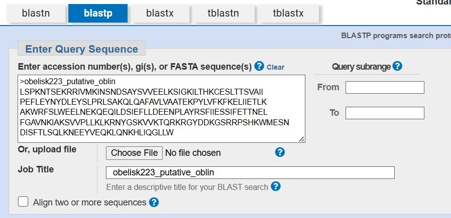
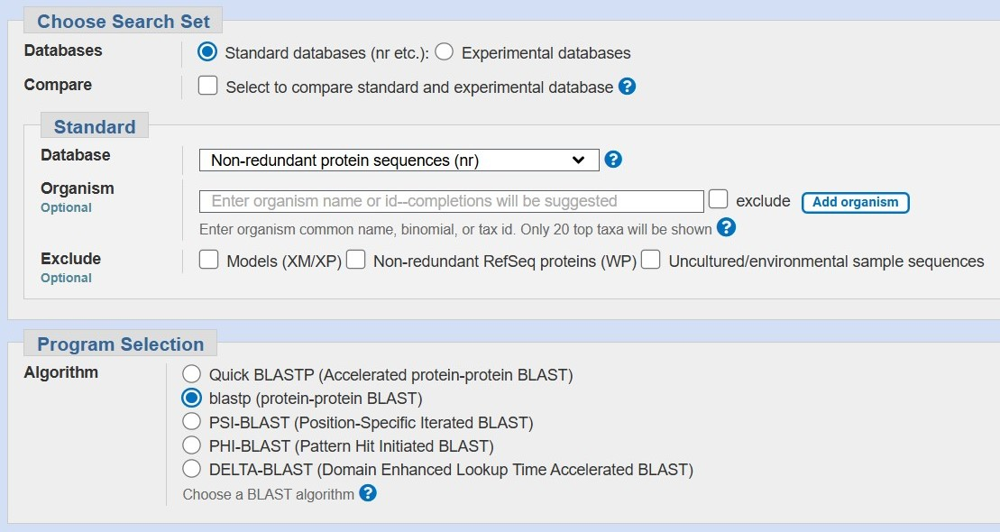
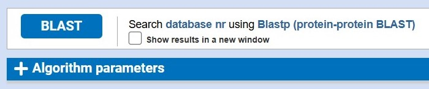
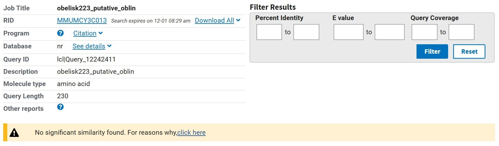
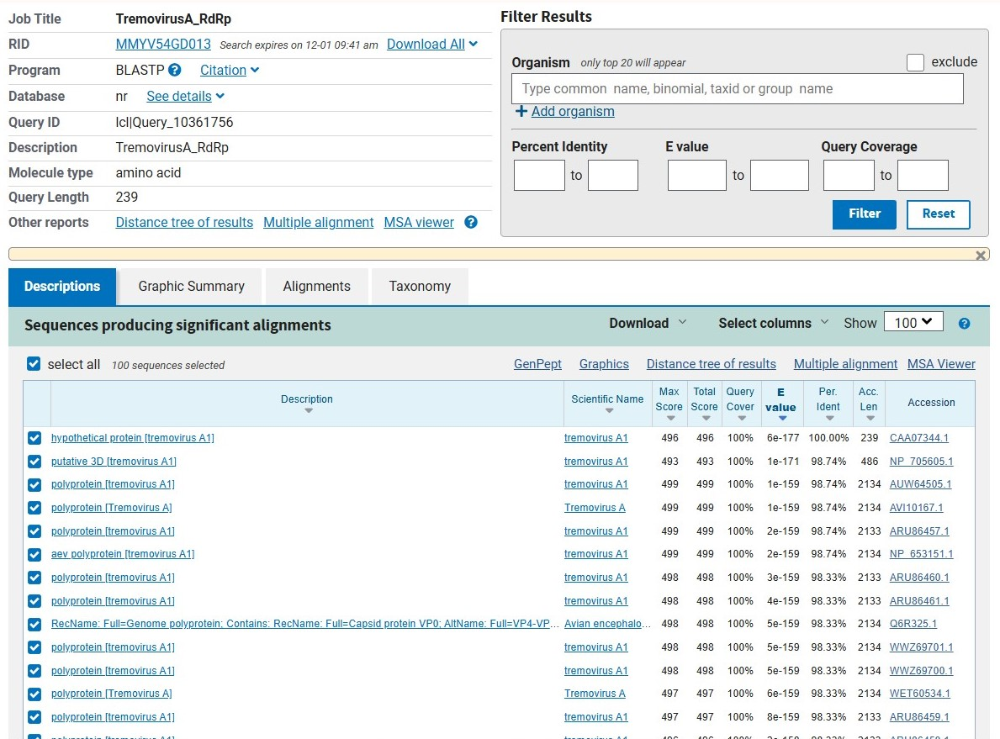
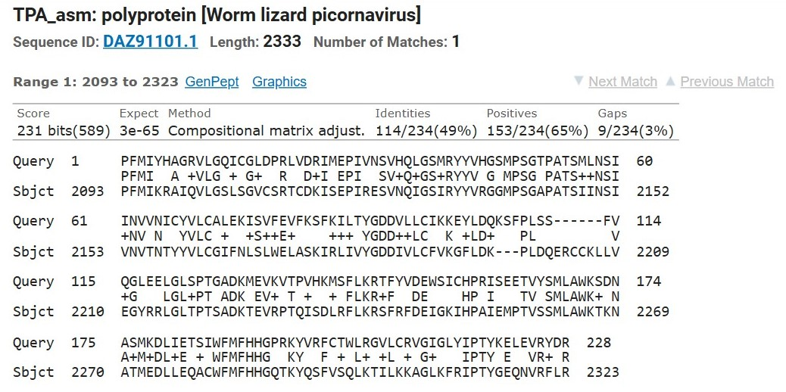
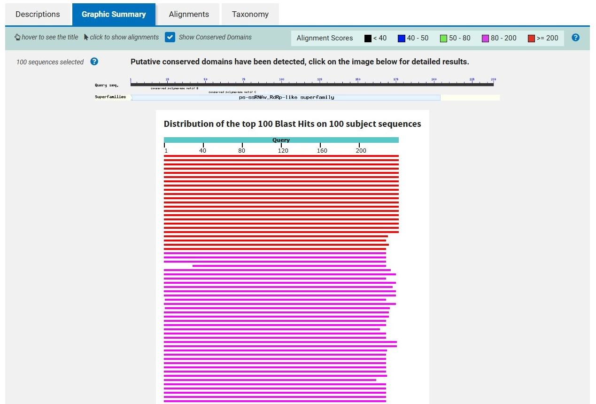
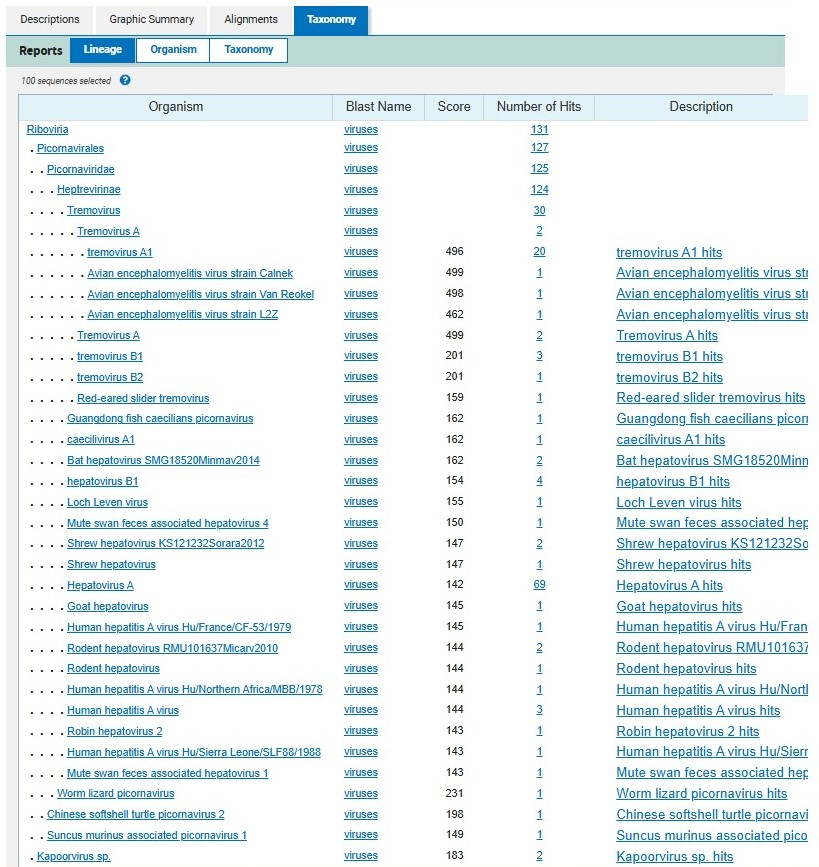

# BlastP Bootcamp
written by: Jade Juba

[20 minutes] **BLASTp, the Basic Local Alignment Search Tool for proteins**, takes a "query" protein sequence, breaks it into pieces, and compares each piece to a database of known proteins. Once it finds a match, it extends the alignment until the entire query sequence is accounted for, then it returns all significant matches it finds. BLASTp can be used to compare sequences, characterize sequences of interest, find proteins with functional and/or structural similarities, and more! After generating a putative open reading frame for your obelisk and decoding the codons into amino acid residues, you can use BLASTp to investigate the oblin(s) it codes for.

**Tutorial Objective**: We will use `BLASTp` to investigate our Oblin and look for similar amino acid sequences.

## Input / Prerequisites
- Access to [BLASTp](https://blast.ncbi.nlm.nih.gov/Blast.cgi?PAGE=Proteins)
- Access to [ORFfinder](https://www.ncbi.nlm.nih.gov/orffinder/), to generate putative ORFs and amino acid sequences from your obelisk
- Web browser
- A protein sequence

Find example data [here](https://www.uniprot.org/uniprotkb/O89281/entry). This link will send you to the `Uniprot` page for the `RdRp catalytic domain-containing protein` of `Tremovirus A`, a virus that infects chickens and some other fowl. On the left-hand menu, click `Sequence`, and in the light-blue box containing the amino acid sequence, click `Copy sequence`. You'll be using it in your tutorial-guided analysis.

## Output

The identification of `amino acid sequences` which have some similarity to our oblin sequence.

### 1. Navigate to the [BLASTp portal](https://blast.ncbi.nlm.nih.gov/Blast.cgi?PAGE=Proteins)

### 2. Create and submit a protein search query

**2.1: Entering our amino acid sequence**

Start by pasting your **amino acid sequence** in the box under the `Enter Query Sequence` titlecard. Make sure to title your sequence with a single line above the sequence, starting with a greater-than sign `>`. This is known as FASTA format. I named my sequence `obelisk223_putative_oblin`. If you have a single sequence, the title you enter will also appear in the `Job Title` box.

Instead of the amino acid sequence, you can also paste an accession number connected to your sequence of interest in a database, or you can upload your sequence to the system as a file (using the `Upload File` button underneath the text box).

The `Query Subrange` section on the right allows you to narrow down your search to a subsequence within your sequence. If you're entering your Oblin sequence, you probably don't know enough about the putative protein to limit the search to a subsequence.

`BLASTp` also allows you to align sequences! If you want to find similarities between two or more putative Oblin amino acid sequences, you can check this box and use this function. Otherwise, don't worry about it!

**2.2: Refining our search**

To refine our search, we can...

- Choose different `Databases` to query. The `Standard databases` consist of traditional GenBank and RefSeq sequences. The `Experimental databases` are smaller databases grouped by organism domains (eukaryotes, prokaryotes, viruses, and others). If you don't know where your data will appear, you better cast a wider net and query the `Standard databases`! There are several types of Standard databases, but the default, and the one we will use, is the `Non-redundant protein sequences (nr)` database, containing non-redundant sequences from many different databases, as well as some environmental whole-genome sequencing samples.
- Choose the `Organism` which our query sequence will be compared against. This is helpful if you only want to find matches from a specific organism, but because we don't know where our Oblin could be found, it would severely and unnecessarily limit our results.
- `Exclude` certain types of proteins or samples. Again, we don't want to limit ourselves, so leave these boxes unchecked!

We can also choose which algorithm BLASTp will use to perform our search. Here, we're going with the good old `blastp (protein-protein BLAST)`. The other options are limiting or there for efficiency, and we don't need to use them for our purposes.

**2.3: BLAST off!**

Press `BLAST` to perform your search. It might take some time to complete.

You'll notice another drop-down box titled `Algorithm Parameters`. These are advanced options for further refining your search and its parameters. We don't need to mess with them right now, but if you're a BLAST expert, feel free to tweak the search to your liking.

### 3. Take a look at your results

It took about a minute, but our `Job` is finally complete! Let's take a look:

Oh. BLASTp searched far and wide and couldn't find any matches for our putative oblin amino acid sequence. Well, I guess it's to be expected - these are novel RNA elements we're looking at. When Zheludev et al. identified oblins 1 and 2, their amino acid sequences didn't match any known protein sequences either. Besides, the ORF we found might not even really code for anything! So don't let this result discourage you: I suggest that you try different putative ORFs from different obelisks in your obelisk family. You may find one that works - otherwise, you can use the [example amino acid sequence](https://www.uniprot.org/uniprotkb/O89281/entry) linked here and above. This link will send you to the `Uniprot` page for the `RdRp catalytic domain-containing protein` of `Tremovirus A`, a virus that infects chickens and some other fowl. On the left-hand menu, click `Sequence`, and in the light-blue box containing the amino acid sequence, click `Copy sequence` and paste it into the query sequence box in `BLASTp`.

### 4. When your query finally works...

Look at that! We queried the Tremovirus A RdRp sequence and got a ton of hits!

The results come in a table with important headings and values.

- `Scientific Name` is the organism from which the target sequence originates.
- `Max Score` and `Total Score` have to do with BLASTp's scoring metric for how similar the query sequence is to the target sequence. `Max Score` is the maximum possible score based on the two sequences, and `Total Score` is the actual score for the query sequence and that particular target. The closer `Total Score` is to `Max Score`, the better the alignment is.
- `Query Cover` is the percentage of your query sequence which is included in the target sequence. This value has to do with the length of the query sequence, so a value of 100% doesn't mean the match is perfect, but it means the entire length of the query can be mapped (perhaps imperfectly mapped) to the target sequence.
- `E Value` estimates the likelihood of a random alignment producing a match that is as good or better than the match between the query and that particular target sequence. A low value indicates that this particular match is a good one and unlikely to occur by chance.
- `Per. Ident`, or `Percent Identity`, is the percentage of aligned amino acid residues which match perfectly between the query and target sequences. The higher this value is, the better the alignment is.
- `Acc. Len`, or `Accession Length`, is the number of amino acids in the target protein sequence.
- `Accession` is the `accession number` of the target amino acid sequence. Clicking the link will take you to that sequence's page on whichever database it came from.

Click on the `Scientific name` of one of the results to see an alignment of your query sequence and the target sequence. I chose to display a result in which the `Percent Identity` was 49%.

This alignment has gaps, mismatches (some are between amino acids with little to no similarity, so there is only a space between the aligned residues, but some are between amino acids with some similarity as defined by a BLOSUM matrix, so there is a plus sign `+` between the aligned residues), and perfect matches. The better an alignment is (as defined by values such as `E Value` and `Percent Identity`), the better an alignment will be.

Take a look at the result with the highest `E-value` - it should be at the top of the list of results. How good is the alignment? Do you think the target sequence represents the protein we queried for?

Spoiler alert: the top hit is the protein we queried for. Now, imagine we had no idea what protein we were looking for, and all we had was the sequence - we would've just found it with BLASTp!

### 5. Explore your results!

You can browse the list of hits, checking out target sequences which have similarity to your query. Follow links to the pages for those target sequences in databases. What organism are those sequences from? If the organism is different from the one which we queried, how similar are those two organisms? Is it the same type of protein (an RNA-dependent RNA polymerase) as your query sequence? 

BLASTp has some other fun outputs. You can get a graphic summary of the matches to your query sequence:

You can also see a taxonomy of the organisms from which sequence similarities were found:

Play around with it! The little question mark icons within blue circles can be clicked, and they'll provide more information about what you're seeing or doing.

### Conclusion

That's it! You've used `BLASTp` to find amino acid sequences with similarity to your query sequence!

You've explored protein sequence alignments, orthologs, and taxonomy - but BLASTp can only go so far. Think of it as the beginning into an investigation of your amino acid sequence. In this case, we know what our query sequence is, and if we thought a little bit about what the results may be beforehand, we probably would've predicted that we'd get RdRp proteins from the same and similar viruses. But if we were querying a putative amino acid sequence for an uncharacterized protein - like we would've been if our oblin queries yielded any significant results - each significant alignment would represent a pathway leading to discovery. The structure of a similar protein could give us some idea as to what conformation our oblin might take. The function of that protein may tell us something about what our oblin does. On the off chance that our oblin was picked up on in some experiment and loaded into a database, we could learn more about where that oblin is found - what organism, what tissue, what geographic location, etc. Sequence similarity can imply structural and functional similarity, but be careful not to over-conclude. Search for literature, formulate testable hypotheses, and brainstorm experiments or analyses that would allow you to reject your null hypothesis. Most importantly, have fun in your analyses!

### See Also:

- [BLAST: at the core of a powerful and diverse set of sequence analysis tools](https://pmc.ncbi.nlm.nih.gov/articles/PMC441573/)
- [BLAST tutorial from the UC Berkeley Library](https://guides.lib.berkeley.edu/ncbi/blast)
- [The OG paper on BLAST](https://www.sciencedirect.com/science/article/abs/pii/S0022283605803602)
- [A guided example of using BLAST to detect and interpret sequence homology](https://community.gep.wustl.edu/repository/course_materials_WU/annotation/Detecting_Interpreting_Genetic_Homology.pdf)