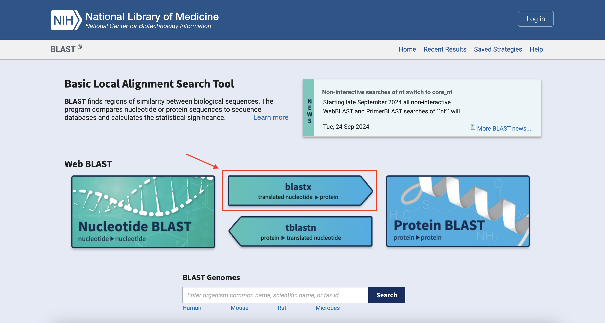
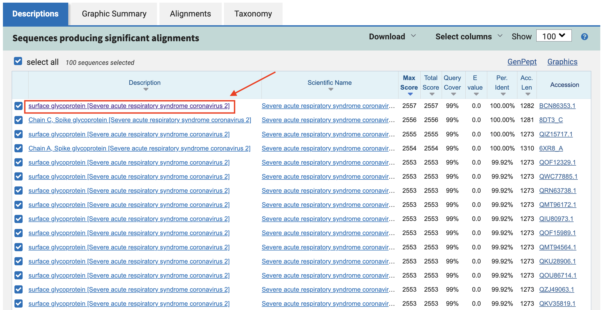
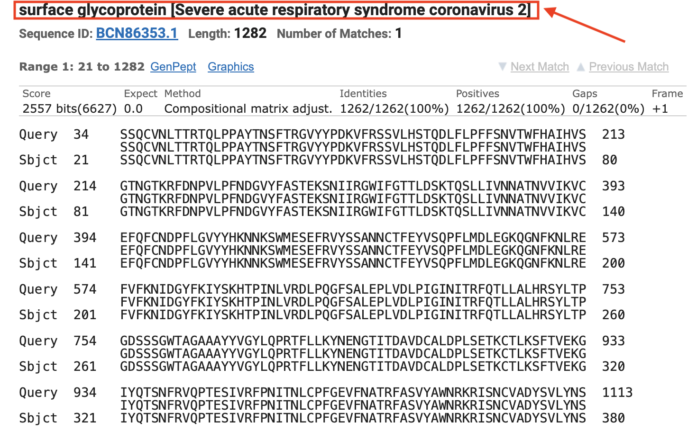
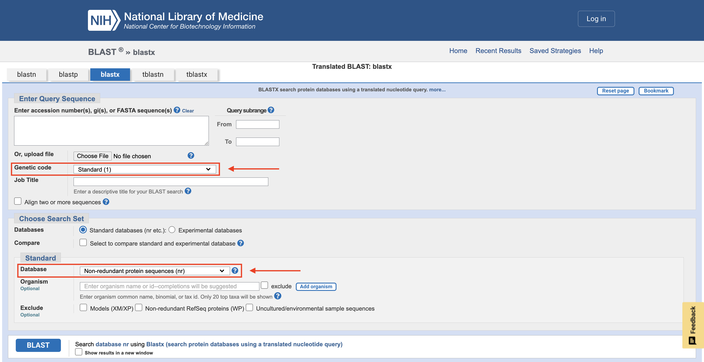

# BLASTx
written by: [Isha Singh](https://github.com/its-isha-singh)
Edited by: [Jierui Wang](https://github.com/WJerry66)

[8 minutes] In this tutorial we will explore BLASTx, a tool that enables researchers to determine the protein encoded for in their nucleotide sequence of interest. By comparing your sequence to annotated proteins, BLASTx helps reveal potential viral functions, evolutionary relationships, and candidate genes for further study. BLASTx accepts nucleotide sequences (FASTA format, accession numbers, or GI identifiers) and translates them in all six reading frames before comparison, then output a ranked list of protein matches by statistical confidence (E‑value, percent identity, query coverage). This tool can help characterise a viral protein
encoded in a sequence of interest by aligning the amino acid sequence of the encoded protein to other closely related and annotated proteins. This makes BLASTx especially powerful for characterizing unknown viral contigs or confirming gene identity in metagenomic datasets.

**Tutorial Objective**: The tutorial will enable you to make use of BLASTx to
determine the identity of the protein encoded in your sequence of interest.

## Input / Prerequisites
- [BLASTx Weblink](https://blast.ncbi.nlm.nih.gov/Blast.cgi)
- [Example data](https://www.ncbi.nlm.nih.gov/nuccore/NC_045512.2?report=fasta&log$=seqview)-[spike gene region, positions 21,563–25,384](https://covid-19.ensembl.org/Sars_cov_2/Gene/Sequence?db=core;g=ENSSASG00005000004;r=MN908947.3:21563-25384;t=ENSSAST00005000004)
- This tool takes accession number(s), gi(s), or FASTA sequence(s) as inputs.

## Output

A table of sequences producing significant alignments to the protein encoded by
the nucleotide sequence of interest, and contains the following columns:

1. **Description**: This gives the database sequence that aligns with the query. May include
functional annotations, such as the name of the gene, protein, or functional category
of the sequence (e.g., hypothetical protein, ATP synthase, ribosomal protein).
2. **Scientific Name**: This gives the organism from which the aligned sequence originates.
to help identify the source of the matching sequence (e.g., _Escherichia coli_,
_Homo sapiens_, etc.).
3. **Max Score**: This is the highest alignment score between the query and a sequence
in the database. It reflects the best match in terms of similarity between the
query sequence and the database sequence, with higher scores indicating better
matches. The score is based on the quality of the alignment, including factors
like gap penalties, match/mismatch, and other parameters.
4. **Total Score**: The total score is a sum of the individual alignment scores for
all high-scoring pairs (HSPs) between the query and the sequence in the database.
5. **Query Cover**: This is the percentage of the query sequence that aligns with
the database sequence. A higher query cover (e.g., 80% or higher) suggests that a
large portion of the query sequence has a significant alignment with the database
sequence. Low query cover indicates only a small part of the query sequence aligns well.
6. **E value**: The expectation value is a statistical measure of the number of
alignments with scores equal to or better than the one observed, that would be
expected to occur by random chance in a database of a given size. A lower E value
indicates a more significant alignment (i.e., less likely to occur by chance).
For example, an E value of 1e-10 means the alignment is highly significant, while
an E value of 1 means the alignment is not statistically significant.
7. **Percent Identity**: This shows the percentage of identical matches between
the aligned query and subject sequences. It’s a measure of how similar the sequences
are at each position in the alignment. Higher percent identity values (e.g., > 90%)
typically indicate a strong and reliable match between the sequences.
8. **Accession Length**: The length of the sequence in the database that aligns with
the query.
9. **Accession**: The accession is a unique identifier for the database sequence
that was matched. It’s usually a string of characters assigned to each sequence in
the database. This accession number caan be used to look up more detailed information
about the sequence in the database.

### Obtaining the nucleotide sequence for the SARS-CoV-2 spike protein

1. Visit the [example data weblink](https://www.ncbi.nlm.nih.gov/nuccore/NC_045512.2?report=fasta&log$=seqview).
2. Highlight and copy the nucleotide sequence of the spike protein.

### Using BLASTx

3. Click on _blastx_ after navigating to the [BLAST home page](https://blast.ncbi.nlm.nih.gov/Blast.cgi).



4. Paste the nucleotide sequence into the query box.
5. Leaving all settings to default, click _BLAST_.
- This step is usually time consuming, since it depends on the queue and internet speed.


6. Select a protein hit to view its alignment to our protein.
- To understand how to biologically interpret each of the columns in the output
table, refer to the _Output_ section at the start of the tutorial.



- Scroll down to view the complete alignment.



- We have determined that our sequence of interest encodes the SARS-CoV-2 surface
glycoprotein!

### Interpreting Results
1. BLASTx confidence is primarily based on the E‑value:

$$
E = K \cdot m \cdot n \cdot e^{-\lambda S}
$$

where \(m\) = query length, \(n\) = database size, \(S\) = alignment score, and \(K, \lambda\) are statistical parameters.  
Lower E means the match is less likely to occur by chance.

2. Thresholds
$$
\text{Strong significance: } E \leq 10^{-50}, \quad \text{percent identity} \geq 30\%, \quad \text{query cover} \geq 70\%
$$

$$
\text{Moderate confidence: } 10^{-10} \leq E \leq 10^{-50}
$$

$$
\text{Not significant: } E \geq 1
$$
3. Cite result as figure
- include: query sequence ID, top hit accession, percent identity, query coverage, E‑value. 
- document: database searched, BLASTx version, parameters (default vs custom), and date of search (databases evolve).
Example Legend: 
```
Figure 1. BLASTx alignment of SARS-CoV-2 spike gene (NC_045512.2, positions 21,563–25,384) 
against NCBI nr database. The top hit was “surface glycoprotein [Severe acute respiratory 
syndrome coronavirus 2]” (Accession YP_009724390.1), with 100% query coverage, 99.9% 
identity, and E-value = 0.0. BLASTx was run on 27 Nov 2025 using default parameters 
against the non-redundant protein database. This figure demonstrates reproducible 
identification of the spike protein.
```
### Some notes on BLASTx

1. If there is a specific organism's genetic code that you are interested in blasting
your sequence against, you may select this organism's genome in the _Genetic code_
drop down option present in the _Enter Query Sequence_ section.
2. You may also choose to blast your query sequence against sequences in a different
databse and can do so by selecting your database of interest in the _Database_ drop
down in the _Standard_ section under _Choose Search Set_.



### Conclusion

That's it! You've used BLASTx to determine what protein(s) may be encoded in your
nucleotide sequence of interest! You should now be able to use this tool for any other
nucleotide sequences of interest.

### See Also:

- [Paper describing the tool](https://pubmed.ncbi.nlm.nih.gov/2231712/)
- [Guidelines for citing NCBI services and databases](https://support.nlm.nih.gov/kbArticle/?pn=KA-03391)
- [AlphaFold (3D structure prediction)](https://alphafold.ebi.ac.uk/)
- [Protein functional analyses](https://www.ebi.ac.uk/Tools/pfa/)