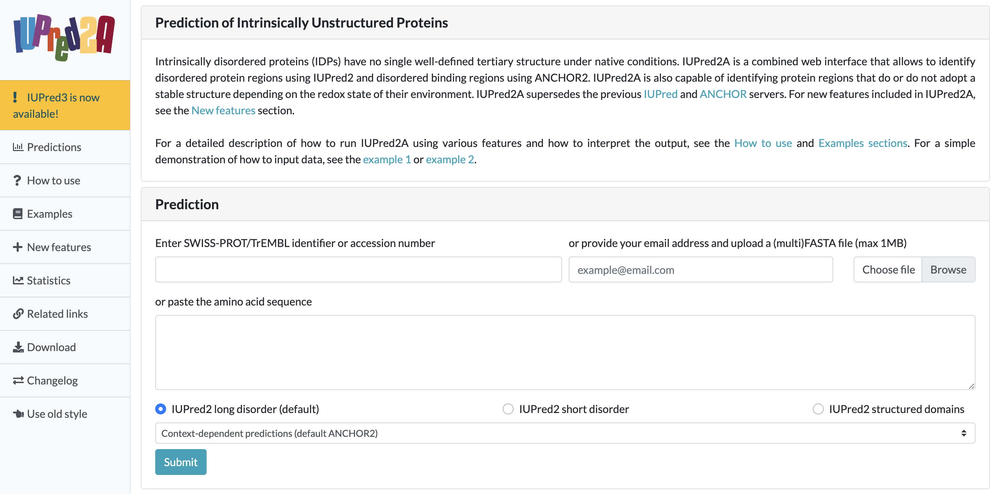
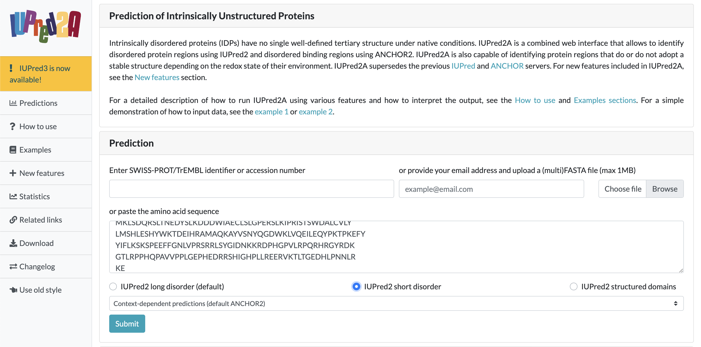
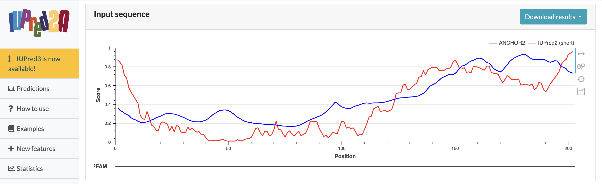

# IUPred2A

written by: [Caleb Ji](https://github.com/calebji123) edited by: [Merrilyn Chen](https://github.com/merrilynchen)

[4 minutes] IUPred2A is a tool that looks for intrinsically unstructured regions in a protein. To use this tool, users input a protein sequence and the tool outputs a graph that provides information on the predicted structures of the protein, specifically disordered and ordered regions. These disordered regions are separate from glubular, ordered, regions and can carry several functions, such as protein-protein interactions or serve as linkers between ordered domains. IUPred2A can also be used in combination with other protein structure prediction tools such as Alphafold to better predict the disordered regions in a protein. Virus proteins are often poorly classified and include many ordered or disordered domains. Providing confidence that a region is disordered and not just complex to fold is important to validate 3D structure.

**Tutorial Objective:** We will take a protein sequence and use IUPRED2A to find the unstructured regions.

## Input / Prerequisites

-   [Tool Weblink](https://iupred2a.elte.hu/)

-   [Link to example data](img/IUPred2A/Oblin_sequence_674.fa)

-   If you want to use your own protein, you can obtain the protein sequence of interest from the nucleotide sequence using the [ORF finder](https://www.ncbi.nlm.nih.gov/orffinder/). Look for the ORF of interest and copy its protein sequence.

## Output

Running the tool will give a graph, providing data on the prediction of how unstructured a region is for each amino acid. This is represented by the IUPred2 line. The ANCHOR2 line, usually similarly shaped, represents the disordered binding regions.

### 1. The protein sequence

This example will take a look at an Oblin-1 protein found for a specific Obelisk cluster. Obelisks are a new RNA virus class. Copy the sequence from the link above to use in subsequent steps.

### 2. IUPred web app

Navigate to <https://iupred2a.elte.hu/>. You will see a quick introduction and some examples for the tool on different proteins. Take a look for some human examples. There are 3 different methods to add the protein sequence into the IUPre2A software: `SWISS-PROT/TrEMBL identifier or accession number` if the protein sequence is in the UniProt database, `paste the amino acid sequence` into the box (spaces and non-standard charcters will be removed and anything added into the box will be treated as one continuous sequence), or `upload a FASTA file` and the results will be emailed to you.

 Figure 1: Landing page for IUPred2A. This is also where you would input your protein sequence.

### 3. Choose options and submit

To predict the structural disorder of a protein, users can either choose between `IUPred2 long disorder` or `IUPred2 short disorder`. Long disorder is used when there is at least 30 consecutive residues of a protein, whereas short disorder is better used to predict short disordered regions, such as missing residues in the X-ray structure. The `IUPred2 structured domains` option is useful for predicting ordered protein regions. This is for users interested in determining the putative structured domains of a protein. This can be used to compare and contrast with other tools with similar functions for structure determination. For this example, since the protein is quite short, it is better to use the `IUPred2 short disorder` option. Keep everything else the same and then hit submit.

 Figure 2: IUPred2 Search query filled out with described settings.

### 4. See results

Now you will see the results as a graph! On the x axis is the amino acid position and the y axis shows how unstructured the protein is predicted to be (red line). Look for regions of high unstructure score, and match that to the predicted protein structure from tools like alphafold, does it make sense? Download the results or take a screenshot to save the data.

 Figure 2: IUPred2A result graph. The graph shows intrinsic disorder prediction scores along the 200-residue protein sequence. Two prediction methods are displayed: ANCHOR2 (blue line) predicting disordered binding regions, and IUPred2 (red line) predicting general intrinsic disorder. The horizontal line at score 0.5 represents the threshold for disorder prediction; residues with scores above 0.5 are predicted as disordered (IUPred2) or capable of disorder-to-order binding transitions (ANCHOR2). Using the `IUPred2 short disorder` mode with default settings, the results show a short N-terminal disordered region, a structured core and a C-terminal disordered binding region. High ANCHOR2 scores also suggest that the C-terminal region is a possible disordered binding site. The version used for this output is IUPred2A.

### 5. Interpretating Results

IUPred measures the confidence of a disordered region by estimating the energy of a residue in an amino acid sequence using the following formula [Mészáros et al., 2018]:

$e_i^k = \sum_{j=1}^{20} P_{ij} \cdot c_j^k$

Where $e_i^k$ is the estimated energy of the residue at position $k$ of amino acid type, $i$ $P_{ij}$ is the $(i,j)$-th element of the $20 \times 20$ energy predictor matrix, $c_j^k$ is the $j$-th element of the amino acid composition vector, representing the ratio of amino acid type $j$ in the sequence neighborhood of position $k$. The energies are smoothed with a window size and then transformed into a score between 0 and 1, which can be interpreted as quasi-probabilities of a given residue being disordered. Residues with favorable (low) energies are predicted as ordered; residues with unfavorable (high) energies are predicted as disordered. The common/accepted thresholds for "true positive" or "significance" outputs is 59.6% when using 5% false positive rates and 68.72% when using 10% false positive rates [Mészáros et al., 2018].

Another result that is found when using IUPred2 is the ANCHOR2 line, which measures the confidence for the identification of disordered binding sites. Similarly, it also measures the energy of a residue in an amino acid sequence, but it also includes estimates for the energy associated with an interaction with a globular protein and with the local disordered sequence environment [Mészáros et al., 2018]. These additional estimates are added onto the following formula:

$S_k =(E_{gain,k}(w_1) - E_{gain,0})(I_k(w_2)-I_0)$

The common/accepted thresholds for "true positive" or "significance" outputs is 64% when using a false positive rate of 5%

The output can be used in the creation of a "Figure" as a line graph that shows the disorder/binding propensity along the protein sequence. For a reproducible analysis, it is necessary to document the tool version, prediction type, protein sequence (identifier or sequence), threshold values, and any additional changes made to the analysis in the legend. An example of this can be seen in the previous section [Mészáros et al., 2018].

# Conclusion

That's it! You've used IUPred2 to look for unstructured regions in the protein!

IUPred2 is a simple tool with a striaghtforward result. The main takeaway is that knowing the unstructured regions help you place more confidence in the predicted folding structure of the protein. However, take some time to think about other applications!

See Also:

[IUPred2A: context-dependent prediction of protein disorder as a function of redox state and protein binding](https://academic.oup.com/nar/article/46/W1/W329/5026265)

[AIUPred, IUPred 3.0 newest version](https://iupred.elte.hu/)

This information was edited using a generative LLM model [Claude, Sonnet 4.5, November 28, 2025]