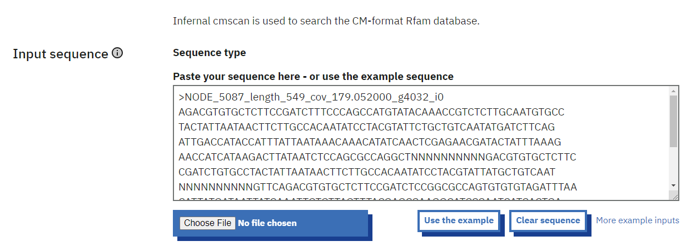
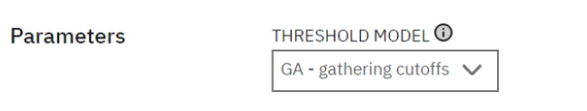
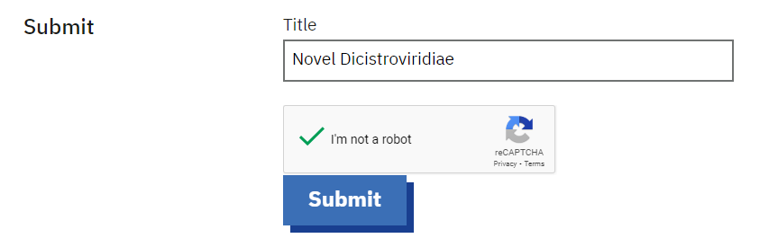
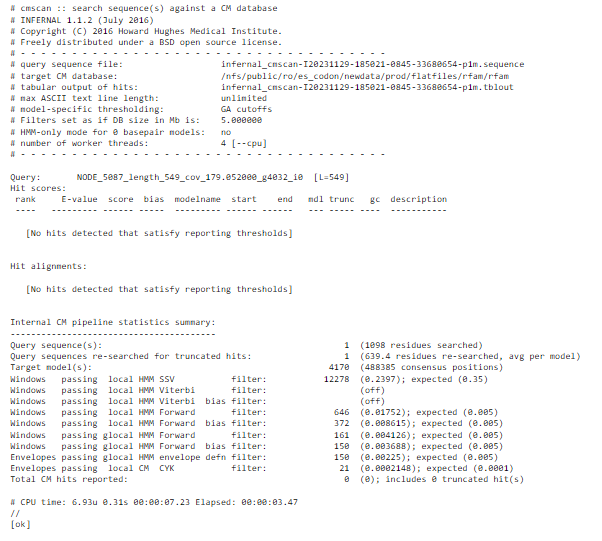
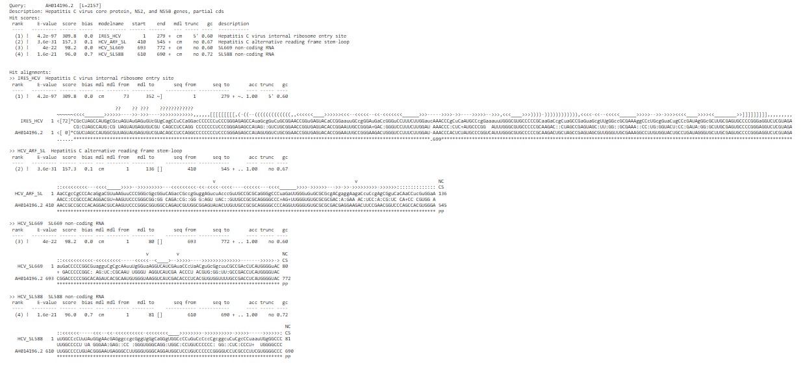
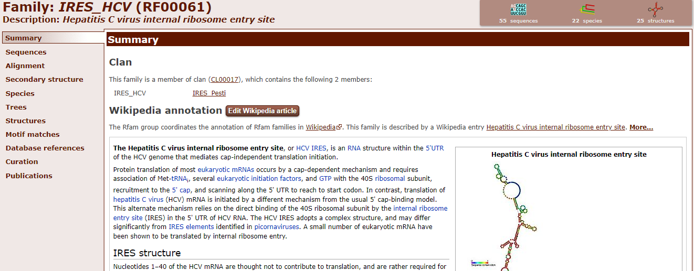

# Infernal
written by: [Matea Maurice](https://github.com/MAM122)

[10 minutes] Infernal is a tool that takes in a sequence and analyzes it against the Rfam database to search for conserved elements in your sequence that likely encode for non-coding RNAs. It uses statistical models of RNA consensus structures (structural motifs or conserved sequences) in the database called covariance models (CMs) and determines if your sequence matches any of these conserved structures. If you are looking at a new virus sequence, you can begin to characterize it by using this tool to determine if it encodes for any non-coding RNAs which play vast roles in biological processes. Some RNA viruses encode non-coding RNA molecules (e.g., in this [Nature study](https://www.nature.com/articles/cmi201786), the Flaviviridae genome encodes a non-coding RNA in its 3'UTR). 

**Tutorial Objective**: We will use Infernal to determine if the sequence of a novel RNA virus related to the Dicistroviridae family of viruses contains regions that are predicted to encode for non-coding RNAs. 

## Input / Prerequisites
- Web Browser
- [Tool Weblink](https://www.ebi.ac.uk/jdispatcher/rna/infernal_cmscan)
- A nucleic acid sequence in the format described at: https://www.ebi.ac.uk/jdispatcher/docs/formats/

## Output
The identification of potential non-coding RNA families or motifs in your sequence. These will be your hits which will have a corresponding E-value, it will show the alignment of the RNA family sequence (target) to the similar region in your query sequence (specified by the start and end positions), and it will tell you the name of the RNA family or motif matched. The output will show up on the web browser and can also be downloaded as a text file. You can use it to identify any regions in your sequence that resemble known non-coding RNA families or motifs.

### 1. Navigate to https://www.ebi.ac.uk/jdispatcher/rna/infernal_cmscan

### 2. Enter Your Sequence 

Paste in your sequence. Below I have pasted in the sequence of a novel dicistrovirus. 

You can copy the sequence from your fasta file into the textbox (fasta format). You can also use a sequence of a [different format](https://www.ebi.ac.uk/jdispatcher/docs/formats/) as mentioned above. 

### 3. Selecting Your Parameter

There is a dropdown menu that gives you the option of choosing either GA - gathering cutoffs, NC - noise cutoffs, or TC - trusted cutoffs as your parameter.

GA gives hits that are above the GA threshold which is the bit score of the lowest-scoring sequence considered part of the family. The hits that are above the threshold are considered to be more significant and reliable matches. 

NC gives hits that are below the noise cutoff. These hits are considered to be noise or false positives, thus this parameter helps to filter out the matches that occurred just by chance due to noise. 

TC gives hits that are above the trusted threshold (a higher threshold than the GA threshold). These matches are ones that are highly significant and reliable (they may be included in the hits from GA but the lower significant hits will show up in GA but not in TC). 

You can choose one of the parameters based on your preference. You can also repeat the procedure trying all three of the parameters.  

### 4. Title Your Submission and Submit

Add a title to your submission then click the submit button.

You will then get an output in the browser that tells you that your job has been submitted and to wait. This will take a few seconds or longer.  

### 5. Analyze the results (example with no hits)

My novel virus got no hits as seen from the results below. This tells me that there are no regions in my virus that are predicted to encode for non-coding RNAs. If you get the same result, you can try submitting your sequence again using a different parameter/threshold model or you can move on to using another bioinformatics tool to characterize your novel virus. 

### 6. Analyze the results (example with hits)

To show an example of an output where the sequence does have hits, I submitted the sequence of the Hepatitis C virus core protein (2157 bp) into the tool. I got this sequence from the NCBI database: https://www.ncbi.nlm.nih.gov/nuccore/AH014196.2.  

I got the output results below: 

As seen from the results, we got four hits ranked based on the most confident (lower E-value and higher score) to the least confident hits. The region in the sequence from base pair 1 to 279 is likely to encode for IRES_HCV which is a Hepatitis C virus internal ribosome entry site. I learned this by searching "IRES_HCV" in the [Rfam database](https://rfam.org/) which is the database for non-coding RNA families and motifs. The links it provides directs you to wikipedia pages that explain the function of the non-coding RNA structure. You can repeat this for all other hits: HCV_ARF_SL, HCV_SL669, and HCV_SL588. You can also see the alignments of the non-coding RNA family or motif sequence to the region in your RNA sequence (you can see the matches and mismatches between the sequences). The middle sequence is the consensus sequence. 

### Conclusion

That's it! You've used the Infernal tool to determine if your sequence has any matches to non-coding RNA families or motifs!

Using this tool, you can determine if your sequence has any regions that encode for non-coding RNAs. The matches/hits that you get to non-coding RNA families or motifs can tell you information about what that region of your sequence potentially encodes for. Non-coding RNAs have vast roles in biological processes. This tool will take you one step forward towards characterizing your novel virus.

### See Also:

- [Publication Name](https://europepmc.org/article/MED/35412617)
- [Additional useful link](https://www.ebi.ac.uk/seqdb/confluence/display/THD/Infernal+cmscan)
- [Learning more about the Rfam database](https://rfam.org/)
- [Understanding E-values and Bit scores](https://www.metagenomics.wiki/tools/blast/evalue)
