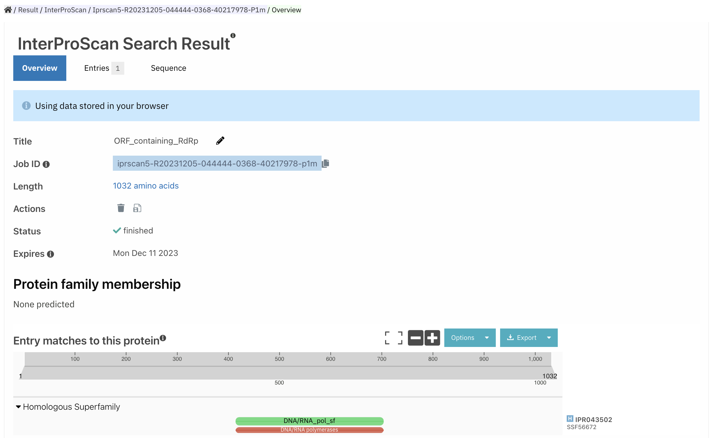
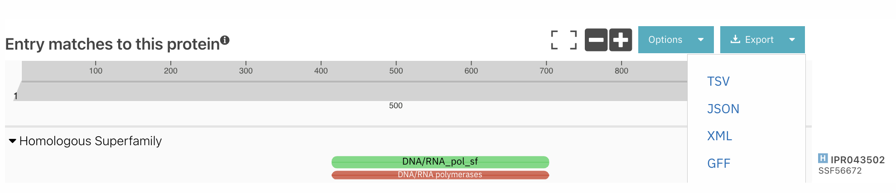
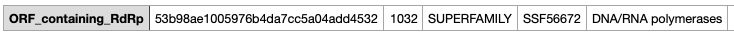

# InterProScan
written by: [Katarina Vucic](https://github.com/katarinaavucic)

[15 minutes] This tutorial introduces InterProScan, a tool designed to identify protein domains within a given protein sequence. InterProScan works by matching input sequences against InterPro protein signature databases, providing detailed reports on predicted functional domains, including their superfamily information, where they map to amino acid sequences, the significant (E-values), and related pathways. This tutorial specifically focuses on using InterProScan for Virus Discovery, using the example of an uncharacterized virus with a potential Narnavirus classification.

**Tutorial Objective**: By the end of this tutorial, you will be able to use InterProScan to identify potential protein domains in a given protein sequence.

## Input / Prerequisites
- [Tool Weblink](https://www.ebi.ac.uk/interpro/result/InterProScan/)
- [Tutorial Data](img/template/ao.fa)
- In order to use InterProScan to analyse your virus, you need a protein sequence of the region you would like to analyse. For this tutorial, we will be using the protein sequence containing the RdRp (RNA-dependent RNA polymerase). The protein sequence used in this tutorial is provided in the dropbox, but if you would like to try with your own virus the steps are as follows:
  1. Identify the candidate RdRp contigs for your virus. 
  2. Run the contig nucleotide sequence through [ORFfinder](https://www.ncbi.nlm.nih.gov/orffinder/), to find an ORF (Open Reading Frame) that matches this contig.
  3. Download the longest ORF; this is the ORF that is most likely to contain the contig. 

## Output

After running InterProScan, you will receive a detailed report that includes information about the predicted functional domains for each protein sequence in your .fa file. For each domain you are given the superfamily, what regions of the amino acid sequence they were mapped to, how significant this mapping was (E-value), and related pathways involved with the superfamily. You can save it as a TSV, JSON, XML, or GFF file. This output is valuable for understanding the potential functions of the viral proteins you are analyzing.

### 1. Getting to know this virus.

The example virus we will be using to walk through this search is an uncharacterized virus found in an SRA run by  [serratus.io](https://serratus.io/). Through previous work, it was identified that the highest match for this this virus was a percent identity (pid) of 39% with a Narnavirus. Narnaviruses are single-stranded RNA viruses that encode a single protein, the RdRp [(ICTV)](https://ictv.global/report_9th/RNApos/Narnaviridae). 

In this tutorial, we will use InterProScan to see if this virus contains protein domains that can be found in Narnaviruses to support our hypothesis that this is a highly diverged narvnavirus!

Locate and download the `potential_narnavirus_ORF.fa` file from the `img/InterProScan/` folder.

### 2. Navigate to [InterProScan](https://www.ebi.ac.uk/interpro/search/sequence/).

You will notice that there are three tabs: `by sequence`, `by text`, and `by domain architecture`. The `by text` tab allows you to search for specific families, domains, proteins, keywords, or GO terms, and the `by domain architecture` tab lets you search for proteins that include/exclude specific domains.

For the purpose of this tutorial we will be using the `by sequence` tab, which takes a protein sequence as input and matches it against InterPro protein signature databases.

Figure 1: InterProScan Search Page.\
 

### 3. Submitting your job.

Click `Choose file` and upload the `potential_narnavirus_ORF.fa` file to InterProScan. Your screen should look like Figure 2.

Figure 2: InterProScan Search Page for Uncharacterized Virus.\
 

`Advanced Options`: InterProScan contains an advanced options area, where you can select which databases you would like to look at. For the purposes of this tutorial (and your assignment), you should leave all databases selected. Since this virus is uncharacterized, we want to recieve as much information as possible!

Figure 3: Advanced Options for InterProScan Search.\
 

Now, click `Search`!

### 4. Analyzing your job results.

After submitting your job, you will be brought to a waiting page with all of your previous jobs. The `potential_narnavirus_ORF.fa` job should take 2-3 minutes to complete, and then you are ready to open it.

Figure 4: Job Results Page.\
 

Click on `lcl|ORF4:66:3164 unnamed protein product`.

Figure 5: Protein Results Page.\
 

Notice that the Protein family membership, InterPro GO terms, and PANTHER GO terms have no predictions (significant results). This is unfortunate but not surprising; we are dealing with a diverged virus after all!

There is only one match to a protein family, the DNA/RNA polymerase superfamily on the 417-699 amino acids. Click on the `IPR043502` text to the right of the *Entry matches to this protein* section. It will bring you to another screen, listing the information of this protein superfamily.

### 5. Analyzing a protein superfamily.

This superfamily includes many types of DNA and RNA polymerases, including the RNA-dependent RNA-polymerase (RdRp)! This is confirmation that we are analyzing the most significant portion of the virus.

Figure 6: DNA/RNA Polymerase Superfamily Page.\
 

There is a side bar on the left of the screen, with the following utilities:\
- `Proteins`: a list of proteins in UniProt with matches to this superfamily.\
- `Taxonomy`: a representation of the distribution of matches of this superfamily across different phylogenic levels.\
- `Proteomes`: a list of proteomes in UniProt that have proteins matching this superfamily.\
- `Structures`: a list of structures in the Protein Data Bank that match to this superfamily's structure.\
- `AlphaFold`: a predicted visualization of the protein superfamily using AlphaFold.\
- `Pathways`: a list of pathways containing proteins that have been linked to this superfamily.\

The two areas we will be looking at are `Taxonomy` and `AlphaFold`.

#### `Taxonomy`

Clicking on `Taxonomy` will bring you to a **sunburst** view of the taxonomy. We can see that viruses make up half of the documented cases of this superfamily, which is a good sign! However, we are not able to get a close enough view into whether or not Narnaviruses are found to have these domains. To do this, we will go to the **tree** view of the taxonomy, by clicking the second icon in the grey bar on top of the diagram.

Figure 7: Taxonomy Sunburst Page.\
 

This will bring us to a tree version of the chart. First, click the root node, and then click all the way down the Narnavirus classification:

`root` > `Viruses` > `Riboviria` > `Orthornavirae` > `Lenarviricota` > `Amabiliviricetes` > `Wolframvirales` > `Narnaviridae` > `Narnavirus `

Figure 8: Taxonomy Tree Page.\
 

Narnaviruses include two known Narnaviruses and unclassified Narnaviruses. There are 221 proteins that match with this superfamily and belong to Narnaviruses. We now have further validation that this protein has been found in other Narnaviruses, so this contig could be a Narnavirus.

#### `AlphaFold`

Clicking on AlphaFold allows you to examine a predicted visualization of the protein superfamily, giving us a look at what the RdRp domain should look like in this virus.

Figure 9: AphaFold Page.\
 

### 6. Download your results.

Return to the main page and click the `Export` button. You can download your results in a `TSV`, `JSON`, `XML`, or `GFF`.

Figure 10: Protein Results Page.\
 

Your results should look like this!

Figure 11: Resulting TSV File.\
 

### Conclusion

That's it! You've used the InterProScan to classify protein domains in a virus' protein sequence!

InterProScan is a powerful tool for identifying protein domains within a given protein sequence. In this tutorial, we applied InterProScan to Virus Discovery by using an uncharacterized virus as an example. By following the instructions, users can navigate through InterProScan, analyze job results, and gain valuable insights into the potential functions of viral proteins. This tutorial equips users with the knowledge and skills needed to use InterProScan for effective protein domain analysis in the context of virus research.

### See Also:

- [InterPro in 2022](https://academic.oup.com/nar/article/51/D1/D418/6814474)
- [InterPro Tutorials and Webinars](https://www.ebi.ac.uk/interpro/help/tutorial/)
