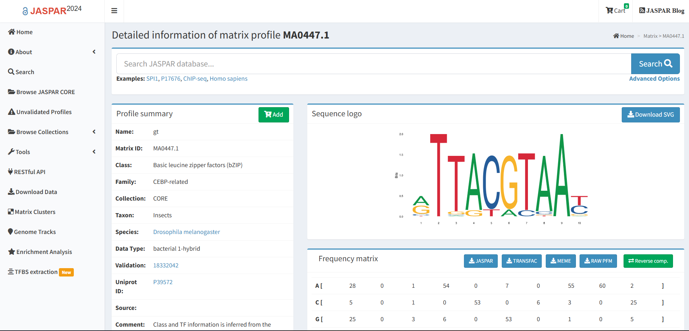
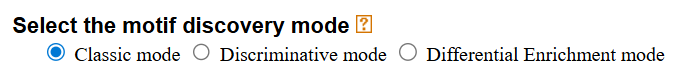
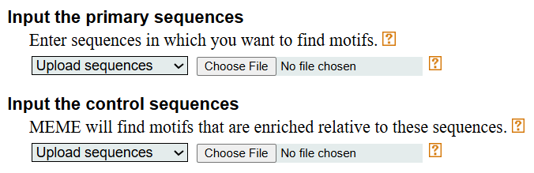
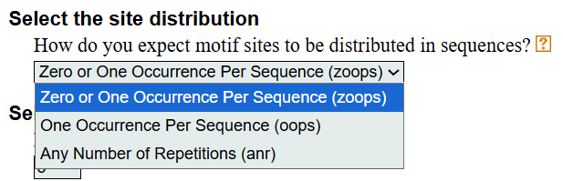
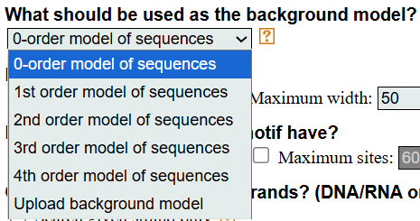
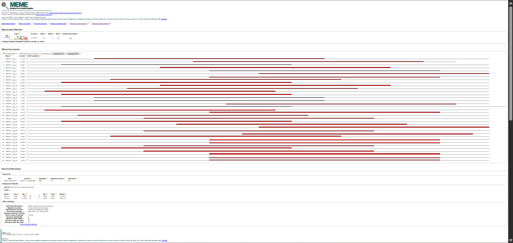
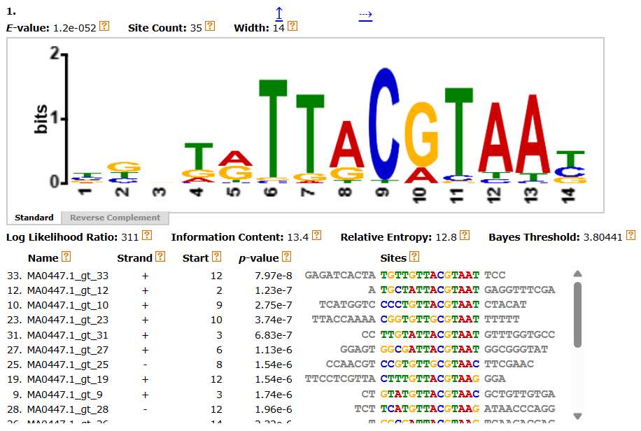
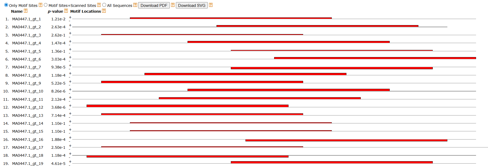
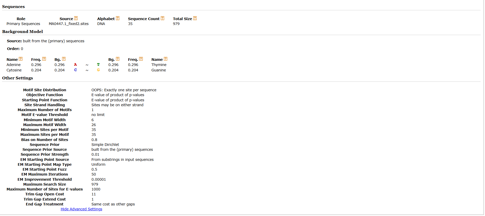

# MEME (Multiple EM for Motif Elicitation)
written by: **Tee Zheng Xuan** (https://github.com/zhengxuantee-cpu)

[15 minutes]  
MEME (Multiple EM for Motif Elicitation) is a computational tool for discovering novel sequence motifs—short, recurring patterns that are statistically enriched within sets of DNA, RNA, or protein sequences. It identifies these motifs using an iterative Expectation–Maximization algorithm and outputs position weight matrices (PWMs), sequence logos, motif sites, and enrichment statistics. In virus discovery, MEME can reveal conserved sequence features such as replication signals, packaging motifs, or viral family–specific sequence signatures within assembled contigs or ORFs.

**Tutorial Objective:**  
Use MEME to discover motifs enriched in a set of primary sequences, interpret motif outputs, and understand how MEME’s classic, discriminative, and differential modes influence motif discovery.

---

## Input / Prerequisites

**(1) Access to MEME Suite (web version):**  
https://meme-suite.org/meme/tools/meme

**(2) Sequences in either:**  
- FASTA format  
- BED format (MEME will automatically extract sequences from a chosen genome)

**(3) Unique Sequence Identifiers**  
e.g., `>MA0447.1_gt_1`  
(Required—MEME rejects duplicated IDs.)

**(4) Optional parameters to modify:**

**Sequence-set related:**  
- Control sequences for discriminative/differential modes

**Motif occurrence models:**  
- *oops* — One Occurrence Per Sequence  
- *zoops* — Zero or One Occurrence Per Sequence  
- *anr* — Any Number of Repetitions  

**Motif discovery settings:**  
- Number of motifs to find  
- Motif width (min/max)  
- Expected number of sites  

**Background model:**  
- A custom background model (0-order or higher)

**Special options (used only in specific cases):**  
- Single vs double-stranded search  
- Palindromic motif restriction  
- Sequence shuffling for background estimation

---

## Output

MEME produces sequence logos, E-values, detailed motif statistics (accessible through the “More” panel), and a table of motif locations showing where each site appears in your sequences. It also reports the full input settings used in the run to ensure reproducibility.

---

### 1. Navigate to MEME  
https://meme-suite.org/meme/tools/meme

---

### 2. Input Preparation 

Prepare your input sequences in **FASTA** or **BED** format.

- **FASTA:**  
  Each sequence must have a unique identifier (e.g., `>seq_1`, `>MA0447.1_gt_1`).  
  MEME rejects duplicate IDs or IDs with spaces.  
  In this tutorial, we use the **MA0447.1** transcription factor binding dataset for **gt** (*Drosophila melanogaster*):  
  https://jaspar.elixir.no/matrix/MA0447.1/


- **BED:**  
  MEME extracts sequences automatically using the selected genome build.

Optional refinements:
- Add control sequences for discriminative or differential searches  
- Supply a custom background model for biased sequences  
- Choose the number of motifs (default = 3)


---

### 3. Selecting Discovery Mode

**1. Classic Mode**  
- Discovers motifs enriched within a single sequence set by comparing observed nucleotide patterns against a background model derived from the input sequences.  
- Best used when only one dataset is available and you want to identify general conserved motifs without comparing two conditions.

**2. Discriminative Mode**  
- Requires both *Primary* and *Control* sequence sets.  
- Identifies motifs that are significantly more common or more strongly conserved in the Primary set.  
- Uses a position-specific prior (PSP) to guide the EM algorithm toward motifs that differentiate the two sets.  
- Useful for condition-based comparisons (e.g., infected vs. uninfected, bound vs. unbound regions).

**3. Differential Enrichment Mode**  
- Also requires Primary + Control sequences, but focuses on differences in **site counts** rather than PWM structure.  
- Uses a hypergeometric enrichment model to test whether motif occurrences are significantly overrepresented in the Primary set.  
- Best for short motifs or when the biological question centers on motif *presence or absence* instead of detailed motif shape.

  


---

### 4. Choosing Motif Occurrence Model

**OOPS (One Occurrence Per Sequence)**  
- Assumes every sequence contains exactly one motif instance.  
- Fastest model; produces sharp, well-defined PWMs.  
- Should only be used when true motif presence is expected in all sequences.

**ZOOPS (Zero or One Occurrence Per Sequence)**  
- Allows each sequence to have either none or one motif instance.  
- More flexible and realistic for many biological datasets.  
- Considered the recommended default for most DNA regulatory motif searches.

**ANR (Any Number of Repetitions)**  
- Allows zero, one, or multiple motif copies per sequence.  
- Captures repetitive motifs, tandem repeats, or transcription factor clusters.  
- Computationally slower; best for sequences where repeats or multiple sites per region are biologically expected.



---

### 5. Configuring Background Model


**0-order background**  
- Uses only single nucleotide frequencies (A, C, G, T) to model the expected random composition of the sequences.  
- Suitable when sequences have no strong dinucleotide or structural bias.  
- Common default for general motif discovery tasks.

**Higher-order background**  
- Incorporates di- or tri-nucleotide patterns (e.g., CpG frequencies), providing a more realistic null model for genomes with sequence structure.  
- Useful for organisms with strong compositional biases or repetitive motifs.  
- Reduces false positives caused by local sequence structure.

**Custom background**  
- User-provided background model derived from a specific genome, dataset, or shuffled version of the input sequences.  
- Useful when your sequences are highly biased (AT-rich, GC-rich, repetitive) or when matching a particular biological context is essential.  
- Ensures the motif significance is evaluated relative to the correct biological background.



---

### 6. Running the Tool

Example parameters:

```
meme MA0447.1_fixed2.sites -dna -oc . -nostatus -time 14400 \
-mod oops -nmotifs 1 -minw 6 -maxw 50 -objfun classic \
-revcomp -markov_order 0
```

After running, MEME outputs motif summaries and logos.

[MEME Result for MA0447.1](https://meme-suite.org/meme/opal-jobs/appMEME_5.5.91764357717032995556920/meme.html)



---

### 7. Interpreting Output

**Sequence Logos:**  
Graphical representation showing conserved bases.


**E-values:**  
Quantify motif significance  
(e.g., **1.2e-052** → extremely significant).

**Detailed Information ("More"):**  
Includes Log Likelihood Ratio, Information Content, Relative Entropy, Bayes Threshold, p-value, and site-level details.



**Motif Locations:**  
This table lists every place where MEME detected the motif within your input sequences. For each hit, MEME reports the sequence ID, the strand (+/–), the exact start coordinate, the matched subsequence, and a score representing how closely the site fits the motif model. This allows you to quickly see which sequences contain strong motif matches, whether motifs occur on a preferred strand, and how consistently the motif appears across the dataset.



**Input Settings:**  
This section records all parameters used during the MEME run, including the input file, motif discovery mode, occurrence model (OOPS/ZOOPS/ANR), motif width limits, number of motifs requested, background model, and strand search options. These settings fully document how the analysis was performed, ensuring that anyone can reproduce the results exactly.



---

### Conclusion

That's it! You've used MEME to discover enriched sequence motifs, configure key analysis parameters, and interpret the resulting motif outputs.  
You learned how to run MEME using a real transcription factor binding dataset, adjust discovery modes and background models, and interpret logos, statistics, and motif locations. You should now be able to apply MEME to your own datasets to identify enriched motifs and evaluate their biological relevance.

---

### See Also

- [MEME: discovering and analyzing DNA and protein sequence motifs](https://pubmed.ncbi.nlm.nih.gov/16845028/)  
- [The MEME Suite](https://academic.oup.com/nar/article/43/W1/W39/2467905)  
- [Finding DNA Motifs: Information Content, MEME, and JASPAR](https://youtu.be/mOYunsvhiso?si=RRlu-LH39gb7kHGl)
