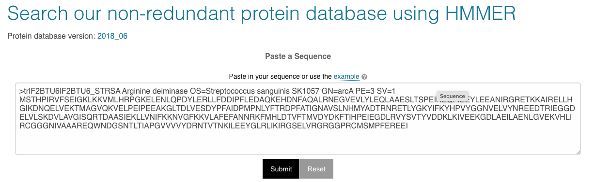
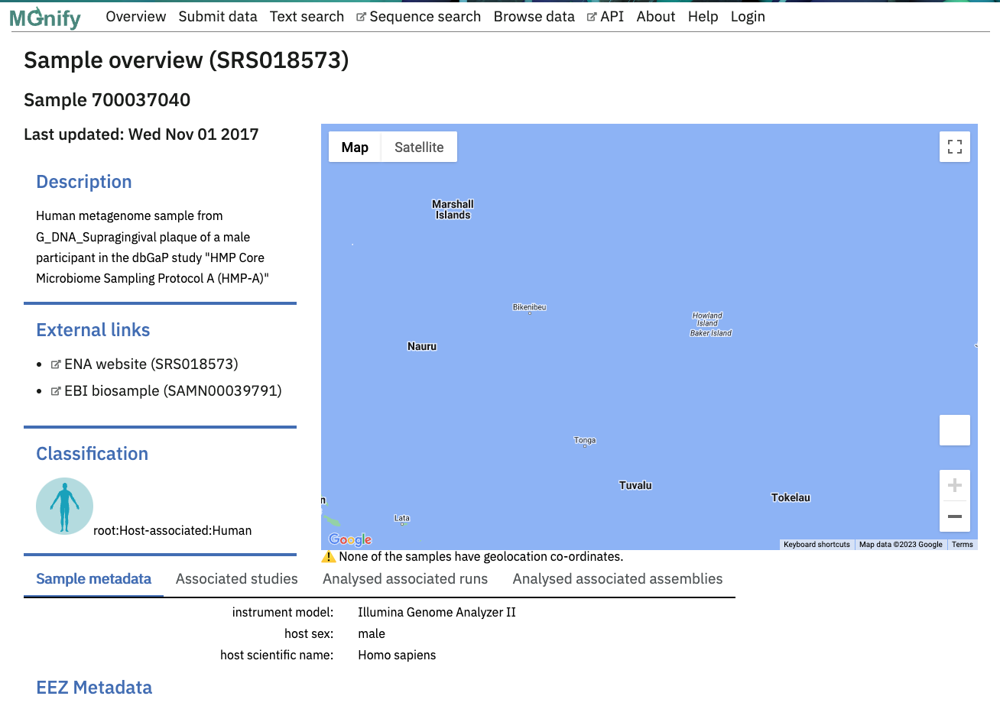

# MGnify Search
written by: [Elli Hung](https://github.com/ellihung)

[5 minutes] [MGnify](https://www.ebi.ac.uk/metagenomics/) is a hub avaliable for the analysis and exploration of nucleic acid sequences drawn from user-submitted sequences and the [European Nucleotide Archive (ENA)](https://www.ebi.ac.uk/ena/browser/home) that specifically are related to microbiome studies. Microbiome research focuses on the study of genetic material from micro-organisms within specific environments allowing for researchers to study microbial communities, processes the community undergoes, and complex interactions. In particular, [MGnify Search](https://www.ebi.ac.uk/metagenomics/sequence-search/search/phmmer) allows a user to enter a protein query sequence to run against the MGnify database of predicted proteins obtained from assembly analysis. This tool can help with virus discovery to give further insights to the subset of environments or biomes that the virus may be found in to give more ecological context behind the novel virus.

**Tutorial Objective**: In this tutorial, `MGnify Search` will be used against a full length sequence of Arginine deiminase from _Streptococcus sanguinis_ derived from MGnify example data.

## Input / Prerequisites
* Access to [MGnify Search](https://www.ebi.ac.uk/metagenomics/sequence-search/search/phmmer)
* Amino acid sequence in FASTA format [Link to example data](img/MGnify_search/example_data.fa)

## Output

Information about the host, environment, biome, and associated studies that match the user's search query within the MGnify hub of microbiome data. In our case, we will determine what host and/or environment this amino acid sequence for Arginine deiminase is found in and the associated studies with this sample. 

### 1. Navigate to [MGnify Search](https://www.ebi.ac.uk/metagenomics/sequence-search/search/phmmer)

### 2. Creating an amino acid sequence query

We will input a **FASTA-formatted amino acid sequence** into the query box based on the example data.

### 3. Choosing which database to search against

There different databases a user can choose to search their query against:

* **Sequence type**
  * All sequences - all sequences in the database
  * Partial sequences - only partial sequences
  * Full length sequences - only full length peptides
  * [read more about partial and full length peptides](https://emg-docs.readthedocs.io/en/latest/sequence-search.html#partial-and-full-length-peptides)
  
* **Environments**
  * Aquatic
  * Marine
  * Freshwater
  * Soil
  
* **Host-associated biome**
  * Human
  * Human - digestive system
  * Human - non-digestive
  * Animal

* **Other (sequences not found in other environment or biome categories)**
  * Engineered
  * Other
  
In this example, we will search only for full length sequences.

### 4. Result page

A list of matching sequences is presented that is ordered by E-value significance (lower E-value indicating a more significant match). The user can customize this table to dispaly different headings. Clicking on the `Target` link shows the amino acid FASTQ file that the query sequence matched to. the `Run & Sample IDs` link brings up the associated MGnify Sample Overview.

In our [example](https://www.ebi.ac.uk/metagenomics/sequence-search/results/7CFA9DC8-900B-11EE-B07A-5352765DAC3F/score), 2368 significant query matches were found. The top match has a bit score of 890.8 and an E-value of 3.5e-265.

### 5. Run & Sample ID in the MGnify Sample Overview

Clicking on the MGnify Sample Overview link to the associated query match displays a description of the sample, links to external websites (such as ENA or EBI biosample), the classification, associated studies, and other data.

In our [example](https://www.ebi.ac.uk/metagenomics/samples/SRS018573) the description shows that this is a human metagenome sample from G_DNA_Supragingival plaque of a male participant in the dbGaP study "HMP Core Microbiome Sampling Protocol A (HMP-A)." The report shows that this sample is classified as human host-associated and there is a Google maps option available if the sample information includes coordinates. Additional information about the metadata and associated studies is also available.

### Conclusion

That's it! You've used `MGnify Search` to obtain information about the associated host and environment of an amino acid sequence!

Here we have run through a tutorial on how to use the `MGnify Search` online resource to search through the MGnify hub of microbiome data to determine more contextual information about the host, biome, and environment of a specific amino acid query. This 

### See Also:

* [MGnify: the microbiome sequence data analysis resource in 2023](https://academic.oup.com/nar/article/51/D1/D753/6880769?login=false) publication for the latest update on MGnify
* [MGnify Online Tutorial](https://www.ebi.ac.uk/training/online/courses/mgnify-quick-tour/) for a more detailed tutorial of the entire MGnify hub
* [MGnify Sequence Search Documentation](https://docs.mgnify.org/src/docs/sequence-search.html) for more information on the sequence search parameters and customization options

