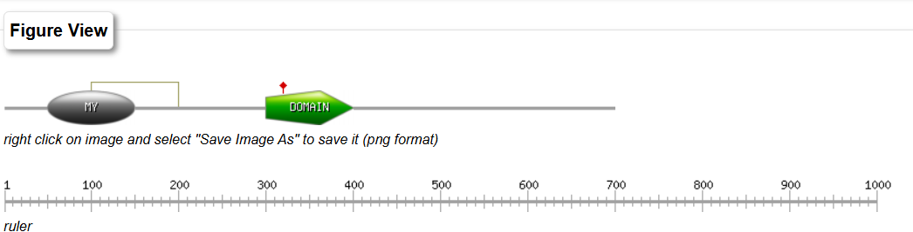
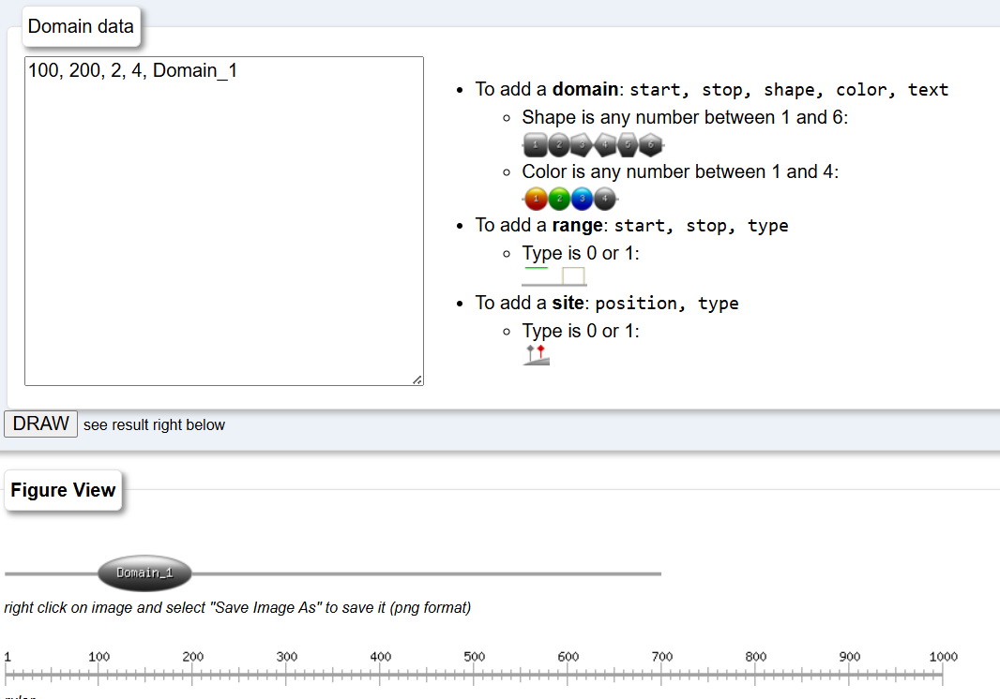
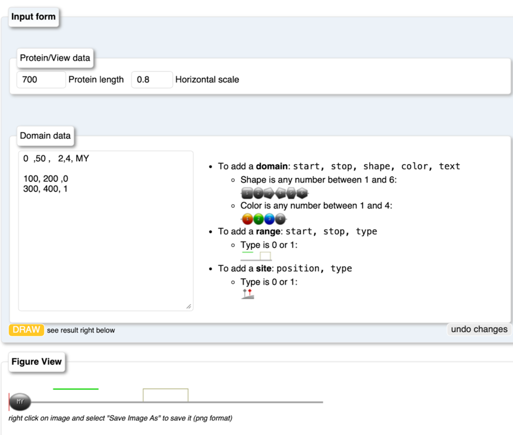
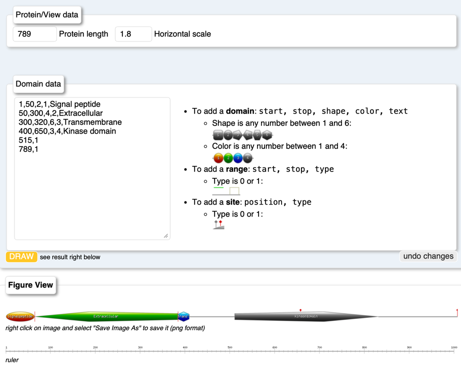

# MyDomains
written by: [Jay Du, Xiaofeng Li](https://github.com/dujay971226/lab12)

[5 minute] This tutorial covers MyDomains, a PROSITE/ExPASy tool used to generate
schematic diagrams of protein domain architecture. The tool works by allowing users
to input a protein’s length and the positions of its domains or motifs, then
automatically producing a visual map of those features. In virus discovery,
such diagrams help researchers quickly interpret predicted viral proteins,
compare domain arrangements, and identify hallmark domains that support classification
or functional inference.

**Tutorial Objective**: By the end of this tutorial, you will know how to use the 
MyDomains web interface to input a protein sequence, define its domains, and 
generate a clear visual map of its domain architecture.

## Input / Prerequisites
- Any Web Browser
- https://prosite.expasy.org/cgi-bin/prosite/mydomains/
- Sample details for the protein being analyzed

## Output

The output is a graphic image (in PNG format) showing a schematic of the protein: 
a rectangular “bar” representing the full protein, with colored/shaped boxes 
(or shapes) along it corresponding to the domains (or other features) you specified.

You can right-click on the image and choose “Save Image As” to download the PNG.

### 1. Tutorial Instructions

#### 1. Add Domain:

You can add a domain by typing start, stop, shape, color, text in the Domain data text field.  

For example, "100, 200, 2, 4, Domain_1" means adding a domain called Domain_1 
with a shape of 2(sphere), and colored 4(gray), started from 100 to 200.  
{width=50%}

 

Supported shapes include:  
  
1. rectangle  
2. Sphere  
3. Pentagon - pointing towards right  
4. Pentagon - pointing towards left  
5. Hexagon - edge points down  
6. Hexagon - angle points down.  

 

Supported color include:  
  
1. Orange  
2. Green  
3. Blue  
4. Grey  

 

### 2. Add Range

If users want to highlight some regions in the protein (like regions between domains), they can type in following format in the Domain data box: "start, stop, type"
which start and stop refers to the region which users want to highlight. The type is 0 or 1 indicates green line or a box covers that region.

### 3. Add Site

If users want to highlight a specific site in the protein, they can type in following format in the Domain data box: "position, type"
which position is the site users want to highlight, and type is 0 or 1 refers a gray or red narrow to that site.

### Conclusion
This example shows a Tyrosine Kinase Receptor, a signaling protein on the cell membrane. It includes a signal peptide guiding secretion, an extracellular domain for ligand binding, a transmembrane region anchoring the protein, and a kinase domain for phosphorylation. Two autophosphorylation sites (Y515, Y789) regulate downstream signaling. This illustrates how domain structure supports receptor function.

