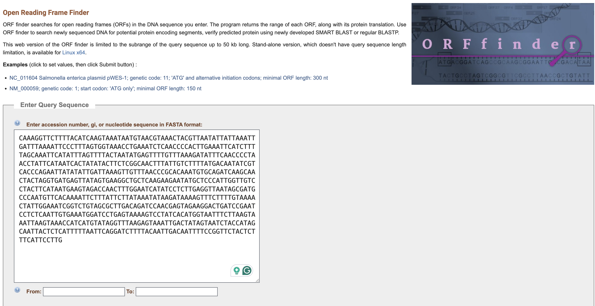
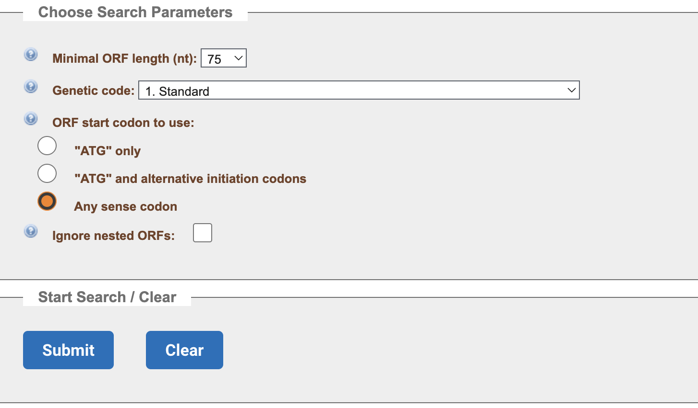
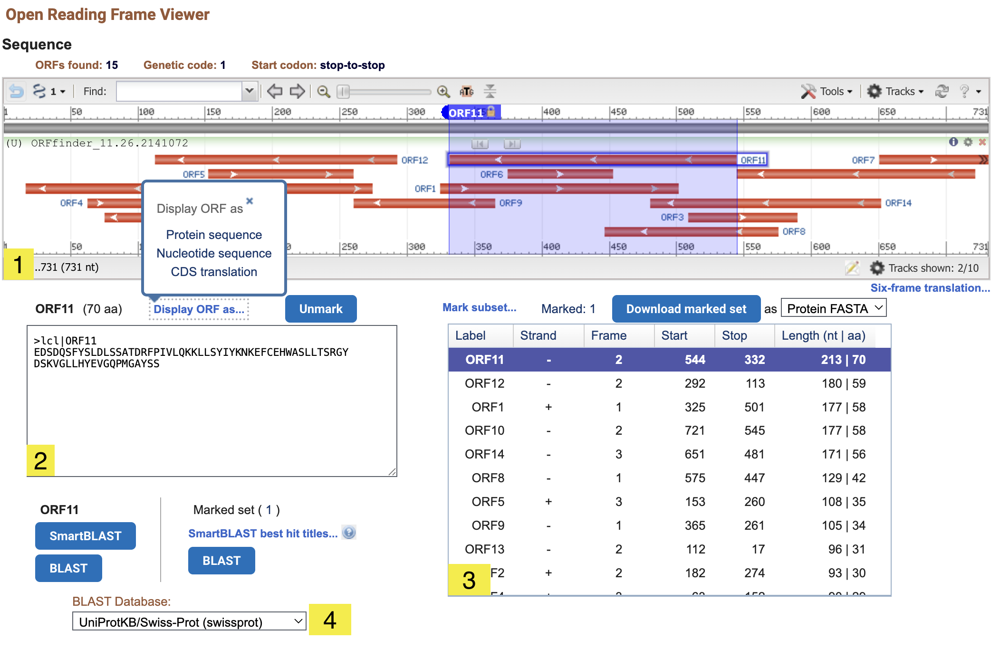
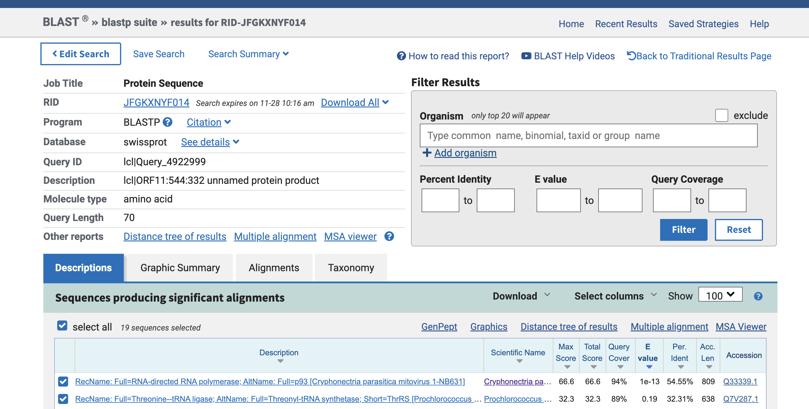
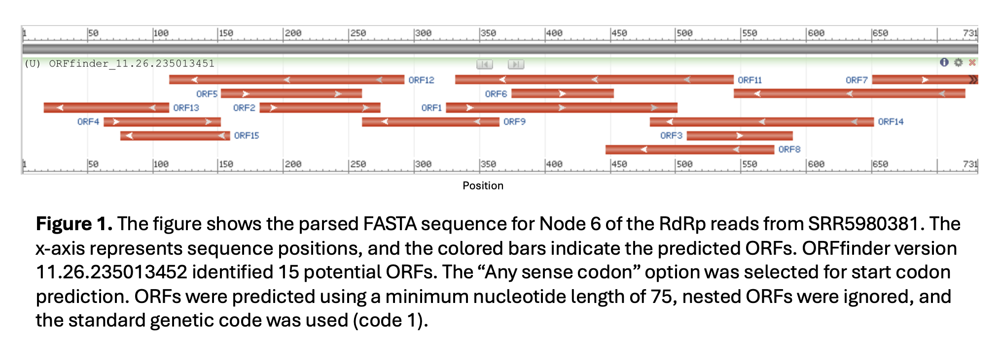

---
output:
  html_document: default
  pdf_document: default
---
# ORFfinder
written by: Nuan Wen [updates by Nour Hassan and are `highlighted` ]

[8 minutes] Welcome to the tutorial for ORFfinder. This tool helps researchers 
to find the open reading frame (ORF) quickly. `ORFs are stretches of sequence `
`that begin with a start codon and continue in-frame until a stop codon`. 
This tool will find the ORF based on the start codon (ATG as default ) you 
specify until a stop codon (TGA, TAA, TAG) appears `or any continuous in-frame`
`region without stops`. Additionally, it provides you with the corresponding 
amino acid sequences and shortcuts to BLAST, which makes the preparation work 
for virus discovery easier `by giving you fast access to alignments of your ORFs`
`against known sequences`.

**Tutorial Objective**: By finishing this tutorial, you will be able to use 
ORFfinder to find the open reading frame efficiently and meaningfully.

## Input / Prerequisites
- ORFfinder can be accessed from [here](https://www.ncbi.nlm.nih.gov/orffinder/).
- The input could be accession numbers, data in fasta format, or bare sequences. 
  - `NOTE: FASTA input requires a header line beginning with ‘>’, followed by` 
  `the sequence without any blank lines.` 
  
    ex:   >P01013 GENE X PROTEIN (OVALBUMIN-RELATED)
          QIKDLLVSSSTDLDTTLVLVNAIYFKGMWKTAFNAEDTREMPFHVTKQESKPVQMMCMNNSFNVATLPAE
          KMKILELPFASGDLSMLVLLPDEVSDLERIEKTINFEKLTEWTNPNTMEKRRVKVYLPQMKIEEKYNLTS
          VLMALGMTDLFIPSANLTGISSAESLKISQAVHGAFMELSEDGIEMAGSTGVIEDIKHSPESEQFRADHP
          FLFLIKHNPTNTIVYFGRYWSP
  
  - See [Accepted Input Formats](https://blast.ncbi.nlm.nih.gov/doc/blast-topics/) for more details.
  
- The web version of the ORF finder is limited up to 50 kb long. The stand-alone 
version, which doesn't have query sequence length limitation, is available for Linux x64.
`However for our short viral sequences the online version should suffice for most cases.`

## Output
1. `ORF information is supplied in supported formats, including:`

    - `Protein FASTA — contains the amino acid sequences of predicted ORFs`
    -  `CDS FASTA — contains the coding DNA sequences (CDS) of the ORFs`
    - `ASN.1 — a machine-readable metadata file containing ORF coordinates, CDS` 
    `translations, taxonomy information, and other annotations`
    - `Feature tables — contain ORF coordinates and annotations, but do not include sequence data`

2. `The amino acid sequence is generated for every detected ORF.`

### ORFfinder Submitting Page Instructions

1. Put your sequence into the text box. 

#### Choose Search Parameters

2. (Optional) Enter the position in your interest to "From:" and "to:" text boxes.

3. (Optional) Select the minimal ORF length (nt). The default value is "75" nucleotides.

4. (Optional) Select the taxonomy of the organism and the type of the sequence source. 
The default value is "1. Standard", which is the most well-known codon table.

5. (Optional) Select the start codon that is used. The default value is "ATG only".
`Note: I used the “Any sense codon” option to ensure that I detect as many`
`potential RdRp ORFs as possible. The trade-off is that this setting also `
`generates additional false positives, including ORFs that are unusually short `
`or unlikely to be biologically relevant.`

6. `(Optional) Select “Ignore nested ORFs” if you want ORFfinder to exclude ORFs`
`that are completely contained within other ORFs`

7. Click "Submit". This will take you to the ORF Viewer Page.

### ORF Viewer Page Instructions

1. At the top is the sequence viewer. You can jump to a certain position, zoom 
in the sequence, select a specific ORF, etc. The documentation is 
[here](https://www.ncbi.nlm.nih.gov/tools/sviewer/).

2. On the left is the text box containing the amino acid sequences for the 
selected ORF. You can change the way of showing the amino acid sequence by 
clicking "Display ORF as...".

3. In the middle is the summary table for ORFs found. You can click on one of 
the ORFs and the sequence viewer will show you where the ORF selected locates. 
The amino acid text box will update accordingly. You can mark/unmark an ORF and 
download the marked ones by choosing the file format and then clicking 
"Download marked set". The default file format is "Protein FASTA".

4. `Users can then select the BLAST database and submit either a BLAST or SmartBLAST job.`

### Interpretting Results

`When interpreting ORFs outputted by ORFfinder, it is important to keep in mind` 
`that the tool does not provide formal statistical confidence scores. However,` 
`longer ORFs can generally be considered more reliable, as it is statistically` 
`less likely for a start and stop codon to occur so far apart by chance.` 
`Additionally, when ORFs are submitted to BLAST, results with smaller` 
`E-values (typically less than 1.0e-5—indicate) higher confidence for an alignment to a`
`specific protein type (e.g., RdRP).`

`For example, in the figure above, my BLAST results from parsing a viral sequence`
`through ORFfinder show that the chosen ORF has a very small E-value and high` 
`sequence coverage with an RdRP in a mitovirus.`

`When presenting ORFfinder results, it is essential to include the version of the`
`software, the input sequence, accession or sample ID, and the parameters used.` 
`This ensures reproducibility. In the figure below, I illustrate how to interpret` 
`the ORFfinder output and describe the process used to obtain it.`

### Conclusion

That's it! You've used the ORFfinder to find the ORFs and the corresponding 
amino acid sequences for your sequence!

You should have noticed that ORFfinder is a powerful tool to uncover potential 
protein-coding regions within a DNA or RNA sequence. Combining with BLAST, it 
forms a pipeline to help researchers analyze their sequences in one assembly.

### See Also:

- [NCBI Minute: The Updated ORFfinder](https://www.youtube.com/watch?v=hbmeG9UbWOY)
- [ORF-FINDER: a vector for high-throughput gene identification](https://www.sciencedirect.com/science/article/abs/pii/S0378111901008198)
- [Database resources of the National Center for Biotechnology](https://www.ncbi.nlm.nih.gov/pmc/articles/PMC165480/)