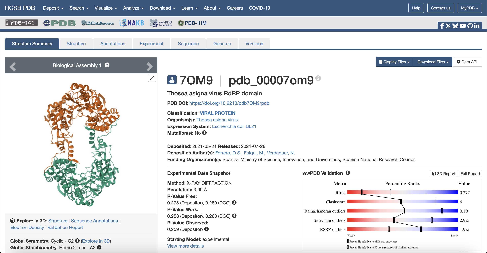
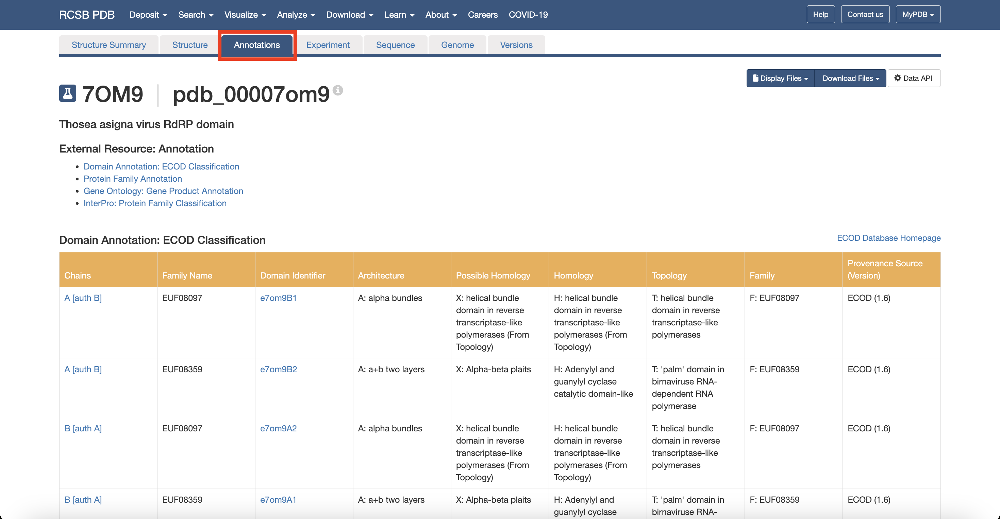
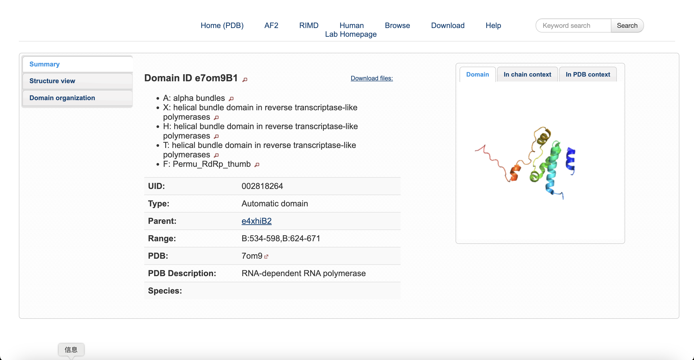

# Protein Data Bank

written by: [Rayna_M](https://github.com/Rayna-Ma)

[10 minute] This tutorial is for the [RCSB Protein Data Bank (PDB) Explorer](https://www.rcsb.org/), a public structure database for proteins and other important biological macromolecules. Users can explore molecule metadata, experimental method, related publications, and download 3D structural coordinates (PDB/mmCIF/XML). For virus discovery, researchers learn about the experimentally determined reference protein structures in the PDB, adding

**Tutorial Objective**: Retrieve a viral protein in PDB and explore its domain structure, conserved motifs, and experimental validation metadata to support functional interpretation of viral ORFs.

## Input / Prerequisites

-   Access to [Protein Data Bank](https://www.rcsb.org/)

-   `Terms`, `Ligand ID` or `sequence` to search for

-   This tutorial use example data: [PDB Entry - 7OM9](https://www.wwpdb.org/pdb?id=pdb_00007om9)

-   **Note:** Since the PDB only contains experimentally solved structures, its archive is relatively limited in size. When analyzing a new virus, your own ORF protein sequence probably does not exist in the database. it is recommended to first run **BLASTp to find high-similarity homologous reference proteins**, verify that a structure for those homologs is available in the PDB, and then use these entries for learning and interpretation.

## Output

The PDB outputs provide experimentally solved structural coordinate in .pdb and .mmCIF formats, along with method, resolution, assembly, and validation metadata. These files represent real wet-lab derived 3D molecular structures, enabling reference-based structural interpretation. In virus discovery, PDB entries and their homolog clusters help researchers analyze domain architecture and conserved catalytic motifs to support functional annotation of viral ORFs when experimental reference structures exist.

### 1. Navigate to [RCSB Protein Data Bank (PDB) Explorer](https://www.rcsb.org/).

### 2. Search the structure ID 7OM9

On the structure summary page, you can see it's a Thosea asigna virus RdRP domain You can review core metadata, including classification (viral protein), source organism, experimental method (X-ray diffraction), resolution (3.00 Å), release date, authors, and expression system.

 

*Fig.1 Structure summary page of a viral RdRP reference in PDB*

You can see the structure on the left of the screen.

### 3. Click the `Sequence Annotations` button in the red box

This will lead you to a detailed and interactive structure animation.

 *Fig.2 Sequence Annotations*

### 4. Look at the detailed structure.

For example, I'm interested in the secondary structure, so I place my mouse in the red box and on the red of the screen, a corresponding helix (Position:247-258) is highlighted.

 *Fig.3 3D viewer highlighting annotated secondary structure (helix 247–258)*

In this way, you can investigate any annotated motif you like and learn about their specific structure.

### 5. Explore more domain annotations.

Click `Back` on the previous page and then click `Annotations` on the top of the page.

 *Fig.4 Annotations tab showing external resources (ECOD, GO, InterPro)*

You will see many link to `External Resource`, like `Domain Annotation: ECOD Classification`, `Protein Family Annotation`, `Gene Ontology: Gene Product Annotation`, `InterPro: Protein Family Classification`.

Here, I use `Domain Annotation: ECOD Classification` as an example. As you can see in the first row of the table:

1.  `Chains` → `A [auth B]`

The structural domain comes from Chain `A` in the PDB file, and `[auth B]` indicates the original author-labeled chain ID during deposition.

2.  `Family Name` → `EUF08097`

A homology-based protein domain family ID in ECOD, representing a cluster of domains that share common ancestry at the topology level.

3.  `Domain Identifier` → `e7om9B1`

A unique ECOD internal identifier for this domain; e denotes ECOD, 7om9 links to the PDB entry, and B1 specifies a particular domain fragment within that structure.

If you click the link here, you'll see the structure of this domain.

 *Fig.5 Structure of Domain e7om9B1*

4.  `Architecture` → `A: alpha bundles`

The top-level structural organization category, meaning the domain is mainly composed of α-helices packed together as bundle-like units, without β-sheets as primary components.

5.  `Possible Homology` → `X`:

Indicates that the domain is assigned by topology-level classification, commonly observed as a helical bundle fold in **reverse-transcriptase-like polymerases**.

6.  `Homology` → `H`:

A structural homology category in ECOD, describing this as the helical bundle domain topology typically found in **reverse-transcriptase-like polymerase families**.

7.  `Topology` → `T`:

A classification of the fold connectivity and 3D arrangement, focusing on how helices are linked and stacked in space, a helical bundle domain in **reverse-transcriptase-like polymerases**.

8.  `Family` → `F: EUF08097`

The domain family assignment in ECOD (same unique family ID), placed here under the “Family” layer of the ECOD hierarchy.

9.  `Provenance Source` → `ECOD (1.6)`

The classification source database is ECOD, and 1.6 is the version of the ECOD release used for this domain annotation.

### 6. Look for more similar proteins

Click `Structure Summary` on the top of the page and scroll down to `Macromolecules`.

 *Fig.6 Sequence clusters (Entity Groups)*

Here, look for `Entity Groups` and click the `100% Identity` in the `Sequence Clusters`. This link will lead you to the group of `RNA-dependent RNA polymerase`. There are 9 members in total and you can check their properties one by one as instructed before.

 *Fig.7 High-identity homolog cluster of RNA-dependent RNA polymerase*

### 7. Download the Structure

Click back to the `Structure Summary` page and click the `Download Files` botton on the right side. Then you can choose your preferred structural coordinate formats:

-   mmCIF (.cif, gz): Full atomic coordinates and structure metadata, including domains and chains.

-   Legacy PDB (.pdb, pdb.gz): Classic 3D coordinate text format for visualization tools. These files contain wet-lab solved 3D structures and experimental details.

You can also get the sequence (.FASTA), structure factors, validation and biological assembly files if needed.

 *Fig.8 Download panel listing structure and validation file formats*

### Conclusion

That's it! You've used the Protein Data Bank (PDB) to explore a viral protein structure!

We can use homolog protein annotations to interpret conserved domains and validated motifs for ORF functional annotation in virus discovery.

Although PDB does not predict structures like Alphafold, it is valuable when used as a reference archive and evidence source for solved viral proteins, their domains, assemblies, and validation metrics, and for retrieving high-identity homolog clusters to guide ORF interpretation in virus discovery.

### See Also:

-   [H.M. Berman, J. Westbrook, Z. Feng, G. Gilliland, T.N. Bhat, H. Weissig, I.N. Shindyalov, P.E. Bourne, The Protein Data Bank (2000) *Nucleic Acids Research* 28: 235-242](https://doi.org/10.1093/nar/28.1.235)
-   [About RCSB PDB: A Living Digital Data Resource That Enables Scientific Breakthroughs Across The Biological Sciences](https://www.rcsb.org/pages/about-us/index)
-   [Guide to PDB Data](https://pdb101.rcsb.org/learn/guide-to-understanding-pdb-data/introduction)
-   [PDB History](https://www.rcsb.org/pages/about-us/history)
