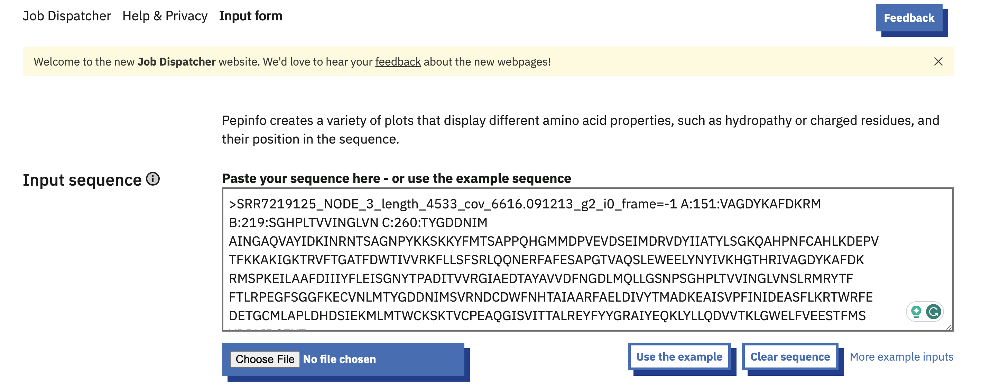
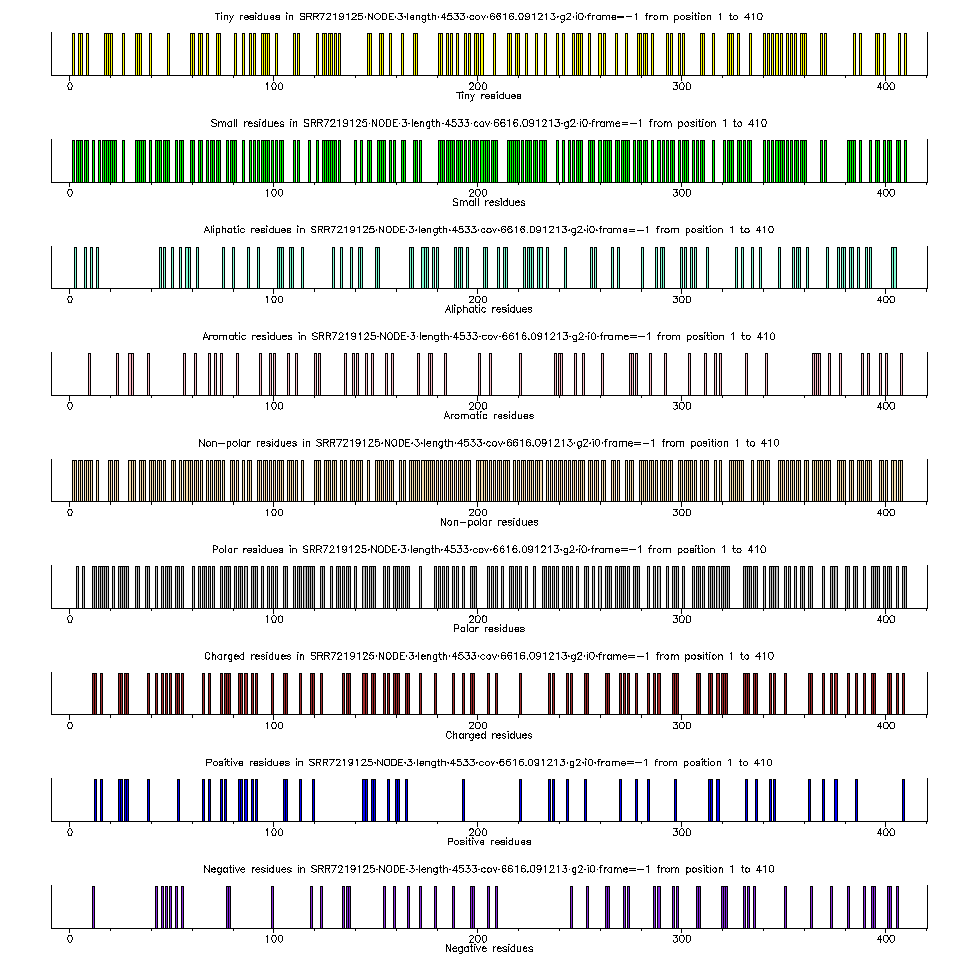
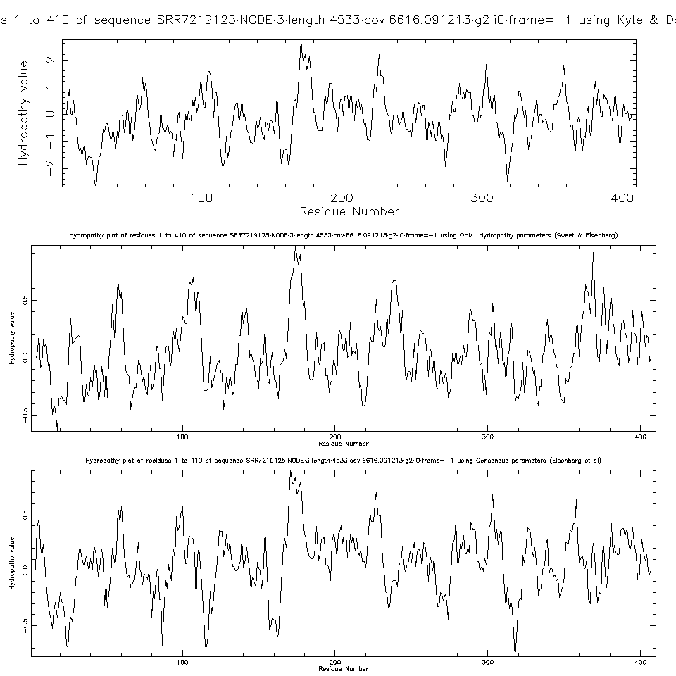
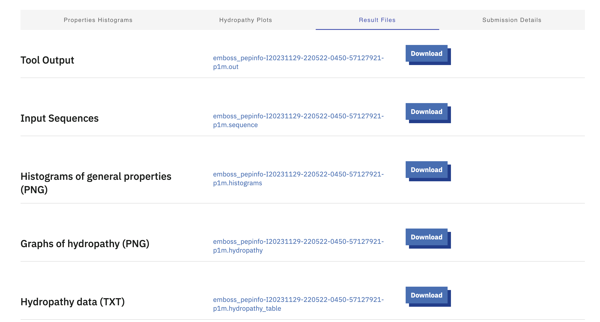

# PepInfo
written by: [Mikael Gouwtama](gitlab.ccbr.utoronto.ca/gouwtama)

[10 minutes] PepInfo by EMBOSS creates a variety of plots that display the different amino acid properties from a protein sequence, including hydropathy or charged residues, and their position in the sequence. The tool allows for the functional region identification, providing the structural insight of the virus, and allowing comparative analysis of the amino acid properties across different viral strains or species, which collectively aids in understanding a newly discovered virus. 

**Tutorial Objective**: We will use the PepInfo tool to characterize the amino acid properties of a novel viral protein sequence related to the Locarnavirus genus from the Marnaviridae family of viruses

## Input / Prerequisites
- Access to [Emboss PepInfo](https://www.ebi.ac.uk/jdispatcher/seqstats/emboss_pepinfo)
- Web browser
- A protein sequence in GCG, FASTA, PIR, NBRF, PHYLIP or UniProtKB/Swiss-Prot format.
- Example data (from an unknown virus related to Locarnavirus sp.):
```
>SRR7219125_NODE_3_length_4533_cov_6616.091213_g2_i0_frame=-1 A:151:VAGDYKAFDKRM B:219:SGHPLTVVINGLVN C:260:TYGDDNIM
AINGAQVAYIDKINRNTSAGNPYKKSKKYFMTSAPPQHGMMDPVEVDSEIMDRVDYIIATYLSGKQAHPNFCAHLKDEPV
TFKKAKIGKTRVFTGATFDWTIVVRKFLLSFSRLQQNERFAFESAPGTVAQSLEWEELYNYIVKHGTHRIVAGDYKAFDK
RMSPKEILAAFDIIIYFLEISGNYTPADITVVRGIAEDTAYAVVDFNGDLMQLLGSNPSGHPLTVVINGLVNSLRMRYTF
FTLRPEGFSGGFKECVNLMTYGDDNIMSVRNDCDWFNHTAIAARFAELDIVYTMADKEAISVPFINIDEASFLKRTWRFE
DETGCMLAPLDHDSIEKMLMTWCKSKTVCPEAQGISVITTALREYFYYGRAIYEQKLYLLQDVVTKLGWELFVEESTFMS
YDDLIDCFKT
```
- A parameter, `Hydropathy Window Size`. This sets the window size for averaging (smoothing) the hydropathy plots. By default a window size of 9 is used. However, an integer between 1 and 200 can also be used. A smaller value will result in noisier plots while a larger value will result in smoother plots. 


## Output

The OUTPUT of generated by this tool includes a histogram of the general physico-chemical properties of each amino acids (PNG file). These properties includes the tiny, small, alipathic, aromatic, non-polar, polar, charged, positive, and negative residues along with its location in the protein sequence. Each histogram (each property) also comes with a table data describing each amino acid (TXT file). Understanding these characteristics can provide insights into the physical and chemical traits of viral proteins, offering indications of potential interactions between amino acid residues. This holistic view contributes to a better understanding of the overall structure of the viral protein.

The output also includes hydropathy plots using different hydropathy scale (Kyte & Dolittle, Sweet & Eisenberg/OHM, and Consensus) (PNG file). These plots also comes with a table data describing each amino acid residue and its hydropathy index score (TXT file). The hydropathy scale calculates the polarity of an amino acid based on its partition coefficient (the fractional distribution based on the concentrations in an aqueous and organic phase). The hydropathy plot is generated by averaging the hydropathy values (unique to each scale) or each amino acid found in the segment (the lenght of the segment is specified earlier in the `Hydropathy Window Size` parameter), generating a hydropathy index. Then, the window is moved one amino acid residue to the right to calculate the next average hydropathy index. This is repeated until the last amino acid is reached. 

A positive hydropathy index indicates that the segment is hydrophobic, while a negative hydropathy index indicates that the segment is hydrophilic. Understanding the polarity of segments in the viral protein sequence offers insights into their interactions, thereby contributing to a better understanding of the protein's structure.

### 1. Navigate to [PepInfo](https://www.ebi.ac.uk/jdispatcher/seqstats/emboss_pepinfo)

### 2. Input Protein Sequence
In the "Input sequence" text area, paste or type the amino acid sequence of your protein of interest. Alternatively, you can choose a supported file from your computer or `use the example`, which will give you an amino acid sequence for human insulin-like growth factor protein complex. Here, we'll use the example data above (unknown virus related to the Locarnavirus sp.). 


### 3. Select Paremeters
Select a desired 'Hydropathy Window Size', an integer between 1 and 200. Here, we'll use the default value of '9'.


### 4. Choose Title (Optional) and Submit Analysis
Choose a title for the analysis by typing it in the box provided at the `submit` section, under `Title`. Then, click `submit`.


### 5. View and Interpret Results
After the analysis is complete, the web page will display the results, including histrograms depicting amino acid physico-chemical properties and hydropathy plots.

Here is the general properties histogram, located under the `Properties Histograms` tab.


Briefly, we can tell that the majority of the residues are small and non-polar. While there are also quite a number of polar residues, the virus protein sequence has only a few charged residues.

And here is the hydropathy plots, located under the `Hydropathy Plots` tab. 


When interpreting the hydropathy plots, a positive value means that the residues are hydrophobic while a negative values suggest a hydrophilic residue. Looking from the Kyte & Dolittle scale, we can see that our viral protein starts out as being predominantly hydrophilic, around the first 160 residues, before being generally hydrophobic around residues 200, with a mix of both hydrophobic and hydrophilic residues nearing the end of the protein sequence. 

### 6. Download Results (Optional)
Under the `Results File` tab, you can download all the results, including the two plots, its table data, and the input sequence. 



## Conclusion

That's it! You've successfully used the PepInfo EMBOSS tool to characterize the physical, chemical, and hydrophobicity profiles of amino acid residues in an unknown novel virus.

Understanding these characteristics provides insights into the overall protein structure and potential drug targets, such as regions critical for protein-membrane interactions. Comparative analysis of hydropathy profiles among related viruses reveals evolutionary relationships and adaptations, shedding light on the evolution of viral proteins to optimize function or evade host immune responses—a analysis achievable starting with the simple steps outlined above.

### See Also:

- [Amino acid characteristics](https://www.britannica.com/science/amino-acid/Standard-amino-acids)
- [Hydropathy plot Analysis](https://www.sciencedirect.com/science/article/pii/S0006291X04019370)
- [EMBOSS PepInfo Manual](http://bioinf.ibun.unal.edu.co/cgi-bin/emboss/help/pepinfo)
