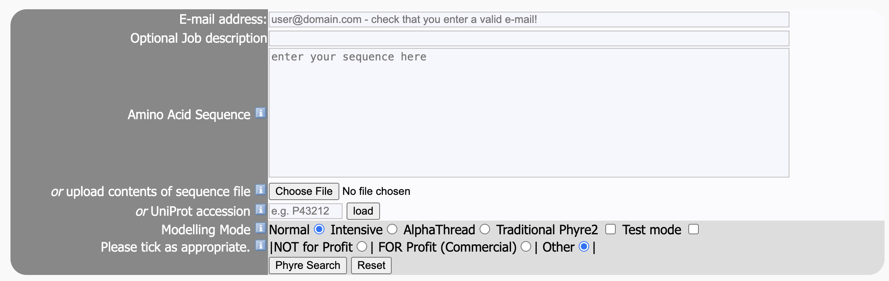
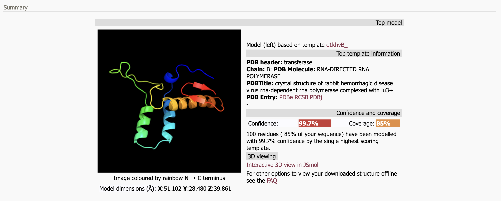
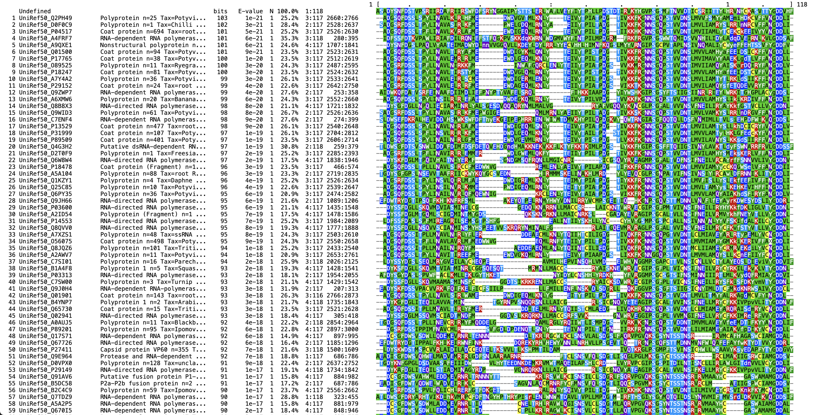
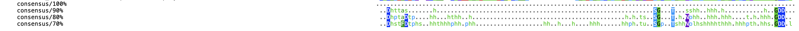
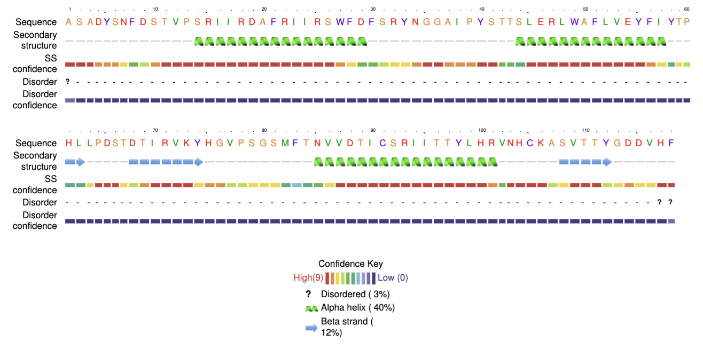
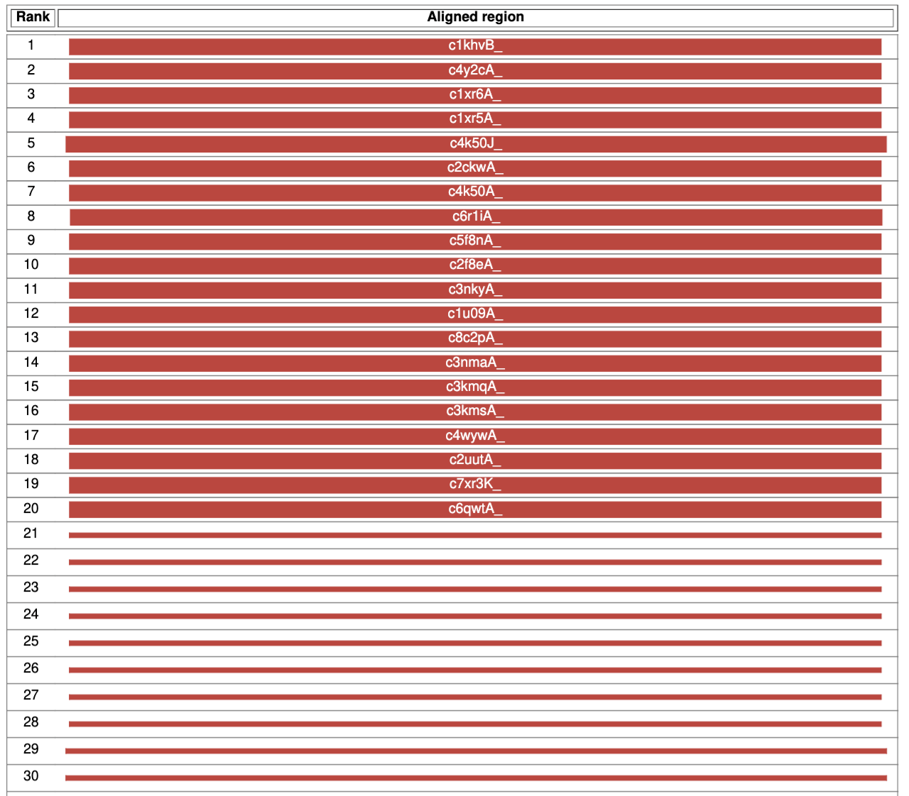
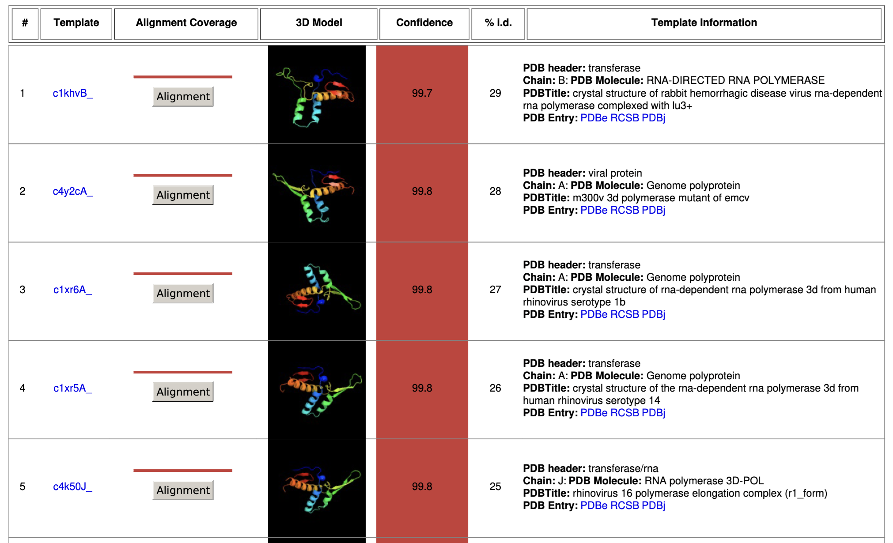

# Phyre2.2
written by: [Jeremy Chan](https://github.com/jeremyschan *optional link*)

[15 minutes read, up to 1 hour to run] `Phyre2.2` is a server tool that predicts a protein’s structure from an input sequence by matching it to homologous PDB templates, and it can also use the nearest AlphaFold model via the AlphaThread mode when no experimental template exists. This supports virus discovery by inferring structures for novel viral proteins lacking experimental models, enabling functional annotation for active sites, ligand pockets, etc.

**Tutorial Objective**: In this tutorial, we will do a walk through of how to use `Phyre2.2` to predict the viral protein structures, and which modes to pick. Specifically, we will be demonstrating the tool on a novel RNA virus related to the `Partitiviridae` family of viruses that affects the `Apis mellifera` species.

## Input / Prerequisites
- Web browser
- [Link to Phyre2.2](https://www.sbg.bio.ic.ac.uk/~phyre2/html/page.cgi?id=index)
- Text of the amino acid sequence, or FASTA file, or UniProt accession number of the virus for investigation. For this tutorial, we will be using the example sequence: `ASADYSNFDSTVPSRIIRDAFRIIRSWFDFSRYNGGAIPYSTTSLERLWAFLVEYFIYTPHLLPDSTDTIRVKYHGVPSGSMFTNVVDTICSRIITTYLHRVNHCKASVTTYGDDVHF`

## Output
Phyre2.2 returns a predicted structure with overall confidence and coverage, shows a ranked list of template-based models (top 20 hits are modelled), highlights the top model with its PDB metadata, and provides an MSA (multiple sequence alignment), secondary-structure prediction, and ligand site prediction (down as of November 27, 2025) for downstream analysis.

### 1. Navigate to the [Phyre2.2 webpage](https://www.sbg.bio.ic.ac.uk/~phyre2/html/page.cgi?id=index)

### 2. Entering parameters for the "Phyre search"
There are a few parameters that need to be configured before we run the tool:

- **E-mail address**: Enter your e-mail address to be sent a link of the results once the tool is finished running. This tool takes quite long (100 residues took ~30 minutes, so longer sequences will be even longer), so you can close the page once you've submitted your job and wait for the results to be sent to you.

- **Amino acid sequence** or **FASTA sequence file** or **UniProt accession number**: Enter your sequence here, in whichever format you have. For this example, we will use the sequence ``ASADYSNFDSTVPSRIIRDAFRIIRSWFDFSRYNGGAIPYSTTSLERLWAFLVEYFIYTPHLLPDSTDTIRVKYHGVPSGSMFTNVVDTICSRIITTYLHRVNHCKASVTTYGDDVHF`.

- **Modelling mode**: Here, you can choose the type of mode you want to use to predict the structure of your protein. `Normal` mode is the default and is the fastest one. `Intensive` mode takes longer and should only be used if there is not a single template that covers most of your sequence - it works by modelling the protein using multiple templates. `AlphaThread` runs BLAST with the input sequence against models in the entire AlphaFold databse to find a top hit. `Traditional Phyre2` is the legacy model, and will give different results as it accesses the old fold library. `Test` mode is for the developer's use, and will give the same results as `Normal`. For this example, we will utilise the `Normal` mode, but if this mode does not output meaningful results for your sequence, consider trying `Intensive` or `AlphaThread` modes.

- **Commercial/non-profit use**: Selecting any of these will not affect your prediction model in any way, but allows the developers to keep track of how the tool is being used. For this example, we will tick the `NOT for Profit` box.

After you've filled all of this out, click the "Phyre search" button and wait for your results to be outputted. The loading page should show an estimated time to completion.

### 3. Interpreting the summary
Once you've reached the results page, the first thing you should see is the Summary section.

On the left, you should see a predicted structure model with the dimensions at the bottom of the image. On the right, we'll see more detailed information about which template (top model) it was predicted from, as well as metadata about the model. In this case, the closest match was a transferase, specifically the crystal structure of rabbit hemorrhagic disease virus RNA-dependent RNA polymerase complex with Lu3+. We can also see the confidence level of the predicted structure, and how coverage (how many residues are accounted for in this model).

### 4. Interpreting the sequence analysis
Scroll down a little, and you'll see the next section is the sequence analysis. Here, you can view the MSA on your browser or download the FASTA version and put it into other software to visualise. In this tutorial, I'll show the browser version.

We can see that the sequence analysis essentially shows a BLAST search against similar sequences. It then shows the sequences and highlights residues that are conserved to a certain degree across these sequences. At the bottom of the page, we'll see consensuses of 70% to 100% to show which and how conseved residues are. In this example, there are no residues that are shared between all of the homologous sequences, but there are a few that are shared at a level of 90%.

### 5. Interpreting the secondary structure
The next section shows the prediction of the secondary structure. You can choose to download this in a PDF report.

Here, we can see a prediction of which specific residues will fold into secondary structures like alpha-helices and beta-sheets. In this example, we see that residues 14 to 29 fold to form an alpha-helix, and 108 to 112 fold to form a beta-sheet.

### 6. Interpreting the domain analysis
The next section shows the domain analysis, and essentially tells us which regions match the templates that the tool has selected.

Here, we see that the top 30 templates all match the domains of our input sequence almost perfectly as it fills up the whole bar. We can also see that the names for the top 20 templates are shown. But if you find yourself wanting to investigate a template outside the top 20, you can find the names for the rest of the ranks in the next section!

### 7. Detailed template information
This last section here will show the templates that the tool has searched through to find your predicted structure.

Here, we can see the template name, alignment coverage from the last step, the 3D model for the top 20 models, the confidence level, and the percent sequence identity with our input sequence. It will also give detailed information about each template including its PDB title, header, chain, and links to its entries.

### Conclusion

That's it! You've used `Phyre2.2` to predict the structure of your input sequence (hopefully of a virus)!

In this tutorial, you should have learnt how to use `Phyre2.2` to predict the 3D structure of your input sequence. You should have also learnt how to interpret each section, including sequence analysis, secondary structure, domain analysis, and information for each template. These results provide a good starting point for more downstream analyses, such as mapping for specific motifs and sites.

### See Also:

- [Phyre2.2: A Community Resource for Template-based Protein Structure Prediction](https://www.sciencedirect.com/science/article/pii/S0022283625000269?via%3Dihub)
- [FAQ page](https://www.sbg.bio.ic.ac.uk/phyre2/html/page.cgi?id=help)
- [Predicting ligand binding sites (down as of November 27, 2025)](https://www.wass-michaelislab.org/3dlig/)
