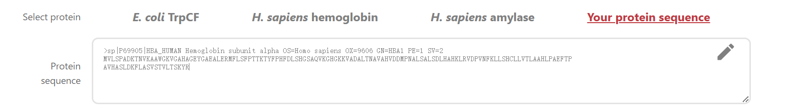
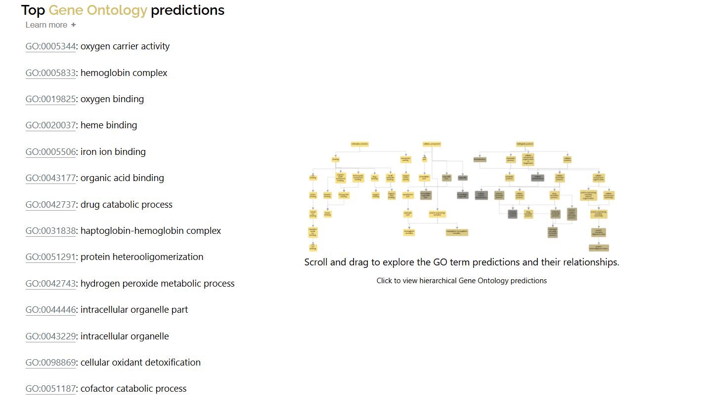
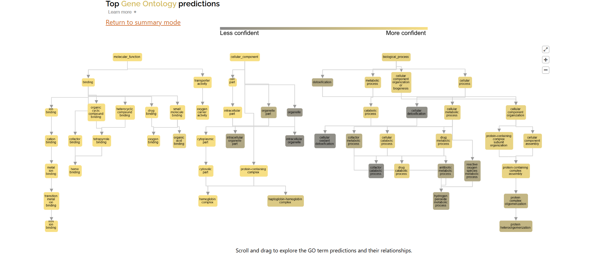

# ProteInfer

written by: [Feiyang Sun](https://github.com/Limelime1214)

[5 minute] This Tutorial gives an overview of using the tool `ProteInfer`. `ProteInfer` is a useful tool for predicting protein functional properties based on amino acid sequences using deep learning models. The model analyzes the sequence and generates predictions about the protein’s function, including specific molecular functions and cellular processes. Users can run the tool via command-line scripts or web interfaces depending on their preference.

**Tutorial Objective**: After this tutorial, you'll be able to use the tool `ProteInfer` to forecast possible protein functions of your obelisk according to its amino acid sequence.

## Input / Prerequisites

- Access to [ProteInfer](https://google-research.github.io/proteinfer/)
- Example data: your amino acid sequence data of interest.
- Enter a full-length protein sequence for prediction, with optional FASTA header line.
- The protein sequence should be more than 40 amino acids.

## Output

The output of ProteInfer is provided in JSON format, containing predicted functional properties of the protein sequences. This includes functional categories like molecular functions, biological processes, and subcellular locations. The output may also include associated confidence scores for each predicted function, helping users assess the reliability of the predictions.

### 1. Navigate to [ProteInfer](https://google-research.github.io/proteinfer/)

### 2. Choose `Your protein sequence` in the `Select protein` module

### 3. Input your sequence

Copy the amino acid sequence of your obelisk, and then paste it into the `Protein sequence` module. (Be careful, the protein sequence you input should be no less than 40 amino acids)

### 4. Run and view result

In summary mode (shown as above), on the left, `ProteInfer` presents the most specific GO terms predicted for this protein; on the right, you can explore the complete hierarchy of the terms. It shows the confidence of a prediction when hovering, from 0 (more gray) to 1.0 (more yellow).

You could also click on the figure on the right, and then scroll and drag to explore the GO term predictions and their relationships (shown above).

### Conclusion

That's it! You've used the `ProteInfer` to predict potential function of your obelisk!

Here, we have provided an overview of how to use the tool `ProteInfer` to forecast protein functions from amino acid sequences of our obelisk. This efficient tool provides us with an insight of molecular function and biological processes associated with our obelisk, offering valuable information for understanding the obelisk's biological significance.

### See Also:

- [Publication](https://elifesciences.org/articles/80942) Publication at Elife
- [Code, data, and notebooks reproducing the analyses](https://github.com/google-research/proteinfer)
- [Ducumentation](https://console.cloud.google.com/storage/browser/brain-genomics-public/research/proteins/proteinfer/datasets/)