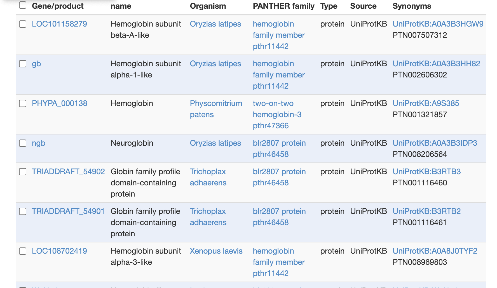
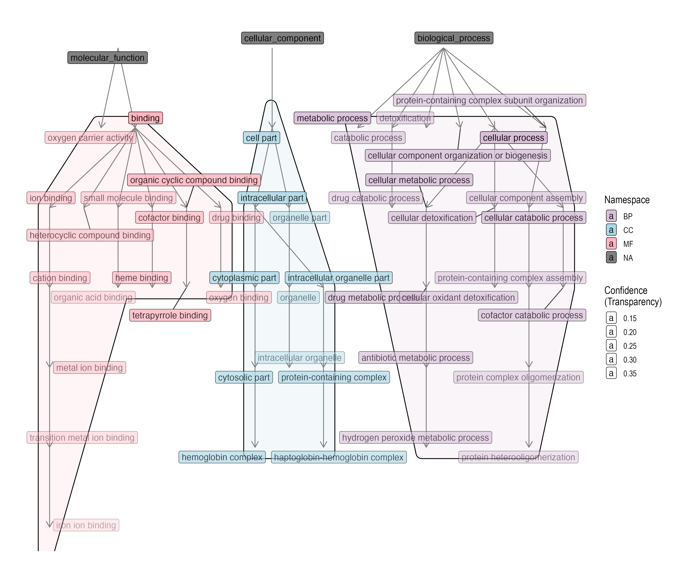

# ProteInfer

written by: [Feiyang Sun](https://github.com/Limelime1214)
edited by: [Esther Cho](https://github.com/esther-git/)

[5 minute] This Tutorial gives an overview of using the tool `ProteInfer`. 
`ProteInfer` is a useful tool for directly predicting a protein's functional properties, including specific molecular functions and cellular processes, by using a single deep, convolutional neural network model. 
By entering the protein's unaligned, full-length amino acid sequence, one can obtain its functional GO annotation;
specifically, each residue passes through a series of convolutions, and the model generates the class outputs (i.e., GO annotations).
By complementing ProteInfer with standard alignment-based methods of predicting protein function, one can employ the tool to better characterize poorly-annotated proteins; 
for example, this is particularly significant for a third of bacterial proteins that remain to be functionally annotated. The tool can also be leveraged to assess potential consequences of various mutations, all from the raw, uncurated sequence data.
Users can run the tool via command-line scripts or web interfaces depending on their preference.

**Tutorial Objective**: After this tutorial, you'll be able to use the tool `ProteInfer` to forecast possible protein functions of your obelisk according to its amino acid sequence.

## Input / Prerequisites

- Access to [ProteInfer](https://google-research.github.io/proteinfer/)
- Example data: your amino acid sequence data of interest.
- Enter a full-length protein sequence for prediction, with optional FASTA header line.
- The protein sequence should be more than 40 amino acids.

## Output

The output of ProteInfer is provided in JSON format, containing predicted functional properties of the protein sequences. This includes functional categories like molecular functions, biological processes, and subcellular locations. The output may also include associated confidence scores for each predicted function, helping users assess the reliability of the predictions.

### 1. Navigate to [ProteInfer](https://google-research.github.io/proteinfer/)

### 2. Choose `Your protein sequence` in the `Select protein` module

### 3. Input your sequence

Copy the amino acid sequence of your obelisk, and then paste it into the `Protein sequence` module. (Be careful, the protein sequence you input should be no less than 40 amino acids)

### 4. Run and view result

In summary mode (shown as above), on the left, `ProteInfer` presents the most specific GO terms predicted for this protein; on the right, you can explore the complete hierarchy of the terms. It shows the confidence of a prediction when hovering, from 0 (more gray) to 1.0 (more yellow).

Let's click on on the first GO annotation on the list on the left and see what this term entails:

Want more information on how these terms appear and are interpreted in published lliterature? Here is an example of a paper that identified the same GO classification on protein-interaction networks between humans and HTLV retroviruses: https://pmc.ncbi.nlm.nih.gov/articles/PMC4133621/

Let's look at all genes and gene products that also have this annotation. You can use this to compare the conservation of sequences and assess whether your protein of interest is most similar to a well-established gene product:
Click on the first "Link" next to the "Related" section:

As `ProteInfer` is a fairly recently published tool, there are not many papers that employ this tool directly to annotate functional predections of amino acid sequences. 
However, here is a paper that uses `ProteInfer`'s framework to further develop their own prediction model called ProtNote: https://academic.oup.com/bioinformatics/article/41/5/btaf170/8113843

### 5. Interpreting Results

How exactly does `ProteInfer' conduct statistical analysis to predict a protein's function? 
One way is by measuring the confidence by producing a precision-recall curve. This curve is generated using the bit score of the closest sequence, given a particular confidence threshold.
The model results in a 96.7% of true positives and 1.4% of false positives. Comparatively, other protein function predictive models have ~90-97% true positives, while alignment methods like BLAST have lower rates near ~70%.
       
Finally, let's improve our output figure using R code to group our clusters in a more visually clear way:

Figure 1. Gene Ontology (GO) term hierarchy predicted by Proteinfer for Hemoglobin subunit alpha. Nodes represent GO terms and edges indicate parent–child relationships within the directed acyclic graph (DAG). Nodes are sorted by GO term: Molecular Function (pink), Biological Process (light violet), and Cellular Component (light blue). Transparency reflects the Proteinfer confidence score (lower transparency indicates higher confidence). 
This figure was generated with the use of a generative large language model (ChatGPT 5.1 Thinking, 2025-11-27).
### Conclusion

That's it! You've used the `ProteInfer` to predict potential function of your obelisk!

Here, we have provided an overview of how to use the tool `ProteInfer` to forecast protein functions from amino acid sequences of our obelisk. This efficient tool provides us with an insight of molecular function and biological processes associated with our obelisk, offering valuable information for understanding the obelisk's biological significance.

### See Also:

- [Publication](https://elifesciences.org/articles/80942) Publication at Elife
- [Code, data, and notebooks reproducing the analyses](https://github.com/google-research/proteinfer)
- [Ducumentation](https://console.cloud.google.com/storage/browser/brain-genomics-public/research/proteins/proteinfer/datasets/)