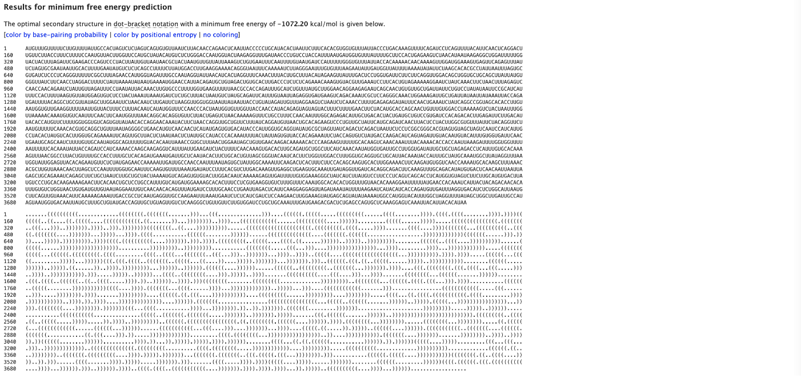
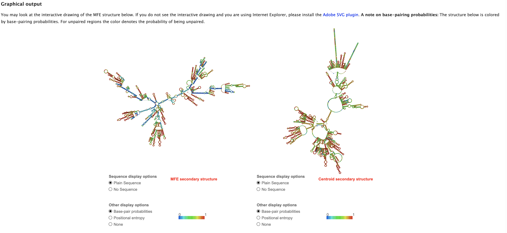
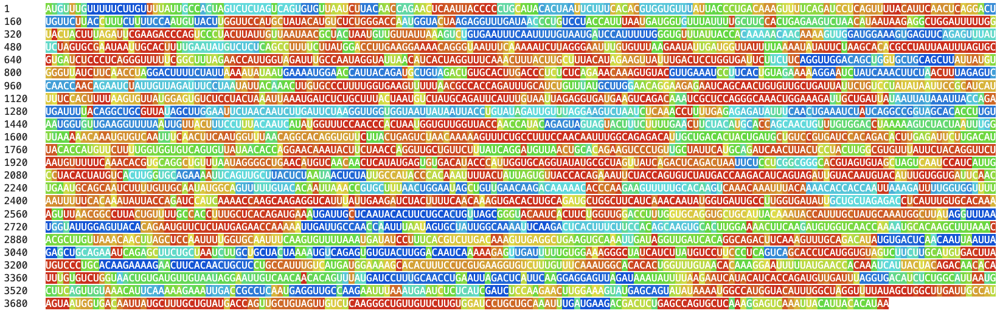
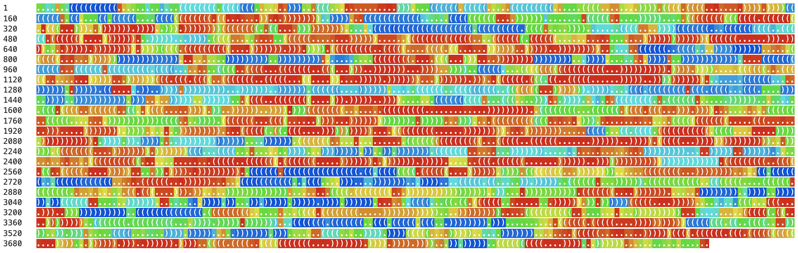

# **RNAfold**

written by: [Derek Tea](https://github.com/derektea), edited by: [Ryan Fu](https://github.com/RF216)

[5 minutes] In this tutorial, we will explore RNAfold, a web-based tool that predicts the secondary structure of a given single-stranded DNA or RNA sequence. This tool works by imputing our sequence of interest into the prompt box to generate an interactive SVG file containing the predicted secondary structure. The tool also allows the user to specify folding constraints, such as which bases should or shouldn't be paired together. Our sequence must be \<7500 nts for partition function calculations and \<10,000 nts for minimum free energy predictions. Although RNAfold is a relatively simple program, it can be used to determine the secondary structures of novel viruses. This can be extremely useful for drawing comparisons to secondary structures of existing viruses and/or for inferring its mode of infection.

**Limitations**: Although RNAfold can be useful in novel virus discovery, it should be noted that the functions do not work when the sequences exceed 10,000 nucleotides. Many currently described viruses actually exceed this limit and it will likely be the case for any new viruses discovered too. In the cases where the viral genome exceeds these limits, we can predict the structures of well annotated regions, such as the spike proteins. We can run sequence alignment tests between our novel virus and existing viral genomes and analyze specific regions based on conservation.

**Tutorial Objective**: We will use RNAfold to elucidate the secondary structure the SARS-CoV-2 spike protein.

## Input / Prerequisites

-   Access RNAfold (<http://rna.tbi.univie.ac.at/cgi-bin/RNAWebSuite/RNAfold.cgi>)

-   A novel viral sequence (DNA or RNA nt sequence), a FASTA file of your sequence of interest, or SRR/ERR/DRR accession code for search

For this tutorial, access the SARS-CoV-2 spike protein sequence through (<https://www.ncbi.nlm.nih.gov/nuccore/NC_045512.2?report=fasta&from=21563&to=25384>).

## Output

Assuming the parameters are kept at default, RNAfold will output the minimal free energy prediction, the thermodynamic ensemble prediction, graphical outputs of the secondary structures (split by algorithm used), and a mountain plot of the structures generated. The graphical outputs can be downloaded as image or pdf files.

### **1. Go to the SARS-CoV-2 spike protein sequence as linked above.**

In the "FASTA" tab, copy the nucleotide sequence. If you want to download the FASTA file, you can do that too.

### **2. Navigate to RNAfold - A description of its functions and its limitations are showcased**

### **3. Paste the sequence/FASTA file of interest into the prompt box.**

### **4. There are several parameters that can be modified.**

These include folding constraits, folding algorithms, dangling end options, energy parameters, shape reactivity, and output options. The purposes of each parameter is described in the (?) button. For the purposes of this tutorial, leave options in their default values.

### **5. Run the algorithm. This process may take several minutes. The larger the sequence input, the more time it will take to run.**

### **6. Once an output has been generated, examine your results. You may download the images if preferred.**

Once the program is done, you should get a few things using both minimum free energy prediction method, and themodynamic ensemble methods. Firstly, you will obtain a dot bracket representation of the structure. For a tutorial on dot-bracket notation, view the following file: <https://users.cs.duke.edu/~reif/courses/molcomplectures/DNA.Modeling/DotBracketNotationForRNA&DNAnanostructures/DotBracketNotationForRNA&DNAnanostructures.pdf>. To view it by base-pairing probability, select color by base pairing probability at the top to visually see how probable each pairing is.

You should also get a visual plot of the secondary structure shown below.

You can also see a mountain plot, as well as an entropy ploy below the secondary structure.

Once you view these results, what does the predicted secondary structure look like (what are the prominent features)? How does it compare to the experimentally-derived secondary structure of the protein? What can you predict about the function/binding of the virus based on this proposed structure?

### **7. Draw comparisons to other known viral secondary structures.**

Run your SARS-CoV-2 spike protein sequence through Blast (<https://blast.ncbi.nlm.nih.gov/Blast.cgi>) and extract the matching sequences with the highest percent identity (choose spike proteins that are not from SARS-CoV-2). Run those sequences in RNAfold. How do the structures compare?

## **Interpreting Results:**

Confidence intervals can be assessed using the base-pair probabilities, which give the probability that any two bases are paired with each other. The calculation is done using John McCaskill's; partition function (PF) algorithm (<https://onlinelibrary.wiley.com/doi/10.1002/bip.360290621>). Acceptable standards are unclear (as UofT doesn't let me access this paper), however, this information is stored in a legend found at the bottom of the secondary structure, with blue referring to lower probability, and red referring to higher probability.

*Raw Sequence*

*Dot-Bracket Notation*

Figure 1: RNA sequence with base pairing probabilities. The raw sequence is shown in the top half, while the dot-bracket notation indicating structure is stored in the bottom half. These results were obtained from minimum free energy calculations.

## **Conclusion**

### That's it! You've used RNAfold to predict the secondary structure of the SARS-CoV-2 spike protein.

Here, we used RNAfold to predict the secondary structure of a previously-defined viral spike protein. However, we can see how this can be a useful tool to predict the secondary structure of a novel virus, or of a particular domain within that novel virus. RNAfold serves as a really straightforward first-step tool to predict the structure and (possibly) the function of the virus at hand.

### **See Also:**

-   Original paper published by Gruber at al, 2008. <https://pmc.ncbi.nlm.nih.gov/articles/PMC2447809/>

-   Later paper that describes how folding constraints and chemical modifications were added. <https://pmc.ncbi.nlm.nih.gov/articles/PMC409911/>

-   Using RNAfold to predict the structure of a viroid: (<https://pubmed.ncbi.nlm.nih.gov/34845705/>)

-   Other useful secondary structure prediction tools to be used in conjunction: (<https://pubmed.ncbi.nlm.nih.gov/37940855/>)

**Additional Tools**

-   NCBI Blast: (<https://blast.ncbi.nlm.nih.gov/Blast.cgi>)

-   AlphaFold (3D structure prediction): (<https://alphafold.ebi.ac.uk/>)

-   Protein functional analyses: (<https://www.ebi.ac.uk/Tools/pfa/>)
