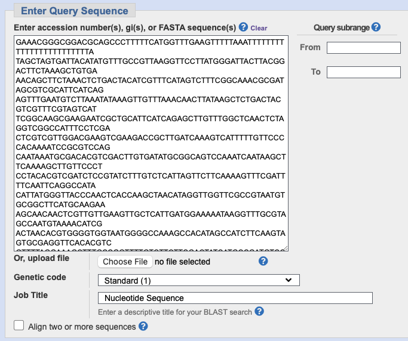
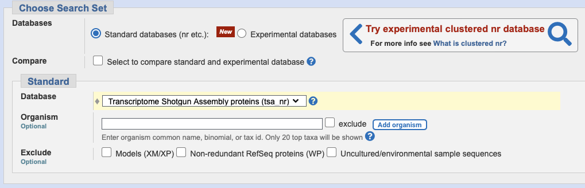
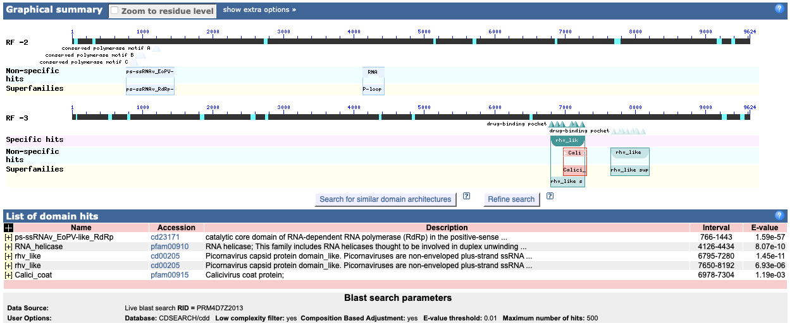
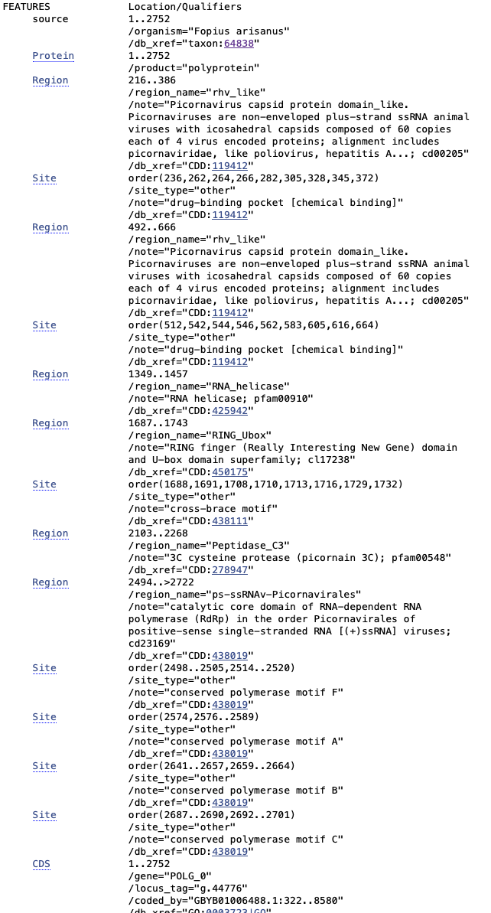

# Exploring Virus Genomes using BlastX with the Transcriptome Shotgun Assembly Database (TSA)
written by: [Gerd Bizi](https://github.com/gerd-bizi)

[10 minutes] BlastX is NCBI's tool that extends their BlastP alignment too that allows for alignments according to coding regions of DNA that are transcribed and translated in proteins, comparing each of the possible six ORFs. The Transcriptomic Shotgun Assembly database is a database consisting of transcriptomic data from different samples that allows us to understand gene expression from genomes.

**Tutorial Objective**: We will use BlastX with the TSA database to analyze a virus genome and discover potential novel RNA viruses related to a specific virus family or identify unique characteristics of the provided virus sequence.

## Input / Prerequisites
- [NCBI blastx webpage](https://blast.ncbi.nlm.nih.gov/Blast.cgi?PROGRAM=blastx&PAGE_TYPE=BlastSearch&LINK_LOC=blasthome)
- [The example virus genome we will be using]
```
GAAACGGGCGGACGCAGCCCTTTTTCATGGTTTGAAGTTTTTAAATTTTTTTTTTTTTTT
TTTTTTTTTATAGCTAGTGATTACATATGTTTGCCGTTAAGGTTCCTTATGGGATTACTT
ACGGACTTCTAAAGCTGTGAAACAGCTTCTAAACTCTGACTACATCGTTTCATAGTCTTT
CGGCAAACGCGATAGCGTCGCATTCATCAGAGTTTGAATGTCTTAAATATAAAGTTGTTT
AAACAACTTATAAGCTCTGACTACGTCGTTTCGTAGTCATTCGGCAAGCGAAGAATCGCT
GCATTCATCAGAGCTTGTTTGGCTCAACTCTAGGTCGGCCATTTCCTCGACTCGTCGTTG
GACGAAGTCGAAGACCGCTTGATCAAAGTCATTTTTGTTCCCCACAAAATCCGCGTCCAG
CAATAAATGCGACACGTCGACTTGTGATATGCGGCAGTCCAAATCAATAAGCTTCAAAAG
CTTGTTCCCTCCTACACGTCGATCTCCGTATCTTTGTCTCATTAGTTCTTCAAAAGTTTC
GATTTTCAATTCAGGCCATACATTATGGGTTACCCAACTCACCAAGCTAACATAGGTTGG
TTCGCCGTAATGTGCGGCTTCATGCAAGAAAGCAACAACTCGTTGTTGAAGTTGCTCATT
GATGGAAAAATAAGGTTTGCGTAGCCAATGTAAAACATCGACTAACACGTGGGGTGGTAA
TGGGGCCAAAGCCACATAGCCATCTTCAAGTAGTGCGAGGTTCACACGTCGTTTTAGGAA
AGCTTTGCCGGTTTTGTCTTCTTCGACTATCATGCCGATGTCCTCCATGTTCTTTTTAAA
ACTGATATGCGAGCGCAAGCGCTTACGCCTTAGATCATCTCCATAAATTAGGAAAACCTC
CTCGTCCCAACGATCGAAGTTTCCAAATTGTAAGTAATGGTCATACATTTGATAAAACAA
ATTAGCCATACTATTAAGGGCGTCAGTTCCAAAGGCTCCAGATGGAGAACCGCACAGCAC
GAAATACTTAAGATCATAGCAGACATGATGGGCGCCGGCCAACTCTTCGAATATGGTATA
CACTACTTTAAGATCTTCTTCTGTGTAGTCCAGATGTTCTCTACACCAAGCAATTGCTGT
GTCACGTATTAGTCTTAGTATTTGAGTGTGCCACGTTAGTCCAAAGTTCTTATAGTCTTC
GTCTATTGGATTAGTCACGCGACTCATAACCTCTGCCCACTCGCTAGAGTGTACATCTAC
TCCTACTTGTATACCAGTGGCATCACCTCTTATACTAACAAAGAATTGGGCTAGATACCT
GCGCATATCTATGAAAAGGTCTATGGGGCATCCGTTTATCAATCTCGTTGCTTTGTCCGG
TTTGAGTGTCTCGTCTTTGGGAAAGTCCATAAAAGCTGTGTCAGGTATTGTGAGTTGCTT
ACGTGTGTTGTGGTTATCGGTATAATATTCCACCAAGCGTTTGTCTACGGTTTGGGCTTC
TCGATCTATGACGTTTTTCTTTTTCCAACCGCTTGGCACTAAGTCTTTGAATGGCCATCC
TAGCGCGGTATTGAGGTTCATGCTTGGATAACGTATGTCATCAATCCCATTTACGGCTTC
AGAAAAAGTGAAAGGTCTTTTAATATTTGCTAAATCAGGTTTGCACGCAAGTATCTTTTG
TATAAAGAACAGTGACACGATGTTAAAAATCTTAAGTGGTATCTCTTTAGGTTTTATTTG
CTTGTTCGCTGCCTCAGCCACCACACTAACGCCTGGTACTTCGTGATCGCCACGTTGTTC
AGCCGGATAAAGAAAAGGACCAGCGACAAGTTCTGTAGTTGGTGAAGGTTCTAGTGCAGT
TTTACCAGAGTACGTAATGGGTTGGTCCAACACAGACATTGGAATCATGTTCTCACCAAT
TGGCACTTTTGTGTTTCCAGCTTTGAGTTTGTTATACCGGTGCAATTTCATATCGTAAGT
GGTGGCACCGAGCTTTTGTAATGCGTCTATGACCATTTGTCTATAAAGACAAACGGCAAA
TCCGACATTTTCGGCTCGATTATCGGCCACGAACATACCAATCATTCTCTTGTTGCTGGT
TAAGATAGCCCCACACCTATACGCCTCTGTGCGCCCGCTCCATCTGTAACCAACAAAATT
TACGGGACTCGTCAATGGGCCTGTGATGTAATGTAGTTTGCCTTGGTCTGGTGTTATTTC
AACTATCTCTGAGTTAAACACATTGTGCGTTCGTTGTTTATAAACAAGCGTAGACTTACT
TTTGATTGCAGTAGCTTCCACTTGATTGATGAAATGGCCTAAAATGTTGCGTGCCGCTGG
TAGAACGGGGATGTTTATTAAGGACAGGTCTAAAGGTCCATCTTCATTTTCGAAGTTAAC
GTATTTACATCCAGCCATCGATACCGGATATCGCATACCTCCTAACTCAACTTGGAAATC
ACCACCATACGCCAAAAAGTGACGAGGACATAAAACATATGTGGAACACACACGCAAGCC
TTCTACGACGTTACCGTCTTTGACGAGCGTCACAGTGTTGTTTGCGATAAAGTTCTCGAC
GTCCAACTGCTGGTCTCGTGGTTCAACTGATGTTATGACAGGGATCGTGACTGCTTTGTT
TTTTCCGCGCGTACTTGCCCCTTTCCCACCAGCATAGGCAGCTCTACCTTCCACTTCAGT
GGCACGCGATCCTTTCCAAAAAGTGTACAAACTATAGAATGAAGAAAATAATAAAAAAGC
GGAAAATGCTAATACTAAAAATTCTACTATTGAACTACCATATTTCTTAAAAGATAAAAT
GAGAACGTCTAAAGCGCCAACTTCCTGACGACGTCTAAAATAGAAAAAGGTCATAATGGC
ATCAATTTGAGCGTCACTTTGCAATACTTGACTTGGAAAAGTTCGAGTCATTAATTGATT
CAACATATCGGCTTGAGTTTGCACGTCTTCGATGTTTTGAACTGTACCTCTTACCGCCAC
TTTCATGATCTCACCATCCATGACAAACCGCATCTCTGTTCTACTCGTCTTACACAAACC
CCACCTACCAGTATACTTAACTGGAGCAGCATCAGGTTCAAACCAATGGCCCTGAGTGCC
TGGATACGTTCCTTGAGCTGGTTCGCCAGGAATGTGTCGCACGCACTCATAGGTGTTGGG
CATACATACACTAGGCAAAATAAACGATACCGACTGATCTGGTGCGTCAACTACAACTTC
TACTCTTTTATCTATCACTGCAAAATATGCTCTAGATAGAACATACTCATTATGTGGACA
TTCCATGGTGTGTTCCTGCCACCTTAACATAGAGCCAGGTGCATAATTTCTCCCTAAATC
CCGTCTAGTAGGTATTCTGCCGTGCCATCCTTCCCAAGTCGTCTGCACCCCCTGTATCTT
CATTGGTTCCGGTGAAGATTCATAGATGGTCCTACGTTGTGGTTGGTCGCATAAGTTGTA
GTACTTAAGTGTTGATTCTTCATAAATAAAGTCACATCCGCAGCTCTCAACATGTCCAGT
GGGATGTAAAACTCTTTGTAGTCGGGCAGGTACTATGCCATAGTGGTCAATGACGTATTG
CATGGCACATCCCAATCTCAAGTCCGTTGGTCTTGGTATATCATTTCGCGGGTGGGCTTC
AAAAGTTCTGTTATTACCCATAGTGTCAGCTTCGTTTTCAACTCTTCGCGGCAACTCATT
AAGACGCGCATTCCAGTCATCGGGTGTTAATTGACTGTACAGGTTCTTTTGTTGTTGACA
GTATTGCAGTTCTCTCTCTCGGTGTTTGGCCAGCATAGTCTTAAAAACAGGTATAAATTC
GGAAAATTTAAGACAGGCGATGCCAGCAGCGCGTGCATTACCATGTTCATGGACTCTAAA
GCGTAAATGATCAAAGGGGGGCTTCGTTCTAAACCATTCGGTGGGTATTCTATTAGCCAT
AGGGAAAGTTTTGTTATCTATGGTGACACGAATGTCAACACCATAATTAGTCAAAATGTC
GGAAACTACTTCTTCAGGTATATATGCTTCAAAAAGACAGTGTCTACGTCTATAAAATGC
AGTTGTTTCAACATTGCCTATGTTAGTAATATTTGGGAAGGAAAAGTTACTACAAACCAG
AACCGCCTCTGCACGTACAATGCGTCTTTTGTCCTCCAATTCGGCAAAGCTGGGATTAAA
TGGCCAAACGTCAATGAGGGACATAAACTCATTAACTTCCAGACTATACTGCTGACTGGT
TTGGTTCTTAGCAAAATCGGGAAACAATATAAGGGGCTGTTGTTGGTACCCATTCCAAAA
AGGTGTGTCAGACGTACGCGCATAGACTGGACGAGAAGACACAACGCCAAGTTGTTTGCC
AGCTTCAACCAAAAGCACATCCGCAATCCTGCTTTTGCCTATACCTGGTGTTCCANNNNN
NNNNNNNNNNNNNNNNNNNNNNNNNNNNNNNNNNNNNNNNNNNNNNNNNNNNNNNNNNNN
NNNNNNNNNNNNNNNNNNNNNNNNNNNNNNNNNNNTACATCCACATACAAAAAGGTGTCG
GTCTAACGGGTTCAGAACATCCGCAATCCTGCTTTTGCCTATACCTGGTGTTCCATACAT
CCACATACAAAAAGGTGTCGGTCTAACGGGTTCAGAACATCCGCTCTTGGCTAAGATATC
TATAATTTTGTTAAGCTTGTTCTTATAAGCGTAATAATTTGGTGGTACTGGTCTGCGCAT
TTCAACAAAAAGTGTGTCGAACTCGTTTGATCGTCTTCTCAGTTCGAAAATTTCTTTTGT
TGAAATGCGCAGACCAGTACCACCAAATTGTTAAGCTTGTTCTTATAAGCGTAATAATTT
GGTGGTACTGGTCTGCGCATTTCAACAAAAAGTGTGTCGAACTCGTTTGATCGTCTTCTC
AGTTCGAAAATTTCTTTTGCCACCCTTGGATCGTCGATGATTGTGTCTACATTATATTGC
TCACAATAATAGTTGACTTGCTCCATCCAGGCCACAACATCGGCTGGCACGTCTTGCGGC
TTCACTCCATTAAGGCCAAGCGTGGTCTTAATCCATTCTACAACTTTAGACAGCAAATTT
ATATGGGCGTCAAAGAATTTCTTAATGTTGAAGCCGTCTTTGAAGAAGTCTCTGCAGACG
TTCATGAACGTTTTACACTCGAATTTAGACGCTAGTTGTGTGCTAAAGCCTAGTGAAGCA
AATATGCCGGCAACAACGATAGAAAACCAAGAGGATGTGAGGTCGTCGTCATCAGAGCGA
GGCACAATACCTGACACATACTCAGCACATTTAGAGAATACACCAGTGACTTTATCAATC
ATTATCTTGGCTAAGCCAAACTTGTTGAGAAGACAAGCAATATTGAGACACGTTTGTGCT
GGTCCAGTGCTGTTGTAAACGTTAGTGATGTATGTAGCTAATTCAACTAAATGCATGGCG
CGGTCAATACTCTCCTCTGTGGTCTTAGGGTTTATAAGTCTGTCTATGCTTGTTGCAGTA
CTAGCGACGTTAGTAACTCCAGATTTTATGTCTTGATAGAGGTATTCCACCATTATAGCT
ATGGCAAGCGTGTGACTTAGGTGAGACGCCGCAGCCACAACTAATATGCGGCGCAGCCTT
GGCACCTGTCTAACAAGAAAATCCCAAGGATCTGGTATGCCACAGACTTTTGCTATGGCT
TCAACTGCTCTTGACACTCCGTCTCTTATGGTACTCATAACAGGTCCTGGATTGGGCTCG
ATACCTTCACGAGTGAGGTCACGAATCCATGTGGACTCTGAGGCTAAAATGCCAGAATTA
GGGTCTGCCCAGGCAGAAAGGGAGTCGTCACCGGTTCTAGTGAGAGCGTTACTGCTTAAT
ACGTTGGTAAAAGCCAATACATGGTCATTGCGTGGGAATCCTTGAAAAACGTAAAAGTTT
GCAGTATCGTCGAATGCTCGATGTATAACGGTAGCAAAATCCCAGCCTGTGTTCCTGAAG
TATGGTAGTATGTCTAGTTGGTAGTTCATATCACCTCGGAAGAATCTAAAACCGTCATGC
ATATAGCTAACGGCATCCAGAAGGTTGTAAGAAATTTGTTCCGAACCATCTCGAAGACCA
AAGGTACCTGCTGTAACGTCAAAAGCTAACAAAGCGTTATAAGGTTTGGCCTGAGTTTCG
CCAGGTTCAACGTAGTTAAATGTTAGCACCACGTTAATTCTACCATTGCAGTAGGACTGC
ATTGATCCAGAGAACGCCGTTGGGTCAACTCCGTTAGCCAGCATGGACATGTTGGAATTC
CATGGAACTCTAAAAGATATTGAAGTGTTAAGGTGCATGTTTATGCGCTCATGTGCCACA
AGTAAACTACGTCCAAAGACTGTAGCGCCAGGTATTTGACGCCAGTTAGGTGTTAAAATT
GGTACTACCGGGTTTGTGGTTTCTAAGCCAATAGGCACTGTTGGTACGTAGTAAACAGCT
ATGAGCGCATCTCTCAACAAATCTGAACCAGCACTAAGTCCTGCAAGACCAGAAGCTTGT
ATGTTACAAATAGGTGTGTAGCGCTTAACTACATCTCTGATCTCATAACGTTCGTTAATG
CTATTGTACCAAGTTGGTGTGGCTTCCGTCATTTTGGGCTTGCCGGTGATCATTTTAGAG
CGTTCGTCTACATCTTTAGTGTCGCCACGTGGTGTAGCTAACATATTAAGCTTCTTGGTT
CTAGCGAGAAGCCCGGGTGAATCGCTATTAGGCACTCTGAAATCAGTTCCAACGGGCATA
ACGTAATGGAAATTATCTCCTCCTCTCATCTCAATTAGTACCTCTATAGTCTGTGCAGCA
GTAGGGTTAGCTCTAAGTGGATTAACAACGGCAACACGAACAACTCCATAAGATGGATAA
CGAGTCAATGATCCGGGACTTAAATCGGAGTCGTTTAATATGAGGTCCCATTCCCTGATG
CGACCTTTATGAACTGCATACAAAGTAGGGACTTGGTATGGTATAGTGAACATTACTTCA
CTTTGGTCTTGTATGTCAATTACTGATGAATAATAGCAAGCGTCGTTAACATCCGCGGGG
TACGCATCGGGGGTGTATGTTATACTTAAACGGCCAGAGTGGAATTTGGATATGAAAAAA
GTGAACCTAAGTTCCATGTCGCCGTGGTATCCAGCGTAAAAACTACCTAGTCCGGCTAAA
GGTGTTGGAAAACATATCCCAATAGAGGGGGTATATTGCTGCATAGGCGAGACATCAATA
GTTGCTAGCTGGGTTCCAGTATCATTCGCCGTGGACCACTGGAATTGTTGGATCTTACCC
CACTGGCGCTTTAAAAAGTTACTACTAAATTGGTTGTCAGAAGGCACAAGATCTTTTGGG
TGTGGACACGTATTATCGTGCAATAGTTGCAAGAGCTTGACTTCATTCGTTCCAGTTCCT
AAAGACAGAGAAGTATTTTGCTGTGGATAGATAGTGACAGGCTCAACAGGTCTTTGTGGG
CGGTCACAATCAATCAAGTCCAATTTGGACAATAAATTCTCGACTAGAGCCACTTCAGGA
CTGTGGGTGAGCGTGCCTAAGCCTTGGCTACCATTGTCCATACGAGGGGTGGCCTCTCCA
ATTATACGATCACCACGTGGCACAACTTCTCTGTAAGTGCGTTGGCCGTAGAACTGGAGG
TTCTCAAATGTACCATAAACTACCACGTTTGCTGTGCTAACTCCTTCGGCTCCTGAACGA
AGTTGGCCTAAGACACCAAAGAACAAGGTGTAATAGTATGAGCCACGAGATATTGCGGTA
TTCCTTGTAGACACTACGGGAAGTTGGAAAACCCATGGAACGTGAAGCTCTCCGGTGTTC
GAAGAGGCGGCATTTAGACGCACGTGCGGCATCTGTATAAGTTGGGCGGAATTTTCTATT
CTGATGCCTGCAGCATTTGCATTTGAGGCGTTGTACATTACACCAGCTATAAGCATTCCA
CTTTGACCAGGATTGGTATTAATCTGTATCTTAAGACGCATGTCTGTTTTAAAATAGGCG
TACTGATCAAATAACAAGGTGTTAGGCGCACAACGTGCATTTTGCAACATAGTAATGGGC
AAATCAACTCGCTGTATAATATTATCGGCGGAGTTCGCTGAGCTCCATTGGAAAGTCAAA
AACTTACACCACCTGTCTCCCAAACTGGATAGTGTTACTGGGAGCTCATTTATGAAGGAT
CTGGTAGTGTTTGCAACTGTGGCAACCTCTGATTTGCTAGGCAAGGTGGTGTCAGTAAGT
TGTACATTGGCAGCATCGTCAGTCGCCATATCTCGATTCAATTCTGCAGTTTCACGAGTA
TTATCTACTTGTGTCGTGGGTTCCGTACTGCCAACTCCAGCAATTCCTGTCACCTTCGAG
CTACGCGGTGTTGCCTCACCTCGCTTCATGATATTACGCGCGGGGGGAGGTTTCAACATA
GCTGTGACCATGACGGTTCCAACAGGTTTAGGCAGGTATTTCTTGACAACTTCTTCTTTG
GGCTTATCGCTTCGTGGTTCAACACACGATTGTAGGAATAACAGACACAAAGTTTCCTTA
AGTTGTTTCTTGTTAACATGCGACACTATCTCTTTATAATAAACTAAGCTTTTATCCTTA
TAAACCATTAAAGTGGCAAATCTGACGCCTTGAACAAATTCAAAATTAAAGTTTGATACG
AACCTATTCTTTTGACAAAACTCGTTAAAGTATTGCAAAACATTTCCGTTATACTTGCTT
ACAATGTCGTGGGACTGGATAACATTTTCCGATGAACTAATGGCCTGCCAGTCTGAGCCA
TCTAGCACCGTCGGGGCCGCATGTGAAACATTATCTTTGGATTTGGACATTTCATATGCG
GTTTCTTTCTGGGTTCCATTTAACTCAAATGAGCCCGTCAACAAAAGGGTGTTACTATTG
CTACACCAAAGCATGTTTTGTTCGTTAGGCAAATCGTTTTCCTTATTGCAAGCAATATCG
TGGGACTGGATGGTATTTACCGATGAACTAGTAGCCTGCCAGTCTGAGCTACCTAGCACC
GTCGGGTTCGCAAGTGACAAATCATAAGCTTGTTTAGACATTTATCACGTGCGTAAACTG
GGTTCCATTTAACTCAAATGCACCCGTAAACAAAAGGGTGCTACTTAGGCTGCACCAGAG
CACAACTAAAACTAAAAGTTTAAAACTGAGAAGAAAATTGGATTTTCTTACAATGCCATA
CAAGCGAGGCTTAAAAGCAAGGCTCGTATTGTCAACCGTAACTAAGCCGAATCATTCAAC
CGTAACCAAGTCGACGGAGGCAAGGTCTTTGCGAGGGTGACGTCATATCTCGTATCAATA
ACACCGCGGTGACGGACGCAATGACCTTGAAAGAAGCCAAGAAACTCGTGGAGTCTTGCA
AGGATCGACTTAACTTGGTCATTACTAGAGAACTCATTAGGGAGGAGACGGTCACGAATG
GAAATTACCAGAATAATTACAGTAGTTTAGAAGCGACGCCTCACACGACCTATCCTAGCA
GTGGGGATACTATGTCCTCTCCGTACTCCAGCAGTGGACAGAACCTGTACGTGGCGGCAG
CGGTGCGCGGTGCTGACAACAG
```
## Output

The result of this analysis will yield a list of potential hits for various
proteins that were aligned.

### 1. Setting up the Search

Copy and paste the nucleotide sequence into the query sequence box.


In the `Choose Search Set` box, select the:
`Transcriptome Shotgun Assembly proteins (tsa_nr)`


Within the `Algorithm parameters` section, toggle the `Max target sequences`
number to the desired quantity.


Toggle other parameters as your analysis sees fit.

### 2. Retrieve results of search.


You may toggle the order in which the results are presented. For the sake of
our analysis, we will be focusing on `JAG76255.1`.

### 3. If applicable, look at the graphical summary of the conserved domain.

Here, we can see if there are any conserved domains.


We can see that we see the palmprint for RdRp, among other regions needed for
RNA viruses.

### 4. Click on the accession from the list in step 2 to further analyze.


Here, we can see that we have a picornavirus capsid protein domain_like region,
along with alignments for other domains like RdRp.
These information should be used for further analysis. 

### Conclusion

That's it! You've used the BlastX w/ TSA to make discoveries regarding RNA 
expression across different samples!

With this, users will be able to individually analyze and align different
genomes to learn more about their sequences.

### See Also:

- [TSA Guidelines](https://www.ncbi.nlm.nih.gov/genbank/tsafaq/)
- [BLAST Documentation](https://blast.ncbi.nlm.nih.gov/doc/blast-help/)

