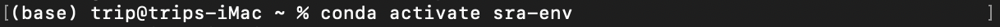
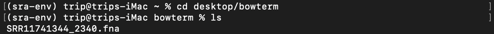
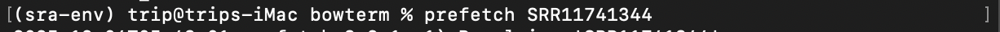
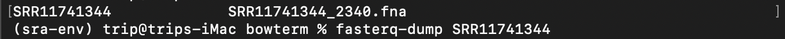
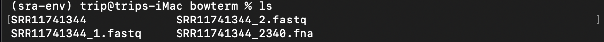
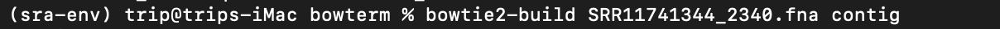
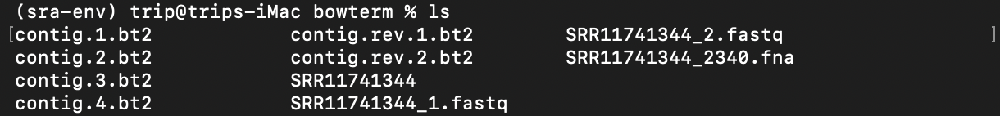
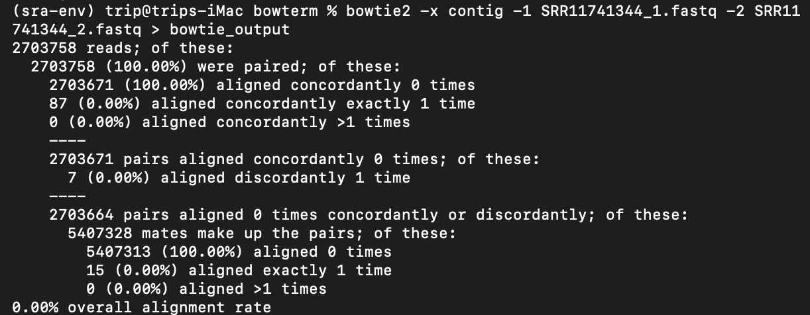
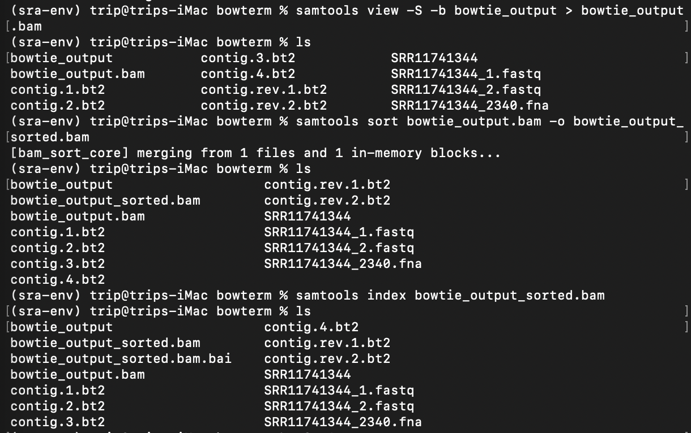
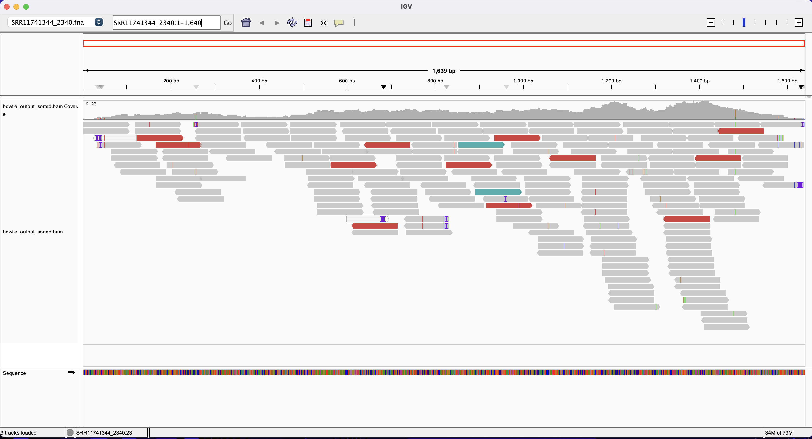

# bowtie2 tutorial + a little bit about IVG
written by: [trip - flavia tripon](https://github.com/triponfl)

[~20 minutes] Bowtie2 aligns sequencing reads to reference sequences (so you will be able to use the output file to see coverage of a reference sequence if you add it into IVG). In relation to the VIRUSxDISCOVERY project, the aim is to determine reads from the raw SRA (SRR/ERR) file that align to the contig you've determined.

**Tutorial Objective**: Align SRR11741344 reads (raw) to SRR11741344_2340 (the contig you found related to your virus)

## Input / Prerequisites
**Required packages**: sra-tools, bowtie2

**Please note**: 

- I operate on MacOs and use Conda to create separate environments (sra-env - you will see this below) and install various tools/programs. There are other ways to get sra-tools and bowtie2, but this tutorial starts with Conda.
- If you're confused about this setup or wish to follow it, I recommend looking at: https://docs.anaconda.com/miniconda/miniconda-install/, https://bioconda.github.io/, https://anaconda.org/channels/bioconda/packages/sra-tools/overview, and creating the environment with this line: conda create -n name-of-your-environment -c conda-forge -c bioconda sra-tools.
- Apologies if the links are unclear or don't work for you, I would then suggest using Chatgpt to determine what works best for your operating system and to tell you how to fix any errors that pop up. 

- If you already have sra-tools and bowtie2 installed, feel free to ignore steps 1 and 2!

**Required inputs**: a folder containing your contig file (.fna) - all other inputs for bowtie2 will be done in the command line and get automatically added into your folder while you work in that directory

official manual: [Tool Manual](https://github.com/BenLangmead/bowtie2/blob/master/MANUAL.markdown)

example data to follow along: (my contig that you will see as SRR11741344_2340.fna in the screenshots)
>SRR11741344_2340
GGGCCAGTTTCAGTCAACAAAACTGATTTCCTTATGGAAATTCCTTTCAGAAGGATGACTTTATGTAGTCAA
GGAGGAGGTGTTTCTCGTGAGGGAGAAACAGAGCTTTACAGTCAAGGCGTTGCTCACACCAGAGCAGGCGAA
GATTCTCACAAATCACGTGAAGTATCTCAACCGCGTGGATGACGTGACCAAGGGTGGTGCCTATGATGGTAT
CATGTACCACTTCATTCTGGAACACGTTCCAGAAGCACGAAAGCCACATCTTGTGCAAATGCATGATACATG
CCGCAAGTATGGTTATGCGTCAAGCTATAAGAATGTCGGAATGATTGATACGGCAATCTCGAAATTTGCACA
ACCACATGTCCCGGACAAGCGGTGGGCTAAAGCTTACCAAAAGGCATTCCAACGTGTATCGTCCTGGATTAA
AGAAGCTCGGCTGCGGCAGCTGCATTACACATGTGCAGATGTCATGTGGGAAGCTCTTTCCCGTCAAGATAC
GGCCGCCGGTTATACCGGAGTCTTAGAAGGTAAAACTAAGAAGAAGAATTTTGACAAAGAAGAGCTGTTCAA
GCGGTTCGTAGAAGAAGAAGCTCCACTTGCACGCGAGAGAGGCTCGTTCTGTAAACCATTCATCACGGCTGA
CAGAACTCAAGCTAAACCTGCGTTTGTAGATGGAAAATGCAAACTCAACCCAAATAGCGTTAAGGACTGGTC
CATCTATAAGGACAGACTTATCTGGGTAACTGATGTTATGCACATCTTCGGCGAGCTAGGTTTCGCGAGACC
GTTCCAGGACTGGTTCTCCAAGCAATGGTACTACATGGGAGGCAAGAACGACAAGTTCATCTCAGAGTCAGT
GCTGTGGCAGAGGCAAAGGTATGGGAACAACTGGTTCAGTGCAGACATATCTGGATTTGATGCCAGCATACC
TTGGTGGGTACTCATCGATGTGTTTAAAATCATTCGATCTGCGTTTGATGATGAAACATTTGATGAGCCTCT
ATGGCAGGCAGTAGTCAACGACTTCATCTACAAAACAATCGTTGACCCACACGGAAACTTTGTTTGGGTTGA
GAACGGCGTACCTTCAGGTAGCATGTTCACAAGCATTGGTGATTCCATTGCTAACCTTCTTATGTTTGAGAC
CGTGGTGGAAACCCTGGATCTTGGTCCTCATCACACTAATGTCATGGGAGACGATAATCTCACATTCCTTGA
CAAACCTGTGACTGATGAGCTGATGCAGCAAATCTCTCGGGTTCTGAACACTATGTTCGGATTAGTTATGCA
TCCGCAGAAATGCACAACCTGTCTGGTAGCTAAGGATCCAACCTTTCTATCAAGAACCTGGACGAGGTTTGG
GGTTCATCGACCTCACGAAGAACTCTACACTAAGCTTCTCTATCCGGAGAAGAATAGGACGTATGAGGGCTA
TACTCCAAAGGACATTATCAAAAGCTATTATGATAGTTTTCCGTTGGGTATGGAGGAGTTGTTCTCAGCTGA
AACGATTCATGGCTTACTTGAGGGAGCGACGACGAATCACGAACTTAATGAATCCCTTCAACCGCAGACAGG
TTTGGAGTATGTACGCAAGTTCATACCTCAGATTTGTGAGCGTGATGCTCAGGTTG

## Output

Your folder will end up having a lot of files! The key one to use for IVG later on is a .sam file that you will name - it contains the alignments. You can then convert it to .bam to use for IVG (instructions at the very end).

## Instructions

All operations are done in terminal. You can just copy paste the lines but switch out specific such as the folder name or what you want your files to be named. No need to copy the $, it just refers to the actual command lines you can use. The screenshots cover major sections and ls is used to show you what should be in the folder (folder is named bowterm).

### 1. installing bowtie2

$ conda install bioconda::bowtie2

### 2. activating conda sra-tools enviornment (sra-env) 

Remember, that this is assuming that you already have sra-tools and an environment for this program.

$ conda activate sra-env

### 3. set your working directory to the folder containing your contig

$ cd desktop/folder

### 4. sra-tools - retrieving raw SRA file 

This is where sra-tools comes into play. Prefetch gets the file from ncbi and fasterq -dump splits it up.

$ prefetch SRA#

$ fasterq -dump SRA#

### 5. bowtie2 - indexing your contig

Now that you've set up your raw SRA for bowtie2, you have to prepare your contig now as well.

$ bowtie2-build your_contig some_new_name

### 6. bowtie2 - aligning!

$ bowtie2 -x some_new_name -1 SRA_fastq1 -2 SRA_fastq2 > your_output_name

Note that -x is a sort of prefix, so even if you see a bunch of files with the name you gave your indexed contig, -x makes sure to look only at the name you gave it (so it takes all those files).

### Conclusion

Ok great! You now have your alignment file (.sam)! Below is some converting and sorting steps to be able to use the file for IVG (and to just be able to understand it).

## IVG-related + samtools for conversion and sorting

You have to convert your output so that you can use it in IVG. This can still be done in terminal using samtools (you will have to install this if you do not have it).

### 1. samtools conversion (.sam -> .bam)

$ samtools view -S -b your_output_name > your_output_name.bam

$ samtools sort your_output_name.bam -o your_output_name_sorted.bam

$ samtools index your_output_name_sorted.bam

### 2. IVG

- in genome, place your contig file (SRR11741344_2340.fna) (your_contig)
- in locus, specify where your ORF is (SRR11741344_2340:1-1,640) (your_ORF - this would be a file you have already, not from the steps in this tutorial)
- click on file and open file to then add your alignment from bowtie2 (bowtie_output_sorted.bam) (your_output_name_sorted.bam)

you should see something like this:

### Conclusion

Hopefully this helps out!

### See Also:

- [Another set of instructions](https://bioinformatics.ccr.cancer.gov/docs/b4b/05.-Using-bowtie2-to-align-sequence-reads%20copy/)