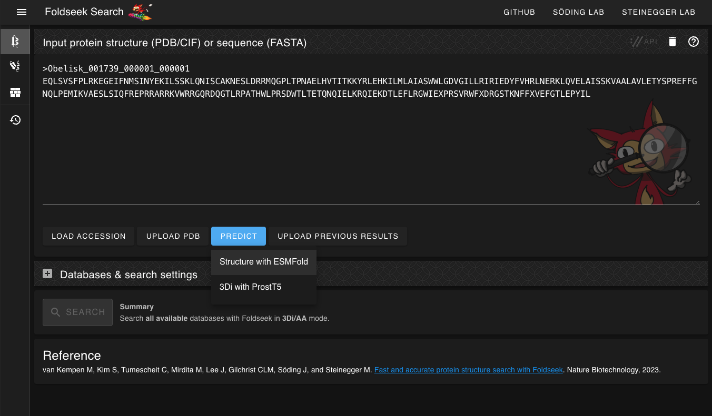
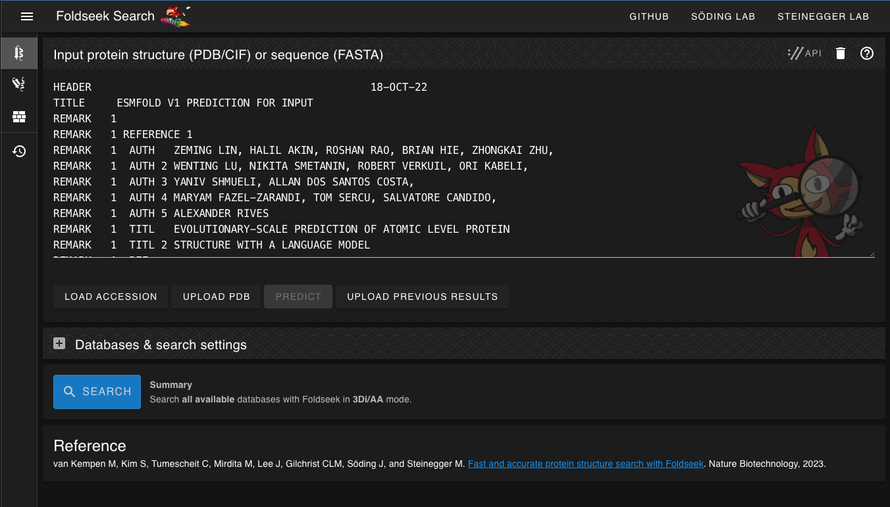
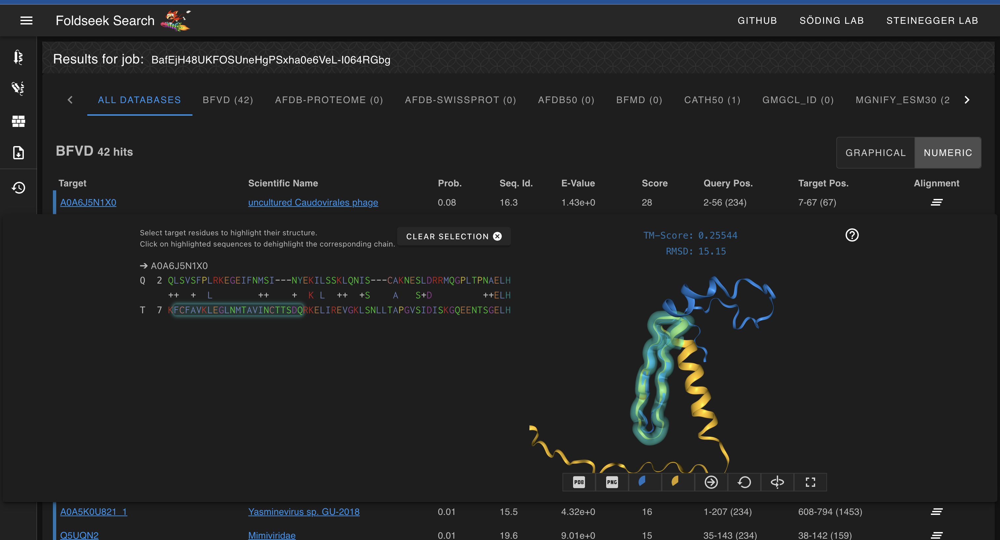

# Foldseek
written by: [Izumi Ando](https://github.com/izumiando)

[10 minutes] This is a tutorial of Foldseek, a tool that allows you to search through multiple databases for similar proteins based on structure, not just alignment. It takes in either a protein sequence or a PDB file / accession and returns a list of proteins that are similar in structure by doing an alignment of the 3Di sequence. (3Di sequence : The developers created an alphabet that captures the nearest neighbor interactions of a protein which is used in Foldseek to find proteins similar in structure but have very different protein sequences.) This tool can be used for Virus Discovery as a starting point to find hints on the characterisitcs of the Oblin the Obelisk encodes and to find structurally similar viruses.

**Tutorial Objective**: Pick up hints on how to find a protein with a structure that is similar to the Oblin encoded by Izumi's Obelisk.

## Input / Prerequisites
- [Tool Weblink](https://search.foldseek.com/)
- Required Inputs: either a protein structure (PDB/CIF), PDB accession, or protein sequence (FASTA)
- The webserver provided for this tool should be enough for most users, but if you would like to install the tool on your computer you can refer to their GitHub for installation & set up. [Fold Seek GitHub](https://github.com/steineggerlab/foldseek)
- Sample Input: Izumi's Obelisk's protein sequence generated with the Biostring R package  [Download Here](https://drive.google.com/file/d/1oL9xgQQk4j44UJfJKJd1MtCDoJumQos5/view?usp=sharing)
- [R script used to generate the protein sequence above](https://drive.google.com/file/d/1m8uXUS3BAtTPnSg0PWIGKHg0fJr-Wiau/view?usp=sharing)

## Output

Foldseek will return a list of proteins similar in structure to the query. For each result, the user can explore each result by looking at the protein sequence alignemnt, viewing the superposed 3D structure, and checking the TM score all within the online tool. You can also download the **PDB structure** or its **PNG** to use outside this tool in software such as Chimera or pymol. 

### 1. Download protein sequence FASTA file & upload to Foldseek

- First, download the protein sequence FASTA file from the link provided above. This protein sequence was generated from the whole nucleotide sequence of Obelisk_001739_000001_000001 using the R package Biostrings. The script used for this also provided above for reference and reproducibility. 
- (new note) Better practice would be to find an open reading frame using a tool like ORFfinder (https://www.ncbi.nlm.nih.gov/orffinder/) and using the output protein sequence rather than crudely converting the whole DNA sequence into a protein sequence. 
- Next, drag the FASTA file into the input box and click "Predict" for "Structure with ESMFold". This will call the ESMFold protein structure predictor made by Meta to predict the structure of the Obelisk. This step is necessary because there are no structures currently available for this Obelisk. If there was, (for example from a previous AlphaFold run,) the structure from that could be used as a search query instead in Step 2 of this tutorial.

### 2. Run the search query

- After a few seconds, the sequence should be replaced by the results of ESMFold as can be seen in the image below. The "Search" button should also now be clickable, so click "Search" to continute. 
- If you are using your own data and already have a structure ready for input, you can skip Step 1 of the tutorial, upload your structure in the query box and proceed directly to Search.

### 3. Examine the search results

- Scrolling through the results, we see that most of the hits come from the Big Fantastic Virus Database (BFVD) set up by the Steinegger Lab containing predicted protein structure of viral sequences generated by ColabFold. [About BFVD](https://bfvd.steineggerlab.workers.dev/)
- We notice also that sequence identity is quite low, even for the hits with higher scores (click on "Numeric" to view all statistics). However, it is important to notice that for this search, we used the entire provided nucleotide sequence of the Obelisk to generate the protein sequence ignoring the start codon so with adjustments on how we generate the protein sequence, these results may differ even if we do the search on the same Obelisk.
- Let's do some exploration on the top hit. Click on the 3 bar icon under "Alignment". You should be able to move around the predictied structure of the Obelisk superposed on the predicted structure of the "uncultured Caudovirales phage". Notice that by highlighting parts of the target sequence on the left hand side of the screen you can see which parts of the structure it corresponds to (refer to screenshot below). You are also able to download this structure in PDB format as well as an image by clicking on the icons below the structure. The two circles next to those buttons extends the structure to the regions of each structure that did not align at all. 
- Highlighting some of the hits with higher matching scores, we can notice that the "uncultured Caudovirales phage" from BFDV has an overall score of 28 which is much higher than the rest of the hits and the "Dictyostelium discoideum" from the cath50 database has a TM score (a metric of similarity of two protein structure) of 0.3 which is significantly higher than the rest of the hits, despiting having a lower overall score.
- These two hits may be a good place to start for further exploration using third-party software / data.

### Conclusion

That's it! You've used the Foldseek to find hints to uncover new leads to figure out what proteins may have a structure similar to the Oblin coded by Izumi's Obelisk!
Based on the analysis in this tutorial, we now know:

- The predicted structure of the Obelisk does not match almost any experiementally confirmed protein or RNA structure with the exception of the hit on 
Dictyostelium discoideum (cellular slime molds). 
- The predicted structure of the Obelisk is structurally similar to the predictied structures of "uncultured Caudovirales phage" from BFDV and "Dictyostelium discoideum" from the cath50 database.

With this information, we can now further our exploration by searching for any available data on the organisms or search for any available annotations on the protein sequence region that aligned with the Obelisk. Hopefully, you are now comfortable using Foldseek for you Obelisk exploration as well.

### See Also:

- [Fast and accurate protein structure search with Foldseek (Nature publication for this tool)](https://www.nature.com/articles/s41587-023-01773-0)
- [Video Tutorial of Foldseek on the SBGrid Consortium YouTube Channel](https://www.youtube.com/watch?v=k5Rbi22TtOA)
