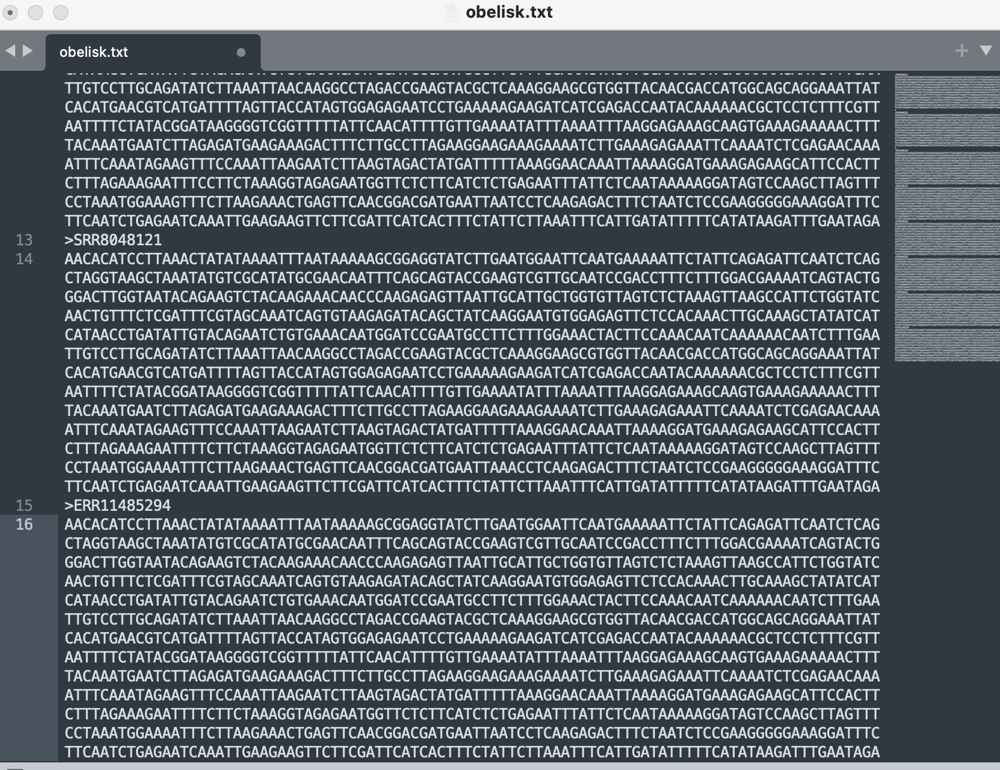
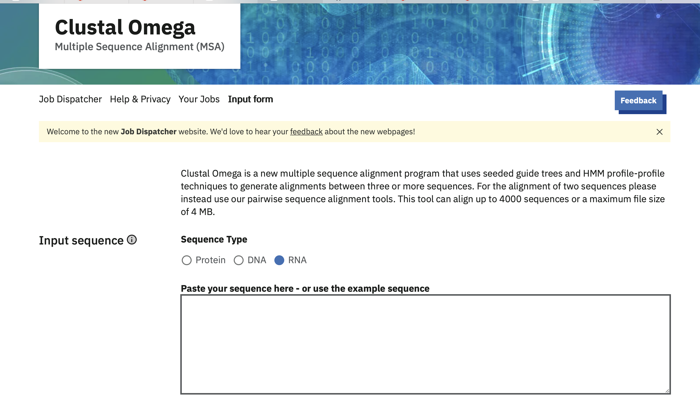
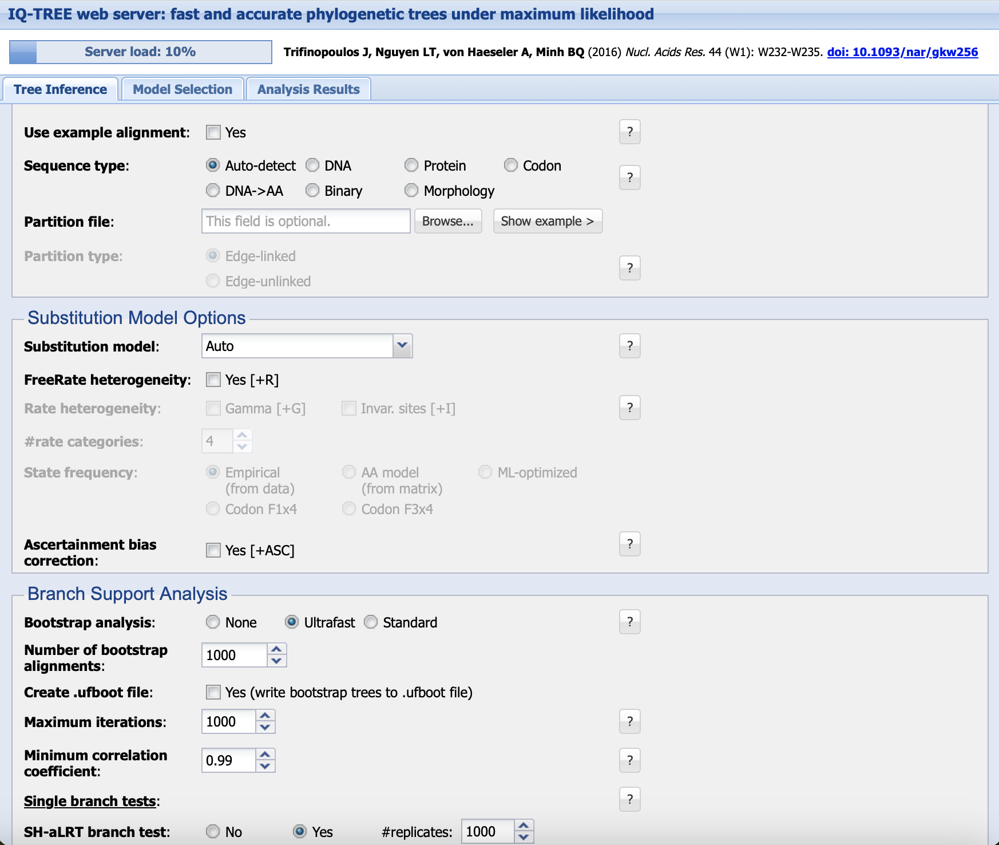
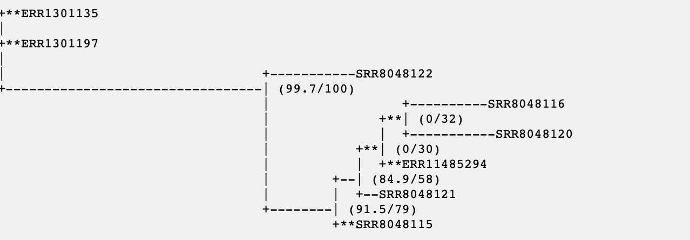
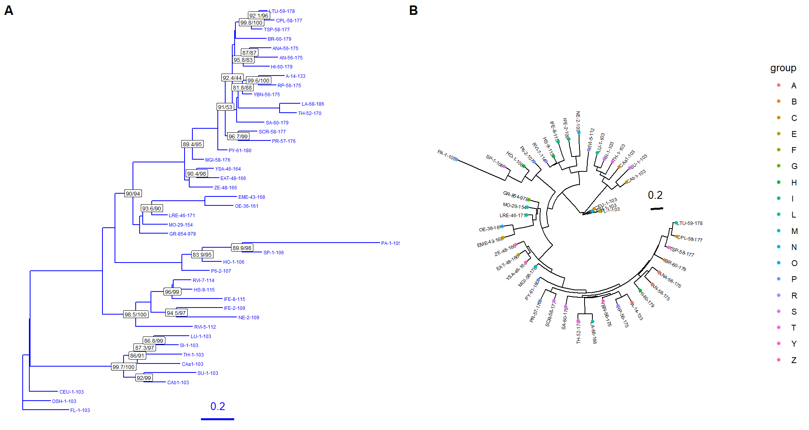

# IQ-TREE

written by: [Vedika Jha], Edited By: Caitlin Oxley, Megan Ding

[10 minute] IQ-TREE is a user-friendly way to generate phylogenetic trees using maximum likelihood (ML) methods. It allows users to input a sequence alignment of any kind (DNA, protein, etc.), chose an appropriate evolutionary model for substitution rates, and other parameters for branch support and tree searching. It then outputs an inferred phylogenetic tree of all sequences in the alignment. This allows users to understand how unknown viruses are related to known viruses in their family or order, or compare how different strains of an unknown virus are related. It can also be used to learn more about the emerging obelisk.

**Tutorial Objective**: We will understand how to use the Tree Inference tool of IQ-TREE to generate phylogenetic trees for a given alignment of sequences.

## Input / Prerequisites

-   [Tool Weblink](http://iqtree.cibiv.univie.ac.at/)
-   [Link to example data](http://www.cibiv.at/~jana/example.phy)
-   ...

## Output

When running the Tree Inference tool, the results will contain up to seven files. The main output will be the phylogenetic tree of the aligned sequences generated by the maximum likelihood method. This will be provided in .svg, .pdf, and .treefile formats (can be viewed using treeviewer programs such as FigTree). The other files include a run log (.log), full results of the run (.iqtree), and a checkpoint file (ckp.gz) if the run was stopped. The full results of the run (.iqtree) can be visualized on the webserver.

##### Note: If your alignment input is larger than 8 MB or the job takes longer than 24 hours or uses more than 1 GB RAM, the webserver will not complete your job. To run your analysis, [download IQ-TREE](https://iqtree.github.io/) to run locally. IQ-TREE offers a comprehensive [beginner's guide](https://iqtree.github.io/doc/Tutorial) for its command line interface.

### 00. Navigate to a text editor

We used sublime to put my sequences into a form that can be recognized by a MSA tool. Using the SRA number as the main identifier of each obelisk sample sequence. eg."(OBELISK_SRA_NUMBER) \> obelisk_sequence". Then we saved the file with a ".txt" suffix. 

### 0. Generate an alignment of sequences that you want to map on your tree

Before using this ID-TREE, you will need an alignment of your sequences of any kind (DNA, protein, codon, etc.). Sequences may include Rdrp sequences of similar viruses (identified using BLAST) or known viruses in the same family/order. This alignment can be generated in several ways, including Clustal Omega, MEGA/Muscle, or MAFFT. See links at the bottom of this document. Here is an example of Clustal Omega: 

### 1. Navigate to ID-TREE, tree inference tab



### 2. Input your alignment

Next to "Alignment file" press "Browse..." to input the MSA file. The alignment must be in Phylip, Fasta, Nexus, Clustal, or MSF format. These formats can be generated from the tools listed in step 00 and 0.

You can select the sequence type based on how you did your alignment, or leave the program to auto-detect it. If you use auto-detect, the analysis results page will show what sequence type is used. If you select sequence type, make sure it matches what your alignment has (for example, using Muscle Codon alignment means you should select Codon, using Clustal Omega DNA alignment means you should use DNA) Binary sequences are encoded by the characters 0 and 1, and morphology sequences allow 0-9 and A-Z as characters, these types are not as common.

You generally do not need to use the partition model, as this is for multi-gene alignments and different subtitution models for each gene. If you think this is needed for your data (containing multiple genes that are likley to evolve very differently), see the link below.

### 3a. (Optional) Use the model selection tool to identify the best fitting substitution model

By navigating to the "Model Selection" tab and inputting the alignment (following step 2), you can find out which substitution model is the best fit for your data. Submit your job using "BIC" as the selection criterion. BIC has slightly different criterion for selecting the best model, penalizing models with more parameters. In the literature, it has been shown to be more accurate for phylogenetic data (see links below). However, getting results from corrected AIC as well (running another job) can help you better understand your data.

The lower the value of both AIC and BIC tests, the better the model fits your alignment.

### 3b. Choose your substitution model on the Tree Inference Tool

Choose your substitution model either based on the model selection tool step above, or use "auto". If the lowest value model from the BIC result included "+ G", "+R", and/or "+ I", check the "Gamma", "Free Rate", and/or "Invar. sites" buttons accordingly.

No other parameters (State frequency, ascertainment bias) need to be changed from default for this analysis.

### 4. Select branch support analysis methods and other parameters

Calculating branch support can show you how likely the resulting branch in the tree is given the data, kind of like a confidence interval. Using ultrafast bootstrap will be the fastest option, and all other parameters can be left at the default.

### 5. Submit the Job.

Click the "Submit" to start the analysis. You will be directed to Job Progress page where you can see the time you submitted the file and the status of the analysis. 

### 6. Visualize results in webserver, download trees for further visualization

Click the "Full Result" tab to see your tree. The output will include: - The phylogentic tree in newik format. - Model summary: list of the best-fit substitution model and parameters. -Log file: analysis steps and likelihood scores. -Bootstrap file : bootstrap support values

Download the necessary files of interest. Below is the phylogentic tree that was produced using the obelisk371 data. )

In the "Analysis Results" tab, you will also see the model finder (if "auto" was used for model selection), the parameters of the model used, the maximum likelihood tree, and the consensus tree from "bootstrapped" data (see below for bootstrapping details). The Maximum likelihood tree can tell you how your sequences are related, but if it disagrees with your consensus tree, then those branches/clades/relationships are not well supported.

Other programs such as [FigTree](https://tree.bio.ed.ac.uk/software/figtree/) can be used to further manipulate the tree. Download the results (using the "Download selected jobs" button) and open the .treefile in other programs to reroot the tree (if you have a known outgroup) or change labeling. The .pdf or .svg can be used for result reporting if no further manipulation is required.

### 

### 7a. Interpreting Results- Figures

While you can use the given \*.pdf or \*.svg files or a software like FigTree to visualize your phylogenetic tree, you can also stay in the R environment to produce and customize a tree figure using the package [*ggtree*](https://guangchuangyu.github.io/ggtree-book/chapter-ggtree.html).

First, we must read in the IQ-TREE output.

``` R
# install ggtree and treeio
if (!requireNamespace("BiocManager", quietly = TRUE))
    install.packages("BiocManager")

BiocManager::install("ggtree")
BiocManager::install("treeio")

library(ggtree)
library(treeio)

# import output from IQ-TREE: *.treefile

my_tree_file_path <- "path/to/*.treefile"
my_tree <- read.iqtree(my_tree_file_path)
my_tree
```

``` R
# make sure that we load cowplot

require(cowplot)

# standard phylogenetic tree
p1 <- ggtree(my_tree, color="blue") + 
  geom_tiplab(size=1.7, color='blue') + 
  geom_treescale(fontsize=4, linesize=1, offset=1, color='blue') +
  geom_label2(aes(label= c(my_tree@phylo$tip.label, 
                           my_tree@phylo$node.label), 
        subset = !is.na(as.numeric(c(my_tree@phylo$tip.label, 
                      my_tree@data$SH_aLRT))) & 
        c(my_tree@phylo$tip.label, my_tree@data$SH_aLRT) > 80), 
        size = 2) 

# same tree, but let's color by some made up metadata, add bootstrap support labels, and chose a different layout
metadata <- data.frame(strain = my_tree@phylo$tip.label, 
                       group = substr(my_tree@phylo$tip.label, 1, 1))
p2 <- ggtree(my_tree, layout="circular") %<+% metadata + 
  geom_tiplab(size=1.7) + geom_tippoint(aes(color=group)) +
  geom_treescale(fontsize=4, linesize=1, offset=1)

# use cowplot to print both side-by-side

cowplot::plot_grid(p1, p2, ncol=2, labels = LETTERS[1:2])
```



In plot A, we have a standard rectangular phylogenetic tree. The nodes with high confidence as labeled with their support values.

In plot B, we have the same data, just formatted in a circular tree. Each tip is coloured by the first letter of the strain. For a more informative plot, you may want to colour by the host animal or the country of origin.

The key legend component is the scale bar. This shows the divergence of your sequences. The number of nucelotide substitutions per position is proportional to the length of the tree branches.

### 7b. Interpreting Results- Significance

The overall model chosen by IQ-TREE is selected via BIC as default. IQ-TREE will choose the model with the lowest BIC.

On your final phylogenetic tree output from IQ-TREE, you will see Shimodaira-Hasegawa approximate likeliood ratio test (SH-aLRT) and ultrafast bootstrap (UFBoot) support values in the format *SH-aLRT/UFBoot.* The interpretation of SH-aLRT values (and most bootstrap support values) is that an 80% SH-aLRT value means that, during bootstrap resampling, around 80% of the trees that were built contain this clade. The interpretation of UFBoot values is that a 95% UFBoot value corresponds to roughly a 95% probability that this clade is real. UFBoot values have a much less conservative interpretation compared to the SH-aLRT values, so the threshold for "significance" for a clade is $\geq$ 80% SH-aLRT and/or $\geq$ 95% UFBoot value. Note that UFBoot is not a completely standard support value compared to SH-aLRT, which is used in many publications apart from IQ-TREE. Furthermore, this is all statistics! It is important that you think about the biological basis of your IQ-TREE results in tandem with all of these support values.

### Conclusion

That's it! You've used IQ-TREE to generate a phylogenetic tree!

Here, We've provided basic tutorial on how to use IQ-TREE to select a maximum likelihood substitution model and generate a phylogenetic tree. The resulting tree from your analysis can show you how different viral species/strains are related to one another. You can learn more about the details of model selection and the IQ-TREE tool in the links below.

### Application of IQ-TREE

[*Highly diverse ribonucleic acid viruses in the viromes of eukaryotic host species in Yunnan province, China*](https://pubmed.ncbi.nlm.nih.gov/36312977/)

This paper by Han et al. in 2022 uses IQ-TREE to create ML phylogenetic trees for the viral composition of bats, pangolins, monkeys, and more. With evidence from the estimated phylogenetic relationships between these diverse viruses, they identified five Alphacoronavirus strains, which shared phylogenetic association with Bat-CoV-HKU8-related strains. They were also able to describe the evolutionary origins of several novel viruses that were highly divergent from know species or showed evidence of recombination between known and unknown viruses. Overall, Han et al. was able to infer the evolutionary origins of several highly divergent, novel viruses with the help of IQ-TREE.

### See Also:

-   [IQ-TREE 2: New Models and Efficient Methods for Phylogenetic Inference in the Genomic Era](https://academic.oup.com/mbe/article/37/5/1530/5721363?login=true)

-   [Why use phylogenetic analysis](https://bmcecolevol.biomedcentral.com/articles/10.1186/1471-2148-13-161)

-   [Principles of phylogenetics](https://www.nature.com/articles/nrg3186)

-   [Multi-gene alignments, partitioned analysis](http://www.iqtree.org/doc/Advanced-Tutorial#partitioned-analysis-for-multi-gene-alignments)

-   [AIC vs BIC in phylogenetics](https://academic.oup.com/mbe/article/37/2/549/5613171)

-   [Bootstrapping in phylogenetics](https://www.jstor.org/stable/3182855?seq=1)

-   [Intro to ggtree](https://guangchuangyu.github.io/ggtree-book/chapter-ggtree.html)
