# MetaGraph
written by: [williamli9300](https://github.com/williamli9300)

[7 minutes] [**MetaGraph**](https://metagraph.ethz.ch/) is a framework developed by researchers at ETHzürich that indexes and compresses publicly-available sequencing data to allow highly efficient and accurate searches against this data. As of the time of writing, a total of over 21 petabases of nucleotide and protein sequences have been archived across over twelve sequence archives. Using the web-base tool (or [API](https://metagraph.ethz.ch/help#api-cli)), nucleotide and amino acid sequences in FASTA format can be searched against these databases, allowing researchers to identify sequencing samples where a given sequence has previously appeared.

**Tutorial Objective**: In this tutorial, you will submit a search to 

## Input / Prerequisites
- A web browser with access to the MetaGraph web interface ([https://metagraph.ethz.ch/](https://metagraph.ethz.ch/))
- Up to 10 nucleotide or protein sequences at a time, in `FASTA` format
<blockquote>
&#128712; <b>Tip</b><br>
If you have a raw sequence that you want to turn into FASTA format, you can add a header line with a descriptor, prepended with a greater-than sign <code>></code> as follows:

```
>green_fluorescent_protein
MSKGEELFTGVVPILVELDGDVNGQKFSVSGEGEGDATYGKLTLKFICTTGKLPVPWPTLVTTFSYGVQCFSRYPDHMKQHDFFKSAMPEGYVQERTIFYKDDGNYKTRAEVKFEGDTLVNRIELKGIDFKEDGNILGHKMEYNYNSHNVYIMADKPKNGIKVNFKIRHNIKDGSVQLADHYQQNTPIGDGPVLLPDNHYLSTQSALSKDPNEKRDHMILLEFVTAAGITHGMDELYK
```
A FASTA file can contain more than one sequence, with each sequence headed with a descriptor. MetaGraph's web interface can read up to ten FASTA sequences at once.
</blockquote>

<details>
<summary><b>Sample Data</b> (<i>click to expand</i>)</summary><a name="sample-data"></a>

**1. 16S rRNA isolated from *Bacillus* sp.** (own work)

```
>bacillus_sp_16s_rrna_407bp
TACAGACCAGAAAGTCGCCTTCGCCACTGGTGTTCCTCCCTATCTCTACGCATTTCACCGCTACACATGGAATTCCACTTTCCTCTTCTGCACTCAAGACTCCCAGTTTCCAATGACCCTCCACGGTTGAGCCGTGGGCTTTCACATCAAACTTAAGAAACCACCTGCGCGCGCTTTACGCCCAATAATTCCGGATAACGCTTGCCACCTACGTATTACCGCGGCTGCTGGCACGTAGTTAGCCGTGGCTTTCTGGTTAGGTACCGTCAAGGTGCCAGCTTATTCCACTAGCACTTGTTCTTCCCTAACAACAGAGTTTTACGACCCGAAAGCCTTCATCACTCACGCGGCGTTGCTCCGTCGGACTTTCGTCCATTGCGGAAGATTCCCTACTGCTGCCTCCCGTA
```

**2. *Aequorea victoria* green-fluorescent protein (GFP) mRNA (GenBank: L29345.1)**

```
>gfp_238aa
MSKGEELFTGVVPILVELDGDVNGQKFSVSGEGEGDATYGKLTLKFICTTGKLPVPWPTLVTTFSYGVQCFSRYPDHMKQHDFFKSAMPEGYVQERTIFYKDDGNYKTRAEVKFEGDTLVNRIELKGIDFKEDGNILGHKMEYNYNSHNVYIMADKPKNGIKVNFKIRHNIKDGSVQLADHYQQNTPIGDGPVLLPDNHYLSTQSALSKDPNEKRDHMILLEFVTAAGITHGMDELYK
```

</details>

## Output

MetaGraph outputs a table of sequences, with the match quality represented by the `Normalized Score` generated by the tool. Each returned match is accompanied by data fields for, among others, the `Query Name`, `Database` in which the sequence is stored, `Sample ID`, `Organism` binomial name, `Location`, `BioSample` and `BioProject` numbers, `Project Title`, and `Assay Type`, as well as additional Enrichment Data for each entry. 

The results from a MetaGraph search can be exported as a `*.csv` file for further processing.

## Tutorial Instructions

### 1. Navigate to the MetaGraph web tool and start a search.
The MetaGraph Web Tool is accessible at [https://metagraph.ethz.ch/](https://metagraph.ethz.ch/).

Then, click the `Start Search` button, the [<u>→ start a search</u>](https://metagraph.ethz.ch/search) link, or the `🔍 Search` button in the top bar.

<details open>
<summary><b>📷 The MetaGraph web tool home page</b> (<i>click to expand</i>)</summary>
<blockquote>
<br>
<center>
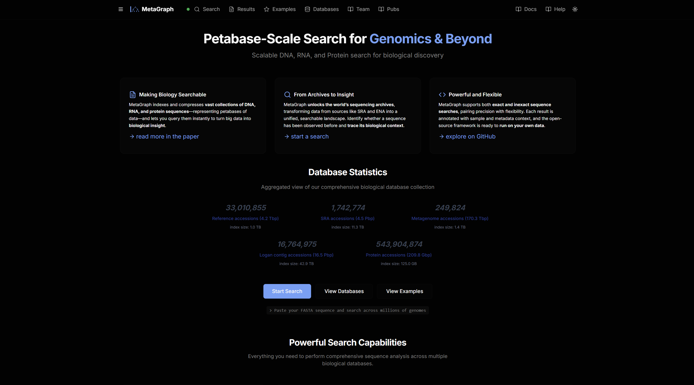
<i>The MetaGraph web tool's home page.</i>
</center>
<br>
</blockquote>
</details>

### 2. Enter a FASTA Sequence

Enter a FASTA-format nucleotide or amino acid sequence in the search box. The sample data used in this tutorial can be found [here](#sample-data).

Check `☐ Nucleotide` or `☐ Amino Acid` depending on the type of sequence you'd like to search.

Here, you can use the **Quick select accessions** option to choose which datasets to search for your sequence. Here, we'll select the Quick Selection option for **Microbial** accessions.

<blockquote>
⚠ <b>Note</b><br>
For Amino Acid sequences, you may have to go to the **Advanced search settings** section below to select the appropriate dataset (UniParc) before you can start your search.
</blockquote><br>

<blockquote>
<details>
<summary>&#128712; <b>Info: Quick Acession Selection</b> (<i>click to expand</i>)</summary>
<list>
<li><code>Reference Sequences</code> RefSeq
<li><code>Microbial</code> Bacterial and gut microbiome data, including Logan taxonomy bacteria
<li><code>Metazoa</code> Metazoa sequence datasets (Metagraph and Logan contigs)
<li><code>Plants</code> Plant sequence datasets (Metagraph and Logan contigs)
<li><code>Model organisms</code> Model organisms: mouse, rat, yeast, E. coli, Drosophila, C. elegans, Arabidopsis, zebrafish, chicken
<li><code>Human</code> Human genome, variation databases, and Logan taxonomy human sequences.
</list>
</details>
</blockquote><br>

If you like, you can enter an identifying name for the job under the `Job title` field. You can also provide an email in the `✉` field to be notified when your job is completed.

<details open>
<summary><b>📷 Searching using the MetaGraph web tool.</b> (<i>click to expand</i>)</summary>
<blockquote>
<br>
<center>
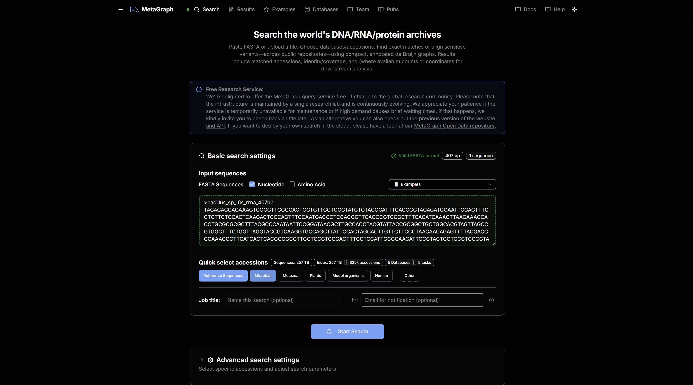
<i>The MetaGraph web tool's Search page.</i>
</center>
<br>
</blockquote>
</details><br>

Click `🔍 Start Search` to begin the search if you're happy with your query, or move down to the Advanced Settings section below.

### 3. Advanced Settings

Click **Advanced search settings** to expand the advanced settings module.

#### <u>Selecting Databases</u>

Click **Accession selector** to expand the manual Accession Selection menu. Here, you can manually select which databases you'd like to search for your sequence. Here, we're going to include the **SRA Superkingdom bacteria** option under **SRA by Taxonomy (Logan Contigs)**. Under the **View selected databases** module, you can see which specific databases will be searched.

<details open>
<summary><b>📷 Selecting Databases.</b> (<i>click to expand</i>)</summary>
<blockquote>
<br>
<center>
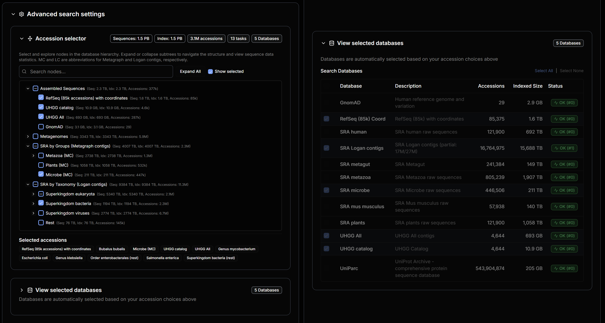
<i>Selecting Accession Databases to search using MetaGraph's Advanced Search Settings.</i>
</center>
<br>
</blockquote>
</details><br>

#### <u>Search Parameters</u>

Under the **Search parameters** module, you can modify the maximum number of search results to return by changing the **Max results** parameter (1-5000). 

The **Discovery threshold** parameter (0.0-1.0) indicates how exact of a match that a sequence should be to be included in the returned results. For exact k-mer matching (default algorithm), this is the fraction of k-mers in the input sequence that need to be matched to be included.

The **Align** toggle sets whether to use sequence alignment or exact k-mer matching (default). Sequence alignment increases the sensitivity of detection but is much more resource heavy. This option is not currently available.

The MetaGraph tool also supports LLM-based summarization of the returned results. This can be enabled or disabled using the **AI Summary** toggle. When this option is set to enabled, you can also enable **AI Organism Identification**, which classifies the likely organism your sequence belongs to, using confidence scores from taxonomic identification.

<details open>
<summary><b>📷 Advanced Search Parameters.</b> (<i>click to expand</i>)</summary>
<blockquote>
<br>
<center>
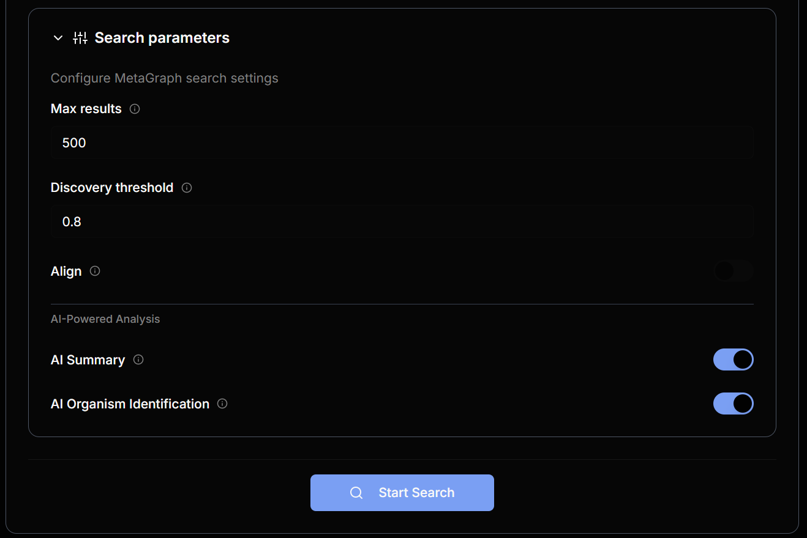
<i>Advanced Search Parameters to configure MetaGraph's search settings.</i>
</center>
<br>
</blockquote>
</details><br>

When you're satisfied with your advanced search parameters, click `🔍 Start Search` to begin your search.

### 3.5 Search Progress

When your search is ongoing, you can view the tast progress in the Processing screen. The number of hits found so far in each database is displayed next to the database. For example, in the figure below, we can see `38` hits have been found so far found in the `sra-microbe` database. For more details, you can expand the **Task Log** module.

<blockquote>
&#128712; <b>Tip</b><br>
If your task is taking a long time, you can also enter your email in the <code>✉</code> field at this point to be notified when your search is completed.
</blockquote><br>
<blockquote>
&#128712; <b>Tip</b><br>
If you want to stop the search, you can either click <code>⏸ Stop & View Results</code> to cancel remaining tasks and view incomplete results, or click <code>× Cancel Search</code> to cancel the search.
</blockquote><br>

<details open>
<summary><b>📷 Search Progress.</b> (<i>click to expand</i>)</summary>
<blockquote>
<br>
<center>
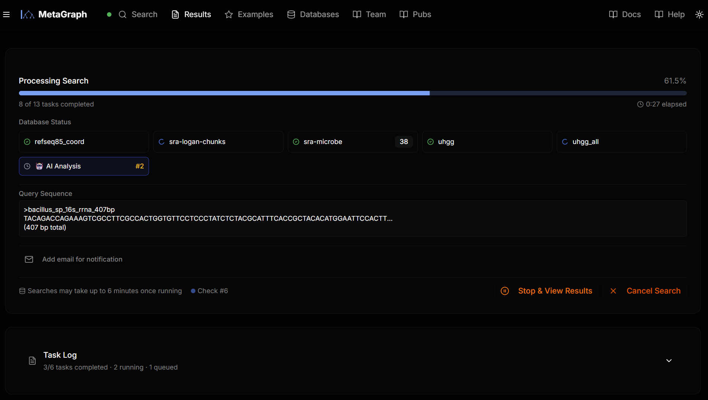
<i>MetaGraph Search Progress.</i>
</center>
<br>
</blockquote>
</details><br>

### 4. Search Results

#### <u>*Bacillus* sp. Nucleotide Sequence</u>

<i>The sample data used in this search is available [here](#sample-data).</i>

In these search results, we see a high amount of exact matches (Normalized Score of 1). The LLM-based summary and taxonomic analysis identifies the sequence as belonging to the *Bacillus cereus* group with medium confidence. In reality, this sample came from a *Bacillus mycoides* sample, so the estimate is not far off. 

Scrolling down through the results, you can view the different organisms that the matched sequence samples were derived from, as well as the database in which the sample was found. 

<blockquote>
&#128712; <b>Tip</b><br>
Click on any link in the table for more information regarding that entry. <code>Sample ID</code>s will redirect to the database the sample belongs to, for example, the SRA; <code>Organism</code>s will redirect to the NCBI Taxonomy Browser, and <code>BioSample</code>s and <code>Bioproject</code>s will redirect to their respective pages.<br>
</blockquote><br>

<blockquote>
&#128712; <b>Tip</b><br>
You can download your results as a <code>*.csv</code> file by clicking <code>⤓ Export CSV </code> in the top bar.
</blockquote><br>

<blockquote>
&#128712; <b>Tip</b><br>
If the search result has not yet expired, you can revisit a previously completed search's results page using the <code>SEARCH_ID</code> by entering it in a URL using the following format:<br>
<center><code>https://metagraph.ethz.ch/results?search=SEARCH_ID</code></center>
</blockquote><br>

<details open>
<summary><b>📷  MetaGraph Search Results: <i>Bacillus</i> sp. Nucleotide Sequence.</b> (<i>click to collapse</i>)</summary>
<blockquote>
<br>
<center>
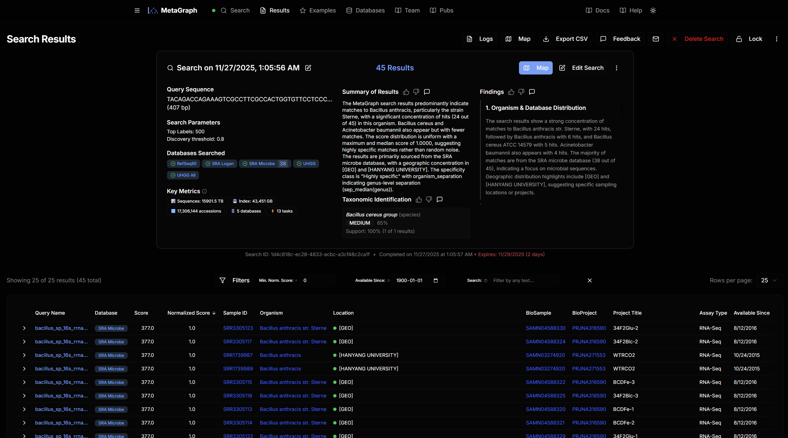
<i> MetaGraph Search Results: </i>Bacillus<i> sp. Nucleotide Sequence</i>
</center>
<br>
</blockquote>
</details><br>

<blockquote>
&#128712; <b>Tip</b><br>
For each entry return, you can expand the entry to find enrichment data  for the sample, which includes geographic data, sequencing methods, and more metadata, where available.

<br>

<details>
<summary><b>📷 Enrichment Data.</b> (<i>click to expand</i>)</summary>
<br>
<center>
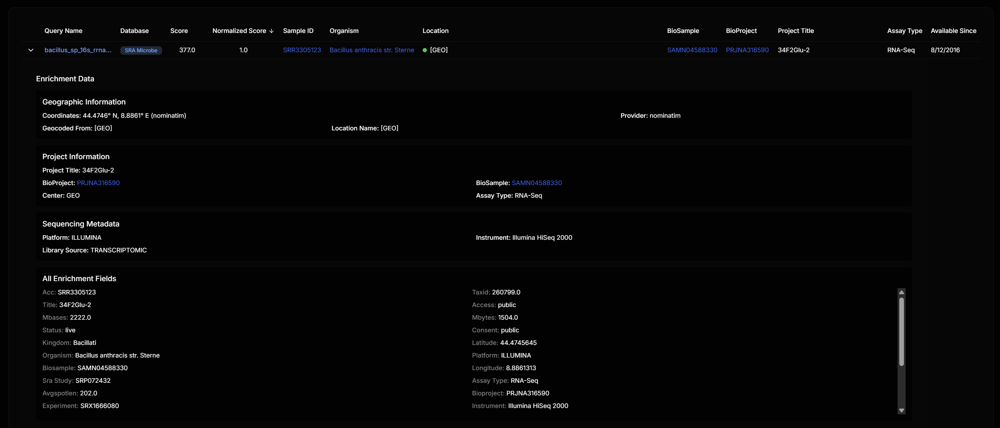
<i>Enrichment Data for Sample ID <code>SRR3305123</code>.</i>
</center>
</details><br>
</blockquote><br>

<blockquote>
&#128712; <b>Tip</b><br>
You can click on <code>🗺️ Map</code> to view a map of the geographic distribution of returned samples, or click <code>📝 Edit Search</code> to modify your search parameters back in the original Search Screen.

<br>

<details>
<summary><b>📷 Map View.</b> (<i>click to expand</i>)</summary>
<br>
<center>
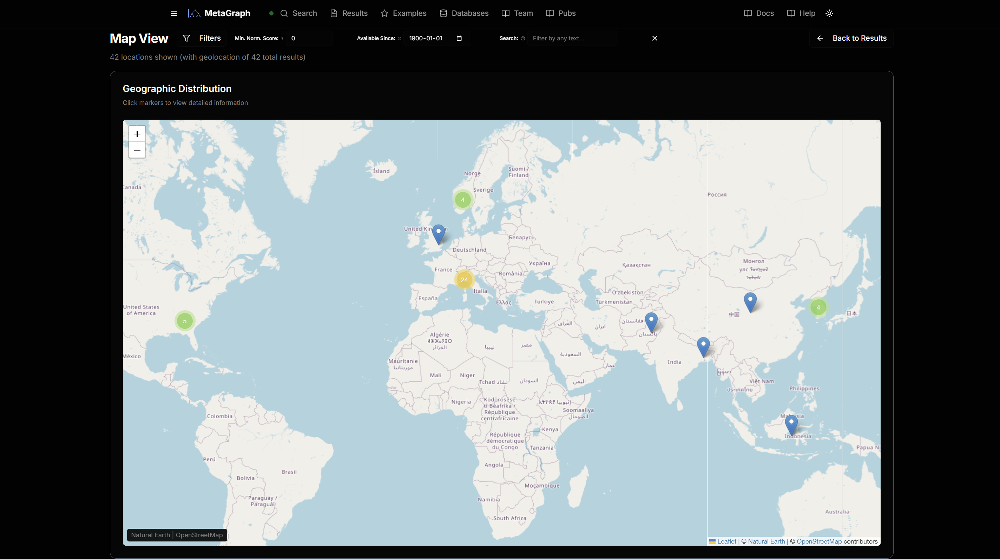
<i>MetaGraph Map View.</i>
</center>
</details><br>
</blockquote>

#### <u>GFP Protein Sequence</u>

<i>The sample data used in this search is available [here](#sample-data).</i>

Here are the results that are returned when we run a search for our sample protein sequence. We see that this is an example of a search result where the **AI Organism Identification** function returns **low** confidence in its taxonomic identification. 

<details open>
<summary><b>📷 MetaGraph Search Results: GFP Amino Acid Sequence.</b> (<i>click to collapse</i>)</summary>
<blockquote>
<br>
<center>
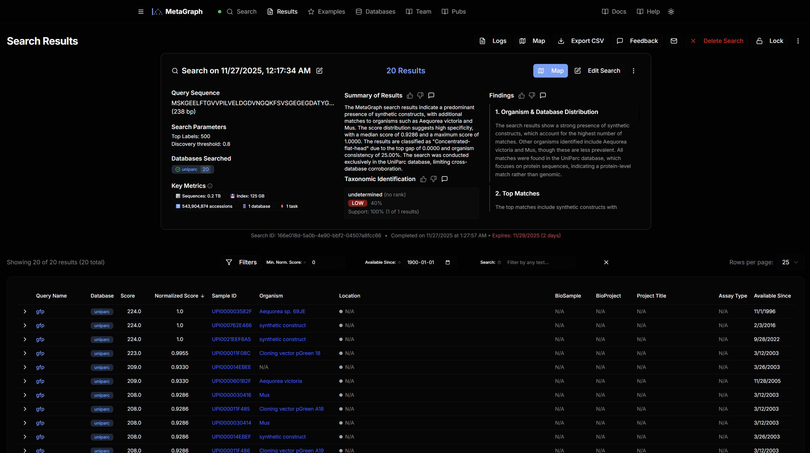
<i> MetaGraph Search Results: GFP Amino Acid Sequence.</i>
</center>
<br>
</blockquote>
</details><br>

Notice that, while *Aequoria victoria* is a organism that repeatedly shows up in the results, there are many other "organisms" in the results, including many "constructs". This reflects how MetaGraph matches searched sequences against *any sequence deposited in a publicly-available database*, making it useful for *determining what kinds of samples that a given sequence previously and/or frequently appears in*. On the other hand, a tool like NCBI's BLAST Search may be more useful for *identifying* the origins of a sequence, since its default databases focus on annotated GenBank and RefSeq reference sequences. Compare the two MetaGraph results to a BLAST search for the same sequences, and the difference in utility of these two tools becomes more clear. Each has its own use for virus discovery!

<details>
<summary><b>📷 BLAST Search Results: <i>Bacillus</i> sp. Nucleotide Sequence</b> (<i>click to expand</i>)</summary>
<blockquote>
<br>
<center>
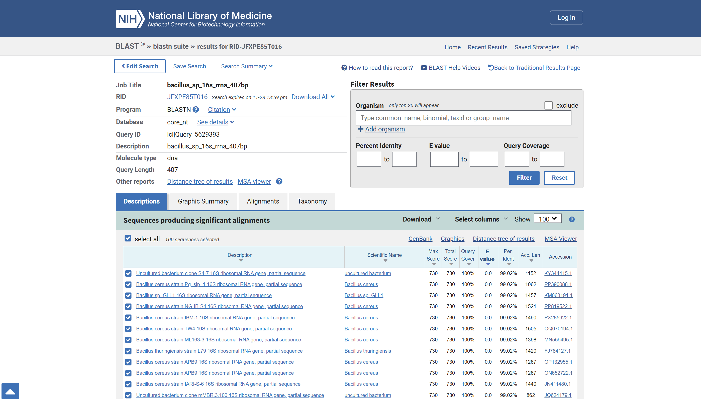
<i>BLAST Search Results:</i> Bacillus <i>sp. Nucleotide Sequence.</i>
</center>
<br>
</blockquote>
</details><br>

<details>
<summary><b>📷 BLAST Search Results: GFP Amino Acid Sequence.</b> (<i>click to expand</i>)</summary>
<blockquote>
<br>
<center>
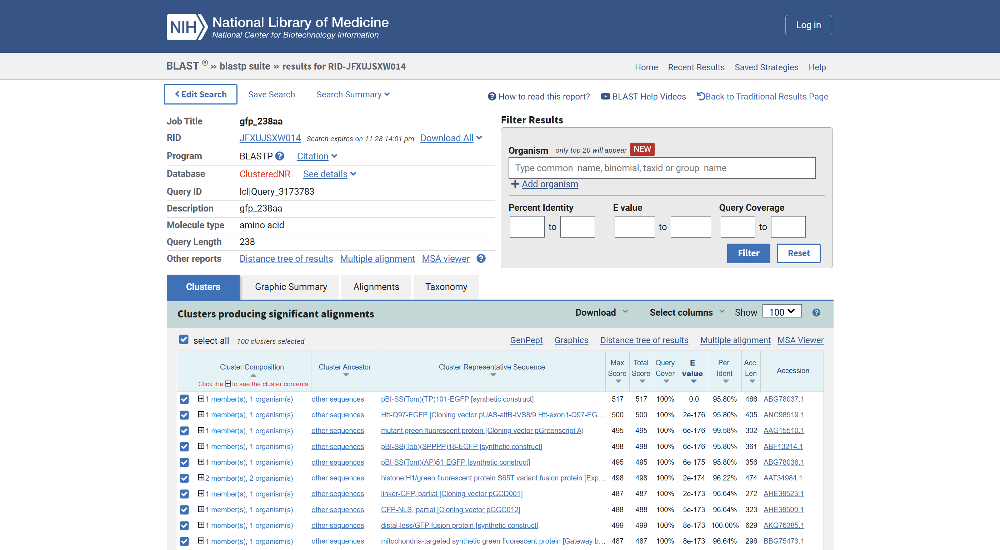
<i>BLAST Search Results: GFP Amino Acid Sequence.</i>
</center>
<br>
</blockquote>
</details><br>

### Conclusion

That's it! You've used MetaGraph to identify sequence archive samples containing a nucleotide and amino acid sequence of interest!

Here, we demonstrated how to use MetaGraph to search a selection of publicly-available sequence archives in a highly efficient manner in order to find deposited experimental samples matching your sequence of interest. Hopefully, this tutorial has been useful in communicating both how to use this tool, as well as how this tool can be used to better understand the environmental context of genome sequences in samples. And of course, any time you use an LLM-based tool, ensure to sanity-check and fact-check the conclusions provided, based on the information you have!

In the future, this tool plans to support even more functionalities, including indexing more databases (and enabling their access through the web interface — as of the time of writing, several databases can only be downloaded and searched locally), as well as additional features, including sequence alignment prior to matching to enable higher sensitivity and tolerance when identifying potential matches.


### See Also:

- [ETHzürich Article on MetaGraph] Eberhard. [A DNA Search Engine](https://ethz.ch/en/news-and-events/eth-news/news/2025/10/a-dna-search-engine.html). ETHzürich 2025.
- [Metagraph Paper] Karasikov et al. [Efficient and accurate search in petabase-scale sequence repositories](https://doi.org/10.1038/s41586-025-09603-w). *Nature* 2025.
- [Logan Project Preprint] Chikhi et al. [Logan: Planetary-Scale Genome Assembly Surveys Life’s Diversity](https://doi.org/10.1101/2024.07.30.605881). *bioRxiv* 2025.
- [MetaGraph Documentation](https://metagraph.ethz.ch/static/docs/index.html)
  - [Help & Quick Start](https://metagraph.ethz.ch/help)
  - [Example Searches](https://metagraph.ethz.ch/examples)
  - [Web API Documentation](https://metagraph.ethz.ch/help#api-cli)
  - [Join the MetaGraph Discord Server](https://discord.gg/ARyM7ZvSNX)