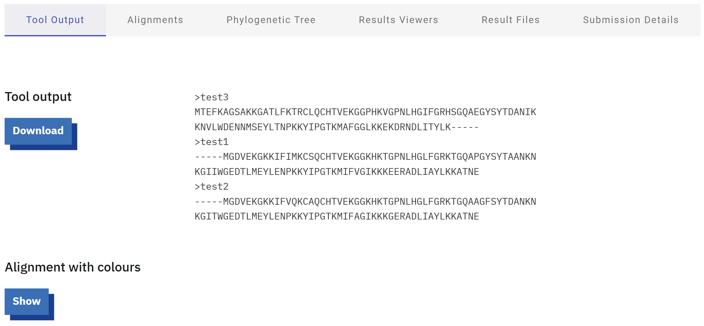
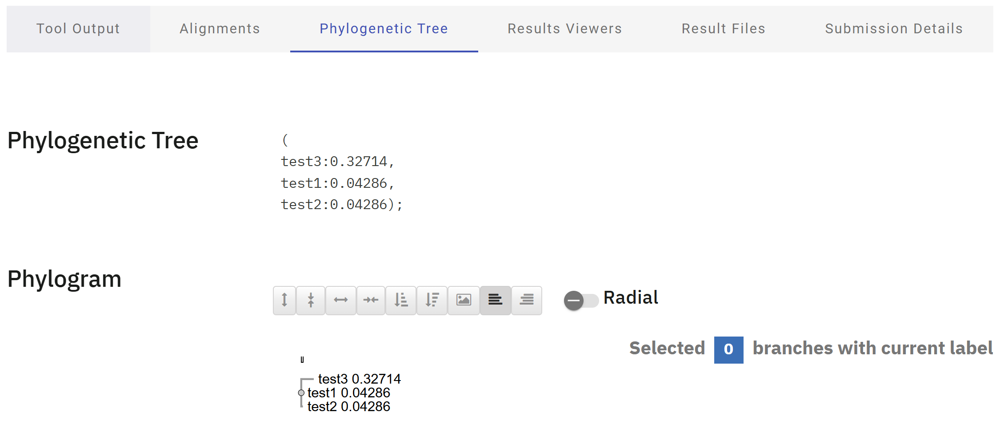
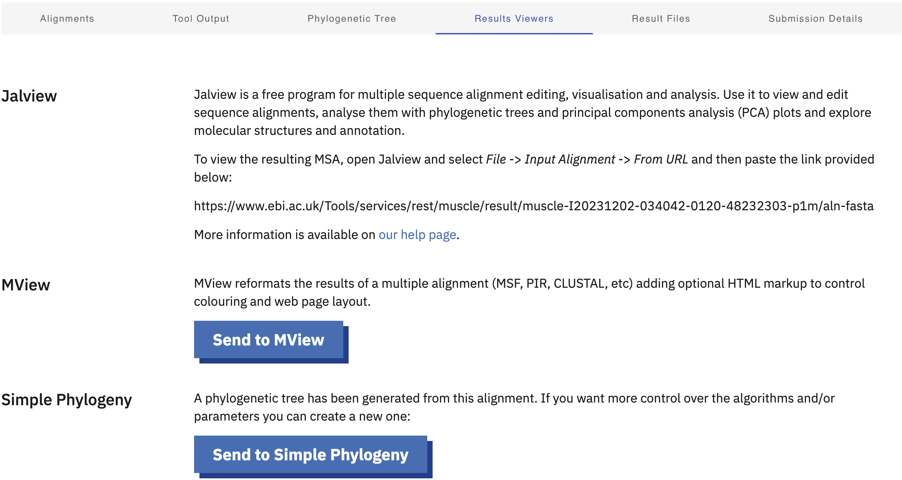
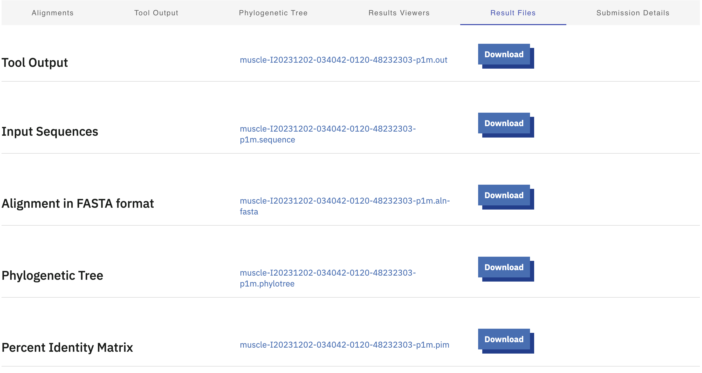
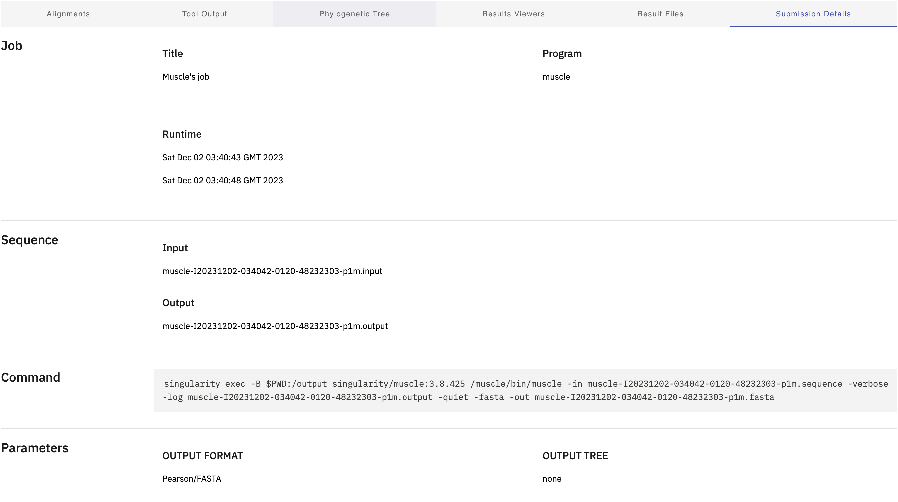
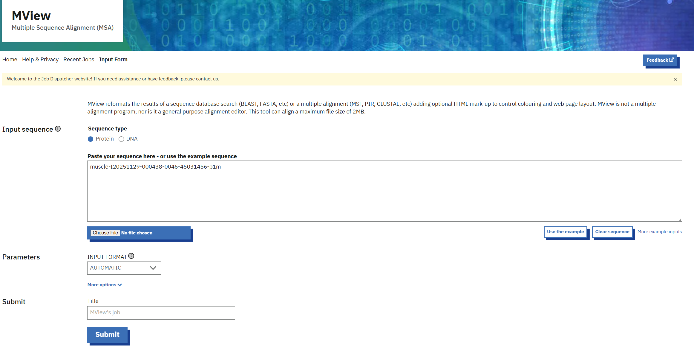
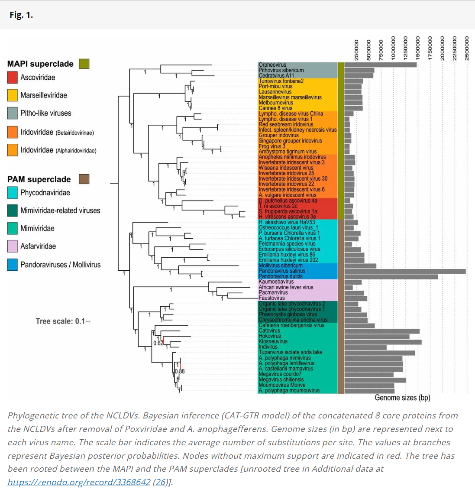

# MUSCLE
written by: [Yunyi Cheng](https://github.com/yunyicheng)
edited by: [Clare Gillis](https://github.com/claregillis)
last reviewed and edited by: [Dingjiu Tang](https://github.com/Dangelo2002)

Multiple Sequence Comparison Log-Expectation (MUSCLE) is a computer program for creating multiple sequence alignments (MSA) of proteins and polynucleotides. Introduced in 2004, MUSCLE brought a leap in speed and accuracy to MSA. It incorporates fast distance estimation using *k* mer counting, progressive alignment using a profile function we call the log‐expectation score, and refinement using tree‐dependent restricted partitioning. 

These algorithms and iterative optimization have enabled MUSCLE to rapidly rise as one of the most trusted bioinformatics tools in the post-genomic era of data explosion. It could be used in phylogenetic tree estimation, structure prediction and critical residue identification, which are useful for virus identification and discovery. However, please note that MUSCLE itself cannot directly construct phylogenetic trees or predict protein structure and function from sequences, nor can it generate highly readable visualizations. It can only provide evidence of similarity in the MSA output. Other tools are required for downstream analysis. For online versions of MUSCLE, some downstream analysis tools have been integrated, allowing for direct visualization of results.

**Tutorial Objective**: MUSCLE can be run locally via the command line or through a web server. Locally running MUSCLE offers more advanced parameter tuning and automated batch processing. On the other hand, running MUSCLE online is simpler and suitable for small datasets where advanced parameter tuning is not required. In this tutorial, we will use the MUSCLE server provided by the European Molecular Biology Laboratory-European Bioinformatics Institute (EMBL-EBI) to perform multiple sequence alignment of hemoglobin subunits from humans, house mice, and goats.

## Input / Prerequisites

- [Tool Weblink](https://www.ebi.ac.uk/jdispatcher/msa/muscle)
- [Link to example data formats](https://www.ebi.ac.uk/jdispatcher/docs/formats/)
- Web browser
- Three or more sequences of interest in GCG, FASTA, EMBL (Nucleotide only), GenBank, PIR, NBRF, PHYLIP, or UniProtKB/Seiss-Prot (Protein only) format directly, or upload a file.
- This website tool supports alignment of up to 500 sequences or files up to 1 MB in size.

## Output

The result for multiple sequence alignment is displayed in a browser tab, with sections being `Alignment`, `Tool Output`, `Phylogenetic Tree`, and `Result Viewers`. There are seven options listed in a dropdown list, from which users may select one to proceed with the task:

1. Pearson/FASTA: Plain text format for storing sequences; starts with a header line beginning with ">" followed by the sequence.

2. ClustalW: Alignment output from the Clustal family of tools, organized in blocks.  

3. ClustalW (strict): Similar to standard ClustalW, but with stricter output conventions.  

4. HTML: Sequence alignments rendered as HTML, typically with color-coded residues for clarity.  

5. GCG MSF: A format developed for the GCG suite of bioinformatics tools.  

6. Phylip interleaved: A compact format used by the Phylip suite of programs, displaying sequences interleaved across lines.  

7. Phylip sequential: Similar to Phylip interleaved, but sequences are presented consecutively in blocks.  

For the sake of demonstration, we will choose Pearson/fasta as the output format.

### 1. Navigate to [MUSCLE Web Tool](https://www.ebi.ac.uk/jdispatcher/msa/muscle)

### 2. Under the section 'Input Sequence', click on the button `Use the example`

### 3. Under section `Parameters`, select `Pearson/FASTA` to be the output format

### 4. Under the section `Submit`, name the job and hit `Submit`

### 5. After clicking `Submit`, it will display a message indicating that your job is being submitted or that your job is in the queue. The process will take some time. Once complete, the page will redirect automatically to the results page. This interface has the following modules:

- Alignment results visualization with amino acids in different colours and buttons for zooming in and out

- The output of the tool is shown in this section, users can `Download` the tool output or `Show` alignment with colours

- The phylogenetic tree shows the evolutionary relationship between input sequences with a sliding tile to zoom in and out

- Links to related result viewers to further investigate the results. Click on `Send to MView` will take you to the MView interface, which is useful for visualizing comparison results (see below).

- All result files and links to download them. Due to space limitations, only a portion of the files are shown in the image.

- Submission details about this job. Due to space limitations, only a portion of the details are shown in the image.

### For more information on the website's MUSCLE application, visualization tools and how to use them, please refer to this paper: [The EMBL-EBI Job Dispatcher sequence analysis tools framework in 2024](https://doi.org/10.1093/nar/gkae241)

### Here you can find a primary research paper that uses MUSCLE and compares it with other mainstream MSA methods:
[Multiple Alignment of Promoter Sequences from the Arabidopsis thaliana L. Genome](https://doi.org/10.3390/genes12020135)

## Interpreting the Results

As mentioned in the "Output" section above, MUSCLE's output files are typically plain text. There are several ways to interpret output files, but there is also some information that the output cannot reveal.

### Regarding visualization of MSA output files via MView:

- After clicking `Send to MView`, you can input the MUSCLE output files in MView. If you do not want to use the default settings, click `More options` and adjust the parameters as needed.

- After submitting the MView job and waiting for it to complete, you can view a visualization of the MUSCLE alignment results in MView under `Tool Output`. You can click `Download` to obtain the output file. You can also view other tabs (`Result Files` and `Submission Details`) for more information. The visualizations of the alignment results for the three sequences used as examples in the tutorial are shown below:

- Interpretation of this MView output: 
  - Reference sequence: test3 was selected as the reference sequence, and all percentage identities (pIDs) were calculated based on this sequence.
  - pID (Percent Identity): The percentage of identical amino acid residues in the sequence compared to the reference sequence.
  - cov (Coverage): The percentage of the sequence that was aligned to a reference relative to its total length.
  - Colored by (Identity and Conservation): The color scheme indicates that the residues are colored based on their identity and conservation. Background fill color is related to the physicochemical properties of residues, and the same fill color directly reflects conservation. In consensus sequences, dark background fill indicates high conservation, while no background fill indicates high variability.
  - Consensus Rows (e.g., consensus/100%): Consensus sequence rows generated based on a set percentage threshold to summarize the conservatism of the sequence. Lowercase letters usually indicate unaligned residues or residues with low alignment quality and low confidence.
  
### Regarding confidence analysis: 

MUSCLE's output files do not provide information about residue confidence. Output files such as clusterW only provide a consensus line, which indicates the degree of conservation of residues. To obtain information about the confidence level of multiple sequence alignment results, other downstream analysis tools, such as Gblocks or Guidance, are required.

### Regarding false positives:

Similarly, MUSCLE cannot provide information on true positives, false positives, or the significance threshold. To verify the false-positive rate of the MUSCLE algorithm itself, we need to provide a verified correct alignment result and compare MUSCLE's output with it. A false positive is defined here as a residue pair that MUSCLE incorrectly matches, but which does not match in the reference alignment. MUSCLE's built-in algorithm determines the threshold for judging a match, but it will not evaluate the reliability of the alignment result. In addition, we generally do not input a verified correct reference alignment to measure the algorithm's accuracy. Therefore, MUSCLE is not suitable for judging true positives and false positives.

### Regarding how to use the MUSCLE output to create "charts" for your final project:

- Several types of charts help demonstrate the evolution, classification, and functional characteristics of viruses. The most important chart that MUSCLE output can create is the phylogenetic tree. It can be generated using downstream analysis tools such as MEGA, RAxML, and IQ-TREE. The good news is that the online MUSCLE tool used in the previous tutorial has integrated interactive phylogenetic tree and dendrogram visualization capabilities driven by phylotree.js. Therefore, it is also possible to generate phylogenetic trees directly on the online website.

- To further visualize MUSCLE's output files, MVIEW and JalView can generate easily interpretable alignment images for use in reports and papers.

- Gblocks can remove highly variable or low-confidence regions from alignment results, retaining only conserved, highly reliable "information blocks." The Conservation Profile Plot statistically analyzes the conservation of residues in each column of the MUSCLE alignment results. It can be used to predict and visualize highly conserved functional regions (such as active sites) and highly variable regions (such as immune escape sites) in viral proteins. WebLogo, Plotcon, and JalView can generate this chart.

- WebLogo can also generate Sequence Logos. It creates symbolic maps for specific conserved regions in the MUSCLE alignment results, with letter size proportional to the frequency of the residue at that position. This can predict which residues are essential in viral families and their tendency to mutate.

### To ensure the reproducibility of the analysis results, the following information and parameters should be included in the "Legend":

- Sequence Source and Number: The total number of sequences involved in the alignment (e.g., 25 sequences).

- Sequence Type: Nucleic acid (DNA/RNA) or protein.

- Key Sequence Identifiers: If possible, provide the NCBI Accession Numbers or UniProt IDs for newly discovered or key comparison sequences.

- Alignment Algorithm Parameters: If using a local MUSCLE, specify the software and version number, key scoring parameters, iterations, and optimization. If using the same online MUSCLE tool as in the tutorial, provide the necessary settings for using that tool.

- Used Tools: When generating charts using the tools described above, such as phylogenetic trees or conservation diagrams, the name and version of the tool used must be specified. The key procedures and parameters for using these methods should also be included.

### A phylogenetic tree example with full documentation and explanation:

Here is an example of a phylogenetic tree with legends and captions, from the paper [Diversification of giant and large eukaryotic dsDNA viruses predated the origin of modern eukaryotes](https://doi.org/10.1073/pnas.1912006116)

## Conclusion

That's it! You've used the `MUSCLE` to produce multiple sequence alignment for hemoglobin subunit sequences from humans, house mice and goats!

In this example, we can see that loci 102-111 align very well between the three 
proteins, so they may posess an important function. We can gather stronger evidence
for this hypothesis by aligning other, similar sequences along these and checking
if loci 102-111 are similar for these new sequences.

When it comes to viruses, users can follow this example (substituting example 
data with real virus proteins) to investigate conserved regions, variants, and 
evolutionary relationships when it comes to viral proteins.

### See Also:

- [MUSCLE: multiple sequence alignment with high accuracy and high throughput](https://academic.oup.com/nar/article/32/5/1792/2380623)
- [Download source code](https://github.com/rcedgar/muscle/releases/tag/5.1.0)
- [Documentation](https://drive5.com/muscle5/manual/)
- [Home page](https://drive5.com/muscle5/)
- For other multiple sequence alignment tools see: [EMBL Multiple Sequence Alignment](https://www.ebi.ac.uk/jdispatcher/msa)
- For a review article on constructing phylogenetic tree: [Systematic Review of Phylogenetic Analysis Techniques for RNA Viruses Using Bioinformatics](https://doi.org/10.3390/ijms26052180)
