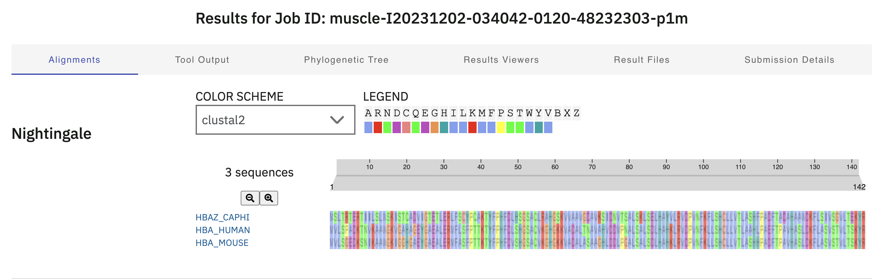
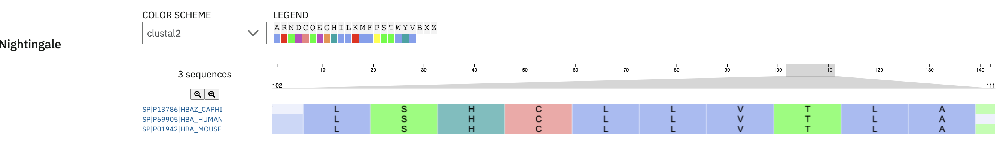

# MUSCLE
written by: [Yunyi Cheng](https://github.com/yunyicheng)
edited by: [Clare Gillis](https://github.com/claregillis), Neyo T

MUSCLE is a computer program for creating multiple sequence alignments of proteins and nucleotides. It incorporates fast distance estimation using *k* mer counting, progressive alignment using a profile function we call the log‐expectation score, and refinement using tree‐dependent restricted partitioning. It could be used in phylogenetic tree estimation, structure prediction and critical residue identification, which are useful for virus identification and discovery.

**Tutorial Objective**: We will use `MUSCLE` to produce multiple sequence alignment for hemoglobin subunit sequences from humans, house mice and goats.

## Input / Prerequisites

- [Tool Weblink](https://www.ebi.ac.uk/jdispatcher/msa/muscle)
- [Link to example data formats](https://www.ebi.ac.uk/jdispatcher/docs/formats/)
- Web browser
- Three or more sequences of interest
- Formats: GCG, FASTA, EMBL (Nucleotide only), GenBank, PIR, NBRF, PHYLIP, UniProtKB/Seiss-Prot (Protein only) format directly, or upload a file.

## Output

The result for multiple sequence alignment is displayed in a browser tab, with sections being `Alignment`, `Tool Output`, `Phylogenetic Tree`, and `Result Viewers`. There are seven options listed in a dropdown list, from which users may select one to proceed with the task:

1. Pearson/FASTA: Plain text format for storing sequences; starts with a header line beginning with ">" followed by the sequence.

2. ClustalW: Alignment output from the Clustal family of tools, organized in blocks.  

3. ClustalW (strict): Similar to standard ClustalW, but with stricter output conventions.  

4. HTML: Sequence alignments rendered as HTML, typically with color-coded residues for clarity.  

5. GCG MSF: A format developed for the GCG suite of bioinformatics tools.  

6. Phylip interleaved: A compact format used by the Phylip suite of programs, displaying sequences interleaved across lines.  

7. Phylip sequential: Similar to Phylip interleaved, but sequences are presented consecutively in blocks.

For the sake of demonstration, we will choose Pearson/fasta as the output format.

### 1. Navigate to [MUSCLE Web Tool](https://www.ebi.ac.uk/jdispatcher/msa/muscle)

### 2. Under the section 'Input Sequence', click on the button `Use the example`

### 3. Under section `Parameters`, select `Pearson/FASTA` to be the output format

### 4. Under the section `Submit`, name the job and hit `Submit`

### 5. View the result

- Alignment results visualization with amino acids in different colours and buttons for zooming in and out

- The output of the tool is shown in this section, users can `Download` the tool output or `Show` alignment with colours

- The phylogenetic tree shows the evolutionary relationship between input sequences with a sliding tile to zoom in and out

- Links to related result viewers to further investigate the results

- All result files and links to download them

- Submission details about this job

## Interpreting Results

- clustal2 coloring scheme:
**100% Conserved:** The column is a solid color. This indicates the residue is identical in all strains. These are the most biologically conserved regions.
**Highly Conserved:** The column is a bit lighter in color, or the non-identical strain has a white background. These are mostly conserved but contain exceptions; if it is a protein, look at the chemical properties to see if they share any similarity (e.g., Hydrophobic).
**Variable (Low Confidence):** The column has very faint colors or gaps. These are highly variable regions and should be treated with caution in analysis.

- Look for various coloring schemes based on chemical properties to see if residues that aren't exactly identical share similar chemical properties, as they may still be able to function similarly to the wildtype.

**NOTE:** In the output files, you can see the Percent Identity Matrix which indicates how similar (in percentage) each strand is to the other.

## Making Figures 

- [You can take a screenshot of the aligned residues in the "Alignments" section and modify the coloring in the drop-down option where it says "clustal2". Use "+" if the residues seem too far apart and "-" if they seem too close. However, this visual alignment treats the first sequence from your FASTA as consensus sequence.
](https://raw.githubusercontent.com/ababaian/VIRUSxDISCVRY/refs/heads/main/tools/img/muscle/example_alignment.png)

- You can download the FASTA Alignment and also view it under the various tools shown under "Result Viewers".

- [Downloading FASTA Alignment](https://raw.githubusercontent.com/ney0/VIRUSxDISCVRY/refs/heads/main/tools/img/muscle/alignment_in_mview_1.png)

- [Opening MVIEW](https://raw.githubusercontent.com/ney0/VIRUSxDISCVRY/refs/heads/main/tools/img/muscle/mview2.png)

- [Select the type of polymer you are trying to view and insert the downloaded FASTA Alignment file, and press "Submit"](https://raw.githubusercontent.com/ney0/VIRUSxDISCVRY/refs/heads/main/tools/img/muscle/mview3.png)

- [Here you can get a view of the alignment MUSCLE conducted in chunks](https://raw.githubusercontent.com/ney0/VIRUSxDISCVRY/refs/heads/main/tools/img/muscle/mview4.png)

### INTERPRETATION OF MVIEW

**cov:** (Coverage) - The quantity, it tells you how much of the other sequences residues are in the aligned sequence window to the FIRST row sequence, so 100% alignment since it aligns to iself and second sequence sequence only appears in 81.9% of the sequence 1 alignment window. 

**pid:** (Percent Identity) - The quality, it tells you how **good** the performed alignment is, here you can see that highest pid  goes upto 32.6% so sequence 1 might not be a good consensus sequence. 

**Colours:** - The nucleotides that have perfect alignment to sequence 1 are solid coloured and ones that don't have a white background. 

**insertions/deletions** - Insertions and deletions are shown as "-"

- 

### Conclusion

That's it! You've used the `MUSCLE` to produce multiple sequence alignment for hemoglobin subunit sequences from humans, house mice and goats!

In this example, we can see that loci 102-111 align very well between the three 
proteins, so they may possess an important function. We can gather stronger evidence
for this hypothesis by aligning other, similar sequences along these and checking
if loci 102-111 are similar for these new sequences.

When it comes to viruses, users can follow this example (substituting example 
data with real virus proteins) to investigate conserved regions, variants, and 
evolutionary relationships when it comes to viral proteins.

### See Also:

- [MUSCLE: multiple sequence alignment with high accuracy and high throughput](https://academic.oup.com/nar/article/32/5/1792/2380623)
- [Download source code](https://github.com/rcedgar/muscle/releases/tag/5.1.0)
- [Documentation](https://drive5.com/muscle5/manual/)
- [Home page](https://drive5.com/muscle5/)
- For other multiple sequence alignment tools see: [EMBL Multiple Sequence Alignment](https://www.ebi.ac.uk/jdispatcher/msa)
