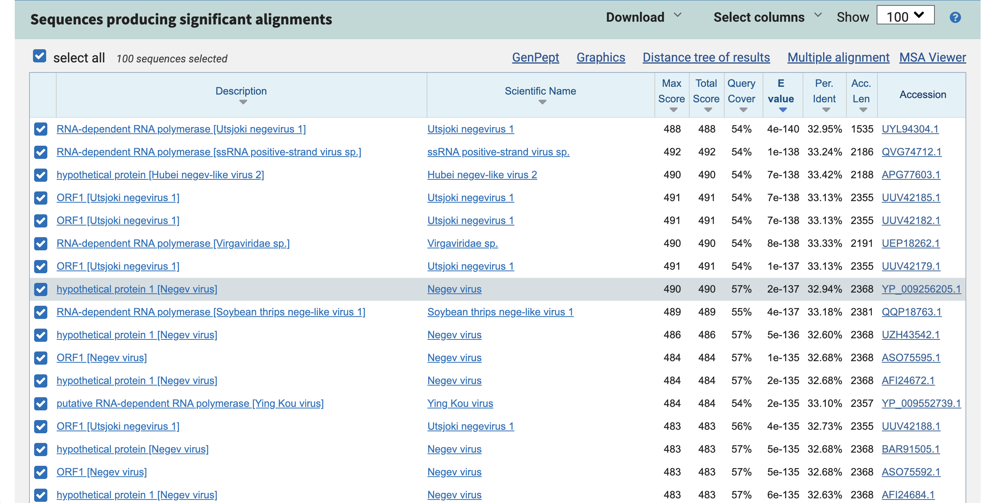
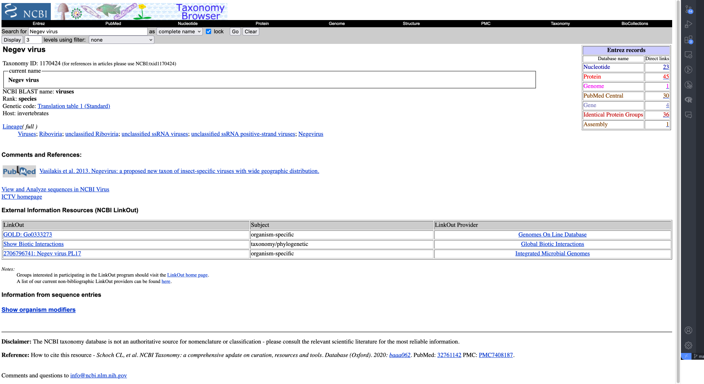
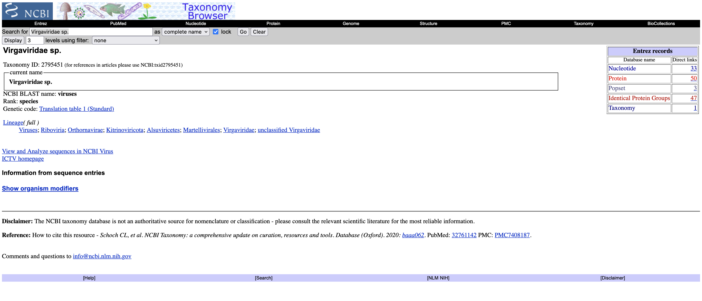
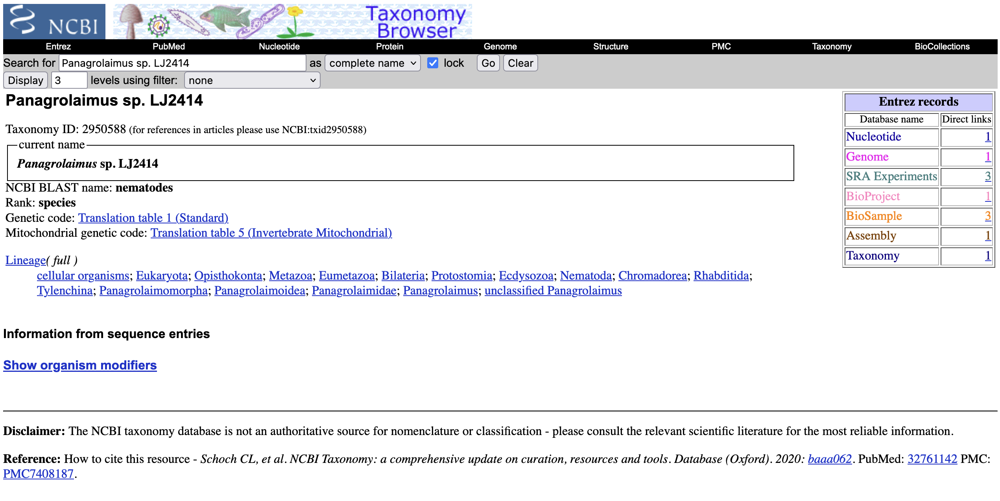
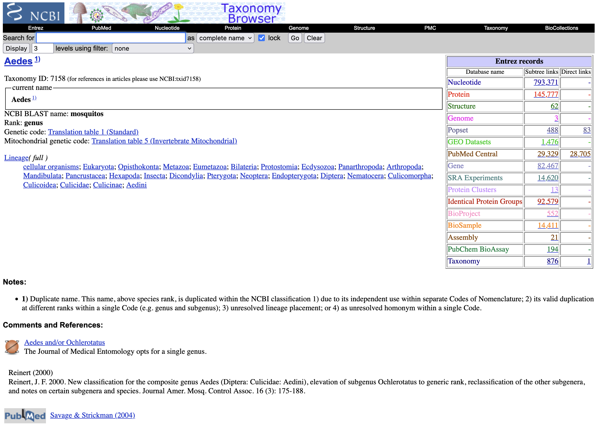
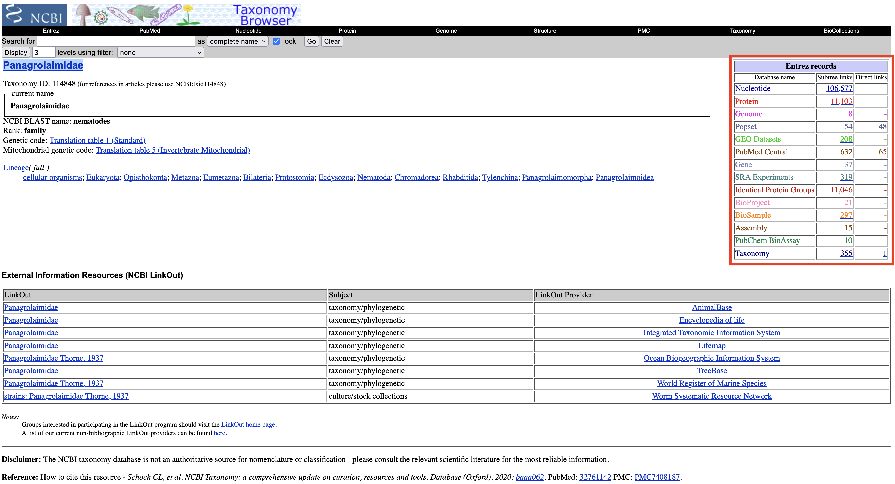

# NCBI Taxonomy
written by: [Declan Lim](https://github.com/declanlim)

[10-15 minutes] The NCBI taxonomy is a comprehensive database of organism names and taxonomic relationships that covers all organisms represented in the International Nucleotide Sequence Database Collaboration (INSDC). The database uses an approximate phylogenetic hierarchy to represent taxonomic relationships between organisms in the database, from superkingdom down to species. By providing a taxonomic rank for every sample within its ecosystem, the NCBI taxonomy provides a streamlined way to explore all data annotated at the same level, allowing you to explore questions relating to the diversity and evolution of your virus. 

**Tutorial Objective**: Learn how to use the NCBI Taxonomy to explore taxonomic relationships for your virus and host.

## Input / Prerequisites
- [NCBI Taxonomy Weblink](https://www.ncbi.nlm.nih.gov/taxonomy/)
- Potential classifications of your virus or host (e.g. Genus, Family, Order, etc.)
    - BLAST results of viral contigs
    - SRA metadata from viral runs

### 1. What classification level are you interested in exploring?
#### Virus
Classifications for the virus can often be found from preliminary BLAST results of the viral contig. The BLAST results should identify the closest relatives of your virus and provide some level of classification that can be explored. Further exploration of the literature surrounding your diverged virus can also provide some insight into taxonomic levels that may be of interest. 

For example, if I am looking at the virus associated with run SRR22163886, running BLAST on the viral contig identified in the run provides the following results:

Exploring the "Scientific Name" column, we can see that there is a lot of diversity in the related viruses. Clicking on each link in the "Scientific Name" column will take you to the NCBI Taxonomy page for that virus. For the highlighted link of Negev virus, we are taken to the following page:

For preliminary analyses, the Lineage section of the page gives a good indication of potential taxonomic levels of interest. In the above example, exploring the NCBI Taxonomy page for the different BLAST hits gives viruses that are mostly under the genus Negevirus. This would suggest that the new virus is likely a diverged Negevirus and indicates the taxonomic level of interest. 

However, there is a single hit in the BLAST results (*Virgaviridae sp.*) that is from a completely different kingdom! This can be easily seen as the lineage for Virgaviridae sp. is largely different to the Negevirus lineage. The closet common taxonomic level between the two viruses is the clade Riboviria, a classification level that includes all RNA viruses.

This basic exploration suggests further exploration at the genus level (Negevirus) but also raises questions regarding the *Virgaviridae sp.* hit.

#### Host
Host classifications are often found in the SRA metadata surrounding the run(s). If necessary, further exploration can be carried out to look at the publication associated with the run(s). From the host species (or multiple species), the lineage section can again be used to explore common taxonomic levels, giving an indication of the taxonomic level of interest. 

Using SRR22163886 as an example, we are given that the experimental host is *Panagrolaimus sp. LJ2414*, an unclassified species of nematode. 

Since some information regarding the viral classification is known (as above), the information regarding the host range of the virus (or viral family) can be compared with the experimental host. The closest common taxonomic level between hosts can give a good indication of the taxonomic level of interest. 

The genus of Negeviruses are known to have a limited host range of insects (including sand flies and mosquitoes). Exploring the genus Aedes (mosquitos) and nematodes, we get that the closest common taxonomic level is the Clade Ecdysozoa, raising multiple questions regarding the host range of the virus.

It is also worth noting that the taxonomy exploration here is consistent with the expected results from BLAST. Since the new virus has less than 35% identity to viruses in the geneus Negevirus, it is feasible that the new virus has a different host range. If the new virus had a very high identity to viruses in the genus Negevirus, it would be unexpected to see a nematode in the experimental host and would suggest further exploration regarding the host range of the virus. 

### 2. Further exploration of samples at the taxonomic level of interest
From a given taxonomic level of interest, you may start to ask questions about why the virus is being seen (or not) in certain hosts. To explore these questions, we can again look to the NCBI Taxonomy in order to search for all samples at the taxonomic level of interest. On the right hand side of each NCBI Taxonomy page, we can find the "Entrez records" table. This table provides links to all areas of the NCBI ecosystem that are annotated with the same query term. For example, on the NCBI Taxonomy page for *Panagrolaimidae* (the family of nematodes that *Panagrolaimus sp. LJ2414* belongs to, chosen since the publication worked with multiple species of nematode in *Panagrolaimidae*), we can see that there are over 300 SRA experiments that are annotated for *Panagrolaimidae* and its children.

Clicking on the SRA Experiments link, we are brought to a page of all the SRA experiments on *Panagrolaimidae*. Using the links of the different experiments, we can explore any experimental differences to see if there are any commonalities between the experiments that have the virus and those that don't. 

### 3. Explore the rest of the NCBI ecosystem...

The various links in the "Entrez records" table can be very useful when diving deeper into your virus/host. Not all of them may be useful in every analysis but a few are highlighted below:

- The BioProject and BioSample links are very useful when exploring the metadata surrounding the samples and have may have information regarding the experimental design. BioSample links often have a one to one relationship with SRA runs and may have some important metadata that may uncover new insights.
- The Genome links will contain links to fully sequenced genomes of the organism or its sub-species. This can be very useful when comparing your viruses to other related viruses and can be used in conjunction with a tool such as Alphafold to visualize the differences between the viral genomes. 
- PubMed Central links will link to all publications that have your query term identified. The articles in the results can also be sorted based on publication date and can be very useful when exploring the literature surrounding your virus/host. 
- Structure links will link to experimentally determined structures of proteins relating to the query term. These are less common in the NCBI ecosystem but can help guide further exploration of your virus/host.

***Depending on the popularity of your virus/host, there may be a lot of related data in the NCBI ecosystem.***

### Conclusion

That's it! You've used the NCBI Taxonomy to explore taxonomic relationships between your host and virus!

Here we have gone through a simple overview of how the NCBI Taxonomy can be used to explore the taxonomic relationships between your virus and host. From a certain classification level, we can easily explore the whole NCBI ecosystem to query all samples that match that level. 

While the NCBI taxonomy is a powerful tool, it is important to note that the taxonomy is not perfect. As well as being updated constantly as new organisms are discovered, the taxonomy exploration relies of the correct labelling of samples. There is also a natural sampling bias in the NCBI ecosystem, with species such as *Homo sapiens* and *Mus musculus* being represented much more than uncommon organisms.  

It is also important to note that samples from metagenomic analyses are not labelled with the individual species that may be present. Although there is a "metagenomes" section of the NCBI Taxonomy, it may be more useful to use a tool like [NCBI STAT](https://www.ncbi.nlm.nih.gov/sra/docs/sra-taxonomy-analysis-tool/) in order to explore the individual species present in a metagenomic sample.

### See Also:

- [NCBI Taxonomy Help Manual](https://www.ncbi.nlm.nih.gov/books/NBK53758/)

