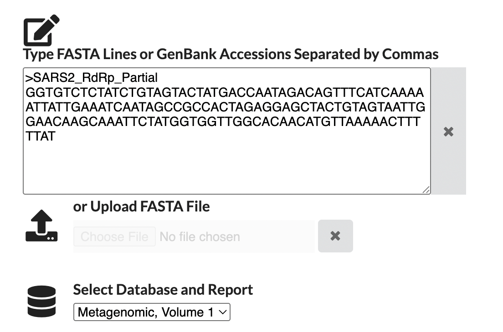
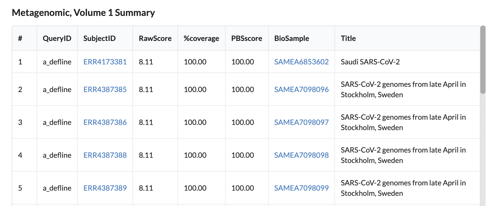

# PebbleScout

written by: [Meijin Wu, Eileen Li](https://github.com/lieilee4)

[5 minutes] This tutorial provides an overview of the **PebbleScout** tool developed by NCBI. PebbleScout searches for nucleotide sequences of interest across large, petabase-scale databases, including the **Sequence Read Archive (SRA)**, **Whole Genome Shotgun (WGS)**, and **RefSeq** assemblies. Users provide a sequence as input, and the tool quickly outputs a list of datasets containing similar sequences along with associated **BioSample metadata**. This enables researchers to track the presence, distribution, and context of sequences—such as viral, microbial, or other genomic elements—across different samples and experiments.

**Tutorial Objective**: After this tutorial, you will be able to use PebbleScout to locate and analyze nucleotide sequences of interest (e.g., from your virus) across global SRA datasets.

## Input / Prerequisites

-   Access to [PebbleScout](https://pebblescout.ncbi.nlm.nih.gov/)
-   Nucleotide sequence (FASTA) or GenBank Accessions CSV files.
    * *Note: Query sequences should be >42 bp to ensure unique k-mer mapping.*
-   **Example Data**: SARS-CoV-2 partial RdRp sequence (provided in Step 3).
-   No other specific system or other requirements are needed.

## Output

The tool provides a downloadable **.tsv file** and a web-viewable table. The primary columns include:

* **SubjectID**: The Accession ID (e.g., SRR...) of the dataset containing the match.
* **RawScore & PBSscore**: Metrics indicating the strength and specificity of the match, based on k-mer informativeness.
* **%coverage**: The percentage of your query sequence found in the subject dataset.
* **BioSample Metadata**: Information about the sample source (e.g., "wastewater", "Homo sapiens").

### 1. Navigate to [PebbleScout](https://pebblescout.ncbi.nlm.nih.gov/)

### 2. Select Database

Before pasting your sequence, ensure you are querying the correct database:

* Select **SRA** to search raw sequencing reads (ideal for finding viral traces in metagenomes).
* Select **WGS** or **RefSeq** if you are looking for assembled genomes.

### 3. Input Query Sequence

Copy the query nucleotide sequence below. This is a partial RdRp sequence from SARS-CoV-2.

>SARS2\_RdRp\_Partial
GGTGTCTCTATCTGTAGTACTATGACCAATAGACAGTTTCATCAAAAATTATTGAAATCAATAGCCGCCACTAGAGGAGCTACTGTAGTAATTGGAACAAGCAAATTCTATGGTGGTTGGCACAACATGTTAAAAACTTTTTAT

### 4. Adjust parameters (optional)

For advanced searches, these options allow you to fine-tune sensitivity and output:

* **Masking threshold**: Used to filter out common or low-complexity sequences. Increasing this value makes the search more specific to unique sequences by ignoring k-mers sampled from many subjects.
* **Score constant**: A value used in the scoring algorithm to normalize results. It is generally recommended to leave this at its default value.
* **Max # subjects per query**: This sets a hard limit on the number of SRA/WGS subjects returned.

### 5. Run Search

Click the **Search** button. The search usually takes less than 1 to 3 minutes depending on server load and query complexity.

### 6. View and Download Results

Once finished, a table will appear. Click **"Download"** to get the complete `.tsv` file.

---

## Interpreting Results: Confidence and Significance

Understanding the output of PebbleScout requires evaluating the quality of the match based on coverage and k-mer specificity.

### 1. How is "Confidence" Measured? (k-mer Specificity)

PebbleScout uses a scoring system based on **k-mer informativeness** rather than an Expect value (E-value) like BLAST.

* **The Math**: The tool breaks your query sequence into short words called *k-mers* and searches the database for exact matches.
* **Weighting**: The core innovation is that it down-weights k-mers that are "common" (found frequently in many organisms/samples) and **up-weights k-mers that are "rare"** (unique to specific organisms, like viruses).
* **The Calculation**: The `RawScore` is calculated by summing the weights of all matching k-mers. A **high score** means your hit contains many *unique* and *informative* fragments of your query, rather than just generic sequence matches.

### 2. Significance Thresholds (Coverage)

The **%coverage** column is the most intuitive metric for determining biological significance in viral discovery:

* **High Confidence (>80% Coverage)**: Strong evidence that your specific virus (or a very similar variant) is present in the sample.
* **Homology / Related Virus (20–50% Coverage)**: This often indicates a related virus is present. You may be matching a conserved gene (like the RdRp) while the rest of the genome has diverged.
* **Noise / Artifacts (<5% Coverage)**: Low coverage combined with a low RawScore often indicates non-specific binding or sequencing artifacts. These should generally be filtered out.

---

## Scientific Context and Reproducibility

### Example of PebbleScout in Publication

PebbleScout was recently used to discover "**Obelisks**," a new class of viroid-like elements. Researchers searched 5.4 million SRA datasets for specific RNA structures, revealing over 29,000 distinct elements hidden in human microbiomes.

* **Reference**: Zheludev, I.N., et al. "Viroid-like colonists of human microbiomes." *Cell* 187.3 (2024).

### Creating a Figure (Reproducibility Requirements)

When generating a figure, the legend should include:

1.  **Date of Access**: The SRA grows daily, which may change the results over time.
2.  **Database Used**: Explicitly state "NCBI SRA" or "WGS."
3.  **Filtering Criteria**: State exactly how you decided to filter the data (e.g., "Filtered to >80% coverage").
4.  **Metadata Source**: Mention that host/sample data is derived from NCBI **BioSample** records.

Example Output Figure
Below is a representative output from the PebbleScout tool. The tool generates a ranked table of SRA datasets (runs) that contain the query sequence.

> **Figure 1: Top 5 PebbleScout search results for SARS-CoV-2 RdRp.**
> The partial RdRp query sequence was searched against the **NCBI Sequence Read Archive (SRA)** database on **November 27, 2025**, using default search parameters. Results were ranked by %coverage, with geographic and host attributes derived from linked **NCBI BioSample records**. The top 5 hits (SubjectIDs: ERR4173381, ERR4387385–89) all display 100% query coverage and a maximal PBSscore of 100. The metadata reveals a global distribution, with the top result originating from a Saudi Arabian isolate followed by four datasets from Stockholm, Sweden, confirming the tool's ability to correctly identify the virus across diverse geographic datasets.

---

## Conclusion

You have successfully queried a viral sequence to identify specific sequencing runs where it is present. You learned how to interpret **%coverage** and **PBSscores** to distinguish high-confidence hits from noise, and how to utilize **BioSample metadata** to track the geographic and biological distribution of a virus. This workflow is a powerful method for conducting viral surveillance and discovering new viral hosts within the vast archives of public sequencing data.

### See Also:

-   [Indexing and searching petabase-scale nucleotide
    resources](https://www.nature.com/articles/s41592-024-02280-z)
-   [PebbleScout
    Documentation](https://pebblescout.ncbi.nlm.nih.gov/?view=doc#s-3)
