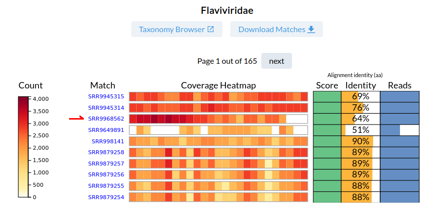
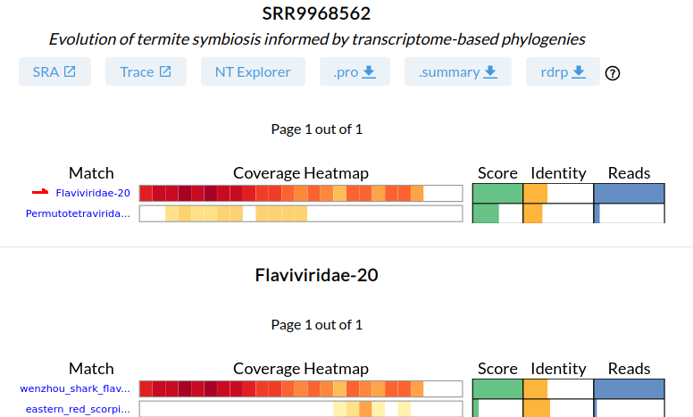
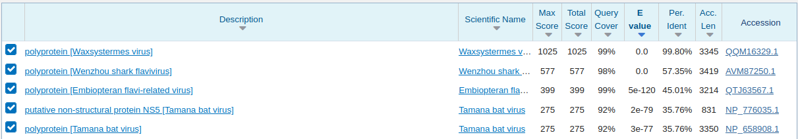
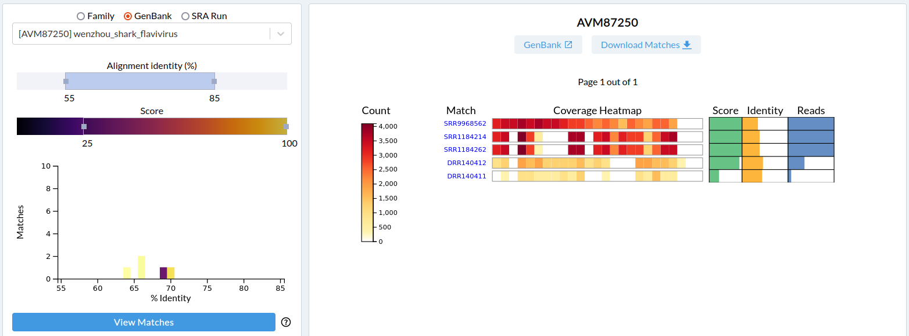
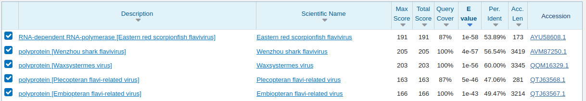
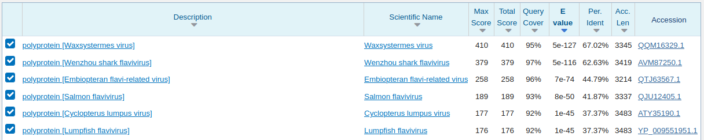

# Serratus.io Explorer
written by: [ababaian](https://github.com/ababaian)

[15 minute] Serratus is a massive RNA virus discovery project which re-analyzed the [Sequence Read Archive](https://www.ncbi.nlm.nih.gov/sra/) for the viral RdRp hallmark gene. The `Serratus.io Explorer` is a web-based graphical user interface which provides high-level access to the aggregated [.summary reports](https://github.com/ababaian/serratus/wiki/.summary-Reports) data from the project.

**Tutorial Objective**: We will use `Serratus.io Explorer` to search for novel RNA viruses related to the `Flaviviridae` family of viruses.

## Input / Prerequisites
- Access to [serratus.io](https://serratus.io/)
- Web browser
- A `virus family`, `virus GenBank accession`, or `SRA accession` to search for

## Output

The identification of `SRA` datasets which contain RNA viruses matching your search query and the `microassembly contigs` associated with those virus-matches from each `SRA run`. In our case this will be Novel (`<90% amino acid identity`) RNA viruses related to `Flaviviridae`.


### 1. Navigate to [serratus.io - RdRP Explorer](https://serratus.io/explorer/rdrp).

### 2. Creating a "Virus Search Query"

 We will perform a **Family-level** search for **Flaviviridae**.

There are three controls:

- **Reference Family Selection**: This is based on the [rdrp1](https://github.com/ababaian/serratus/wiki/ref_rdrp1) sequence query. Roughly is is known-virus sequences clustered at \~45% identity and using minimum-linkage.

- **Alignment Identity**: The average alignment-identity of all reads in a sequencing dataset mapped to the Reference Family.

- **Score**: Is a heuristic score accounting for the number of mapped reads and the span-coverage of a reference sequence. A *>80* will often yield a complete RdRP, *>50* will often yield a partial RdRP, *>10* may yield a partial RdRP sequence.


From the drop-down menu, select `Flaviviridae`. Known viruses will approximately fall in the 90%-100% identity range, so we will focus on the <50%-90% mapped-read identity range with scores of 50-100. Click `View Matches`.

Note the URL, to reproduce the search results: `https://serratus.io/explorer/rdrp?family=Flaviviridae&identity=45-90&score=50-100#result`

### 3. "Query Results".

There are 1,650 sequencing datasets (10 results per page, 165 pages), which match our query. Click `Download Matches` if you would like a `.csv` of the results.

We will select the `SRR9968562` dataset, which has a 100 score, 64% read-identity from 17,435 reads. Note that the reads are accumulated in the bins near the sequence C' terminus.





### 4. "Dataset Results".

This is a view of all RNA viral reads in `SRR9968562`. There are matches to two families: 17K reads for Flaviridae, and 84 reads for Permutotetraviridae.

Click on the coverage-heatmap beside `Flaviridae` to expand the family to the "per sequence" distribution of the reads.

The majority of the reads map to [Wenzhou Shark Flavivirus (AVM87250)](https://www.ncbi.nlm.nih.gov/protein/AVM87250) at 64% identity. A good candidate for a novel virus.




### 5. "Microassembly".

There are 6 links at the top of the page starting with `SRA` which links to the NCBI-SRA page for this dataset and ends with `rdrp` which links to the microassembly for this dataset.

All the reads mapped to `rdrp1` from `SRR9968562` were assembled to yield rdrp-containing contigs, we refer to this as microassembly. Click to download `rdrp` to download the microassembly. Open this fasta file in your favourite text editor.

The highest coverage contig is (which we know from the summary will be the Flavivirus).

```
>SRR9968562 NODE_1_length_1481_cov_735.092254
TCTGTGGAATCCAACATCTGCTCTCGTGCCCTCCCAACATACTTTATGTCTTTCATACTG
CTTATGGGTGGCCAGCCTTCCCAAATTTGATTGAATGCTTGAATCATGTTATTGGTGCTC
ATCCAGGGTTGTTCTCTCCACCAGGGGTCCTTGGCTCGACCCATTGGCAATAATCCCCTT
GGTACTATCGCCCTCACCATGTTGGCGGCTAGTCTCACATTCCTCCGTTGTGGGAAAGTG
AGTAATAGGTAGTTGGCATAACCTTTGGCCATGGCTTGTTCAACTTCTCCTGTTTTGTAT
CCACCCAACACTATTCTTGCTTTTCCAAGAATTTCAATCTCACTCCGATCAAGCATTATT
CTGATATCATTTCCTACCTTAACTCTACTGTAGGTGTGGGAACAAAACCATGTGTTCTCG
ATGTTTTTGCTCCATGTTGGTTCTCCAGGTTCAAATTTTAAAACCTTACCGTACTTGGCG
AACGCTGCCACCAGTGTCTCTTCTGGGTGTTGCGTGTCATACAAAACCAGGCAATCGTCC
CCGCTTATCAAGCGGTTCTCTCTTCCATAAGTGTTTCCTAGGTCTTTACTTACGGCTTGC
TGAATGATTGCATTTGTGATGGTGTTCATGGCATAGGTTACTATGGTTCCCGACATTCTC
TGTCCACGACCATGCAACCACATCAGATTTCCGTCTGCGTCCTGCACCCGAATGATGGGG
CTTCTATAGCACTCATAAATGGTCCTAATTTTCCGCCGGTGGTCTTCGCTTTCTGCTCGT
TCCTCACAGATCCGTTGTTCATTTTGCAACTCGTACTCACTCACTCTTGTGTCCCATCCA
GCGATGTCCCCTTGGAACACTTGTCCTTCAGTGGTCTCTCCAGTCATTCTGTTCATCTTT
AGCCGGTTCAAAGCTTTCTCTCCGTACAAGTGTTGGGGTATTCCTGAAACTCCTTCGGGG
GTATTTTCTTCTCCAGCCCAATGGTCTGCATTTAGTGCTCCTAGTGTTCTCATTTCACAT
GCTCGTTCAATCAAATCATAATAAGCTATCATCCTTGAGGTTTTTTGCCCCCACTTATTT
TTCTCCTTTTTCTCTCTTTTTGCCATCGTGTGGAACACTCCTCTCAGGCAAACACCATTT
CTATGGTTTAAGTCTTCAGCTTGAACCTCTCTCCAAAACTCTTCACTTTCCTTCGCTTCC
AGGGCTGTCTTCCATCTGGGATCTCCTACGGCTGCATCATTTCGTATCATCTCCTTCACC
TCGTCCCAACTAAGTTCTCTCAAGGTGGTTGGTAGGGTTTTCTCTACTTCCTTTGAGGCT
TTTTTGAAGTCTTCCATGCCTTCAGGAGGCATATGAGGTGTTGTGTCCACTTTTTCTTTG
AACACTCGCAGCAATCCTACGGGGGAGACGTCTGTTAGCATGTACCTACCAATCCCTGGG
CTTGCTCTCATCAACGGTTCCAGTACCCTATCCCAGATCGG
```

### 6. "BLASTX" against `nr` database

To test the hypothesis that this is a novel sequence, we will run the [`BLASTX`](
https://blast.ncbi.nlm.nih.gov/Blast.cgi?PROGRAM=blastx&PAGE_TYPE=BlastSearch&LINK_LOC=blasthome) of this microassembly sequence against the NCBI Non-Redundant Protein (`nr`) database on their webserver:



In this case, this sequence had been previously identified by [Lay et al.,](https://www.ncbi.nlm.nih.gov/protein/QQM16329.1) as `Waxsystermes virus` and deposited on 13-January 2021. The `rdrp1` database used in the search was created in December 2020, so this is a perfect positive control, confirming this is in fact a novel virus.

Remember with `Serratus` we identified 130,000+ novel RNA viruses, and all of these were evalulated against the `nr` database as being below 90% identity. There's always more viruses to find...

### 7. Repeat steps 4-6... and/or

### 8. "Sequence Targetted Search"

From the last search we identified a "space" containing novel flaviviruses. We can refine our search to find sequences in specifically this vicinity of *Flaviviridae*.

Navigate back to the `RdRP Explorer` page and select `GenBank` as the top-level search.

We know that `Waxystermes virus` was identified by reads at \~65% identity to `Wenzhou Shark Flavivirus (AVM87250)`. We narrow our search for other libraries with this pattern:



- [`SRR9968562` (as above)](https://serratus.io/explorer/rdrp?run=SRR9968562)
- [`SRR1184214` and `SRR1184262`](https://serratus.io/explorer/rdrp?run=SRR1184262)
- [`DRR140412` and `DRR140411`](https://serratus.io/explorer/rdrp?run=DRR140412)

`SRR1184214` and `SRR1184262` are both from *Lepisma sp.* (Silverfish), which we can `BLASTX`. You can see it's 60% to `Waxystermes virus`, so in the correct vicinity of viruses we were looking for and not reported by Ley et al.

```
>SRR1184214 NODE_1_length_570_cov_1070.265655
ACGCTGTTCGAGACTTACCGATCACCCATAATAAGACTAAAAACAGAGGGAAATAAAGAG
GTGTTCTTGCATGGTAGAGGACAGCGCATGAGCGGAACAATCATAACGTATTGCAAGAAT
ACTGAGACCAACAGCATCATCCAAGAGTGTGTCTACCGAGAGCTGTTCGGAGAGAGAGGT
GACAGGCGGCGTCGAGCAGTATCAGGAGATGACTGCTGTGTGTGGTGGCCGGAGGAGAGA
ACTCGGGATGCGGTGGAGCAAGCGTTCGCTAAGTTTGGAAAGGTGCTTAAAGACCGGGCT
GGAGAAGGCCACGATTACACCCACAACTTGGAGGATACATGGTTTTGCAGCCACACCTAC
ACTCGTGTCTATGTGGGAAATGGTATCCGGTATCACCTAGATCGTAGCGAAGGAGAGATT
CTGGGAAAAGCTAGACTTGTCCTTGGAGGTTACAAGGATGGAACAGTAGAGTTGGCGATG
GCGAAAGCGTATGCGAACTATCTCTTAGTAACCTTCCCACACAGGAGGAATGTGCGACTT
GCAGCCTTGGCAGTGCGCAGCGTGTGCCCG
```



`DRR140412` and `DRR140411` are from *Dianemobius nigrofasciatus*, a cricket. Again testing with `BLASTX` against `nr` we see this is a novel virus in the correct vicinity.

```
>DRR140412 NODE_2_length_892_cov_10.260973
CCGATCTGCCTTTTTTCTTGCAGTTTTCTTATCACACACTGTTGGATCACTGCATTGGTG
ATAGTATTCATGGCATAAGTAGTCACGCTCCCCGACATTCTCTGGCCCCTGCCATGCAGG
TACAAGTCGTATCCTTGTCCACTTCTGAGCTTTACGATGGGGGATCGGTAACACTCATAA
ATCGTCCTAATGGCTCTCCGATGGCCTTTGCTCGACGCTCTTTCTTCGCAGATTCTCTGC
TCATTCTCTAGCTCAAACTCACTCACACGCGTGTCCCAACCACCTATGTCGCCCTGGAAC
ACTACTCCTCCCGGGATTTCCCCCGAGTTCCTGTTGGCCCCCACCCGGCTAGCTATCTCT
TCCCCATACATGTGTTGCGGAATACCCGTAACACCTTCTGGCAAGTTTTCCTTAGCTGCC
CAGTGGTCTACGTTTATAGCTCCTAGGGCCTTCATTTCACAAGCCCTTTCCACCAAGTCG
TAGAATGCTATCATCCTGCTAGTTTTTGGCCCCCATTTATTCTTCTCCTTCTTCTCTCTC
TTTGCCATAGTGTTGAAAATCCCTCTCTTGCAAATTCCATTCACATGATTTTCGTGCTCT
AAGGCGCATTCATTCCAAAAAGCGGGGTCTTCTTTGGCTTCCTTGGCTGTCGTCCACCGG
GAGTCTCCCACTGAGGCGTCATTCCTGATACAGTCTTTCACCTCGCTCCAGGTCAACTCC
CTTAGGATTTTTGGCAATCCACTCTCAATTTCCCTTGAACACTCCCTGAAAAGGGCCCTG
CTCTCTTTGGGCATGTATGGAGTTGTGTCGATTTTTTCCTTGAAGACTCTCATCAAGCCT
TCATCACTCACGTCTGTTAGTGTATAACGCATGATCTTCTGGTTTACTTTAG
```



### Conclusion

That's it! You've used the `Serratus.io` platform to uncover novel viruses. 

Here we have provided an overview on how to apply the `serratus.io` web interface to easily "click and discover" novel viruses. As you interface the data more, you will grow an intuition for paths to identifying novel viruses and what they "look like".

In all forms of analysis, this is by far the fastest and easiest way to reach the relevant data. Even when doing systematic analyses as outlined in [further tutorials](Find_novel_viruses_B_palmdb), we come back to the steps outlined above as a sanity check and means of confirming the validity of what a larger analysis is telling us.

### See Also:

- [Serratus](https://www.nature.com/articles/s41586-021-04332-2) publication.
- [Novel Bornaviruses in colubrid and viperid snakes](https://link.springer.com/article/10.1007/s00705-021-05138-3) is great example of the next steps to turn your findings into a short paper
- Serratus.io [basic overview](https://github.com/ababaian/serratus/wiki/Serratus-Explorer)
- Accessing the [`SQL` database directly](https://github.com/ababaian/serratus/wiki/SQL-Schema)
- [`rdrp1`](https://github.com/ababaian/serratus/wiki/ref_rdrp1) reference query sequences
- Understanding [sources of error](https://github.com/ababaian/serratus/wiki/Sources-of-Error) for alignment-based analysis
- Serratus Wiki Tutorials for [Finding Novel Viruses](https://github.com/ababaian/serratus/wiki/Find_novel_viruses)