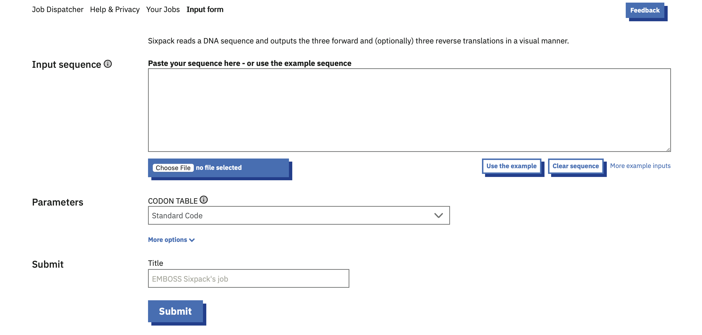
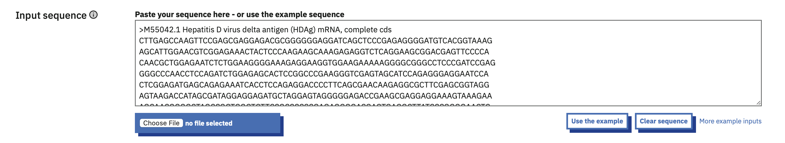
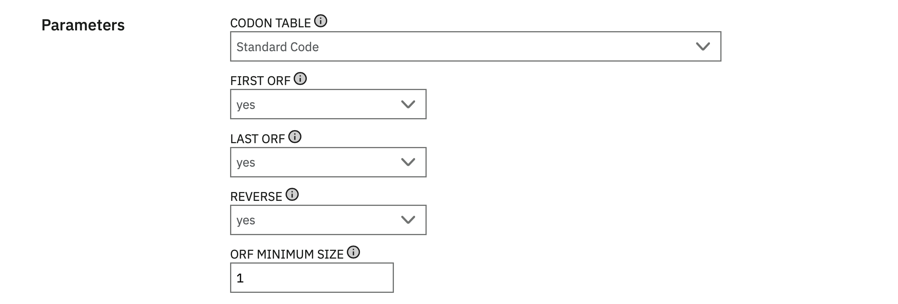
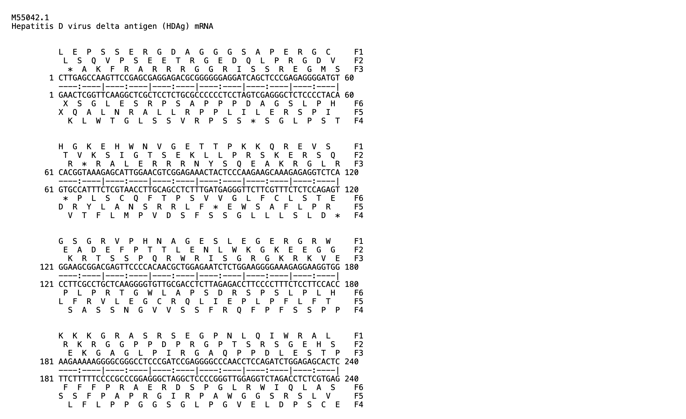

# Sixpack
written by: Iris Wang (https://github.com/iriszw)

[7 minutes] This tutorial introduces Sixpack, a tool that displays 6-frame translations of a DNA sequences in a visually organized format. Sixpack processes a given DNA sequence and generates an output file that includes both the forward and reverse sense sequences, along with their corresponding three forward and (optionally) three reverse frame translations. This tool may help the identification of potential coding regions within viral genomes, which can subsequently be used for predicting and annotating the functions of viral genes.

**Tutorial Objective**: This tutorial guides readers on how to perform  sequence translation using Sixpack through its web interface and retrieve the output in various available formats.

## Input / Prerequisites
- [Tool Weblink](https://www.ebi.ac.uk/jdispatcher/st/emboss_sixpack)
- Sixpack requires a single nucleotide sequence input in one of the following formats: `GCG`, `FASTA`, `EMBL`, `GenBank`, `PIR`, `NBRF`, or `PHYLIP`. The sequence can be provided by directly pasting or file upload.
- Sixpack is accessible through a web browser. There is no specific system requirements.

## Output

Sixpack generates a text-based output report that provides a six-frame translation of the input DNA sequence. This report includes both forward translations and reverse translations. The three forward reading frames are displayed above the corresponding DNA sequence, showing the amino acid sequences translated from the forward strand. The three reverse reading frames are displayed below the corresponding DNA sequence, showing the amino acid sequences translated from the reverse complement strand.

## Tutorial Instructions

### 1. Prepare your sequence of interest

In this tutorial, we will work with the Hepatitis D virus cDNA sequence corresponding to its genomic RNA (GenBank: M55042.1) as an example. Together, we will explore the six-frame translation of the genomic sequence. You can access the sample sequence [here](https://www.ncbi.nlm.nih.gov/nuccore/M55042.1?report=fasta).

When working with your own virus, make sure your input format is supported by Sixpack. (See [Input / Prerequisites](#input-/-prerequisites))

### 2. Navigate to [Sixpack](https://www.ebi.ac.uk/jdispatcher/st/emboss_sixpack)

On the Sixpack input page, you will find an input box where you can paste the DNA sequence or upload a sequence file. Below the input box, there are additional options to adjust parameters, or add a job title for easy identification of your analysis.

### 3. Input the sequence

For the purpose of this tutorial, we will paste the cDNA sequence directly into the provided text box.

### 4. Set your parameters

The default parameters in Sixpack are configured for general use. These settings are suitable for most DNA sequence analyses.

**Optional: Customize your parameters**

If the sequence being analyzed requires alternative translation settings, feel free to customize the parameters under "More options" to tailor your output. For example, you can choose to:

- Select a specific Codon Table.
- Count the beginning/end of a sequence as a possible ORF.
- Reverse and compliment your sequence.

For the purpose of this tutorial, we will keep the parameters as default.

### 5. Submit your job

You may leave the Title field blank or fill in a job title of your choice for easier identification.

After confirming that all inputs and parameters are correctly set, click `Submit` to start the Sixpack job.

### 6. View your result

Once the job is complete, Sixpack will display the results on the screen. The output includes the six-frame translation of the input DNA sequence. You can use the following features to interact with or download the results:

- Visual Output: Easily examine the sequence translation in all six frames directly within the browser interface.

- Download Options: Export the output as a text file or single compressed zip file for further offline analysis or integration into other tools.

[The file is partially shown for brevity]

### Conclusion

That's it! By following this tutorial, you have learned how to use Sixpack to analyze DNA sequences by generating the six-frame translations. This process is an upstream step in the workflow that provides the foundation for identifying potential coding regions. With these skills, you can now apply Sixpack to sequences in your own viral genome research to explore their coding potential.

### See Also:

- [Publication: The EMBL-EBI Job Dispatcher](http://europepmc.org/abstract/MED/38597606)

