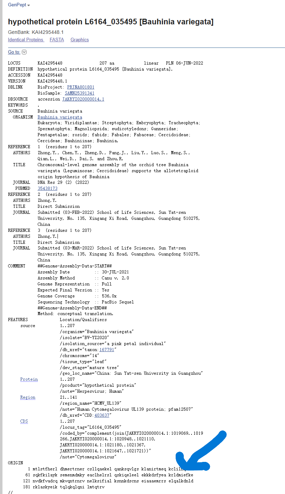
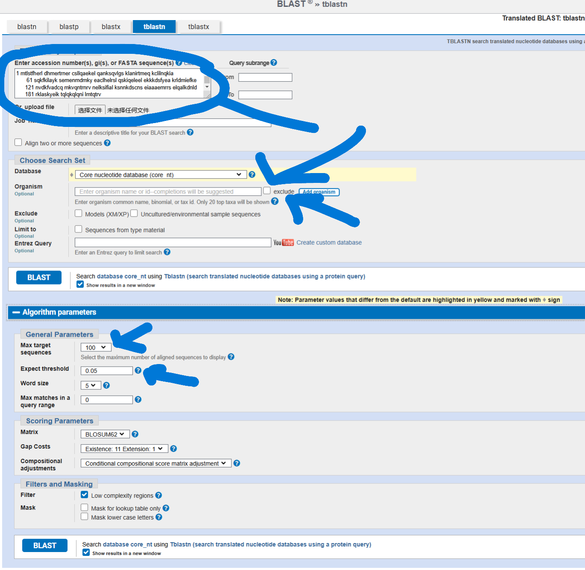
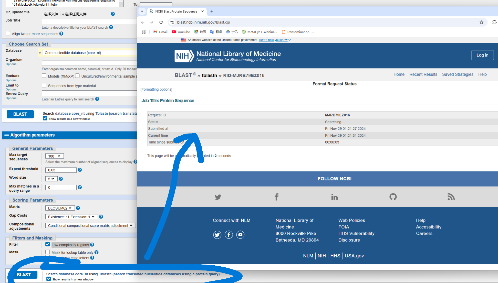
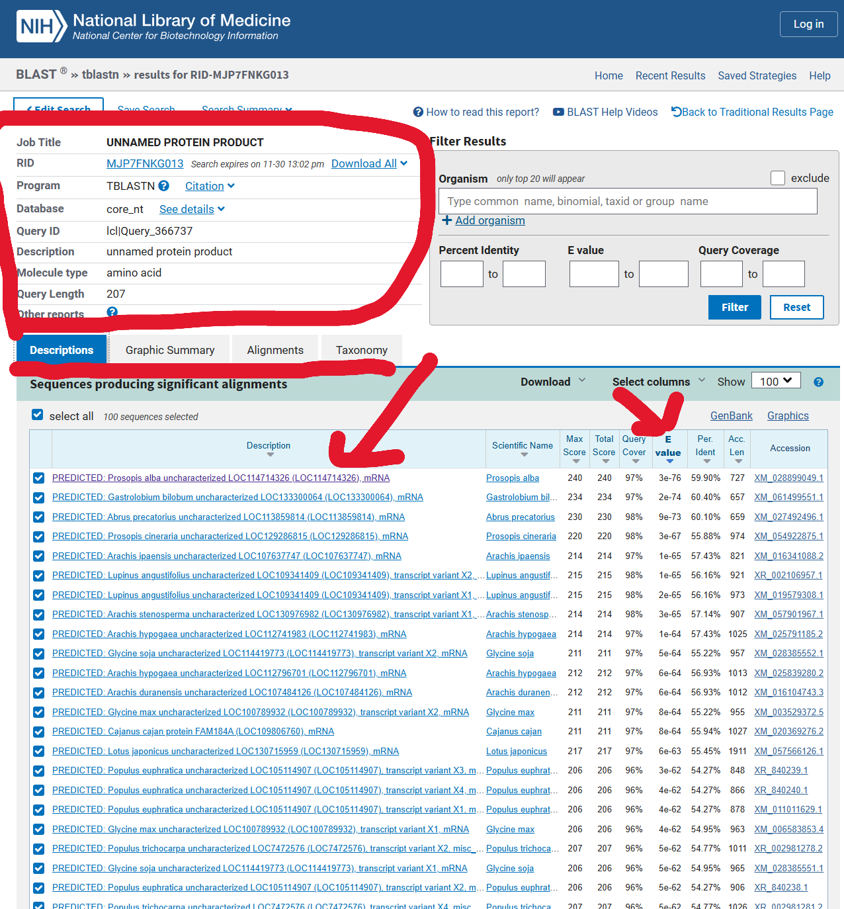
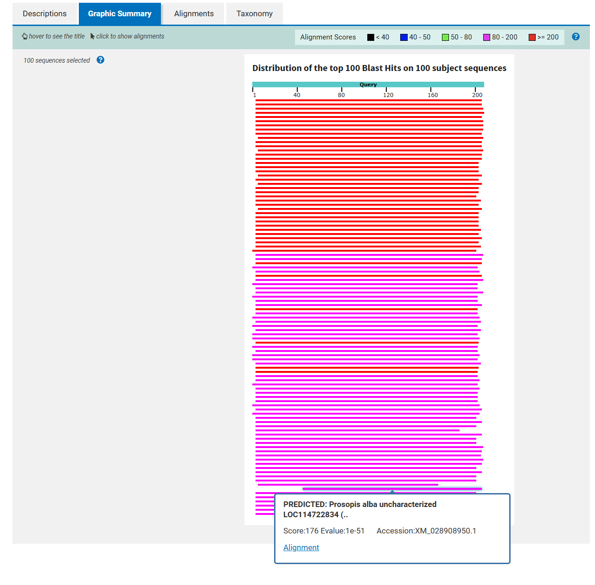
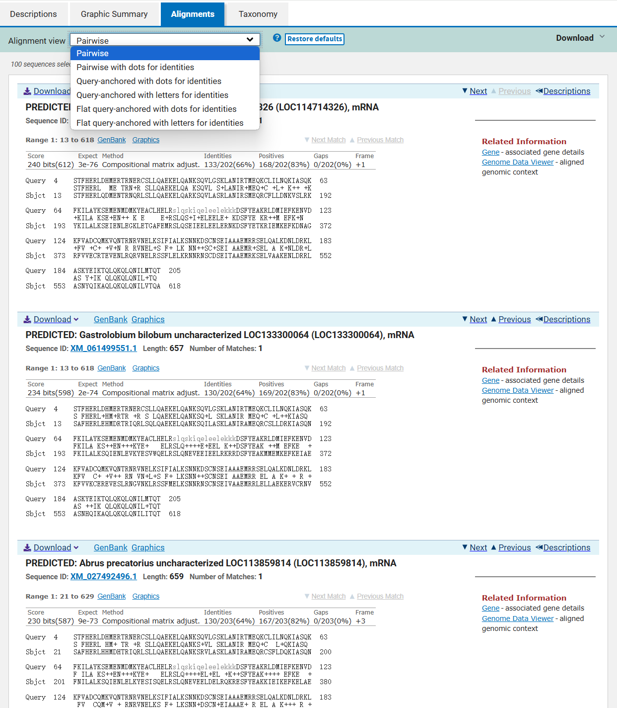
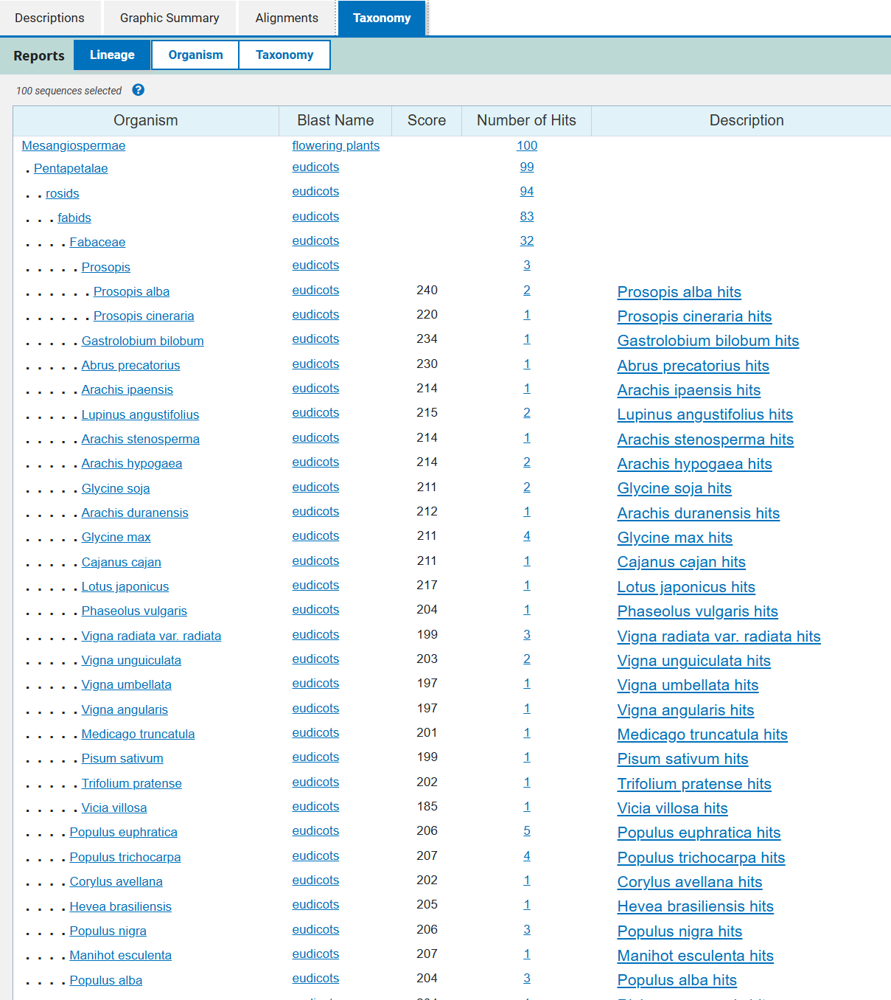
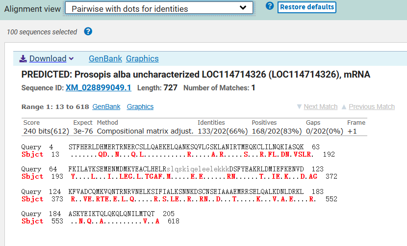
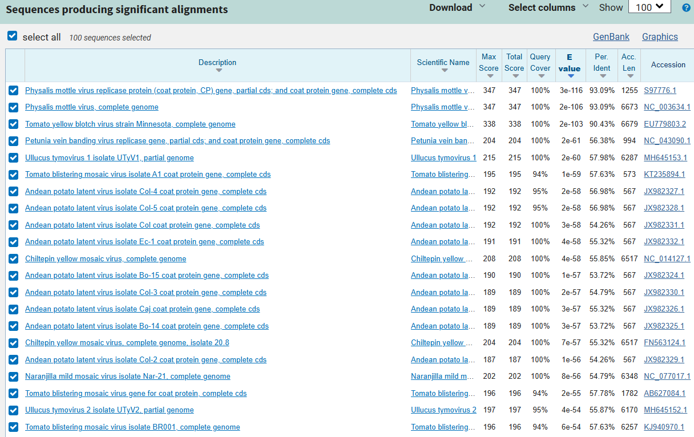
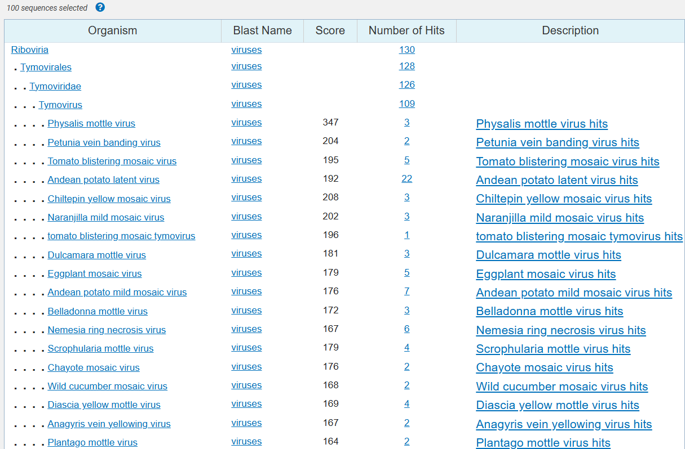

# {TBLASTN}
written by: [ZhenghaoXiao](https://github.com/ZhenghaoXiao)

[{15} minutes] {`Translated BLAST(TBLASTN)` is a website based tool on NCBI that can compare `protein sequences` against `nucleotide sequences` to identify `translated nucleotide database sequences` similar to the provided `protein query`, which
 allows for functional and evolutionary studies of viruses.}

**Tutorial Objective**: This tutorial will teach how to look for translated nucleotide database sequences similar to the protein query.

## Input / Prerequisites
- [Tool Weblink](https://blast.ncbi.nlm.nih.gov/Blast.cgi?PROGRAM=tblastn&PAGE_TYPE=BlastSearch&LINK_LOC=blasthome)
- [Link to example data](https://www.ncbi.nlm.nih.gov/protein/KAI4295448.1)--`Bauhinia variegata`--`I did not use my obelisk 17 sequence because the translated protein sequence did not provide me any result on tblastn`
- A FASTA Protein Query Sequence
- Adjustment on the Parameters-E value(Expect threshold), Max Target Sequences, Database Choice, Organisms, etc

## Output

A `table` showing matches between the `query protein` and list of `translated nucleotide sequences` that produce the most significant alignment, ranking from the highest E-value to the lowest. The graphic summary, detailed alignment, and taxonomy will also be provided.

### 1. 
Go to the TBLASTN website(https://blast.ncbi.nlm.nih.gov/Blast.cgi?PROGRAM=tblastn&PAGE_TYPE=BlastSearch&LINK_LOC=blasthome)

### 2. 
Then go to the example data website, copy and paste the protein query to the NCBI TBLASTN website input `Enter Query Sequence`.

*Figure 1: Example Protein Query-Bauhinia variegata*

*Figure 2: Example Protein Query Entry on tblastn and parameters*

### 3. 
Play around with the parameters based on experiment design. For example database determines the pool of nucleotide sequences that will be compared to, the expect threshold(statistic confidence value) represents the likelihood a match happens, low complexity region filter prevents nonspecific and repetitive matches, etc

### 4. 
Then click on blast to start the tool. 

*Figure 3: Start tblastn-Bauhinia variegata*

### 5. 
The result will take a while to be generated. 

### 6. 
Analyze Results: Review the output table on significant matches, it ranks based on E-values, query coverage, percent identity, etc. The top left indicates the summary of the search, including the input selections. 

*Figure 4 :tblastn Results and Summary-Bauhinia variegata*

### 7. 
The graphic summary provides a visual representation of the max BLAST hits(selected before in parameters) from your TBLASTN search, showing their alignment scores(<40 ->  >200 )across the query sequence. Click to show more information.

*Figure 5: tblastn Graphic Summary-Bauhinia variegata*

### 8. 
The alignment of the query protein and subject sequences(hits) is shown in the alignments tab, from the most significant to the lowest. Details on the hits are also provided, sequence id, score, gene, etc. Hit sequences can also be downloaded.Different styles of alignment(same alignment result) can also be selected, including pairwise(default), pairwise with dots for indentities, etc

*Figure 6: Alignments-Bauhinia variegata*

### 9. 
The taxonomy Tab provides a biologically meaningful way to organize the hit results based on lineage, organism, and taxonomy. For example, in this search, the sequence was from Bauhinia variegata, the organism in lineage with the highest hits is Mesangiospermae	flowering plants, which make senese because Bauhinia variegata fully resonate with this category. The Organism based grouping organizes the hit sequences based on the group of same organism, and by clicking on it, users would be navigated to the alignment tab and taxonomy-based grouping organize the hits using the taxonomic hierarchy. For example: ranking from family to species. 

*Figure 7: Taxonomy-Bauhinia variegata*

### Conclusion

That's it! You've used TBLASTN to identify translated nucleotide sequences similar to the provided protein query. The results can be used to annotate protein coding regions in viral sequences and genomes or study the evolutionary pathways and relationships of known viruses, which makes this tool is essential to advance research in function studies in evolution of virus.
It is the same way of approaching for virus input of tblastn. For example, blasting with Physalis mottle virus protein sequence, tells that EU779803.2(Tomato yellow blotch virus strain Minnesota) is most similar one with the highest confidence value to the sample besides other Physalis mottle virus. 
- [Physalis mottle virus] https://www.ncbi.nlm.nih.gov/protein/1E57_B

*Figure 8: Physalis mottle virus tblastn Results*

### See Also:
- [Camacho C., Coulouris G., Avagyan V., Ma N., Papadopoulos J., Bealer K., Madden T.L. (2008) “BLAST+: architecture and applications.” BMC Bioinformatics 10:421. PubMed] https://pubmed.ncbi.nlm.nih.gov/20003500/ 
- [NCBI BLAST Documentation] https://blast.ncbi.nlm.nih.gov/doc/blast-help/
- [More detailed explanation] https://ftp.ncbi.nlm.nih.gov/pub/factsheets/HowTo_BLASTGuide.pdf

