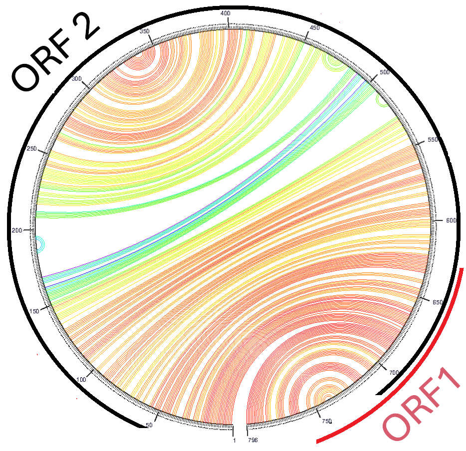
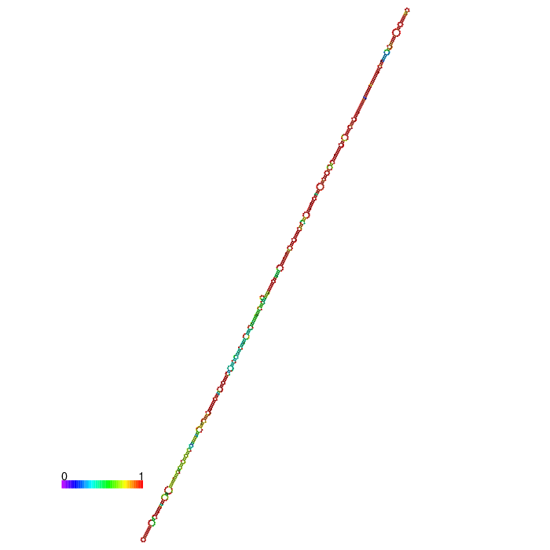
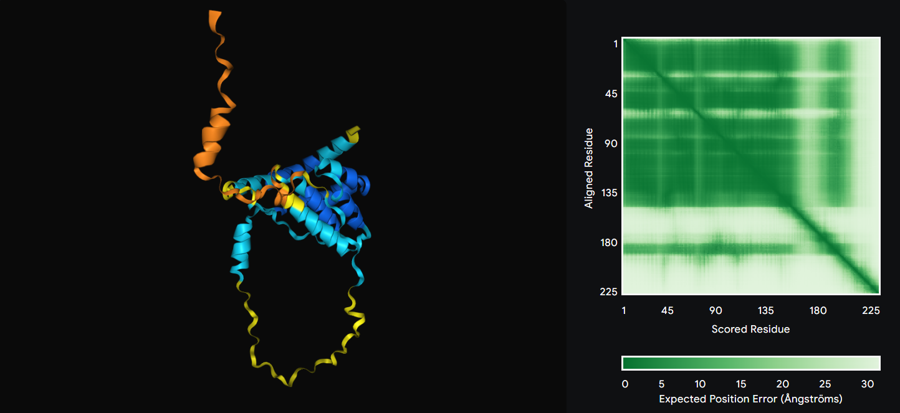

# {"Obelisk in the Abyss: Unveiling Viral 'Pillars' of Gut Microbial Balance"}
written by: [Paul D'Agostino]

### {Aenigmovirus labrynthii}
The name Aenigmovirus labyrinthii captures the essence of the obelisk as a key player in the labyrinthine dynamics of gut microbiota and host interactions. It reflects not only the virus's role in navigating these complexities but also the challenging path researchers face in unraveling its ecological and functional significance. The evocative name further ties into themes of exploration, discovery, and the interplay of hidden systems.


The discovery of Aenigmovirus labyrinthii, a novel RNA-based viroid associated with mammalian and primate hosts, reveals unique genomic and structural features that challenge existing classifications. Named for its enigmatic genome and intricate RNA secondary structure, this viroid comprises a 796-nucleotide genome with two overlapping open reading frames (ORFs), bisected by a conserved rod-like RNA fold. Mutations within the conserved A region of Oblin-1 and lack of homology to annotated proteins further underscore its novelty, with ORF1 showing limited similarity to uncharacterized microbial proteins. Interestingly, A. labyrinthii correlates with Picobirnaviridae and Narnaviridae in wastewater samples, suggesting a potential human origin and its role in gut microbiome dynamics. These findings highlight the viroid's significance as a potential viral “pillar” of gut microbial balance, expanding our understanding of RNA viroid evolution and uncovering an underexplored ecological niche for pathogen discovery.

### **Ecological Context of the Obelisk in the Index Case**

The focal ecological context of this obelisk centers around the study of fecal samples from Rhesus Macaques (*Macaca mulatta*), as detailed in the publication by Westreich et al. (2019). This study highlights altered microbial metabolism in the gastrointestinal tracts of macaques with idiopathic chronic diarrhea (ICD). The sample source consists of two stool datasets—one from an ICD-affected macaque and another from a healthy control. The use of Illumina HiSeq 3000 sequencing on transcriptomic cDNA, prepared with Qiagen RNeasy Micro kits, provides high-resolution insights into microbial community dynamics. The ecological interaction spans both biotic factors (the macaques and their gut microbiota) and abiotic factors (the laboratory conditions and sequencing technology).

### **Broader Ecological Landscape Across Datasets**

In a comparative analysis of all obelisk-containing datasets, a key shared characteristic is the presence of host-associated gut environments, with this virus consistently linked to mammals. The indexed datasets originate exclusively from Rhesus macaques, suggesting a species-specific ecological niche. However, broader BLAST alignments link the viral sequences to multiple bacterial genomes, underscoring potential inter-domain genetic exchange or host-associated microbiome interactions. This observation implies that the obelisk may represent a phage or mobile genetic element deeply integrated within mammalian gut ecosystems.

### **Technological and Biological Parameters**

Across datasets, the viral presence is identified using consistent methodologies—RNA sequencing on Illumina HiSeq platforms. Transcriptomic analysis allows for the detection of both host and microbial expression profiles, providing a dual-layered ecological snapshot. The study leverages the precision of modern sequencing to reveal viral signatures otherwise hidden in conventional microbiome studies. The datasets' biological origins are macaque fecal matter, with sample preparation optimized for RNA integrity and microbial community profiling. These consistent protocols enhance the comparability of datasets and strengthen the ecological inferences.

### **Comparative Patterns and Hypotheses**

The obelisk is consistently detected in gut samples from Rhesus macaques, but its functional and ecological role diverges between healthy and ICD-affected individuals. A common factor linking these datasets is the host species and gut microbiota, which may influence viral propagation or expression. The viral genome's association with bacterial strains in BLAST searches hints at horizontal gene transfer mechanisms, suggesting the obelisk's role as a potential bacteriophage or symbiont. 

To quantify these observations, metrics such as viral load, transcriptional activity, and microbial diversity can be assessed. For instance, comparing viral RNA abundance between the healthy and ICD datasets could illuminate disease-associated shifts in viral activity. Translating these observations into hypotheses, we propose that the obelisk represents a gut microbiome-associated virus, whose expression correlates with host microbiota composition and disease state. Specifically, its increased detection in ICD samples may reflect altered host-microbiome dynamics or opportunistic viral activation during dysbiosis.







### **Biological Insights from the Obelisk**

Characterizing this obelisk has revealed intriguing aspects of host-microbe-virus interactions, specifically within the complex ecosystem of the Rhesus macaque gut. The obelisk appears to be a microbial or viral genetic element with a significant ecological and potentially functional role. By studying its genome, we uncover potential links to horizontal gene transfer, microbiome adaptation, and the modulation of gut health in both normal and pathological conditions.

### **Fascinating Traits and Novel Insights**

One of the most striking features of this obelisk is its apparent duality in ecological roles. BLAST searches of its genome reveal associations with multiple bacterial strains, hinting at a phage-like behaviour. This aligns with textbook definitions of bacteriophages as facilitators of genetic exchange in microbial communities. However, its consistent presence in mammalian gut environments, particularly in a host-specific context (Rhesus macaques), suggests a more refined ecological niche. This duality raises the possibility of it being more than a phage—perhaps an endogenous viral element or a highly adapted gut virus. 

A fascinating insight lies in its altered detection patterns between healthy and ICD-affected macaques. This divergence highlights the obelisk's potential sensitivity to dysbiosis or disease states, suggesting a functional interaction with microbiome homeostasis or pathogenesis. Such a feature positions it as a potential biomarker or a modulator of gut health, offering exciting avenues for future research.

### **Pushing Against Textbook Definitions**

What sets this obelisk apart is its deviation from certain classical viral traits. While bacteriophages are typically expected to infect and lyse bacterial hosts, the obelisk's behaviour appears subtler. Its genome shows high alignment scores with bacterial sequences, yet its ecological role may not involve outright lysis. This trait suggests it could be involved in lysogenic cycles or may act as a mobile genetic element, facilitating the exchange of functional genes without the traditional hallmarks of viral infection.

Furthermore, the obelisk lacks any obvious virulence factors typically associated with pathogenic viruses. Instead, its presence in both healthy and diseased gut environments suggests it may play a neutral or even symbiotic role. This challenges the traditional view of viruses as primarily harmful agents and instead underscores their potential as integral components of the microbiome.

### **Novel Biological Questions**

Characterizing this genome raises several questions. Does the obelisk actively influence microbiome dynamics, or is its presence a passive reflection of microbial composition? Does its differential abundance in ICD-affected macaques suggest a causative or responsive role in disease? These questions highlight the obelisk's potential to bridge the gap between virology, microbiome research, and disease ecology.

In conclusion, the study of this obelisk pushes us to reconsider viral ecology in the context of complex host-microbe interactions. It demonstrates that even within the seemingly well-defined roles of phages and viruses, there are exceptions and novel pathways yet to be explored. By challenging and extending textbook definitions, this obelisk offers a window into the adaptive strategies of genetic elements in the dynamic world of gut ecosystems.

## References

- Westreich, Samuel T et al. “Fecal metatranscriptomics of macaques with idiopathic chronic diarrhea reveals altered mucin degradation and fucose utilization.” Microbiome vol. 7,1 41. 18 Mar. 2019, doi:10.1186/s40168-019-0664-z
- Zheludev IN, Edgar RC, Lopez-Galiano MJ, de la Peña M, Babaian A, Bhatt AS, Fire AZ. Viroid-like colonists of human microbiomes. Cell. 2024 Nov 14;187(23):6521-6536.e18. doi: 10.1016/j.cell.2024.09.033
- National Center for Biotechnology Information (NCBI)[Internet]. Bethesda (MD): National Library of Medicine (US), National Center for Biotechnology Information; [1988]. Available from: https://www.ncbi.nlm.nih.gov/
- The Protein Data Bank H.M. Berman, J. Westbrook, Z. Feng, G. Gilliland, T.N. Bhat, H. Weissig, I.N. Shindyalov, P.E. Bourne (2000) Nucleic Acids Research, 28: 235-242. https://doi.org/10.1093/nar/28.1.235 
- MGnify: the microbiome sequence data analysis resource in 2023
Lorna Richardson, Ben Allen, Germana Baldi, Martin Beracochea, Maxwell L Bileschi, Tony Burdett, Josephine Burgin, Juan Caballero-Pérez, Guy Cochrane, Lucy J Colwell, Tom Curtis, Alejandra Escobar-Zepeda, Tatiana A Gurbich, Varsha Kale, Anton Korobeynikov, Shriya Raj, Alexander B Rogers, Ekaterina Sakharova, Santiago Sanchez, Darren J Wilkinson, Robert D Finn, Nucleic Acids Res 51(D1):D753-D759 (2023)
- Jumper, J. et al. “Highly accurate protein structure prediction with AlphaFold.” Nature, 596, pages 583–589 (2021). DOI: 10.1038/s41586-021-03819-2
- Waterhouse AM, Procter JB, Martin DMA, Clamp M, Barton GJ (2009) Jalview Version 2 - A multiple sequence alignment editor and analysis workbench. Bioinformatics 25 1189-1191. (doi:10.1093/bioinformatics/btp033)
- Edgar, R.C., Taylor, B., Lin, V. et al. Petabase-scale sequence alignment catalyses viral discovery. Nature 602, 142–147 (2022). https://doi.org/10.1038/s41586-021-04332-2
- Leinonen, Rasko et al. “The sequence read archive.” Nucleic acids research vol. 39,Database issue (2011): D19-21. doi:10.1093/nar/gkq1019
- Mfold web server for nucleic acid folding and hybridization prediction.
Nucleic Acids Res. 31 (13), 3406-15, (2003)
- Lorenz, R. and Bernhart, S.H. and Höner zu Siederdissen, C. and Tafer, H. and Flamm, C. and Stadler, P.F. and Hofacker, I.L. "ViennaRNA Package 2.0", Algorithms for Molecular Biology, 6:1 page(s): 26, 2011
- Stephen F. Altschul, Thomas L. Madden, Alejandro A.
Schaffer, Jinghui Zhang, Zheng Zhang, Webb Miller, and David J.
Lipman (1997), "Gapped BLAST and PSI-BLAST: a new generation of
protein database search programs", Nucleic Acids Res. 25:3389-3402.
- OpenAI. Response generated by ChatGPT, an AI language model. 2024. Available from:https://chatgpt.com.

```
Introducing the Future of Viral Research!** Have you ever wondered what makes the human body tick? Well, with our latest scientific breakthrough, you can be part of the next revolution in health and wellness! You’ve heard of viruses before, but have you encountered one like this? Let’s talk about the stunning discovery that's sure to change everything we know about infectious disease!

In an exciting new study, our researchers uncovered a remarkable virus **found in stool samples from juvenile rhesus macaques suffering from Idiopathic Chronic Diarrhea (ICD)**. What’s truly astonishing is the virus's structure! Unlike anything we’ve encountered before, the virus features **two open reading frames (ORFs), one of which is predicted to be completely disordered**. A disorderly ORF? That’s right, folks, something previously unseen in nature!

But that’s just the beginning! When we looked closer, we found that this virus returns a **93% alignment identity to Picobirnaviridae**, a virus group previously associated with digestive issues in humans. But hold on—there’s more! Our team also discovered that the virus shares a **68% alignment identity to Narnaviridae**, a viral family with intriguing connections to neurological disorders. Could this be the key to unlocking new treatments? Only time will tell!

Now, for the clincher—**all the obelisks in this cluster have a greater than 90% identity to the centroid**! Yes, you heard that right—mysterious obelisks found near the macaques’ habitat are nearly identical to a central form, suggesting an unknown correlation with the virus! Is this the key to an entirely new paradigm of infection? Or perhaps the dawn of an age-old mystery waiting to be solved? Tune in for the next big step in viral research—only from the brightest minds of today!
```
