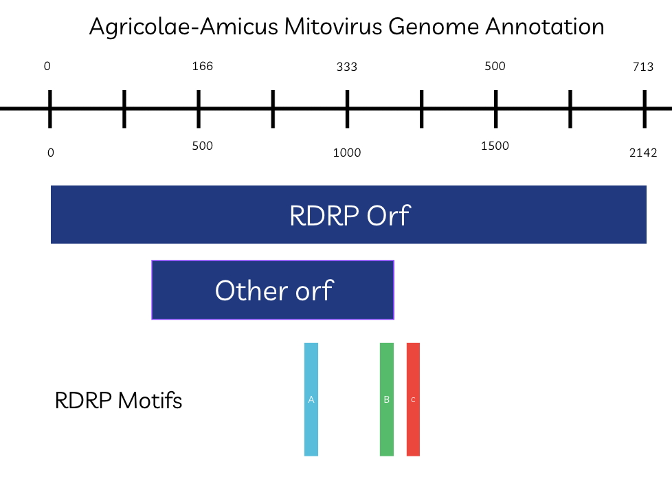

# Mild-ew-removing Mitovirus Discovery in Golovinomyces Cichoracearum

written by: Joseph Duraisingh

### Agricolae-Amicus mitovirus

*The farmers friend- named after the fact that it protects crops*


## Abstract

Powdery mildew fungi are widespread plant pathogens that impose significant agricultural costs worldwide and are commonly controlled using chemical fungicides. However, fungal viruses have emerged as potential natural restrainers of fungal fitness, including cases where viral infection reduces host growth or virulence. Here, we report the discovery and characterization of a mitovirus associated with powdery mildew using large-scale analysis of public RNA sequencing data.

Using Serratus, a global platform for RNA virus discovery, we identified a conserved RNA-dependent RNA polymerase (RdRp) signal across three independent sequencing datasets which turned out to be derived from powdery mildew related samples. De novo assembly and homology-based searches recovered overlapping viral contigs encoding a single long open reading frame consistent with a mitovirus RdRp. The longest recovered sequence encodes a \~700–770 amino acid polymerase and contains the canonical RdRp motifs A, B, and the catalytic GDD motif, confirming viral identity. Structural prediction further supported classification as a mitovirus through recovery of the characteristic RdRp right-hand fold.

Ecological analysis of the dataset from a sequenced plant supporting a fungal rather than plant host. Notably, the virus was detected in mycelial samples but not in haustorial samples at the sensitivity of available screens. Because haustoria are specialized fungal structures critical for host invasion, this apparent tissue bias is consistent with, though not proof of, a hypovirulent effect.

Together, these findings describe a mitovirus associated with powdery mildew and provide low to moderate confidence evidence that fungal viral infection may influence pathogen fitness. This work highlights the power of public sequencing data to uncover hidden components of plant–fungal–virus systems and motivates future experimental investigation into mitoviruses as potential biological modulators of crop disease.

{[Shark Tank Pitch](https://drive.google.com/file/d/1WD4H4Bw862KrDijr2OX4-FSSOuZir3EO/view?usp=sharing)}

## Results

**Detecting the virus**

The Agricolae-Amicus mitovirus (abbreviated as AgAm), was first discovered using the Serratus discovery tool. Serratus detected the presence of a virus with the same signature (palmid: u235770) in three reads: - SRR4048995 - SRR4048999 - SRR6516156 The amino acid sequence of this palmid was HSLDLKAATDRMPINFQQRVLSLIVGGELASV*KSILVDYPFRSDSTSVKYEVGQPMGAYSS*PAMALTHHVIVRIAARRLGINNFKNYCILGDDIVI for both SRR4048995 and SRR4048999 and ELASV*KSILVDYPFRSDSTSVKYEVGQPMGAYSS*PAMALTHHVIVRIAARRLGINNFKNYCILGDDIVI for SRR6516156. This could either be a mistake of loss of data (and have it's supposed to be the same), or that the tool extracted slightly different length sequences and considered them the same due to the second palmid being an exact subset of the first one.

SRR4048995 and SRR4048999 are transcriptomic runs from a dataset for a study of golovinomyces cichoracearum, which is a subspecies of powdery mildew, a fungus that infects plants with a powder-like residue on the leaves [Wu et al. 2018]. This was sequenced at University of Maryland with Illumina HiSeq 1500 in 2018. Interestingly out of 10 SRR runs for this species in this experiment, only the two runs of mycelia samples contained the virus, while the eight samples for haustoria did not detect traces of the virus.

SRR6516156 is a transcriptomic run of a Nicotiana undulata sample (tobacco plant) from a dataset exploring phylogenetic relationships in Nicotiana speciecs. This species is found in Australia and the sequencing was done at the Kunming Institue of Zoology in 2019. The most plausible explanation is that this plant sample was infected by a fungal infection that carried the signature of the virus into the sequencing sample.

Hypothesis: Based on the datasets that the host was found, it is likely that the virus is a mycovirus that infects the golovinomyces cichoracearum, which the fungus then in turn infects plants such as the tobacco plant.

**Identifying the type of virus**

Once the virus was detected the questions arise of what it is and what it does.

The palmprint was compared to similar organisms using tblastn. With the palmprint as the input the top hits for viruses with related genomes were Guiyang mito-like virus 4 and 6 (e value 2e-38 and 5e-31 respectively), Mitoviridae sp. (e value 1e-29) and araluen mito-like virus(e value 2e-28). This means that the virus contains a palm print that is a sequence closely resembling these other viruses, giving the first clue of its mitovirus like behavior.

To check that there was validity in the palmprints, we compared the palmprint and contigs to the sequencing data of SRR4048995. Raw paired-end Illumina RNA-seq reads were retrieved from the SRA using the SRA Toolkit (prefetch, fasterq-dump), producing compressed FASTQ files for each run. Reads were mapped back to candidate viral contigs using minimap2 in short-read mode, generating SAM alignment files that were converted to sorted and indexed BAM files with samtools. Read depth across contigs was computed using samtools depth to verify viral expression, assess coverage uniformity, and confirm that assembled contigs were supported by the underlying sequencing data. This digging into the sequencing data gave us a coverage of 70 to 130 times for the target contig which shows high confidence that this sequence actually exists in the dataset.

Using a pipeline with the help of ai, we then were able to extract out the RDRP shape. Contigs from the index dataset (SRR4048995) were first formatted as a nucleotide BLAST database using makeblastdb. An initial blastn search was performed using a Serratus-derived viral query sequence to recover contigs with any detectable similarity to the virus. Although nucleotide-level similarity is expected to be low for divergent RNA viruses, this step served to reduce the full assembly to a small set of candidate contigs.

Contig identifiers corresponding to BLAST hits were extracted and used to retrieve the matching sequences from the assembly with seqtk. These candidate contigs were combined with reference RdRp sequences and aligned using MAFFT to assess conservation and identify regions consistent with viral polymerase structure. Visual inspection of the alignment confirmed the presence of conserved RdRp features in a subset of contigs.

To validate and extend this analysis in a sepearate dataset (SRR6516156), assembled contigs were searched using a translated BLAST approach (tblastn) with a short RdRp palmprint peptide query. Protein-level searches were used at this stage because RdRp amino acid motifs are substantially more conserved than nucleotide sequence across divergent viruses. This search recovered contigs containing high-identity matches to known mitovirus RdRps, including conserved catalytic regions. These contigs were retained for downstream ORF prediction, motif annotation, and structural analysis.

By choosing the longest contigs that related to our palmprint we could essentially find the most full rdrp containing contig per dataset. Each of the three datasets was run through ORF finder to see which had the largest most preserved open reading frame.

This left us with 'hit contigs' for full rdrps.

SRR4048999 had its longest open reading frame start outside of the contig, while SRR404995 had an ORF of length 713 amino acids which contained rdrp properties: MNATKENFDIILRTIEWVGSTYFSDLPLALRRENAARFFKQYSRCHSRGKAFTAALFKSQRLALTRYIAG SPIPIAGIRQDSNLLPRIITRGLRESIVNGNHLSIRYALTLLGMGRMIMGGKPVDLSPISEEWKGRDPIS DYELRHFWKRLGKPTLQGESGSFHWTLKSGPNGPALFYSLVDLEVIIHKPALKQALAYWFDPESREIFQD WLDNFYERIPSLIKVLKLKYPKKLKLRKLSIKQDRESKMRVFAILDWWSQSALKGLHHNLYKLLSKLPSD CTFDQGKHLHQMASLKTNSKFYSFDLSNATDRFPLILQKRLLTMLVGSEAAAHWETIMVSEGFSYQGKTY FYKTGQPMGAHSSWPLFALTHHAVVHAAALRCNIPKFDDYCILGDDVVIYHDEVASQYRRLMSDLGVEIS PSKTHESPHTFEFAKRWFHHGQEISPYPLAGLLEVTKSWPLLVEFLGHQVPMKGYRSLQDFGDPVFSELL QLMPSEGKRQSDAFLKRMKIVSAFPNWWLDDIRDPDKDLSSHLERLYRAADLEPPKGDPRLWLDWFTKQS YSKIRSLVSEQGAVSTRNAMKWRNALYDIEGDSEADQTSTLSSEWIRIVPPLYVIRSMALKSQVKLDLSG FSLEPIVFWSSWRNLEMMFLPRLNGIFPARKRDGMSKAQSYLALEILKKYGPATPDTFNEDAGFDEYSDH LRSQWPMTFGLPF

The highest tblastn pair for this was Plasmopara viticola lesion associated mitovirus 21 (e value 0, identity 57.88%)

While SRR6516156 had an ORF of length 768 with this sequence: MYQKVLRICGRFIMFYKNRFFQNLFASVQRIPSISWRSMFEHARQLKGLLLRVPTVASLVMTREIALAAV HFVRSVLKLARKSGLLFTALYLKHCAVALQRFYAGSFKATDSQSVSVSLTRSGIPRIIPSVLRPHIRRRD DHGDMLVRIYLSWFSLAKLVELAPKIRKATFTSITTPSQDIGRILEVLDEIKVSFKVLQPLYLPNLSHHP LFKGILWEPTWKSTPLSFHYISRYFELTDMERKFLPFENIFFNLKAELAGFMWNICKIHSIPDGYFSPAM LWHQAVLYPLDVSGTRRILMEDLDRFEAGAGPQLASTMQIYSHVPLMTGRIAQQIEGGGKRRLFAICNYV KQQLLRPVHNWAMSVLKTLKSDGTFNQELPLQRLKIKQYEELYSFDLKSATDRWPLSVIYTVQMMIWGDT FASSVVNSSLGLNTFRVGKPLTKKEYEVAFLAGQPLGYLGSWSLFALSHHYLVWLAAFRVDPGRKEPFWD YALLGDDILIANSQVAQEYSKLLERLGVTISINKSIISRNGSLEFAKRFWTKKMQIDLSPISLRSLLGIK SLIGVAQIGAKYGLKMSALQRLAGAGYRVRARLMTTQSKRWERLKALFGKPHSSHRLPLEWWIGRGCPLN PYLKGRMVDYLRRELKPKEIQLFPEGLVLDGEREILERTVLIRWMKQWLSWVSWYHTVAWSPDVTLDQLM DAPVCATSWKRTQRDQNLVKFGLSFKLYDMGGSFDWSSVRVIESQPIPFSRWIYGGFTGCDFIMAPLD

When run in tblastn its closest match was Petunia exserta mitovirus 1 (e value 0, identity 73%) which compliments the mitovirus theory.

These different rdrps have some strong overlapping motifs, but differences in terms of their overall sequence. This suggests that the palmprint of the viruses are of similar phylogeny but not identical strains. Another thing to consider is that these were the cleanest rdrp sequences but might not directly the same virus. This part confused me a bit because the same virus should in theory be in both samples if they have equivalent palmids.This methodolgy could have been flawed because perhaps the best hit for a full rdrp sample was different from the actual sequence that belonged to this palmprint. Regardless there is very strong evidence that the rdrp sequences indeed belong to a mitovirus, of very close relations.

Hypothesis: Based on the above, it is very likely the virus is a mitovirus and thus sharing many characteristics of that family. Its open reading frame encodes for an rdrp.

**Interaction with the host**

Under the assumption that the virus is a mitovirus, and based on where it is found, we know that it is likely to infect the mitochondria of a specific type of powdery mildew. The detection in the tobacco plant is very likely to be a contamination of the plant by a fungus, as mitoviruses do not infect plants directly.

This creates an intersting dynamic with the plants as mitoviruses can often times (though importantly not always) cause hypovirulence, or the reduction in effectiveness of the fungus due to infection of the virus. There are many factors that determine if this is true or not, but the generally proposed mechanism is that since the mitovirus compete for energy and interact negatively with the mitochondria of the fungus, the energy production of the fungus is lowered and the fungus grows less and spreads with less effectiveness. Interestingly the study that proved this shows that this can be transmitted from strain to strain, which allows for a transmissible reducer of fungal infection [Xu et al. 2015]. With this knowledge of the interaction between virus and fungus and the interaction of the fungus to plants, we can predict that strains with the virus will do less damage to plants, and thus being a benefit to the agriculutre industry.

Another thing to notice is that lack of precense in the haustoria sample and presence in the mycelia sample. Haustoria are a more critical part of the fungus, relating to the pathogenic nature of the fungus [Elsevier]. This could mean that either the mitovirus does not affect it due to difference in biology, or more excitingly that the virus reduces viability of the haustoria and thus there is no detection of the sequencing data. This is speculative and would need wet lab testing verification.

Hypothesis: Based on the above, it is moderately likely that the virus reduces the viability of the the powdery mildew it infects, which by extension reduces the damage done to plants by the fungus.

### Virus Genome



Since this is a mitovirus, it's genome is the entire RdRp

2142 nt long genome

713 aa long genome

Projected rdrp motif boundaries (Amino Acids):

A: 305-311

B: 355-366

C: 394-396

## Discussion

I will talk a little bit of the potential positive economic impact of the virus. As mentioned before as a mitovirus it produces an rdrp that takes away energy from the powdery mildew. Powdery mildew at the full scale of agriculture can have devastating economic impacts as if unchecked it can affect up to 30% of a crop, either through making the plants generate smaller or less fruits and vegetables, or making the plants unfit for sales [Kendon]. One estimate is that worldwide economic losses of 6.3 billion USD are due to powdery mildew [Gan et al. 2025]. Even at conservative estimates of our virus being compatible with 5% of species of powdery mildew and reducing viability of the fungus by 10%, this would bring the total impact to 30 million USD of food saved per year if this virus was spread through the fungal population.

## References

Serratus:

Edgar, R. C., Taylor, B., Lin, V., Altman, T., Barbera, P., Meleshko, D., Lohr, D., Novakovsky, G., Buchfink, B., Al-Shayeb, B., Banfield, J. F., de la Peña, M., Korobeynikov, A., Chikhi, R., Babaian, A., … & Others. (2022). Petabase-scale sequence alignment catalyses viral discovery. *Nature, 602*(7895), 142–147. [https://doi.org/10.1038/s41586-021-04332-2](#0)

Source of data Powdery Mildew:

Wu, Y., Ma, X., Pan, Z., Kale, S. D., Song, Y., King, H., Zhang, Q., Presley, C., Deng, X., Wei, C. I., & Xiao, S. (2018). *Comparative genome analyses reveal sequence features reflecting distinct modes of host-adaptation between dicot and monocot powdery mildew*. **BMC Genomics, 19**, 705. <https://doi.org/10.1186/s12864-018-5069-z>

Source of data Nicotiana:

Kunming Institute of Zoology, Chinese Academy of Sciences. (2018). *Sixteen Nicotiana species raw sequence reads*(BioProject No. PRJNA431533). National Center for Biotechnology Information, National Library of Medicine. <https://www.ncbi.nlm.nih.gov/bioproject/PRJNA431533>

Hypovirulence example:

Xu, Z., Wu, S., Liu, L., Cheng, J., Fu, Y., Jiang, D., & Xie, J. (2015). *A mitovirus related to plant mitochondrial gene confers hypovirulence on the phytopathogenic fungus Sclerotinia sclerotiorum*. **Virus Research, 197**, 127–136. <https://doi.org/10.1016/j.virusres.2014.12.023>

BLAST algorithms:

Altschul SF, Gish W, Miller W, Myers EW, Lipman DJ. Basic local alignment search tool. Journal of Molecular Biology. 1990;215(3):403–410. PMID: 2231712

Alphafold:

Jumper, J., Evans, R., Pritzel, A., Green, T., Figurnov, M., Ronneberger, O., Tunyasuvunakool, K., Bates, R., Žídek, A., Potapenko, A., Bridgland, A., Meyer, C., Kohl, S. A. A., Ballard, A. J., Cowie, A., Romera-Paredes, B., Nikolov, S., Jain, R., Adler, J., … Hassabis, D. (2021). Highly accurate protein structure prediction with AlphaFold. *Nature, 596*(7873), 583–589. <https://doi.org/10.1038/s41586-021-03819-2>

Seqtk:

Li, H. (2013). *seqtk: Toolkit for processing sequences in FASTA/Q formats* [Computer software]. <https://github.com/lh3/seqtk>

Orf finder:

National Center for Biotechnology Information. *ORFfinder* [Web tool]. National Library of Medicine, National Institutes of Health. Retrieved December 12, 2025, from [https://www.ncbi.nlm.nih.gov/orffinder/](#0)

MAFFT:

Katoh, K., & Standley, D. M. (2013). MAFFT multiple sequence alignment software version 7: Improvements in performance and usability. *Molecular Biology and Evolution, 30*(4), 772–780. <https://doi.org/10.1093/molbev/mst010>

Powdery Mildew impact:

Kendon. *Understanding powdery mildew: Impact and management*. [https://www.kendon.com.au/understanding-powdery-mildew-impact-and-management/](#0)

Gan, C.-M., Tang, T., Zhang, Z.-Y., Li, M., Zhao, X.-Q., Li, S.-Y., Yan, Y.-W., Chen, M.-X., & Zhou, X. (2025). *Unraveling the intricacies of powdery mildew: Insights into colonization, plant defense mechanisms, and future strategies*. *International Journal of Molecular Sciences, 26*(8), 3513. <https://doi.org/10.3390/ijms26083513>

Fungus anatomy:

Elsevier. *Fungal structures*. In *Immunology and microbiology*. [https://www.sciencedirect.com/topics/immunology-and-microbiology/fungal-structures](#0)

Chatgpt5.1:

OpenAI. (2025). *ChatGPT* (GPT-5.1) [Large language model]. <https://chat.openai.com/>

## 

# Viral Short Story

```         
Francis was used to working late, but this was rough. As he was pipettingSample 31337, the glare of the rising sun blinded him, and instinctively his griptightened. A single drop of the sample fell past his bench unnoticed, soakinginto his Converse.

This was the beginning, but the significance of this day would not be feltuntil months later, and by then it was too late. Everything changed…

In the old Indoamerican tales of the Dawn Laboratories, they speak of tiny spirits riding inside the white dust of sickness — the powdered mildew that travels like ghost-snow across the leaves of living things. For generations, these spirits were nameless. But on 2018-06-01, the day the machines awoke, the truth was finally heard.

Francis placed the corrupted sample into the great metal oracle, the Illumina HiSeq 1500, whose chambers hummed like a sleeping jaguar. Its lenses opened, revealing runes of light that only the trained could read. When its vision finally sharpened, five revelations emerged.

The oracle showed that the mildew host was Golovinomyces cichoracearum, but inside it lived a smaller wanderer — a hidden RNA virus riding within the fungus, unnoticed by humans.It revealed that its genome was assembled using high-depth transcriptomic sequencing, drawn from both mycelia and haustoria.It declared that only a tiny subset of fungal cells carried the viral passenger, as if chosen by fate.It warned that the virus subtly altered the vigor of the mildew, making some infections harsher, others strangely weak.And finally, it whispered that the University of Maryland had uncovered a lineage older than the crops it haunted, a relic threaded through time.

When Francis read the final sequence, he understood: the drop that touched his shoe had chosen him. And from that moment forward, the spirits of mildew would never again be silent.
```
