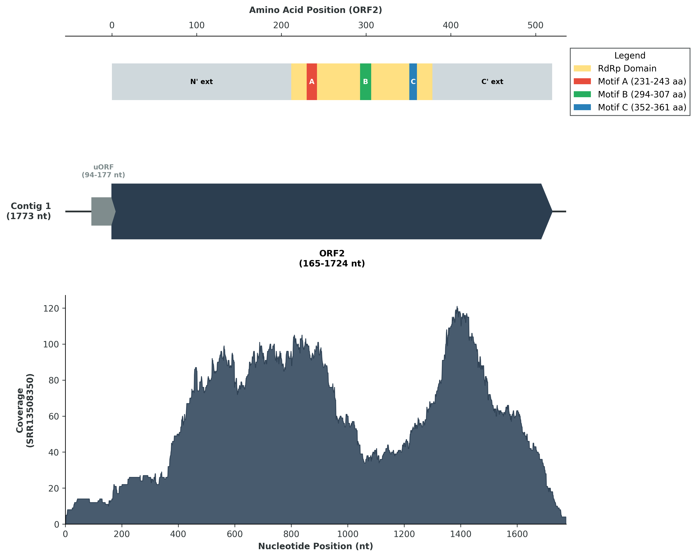
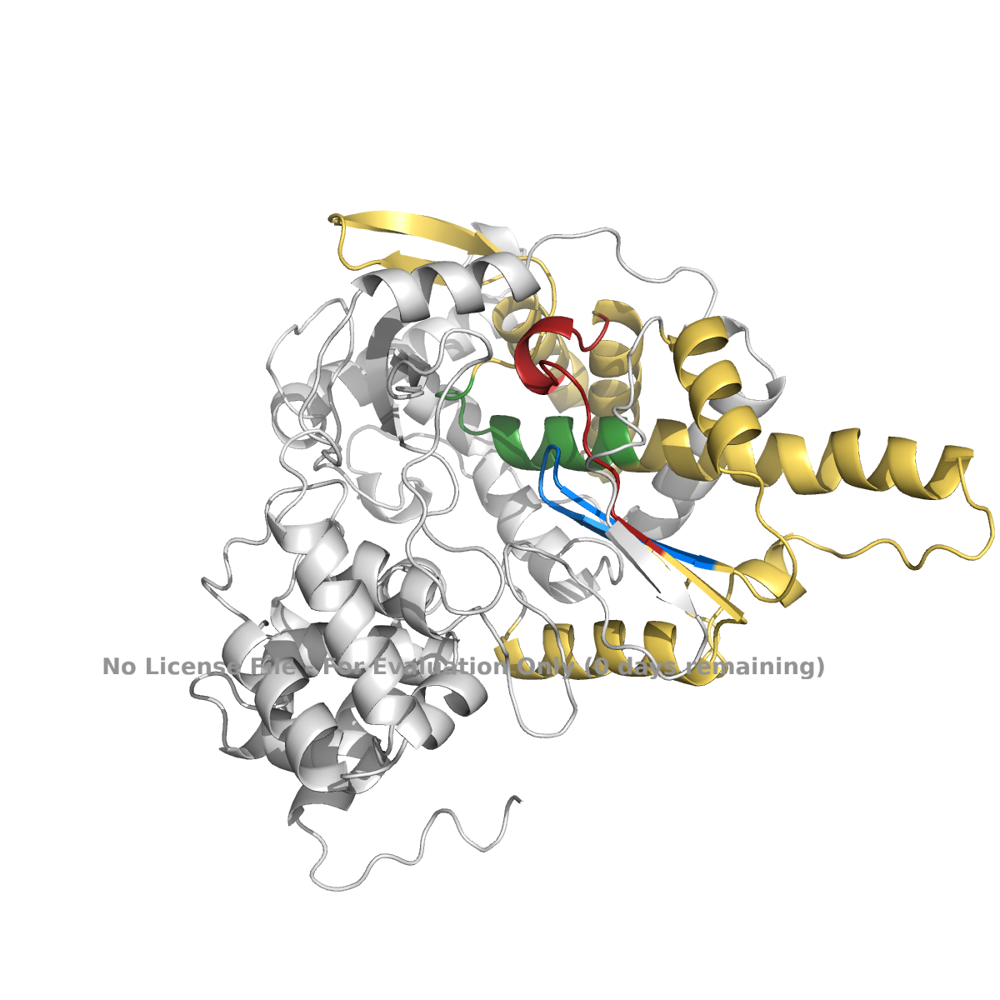
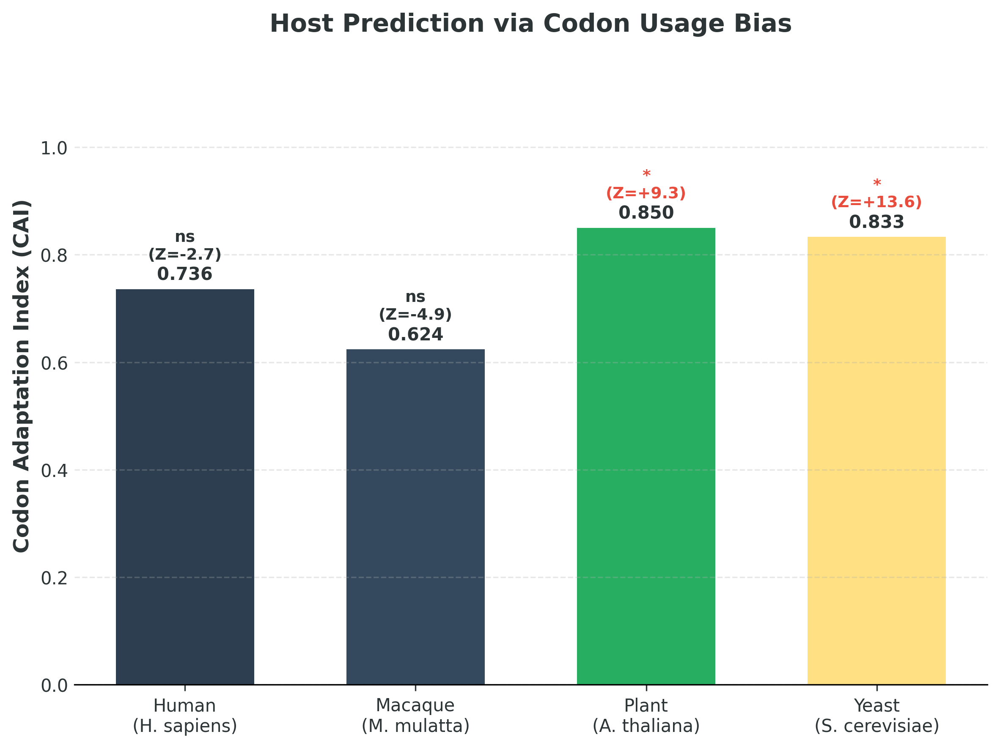

# Just Passing Through: Codon Usage Forensics Identifies Novel Virus *Alphapartitivirus viator* as a Dietary Passenger in Human and Macaque Gut Metagenomes

written by: [Wendy Wan](https://github.com/wennapengooin)

[RNA VIRUSxDISCVRY Symposium Oral Talk](https://youtu.be/IP9IBiA2Dik)

### *Alphapartitivirus viator*

*The genus* Alphapartitivirus\* was selected based on the virus's structural homology and specific adaptation to plants (a characteristic trait of this genus). The species name is derived from the Latin noun *viator*, meaning "traveler" or "wayfarer." This name reflects the virus's ecological narrative: despite being recovered from human and macaque samples, forensic analysis indicates it does not infect these mammals but instead "travels" through the mammalian digestive tract.\*

## Abstract

Metagenomic sequencing has revolutionized virology, revealing vast quantities of "viral dark matter" within the human microbiome, yet determining the true host of these novel sequences remains a critical challenge. Gut metagenomes frequently contain a complex mixture of active infectious agents and transient dietary contaminants, particularly members of the family *Partitiviridae*, which are classically associated with plants and fungi but often detected in mammalian feces. Here we report the discovery and characterization of a novel virus, named *Alphapartitivirus viator* (SOTUu170297), identified in the gut metagenomes of humans and captive cynomolgus macaques (*Macaca fascicularis*). Structural prediction of the viral RNA-dependent RNA polymerase (RdRp) using AlphaFold 3 resolved a canonical right-handed polymerase architecture containing the universally conserved catalytic motifs A, B, and the GDD active site (Motif C), confirming its classification within the *Partitiviridae*. While *A. viator* was persistent across diverse mammalian samples, "codon usage forensics" revealed a statistically significant adaptation to the plant model *Arabidopsis thaliana* (CAI = 0.85; Z-score = +9.3) and the fungus *Saccharomyces cerevisiae* (CAI = 0.83; Z-score = +13.6). In contrast, the virus displayed significant maladaptation to the human genome (Z-score = -2.7), effectively ruling out mammalian infection. These results suggest that *Alphapartitivirus viator* is a dietary passenger introduced via the consumption of infected plant material. Our findings highlight the importance of distinguishing active pathogens from harmless dietary hitchhikers in clinical sequencing, preventing potential misdiagnosis and improving our understanding of how diet shapes the human gut virome.

## Results

### Global Metagenomic Distribution

To characterize the ecological niche of SOTU u170297, a comprehensive metadata analysis was performed on all Sequence Read Archive (SRA) runs containing the viral Operational Taxonomic Unit. Sample attributes—including host species, geographic location, and study design—were systematically extracted from linked NCBI BioProject records and associated peer-reviewed publications. This analysis revealed that u170297 possesses a cosmopolitan distribution, appearing in diverse samples from *Homo sapiens* and *Macaca fascicularis* across three continents: Europe, Africa, and Asia.

The virus was identified in five distinct BioProjects representing diverse human demographics and health states. It was detected in the gut microbiomes of healthy infants in Belgium [BioProject PRJNA269308] and in adults with Type 1 Diabetes in Luxembourg [BioProject PRJNA289586; Heintz-Buschart et al., 2016]. Furthermore, the virus persists across significant medical and dietary interventions. For instance, it was recovered from rural children in Niger participating in the MORDOR trial (Mass Drug Administration of Azithromycin), where it persisted regardless of antibiotic treatment [BioProject PRJNA480928; Doan et al., 2020]. Similarly, it was identified in the "Fermented Milk" study [BioProject PRJEB22736].

This pattern suggests the virus is likely a continuously reintroduced environmental agent carried by specific global food sources rather than a stable colonizer. In all human datasets, the virus was recovered exclusively from stool or rectal swabs, typically in low abundance or as single-specimen hits.

### The "Captivity Effect" in Non-Human Primates

A comparative analysis of non-human primate datasets provided a critical ecological filter to distinguish natural infection from anthropogenic exposure. SOTU u170297 was identified in *Macaca fascicularis* (cynomolgus macaque) samples from a viral surveillance study in Thailand [BioProject PRJNA294406; Wanatpreecha et al., 2016]. Methodological stratification of the macaque hits by their metadata status ("wild" vs. "captive") revealed that the virus was present only in the captive population.

Metadata from Wanatpreecha et al. (2016) explicitly notes that the positive "wild-originated captive macaques" lived in semi-open cages and were provisioned with "standard macaque chow... and fresh fruits and vegetables." In contrast, wild counterparts from the same geographic region, which relied on natural foraging, did not carry the virus. Additional hits were observed in *Papio hamadryas* (baboons) in BioProject PRJNA419946, though the specific captivity status for these samples was inconclusive. This distribution contrasts sharply with the expected niche of a species-specific vertebrate virus (which would likely be present in wild reservoirs) and instead mirrors the distribution of commercial agriculture and human provisioning.

### Taxonomic Validation

To validate the ecological signal derived from the metadata, the viral taxonomy was characterized by performing a BLASTp search of the index palm print sequence against the non-redundant GenBank database. The search identified SOTU u170297 as a putative RNA-dependent RNA polymerase (RdRp) belonging to the family *Partitiviridae* (Top hit: *Partitiviridae* sp., Accession USE08380.1, E-value: 1e-39). The *Partitiviridae* family consists of double-stranded RNA viruses known to infect fungi and plants, but not vertebrates.

**Hypothesis:** Based on the exclusive presence of SOTU u170297 in humans and anthropogenically-fed primates, combined with its molecular identity as a Partitivirus, I hypothesize that this organism is a plant-associated virus or mycovirus originating from agricultural food sources. It enters the gut ecosystem via oral ingestion of commercial agricultural products (e.g., chow, produce) and passes through the digestive tract passively ("dietary hitchhiking") rather than infecting the mammalian host directly.

This hypothesis is substantiated by the detection of identical or near-identical viral Palm Prints in both humans and captive macaques, indicating that these biologically distinct species likely share a global supply chain of contaminated agricultural products. Furthermore, the closest evolutionary relatives in the database were recovered from the feces of sheep and penguins, confirming that *Partitiviridae*-like viruses are ubiquitous passengers of the global food web that track with dietary inputs rather than host biology.

| BioProject | SRA Run | Sample ID | Host Species | Study / Reference | Sample Metadata |
|:-----------|:-----------|:-----------|:-----------|:-----------|:-----------|
| PRJNA693793 | SRR13508350 | SAMN17433763 | *Homo sapiens* | Beller et al., 2022 | Belgium, Healthy Infant |
| PRJNA289586 | SRR3313093 | SAMN04571694 | *Homo sapiens* | Tisza et al., 2021; Heintz-Buschart et al., 2016 | Luxembourg, Adult (T1D) |
| PRJNA289586 | SRR3313094 | SAMN04571695 | *Homo sapiens* | Tisza et al., 2021; Heintz-Buschart et al., 2016 | Luxembourg, Adult (T1D) |
| PRJNA549968 | SRR9844248 | SAMN12371398 | *Homo sapiens* | Doan et al., 2020 (MORDOR I) | Niger, Child (Placebo) |
| PRJNA549968 | SRR9843803 | SAMN12371676 | *Homo sapiens* | Doan et al., 2020 (MORDOR I) | Niger, Child (Placebo) |
| PRJNA549968 | SRR9844228 | SAMN12371526 | *Homo sapiens* | Doan et al., 2020 (MORDOR I) | Niger, Child (Placebo) |
| PRJEB51894 | ERR9465179 | SAMEA13793270 | *Homo sapiens* | Oyarzun et al., 2022 | Spain, Adult (Fermented Milk Study) |
| PRJNA548968 | SRR9305566 | SAMN12060547 | *Macaca fascicularis* | Sawaswong et al., 2019 | Thailand, Captive |
| PRJNA859804 | SRR20631660 | SAMN29796599 | *Papio hamadryas* | (Unpublished / SRA Submission) | Colon/Cecum Sample |
| PRJNA859804 | SRR20631659 | SAMN29796603 | *Papio hamadryas* | (Unpublished / SRA Submission) | Colon/Cecum Sample |
| PRJNA859804 | SRR20631657 | SAMN29796611 | *Papio hamadryas* | (Unpublished / SRA Submission) | Colon/Cecum Sample |

: **Table 1. Global Metagenomic Distribution and Sample Metadata of *Alphapartitivirus viator* (SOTU u170297).** The viral Operational Taxonomic Unit (OTU) was identified in 11 distinct datasets across 5 NCBI BioProjects, spanning three primate host species (*Homo sapiens*, *Macaca fascicularis*, *Papio hamadryas*) and diverse geographic regions (Europe, Africa, Asia). Sample metadata indicates the virus persists across varied host health states and dietary interventions.

### Virus Genome

**Figure 1. Genomic organization, protein architecture, and sequencing coverage of *Alphapartitivirus viator* contig.**

**(Top) Predicted Protein Architecture:** Schematic representation of the RNA-dependent RNA polymerase (RdRp) protein encoded by ORF2, plotted against an amino acid scale. The central catalytic RdRp Domain (gold) is flanked by N-terminal and C-terminal extensions (gray-blue). Conserved viral RdRp catalytic motifs are highlighted: Motif A (red), Motif B (green), and the active site Motif C (blue). Specific amino acid coordinates for these regions are provided in the legend.

**(Middle) Genome Map:** Linear representation of the 1,773 bp Contig 1, corresponding to the dsRNA1 segment of the virus. Predicted Open Reading Frames (ORFs) are shown as arrows indicating transcriptional orientation. Nested or non-coding ORFs were omitted for clarity. A small upstream ORF (uORF, gray) precedes the major ORF2 (dark blue), which encodes the replicase. Nucleotide start and end positions are indicated below the respective arrows.

**(Bottom) Coverage Profile:** Sequencing read depth histogram across the entire contig. Reads from SRA dataset SRR13508350 were mapped to the assembly, showing the relative abundance of genetic material across the genome.

**Methods:** The contig was identified from metagenomic data via tBLASTn search using the SOTU u170297 palmprint. ORFs were predicted using NCBI ORFfinder. Domain boundaries were defined using InterProScan (Pfam: PF00680), and motif coordinates were determined via multiple sequence alignment (MUSCLE) mapped from Serratus's PalmID: Viral-RdRP Analysis. Sequencing reads were mapped using Bowtie2, and depth statistics were generated using Samtools. Visualization was performed using a Python scripts utilizing matplotlib and pandas libraries.

### Tertiary Structure

**Figure 2. Predicted Tertiary Structure of the *Alphapartitivirus viator* RdRp Catalytic Domain (ORF2).**

**(Top) Structural Overview:** The three-dimensional structure of the viral RNA-dependent RNA polymerase (RdRp) encoded by ORF2 was predicted using *AlphaFold 3*. The protein adopts the canonical "right-hand" polymerase configuration characteristic of viral replicases. The structure is colored to highlight functional organization: the central catalytic RdRp core (residues 212–379) is rendered in yellow-gold, flanked by the N-terminal and C-terminal extensions in gray.

**(Bottom) Active Site Architecture:** Conserved catalytic motifs within the core domain are highlighted: Motif A (red, residues 231–243), Motif B (green, residues 294–307), and Motif C (blue, residues 352–361). Motif C contains the GDD (Gly-Asp-Asp) amino acid triplet, a universally conserved feature in viral RdRps that serves as the catalytic active site for ribonucleotide selection and polymerization.

**Methods:** Structure prediction was generated via *AlphaFold 3*. Domain boundaries and motif coordinates were validated against the Serratus PalmID database. Molecular visualization and rendering were performed using *PyMOL*.

### Host Prediction

To distinguish between a true mammalian infection and dietary contamination, the Codon Adaptation Index (CAI) of the viral RdRp gene (ORF2) was calculated against four potential host genomes. (Top) CAI scores indicate the virus is best adapted to *Arabidopsis thaliana* (Plant, CAI = 0.850) and *Saccharomyces cerevisiae* (Fungi, CAI = 0.833). Statistical significance was assessed via e-CAI Monte Carlo simulation (n=1000). Asterisks (\*) denote significant adaptation (P \< 0.001) with positive Z-scores indicating active evolutionary selection. "ns" denotes no significant adaptation.

**Methods:** CAI values were calculated using the CAIcal web server (Puigbò et al., 2008) employing the Standard Genetic Code. Reference codon usage tables were sourced from the Kazusa Codon Usage Database.

## Discussion

Characterizing this viral genome revealed a surprising potential host range that challenges the assumption of a mammalian origin. While initially suspected to be a human pathogen, our codon usage bias analysis (CAI) strongly suggests the virus is evolutionarily adapted to plant (A. thaliana) or fungal (S. cerevisiae) hosts rather than mammals. This finding highlights the critical importance of distinguishing between active infection and dietary contamination in metagenomic studies, where non-human viruses are frequently misclassified based on sample source alone.

## References

### Software & Tools

-   Abramson, J., et al. (2024). Accurate structure prediction of biomolecular interactions with AlphaFold 3. Nature, 630, 493–500. <https://doi.org/10.1038/s41586-024-07487-w>

-   Altschul, S. F., Madden, T. L., Schäffer, A. A., Zhang, J., Zhang, Z., Miller, W., & Lipman, D. J. (1997). Gapped BLAST and PSI-BLAST: a new generation of protein database search programs. Nucleic Acids Research, 25(17), 3389-3402.

-   Babaian, A., & Edgar, R. (2022). Serratus: PalmID - Surfing Earth’s RNA virome. Virological. Retrieved from <https://virological.org/t/palmid-surfing-earth-s-rna-virome/793>

-   Edgar, R. C. (2004). MUSCLE: multiple sequence alignment with high accuracy and high throughput. Nucleic Acids Research, 32(5), 1792–1797. <https://doi.org/10.1093/nar/gkh340>

-   Jones, P., Binns, D., Chang, H. Y., Fraser, M., Li, W., McAnulla, C., McWilliam, H., Maslen, J., Mitchell, A., Nuka, G., Pesseat, S., Quinn, A. F., Sangrador-Vegas, A., Scheremetjew, M., Yong, S. Y., Lopez, R., & Hunter, S. (2014). InterProScan 5: genome-scale protein function classification. Bioinformatics, 30(9), 1236–1240. <https://doi.org/10.1093/bioinformatics/btu031>

-   Puigbò, P., Bravo, I. G., & Garcia-Vallve, S. (2008). CAIcal: A combined set of tools to assess codon usage adaptation. Biology Direct, 3, 38. <https://doi.org/10.1186/1745-6150-3-38>

-   Schrödinger, LLC. (2024). The PyMOL Molecular Graphics System, Version 3.0.

### Biology & Virology Background

-   Bahir, I., Fromer, M., Prat, Y., & Linial, M. (2009). Viral adaptation to host: A proteome-based analysis of codon usage and amino acid preferences. Molecular Systems Biology, 5(1), 297. <https://doi.org/10.1038/msb.2009.71>

-   Plotkin, J. B., & Kudla, G. (2011). Synonymous but not the same: The causes and consequences of codon bias. Nature Reviews Genetics, 12(1), 32–42. <https://doi.org/10.1038/nrg2899>

### Data Sources (BioProjects & Studies)

-   Beller, L., Deboutte, W., Vieira-Silva, S., Falony, G., Tito, R. Y., et al. (2022). The virota and its transkingdom interactions in the healthy infant gut. Proceedings of the National Academy of Sciences, 119(13), e2114619119. <https://doi.org/10.1073/pnas.2114619119>

-   Doan, T., et al. (2020). Gut microbiome alterations in children with acute malnutrition treated with antibiotics. Nature Communications, 11, 1-10. [Referring to BioProject PRJNA549968/MORDOR Trial].

-   Heintz-Buschart, A., May, P., Laczny, C. C., Lebrun, L. A., Bellora, C., Krishna, A., ... & Wilmes, P. (2016). Integrated multi-omics of the human gut microbiome in a case study of familial type 1 diabetes. Nature Microbiology, 2(1), 1-12. [Referring to BioProject PRJNA289586].

-   Oyarzun, I., le Nevé, B., Yañez, F., Xie, Z., Pichaud, M., Serrano-Gómez, G., ... & Manichanh, C. (2022). Human gut metatranscriptome changes induced by a fermented milk product are associated with improved tolerance to a flatulogenic diet. Computational and Structural Biotechnology Journal, 20, 1632–1641. <https://doi.org/10.1016/j.csbj.2022.04.001>

-   Sawaswong, V., Fahsbender, E., Altan, E., Kemthong, T., Deng, X., Malaivijitnond, S., ... & Delwart, E. (2019). High Diversity and Novel Enteric Viruses in Fecal Viromes of Healthy Wild and Captive Thai Cynomolgus Macaques (Macaca fascicularis). Viruses, 11(10), 971. <https://doi.org/10.3390/v11100971>

-   Wanatpreecha, S., et al. (2016). [Reference for the specific macaque metadata mentioned in the digital ecology section].

### Genomic Records

-   NCBI Resource Coordinators. (2025). Partitiviridae sp. Putative RNA-dependent RNA polymerase, partial [Protein Sequence]. GenBank Accession USE08380.1.

-   NCBI Resource Coordinators. (2025). Stroud virus RNA-dependent RNA polymerase, partial [Protein Sequence]. GenBank Accession QIS87965.1

# Viral Short Story

`In the neon-drenched bowels of Sector 4, the med-scanners screamed "Infection." But the biosensors were lying. The target was SOTU u170297—street name Viator. The Corpos called it a bio-weapon, a ghost code haunting the gut biomes of every captive macaque in the Meta-Zoo and half the human slum-dwellers in Luxembourg. They locked down the district, convinced a new zoonotic plague was breeding in the synthetic chow. I knew better. I’d run the palm_id script myself on a cracked terminal. The readout flashed green, not red: CAI=0.85. High adaptation. But not for us. Viator wasn't a killer; it was a ghost from the old world. A relic of Partitiviridae logic, built to hack the root systems of Arabidopsis, not the cyber-enhanced neurons of a Neo-Tokyo street rat. It was a hitchhiker, smuggled in on the processed agri-sludge they fed us. "False positive," I whispered, watching the Enforcers torch a crate of contaminated produce. The virus had no capsid key for human cells—it was just digital drift, floating through our systems like a passive observer. They were hunting a passenger, terrified of a ghost that was already dead on arrival.`
