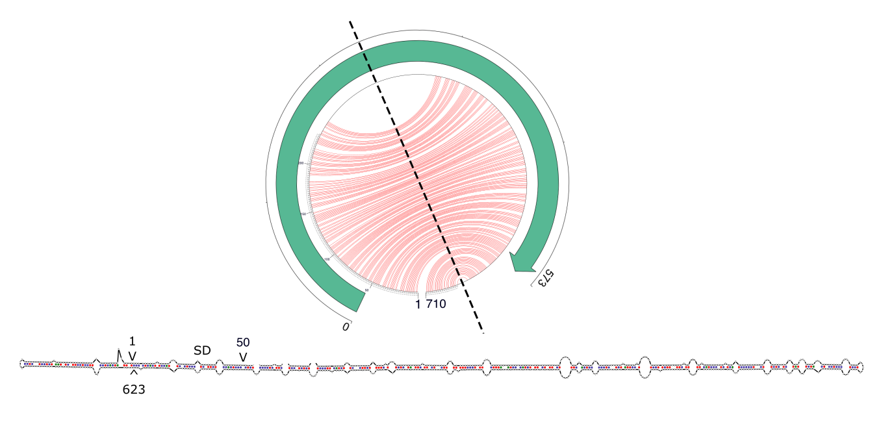
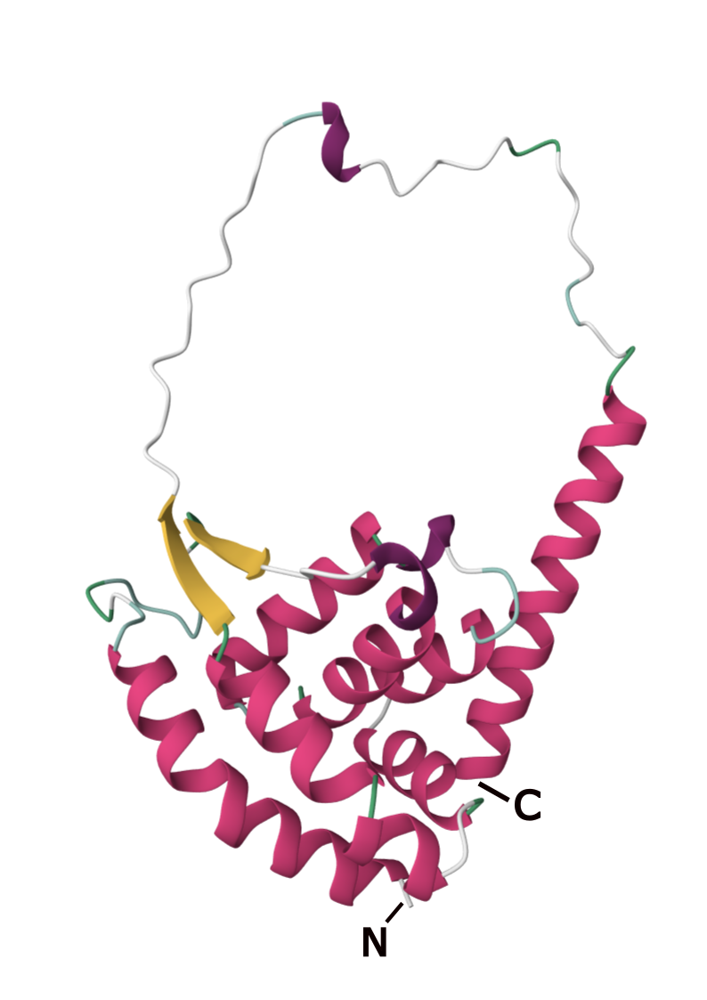

# Anas Amicus: Ducking into the "Exemplar" Obelisk
written by: [Izumi Ando](https://github.com/yourname *optional link*)

### Anas Amicus
*{Anas Amicus. "The friend of the duck" or "One who favors the duck". 
This was inspired by the fact that this Obelisk was initally only detected in 
runs from BioSamples taken from Anas (genus of dabbling ducks) and not in 
BioSamples of other birds or animals.}*

[Optional: Tutorial 2 Generative AI Cover-art](img/<virusname>/cover.png)

## Abstract

Viruses and virus-like agents are among the simplest and most effective models 
for understanding the ecological and genetic dynamics of infectious agents. 
Despite advances in metatranscriptomics and computational biology, the diversity 
and host-specificity of many viroids and viroid-like agents remain poorly 
characterized. Among these are Obelisks, a new group of RNA viruses discovered through 
utilization of large databases [Zheludev et al., 2024]. Here, we report the discovery 
and characterization of a novel Obelisk group, Anas Amicus, named for its 
association with Anas (dabbling ducks). Identified exclusively in metatranscriptomic 
datasets from cloacal and oropharyngeal swabs of Anas species in Australia, Anas 
Amicus exhibits a rod-like RNA secondary structure and encodes a single protein, 
Oblin-1, with predicted structural conservation across the cluster. Despite its 
apparent host specificity to Anas, high bacterial content in its associated datasets 
raises the possibility of a bacterial host.This study reveals Anas Amicus as an 
exemplar of Obelisk characteristics, with a genome length of 710 nt, 97% sequence 
identity among its cluster members, and a conserved secondary structure. 
Unlike previously characterized viroids, Anas Amicus lacks a poly-A tail and 
hammerhead ribozyme motifs, distinguishing it from other RNA-based entities. 
These findings refine our understanding of Obelisk diversity and open new 
avenues to explore their ecological niches.By integrating metatranscriptomic 
analyses, secondary structure prediction, and protein modeling, this study provides 
the first step toward elucidating the potential hosts and functional roles of 
Anas Amicus. Further investigation into its ecological and evolutionary context 
may uncover novel insights into host-pathogen interactions and RNA-based life forms.

## Results

### Digital Ecology

All three cases of this Obelisk were associated with metatranscriptomic RNA-seq runs (SRR8189300, SRR8189301, SRR7239366) taken from cloacal and/or oropharangeal swabs taken from members of the Anas, a genus of dabbling ducks, in Australia. There were two bioProjects (PRJNA505206 and PRJNA472212) associated with these runs. Both of these projects were associated with publications published by mostly the same authors, published one year after the other. These BioProjects and publications both aimed to characterize the viromes of birds using metatranscriptomics. However, their goals diverged in that one simply aimed to characterize the virome of four different avian species wheras the other used this as a means to understand host-virus interactions in two genuses of birds [Wille et al., 2018; Wille et al., 2019].

The associated BioProjects each have 9-11 unique BioSamples and a corresponding run. Of the runs that were not detected for this Obelisk, there were 2 other runs with BioSamples from Anas. The rest were runs from BioSamples taken from Chenonetta (another genus of dabbling ducks), Calidris (a genus of Arctic wading birds)

Non-trivially, a substantial percentage of the reads in each SRR run in the Obelisk cluster are categorized as bacterial (SRR8189300: 6.15%, SRR8189301: 14.36%, SRR7239366: 21.42%). Although the publications associated with these datasets assign the sample origin (birds) as the host for all detected viruses, I hypothesize that the host for this Obelisk could potentially be bacteria. An attempt was made to quantitatively assess this hypothesis as discussed in the following section (Question 3, Figures TODO).

### Virus Genome



**Figure 1. Genomic Characteristics of Anas Amicus**
A jupiter plot (diagram above) of SRR8189300's genome. The red lines represent the predicted base pairing, and the inner circle is marked by the nucleotide index of the whole genome (710 nt long). The green arrow represents the range of the open reading frame (ORF) starting at position 50, stretching across 573 nucleotides or 190 amino acids. The dotted line represents the axis of folding as the predicted secondary structure of the Obelisk is rod-like, as can be observed by the jupiter plot as well as the secondary structure representation below. The secondary structure is annotated with key positions: the starting point (1), the AG-rich Shine-Dalgarno-like region (SD), the start position of the ORF (50), and the end position of the ORF (623). From this we notice that there is a slight overhang in the terminal end of the protein encoding region when it folds on itself in the RNA secondary structure. There is no evidence of a poly-A tail on this RNA genome. Additionally, based on this predicted secondary structure, we note that this Obelisk is not part of the hammerhead ribozyme subset of Obelisks. The other Obelisks (SRR8189301 and SRR7239366) in the cluster are omitted in this figure as their secondary structures were visually indistinguishable to SRR8189300 with nucleotide sequence identity of 97% when aligned. The RNA secondary structure prediction was done using mFold [Zuker, 2003].


### Predicted Structure



**Figure 2. 3D structure of Anas Amicus's Oblin protein Predicted by AlphaFold**
This is the predicted structure of the open reading frame of the Obelisk's RNA sequence from SRR8189300, generated by AlphaFold. There are 7 alpha helices present in this structure (pink), with a small beta sheet (yellow), and a unstructured region between the beta sheet and the alpha helix with the C terminus which are all conserved from the Oblin-1 protein reported in [Zheludev et al., 2024]. The N and C termini are as indicated. The predicted LDDT was above 80 for all regions with the exception of the unstructured regions which is expected.

### Seedling for a potential side project...

```
IDEA:
Could we search for more Obelisks OR find previously characterized Oblin 
proteins by doing a programatic search for every possible nucleotide / protein 
sequence combination for the Oblin protein?

KEY:
Limit the search space based on the following:
- knowledge on the max length of a Obelisk (~1kbp)
- knowledge that the Oblin encoding region is complementary to itself
- other biological knowledge that would help us systematically remove certain 
codon combinations

INSPIRATION:
In Dr. Zheludev's talk, he excitedly emphasized that an interesting 
characteristic of the Obelisks studied thus far is that the Oblin encoding 
region is complementary to itself, with the rod axis running through the 
middle of the protein encoding sequence. My first thought when I heard this was 
that this too perfect of a characteristic not to exploit computationally, 
especially given that Obelisks are small to begin with.
(Slide 74 from Dr. Zheludev's talk on Nov 25th attached below.)

WORK SO FAR:
- Approach 1: Create an algorithm for perfect and introduce perturbations
>pseudocode for an algorithm to generate all possible Oblin encoding sequences
https://www.overleaf.com/read/ghdyssbptvgq#f5dc2d

- Approach 2: Train a machine learning model to compute all possible Oblin encoding sequences
> idea for a pipeline
1) find all ORF regions of known Obelisks
2) find all secondary structure predictions of whole Obelisks
3) extract the secondary structures of ORF from 2)
4) train a machine learning model to learn the secondary structure patterns 
(the "consensus" secondary structure)
5) compute all possible sequences based on 4)

NEXT STEPS:
- Get feedback on the points below
- Improve the algorithm
- Implement the code
- Try doing the search on a large scale on databases

POINTS I WOULD LIKE FEEDBACK ON:
- What biological knowledge could I use to further narrow the search space? 
- What would be a reasonable way to determine the overhang range?
- What do we know about the complimentarity of the Oblin encoding region?
- How can the algorithm be improved to account for small misalignments?
- How can the algorithm be optimized?
- What do we know about Oblin proteins at all?
- Is Approach 2 feasible?
```


**Figure 3. Slide 74 from Dr. Zheludev's talk on Nov 25th**

## Discussion

On the genome level, Anas Amicus is an "exemplar" Obelisk as it easily checks all 
characteristics of Obelisks as described in their discovery paper [Zheludev et al., 2024]. 
Such characteristics include the size of the genome (710 nt < 1000 nt), the 
secondary structure (rod-like, hairpin loop), presence of a Shine-Dalgarno sequence 
followed by an ORF of approximately 600 nt / 200 aa, the ORF folding almost in half
in the RNA secondary structure, and the predicted structure of the protein having 
7 alpha helices and a small beta sheet on top. The lack of diversity amongst the 
three members of this Obelisk cluster further allowed this obervations/characterizations 
to be made with higher confidence for the group as well.

On the other hand, this "exemplar" characteristic of Anas Amicus made it challenging 
to uncover novel insights about Obelisks through this case study. However, the unique 
circumstance that the three members of this Obelisk group were identified from datasets 
from the same genus of birds and from the same geographical region, presents a great 
oppotunity to set up clear hypotheses on what the host of Anas Amicus may be and to 
test these hypotheses systematically. Specifically, the hypotheses that have been 
established in this study are that 1) Anas is the host of Anas Amicus, and 2) some 
bacteria inhibiting Anas is the host of Anas Amicus.

Future steps would be to test these hypothesis by studying the correlation between
bacterial content in these datasets with the presence of Anas Amicus. However, as we 
are limited in the number of datasets currently known to contain Anas Amicus, 
it is essential that more datasets containing Anas Amicus be identified, by mapping 
RNA-seq data to Anas Amicas' genome and finding datsets that may have partial but 
substancial coverage of the genome. In this process of identifying 
more datasets with Anas Amicus, the contextual information may further lead to a 
better understanding of Anas Amicus' potential impact on the host as well.

## References

- Andrews, S. (2010). FastQC:  A Quality Control Tool for High Throughput Sequence Data [Online]. Available online at: http://www.bioinformatics.babraham.ac.uk/projects/fastqc/
- Gu, Z., Gu, L., Eils, R., Schlesner, M. & Brors, B. circlize implements and enhances circular visualization in R. Bioinformatics 30, 2811–2812 (2014).
- Jumper, J. et al. Highly accurate protein structure prediction with AlphaFold. Nature 596, 583–589 (2021).
- Li, H. Aligning sequence reads, clone sequences and assembly contigs with BWA-MEM. Preprint at https://doi.org/10.48550/arXiv.1303.3997 (2013).
- Putri, G. H., Anders, S., Pyl, P. T., Pimanda, J. E. & Zanini, F. Analysing high-throughput sequencing data in Python with HTSeq 2.0. Bioinformatics 38, 2943–2945 (2022).
- van Kempen, M. et al. Fast and accurate protein structure search with Foldseek. Nat Biotechnol 42, 243–246 (2024).
- Wille, M., Shi, M., Klaassen, M., Hurt, A. C. & Holmes, E. C. Virome heterogeneity and connectivity in waterfowl and shorebird communities. ISME J 13, 2603–2616 (2019).
- Wille, M. et al. Virus-virus interactions and host ecology are associated with RNA virome structure in wild birds. Mol Ecol 27, 5263–5278 (2018).
- Zheludev, I. N. et al. Viroid-like colonists of human microbiomes. Cell 187, 6521-6536.e18 (2024).
- Zuker, M. Mfold web server for nucleic acid folding and hybridization prediction. Nucleic Acids Res 31, 3406–3415 (2003).

# Viral Short Story

```
You sit at your desk, with a curious frown,
A pandemic's begun, spreading all around town.
You know you must act, with skills so profound,
To help save the world, and track this thing down.

With Serratus.io, you make your start,
Searching sequences to play your part.
You find a clue, oh, what a twist!
A virus hiding within this obelisk.

Riboviria families are part of the plan,
Permutotetraviridae, infecting insects like they can.
Partitiviridae in fungi, and Marnaviridae in plants,
Phasmaviridae in creatures that scuttle and prance.
A mix of hosts, from insects to trees,
Could this obelisk be a similar disease?

The dataset you studied was from a duck,
Swabbed by Wille and friends, with some real luck.
Nine species they swabbed, with cloacal care,
Metatranscriptomic RNA-seq, data so rare.

"What could this mean?" you scratch at your head,
A virus in waterfowl, its nature widespread?
They hoped to see if viruses stay with their host,
Or could ducks and shorebirds spread it from coast to coast?

From Anas superciliosa, a Pacific black friend,
This little RNA tells a story without end.
A bioproject from nineteen with ducks as the key,
Could help solve this pandemic, with insight from thee.

So you type and you click, following each lead,
To understand the obelisk and what it might breed.
A scientist determined, using knowledge and heart,
You know that your work is just the start.
```