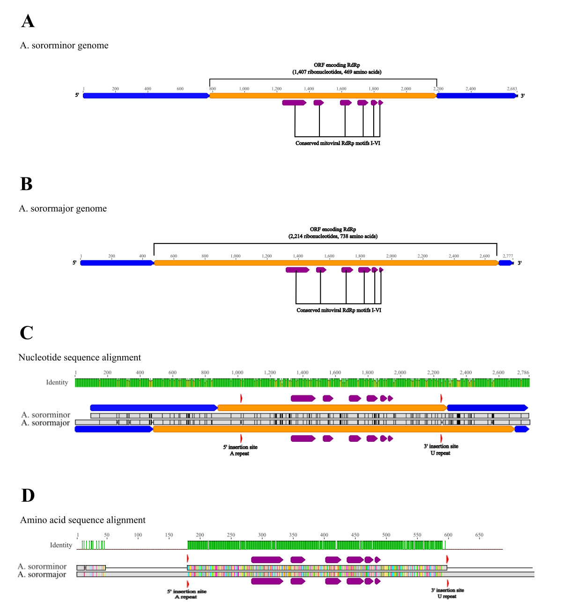
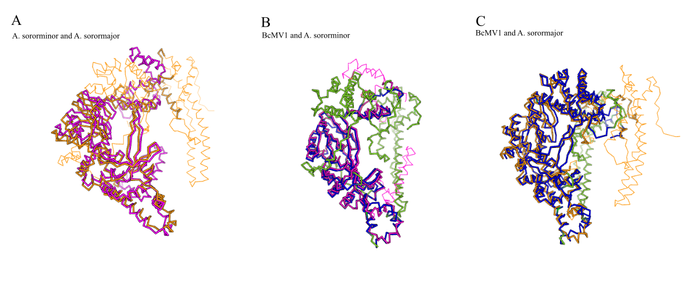

# Two to Tandem Repeat: A pair of novel mitoviruses with high RNA sequence homology but divergent RNA-dependent RNA polymerase products.

written by: [Owen Lo](https://github.com/wenloow)

[YouTube/Video Link to your presentation video](https://videolink.goes.here)

### Antagonascensor sororminor and Antagonascensor sorormajor

Antagonascensor comes from antagonist and ascensor, meaning rider, because these viruses reside in fungi that are antagonistic to other fungi. Soror means sister, and indicates the close relation of the two species. Sororminor is named thusly for its small RdRp and its putative younger age, and sorormajor is named thusly for its larger RdRp and its likely ancestral relation to sororminor.

## Abstract

Mitoviruses are mitochondria-replicating viruses, known to infect fungi, plants and invertebrates, with some of the simplest RNA genomes in nature [Tatsuhiro et al. 2023]. They consist of a strand of positive-sense RNA with a single open reading frame encoding an RNA-dependent RNA polymerase. The mitochondrial location of mitoviruses in the cell poses a challenge for characterization [Shahi et al. 2020], but modern tools enabling rapid metatranscriptome sequencing and analysis provide valuable new approaches to mitovirus discovery. Despite this, mitoviral diversity is largely unexplored. Here I present two putative novel mitoviruses, Antagonascensor sororminor, a mitovirus producing the shortest sequenced mitoviral RdRp to date, and Antagonascensor sorormajor, its close phylogenetic relation. Through analysis of metatranscriptomic datasets using RdRp palmprint sequences, I identified A. sororminor and A. sorormajor as a pair of conserved sequences homologous to genomes of the family Mitoviridae. The A. sororminor and A. sorormajor sequences both include complete ORFs encoding mitoviral RdRps, and despite 95.0% coding sequence identity, their RdRps share only 55.4% amino acid sequence identity, demarcating them as separate species of mitovirus. The A. sororminor RdRp is 469 amino acids in length, 93 amino acids shorter than the shortest mitoviral RdRp that has heretofore been sequenced. The characteristics of A. sorormajor and A. sororminor exhibit how divergence can occur through just a few mutations in small RNA viruses, and demonstrate the capacity of the conserved domains of mitoviral RdRps to maintain function even in greatly truncated proteins. 

## Results

### Initial discovery of an enigmatic Mitoviral ecology

The viral palmprint (sotu u247182) was identified in 14 NCBI SRA [Sayers et al. 2024] sequencing read datasets. 12 of the runs do not share any BioProject identifiers amongst themselves. Briefly profiling the datasets:

9 of the runs, including the index run, SRR10839263, belong to Gs0120399, a larger GOLD study of the symbiosis between soil fungi and feedstock plants, despite not sharing a BioProject. The index run is a set of transcriptome reads of the fungus Trichoderma harzianum. The other 8 are sets of metatranscriptome reads of Brachypodium distachyon samples inoculated with T. harzianum from Naples, Italy at different time points. 

SRR12567751 is a set of raw sequence reads of a sample of Oryza sativa rice crop treated with T. harzianum from New Delhi, India.

SRR12455552 and SRR12455551 were read from different BioSamples of vegetative mycelia in the same BioProject. They were produced in a study of a gene causing meiotic drive in populations of the fungus Neurospora sitophila in Genoa, Italy [Svedberg et al. 2021].

SRR9894681 is a sequencing of viruses associated with wheat production in Ohio.

SRR13338907 was read from a human upper airway tissue sample.

A tblastn search with the palmprint sequence identified in the index revealed alignments to mitoviruses with e-values as low as 1e-48 and percent identities as high as 86.41%. Top hits were to Rubus leaf-associated mitovirus 6 (RaMito6), Botrytis cinerea mitovirus 1 (BcMV1), Ophiostoma mitovirus 3b (OnuMV3b) and Monilinia fructicola mitovirus 9 (MfrcMV9). #file 

I hypothesized that the palmprint belonged to a mitoviral RdRp. Mitoviruses infect primarily fungi. Although recent studies provide evidence of insects and plants acting as hosts to mitoviruses [Fonseca et al. 2020] [Nibert et al. 2018], several of the datasets in which the palmprint was identified were fungus-focused sequencing data, and the others exhibited high fungal presence in the SRA taxonomy analyses. 

T. harzianum, a fungus which associates with plant roots and parasitizes other fungi, commonly used as a biocontrol in agriculture [Elad et al. 1982], seemed a likely host candidate, since 10 runs were explicitly concerned with T. harzianum.

N. sitophila, a mold associated with occupational asthma [Francuz et al.,] that is also shown to have antifungal properties [Huaman-Pilco et al. 2025], seemed another candidate, since 2 runs were explicitly concerned with N. sitophila, and its aeroallergenic potential could explain the detection of the palmprint in a human airway sample.

The taxonomic analyses of the sequencing reads provided by the SRA did not give high enough resolution of fungal taxa to identify specific fungal species that could serve as a common factor across all runs of interest. 

A single mitovirus species being hosted by multiple fungi is not unheard of. BcMV1 and OnuMV3b, two of the top tblastn results for the palmprint sequence, are two strains of the same mitovirus infecting different fungi [Wu et al. 2010].

I adopted the working hypothesis that the palmprint belonged to a mitovirus hosted by two different species: T. harzianum and N. sitophila.

### Potential explanation uncovered in sequence assembly

Using tblastn [Camacho et al. 2009] with the viral palmprint sequence as query and the logan assembly of the index run as subject [Chikhi et al. 2025], a 549 bp contig was identified containing part of the palmprint sequence.

Repeating the process with the second and third highest coverage runs (SRR1256751, SRR8554536), two much longer contigs were identified. These were used as blastn queries to search within the index run assembly once again, and a set of index assembly contigs spanning the range of the contigs identified in the assemblies of the other two runs was collected. (index_contigs.fa)

These contigs were manually linked using the overlapping nucleotides at their ends and the sequences identified in the other two runs as reference. The result was a contiguous index sequence of 2,683 bp. The sequence was 63.29% A/U, typical of a mitoviral genomes [Xie and Said 2012].

Since mitoviruses are known to replicate in fungal mitochondria [Tatsuhiro et al. 2023], ORFfinder was run in the index sequence with parameters -g 4 -s 2 in order to find open reading frames with any sense start codon using the Mold and Protozoan Mitochondrial Code [Rombel et al. 2002].

The longest ORF identified was 1407 bp. A blastp search on the translated ORF revealed 3 e-value 0.0 alignments, to the RdRps of RaMito6 (XHV14749.1, query coverage 89%, percent-identity 71.63%), MfrcMV9 (UTQ48826.1, query coverage 91%, percent-identity 65.03%), and BcMV1 (CEZ26300.1, query coverage 88%, percent-identity 65.79%). 

The translated ORF was analyzed using InterProScan [Jones et al. 2014] and a mitovirus RdRp protein family domain was identified (sororminor_rdrp_interproscan.fasta). I surmise with high confidence that the identified ORF encodes a mitoviral RdRp (sororminor_rdrp.fa).

Mitoviral RdRps are typically known to range between 650 and 1140 amino acids in length [Nibert 2017]. The RdRp encoded by this putative novel mitovirus, at 469 aa, is 93 amino acids shorter than the shortest fully sequenced mitoviral RdRp extant (WRK14119.1, Nigrospora sphaerica mitovirus 1).

RdRp length and host distribution of this putative novel mitovirus both seemed to defy family conventions.

Since mitoviruses encode only a single protein, the cds of the RdRp constitutes the entire mitoviral genome. In order to confirm that the sequence assembled from the index run contigs constituted the entire cds, the 70 bp ends of the sequence were used as blastn queries to search the other runs in which the palmprint was identified.

While contigs were identified in other runs aligning to the ends of the index sequence and extending further in the 5' and 3' directions, searching these extensions in the index assembly using blastn yielded no significant results. As such, I surmise with low confidence that the index assembly constitutes the full genome of the virus (sororminor_genome.fa).

I noticed that hits in the four runs not explicitly involving T. harzianum (SRR13338907, SRR12455552, SRR9894681 and SRR12455551) consistently aligned with percent identities between 93 and 97 to queries from the index run while hits from other runs typically aligned with percent identities between 98 and 100. 

By using blastn to query the four assembly files of interest with the entire cds, the sequences of the contigs producing the most significant alignments to the cds from each, all of which aligned between 93 and 95% identity, were extracted and mapped to the index sequence using the Geneious RNA mapper [Kearse et al. 2012] (sororminor_contigs_to_sorormajor_genome.fasta).

I observed that nearly all deviations from the cds were conserved across the sequences from all four runs. I repeated the same process of contig extraction on the other runs and mapped them to the cds as well. These sequences exhibited little deviation from the index sequence, all aligning with 99-100% identity (sororminor_contigs_to_sororminor_genome.fasta).

The method of linking sequences from a single assembly file used to assemble the first cds could not be used to assemble a complete cds from any of these runs. Instead, overlapping sequences extracted from SRR13338907, SRRR12455552 and SRR12455551 were linked together with preference given according to coverage (sorormajor_linked_contigs).

The product was a sequence 2,777 bp long (sorormajor_genome.fa). Aligning this sequence to the original cds using MUSCLE [Edgar 2004] with default parameters, sequence identity was calculated at 95.0%. The sequence was 62.63% A/U, within the characteristic range of mitoviral genomes (virus_genome_alignment.fa).

Using ORFfinder to search the sequence for fungal mitochondrial ORFs, a reading frame of 2,214 bp was identified. A blastp search on the 738 aa translation identified e-value 0.0 alignments to the RdRps of RaMito6 (query coverage 100%, percent-identity 68.93%), MfrcMV9 (query coverage 100%, percent-identity 65.58%) and BcMV1 (query coverage 100%, percent-identity 64.64%).
InterProScan revealed a mitoviral RdRp protein family domain (sorormajor_rdrp.fa) (sorormajor_rdrp_interproscan.tsv).

To assess viability of both coding sequences, untranslated regions were input into RNAfold [Gruber et al. 2008]. The 5' and 3' UTR of A. sororminor were predicted to fold into complex structures including many stem-loops with free energy -215.17kcal/mol and -136.96 kcal/mol, respectively (sororminor_5UTR_structure.pdf) (sororminor_3UTR_structure.pdf). The 5' UTR of A. sorormajor was also predicted to fold into a complex structure including many stem-loops, with free energy -138.57 kcal/mol (sorormajor_5UTR_structure.pdf), and its 3' UTR was predicted to fold into a small structure of 3 stem loops with free energy -21.20 kcal/mol (sorormajor_3UTR_structure.pdf). Though Infernal CMSCAN [Nawrocki et al. 2013] revealed no significant homologies, stem-loop structures are typical of mitoviral UTRs [Zhang et al. 2022].

The criteria for mitovirus species demarcation are ill-defined, but amino acid sequence identities between the RdRps of strains of the same mitovirus species are greater than 90% [Lefkowitz et al. 2017]. The RdRps of the two viral sequences identified in this study were pairwise aligned using MUSCLE with default parameters and sequence identity was calculated at 54.7%, so I hypothesized that the two coding sequences represented genomes of distinct viral species (virus_rdrp_alignment.fa).

The virus with the shorter RdRp was dubbed Antagonascensor sororminor and the virus with the longer RdRp was dubbed Antagonascensor sorormajor.

### Confirmation and elaboration of the two-species hypothesis

A blastn search on the genome of A. sororminor revealed 8 e-value 0.0 alignments, to 5 different strains of BcMV1 and RaMito6, MfrcMV9, and OnuMV3b (query coverage range from 84-93%, percent-identity range from 68.62-70.04%). A blastn search on the genome of A. sorormajor revealed the same 8 e-value 0.0 results (coverage range from 81-97%, percent-identity range from 68.56-69.98%)

MUSCLE was used to generate MSAs of the genomes and proteins of these six viruses and 106 other mitoviruses identified by filtering in NCBI viruses for Virus/Taxonomy: Mitovirus, taxid:18678 and Nucleotide Completeness: complete (mitovirus_genomes.fasta) (mitovirus_proteins.fasta). IQ-TREE 2 [Minh 2020] was run on the alignments, and both resulting trees grouped A. sorormajor and A. sororminor together alone in one clade, within a greater clade containing the two novel viruses together with RaMito6, MfrcMV9, BcMV1 and OnuMV3b (mitovirus_genome_phylogeny.treefile) (mitovirus_protein_phylogeny.treefile). I conclude with high confidence that A. sororminor and A. sorormajor's closest phylogenetic relationships are to each other, and their next closest phylogenetic relationships to known viruses are to RaMito6, MfrcMV9, BcMV1 and OnuMV3b.

There are two frameshift-causing divergences between the A. sororminor and A. sorormajor open reading frames. A. sororminor has 6 A ribonucleotides from columns 1,017 to 1,022 of the pairwise alignment where A. sorormajor has 5. A. sororminor has 7 U ribonucleotides from columns 2,246 to 2,252 of the pairwise alignment where A. sorormajor has 5 (Fig. 1(C)).

This results in a 411 aa region where the A. sororminor and A. sorormajor RdRps align with 95.4% sequence identity. The rest of the RdRps align with only 16.1% identity. The mitovirus RdRp family domain identified by InterProScan is contained within this conserved region. 

3D structures were generated of the A. sororminor and A. sorormajor RdRps using MMSeqs2 and AlphaFold via CoLabFold [Mirdita 2022]. The structures were aligned using DALI [Holm 2022], exhibiting closely aligned, structurally conserved central regions with unaligned trailing ends. The stacked Pfam graphics (Pfam_domains.png) showed that the mitoviral RdRp protein family domain was within the structurally equivalent region in both structures.

MUSCLE was used to align the RdRps of A. sorormajor, A. sororminor, RaMito6, MfrcMV9, BcMV1 and OnuMV3b, and the six conserved mitovirus RdRp motifs [Zhang 2022] were confirmed within the equivalent regions of A. sorormajor and A. sororminor using JALVIEW [Waterhouse 2009] visualisation (mitovirus_motifs.png).  

I surmise with high confidence that the 411 aa region of the RdRp that is largely conserved between A. sororminor and A. sorormajor contains the mitoviral RdRp domain.

Since these differences account for the majority of the divergence between the A. sorormajor and A. sororminor RdRps, and they occur in mononucleotide repeat regions where indel mutations are likely to occur, [Gu et al. 2010] I surmise with high confidence that A. sororminor and A. sorormajor are immediately related mitoviruses that speciated due to frameshift-causing indel mutations.

Foldseek searches were performed with the 3D structures of the A. sororminor and A. sorormajor RdRps. The most significant structural alignment of both RdRps was to the BcMV1 RdRp. The A. sororminor RdRp aligned from aa 30-465, with e-value 5.70e-47. The A. sorormajor RdRp aligned from aa 1-738, the entire sequence, with e-value 3.23e-72. 

Viewing these alignments in the DALI pairwise aligner (Fig. 2), much more structural conservation was visible between BcMV1 and A. sorormajor than between BcMV1 and A. sororminor.

The highly uncharacteristic length of the A. sororminor RdRp and the lesser query coverage obtained in sequence and structure alignments despite shorter length suggest a more distant relation to known mitovirus species than A. sororminor. I conclude with moderate confidence that A. sororminor speciated from A. sorormajor as a result of insertion mutations in mononucleotide repeats in the ORF on either side of the sequence encoding the mitoviral RdRp domain.

The detection of A. sororminor in all samples known to contain T. harzianum and the detection of A. sorormajor in all other samples suggests that the viruses occupy different fungal hosts.

Lacking computational time for a systematic application of high-resolution fungal taxonomic gene classification tools, and lacking sufficient datapoints for creation of a significant statistical model, a rapid heuristic method was employed to assess presence of T. harzianum and N. sitophila mitochondria in the sequencing reads.

Blastn was used to search for alignments to the mitochondrial small subunit ribosomal RNA gene of T. harzianum (AF276097.1) and N. sitophila (AY291272.1) in the assembly files of all samples in which the viruses were detected. Drawing from protocol used for species-level demarcation of sequencing data in marine eukaryotes [Pappalardo et al. 2025], I took presence of an alignment with percent-identity greater than 98% and length greater than 100 nt to a mitochondrial gene as a positive indicator of presence of the corresponding mitochondria in the sample.

7 of the 10 samples containing A. sororminor and 0 of the 4 samples containing A. sororminor were positive for the presence of T. harzianum mitochondria. 0 of the 10 samples containing A. sororminor and all 4 of the samples containing A. sorormajor were positive for the presence of N. sitophila mitochondria. It is worth noting that three of the assembly files returned no hits at all to either blastn query (mitochondria_hits.tsv).

Taking into account the absence of any samples in which both A. sororminor and A. sorormajor are detected, I conclude with moderate confidence that A. sororminor and A. sorormajor infect different fungi.

The possibility of other fungi within the samples hosting A. sororminor or A. sorormajor cannot yet be ruled out, so I conclude with only low confidence that A. sororminor infects T. harzianum and A. sorormajor infects N. sitophila.

Drawing from genomic and ecological data, I conclude with high confidence that A. sororminor and A. sorormajor represent two novel mitoviruses.

### Virus Genome {Q3}

**Figure 1:** RNA and amino acid sequences of A. sororminor and A.
sorormajor. (A) Genome of A. sororminor. (B) Genome of A. sorormajor (C)
Pairwise ribonucleotide sequence alignment of A. sororminor and A.
sorormajor genomes, generated by MUSCLE, with sequence identity above in
green and mismatches highlighted in black. (D) Pairwise amino acid
sequence alignment of A. sororminor and A. sorormajor RNA-dependent RNA
polymerase, generated by MUSCLE, with sequence identity above in green
and mismatches highlighted in colour. Sequences and alignments annotated
and visualized in Geneious Prime 2026.0 [Kearse et al. 2012].

### Other (bonus) sections

**Figure 2:** RdRp structural alignments and conservation. (A) A.
sororminor RdRp aligned with A. sorormajor RdRp. (B) BcMV1 RdRp aligned
with A. sororminor RdRp. (C) BcMV1 RdRp aligned with A. sorormajor RdRp.
A. sororminor RdRp is shown in magenta, A. sorormajor RdRp is shown in
orange and BcMV1 RdRP is shown in green with blue for structural
conservation. 3D structures were generated in CoLabFold and aligned in
DALI.

## Discussion

The apparent functionality of the A. sororminor RdRp protein despite a short length unprecedented in the mitovirus family highlights the importance of the conserved domains of viral RdRps. The evolutionary explanation provided by A. sorormajor for the abnormality of A. sororminor means that this pair of viruses is a singular window into the mechanisms of speciation among mitoviruses and other small RNA viruses, offering unique insight into how considerable divergence in proteomic output can arise from relatively minuscule genomic changes.

## References

Babaian, Artem, and Robert Edgar. “Ribovirus Classification by a
Polymerase Barcode Sequence.” PeerJ, vol. 10, 13 Oct. 2022, p. e14055,
<https://doi.org/10.7717/peerj.14055>.

Camacho, Christiam, et al. “BLAST+: Architecture and Applications.” BMC
Bioinformatics, vol. 10, no. 1, 2009, p. 421,
<https://doi.org/10.1186/1471-2105-10-421>

Edgar, R. C. “MUSCLE: Multiple Sequence Alignment with High Accuracy and
High Throughput.” Nucleic Acids Research, vol. 32, no. 5, 8 Mar. 2004,
pp. 1792–1797, <https://doi.org/10.1093/nar/gkh340>.

Elad, Y., et al. “Degradation of Plant Pathogenic Fungi by Trichoderma
Harzianum.” Canadian Journal of Microbiology, vol. 28, no. 7, 1 July
1982, pp. 719–725, <https://doi.org/10.1139/m82-110>.

Fonseca, Paula, et al. “Characterization of a Novel Mitovirus of the
Sand Fly Lutzomyia Longipalpis Using Genomic and Virus–Host Interaction
Signatures.” Viruses, vol. 13, no. 1, 23 Dec. 2020, pp. 9–9,
<https://doi.org/10.3390/v13010009>.

Francuz, Beata, et al. “Occupational Asthma Induced by Chrysonilia
Sitophila in a Worker Exposed to Coffee Grounds.” Clinical and Vaccine
Immunology, vol. 17, no. 10, Oct. 2010, pp. 1645–1646,
<https://doi.org/10.1128/cvi.00134-10>.

Gruber, A. R., et al. “The Vienna RNA Websuite.” Nucleic Acids Research,
vol. 36, no. Web Server, 19 May 2008, pp. W70–W74,
<https://doi.org/10.1093/nar/gkn188>.

Gu, Tingting, et al. “Avoidance of Long Mononucleotide Repeats in Codon
Pair Usage.” Genetics, vol. 186, no. 3, 1 Nov. 2010, pp. 1077–1084,
<https://doi.org/10.1534/genetics.110.121137>.

Holm, Liisa. “Dali Server: Structural Unification of Protein Families.”
Nucleic Acids Research, vol. 50, no. W1, 24 May 2022, pp. W210–W215,
academic.oup.com/nar/article/50/W1/W210/6591528?login=false,
<https://doi.org/10.1093/nar/gkac387>.

Huaman-Pilco, Angel F, et al. “Physicochemical Properties of the
Endophytic Fungus Neurospora Sitophila and Its Interaction with Botrytis
Cinerea.” Journal of Natural Pesticide Research, vol. 13, 7 July 2025,
pp. 100143–100143, <https://doi.org/10.1016/j.napere.2025.100143>.

Jones, Philip, et al. “InterProScan 5: Genome-Scale Protein Function
Classification.” Bioinformatics, vol. 30, no. 9, 1 May 2014, pp.
1236–1240, <https://doi.org/10.1093/bioinformatics/btu031>.

Kearse, M., et al. “Geneious Basic: An Integrated and Extendable Desktop
Software Platform for the Organization and Analysis of Sequence Data.”
Bioinformatics, vol. 28, no. 12, 27 Apr. 2012, pp. 1647–1649,
<https://doi.org/10.1093/bioinformatics/bts199>.

Lefkowitz, Elliot J, et al. “Virus Taxonomy: The Database of the
International Committee on Taxonomy of Viruses (ICTV).” Nucleic Acids
Research, vol. 46, no. D1, 13 Oct. 2017, pp. D708–D717,
<https://doi.org/10.1093/nar/gkx932>.

Minh, Bui Quang, et al. “Corrigendum To: IQ-TREE 2: New Models and
Efficient Methods for Phylogenetic Inference in the Genomic Era.”
Molecular Biology and Evolution, vol. 37, no. 8, 18 June 2020, pp.
2461–2461, <https://doi.org/10.1093/molbev/msaa131>.

Mirdita, Milot, et al. “ColabFold: Making Protein Folding Accessible to
All.” Nature Methods, vol. 19, no. 6, 30 May 2022, pp. 1–4,
www.nature.com/articles/s41592-022-01488-1,
<https://doi.org/10.1038/s41592-022-01488-1>.

Nawrocki, E. P., and S. R. Eddy. “Infernal 1.1: 100-Fold Faster RNA
Homology Searches.” Bioinformatics, vol. 29, no. 22, 4 Sept. 2013, pp.
2933–2935, <https://doi.org/10.1093/bioinformatics/btt509>. Accessed 4
Apr. 2022.

Nibert, Max L., et al. “Evidence for Contemporary Plant Mitoviruses.”
Virology, vol. 518, May 2018, pp. 14–24,
<https://doi.org/10.1016/j.virol.2018.02.005>.

Nibert, Max L. “Mitovirus UGA(Trp) Codon Usage Parallels that of Host
Mitochondria.” Virology, vol. 507, July 2017, pp. 96–100,
<https://doi.org/10.1016/j.virol.2017.04.010>.

Pappalardo, Paula, et al. “Taxon‐Specific BLAST Percent Identity
Thresholds for Identification of Unknown Sequences Using Metabarcoding.”
Methods in Ecology and Evolution, 28 Aug. 2025,
<https://doi.org/10.1111/2041-210x.70147>.

Rombel, Irene T., et al. “ORF-FINDER: A Vector for High-Throughput Gene
Identification.” Gene, vol. 282, no. 1-2, 9 Jan. 2002, pp. 33–41,
pubmed.ncbi.nlm.nih.gov/11814675/,
[https://doi.org/10.1016/s0378-1119(01)00819-8](https://doi.org/10.1016/s0378-1119(01)00819-8){.uri}.

Sayers, Eric W, et al. “Database Resources of the National Center for
Biotechnology Information in 2025.” Nucleic Acids Research, vol. 53, no.
D1, 11 Nov. 2024, <https://doi.org/10.1093/nar/gkae979>.

Shahi, Sabitree, et al. “Investigation of Host Range of and Host Defense
against a Mitochondrially Replicating Mitovirus.” Journal of Virology,
vol. 93, no. 6, 9 Jan. 2019, <https://doi.org/10.1128/jvi.01503-18>

Svedberg, Jesper, et al. “An Introgressed Gene Causes Meiotic Drive
inNeurospora Sitophila.” Proceedings of the National Academy of
Sciences, vol. 118, no. 17, 19 Apr. 2021,
<https://doi.org/10.1073/pnas.2026605118>.

Tatsuhiro Ezawa, et al. “Structurally Distinct Mitoviruses: Are They an
Ancestral Lineage of the Mitoviridae Exclusive to Arbuscular Mycorrhizal
Fungi (Glomeromycotina)?” MBio, 10 May 2023,
<https://doi.org/10.1128/mbio.00240-23>.

Waterhouse, A. M., et al. “Jalview Version 2--a Multiple Sequence
Alignment Editor and Analysis Workbench.” Bioinformatics, vol. 25, no.
9, 16 Jan. 2009, pp. 1189–1191,
<https://doi.org/10.1093/bioinformatics/btp033>.

Wu, Mingde, et al. “Genome Characterization of a Debilitation-Associated
Mitovirus Infecting the Phytopathogenic Fungus Botrytis Cinerea.”
Virology, vol. 406, no. 1, Oct. 2010, pp. 117–126,
<https://doi.org/10.1016/j.virol.2010.07.010>.

Xie, Jiatao, and Said A. Ghabrial. “Molecular Characterizations of Two
Mitoviruses Co-Infecting a Hyovirulent Isolate of the Plant Pathogenic
Fungus Sclerotinia Sclerotiorum.” Virology, vol. 428, no. 2, July 2012,
pp. 77–85, <https://doi.org/10.1016/j.virol.2012.03.015>.

Zhang, Xiaofang, et al. “Complete Genome Sequence of a Novel Mitovirus
Isolated from the Fungus Fusarium Equiseti Causing Potato Dry Rot.”
Archives of Virology, vol. 167, no. 12, 30 Sept. 2022, pp. 2777–2781,
<https://doi.org/10.1007/s00705-022-05578-5>. Accessed 12 Dec. 2025.

