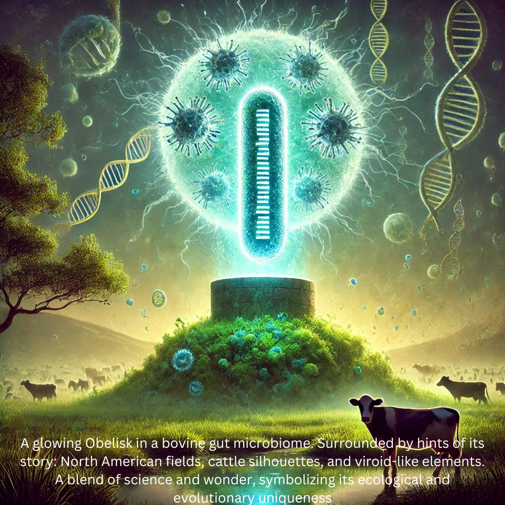
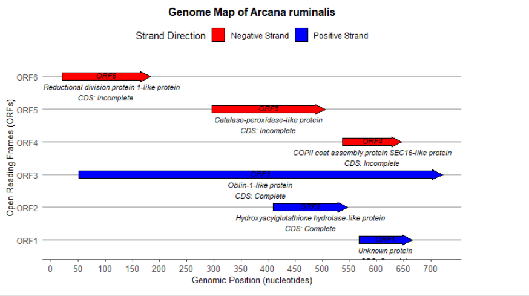
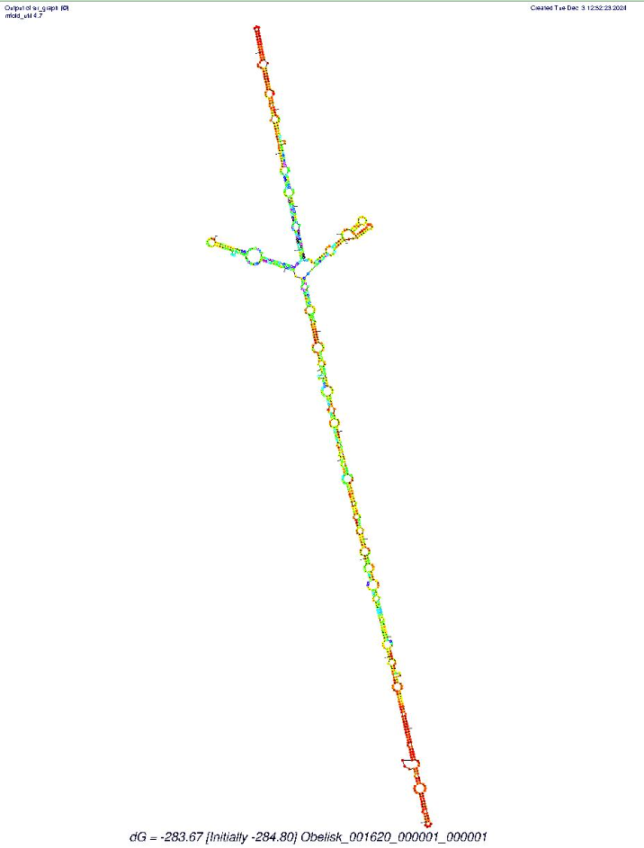
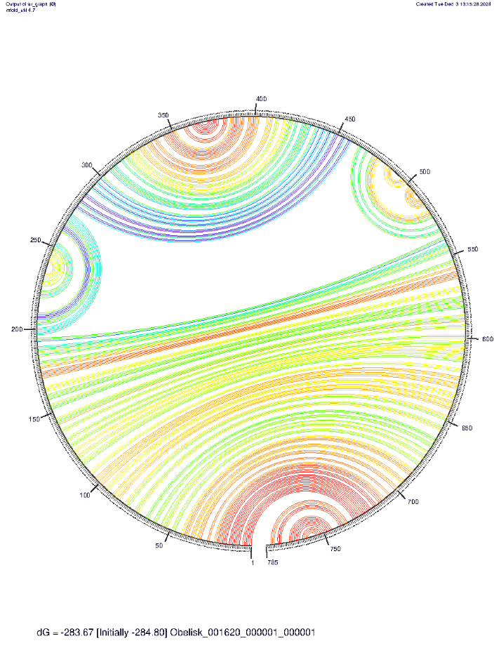
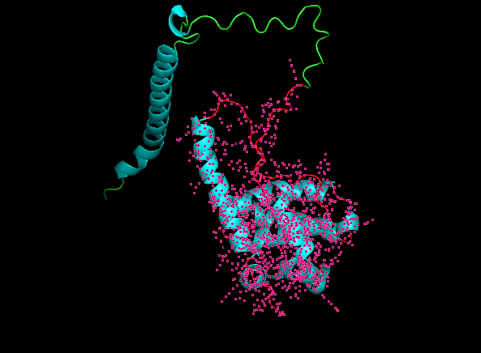
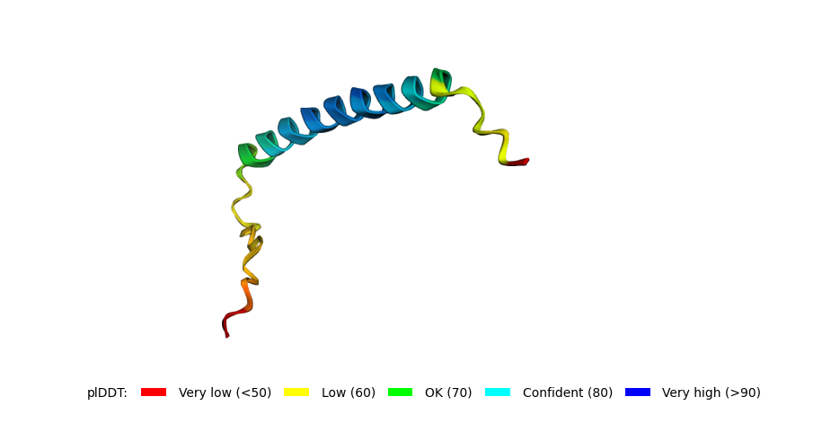
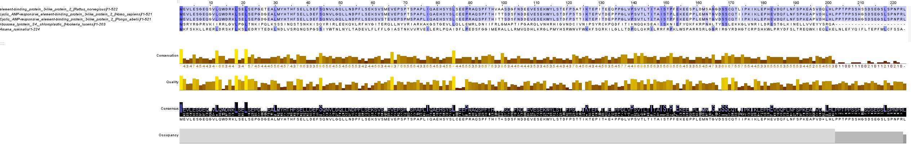

# Unearthing Arcana ruminalis: A Novel Virus Shaping the Bovine Gut Microbiome in Alberta Ecosystems"
written by: [Makuach Joack](https://github.com/joackmak *optional link*)

### {Arcana ruminalis}
*
Etiology: The genus name Arcana (Latin for "mystery" or "secret") symbolizes the virus's enigmatic nature and its novel presence in diverse ecosystems. The species name ruminalis highlights its ecological niche in the bovine rumen, where it consistently interacts with the microbiome, playing a potentially significant role in microbial dynamics and host adaptation [6]}*



## Abstract: Characterization of Arcana ruminalis in the Bovine Gut Ecosystem
Viruses and viroid-like entities are integral to understanding microbial ecology and evolution. They interact dynamically with their environments, influencing host systems and microbial community structure. Within this context, we investigated Arcana ruminalis, a novel circular RNA virus-like entity classified in the "obelisk" group, which is consistently detected in bovine rumen microbiomes, particularly in Alberta, Canada.

Through computational and structural analyses, we identified Arcana ruminalis as a viroid-like entity with a compact 785-nucleotide circular RNA genome containing six predicted open reading frames (ORFs). Notably, Arcana ruminalis lacks a conserved RNA-dependent RNA polymerase (RdRp), a hallmark of many RNA viruses, suggesting reliance on host or microbial enzymes for replication. Predicted rod-like secondary structures and the absence of conserved domains further distinguish it from known viral families.

Here, we show that Arcana ruminalis exhibits a strong ecological association with anaerobic environments like the rumen, where it may play a role in shaping microbial communities or interacting with host metabolic processes. ORFs within its genome display weak homologies to proteins from bacteria, fungi, and cyanobacteria, indicating possible horizontal gene transfer or convergent evolution. These findings challenge conventional definitions of RNA viruses and highlight the potential of Arcana ruminalis as a key player in microbial dynamics.

Our results contribute to a broader understanding of novel RNA-based entities, shedding light on their ecological roles and evolutionary pathways. This work underscores the importance of characterizing unconventional genomes to redefine the boundaries of viral taxonomy and their functional significance within host ecosystems.

## Results

### Ecology is defined as the interaction between the organisms and their environment, it may be biotic (consider other organisms as living components) and abiotic (the non-living homeostasis, such as climate, soil, and water). Computational analysis of genomic and environmental data sheds light on relationships between viral organisms and their environments in the context of digital ecology. Digital ecology utilizes bioinformatics tools to investigate the host−virus interaction of viruses like the Obelisk in multiple host species and environmental conditions in multiple ecosystems using the data acquired from sequencing technologies and other environmental datasets.
The Obelisk in question, Arcana ruminalis, is a novel biological entity discovered through genomic sequencing, and it has been identified in multiple datasets related to different ecological settings. Its significance lies not only in its potential impact on human or animal health but also in understanding how it interacts with different host species and the environmental conditions in which it thrives. The virus’s detection across multiple SRA runs and associated BioProjects offers a unique opportunity to examine how the virus adapts to and interacts with various ecosystems. Understanding the ecology of Arcana ruminalis in diverse datasets will help identify the biotic and abiotic factors influencing its presence, distribution, and potential pathogenicity.

Arcana ruminalis has been described in the study by Fuyong Li et al. (2019) -Rumen microbiomes and their associations with feed efficiency in various beef cattle breeds, where the virus was identified through high-throughput sequencing of bovine gut metagenome samples,Bioproject: PRJNA448333, University of Alberta. The publication aims to identify differences between functional potentials and activities of the same rumen microbiomes and to evaluate the effects of host breed and feed efficiency on the rumen microbiome. It was also described in the studies by Wang Y et la (2024) and Sun HZ et la (2021) at the Functional Genomics and Microbiology, College of Animal Sciences, Zhejiang University, Bioproject: PRJNA480220. Both of these studies were looking at optimized methods to identify circular RNAs among the cattle tissues and identifying factors regulating fatty acid composition in cattle respectively.

Arcana ruminalis was identified in several SRA runs, including SRR8416055,  SRR8416060, and SRR7498097, all of which are either associated with the BioProjects PRJNA448333 or PRJNA480220. These datasets include metagenomic sequencing data from tissue samples of beef cattle (mostly rumen) all raised in Albarta,Canada. The sequencing technologies used in these datasets include Illumina sequencing especially  Illumina HiSeq 2500 and Illumina HiSeq 4000, which provide high-resolution data for viral detection and identification. These runs focus on studying viral diversity in ecosystems such as the gut of the cattle.


Upon analyzing the datasets containing my index run and its associated clusters, several common factors emerge. To begin with, the obelisk is consistently detected in the bovine gut ecosystems. Moreover, the bovine species- Bos taurus, where it is persistently found were raised in Albarta. In comparsion with broader ecological aspect of the other datasets, there seems to be a world-wide destribution of the obelisk detection though the detection was skewed toward the countries with more technological will. Interestingly, when I grouped the obelisk_sraRunInfo data by organism and count the number of times an obelisk was detected in an SRA run from that organism, the top hits in which the obelisk was consistently detected in are soil, and the guts of many mammals including bovine, humans and Mucaca mulata.  Observation of the Arcana ruminalis in these environment and organisms stimulated several questions to pursue. What is the evolutionary origin of this Obelisk, Arcana ruminalis?. Does this it interact with a specific host? Does it possess any unique open reading frames (ORFs) that could encode novel proteins? What is its geographical restriction? Does it encode non-coding RNAs? Is there a possibility of horizontal transfer?

Hypothesis:
The consistent detection of the Arcana ruminalis in bovine gut ecosystems, particularly in Alberta, Canada, suggests a potential association between the Obelisk and the bovine gut microbiome. This observation leads to the hypothesis that Arcana ruminalis may interact with specific host species, particularly bovine species, and may play a role in the gut microbiome's composition and function.

To address the hypothesis that Arcana ruminalis interacts with specific host species, particularly bovine species, I queried PebbleScout[4] using the nucleotide sequences of Arcana ruminalis. The analysis revealed that the first 100 cases consistently exhibited high raw scores, PBS scores, and percentage coverage across all SRA datasets derived from rumen microbiomes. In contrast, detection in datasets from non-rumen sources was significantly lower.

This strong signal in rumen-specific data likely support the hypothesis that Arcana ruminalis is closely associated with bovine gut ecosystems, specifically the rumen. Its absence or low prevalence in other datasets reinforces its potential specialization or ecological dependence on the bovine gut microbiome. These findings hint to suggest that Arcana ruminalis may indeed play a functional role in the microbial dynamics of the rumen, warranting further investigation into its interactions and contributions within this environment.


### Virus Genome {Q3}

To annotate the genome of Arcana ruminalis, I began by running the sequence of the centroid through NCBI ORFfinder  to identify all potential open reading frames (ORFs). Each ORF was subsequently analyzed through BLASTp searches to determine homology and functional annotations for the predicted proteins. Using the results, I compiled a comprehensive genomic dataframe that integrated the ORF details with their corresponding BLASTp annotations. Finally, leveraging R, I created a detailed genome map to visually represent the annotated features and provide a clear overview of the genomic organization.



Figure 1 : Annotation of Arcana rumenalis genome.


To gain insights into the secondary structure of Arcana ruminalis, I analyzed the nucleotide sequence of the centroid using mfold[5]. 

Figure 2: Secondary structure of Arcana rumenalis structure predicted using Mfold web server.


The Jupiter plot further predicted the secondary structure of Arcana ruminalis, illustrating the intricate base pairing and the collapse of the structure into a distinct rod-like formation. This visualization underscores the compact and potentially functional architecture of the virus, shedding light on its structural properties and potential biological roles.

figure 3: Jupiter plot showing the base pair in the Arcana rumenalis structure

I could not identify any conserved domains using both InterProScan and NCBI's Conserved Domain Search. I constructed a conserved domain model for the structure of Arcana ruminalis by analyzing its open reading frame (ORF) sequences. This model highlights key regions of the virus's structure that are preserved across related sequences. To further investigate the identity of this hypothetical ObLin, I performed a sequence alignment with ObLin-1, a protein characterized by Zheludev, Ivan N., et al. The alignment revealed a modest sequence similarity of 30.36%; however, the most striking observation was the E-value of 5e^-4, suggesting a statistically significant alignment despite the low percentage identity. 


From here, I generated 3D structure of the hypothetical oblin using alphafold[8] then visualized it on Pymol[9]. Its 3D structure is similar to the characterized OBlin-1.  

figure 4: Alphafold prediction of Arcana rumenalis' oblin visualized on pymol. 


Alphafold prediction of ORF4 protein

figure 5: Alphafold prediction of ORF4 protein structure
### Other (bonus) sections

To satisfy the novelty of Arcana rumenalis, I conducted a series of hypothesis.
The  Arcana rumenalisk genome contain no regions that encode for non-coding RNAs.
This is inspired by the established known property of viriod which do not code for non-coding RNAs. To address this I usedinfernal search to see if it encodes for non-coding RNAs that match known non-coding RNAs. Infernal returned no hits. This suggests that Arcana rumenalis might be viriod-like entity. 

To see if Arcana ruminalis can encode a novel protein, I used ORF3, the longest open reading frame with 223 amino acids and representing the hypothetical Oblin, then conducted a BLASTp search, identifying 7 proteins with significant homology. After applying a filter for proteins with at least 30% identity, the list was narrowed down to 4 candidates. I then performed a multiple sequence alignment (MSA) with MUSCLE[10] on these 4 proteins along with Arcana ruminalis, and visualized the results using Jalview[11], providing a clear comparison of conserved regions and sequence similarities.

Figure 6. The MSA of Arcana rumenalis' oblin and its top BLASTP hits visualized using Jalview.


To chase down this evolutionary origin of Arcana ruminalis, I generated the phylogenetic tree, I used Jalview, which revealed that Arcana ruminalis is closely positioned near Hookeria lucens, a species of moss, suggesting a shared evolutionary relationship. 

Figure 7. Phylogenetic tree of Arcana rumenalis' oblin  and its top BLASTP hits visualized using Jalview.
## Discussion

The characterization of Arcana ruminalis has provided profound insights into the ecology, structure, and genomic peculiarities of this novel biological entity. As a member of the "obelisk" class of newly characterized viroid-like entity [Zheludev, Ivan N. et al.],  it challenges conventional definitions and adds new dimensions to our understanding of viral ecology and evolution.

One of the most fascinating aspects of Arcana ruminalis is its strong association with the bovine gut microbiome, particularly in rumen ecosystems. This consistent detection suggests that it may play a role in shaping microbial communities or interacting with host metabolic processes. The fact that it thrives in anaerobic environments like the rumen, while other obelisks have been detected in diverse habitats (e.g., soil and mammalian gut systems), highlights its ecological specialization.

From a genomic perspective, Arcana ruminalis stands out due to its compact circular RNA genome, containing six predicted ORFs. Its lack of a conserved RNA-dependent RNA polymerase (RdRp), a hallmark of many RNA viruses, is particularly intriguing. This deviation suggests it may rely on host or microbial enzymes for replication, pushing against the textbook definitions of autonomous viral replication. Additionally, its secondary structure, predicted to form a rod-like architecture, mirrors features seen in viroids and other RNA-based biological entities, further blurring traditional classifications.

The absence of conserved domains, as revealed by InterProScan and NCBI's Conserved Domain Search, also sets Arcana ruminalis apart. This suggests significant divergence from known viral families and emphasizes its novel status. Despite this, the presence of hypothetical proteins, including one homologous to Oblin-1, hints at unique functionalities that merit further investigation.

What I found particularly fascinating was the presence of weak but diverse homologies in its ORFs to proteins from bacteria, fungi, and cyanobacteria. This observation raises the possibility of horizontal gene transfer events or convergent evolution. For example, ORF4 encodes a protein similar to COPII coat assembly protein SEC16, typically associated with eukaryotic vesicular transport, while ORF5 shows similarity to catalase-peroxidase, a bacterial enzyme. Such findings challenge the rigid definitions of viral genomes as purely distinct from cellular life.

Interestingly, Arcana ruminalis shares some traits with other obelisks, such as a circular genome and structural stability. However, it diverges by showing a strong ecological association with cattle.


## References

1. Li, F., Hitch, T.C.A., Chen, Y. et al. Comparative metagenomic and metatranscriptomic analyses reveal the breed effect on the rumen microbiome and its associations with feed efficiency in beef cattle. Microbiome 7, 6 (2019). https://doi.org/10.1186/s40168-019-0618-5.

2. Wang Y et al., "Assessment of different enrichment methods revealed the optimal approach to identify bovine circRnas.", RNA Biol, 2024 Jan;21(1):1-13


3.Sun HZ et al., "Gene co-expression and alternative splicing analysis of key metabolic tissues to unravel the regulatory signatures of fatty acid composition in cattle.", RNA Biol, 2021 Jun;18(6):854-862


4.Shiryev, S.A., Agarwala, R. Indexing and searching petabase-scale nucleotide resources. Nature Methods (2024). https://doi.org/10.1038/s41592-024-02280-z


5. Mfold:Zuker, M. « Mfold Web Server for Nucleic Acid Folding and Hybridization Prediction ». Nucleic Acids Research 31, nᵒ 13 (1 juillet 2003): 3406‑15. https://doi.org/10.1093/nar/gkg595.


6. T. S. Postler et al., "Guidance for creating individual and batch latinized binomial virus species names," J. Gen. Virol., vol. 103, no. 12, 2022, doi: https://doi.org/10.1099/jgv.0.001800.


7. van N. Zheludev, Robert C. Edgar, Maria Jose Lopez-Galiano, Marcos de la Peña, Artem Babaian, Ami S. Bhatt, Andrew Z. Fire, Viroid-like colonists of human microbiomes,Cell,Volume 187, Issue 23,2024,Pages 6521-6536.e18,ISSN 0092-8674,https://doi.org/10.1016/j.cell.2024.09.033.


8.Jumper, J. et al. “Highly accurate protein structure prediction with AlphaFold.” Nature, 596, pages 583–589 (2021). DOI: 10.1038/s41586-021-03819-2


9. The PyMOL Molecular Graphics System, Version 3.0 Schrödinger, LLC.


10.R. C. Edgar, "MUSCLE: multiple sequence alignment with high accuracy and high throughput," Nucleic Acids Research, vol. 32, no. 5, pp. 1792–1797, 2004, doi: https://doi.org/10.1093/nar/gkh340.

11.Jalview: Waterhouse, Andrew M., James B. Procter, David M. A. Martin, Michèle Clamp, et Geoffrey J. Barton. « Jalview Version 2—a Multiple Sequence Alignment Editor and Analysis Workbench ». Bioinformatics 25, nᵒ 9 (1 mai 2009): 1189‑91. https://doi.org/10.1093/bioinformatics/btp033.

# Viral Short Story

```
The Tale of Arcana rumenalis
In a kingdom far beyond the seas, where cattle roamed the verdant fields, there dwelt a mysterious entity known only as the Obelisk. This being was no beast of bone nor bird of feather, but a phantom of the microscopic realm, whispered of in hushed tones by the scholars of the realm.
The tale begins in the bovine gut, where this Obelisk made its home , a place teeming with life unseen by mortal eyes. Unlike the familiar plagues of the realm, such as the herpesviruses, this Obelisk bore the lineage of a distant kin, related to the viroid-Pospiviroidae, those mischievous specters that haunt the flora.
It was said the Obelisk possessed four mystical scrolls, or open reading frames (ORFs), each brimming with ancient secrets. Of these, ORF3 stood tallest, a scroll inscribed with strange runes, encodes a protein bearing 35% similarity to the ribosomal protein S4 of Hookeria lucens. "What could this mean?" pondered the wise sages of the court, their quills scratching furiously at parchment.
Yet, the Obelisk’s reach was far from boundless. The scholars mapped its presence across the lands and found it most enriched in the New World, in the flourishing fields of North America, and most prominently, the United States. Here it thrived, unnoticed amidst the din of the bustling kingdom.
Curiously, the Obelisk lacked the adornments of many of its kin. No non-coding RNAs elements did it carry, no ornamental scripts in its genomic tapestry. "How does it orchestrate its existence?" the sages wondered, marveling at its simplicity and elegance.
And so, the Obelisk remained a riddle, a creature of enigma and wonder. Its tale spread through the kingdom, inspiring quests for knowledge and sparking debates in the halls of science.
```