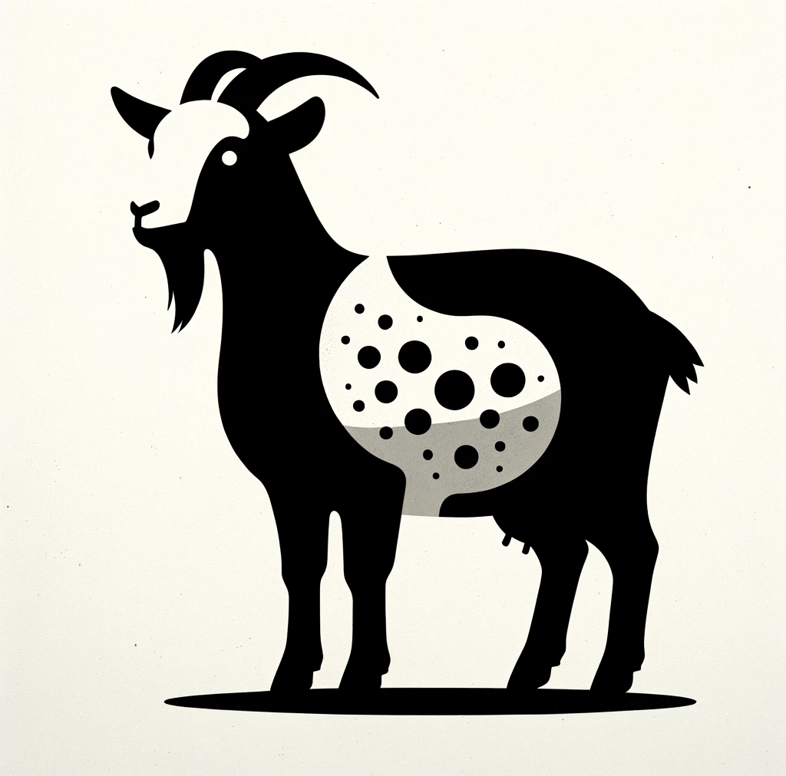
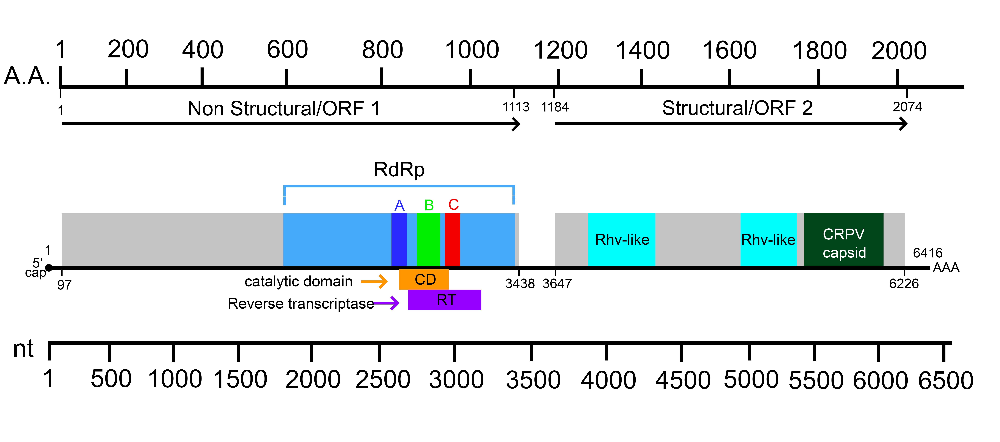
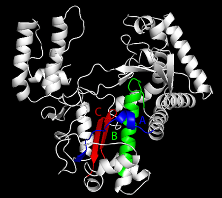
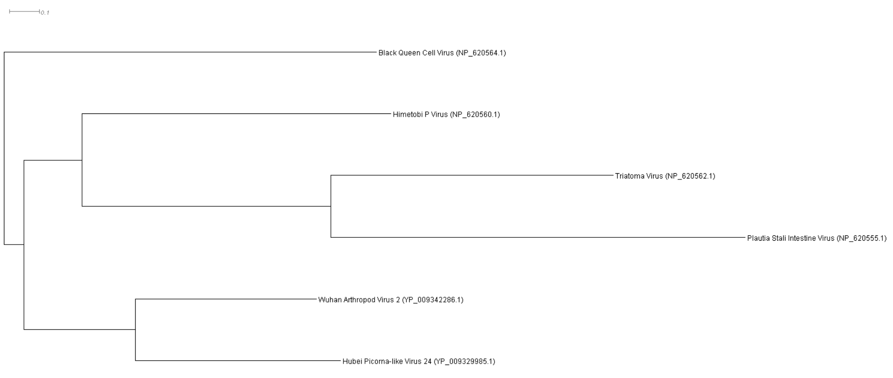

# From Buzz to Fuzz: Unraveling the Thread of a Black Queen Cell Virus (BQCV) Cross-Species Journey from Bees to Cashmere Goats
written by: [Jason Say](https://github.com/yourname *optional link*)

### Virus apicaprini volans
*"Apicaprini" combines "apis" for bees, its original hosts, with "caprini" for goats, the new hosts. "Volans" is latin for flying, which denotes the transmission vector, highlighting the virus's transmission from bees to goats via flies.*



## Abstract

Virology, the study of viruses and viral diseases, explores the intricate mechanisms of viral infection and host-virus interactions. Within this field, the phenomenon of cross-species transmission is of particular interest, as it presents significant challenges to both ecological balance and biosecurity. However, the zoonotic mechanisms and cross-species transmission pathways are often not well understood for many viruses, including the Black Queen Cell Virus (BQCV). Our study bridges a crucial knowledge gap by documenting the initial known transmissions of BQCV from its primary host, honeybees, to Cashmere Goats. This interesting finding arose from detailed RNA sequence analyses across bioprojects and underscores the virus's presence during the critical anagen phase of goat skin development. We hypothesize that dipteran vectors, specifically flies, may mediate this host jump. Our discovery challenges traditional views on BQCV host specificity and sheds light on the potential for broad-spectrum viral host shifts. Additionally, the findings of this study extend the comprehension of viral adaptability, emphasizing a need for vigilant cross-species pathogen monitoring within agricultural systems. Taken together, this study paves the way for a new understanding of viral ecology, with implications for biosecurity and the management of emerging zoonotic risks.

## Results

### Ecology - Index Case

The index case was based on the SRA run SRR10556080, which marked the first instance of Black Queen Cell Virus (BQCV) infecting Inner Mongolian Cashmere Goats (Capra Hircus). This run was conducted by the Inner Mongolia Agricultural University as part of a study focusing on the growth cycles of Capra Hircus secondary hair follicles (PRJNA592400), and the findings were published by Su et al. in 2022. The study employed RNA-Seq technology, specifically the Illumina HiSeq X Ten, processing substantial RNA samples from adult female goats. This approach resulted in a comprehensive dataset, revealing BQCV's presence in an unexpected host, thus marking a notable case of cross-species viral transmission. 4 more runs from the same study confimed this (SRR10556082, SRR10556084, SRR10556078, SRR10556081)

Traditionally, BQCV is known for its specific bee ecology, primarily affecting queen larvae and pupae (Avci et al. 2022). However, its detection in Cashmere goats signifies a potential for a broader host range. The deviation is particularly striking given the geographical and ecological differences of Inner Mongolia habitats (Zhang et al. 2020) compared to typical bee habitats (Liczner and Colla 2019). This finding raises crucial questions about BQCV's adaptability, its potential to expand its host range, and the consequent implications for agricultural and natural ecosystems.

### Ecology - Other occurences of BQCV infection

Further investigation revealed BQCV's presence in Cashmere Goats from sequencing runs as part of a study by the Chinese Academy of Agricultural Sciences (SRR5448726, SRR5468459; PRJNA382893). These studies, focusing on lincRNA transcripts in Cashmere Goat skin, indicated a selective infection of hair follicles, possibly related to the skin growth cycle. Additionally, BQCV was identified in Tibetan Cashmere Goats in research published by Fu X et al. in 2020 (SRR12131507; PRJNA643003), which studied RNA sequences for mRNA and lncRNA in skin tissue. The virus's presence in fine skin tissue samples suggests an infection pattern related to the early stages of skin growth.

BQCV's detection extends beyond Cashmere Goat skin. Northwestern Polytechnical University identified the virus in Capra Hircus horn sprouts in a study published by Chen et al. 2019 (SRR8002968; PRJNA438286), supporting the hypothesis of early-stage infection but also indicating a possible wider infection range in goats.

Another interesting observation is that BQCV was detected in a human lysosome subcellular sequencing run (SRR10662229; PRJNA594757), an alarming discovery suggesting potential human infection. Fortunately, this finding also suggests that humans might effectively combat BQCV, as it was located in the lysosome, an organelle that plays a key role in breaking down pathogens (e.g., through phagocytosis) as part of the immune response. 

The comparative analysis of BQCV across various datasets reveals its remarkable adaptability and potential for cross-species infection. The common factors linking these datasets are the early stages of host growth and development, regardless of the host species. This study underscores the importance of understanding virus ecology in diverse environments and hosts, with implications for both ecological and health-related research.

### Virus Genome {Q3}



> Figure 1. Black Queen Cell Virus (BQCV) Viral Genome. The first Open Reading Frame (ORF 1) encodes for nonstructural proteins, whereas the second Open Reading Frae (ORF 2) encodes for structural proteins. The RNA-dependent RNA polymerase is found in ORF 1, its conserved motifs A, B, and C are annotated in blue, green, and red respectively. A scale legend for nucleotides (nt) and amino acid residues (A.A.) are included for reference. ORF, Open Reading Frame; CD, Catalytic Domain; RT, Reverse Transcriptase Domain; Rhv-like, Picornavirus/Calicivirus coat protein; CRPV capsid, Cricket Paralysis Virus Capsid Domain

### AlphaFold2 Predicted 3D Structure of this BQCV Strain RNA-dependent RNA Polymerase (RdRp)



> Figure 2. 3D Structure of BQCV RdRp: The tertiary structure of the RNA-dependent RNA polymerase (RdRp) from Black Queen Cell Virus (BQCV) as predicted by AlphaFold2 (Jumper et al. 2021) and visualized using PyMol (Schrödinger and DeLano 2020). Critical motifs within the enzyme are highlighted: Motif A (blue), essential for nucleotide selection and binding; Motif B (green), involved in catalysis; and Motif C (red), which assists in RNA binding and positioning (Shu and Gong 2016). The overall structure adopts a right-hand-like architecture, characteristic of polymerases, with the palm, fingers, and thumb domains contributing to the active site's formation.

### Multiple Sequence Alignment of the BQCV RdRp sequence

[Figure 3](img/BQCV/alignment.png)

> Figure 3. Conservation Analysis via Multiple Sequence Alignment. This figure represents a multiple sequence alignment of BLASTp (Camacho et al. 2009) hits that exhibit greater than 80% query coverage and more than 40% amino acid identity to the RNA-dependent RNA polymerase (RdRp) sequence of Black Queen Cell Virus (BQCV), retrieved from the refSeq_protein database. The visualization was generated with Jalview (Waterhouse et al. 2009), highlighting sequence conservation and quality. Conservation is depicted by the bar height at each position, with a dark-to-light gradient representing high to low sequence quality. The consensus sequence is indicated below, emphasizing the most conserved amino acids. Sequence gaps are marked with dots, and residue positions are numerically annotated to the right. Accession numbers for each sequence are listed on the left, providing a reference for the alignment.



> Figure 4. Viral RNA Polymerase (RdRp) Phylogenetic Tree based on the above Multiple Sequence Alignment generated using IQTree (Nguyen et al. 2015) and visualized using Dendroscope (Huson and Scornavacca 2012). Maximum-likelihood phylogenetic tree based on the RNA-dependent RNA polymerase (RdRp) gene sequences of various insect-associated viruses. The tree is rooted with the Black Queen Cell Virus and includes diverse taxa such as the Himetobi P Virus and the Triatoma Virus, illustrating their genetic relationships and evolutionary divergence. The scale bar represents 0.1 amino acid substitutions per site, with each tip representing a unique viral sequence identified by its GenBank accession number.


## Discussion

The viral genome of this BQCV strain exhibits characteristics typical of Picornaviruses, consistent with its classification within this family. Notable features include the presence of an RNA-dependent RNA polymerase (RdRp), essential for replicating the positive-sense RNA genome, a trait shared with BQCV. The absence of envelope protein domains in the genome is in line with BQCV's nonenveloped nature.

This BQCV genome comprises two open reading frames (ORFs): ORF1, associated with replication, and ORF2, linked to structural elements like capsid proteins. Uniquely, this BQCV strain possesses only three capsid protein domains instead of the typical four, with none being VP domains. Two Rhv-like domains, known for encoding capsid proteins with an 8-stranded beta-sandwich structure (Phelps et al. 2000), and one CRPV capsid domain, coding for a protein with a beta-sheet structure (Tate et al. 1999), are present. However, these structures are atypical as they don't align with the finger-like protrusions observed in BQCV's crystal structure (Spurny et al. 2017).

Additionally, none of these structural domains are associated with clathrin-mediated endocytosis, suggesting an alternative viral entry mechanism into cells. This could explain the BQCV's ability to infect Cashmere Goats. One hypothesis is the use of exosome-like vesicles for entry, as seen with the CRPV capsid protein in Drosophila cell infections (Kerr et al. 2018).

Taken together, a plausible hypothesis is that the BQCV strain, employing its CRPV capsid protein, initially infected flies that may have been in contact with infected bees due to both insects being part of pollination communities (McCabe and cobb 2021). Subsequently, these infected flies might have directly interacted with the skin of Cashmere Goats in farms, particularly right after the Cashmere Goats were sheared. Shearing often coincides with the early phases of skin development (i.e., the Anagen Phase), as there is active hair growth in Cashmere Goats during these phases (Yang et al. 2020). This timing could explain the identification of BQCV in the Cashmere goats skin during their early growth and development stages.Moreover, as farmers would frequently interact with Cashmere Goats in close proximity, this hypothesis potentially explains the detection of BQCV in a human lysosome (SRR10662229; PRJNA594757). Such a situation indicates a possible cross-species transmission pathway, where the virus, initially transmitted via flies, adapted to infect Cashmere Goats. 

## References

Abou Kubaa, Raied, Annalisa Giampetruzzi, Rocco Addante, and Maria Saponari. “Coding-Complete Genome Sequence of a&nbsp; &nbsp; &nbsp; &nbsp; &nbsp; &nbsp; Black Queen Cell Virus&nbsp; &nbsp; &nbsp; &nbsp; &nbsp; &nbsp; Isolate from Honey Bees (Apis Mellifera) in Italy.” Microbiology Resource Announcements 9, no. 28 (2020). doi:10.1128/mra.00552-20. 

Amiri, Esmaeil, Marina Meixner, Steen Lykke Nielsen, and Per Kryger. “Four Categories of Viral Infection Describe the Health Status of Honey Bee Colonies.” PLOS ONE 10, no. 10 (2015). doi:10.1371/journal.pone.0140272. 

Avci, Oguzhan, Mustafa Emin Oz, and Muge Dogan. “Silent Threat in Honey Bee Colonies: Infection Dynamics and Molecular Epidemiological Assessment of Black Queen Cell Virus in Turkey.” Archives of Virology 167, no. 7 (2022): 1499–1508. doi:10.1007/s00705-022-05458-y. 

Beims, Hannes, Martina Janke, Werner Ohe, and Michael Steinert. “Influence of Virus Abundances in Donor Colonies and Nurse Hives on Queens of Apis Mellifera during the Rearing Process.” Open Veterinary Journal 13, no. 7 (2023): 879. doi:10.5455/ovj.2023.v13.i7.10. 

Benjeddou, Mongi, Neil Leat, Mike Allsopp, and Sean Davison. “Development of Infectious Transcripts and Genome Manipulation of Black Queen-Cell Virus of Honey Bees.” Journal of General Virology 83, no. 12 (2002): 3139–46. doi:10.1099/0022-1317-83-12-3139. 

Bonning, Bryony C. “The Dicistroviridae: An Emerging Family of Invertebrate Viruses.” Virologica Sinica 24, no. 5 (2009): 415–27. doi:10.1007/s12250-009-3044-1. 

Camacho, Christiam, George Coulouris, Vahram Avagyan, Ning Ma, Jason Papadopoulos, Kevin Bealer, and Thomas L Madden. “BLAST+: Architecture and Applications.” BMC Bioinformatics 10, no. 1 (2009). doi:10.1186/1471-2105-10-421. 

Chen, Lei, Qiang Qiu, Yu Jiang, Kun Wang, Zeshan Lin, Zhipeng Li, Faysal Bibi, et al. “Large-Scale Ruminant Genome Sequencing Provides Insights into Their Evolution and Distinct Traits.” Science 364, no. 6446 (2019). doi:10.1126/science.aav6202. 

Fu, Xuefeng, Bingru Zhao, Kechuan Tian, Yujiang Wu, Langda Suo, Gui Ba, Deji Ciren, et al. “Integrated Analysis of Lncrna and Mrna Reveals Novel Insights into Cashmere Fineness in Tibetan Cashmere Goats.” PeerJ 8 (2020). doi:10.7717/peerj.10217. 

Huson, Daniel H., and Celine Scornavacca. “Dendroscope 3: An Interactive Tool for Rooted Phylogenetic Trees and Networks.” Systematic Biology 61, no. 6 (2012): 1061–67. doi:10.1093/sysbio/sys062. 

Jumper, John, Richard Evans, Alexander Pritzel, Tim Green, Michael Figurnov, Olaf Ronneberger, Kathryn Tunyasuvunakool, et al. “Highly Accurate Protein Structure Prediction with Alphafold.” Nature 596, no. 7873 (2021): 583–89. doi:10.1038/s41586-021-03819-2. 

Kerr, Craig H., Udit Dalwadi, Nichollas E. Scott, Calvin K. Yip, Leonard J. Foster, and Eric Jan. “Transmission of Cricket Paralysis Virus via Exosome-like Vesicles during Infection of Drosophila Cells.” Scientific Reports 8, no. 1 (2018). doi:10.1038/s41598-018-35717-5. 

Leat, Neil, Brenda Ball, Vandana Govan, and Sean Davison. “Analysis of the Complete Genome Sequence of Black Queen-Cell Virus, a Picorna-like Virus of Honey Bees.” Journal of General Virology 81, no. 8 (2000): 2111–19. doi:10.1099/0022-1317-81-8-2111. 

Liczner, Amanda R., and Sheila R. Colla. “A Systematic Review of the Nesting and Overwintering Habitat of Bumble Bees Globally.” Journal of Insect Conservation 23, no. 5–6 (2019): 787–801. doi:10.1007/s10841-019-00173-7. 

McCabe, Lindsie M., and Neil S. Cobb. “From Bees to Flies: Global Shift in Pollinator Communities along Elevation Gradients.” Frontiers in Ecology and Evolution 8 (2021). doi:10.3389/fevo.2020.626124. 

Nguyen, Lam-Tung, Heiko A. Schmidt, Arndt von Haeseler, and Bui Quang Minh. “IQ-Tree: A Fast and Effective Stochastic Algorithm for Estimating Maximum-Likelihood Phylogenies.” Molecular Biology and Evolution 32, no. 1 (2014): 268–74. doi:10.1093/molbev/msu300. 

Salvarrey, Sheena, Karina Antúnez, Daniela Arredondo, Santiago Plischuk, Pablo Revainera, Matías Maggi, and Ciro Invernizzi. “Parasites and RNA Viruses in Wild and Laboratory Reared Bumble Bees Bombus Pauloensis (Hymenoptera: Apidae) from Uruguay.” PLOS ONE 16, no. 4 (2021). doi:10.1371/journal.pone.0249842. 

Schrodinger, L., and W. Delano. “Pymol Is a User-Sponsored Molecular Visualization System on an Open-Source Foundation, Maintained and Distributed by Schrödinger.” PyMOL. Accessed December 3, 2023. https://pymol.org/.

Shu, Bo, and Peng Gong. “Structural Basis of Viral RNA-Dependent RNA Polymerase Catalysis and Translocation.” Proceedings of the National Academy of Sciences 113, no. 28 (2016). doi:10.1073/pnas.1602591113. 

Spurny, Radovan, Antonín Přidal, Lenka Pálková, Hoa Khanh Kiem, Joachim R. de Miranda, and Pavel Plevka. “Virion Structure of Black Queen Cell Virus, a Common Honeybee Pathogen.” Journal of Virology 91, no. 6 (2017). doi:10.1128/jvi.02100-16. 

Su, Rui, Gao Gong, Lingtian Zhang, Xiaochun Yan, Fenghong Wang, Lei Zhang, Xian Qiao, Xiaokai Li, and Jinquan Li. “Screening the Key Genes of Hair Follicle Growth Cycle in Inner Mongolian Cashmere Goat Based on RNA Sequencing.” Archives Animal Breeding 63, no. 1 (2020): 155–64. doi:10.5194/aab-63-155-2020. 

Yang, Feng, Zhihong Liu, Meng Zhao, Qing Mu, Tianyu Che, Yuchun Xie, Lina Ma, Lu Mi, hong Yan Zhao, and Jinquan Li. Skin Transcriptome Reveals the Periodic Changes in Genes Underlying Cashmere (Ground Hair) Follicle Transition in Cashmere Goats, 2020. doi:10.21203/rs.2.12866/v2. 

Waterhouse, Andrew M., James B. Procter, David M. Martin, Michèle Clamp, and Geoffrey J. Barton. “Jalview Version 2—a Multiple Sequence Alignment Editor and Analysis Workbench.” Bioinformatics 25, no. 9 (2009): 1189–91. doi:10.1093/bioinformatics/btp033. 

Zhang, Qing, Alexander Buyantuev, Xuening Fang, Peng Han, Ang Li, Frank Yonghong Li, Cunzhu Liang, et al. “Ecology and Sustainability of the Inner Mongolian Grassland: Looking Back and Moving Forward.” Landscape Ecology 35, no. 11 (2020): 2413–32. doi:10.1007/s10980-020-01083-9.

# Viral Short Story (Adapted original one in into Dr Seuss style)

```
In a land where the bees buzz and goats roam free,
A virus appeared, oh dearie me!
The Black Queen Cell Virus (BQCV), a name so grand,
Caused a stir in the hive, and then in the land.

BQCV, with a touch so foul,
Turned queen bee babies from yellow to brown.
In Australia it wreaked, in hives it did prowl,
Turning life in the colonies upside down.

Through honey and nectar, the virus did spread,
Among the buzzing bees, a growing dread.
But then, oh then, what a surprise!
The virus jumped species, right before our eyes.

In Cashmere goats, so soft and so fine,
The virus found a new place to dine.
In hair follicles, it made its new home,
A twist in the tale, in viral tome.

No cure in sight, no vaccine to make,
Farmers and scientists felt the ache.
For years they battled this invisible foe,
As the virus in secret continued to grow.

When scientists saw BQCV in goats' mane,
They gasped, they pondered, they felt the strain.
From insects to mammals, the virus had leaped,
Into new territories, silently it creeped.

And then came a thought, a worry, a fear,
Could humans be next? The answer wasn't clear.
As researchers toiled, night and day,
To keep this new threat at bay.

In this tale of goats, bees, and a virus so sly,
The battle continues, under the sky.
A lesson in nature, in science, in life,
In a world where harmony and virus are in strife.
```
