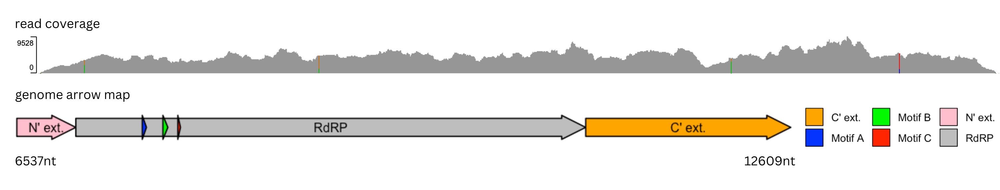
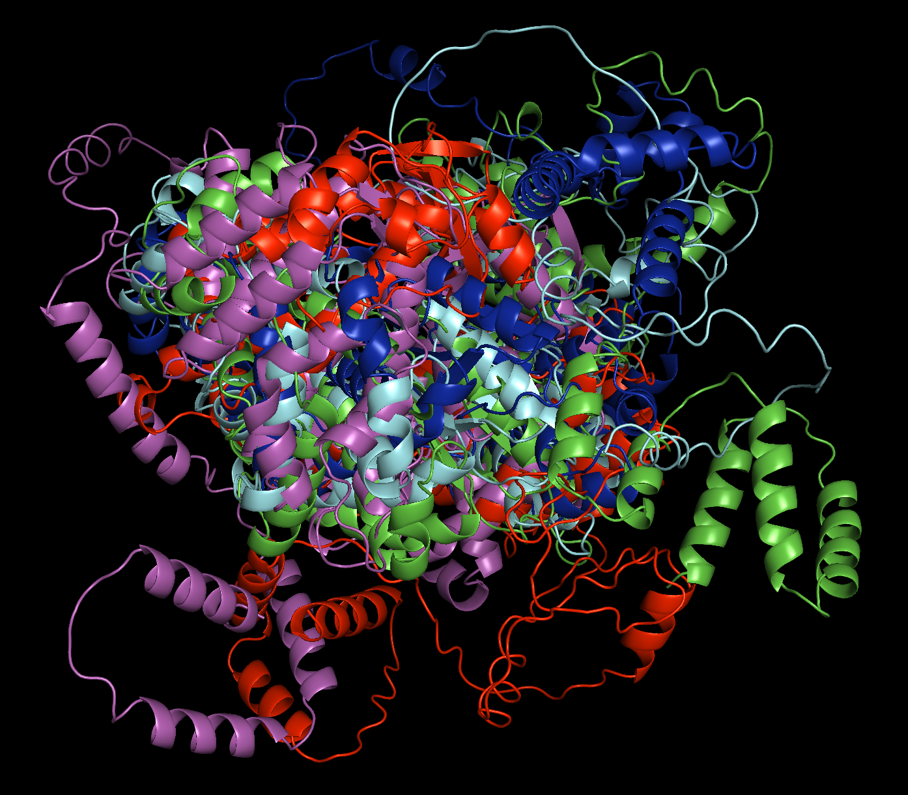

# A Novel RNA Virus Discovered in Macaca mulatta Gut Microbiome
written by: [Janette Lau](https://github.com/janettelau)

### Blumevirus macaceinfi
The Latin binomial name "Blumevirus macaceinfi" takes the family name Blumeviridae, which we uncovered that this virus belongs. Because this virus is found in Macaca mulatta and infectious, "macaceinfi" was chosen to combine both Macaca and the Latin word "inficere" which could mean to infect.

## Abstract

Having experienced the an outbreak in the past few years due to a novel strain of coronavirus, SARS-CoV-2, has taught us important lessons. It is important for us to discover novel viruses out there, understanding its virology, mechanisms, and characteristics, to prevent significant outbreaks from happening again. We identified a novel virus, Blumevirus macaceinfi, which belongs to the family Blumeviridae, a family made up of RNA viruses that infect prokaryotes. This virus is found in multiple sequence runs in the BioProject of a study on idiopathic chronic diarrhea (ICD) in Macaca mulatta by examing the rhesus monkey feces, as well as other studies that sampled the rectum tissue of Macaca mulatta. To uncover details about its features and potential structure, we used multiple online tools, sequencing alignments, and coding to generate plots and structures for analysis. Our results revealed that B. macaceinfi is found in Macaca mulatta feces and rectum tissue, therefore is highly likely to be present in the gut microbiome. Due to the environment the virus is found in and it belongs to the family Blumeviridae, we proposed that it likely infects a bacteria, but at this point, we have not identified it being the cause of any known disease. We anticipate our results to open more doors to the exploration of B. macaceinfi, understanding its potential hosts, bacteriophage mechanism, modes of transmission, and whether it poses any threat to our biological system.

## Results

### Discovered in Rhesus Monkey Fecal Sample

Our index case was published in the paper "Fecal metatranscriptomics of macaques with idiopathic chronic diarrhea reveals altered mucin degradation and fucose utilization" by Westreich ST et al., published in Microbiome [Westreich ST et al. 2019]. The index case was generated by researchers from the Genome Center at University of California, Davis, which is a run from an experiment of a study. The virus, B. macaceinfi, is found in a few others datasets published with this paper. The samples are feces taken from the Macaca mulatta gut microbiome, which might be infecting bacteria in the fecal sample of this group of rhesus monkeys. Our index case is found in all six technical replicates of macaque24_control. B. macaceinfi is also found in many other biological replicates in the same publication, including samples from control groups 13, 20 and 22, as well as samples from the ICD treatment groups 2, 3 and 5.

### A Common Factor Between Samples Across Studies — In or Close to the Gut
Apart from the publication referred to in the preceding section, was also identified in samples from other studies. An observed commonality between samples that had the virus is that they were from or obtained close to the gut of the Rhesus monkey Macaca mulatta.

One dataset was obtained from the paper "Macrophage-associated wound healing contributes to African green monkey SIV pathogenesis control." by Barrenas F et al., where they isolated the sample from the rectum tissue of Rhesus Macaque in the control group [Barrenas F et al. 2019]. Although not directly looking at microbial levels, the rectum is connected to the colon, which might have similar micriobiome composition as the fecal sample in the ICD study above. Similarly, in another paper, "IFN-α blockade during ART-treated SIV infection lowers tissue vDNA, rescues immune function, and improves overall health." by Swainson LA et al., the sample that contained the virus was obtained via rectal biopsy, which is taking a small tissue sample from the rectum [Swainson LA et al. 2022]. A third paper named "Virome biogeography in the primate lower gastrointestinal tract" by Zhao G et al. also had a sample obtained from male stool in which the virus was present [Zhao G et al. 2018].

The samples mentioned above are 27 out of the total 28 sample runs that had the sequence of B. macaceinfi.

### Looking Into Potential Hosts
The sample that has not yet been mentioned is a viral sample from Influenza A virus, bulked with additional monkey RNA. It is slightly different from the other samples as the sample is not directly sourced from the gut or rectum, instead, it is a Influenza A sample amongst the list of viruses included in the target enrichment panel of the study "Enrichment post-library preparation enhances the sensitivity of high-throughput sequencing-based detection and characterization of viruses from complex samples" [Paskey AC et al. 2019]. What relates it to the other sequenced runs we have identified is that monkey RNA was added to the sample, and the lab host used were Vero cells, a common cell line extracted from the kidney of an African green monkey [Ammerman NC et al. 2008]. This ties back to the common factor among samples, its relatedness to monkeys.

Basedo on observations across all the samples with the presence of B. macaceinfi, there is a high chance that gut microbiota of these rhesus monkeys are a potential host. With that prediction, we also looked at Figure 3 in the publication associated with our index case, which shows the relative gene expression level across all 24 samples. We identified a few common types of bacteria in both the control and ICD treated samples, which are Prevotella, Bacteroides, Megasphaera, Clostridium, Ruminococcus, Eubacterium, and other less expressed bacteria [Westreich ST et al. 2019]. Further research on whether these bacteria are host cells of B. macaceinfi could be of significant impact.

### A Close Relative of Leviviridae sp.
Based on results generated using the blastx tool in NCBI, our novel virus is most closely related to the virus Leviviridae sp., with a percent identity of 44.54% to its RdRP protein based off a Third Party Annotation (TPA), and a percent identity of 42.66% to the whole RdRP protein. Leviviridae sp. also belongs to the family Blumeviridae, however, because B. macaceinfi and Leviviridae sp. are only related on the class level, it is not extremely significant in terms better understanding our novel virus. More details confirming the structure and particular features of B. macaceinfi are required to further categorize it into the most suitable genus.

### Virus Genome



Figure 1. The read coverage visualization graph was generated using the Intergrative Genomics Viewer (IGV) [Robinson JT et al. 2011]. The read coverage map show how similar the aligments were to the reference genome, the nucleotide sequence of our node. Higher peaks indicate regions with more sequencing reads, or read depth. We can see that the coverage varies quite a bit throughout, with only four positions where nucleotides are conserved across multiple reads. The coverage being not really uniform suggests there might be sequencing biases.
The genome arrow map was generated with the R code below [Wilkins D. 2023]. The "positions_df" data frame includes the positions calculated relative to the entire contig of length 4360 amino acids, hence we derived that the contig is 13080 nts long. Based on ORF3 start and end positions obtained from ORFfinder search, we calculated the positions of the motifs ABC, and multiplied all these positions by 3 to account for amino acid to nucleotide change. The relative positions were then calculated and inputted into the data frame for plotting.

### Virus RdRP Structure



Figure 2. Cartoon protein structure generated using Pymol. [Schrödinger L. 2020].

## Discussion

Throughout the discovery of B. macaceinfi, we have learned about the close relatives of B. macaceinfi, the characteristics of viruses in the same class, commonality as the virus is found in the gut of Macaca mulatta, and potential bacterial host cell candidates. We generated its genome map and 3D structures with multiple tools to get a better understanding of its RdRP, motifs, and sequence alignments. Our findings revealed that B. macaceinfi is likely present in the gut microbiome and might infect bacteria. An interesting fact is that this virus belongs to a family that is characterized as infecting prokaryotes, therefore we assumed it to be found in bacterial samples or correlated with bacteria expression levels. However, it is not evident yet as of the research done until now, and the samples mostly point towards sharing a sample obtained from or near the gut of the rhesus monkey Macaca mulatta. We are excited about developing a deeper understanding of its potential hosts, bacteriophage mechanism, modes of transmission, and whether it would be a threat to us in the future.

## References

Ammerman NC, Beier-Sexton M, Azad AF. (2008). Growth and maintenance of Vero cell lines. Current protocols in microbiology, Appendix 4, Appendix–4E. https://doi.org/10.1002/9780471729259.mca04es11

Babaian A, Edgar R. 2022. Ribovirus classification by a polymerase barcode sequence. PeerJ 10:e14055 https://doi.org/10.7717/peerj.14055

Barrenas F, Raehtz K, Xu C, Law L, Green RR, Silvestri G, Bosinger SE, Nishida A, Li Q, Lu W, Zhang J, Thomas MJ, Chang J, Smith E, Weiss JM, Dawoud RA, Richter GH, Trichel A, Ma D, Peng X, Komorowski J, Apetrei C, Pandrea I, Gale M, Jr. (2019). Macrophage-associated wound healing contributes to African green monkey SIV pathogenesis control. Nature communications, 10(1), 5101. https://doi.org/10.1038/s41467-019-12987-9

Callanan J, Stockdale SR, Adriaenssens EM, Kuhn JH, Rumnieks J, Pallen MJ, Shkoporov AN, Draper LA, Ross RP, Hill C. (2021). Leviviricetes: expanding and restructuring the taxonomy of bacteria-infecting single-stranded RNA viruses. Microbial genomics, 7(11), 000686. https://doi.org/10.1099/mgen.0.000686

Hulo C, Castro E de, Masson P, Bougueleret L, Bairoch A, Xenarios I, Mercier PL. (2010). ViralZone: a knowledge resource to understand virus diversity. Nucleic Acids Research, 39(suppl_1), D576–D582. https://doi.org/10.1093/nar/gkq901

Lefkowitz EJ, Dempsey DM, Hendrickson RC, Orton RJ, Siddell SG, Smith DB. Nucleic Acids Res. (2017). Virus taxonomy: the database of the International Committee on Taxonomy of Viruses (ICTV). Nucleic Acids Research, 46(D1), D708–D717. https://doi.org/10.1093/nar/gkx932

Mirdita M, Schütze K, Moriwaki Y, Heo L, Ovchinnikov S, Steinegger M. (2022). ColabFold: making protein folding accessible to all. Nat Methods, 19, 679–682. https://doi.org/10.1038/s41592-022-01488-1

National Center for Biotechnology Information (NCBI)[Internet]. Bethesda (MD): National Library of Medicine (US), National Center for Biotechnology Information; (1988). Available from: https://www.ncbi.nlm.nih.gov/

Paysan-Lafosse T, Blum M, Chuguransky S, Grego T, Pinto BL, Salazar GA, Bileschi ML, Bork P, Bridge A, Colwell L, Gough J, Haft DH, Letunić I, Marchler-Bauer A, Mi H, Natale DA, Orengo CA, Pandurangan AP, Rivoire C, Sigrist CJA, Sillitoe I, Thanki N, Thomas PD, Tosatto SCE, Wu CH, Bateman A. (2022). InterPro in 2022. Nucleic Acids Research, 51(D1), D418–D427. https://doi.org/10.1093/nar/gkac993

Paskey AC, Frey KG, Schroth G, Gross S, Hamilton T, Bishop-Lilly KA. (2019). Enrichment post-library preparation enhances the sensitivity of high-throughput sequencing-based detection and characterization of viruses from complex samples. BMC genomics, 20(1), 155. https://doi.org/10.1186/s12864-019-5543-2

Robinson JT, Thorvaldsdóttir H, Winckler W, Guttman M, Lander ES, Getz G, Mesirov JP. (2011). Integrative genomics viewer. Nature biotechnology, 29(1), 24–26. https://doi.org/10.1038/nbt.1754

Schoch CL, Ciufo S, Domrachev M, Hotton CL, Kannan S, Khovanskaya R, Leipe D, Mcveigh R, O'Neill K, Robbertse B, Sharma S, Soussov V, Sullivan JP, Sun L, Turner S, Karsch-Mizrachi I. (2020). NCBI Taxonomy: a comprehensive update on curation, resources and tools. Database : the journal of biological databases and curation, 2020, baaa062. https://doi.org/10.1093/database/baaa062

Schrödinger L, DeLano W. (2020). PyMOL. Retrieved from http://www.pymol.org/pymol

Swainson LA, Sharma AA, Ghneim K, Ribeiro SP, Wilkinson P, Dunham RM, Albright RG, Wong S, Estes JD, Piatak M, Deeks SG, Hunt PW, Sekaly RP, McCune JM. (2022). IFN-α blockade during ART-treated SIV infection lowers tissue vDNA, rescues immune function, and improves overall health. JCI insight, 7(5), e153046. https://doi.org/10.1172/jci.insight.153046

Westreich ST, Ardeshir A, Alkan Z, Kable ME, Korf I, Lemay DG. (2019). Fecal metatranscriptomics of macaques with idiopathic chronic diarrhea reveals altered mucin degradation and fucose utilization. Microbiome, 7(1), 41. https://doi.org/10.1186/s40168-019-0664-z

Wilkins D. (2023). Introduction to ‘gggenes’. https://cran.r-project.org/web/packages/gggenes/vignettes/introduction-to-gggenes.html

Zhao G, Droit L, Gilbert MH, Schiro FR, Didier PJ, Si X, Paredes A, Handley SA, Virgin HW, Bohm RP, Wang D. (2019). Virome biogeography in the lower gastrointestinal tract of rhesus macaques with chronic diarrhea. Virology, 527, 77–88. https://doi.org/10.1016/j.virol.2018.10.001

# Viral Short Story

```
"Knock knock."
The laboratory room was pitch-black, but one of the machines were running. That's strange. Your fellow researcher should be here at this time. You sent a text and turned on the lights, then got back to serious work. Priorities first, you run the nucleotide sequence through BLASTX. The first result popped up, 44.54% percent identity. It sent shivers down your spine. The virus seems to be a close kin to a vicious one, Leviviridae sp., a Levi-like virus. It might have adapted and evolved into a more complex structure. As you read on about its taxonomy, that the Blumeviridae is a family of viruses that infect prokaryotes, you heard a squeaky sound, and the all the lights went off. A voice echoed in the room, "Now stop where you are reading." You breathed heavily. Something felt like a cold hand pinched your back. The next line read fecal metatranscriptomes had decreased diversity, and the voice went on, "and the same might happen to the human population."
```