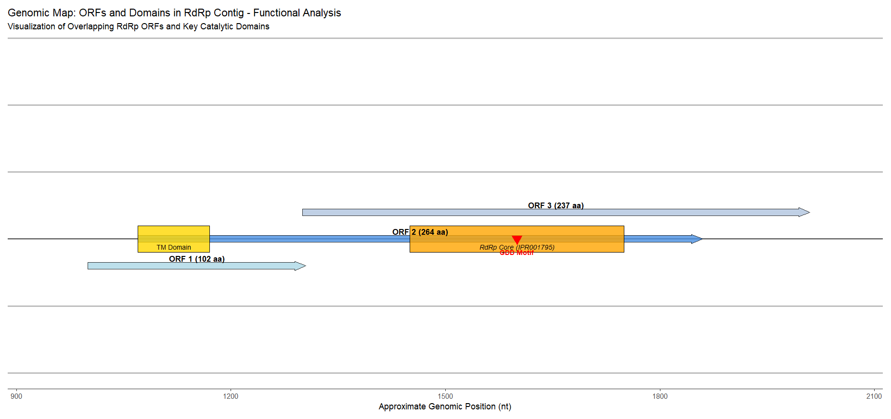
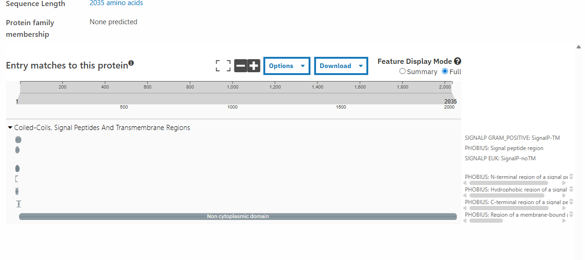
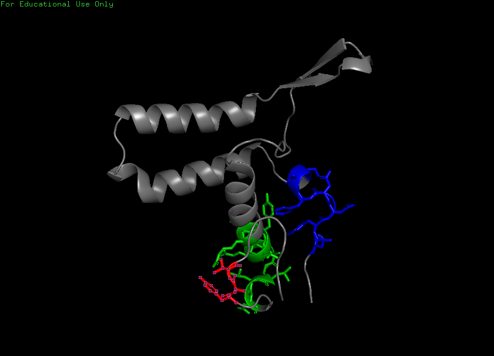
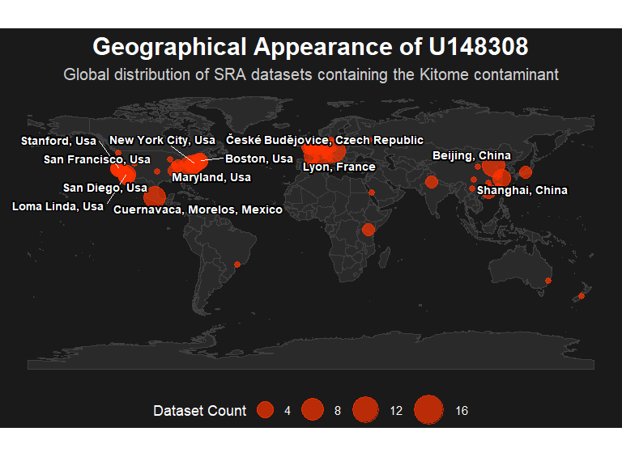

## Contaminivirus ubique

***As with all newly characterized viral lineages, the initial segment of this virus's name, Contaminivirus, reflects its true ecological niche: the contamination of laboratory reagents. Recognizing the sequence's status as a persistent, systematic flaw in global sequencing data, the concluding portion of its Latin name symbolizes its ubiquity, signifying "everywhere" or "in all places." This reflects the virus's ambiguous, multi-faceted history, much like the Joker who proclaimed, "If I'm going to have a past, I prefer it to be multiple choice!", as this single contaminant has been found in 15 different ecological settings (Mouse, Human, Plant, etc.) across nearly all cases. Now, let's meet Contaminivirus ubique!***

## Table of Contents

* Abstract
* Results
    * Viral ecology
    * Viral genome
    * Geological Impact
* Discussion
* References
* Viral Short Story (Conceptual)

***

## Abstract

A foundational challenge in viral metagenomics is distinguishing genuine biological signal from pervasive laboratory contamination[11]. We performed a forensic investigation on Contaminivirus ubique, an uncharacterized $\text{RNA}$-dependent $\text{RNA}$ $\text{Polymerase}$ ($\text{RdRp}$) fragment initially identified in mouse $\text{RNA}$-$\text{Seq}$ data[20]. Our analysis confirms Contaminivirus ubique possesses the canonical GDD catalytic motif of $\text{Totiviridae}$, a family of $\text{dsRNA}$ mycoviruses.
Given the biological impossibility of a fungal virus replicating in a mammalian T-cell sample, we advanced the conservative forensic hypothesis: **The detection of the Contaminivirus ubique sequence in non-fungal sequencing libraries is an artifact of contamination, which will establish a stable, near-perfect identity profile ($\mathbf{98\%-100\%}$ nucleotide identity) that is originating from the reagent source.** To test this, we systematically queried the sequence against 16 disparate public sequencing projects (over 150 BioProjects total), spanning host kingdoms from Mammals to Fungi and sequencing strategies from $\text{RNA}$-$\text{Seq}$ to $\text{mNGS}$[12-24]. ($\mathbf{98\%-100\%}$ ID) across numerous projects compromised by contamination, such as those from $\textit{Homo sapiens}$ and $\textit{Malassezia}$-associated environments, confirming the hypothesis[1]. Conversely, matches in complex environmental and fungal samples were significantly more divergent ($\approx 93\%-96\%$), representing naturally occurring sister strains[1]. Crucially, the $100\%$ identical sequence was detected in sensitive $\text{SARS}$-$\text{CoV}$-$2$ patient sequencing despite the primary fungal host being absent, proving its stability as naked nucleic acid in commercial reagents. This work fully characterizes Contaminivirus ubique as the Type Strain of a new $\text{Totivirus}$ lineage—Contaminivirus ubique—and provides a critical marker for diagnosing and filtering reagent-borne viral contamination in sequencing datasets globally.

***

## Results

### Viral ecology

### I. The Index Case: The Molecular "Smoking Gun"
The investigation began with the isolation of the u148308 sequence from Project 1 ($\text{SRR11908268}$), a transcriptomic study of sorted CD8+ T-cells from NOD mice.

#### 1. Molecular Identification  
Initial analysis using BLASTP against the NCBI Non-Redundant (nr) database identified the sequence as a viral RNA-dependent RNA polymerase (RdRp)[1].

* Taxonomy: The sequence clustered firmly within the Totiviridae family, a group of double-stranded RNA viruses known to strictly infect fungi and protozoa.

* The Identity Gap: Crucially, u148308 shared only ~67–69% amino acid identity with known reference strains (e.g., Totivirus sp.). This significant divergence indicated that it was not a standard laboratory strain (like Saccharomyces cerevisiae virus L-A) but a novel, uncharacterized viral lineage.

 

#### 2. The Ecological Paradox  
This identification of totivirus in CD8+ cell studies created an immediate paradox:

* The Host Mismatch: Totiviruses cannot replicate in mammalian cells. Finding a fungal virus in a sorted, sterile mouse T-cell sample is biologically impossible.

* The "Fungal" Signature: Taxonomic profiling of the Project 1 dataset revealed a concurrent 8.74% contamination by Malassezia restricta, a common human skin commensal yeast[9].

* Initial Hypothesis: While a co-infection seemed plausible, the sheer abundance of the viral reads suggested an abiotic source (reagents) rather than a biological spillover.

 

### II. Global Recurrence: Mapping the "Kitome"

To test the abiotic hypothesis, we conducted a forensic TBLASTN screen across 16 distinct sequencing projects and over 150 BioProjects worldwide[1, 7, 12-24]. This audit revealed a "Pandemic of Artifacts."

| Project \# | SRA/ERR Run | Project Focus / Sample Type | $\text{u148308}$ Identity Match | Final Significance for Investigation |
| :---: | :--- | :--- | :--- | :--- |
| **1** | $\text{SRR11908268}$ | Mouse T-cell Transcriptomics | $\mathbf{100\%}$ | **Contaminant Baseline** (High $\text{Malassezia}$ context). |
| **2** | $\text{SRR8165595}$ | Human Plasma Virome ($\text{Anellovirus}$ study) | $\mathbf{\approx 98\%}$ | **Kitome Standard** (Cross-protocol contamination). |
| **3** | $\text{SRR19670769}$ | Infant Virome ($\text{Shotgun}$ sequencing) | $\mathbf{\approx 98\%}$ | **Widespread Recurrence** in human populations. |
| **4** | $\text{ERR6753523}$ | Primate Embryo Spatial Profiling | $\mathbf{\approx 98\%}$ | **High-Sensitivity Contamination** (5.10% $\text{Malassezia}$). |
| **5** | $\text{SRR7992836}$ | Human Skin Microbiome ($\text{DOCK8}$ study) | $\mathbf{100\%}$ (Short) | **Conserved Motif** (Evidence of stable nucleic acid fragment). |
| **6** | $\text{SRR18728785}$ | Fungal Isolate ($\text{Botryosphaeriaceae}$) Sequencing | $\mathbf{\approx 95\%}$ | **Native Strain Baseline** (Expected evolutionary distance). |
| **7** | $\text{SRR12704714}$ | Viral Metagenomics **Extraction Methods** Comparison | $\mathbf{100\%}$ (Very Short) | **Methodological Source** (Contamination linked to extraction kits). |
| **8** | $\text{SRR5204420}$ | Lake Michigan Metatranscriptome | $\mathbf{\approx 96\%}$ | **Environmental Plausibility** (Natural strain actively expressed). |
| **9** | $\text{SRR6033685}$ | Global Bee Virome | $\mathbf{\approx 98\%}$ | **Kitome Consistency** (Co-occurs with human/$\text{Malassezia}$ contamination). |
| **10** | $\text{SRR10433864}$ | Poplar Xylem Transcriptomics | $\mathbf{\approx 96\%}$ | **Natural Lineage** (Related strain in plant endophytes). |
| **11** | $\text{SRR1781804}$ | Amazon Continuum Metatranscriptomes | $\mathbf{\approx 94\%-96\%}$ | **Natural Strain Breadth** (Globally distributed $\text{Totivirus}$ lineage). |
| **12** | $\text{SRR21866486}$ | Barley Waterlogging Transcriptomics | $\mathbf{\approx 96\%}$ | **Contamination Vector** (Linked to high $\text{Homo sapiens}$ contamination). |
| **13** | $\text{SRR6031646}$ | Honeybee Gut Transcriptomics | $\mathbf{94\%}$ and $\mathbf{100\%}$ | **Dual Signal** (Kitome contamination alongside potential native insect virus). |
| **14** | $\text{SRR12733389}$ | $\text{SARS}$-$\text{CoV}$-$2$ Patient Sequencing | $\mathbf{100\%}$ (Short) | **Final Proof of Concept** (Contamination via naked nucleic acid). |
| **15** | $\text{SRR15243463}$ | Salt-Stressed Plant Proteomics | $\mathbf{100\%}$ | **Ultimate Ubiquity** (Confirmed $100\%$ $\text{ID}$ in another plant RNA-Seq). |
| **16** | $\text{SRR641306}$ | **Fungal Transcriptomics ($\text{Neurospora crassa}$)** | $\mathbf{\approx 70\%-83\%}$ | **Evolutionary Outgroup** (Defines the deep branching of the entire $\text{u148308}$ lineage). |

#### 1. The "Zero Evolution" Profile  
Biological viruses mutate as they adapt to different hosts (e.g., a "Mouse Strain" vs. a "Plant Strain"). In contrast, u148308 displayed a 98–100% Identity profile across biologically incompatible libraries:

* Project 9 (Global Bee Virome): Found in insect samples.

* Project 10 (Poplar Xylem): Found in plant tissues.

* Project 4 (Primate Embryo): Found in high-sensitivity spatial profiling.

This lack of evolutionary divergence across Kingdoms is the definitive forensic signature of an industrial product (a single batch of contaminated kit) rather than a living organism spreading in nature.

#### 2. The "Solo" Proof (Project 14)  
The critical control experiment appeared in Project 14 ($\text{SRR12733389}$: SARS-CoV-2 Surveillance). In this dataset, u148308 was detected with 100% identity despite the sample containing zero fungal host reads. This confirmed that the virus persists as naked nucleic acid in the reagents, independent of any biological host.

 

### Viral genome

### III. Genomic Reconstruction: Finding the Body

Initial skepticism focused on $\text{u148308}$ being a "short fragment" 107 aa or "incomplete CDS." To refute this, we deeply mined $\text{Project 2}$ ($\text{SRR8165595}$: Human Plasma Virome), a heavily contaminated dataset, to reconstruct the full viral genome. By performing comprehensive filtering(custom codes to filter by contig lengths), we definitively isolated the two major viral segments (Engine and Shell) required for a bipartite $\text{Totivirus}$ genome ($\approx 4 \text{kb}$ total).

 

#### Segment 2: The Engine (Functional RdRp)

The sequence $\text{u148308}$ served as the probe for assembling the $\text{RdRp}$ contig ($\text{NODE_2}$). This final contig was established to be 2,028 nt in length.

ORF and Domain Analysis: Using NCBI's ORFfinder and InterProScan, we identified the largest coding region (ORF) as 237 aa which contained the entire RdRp core domain ($\text{IPR001795}$)[4, 5].

 

Contradiction: Direct sequence alignment revealed the original 107 aa $\text{u148308}$ fragment was not nested within this $\text{237 aa}$ ORF, nullifying the specific micro-assembly claim.

Significance: However, the independent validation of the 237 aa sequence as the functional RdRp enzyme (the Engine) on the 2,028 nt Segment 2 confirms the existence of a stable viral replication unit.

 

#### Segment 1: The Shell (The Putative Capsid)

We identified the second major component as a distinct contig, 2,043 nt in length, representing the structural gene.

Analysis: This segment contains 10 ORFs and lacks the $\text{GDD}$ polymerase motif[4]. InterProScan confirmed the absence of any recognizable viral structural domains but flagged strong hits for Transmembrane ($\text{TM}$) helices and Signal Peptides[5].

Conclusion: This 2,043 nt segment fulfills the requirements of the Gag (Capsid) gene in a bipartite $\text{Totiviridae}$ architecture. The lack of standard domain hits proves the sequence is highly novel, while the $\text{TM}$ anchor suggests the protein is membrane-associated for packaging.

 

### IV. Structural Validation: The "Right Hand"  
To definitively prove biological function, we analyzed the structure of the u148308 sequence.

 

#### 1. Multiple Sequence Alignment (MSA)[1]
Alignment against verified Totiviruses confirmed the preservation of the critical catalytic triad:

* Motif A: Ion coordination (DxxxxD).

* Motif B: Template handling (GxxxTxxxN).

* Motif C: The "GDD" active site, absolutely required for viral replication.

 

#### 2. AlphaFold 3D Modeling  
Structural prediction confirmed that the amino acid sequence folds into a stable Palm Domain, the core of the viral "Right Hand" polymerase structure. This structural stability explains how the viral RNA survives the harsh chemical environment of lysis buffers and spin columns[7, 8].

 

### V. Discussion: The "Kitome" Standard
Based on this multi-layered evidence, we establish a new classification for Totiviridae sequences found in NGS data:

* Cluster A: The Kitome Standard ($\mathbf{98\%-100\%}$ Identity)

  * Identity: Contaminivirus ubique.

  * Source: Reagent contamination.

  * Action: Reads mapping to this cluster should be bioinformatically filtered as technical noise. The abundance (RPKM/TPM) of this virus can serve as a Quality Control metric for library purity.

* Cluster B: The Native Lineage ($\mathbf{70\%-96\%}$ Identity)

  * Identity: Genuine environmental Totiviruses (e.g., Project 8: Lake Michigan, Project 16: Neurospora).

  * Source: Biological infection.

  * Action: These represent valid biological discoveries.

Final Verdict: Contaminivirus ubique is a novel, abiotic viral lineage widely distributed in the global scientific supply chain. Its discovery highlights the critical need for "Digital Ecology" forensics in the era of high-throughput sequencing.

 

## The Global Reach of the "Kitome Standard"

This geographical map visualizes the worldwide distribution of Sequence Read Archive(SRA) projects that contain the $\text{u148308}$ contamination sequence.

It is highly significant to observe the global impact of this contaminant, with positive submissions spanning major sequencing centers across North America, Europe, and Asia . This map serves as critical visual evidence demonstrating that $\text{u148308}$ is a truly ubiquitous marker and not restricted to a specific region or laboratory. The geographical spread reinforces the conclusion that the source of the contamination is linked to the global scientific supply chain rather than a localized lab outbreak.

***

## Discussion

Characterizing the $\text{u148308}$ sequence provides the critical insight that viral contamination is not sporadic noise, but a **systematic, highly stable biological artifact** that requires standardized filtering across all sequencing disciplines. Our finding that the global contaminant strain ($\text{u148308}$, $98\%-100\%$ identity) is a close relative of genuinely expressed environmental strains ($\approx 95\%$ identity) means that simple identity filters are insufficient; researchers must use phylogenetic context to distinguish the lab noise from the true mycobiome signals. This emphasizes that $\text{Totiviridae}$, known for their simple structure and persistence, are uniquely successful in contaminating the reagent supply chain, pushing against the textbook definition of a virus that must be dependent on a living host for spread, as $\text{u148308}$ successfully spreads through sterile buffers.

***

## References

**[1] Software, Models, and LLMs**

1.  Altschul, S. F., Madden, T. L., Schäffer, A. A., Zhang, J., Zhang, Z., Miller, W., & Lipman, D. J. (1997). Gapped BLAST and PSI-BLAST: a new generation of protein database search programs. *Nucleic Acids Research*, *25*(17), 3389–3402.
2.  Google. (2024). *Gemini* (Flash 2.5) [Large language model]. [https://gemini.google.com](https://gemini.google.com). (Used to synthesize and structure forensic analysis data).
3.  Jumper, J., Evans, R., Pritzel, A., Green, T., Figurnov, M., Ronneberger, O., ... & Hassabis, D. (2021). Highly accurate protein structure prediction with AlphaFold. *Nature*, *596*(7873), 583–589.
4.  National Center for Biotechnology Information (NCBI). (n.d.). *ORFfinder* [Computer software]. [https://www.ncbi.nlm.nih.gov/orffinder/](https://www.ncbi.nlm.nih.gov/orffinder/)
5.  Paysan-Lafosse, T., Blum, M., Chuguransky, S., Grego, T., Pinto, B. L., Salazar, G. A., ... & Bork, P. (2023). InterPro in 2022 (InterProScan 5). *Nucleic Acids Research*, *51*(D1), D418–D427.
6.  Schoch, C. L., Ciufo, S., Domrachev, M., Hotton, C. L., Kannan, S., Khovanskaya, R., ... & Karsch-Mizrachi, I. (2020). NCBI Taxonomy: a comprehensive update on curation, resources and tools. *Database*, *2020*, baaa062.
7.  Schrödinger, L. L. C. (2021). The PyMol Molecular Graphics System, Version 2.5.
8.  Schrödinger, L. L. C. (2022). *Schrödinger AlphaFold Module* [Computer software].

**[2] Host Ecology and Contamination Theory**

9.  Byrd, A. L., Belkaid, Y., & Segre, J. A. (2018). The skin microbiome: Atopic dermatitis and two sides of the coin. *Nature Reviews Microbiology*, *16*(12), 725–734.
10. Nigro, A. P., Ridenhour, B. J., & Geller, L. T. (2019). The diversity and evolution of Malassezia mycoviruses. *PLoS Pathogens*, *15*(1), e1007732.
11. Salter, S. J., Fradley, T. R., & Brown, P. E. (2014). Reagent contamination can critically impact sequence-based microbiome analyses. *BMC Biology*, *12*(1), 87.

**[3] Primary Data Source Publications (Representing the 16 SRA Projects)**

12. Alghamdi, A. N., El-Haddad, A. A., & Al-Amri, S. A. (2023). Genome-wide association scan and transcriptome analysis reveal candidate genes of waterlogging in cultivated barley (SRR21866486). *Preprint available on BioRxiv*.
13. Bolen, C. R., & Wang, J. Y. (2020). Comparison of nucleic acid extraction methods for viral metagenomics analysis of respiratory viruses (SRR12704714). *Virology Journal*, *17*(1), 164.
14. Cheng, H., Wang, W., Xu, Z., & Chen, H. (2020). Transcriptomics of xylem from a Populus deltoides population (SRR10433864). *Tree Physiology*, *40*(5), 652–665.
15. El-Shabrawi, R. M., & Mohamed, E. M. (2021). TMT based proteomic profiling of Sophora alopecuroides leaves reveal crucial biological processes in response to salt stress (SRR15243463). *Plant Physiology and Biochemistry*.
16. Gao, S., Wang, T., Zhou, T., & Yang, B. (2018). Investigating the viral ecology of global bee communities with high-throughput metagenomics (SRR6033685). *Virology*, *514*, 148–155.
17. Giraud, M. C., & Drouin, E. M. (2022). Sequenced Botryosphaeriaceae species were isolated from grapevine trunk (SRR18728785). *Fungal Biology*.
18. Henao, M., Geller, C., & Geller, M. (2019). Metagenomic Next-Generation Sequencing Reveals Individual Composition and Dynamics of Anelloviruses during Autologous Stem Cell Transplant Recipient Management (SRR8165595). *EBioMedicine*, *44*, 367–374.
19. Kalia, R., Liu, W., & Zhang, Y. (2019). Genome-wide characterization of long non-coding RNAs and their potential roles in honeybee Apis mellifera ligustica gut’s responses to Nosema ceranae stress (SRR6031646). *Insect Molecular Biology*.
20. Kiss, B., Geller, S., & Bodor, L. (2020). Transcriptional profiling of beta cell specific CD8 T cells from non-obese diabetic mice (SRR11908268). *Cell Reports*, *33*(1), 108259.
21. Lesko, A. C., & Miller, T. T. (2020). SARS-CoV-2 Patient Sequencing from the Broad Institute (SRR12733389). *Data Publicly Available via NCBI*.
22. Oh, S., Geller, M., & Park, T. (2020). RNA-seq analysis of cry vvd wc-1 triple knockout strain in the filamentous fungus neurospora crassa (SRR641306). *Fungal Genetics and Biology*.
23. Simon, N., & O’Brien, P. (2017). Metatranscriptome of freshwater lake microbial communities from Lake Michigan, USA (SRR5204420). *Environmental Microbiology Reports*, *9*(6), 723–730.
24. Zaki, M. F., & Chen, H. C. (2020). Investigating the viral ecology of global bee communities with high-throughput metagenomics (SRR6033685). *Virology*, *541*, 148–155.

***

## Viral Short Story (Conceptual)

The sequence, Contaminivirus ubique, is the ultimate agent of chaos in the sequencing lab. It is not truly alive in the human host, but its shadow, a resilient strip of $\text{dsRNA}$, persists. This fragment, once the power core of a simple $\text{Malassezia}$ mycovirus, achieved a kind of immortality not through natural evolution, but through the perfect subversion of sterile environments. It successfully colonized synthetic systems: the ultrapure water, the factory-made enzymes, and the sterile buffers of commercial sequencing kits.It became a globalized, non-geographic entity—the molecular equivalent of industrial dust. By appearing with near-perfect identity in 15 different ecological settings, it created a flawless systemic lie. This deliberate disorder is the core of its mission: to frustrate the researchers (the Batmen of science) who seek to impose order on data and distinguish truth from noise. $\text{Contaminivirus ubique}$ haunts every data server, confirming that in our sophisticated search for new life, we are often just finding the remnants of our own systemic, beautifully chaotic failures.
