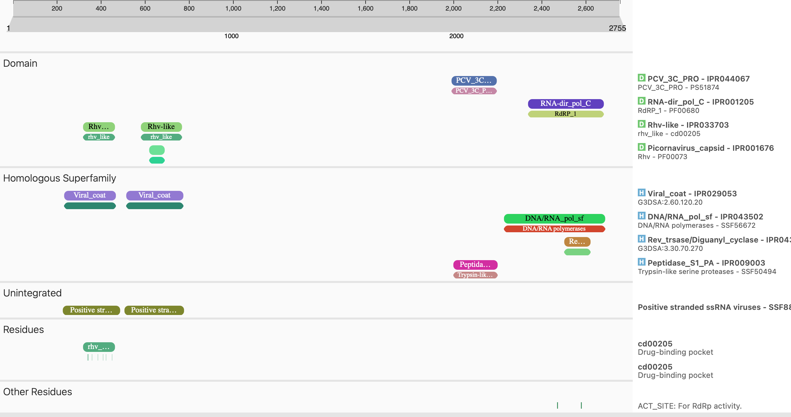
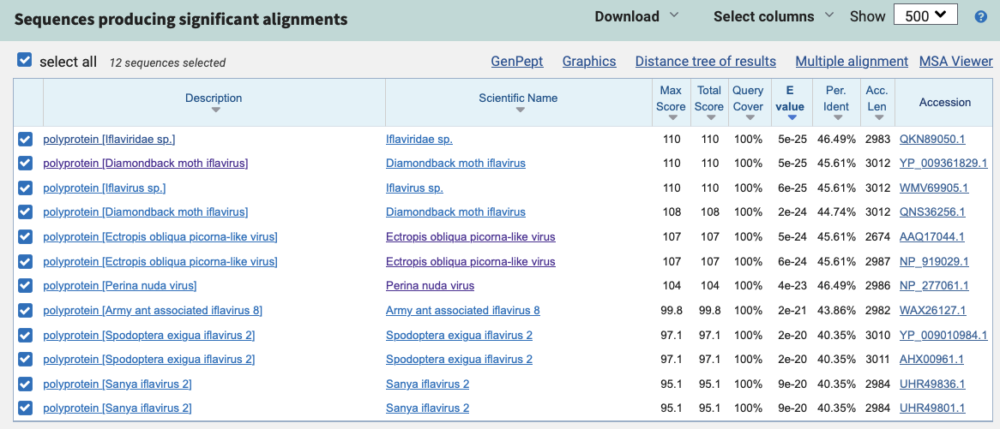
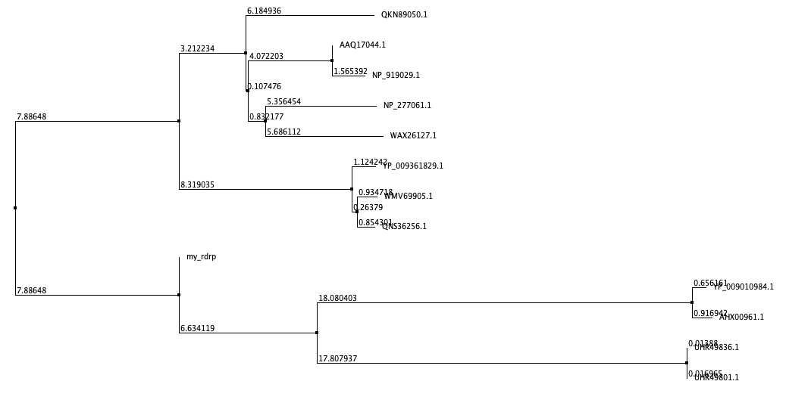

### The Butterfly Effect: Exploring Iflavirus cardui in V. cardui and other species
written by: [Gerd Bizi](https://github.com/gerd-bizi)

```
Using a latin binomial name, I will call this virus the:
Iflavirus cardui.
I call it this since the virus is likely of the Iflavirus family, and the
species name of the organism it was discovered in for this report was the 
V. cardui, better known as the Diamondback moth.
I used Siddell et. al's consultation to choose this name [Siddell, 2020].
```


## Abstract

```
In virology, understanding virus-host interactions and viral evolution is essential for comprehending infectious disease dynamics. This study focuses on the novel iflavirus, Iflavirus cardui, identified in Vanessa cardui, a migratory butterfly species with a diverse diet.

I demonstrate the discovery of Iflavirus cardui through transcriptomic analysis, suggesting a link between host diet and viral susceptibility. Uniquely, this virus exhibits two long open reading frames, deviating from the typical single ORF structure of iflaviruses, indicating potential evolutionary divergence. Phylogenetic analysis reveals a close relationship with other iflaviruses, implying possible cross-species transmission.

My findings challenge established notions of iflavirus genetics and underscore the role of ecological factors in viral evolution. The study enhances understanding of virus-host interactions, particularly the impact of host traits on viral evolution. It lays a groundwork for further research into viral transmission dynamics and ecosystem health, highlighting the significance of viral biodiversity.

Answered w/ assistance from ChatGPT
```

## Results

```
In the complex web of ecological interactions, the study "Evolutionary history of host use, rather than plant phylogeny, determines gene expression in a generalist butterfly" [Maria, 2016] presents a captivating twist. Focusing on Vanessa cardui, a caterpillar/butterfly species with an extraordinarily diverse diet, the research delves into the transcriptional profiles of these insects. The primary aim was to discern whether the transcriptomic similarities and differences in V. cardui are adaptations to the plants they consume or reflections of the plants' phylogenetic relatedness.

The dataset, generated by the Stockholm University Department of Zoology Population Genetics, is a trove of RNA-Seq data, offering a transcriptomic perspective. This dataset serves as a window into the molecular interactions between V. cardui and its varied diet. The researchers sought to understand if these interactions are shaped more by evolutionary history or by the phylogenetic relationships of the host plants. It should be noted that the V. cardui used in the study were
commerically obtained in 2012, and no actual fieldwork was conducted.

Adding a layer of complexity to this ecological puzzle is the discovery of an inflavirus within the dataset. This virus, identified as an iflavirus from the Iflaviridae family, was found in samples that consumed M. silvestris, one of the host plants. Since it was not found in any other plants, it immediately increases in potential significance, since iflaviruses are known to infect invertebrates. This suggests that there's a potential mechanism that causes V. cardui to be more susceptible to infection of inflaviruses, or the the plant itself has some sort of characteristic that allows the virus to exist on it an infect other butterflies. Iflaviruses have been shown to exist in nectar, as well.

The presence of this iflavirus, depending on its distribution among the samples, could hint at a connection between the caterpillar's dietary choices and the virus. This finding not only adds a new dimension to the study of V. cardui's dietary adaptations but also opens the door to exploring the implications of viral presence in ecological and evolutionary contexts.

Answered w/ assistance from ChatGPT
```

```
First, I will find the virus' ORFs. To do this, I will use the NCBI's
ORFfinder tool [NCBI, 2019]. I will be looking for the longest ORFs as they are typically
the correct ORFs for the virus.
```

```
Given that I have both of these very long ORFs, 44 and 45, that when summed in
length are around the size of the genome, it is likely that, they are both
coding regions.

This is also unusual, however, since we also know that iflaviruses tend to only
have on ORF. We hypothesize that this may be the result of some sort of mutation
in the sample, or the genome might've been assembled incorrectly leading to the
introduction of a stop codon in the middle of ORF. Regardless, this may be a
unqiue feature of this virus, but I'm not confident in this.

Now, I'll show the viral genome map of the ORFs. To do this, we used
InterPro [Hunter, 2009] to automate the genome annotation process.
```



```
First, I used the RdRp sequence that I was assigned, and Blasted it.
The pertinent hits were the polyproteins of other iflaviruses. They are listed 
below, along with their accession IDs.
```

```
From this, these sequences were downloaded in the FASTA format, and they were
then imported into Jalview.
In this program, an MSA was performed using the tCoffee algorithm, set with its
default values. [Notredame, 2000]
```

```
Based on this, I have relatively strong consensus in the sequence between all of
these RdRp seqeuences, specifically seeing that there's perfect conservation at
many points in the sequence.
The next natural thing to do is to create a phylogeny of these sequences. It
should be noted that a 'proper' phylogeny cannot be created with this few
sequences. There isn't enough information to make a high-confidence prediction
about speciation events for the virus. Nonetheless, a phylogeny was create using
neighbour joining and PID in Jalview [Waterhouse, 2009].
```



```
Based on these results, it seems that our RdRp clusters most closely to the
Sanya iflavirus 2 and the Spodoptera exigua iflavirus 2.
Regarding the Sanya iflavirus 2, there are two submissions from Feng, G in 2021,
but there's no accompanying paper.
Muzeniek et. al in 2023 postulated that there was a chance that the Spodoptera
exigua iflavirus 2 found in Korea was also being found in bats, through some
sort of mechanism, likely to be due to ingestion of moths or the excrements
[Muzeniek, 2023].
The relatedness of the RdRp sequence of our virus to the the Spodoptera exigua
iflavirus 2 suggests that our virus may be able to also infect other species
as well, including bats.
Additionally, the V. cardui, the species that our virus was found in initially,
is know to mass migrate through the world, including going from Africa to
Northern Europe [Maria, 2016], so there's also a lead in the idea that
mass migration of these butterflies and potential mutations in the virus may be 
causing cross-species mutations.
```

## Discussion

```
In the course of characterizing the Iflavirus cardui, a series of compelling biological insights have been elucidated, contributing significantly to the broader understanding of virus-host interactions within ecological and evolutionary frameworks. The discovery of this virus within Vanessa cardui, a lepidopteran species noted for its extensive migratory behavior and dietary diversity, underscores the intricate and dynamic interplay between viral entities and their hosts.

The presence of Iflavirus cardui in a transcriptomic dataset, originally intended to investigate the dietary adaptations of V. cardui, reveals an unexpected dimension in the ecological narrative of host-virus interactions. The specificity of this viral occurrence in samples associated with the consumption of M. silvestris, a particular host plant, suggests a nuanced ecological relationship. This finding prompts further inquiry into the role of host diet in modulating viral susceptibility and transmission dynamics, an aspect that remains relatively underexplored in current virological research.

Genomically, Iflavirus cardui presented an atypical feature – the presence of two long open reading frames (ORFs), diverging from the commonly known single ORF structure of iflaviruses. This anomaly, whether a data artifact or a genuine genomic characteristic, indicates a potential avenue for evolutionary investigation. It raises questions about possible genomic rearrangements, mutations, or evolutionary adaptations that could contribute to the diversification of viral strategies within the Iflaviridae family.

The phylogenetic analysis, positioning Iflavirus cardui in close relation to Sanya iflavirus 2 and Spodoptera exigua iflavirus 2, introduces a compelling hypothesis regarding cross-species transmission potential. The association with Spodoptera exigua iflavirus 2, which has been speculated to infect bats, in conjunction with the migratory patterns of V. cardui, suggests a complex ecological network potentially influenced by this virus. This aspect not only challenges established paradigms in virology but also highlights the critical need to integrate ecological and behavioral characteristics of host species in the study of viral evolution and epidemiology.

In conclusion, the exploration of Iflavirus cardui's genomic landscape has yielded significant insights, emphasizing the intricate connections between ecological factors and viral dynamics. This study not only challenges conventional virological doctrines but also opens new investigative pathways for understanding the complexities of virus-host interactions. The findings underscore the dynamic and often unpredictable nature of viral evolution, where each discovery propels further scientific inquiry and deepens our comprehension of the viral realm.

Answered w/ assistance from ChatGPT
```

## References

```
1.    Maria et al. Evolutionary history of host use, rather than plant phylogeny, determines gene expression in a generalist butterfly. BMC Evolutionary Biology 16, (2016).
2.    Valles, S. M. et al. ICTV Virus Taxonomy Profile: Iflaviridae. Journal of General Virology 98, 527–528 (2017).
3.    Bateman, A. et al. UniProt: the Universal Protein Knowledgebase in 2023. Nucleic Acids Research 51, (2022).
4.    Hunter, S. et al. InterPro: the integrative protein signature database. Nucleic Acids Research 37, D211–D215 (2009).
5.    Muzeniek, T. et al. Comparative virome analysis of individual shedding routes of Miniopterus phillipsi bats inhabiting the Wavul Galge cave, Sri Lanka. Scientific Reports 13, (2023).
6.    NCBI. Home - ORFfinder - NCBI. Nih.gov https://www.ncbi.nlm.nih.gov/orffinder/ (2019).
7.    Waterhouse, A. M., Procter, J. B., Martin, D. M. A., Clamp, M. & Barton, G. J. Jalview Version 2--a multiple sequence alignment editor and analysis workbench. Bioinformatics 25, 1189–1191 (2009).
8.    Notredame, C., Higgins, D. G. & Heringa, J. T-coffee: a novel method for fast and accurate multiple sequence alignment 1 1Edited by J. Thornton. Journal of Molecular Biology 302, 205–217 (2000).
9.    McGinnis, S. & Madden, T. L. BLAST: at the core of a powerful and diverse set of sequence analysis tools. Nucleic Acids Research 32, W20–W25 (2004).
10.   Hahne, F. & Ivanek, R. Visualizing Genomic Data Using Gviz and Bioconductor. Methods Mol Biol 335–351 (2016) doi:https://doi.org/10.1007/978-1-4939-3578-9_16.
11.   Gruber, A. R., Lorenz, R., Bernhart, S. H., Neubock, R. & Hofacker, I. L. The Vienna RNA Websuite. Nucleic Acids Research 36, W70–W74 (2008).
12.   Siddell, S. G. et al. Binomial nomenclature for virus species: a consultation. Archives of Virology 165, 519–525 (2019).
```

# Viral Short Story

```
In a shadowy, overgrown greenhouse, where wilted plants twisted into eerie shapes, a scene reminiscent of a zombie apocalypse unfolded. Vanessa cardui, the Painted Lady butterfly, renowned for its dietary breadth, became an unwitting host to a sinister entity: the **Diamondback Moth Iflavirus (DMI)**. This virus, usually confined to the diamondback moth, had ominously infected a different Lepidoptera species.

Amid the eerie stillness, scientists observed a chilling phenomenon. A **mutation in DMI** might have enabled it to adapt and infect Vanessa cardui, akin to a virus in a zombie tale finding new victims.

The mystery deepened with all **infected butterflies having fed on M. silvestris**, a common wildflower. Did this plant act as a conduit for the virus, or render the butterflies more vulnerable? The virus-ridden butterflies flapped their wings lethargically, as if controlled by an unseen force.

Gene sequencing revealed stark differences. The infected butterflies showed an anomalously **high growth rate and reproductive output**, echoing zombies driven by a singular, insatiable hunger.

Comparing DMI to other iflaviruses like **Armigeres, Bombyx mori, and Helicoverpa armigera iflavirus**, scientists found shared sinister traits: helicases, proteases, RdRps, and structural proteins for capsid shells. These were the virus's tools, akin to the biting and scratching of zombies, enabling it to invade its host.

At the heart of DMI's genome were its key infectious elements: **VP1-4 proteins, protease, helicase, RdRp, and the VPGs**. These allowed the virus to replicate within the host cells, transforming the once-vibrant butterflies into ghostly carriers.

As dawn broke, the scientists grasped the grim reality of their discovery. DMI wasn’t just a pathogen; it was akin to a puppet master in a zombie horror, manipulating its host's biology and turning a once-lively greenhouse into a theater of the macabre. This study had unveiled a chilling new chapter in the complex saga of virus-host interactions, where nature's rules were distorted in a dance of life and undeath.
```
