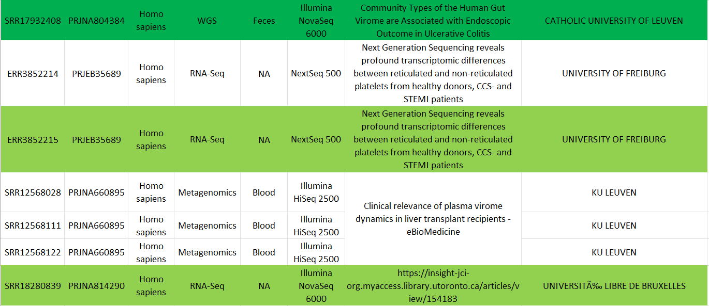
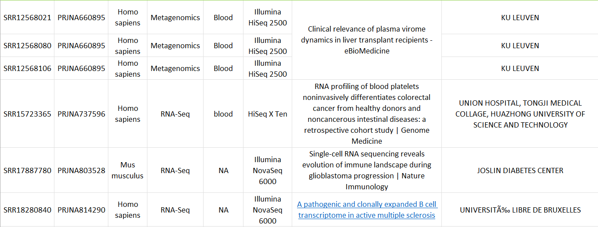
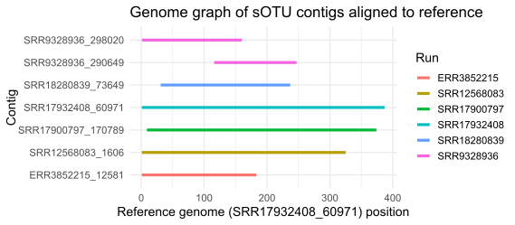
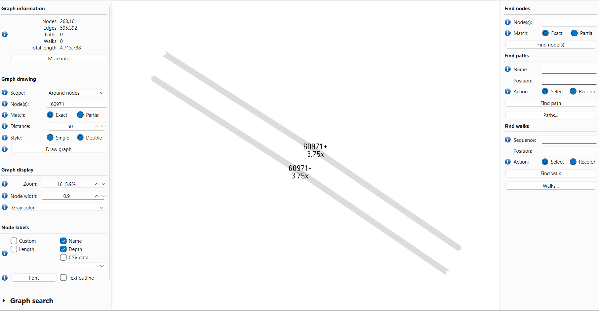
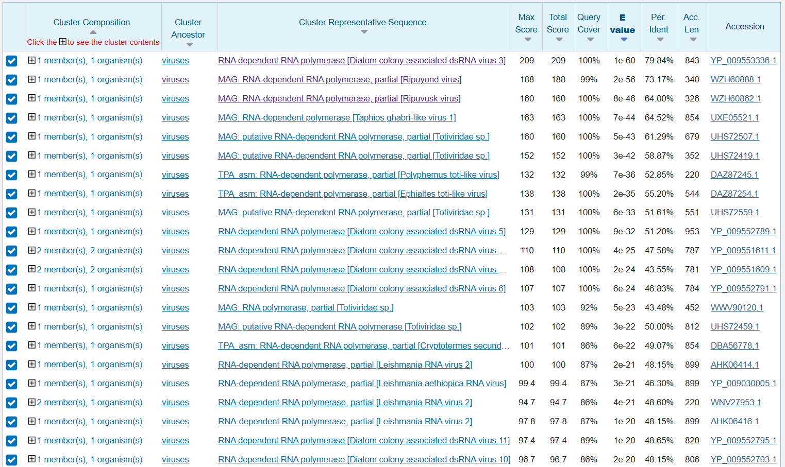
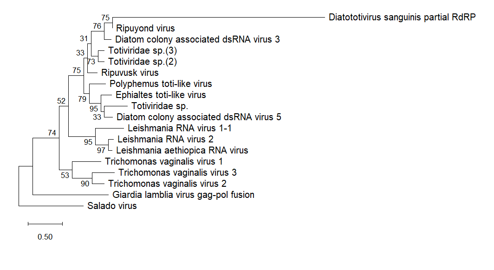
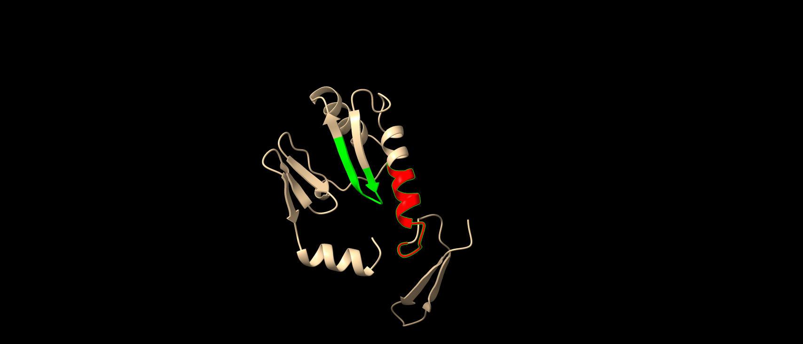
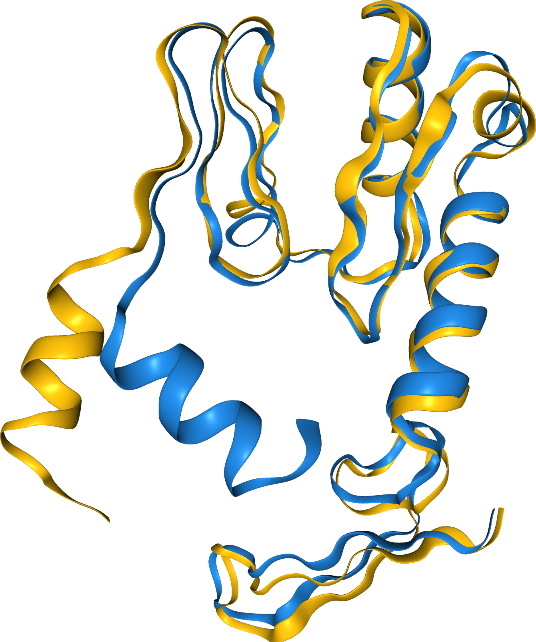

# A diatom-associated toti-like virus detected in mammalian blood samples
written by: [Mohammad Ismu Daud]

[YouTube/Video Link to your presentation video](https://videolink.goes.here)

### Diatototivirus sanguinis
*Diatototivirus sanguinis. Diatototivirus = RdRP protein sequence similar to totiviruses infecting diatoms; sanguinis ("of blood") = the SRA runs where this virus was found came from blood sample (mostly).*


## Abstract

RNA viruses are increasingly discovered directly from high-throughput sequencing datasets, revealing hidden diversity across both parasite-associated and environmental microbiomes. Large-scale mining of public transcriptomic data, such as the Serratus platform, enables sensitive detection of divergent RNA-dependent RNA polymerase (RdRp) “palmprint” motifs. Here we attempt to investigate the genome and evolutionary placement of a novel Serratus-defined virus (sOTU u127045) whose RdRp palmprint was detected across 21 SRA runs spanning 11 BioProjects, primarily derived from human blood-related samples and a smaller number of mouse samples. We show that targeted searches of Logan assembly contigs with tblastn identified only seven short matching fragments from six runs, all nested within a single 387 bp contig (SRR17932408_60971), with no evidence of contig extension in assembly graphs. The contig had no detectable nucleotide homology by BLASTn, yet its longest predicted ORF (124 aa) produced significant BLASTp similarity to toti-like RdRp proteins, especially diatom colony–associated dsRNA viruses, motivating the provisional name *Diatototivirus sanguinis*. A maximum-likelihood phylogeny based on the partial RdRp region placed D. sanguinis as sister to an environmentally derived toti-like virus (*Ripuyond* virus) rather than clustering within human parasite-associated *Leishmaniavirus* lineages. These results suggest that a highly divergent, toti-like viral fragment can be repeatedly detected in mammalian blood-associated sequencing runs while retaining closest detectable protein-level similarity to environmental, algae-associated viruses. Although limited by partial genome recovery, this work highlights both the power and the ambiguity of motif-based virus discovery and pushes future efforts to recover complete genomes and determine host association.

## Results

**Detection of a novel RdRp palmprint across public SRA datasets**

The RdRp palmprint sequence of a novel virus identified by Serratus (sOTU u127045) was detected across 21 SRA runs (**Figure 1**). To recover the genomic context of this palmprint, all corresponding Logan assembly contig files were searched using tblastn, with the sOTU’s index palmprint amino acid sequence as the query. Using an E-value cutoff of 1e-5, 7 contigs from 6 SRA runs were identified as putative matches.




**Figure 1.** SRA Runs. Green for SRA runs with matched contigs. Dark green for SRA run containing the longest contig match.

**Targeted recovery of viral contigs from Logan assemblies**

When these contigs were aligned to each other using BLAST, six were found to map entirely within the longest contig (from SRR17932408), which measured only 387 bp (**Figure 2**, S1).


**Figure 2.** Alignment of mapped SRA contigs.

Given the short length of all recovered viral fragments, we attempted to identify additional adjoining sequence that might extend the genome. For each of the seven matched contigs, the corresponding Logan assembly graph was examined in BandageNG (Wick et al. 2015). Using the node representing the matched contig as the focal point, we explored graph connections at increasing distance thresholds. No additional contigs were connected to the viral node in any of the assemblies. A representative graph for the longest contig (SRR17932408_60971) is shown in **Figure 3**.


**Figure 3**. BandageNG graph for SRR17932408_60971.

Because none of the assemblies provided evidence of further genomic extension, all subsequent analyses focused on the longest recovered contig.

**Sample origins and biological context of sOTU-associated runs**

The 21 SRA runs associated with sOTU u127045 originated from 11 different BioProjects, using samples from humans (n = 21) and mice (n = 3). The largest contributing project was PRJNA660895 (7 SRA runs), which profiled the blood plasma virome of liver-transplant recipients using viral enrichment and Illumina HiSeq2500 sequencing (Thijssen et al. 2020). Despite the large number of runs, our analysis detected the novel virus in only one of these samples.

Of the six SRA runs that yielded contigs matching the sOTU palmprint, three came from studies explicitly investigating viromes, although in different biological contexts. Notably, the BioProject containing the longest contig (SRR17932408_60971) was PRJNA804384, which characterized the gut virome in inflammatory bowel disease patients using a viral metagenomic approach (Jansen et al. 2023). Another matched run, SRR9328936, originated from PRJNA549712, a study using RNA-seq of cerebrospinal fluid and blood to investigate potential B-cell–associated viral reservoirs in multiple sclerosis (Ramesh et al. 2020). Collectively, the majority of matched runs derived from blood-related samples (Figure 1).

To assess whether the longest matched contig contained recognizable genomic features, the sequence SRR17932408_60971 was queried against NCBI’s core nucleotide database using BLASTn, but returned no hits. This suggests substantial nucleotide divergence from currently described viruses.

The contig was then examined using NCBI ORFfinder, scanning all possible reading frames. Several open reading frames were identified; the longest ORF spanned nucleotides 1–375, encoding a predicted 124-amino-acid peptide. This peptide was subsequently searched using BLASTp, revealing similarity to toti-like RdRp proteins from environmental samples, especially those of diatom colony-associated viruses (**Figure 4**).


**Figure 4.** BLASTp top hits.

```
>Diatototivirus_sanguinis_partial_RdRP  
GACAACATGCATGTGCACTGGATGGATAAGAAGACAGTATTGCAGACGGCGAAGATGGTGGGTACGTTACCGAGTGGTCA
TAGGGCTACGACGTTCGTGAACACTATACTAAACGCTGCATATTGCCTGTACGCTAGCGAGAGCGGAATGGCCGGCTTAG
ACGGTTATCACTGCGGAGACGACGTGATAGTCTTCGGCGACCAGACAGCAATGTCGAAATTTGTGACAGATATGACTAAG
TCTGTCTTTAGAATAAACCCTGCAAAGCAGAGTGTAGGCAAATACAACGGAGAATTCCTGCGTGTAGCCTTCAACGGGCA
GGGAGCGAGTGGATATGGGGCTCGTAGTATTAGTGCGACGGTAAGCGGCAACTGAACATCCAAACAC
```

Given the intriguing combination of its detection primarily in mammalian blood samples and its sequence similarity with diatom-associated toti-like viruses, we provisionally refer to this virus as ***Diatototivirus sanguinis***.

**Phylogenetic placement within *Ghabrivirales***

Several members of the family *Totiviridae*, including the genera *Giardiavirus*, *Trichomonasvirus*, and *Leishmaniavirus*, are known to infect human protozoan parasites. For example, *Trichomonas vaginalis* is a flagellated protozoan that colonizes the human genitourinary tract and causes the inflammatory disease trichomoniasis (Goodman et al. 2011). Infection of *T. vaginalis* by *Trichomonasvirus* has been shown to modulate parasite pathogenicity and impair host clearance mechanisms, highlighting the biological significance of totiviruses in host–parasite interactions (Goodman et al. 2011).

Similarly, leishmaniasis, a parasitic disease caused by *Leishmania* species, is exacerbated by infection of the parasite with Leishmania RNA virus (LRV) (de Carvalho et al. 2019). *Leishmania* parasites are transmitted through sand fly bites and subsequently internalized by host macrophages, where infection may be established if the parasite successfully evades immune clearance (Scott and Novais 2016a). This transmission route and intimate interaction with immune cells may explain the detection of *Diatototivirus sanguinis*–associated sequences in SRA runs derived from blood-related samples and immune cell populations (Figure 1). Consistent with this interpretation, BLASTp hits ranked 17–20 correspond to RdRp proteins from several *Leishmania*-associated viruses (Figure 4).

Notably, however, the highest-confidence BLASTp hits correspond not to protozoan-associated totiviruses, but rather to toti-like viruses recovered from environmental samples, particularly diatom colony–associated viruses from aquatic ecosystems. Phylogenetic analyses of the order *Ghabrivirales* have demonstrated that *Leishmaniavirus* and diatom colony–associated dsRNA viruses form closely related lineages (Charon et al. 2022). Moreover, the top BLASTp hit (Diatom colony associated dsRNA virus 3) and the fourth-ranked hit (Taphios ghabri-like virus 1) have been identified as sister taxa within this group (Charon et al. 2022). Together, these observations prompt the question whether this new virus is more closely related to protozoan-associated viruses such as LRVs or environmentally derived, algae-associated toti-like viruses.


**Figure 5**. Phylogenetic placement of *Diatototivirus sanguinis*.
Phylogenetic inference was performed using the Maximum Likelihood method under the Jones–Taylor–Thornton (JTT) model of amino acid substitution. Amino acid sequences of RdRp were aligned using MUSCLE, and positions containing gaps or missing data were excluded using the complete deletion option, resulting in a final alignment of 88 positions across 18 sequences. The initial tree was selected from Neighbor-Joining and Maximum Parsimony topologies, and branch support values represent the percentage of replicate trees in which the associated taxa clustered together (100 replicates). The tree was rooted using Salado virus, a member of the order Ghabrivirales within the family Chrysoviridae. Branch lengths represent the number of amino acid substitutions per site. Performed using MEGA12 (Kumar et al. 2024).

As shown in Figure 5, representative Trichomonas vaginalis viruses (TVVs) form a monophyletic group that is sister to a broader clade comprising Leishmania RNA viruses (LRVs) and environmentally derived toti-like viruses, consistent with previous phylogenetic analyses of the order Ghabrivirales (Charon et al. 2022). Notably, Diatototivirus sanguinis clusters as a sister lineage to Ripuyond virus, a toti-like virus identified from sediment metagenomic samples in Australia (Sadiq et al. 2024).

This phylogenetic placement suggests that Diatototivirus sanguinis is more closely related to environmentally derived toti-like viruses than to protozoan-associated Leishmaniavirus species, arguing against a simple interpretation based solely on its detection in human and mouse blood samples. However, this conclusion should be interpreted with caution. The phylogenetic analysis was based on a partial RdRp sequence for Diatototivirus sanguinis, which was analyzed alongside full-length RdRp sequences from other viruses. Although gap-containing positions were excluded during tree inference to reduce alignment artifacts, the limited sequence length may still affect branch length estimates and topology. Further work to recover the complete viral genome will be necessary to clarify its evolutionary relationships, host range, and biological properties.

### Virus Genome


**Figure 5.** Genomic context of Diatototivirus sanguinis relative to a diatom-associated toti-like virus.
Schematic comparison of the partial genome recovered for *Diatototivirus sanguinis* (bottom) with the complete genomic RNA of Diatom colony associated dsRNA virus 3 (top; NCBI accession AP014893). The diatom virus genome encodes a 5′-proximal capsid protein (CP) and a 3′-proximal RNA-dependent RNA polymerase (RdRp), with a small overlapping region between the two open reading frames (yellow), a characteristic feature of toti-like viruses. A BLASTn search using the recovered contig did not identify any significant nucleotide-level homologs in public databases. However, BLASTp analysis of the predicted open reading frame identified the RdRp of diatom colony-associated dsRNA virus 3 as a top hit. Therefore, pairwise sequence alignment between the two sequences was performed using EMBOSS WATER (Madeira et al. 2024) to place the partial contig within a broader genomic context (alignment file provided in S2). The alignment output is provided in the supplementary material, and the schematic shown here was constructed based on that alignment.

### RdRP Structural Analyses


**Figure 6.** Diatototivirus sanguinis partial RdRP structure prediction using AlphaFold3. Conserved palm motifs B and C and highlighted in green and red, respectively.

Comparing Diatototivirus partial RdRP AlphaFold prediction structure with the structure databases using Foldseek, we discovered structural similarities with diatom colony-associated dsRNA virus 5 (Figure 7).

**Figure 7.** Foldseek protein structure similarity search (van Kempen et al. 2024) of *Diatotivirus* partial RdRP (blue) resulted in the top hit, diatom colony-associated dsRNA virus 5 (yellow). Motifs B and c are shown on the right-hand side. While the general fold between the two are similar across most of the aligned region, a significant mismatch is observed in the alpha helix at the N-terminus of the alignment (left-hand side). This mismatch was also observed in other top Flodseek hits, and may be explained by the partial nature of the query sequence being aligned to the full-length RdRP sequences. This highlights the needs of further investigation to recover and assemble the complete genome of *Diatotivirus sanguinis*. In addition, the top hit only has a 51.2% sequence identity, showing the remarkable gap between sequence similarity and structural similarity. Most importantly, this analysis supports the close relationship between *Diatototivirus* and diatom colony associated viruses implicated by the phylogenetic analysis.

## Discussion

Despite being detected primarily in human and mouse blood–derived samples, *Diatototivirus sanguinis* is more closely related to environmentally derived toti-like viruses, particularly diatom colony–associated dsRNA viruses, as supported by amino acid–based phylogenetic analysis and Foldseek structural similarity searches. Based on the biological context of the samples, we initially expected this virus to cluster with *Leishmania*-associated totiviruses, which infect protozoan parasites transmitted via blood-interacting vectors and are known to modulate parasite pathogenicity (Scott and Novais 2016). Instead, its unexpected evolutionary placement raises the possibility of indirect or environmental acquisition routes, such as dietary exposure or association with microbiota-associated protists; however, this interpretation remains tentative given that our analyses are based on a partial RdRp sequence, underscoring the need for full genome recovery to resolve its biology.

## References

1. de Carvalho RVH, Lima-Junior DS, da Silva MVG, Dilucca M, Rodrigues TS, Horta CV, Silva ALN, da Silva PF, Frantz FG, Lorenzon LB, et al. Leishmania RNA virus exacerbates Leishmaniasis by subverting innate immunity via TLR3-mediated NLRP3 inflammasome inhibition. Nat Commun. 2019:10(1):5273. https://doi.org/10.1038/s41467-019-13356-2
2. Charon J, Kahlke T, Larsson ME, Abbriano R, Commault A, Burke J, Ralph P, and Holmes EC. Diverse RNA Viruses Associated with Diatom, Eustigmatophyte, Dinoflagellate, and Rhodophyte Microalgae Cultures. Journal of Virology. 2022:96(20):e00783-22. https://doi.org/10.1128/jvi.00783-22
3. Ghabrial SA and Suzuki N. Viruses of plant pathogenic fungi. Annu Rev Phytopathol. 2009:47:353–384. https://doi.org/10.1146/annurev-phyto-080508-081932
4. Goodman RP, Ghabrial SA, Fichorova RN, and Nibert ML. Trichomonasvirus: a new genus of protozoan viruses in the family Totiviridae. Arch Virol. 2011:156(1):171–179. https://doi.org/10.1007/s00705-010-0832-8
5. Jansen D, Falony G, Vieira-Silva S, Simsek C, Marcelis T, Caenepeel C, Machiels K, Raes J, Vermeire S, and Matthijnssens J. Community Types of the Human Gut Virome are Associated with Endoscopic Outcome in Ulcerative Colitis. J Crohns Colitis. 2023:17(9):1504–1513. https://doi.org/10.1093/ecco-jcc/jjad061
6. van Kempen M, Kim SS, Tumescheit C, Mirdita M, Lee J, Gilchrist CLM, Söding J, and Steinegger M. Fast and accurate protein structure search with Foldseek. Nat Biotechnol. 2024:42(2):243–246. https://doi.org/10.1038/s41587-023-01773-0
7. Khalifa ME and MacDiarmid RM. A Novel Totivirus Naturally Occurring in Two Different Fungal Genera. Front Microbiol. 2019:10:2318. https://doi.org/10.3389/fmicb.2019.02318
8. Kumar S, Stecher G, Suleski M, Sanderford M, Sharma S, and Tamura K. MEGA12: Molecular Evolutionary Genetic Analysis Version 12 for Adaptive and Green Computing. Mol Biol Evol. 2024:41(12):msae263. https://doi.org/10.1093/molbev/msae263
9. Madeira F, Madhusoodanan N, Lee J, Eusebi A, Niewielska A, Tivey ARN, Lopez R, and Butcher S. The EMBL-EBI Job Dispatcher sequence analysis tools framework in 2024. Nucleic Acids Res. 2024:52(W1):W521–W525. https://doi.org/10.1093/nar/gkae241
10. Ramesh A, Schubert RD, Greenfield AL, Dandekar R, Loudermilk R, Sabatino JJ, Koelzer MT, Tran EB, Koshal K, Kim K, et al. A pathogenic and clonally expanded B cell transcriptome in active multiple sclerosis. Proceedings of the National Academy of Sciences. 2020:117(37):22932–22943. https://doi.org/10.1073/pnas.2008523117
11. Sadiq S, Harvey E, Mifsud JCO, Minasny B, McBratney AB, Pozza LE, Mahar JE, and Holmes EC. Australian terrestrial environments harbour extensive RNA virus diversity. Virology. 2024:593:110007. https://doi.org/10.1016/j.virol.2024.110007
12. Sandlund L, Mor SK, Singh VK, Padhi SK, Phelps NBD, Nylund S, and Mikalsen AB. Comparative Molecular Characterization of Novel and Known Piscine Toti-Like Viruses. Viruses. 2021:13(6):1063. https://doi.org/10.3390/v13061063
13. Schwebke JR and Burgess D. Trichomoniasis. Clinical Microbiology Reviews. 2004:17(4):794–803. https://doi.org/10.1128/cmr.17.4.794-803.2004
14. Scott P and Novais FO. Cutaneous leishmaniasis: immune responses in protection and pathogenesis. Nat Rev Immunol. 2016a:16(9):581–592. https://doi.org/10.1038/nri.2016.72
15. Thijssen M, Tacke F, Beller L, Deboutte W, Yinda KC, Nevens F, Laleman W, Van Ranst M, and Pourkarim MR. Clinical relevance of plasma virome dynamics in liver transplant recipients. EBioMedicine. 2020:60:103009. https://doi.org/10.1016/j.ebiom.2020.103009
16. Wick RR, Schultz MB, Zobel J, and Holt KE. Bandage: interactive visualization of de novo genome assemblies. Bioinformatics. 2015:31(20):3350–3352. https://doi.org/10.1093/bioinformatics/btv383
17. Zangger H, Hailu A, Desponds C, Lye L-F, Akopyants NS, Dobson DE, Ronet C, Ghalib H, Beverley SM, and Fasel N. Leishmania aethiopica Field Isolates Bearing an Endosymbiontic dsRNA Virus Induce Pro-inflammatory Cytokine Response. PLOS Neglected Tropical Diseases. 2014:8(4):e2836. https://doi.org/10.1371/journal.pntd.0002836

# Viral Short Story

```
Francis was used to working late, but this was rough. As he was pipetting 
Sample 31337, the glare of the rising sun blinded him, and instinctivly his grip
tightened. A single drop of the sample fell past his bench unnoticed, soaking
into his converse.

This was the beginning, but the significance of this day would not be felt
until months later, and by then it was too late. Everything changed...

Francis did not yet know it, but the drop that had seeped into his shoe carried an enchantment older than kingdoms. By the next moon, strange dreams plagued him—visions of scrolls written in drifting ribbons of light, whispering of a hidden lineage. When he sought help from the sages of the Citadel of Sequenza, they gasped: the sigil glowing on his heel matched one found only in **Homo sapiens and Mus musculus**, though the sages warned it sometimes appeared in distant, unexpected creatures.

To learn its power, Francis traveled across the realm to consult the Archivist of Tissues, a quiet hermit living in a tower crowned with crimson banners. She examined the sigil and murmured, “Ah. It thrives where lifeblood flows. The mark is most often uncovered in scrolls describing **plasma, platelets, and B-cells, and only rarely in the hidden chambers of the brain.**” Her eyes narrowed. “A curse of the bloodstream.”

Seeking further truth, Francis joined a caravan of scholars bound for the Grand Scriptorium, where manuscripts were written not with ink, but with shimmering transcripts. There, he learned that nearly all records of the sigil emerged from **transcriptomic scrying—RNA-seq—because** the mark dwelled within exonic passages, where the scribes’ quills captured it most faithfully.

Still uneasy, he sought the Oracle of the Virome, who lived atop a mountain of mirrors. She peered into her basin and declared: the sigil had once been found in enchanted **plasma purified for viral phantoms—evidence** that it sometimes traveled within true viral particles, not merely within mortal cells.

Finally, the Oracle whispered the last secret: the curse awakened only when the world around it held a certain balance—scrolls rich in **GC content between 38% and 63%** were where its presence was fated to appear.

And so Francis set out, burdened by knowledge yet guided by ancient truth, to break the Sun-Drop Curse before dawn claimed him forever.

```
