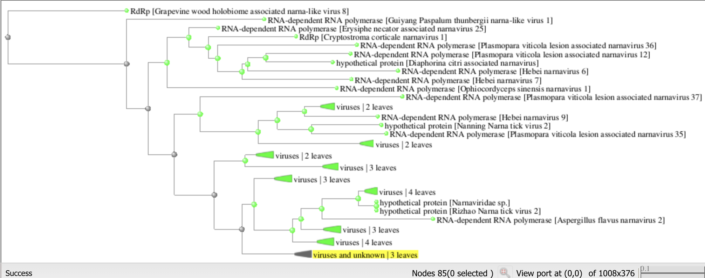
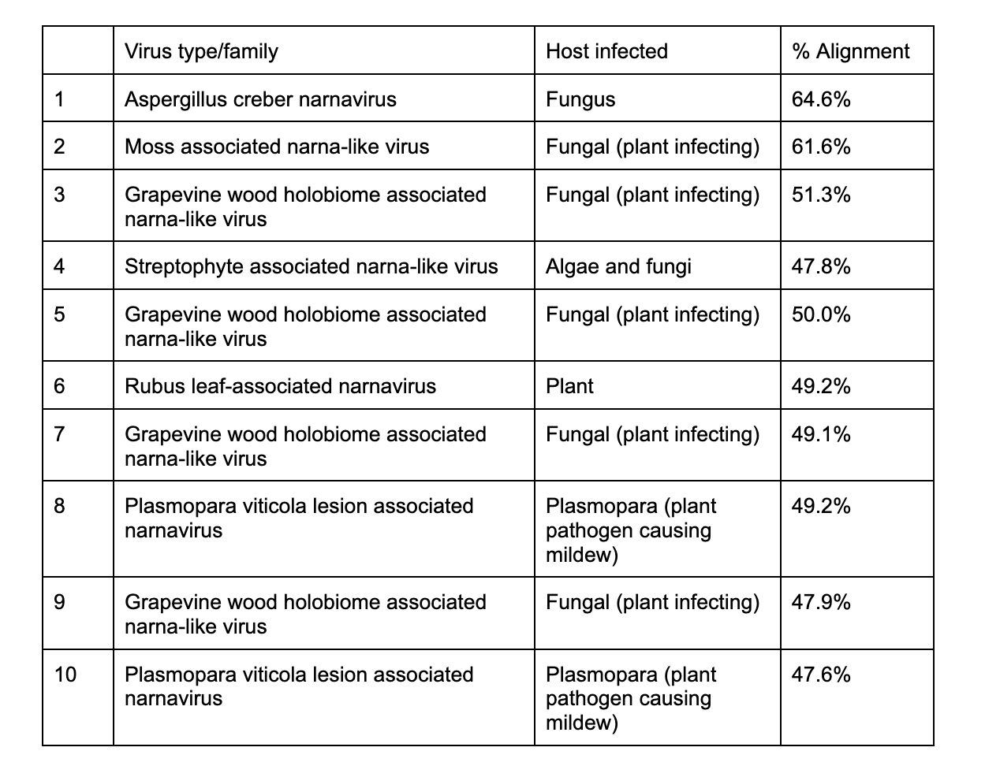
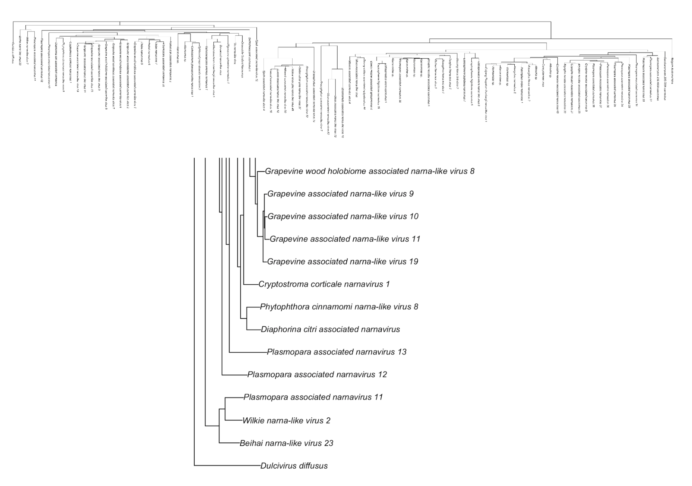
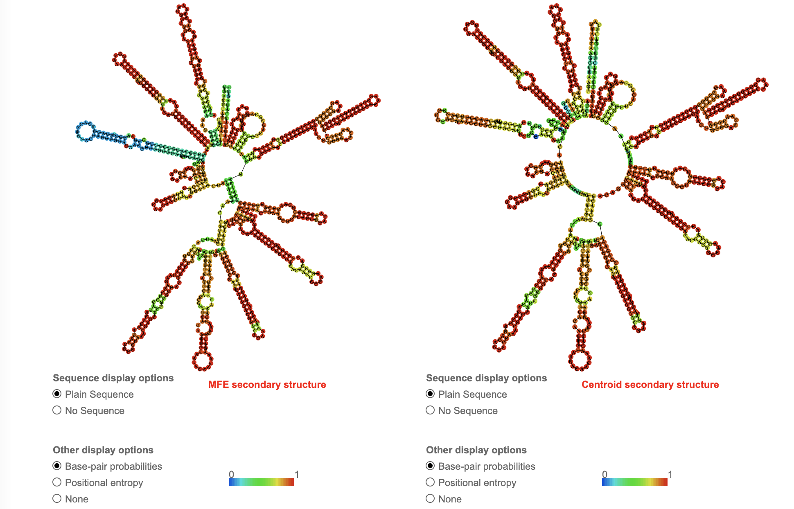
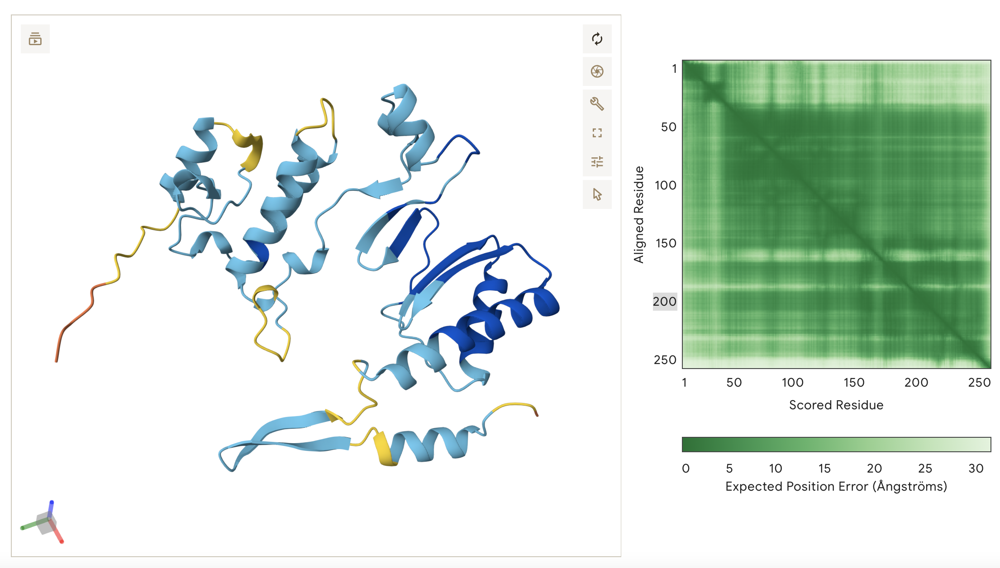
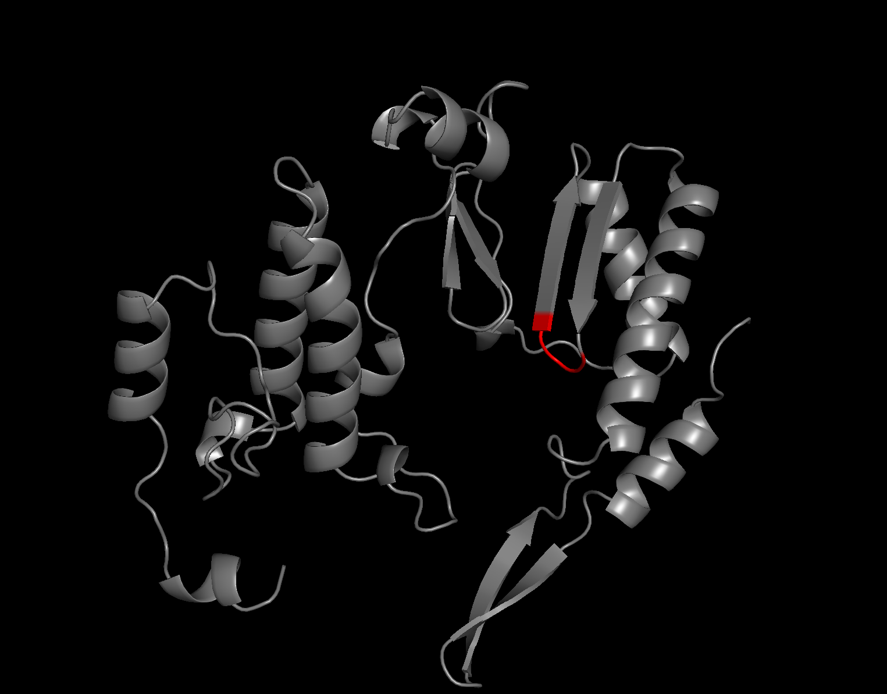

# Home Sweet Home: Residence of the fungal-associated _Dulcivirus diffusus_ across several distinct species without direct transmission
written by: [Esther Cho](https://github.com/esther-git)

[YouTube/Video Link to your presentation video](https://drive.google.com/file/d/1sCNZjxoMXDbeCLDEXIZ2lgr52a1s7Mqi/view?usp=sharing)

### _Dulcivirus diffusus_
*_Dulcivirus diffusus_: _Dulci_ meaning "sweet", and _diffusus_ meaning "diffused" or "spread out" in Latin. These terms correlate with how this virus was present across citrus plants, strawberries, melons, and bees, for example--species that share the common denominator of "sweetness" (and bees being attracted to such sweetness or depositing pollination to promote growth of such plants). _Diffusus_ refers to the virus' detection in more unrelated samples, such as in human cervical cancer exosomes and metratranscriptomes of various wild animals native to China. I chose _diffusus_ over _dispersus_ as I did not want to imply that the virus is necessarily transmitted between these different species.*


## Abstract

Viruses are microscopic infectious agents that can serve as pathogenic drivers of various infectious diseases across all kingdoms of life. Classifying viruses by their hosts, pathogenicity, and mode of transmission can yield critical insights into various disease mechanisms and more broadly the understanding of interactions between biological life. Recent advancements in genomic sequencing and high-throughput, computational analyses have allowed for an explosive expansion of viruses detected across biological samples. However, what remains unclear is the discernment between direct, indirect, and passerby viruses with regards to infection and pathogenesis, as their ability to persist across several biological specimens without direct infection can easily be overlooked. Here we show the characterization of a novel virus called _Dulcivirus diffusus_ and provide strong evidence supporting its classification as a fungus-infecting narnavirus that passively resides in non-fungal species. Initially detected in human HeLa cells containing HPV-positive exosomes, the virus was detected across several unrelated studies in fruits, plant leaves, plant fungi, bees, and mites by its unique palm signature. The broad distribution of _D. diffusus_ across taxa despite their host being seemingly restricted to plant-associated fungi strengthen the idea that viral residence can be mediated by environmental deposition and not necessarily limited to two extreme ends: direct integration or contamination. We anticipate this work to help expand the use of computational tools in a multi-faceted yet streamlined manner to readily make nuanced distinctions of viral residence for thousands of novel viral discoveries. 

## Results

### 1. Identification D. diffusus across BioProjects and datasets
All analyses were done by searching the associated SRA codes into the NIH database [1] alongside using BLAST to align the associated palm sequences.

The palm signature of a viral RNA-dependent RNA polymerase (RdRp), which I establish to be from _D. Diffusus_, was found via the Sequence Read Archive (SRA)-mining viro-informatics platform Serratus.io [2]. 
This palm sequence was associated with the index case called "RNA profiling of [human] cervical cancer exosomes using next- generation sequencing" (BioProject PRJNA679755). 
While this study is not associated with any publication, the dataset is described to be specifically from exosomes derived from the immortalized HeLa cell line, with the extracted RNA sequenced using paired-end Illumina HiSeq 2500. 
This analysis was originally conducted to find differentially expresed RNAs in HPV positive exosomes to HPV negative exosomes, to better characterize how most cases of cervical cancer are caused directly by HPV infection [3]. 
One important aspect to consider is that this is not a sample directly derived from humans, but rather a human cell line. 
While viral contamination during cell culturing is possible, this being the index case that was likely studied in sterile laboratory environments makes me infer that _D. Diffusus_ signatures may persist via different manners.


**Table 1. Associated BioProjects and datasets.** The 9 BioProjects along with associated SRAs were searched on NCBI and compiled. Case 1 is the index case PRJNA679755.

The dataset with the second highest coverage (9) belongs to BioProject PRJNA706851: "RNA-seq of bees and mites with virus disease to reveal the bee's virus prevalence across China." One run is associated with this project: SRR13091309. While no publication is associated, the sample was generated via RNASeq using paired-end Illumina NovaSeq 6000. It is noteworthy that these bees and mites are infected with a viral disease--while the disease is not specified, it brings forth the question of whether the detected _D. Diffusus_ plays a direct pathogenic role, as it was also detected in human cervical cancer cell lines. Another noteworthy BioProject, PRJNA448355, is published across four different datasets for strawberries and published by Sichuan Agricultural University in China. This project was generated via paired end Illumina HiSeq 2000 in 2022. Other BioProjects detecting D. diffusus include the sequencing of trifolate oranges in Beijing [4], cases of powdery mildew in melons (Shandong, China), leaves of flowering plants, and metagenomes of animals native to China (wild raccoon dogs, the Manchurian hedgehog, and the Sunda pangolin). All BioProjects relied on Illumina paired-end sequencing, either HiSeq 2000 or NovaSeq 6000.

### 2. Investigating the datasets and the presence of D. diffusus
Most datasets trace back to various regions in China and share similarities yet stark distinctions in their ecological niches. Aside from HeLa cells, bees, and wild animals, the majority of these datasets belong to studies conducted on various fruits and flowering plants, some of them being infected with fungi or experiencing drought or copper stresses. Currently, there is no evidence to suggest that viral transmission can occur between the three kingdoms of life: animals (mammals and arthopods), plants, and fungi. Furthermore, most cervical cancers are caused by the human papillomavirus (HPV), which is limited to human and animal hosts [5]. Therefore, aside from bees picking up or depositing the viral source via pollination, there is no obvious linkage between the various species. 

Unfortunately, all associated datasets have poor coverage of reads mapping to the palm sequence, ranging from 1 to 2 (aside from the index case and aforementioned PRJNA706851, with coverages of 10 and 9 respectively). As such, it is difficult to make any informative assumptions based on the host origins of _D. Diffusus_. Another mystery is how the two relatively highest coverage belong to samples from human cells and bees, as again there is no evidence in literature suggesting transmission between the two species. 

### Hypothesis: Association, not transmission, via fungal hosts
An initial BLASTp search [6] on the RdRp palm signature of _D. Diffusus_ identified ~80 alignments, mainly with other RdRps of narna-like or narnaviruses with ~50-60% identity and extremely low e-values (Figure 2), suggesting that _D. Diffusus_ may also fall into this Narnaviridae family of positive-strand RNA viruses [7]. Interestingly, they are all fungal narnaviruses, many of them infecting plants: the fungal _Aspergillus creber narnavirus_, narnaviruses found in moss and grapevine, powdery mildew, and more. A glimpse of the Blast Tree (Figure 3) shows that this particular signature is closest to RdRp signatures of fungal narnaviruses infecting leaves. Note that this is not a phylogenetic tree derived from MSA, and I will be generating one once retrieving a more complete sequence below to conduct analysis with higher confidence. The ecological niche of these aligned narnaviruses do not align with the human host (index case) or various animals. 


**Figure 2. BLASTp searches on D. diffusus palm signature.** The palm signature was queried to search for alignments with other sequences. The top hits are fingal-associated narnaviruses.


**Figure 3. BLASTp tree view.** Sequences belonging to viral proteins were aligned to the _D. diffusus_ palm signature and the alignment lineages were mapped on BLASTp. MSA was not conducted for this analysis (see Figure 4). 

Putting all of this information together, I hypothesize that _D. diffusus_ infects plant-associated fungi and thus persists across species belonging to other kingdoms via environmental deposition, and not by direct transmission or infection. A secondary hypothesis would be that _D. diffusus_ is therefore not a pathogenic agent in animals (consistent with its low coverage across datasets) but only indirectly to plants as they can be infected with such fungal diseases. I hypothesize that this is the reason we see _D. diffusus_ across various plants, mammals, and fungi-infected plants. Environmental deposition includes but is not limited to: pollination, soil, water, aerosols, and consumption. In the context of the index case (HeLa cells), this could be via deposition of viral particles that have persisted as a relic across cell line generations and not due to cross-contamination via improper handling of that particular sample.

### 3. Co-occurences of other virus families across datasets
Using Serratus.io, I investigated which other virus families are detected across all 13 SRAs that were identified to have the _D. Diffusus_ RdRp signature. The top two families scored with 500+ reads aligned with 70-90%+ identities were Botourmiaviridae and Mitoviridae, both representing positive-strand RNA viruses that infect fungi and plant-infecting fungi. This is consistent with _D. Diffusus_ also having a fungal host and thus being detected across various species via deposition (e.g., pollen, soil, water). 

### 4. BLASTp homology searches & phylogenetic analysis attempt
Using the partially-recovered RdRp (see Q3 for assembly), I searched BLASTp as previously described to see whether the aligned sequences still majorly reflected RdRp's of plant-infecting fungal narnaviruses. Interestingly, there were many more hits for narnaviruses with plant hosts, such as the Rubus leaf-associated narnavirus, and more instances of narnaviruses associated with plasmopara, a non-fungal plant pathogen (Table 2). This builds some support towards the host of _D. Diffusus_ being plants and thus directly infecting them, rather than by associated means via a fungal host as I hypothesized.  


**Table 2. Top 10 BLASTp hits for resolved D. diffusus RdRp.** A BLASTp search using the recovered RdRp shows viral matches, the host infected, and % identities for the first ten hits. Most are plant-associated fungal narnaviruses or plant infecting narnaviruses.

To investigate this further, I attempted to generate a phylogenetic tree using the IQ-TREE tutorial on the repository and supplemented with R code after downloading the tree file. To do this, I acquired Multiple Sequence Alignments (MSAs) of not only the hit sequences but also non-fungal associated narnaviruses to see where _D. Diffusus_ clusters. First, I downloaded the Hit Table CSV file from my BLASTp search, which contains each protein's NCBI accession code. After compiling the codes into a .txt file, I retrieved FASTA fies containing entire sequences using NCBI's Batch Entrez Protein Database tool [1]. I separately retrieved FASTA files for RdRps of other narnaviruses directly via NCBI by searching up the virus name (e.g., Saccharomyces 20S narnavirus). I ran all FASTA files into Clustal Omega [8] to generate MSAs, which I finally analyzed via IQ-TREE.  
<details>
<summary> *R Code for generating phylogenetic tree from IQ-TREE results* </summary>

```{r}
#Species names to appear in tree
species <- c(
  "Dulcivirus diffusus",
  "Beihai narna-like virus 23",
  "Wilkie narna-like virus 2",
  "Plasmopara associated narnavirus 11",
  "Plasmopara associated narnavirus 12",
  "Plasmopara associated narnavirus 13",
  "Diaphorina citri associated narnavirus",
  "Phytophthora cinnamomi narna-like virus 8",
  "Cryptostroma corticale narnavirus 1",
  "Grapevine associated narna-like virus 19",
  "Grapevine associated narna-like virus 11",
  "Grapevine associated narna-like virus 10",
  "Grapevine associated narna-like virus 9",
  "Grapevine wood holobiome associated narna-like virus 8",
  "Grapevine wood holobiome associated narna-like virus 7",
  "Grapevine wood holobiome associated narna-like virus 6",
  "Grapevine wood holobiome associated narna-like virus 2",
  "Grapevine wood holobiome associated narna-like virus 1",
  "Hebei narnavirus 6",
  "Hebei narnavirus 9",
  "Hebei narnavirus 7",
  "Plasmopara associated narnavirus 35",
  "Rubus leaf-associated narnavirus 2",
  "Narnavirus sp.",
  "Narnavirus sp.",
  "Colletotrichum gloeosporioides narnavirus 1",
  "Ophiocordyceps sinensis narnavirus 3",
  "Ophiocordyceps sinensis narnavirus 1",
  "Macrobrachium rosenbergii narna-like virus 1",
  "Burswood narna-like virus",
  "Nigrospora sphaerica narnavirus 1",
  "Vo narna-like virus",
  "Drosophila Gosford Narnavirus",
  "Dothistroma pini narnavirus 1",
  "Sjack associated narna-like virus 12",
  "Sjack associated narna-like virus 4",
  "Lwood associated narna-like virus 16",
  "Lwood associated narna-like virus 12",
  "Mbeech associated narna-like virus 20",
  "Yellow silver pine narna-like virus 48",
  "Yellow silver pine narna-like virus 37",
  "Dracophyllum associated narna-like virus 52",
  "Dracophyllum associated narna-like virus 18",
  "Dracophyllum associated narna-like virus 7",
  "Moss associated narna-like virus 83",
  "Moss associated narna-like virus 72",
  "Streptophyte associated narna-like virus 16",
  "Mbeech associated narna-like virus 4",
  "Moss associated narna-like virus",
  "Downy mildew associated splipalmivirus 44",
  "Downy mildew associated splipalmivirus 4",
  "Leptosphaeria biglobosa narnavirus 16",
  "Ustilaginoidea virens narnavirus 1",
  "Narnaviridae sp.",
  "Plasmopara associated narnavirus 38",
  "Narnaviridae sp.",
  "Narnaviridae sp.",
  "Narnaviridae sp.",
  "Erysiphe necator associated narnavirus 1",
  "Rizhao Narna tick virus 2",
  "Zhangzhou Narna tick virus 1",
  "Tonghua Narna tick virus 1",
  "Nanning Narna tick virus 2",
  "Leptosphaeria biglobosa narnavirus 7",
  "Leptosphaeria biglobosa narnavirus 6",
  "Ustilaginoidea virens narna-like virus 3",
  "Guiyang Paspalum thunbergii narna-like virus 1",
  "Narnaviridae sp.",
  "Narnaviridae sp.",
  "Narnaviridae sp.",
  "Hangzhou narnavirus 5",
  "Aspergillus creber narnavirus 1",
  "Aspergillus flavus narnavirus 2",
  "Riboviria sp.",
  "Cunsystermes virus",
  "Riboviria sp.",
  "Erysiphe necator associated narnavirus 48",
  "Erysiphe necator associated narnavirus 33",
  "Erysiphe necator associated narnavirus 27",
  "Erysiphe necator associated narnavirus 25",
  "Erysiphe necator associated narnavirus 8",
  "Plasmopara associated narnavirus 38",
  "Plasmopara associated narnavirus 37",
  "Plasmopara associated narnavirus 36",
  "Plasmopara associated narnavirus 35",
  "Plasmopara associated narnavirus 34",
  "Plasmopara associated narnavirus 33",
  "Plasmopara associated narnavirus 31",
  "Plasmopara associated narnavirus 30",
  "Plasmopara associated narnavirus 14",
  "Saccharomyces 23S RNA narnavirus",
  "Saccharomyces 20S RNA narnavirus",
  "Belgium Andrena fulva",
  "brine shrimp narna-like virus 3"
)

#Accession codes in tree file
accessions <- c(
"QRW42897.1","YP_009388579.1","WPV74303.1","QTW97841.1","QJT93740.1","UHK03010.1",
"WPV70691.1","WKF54344.1","QIR30293.1","XOD45333.1","WAK75252.1","QJT93780.1",
"WPR16643.1","WPR17382.1","WRK14128.1","UYL95379.1","UVX28911.1","WPR17338.1",
"WPR17256.1","WPR17367.1","XOD45334.1","WPR17317.1","WPR17308.1","WPR17363.1",
"XEX66987.1","QIR30292.1","QIR30309.1","YP_009333261.1","WQM87268.1","UJQ92638.1",
"UJQ92701.1","WVL03117.1","URG16985.1","XUU15577.1","QTW97840.1","WZE65506.1",
"WKR37712.1","UYL94524.1","XFO98523.1","UYL94525.1","XOD45392.1","WNA22221.1",
"WNA22212.1","XQZ69271.1","NP_660177.1","UNI73860.1","NP_660178.1","XOD45360.1",
"XOD45356.1","XOD45352.1","QIR30312.1","WAK75271.1","UYL95374.1","QJT93765.1",
"WAK75274.1","UYL95397.1","QIR30317.1","WAK75273.1","WAK75229.1","QIR30290.1",
"XHV14743.1","WPR17204.1","UAW09568.1","XOD45338.1","WPR16631.1","BDB16246.1",
"XHY85192.1","QIR30291.1","XHZ00051.1","XOD45413.1","XXP61157.1","QIR30315.1",
"WPR17215.1","QJT93757.1","WZE65504.1","UUW20993.1","XOD45348.1","QIR30313.1",
"XHY85193.1","XFO98525.1","XHY85174.1","QIR30314.1","WAK75269.1","UYL95372.1",
"XOD45344.1","QJT93759.1","QIR30316.1","QIR30310.1","WPR17377.1","WPR17225.1",
"WPR17212.1","WPR16647.1","WWZ85587.1"
)

#Map accession codes to the species 
accession_to_species <- setNames(species, accessions)

#Generate tree with new labels
library(ape)
phy <- read.tree("~/Desktop/MGY441/tree/esther.treefile") #use file from IQ-TREE
phy$tip.label <- accession_to_species[phy$tip.label]

#Plot tree
plot(phy, cex=0.7)

```
</details>

Unexpectedly, the _D. Diffusus_ branch had the longest arm and did not split from any nodes or cluster with any other narnaviruses (Figure 4). This would mean that _D. Diffusus_ is either highly divergent or belongs to another virus family, as the query viruses were all narna-like or narnaviruses. High divergence of _D. Diffusus_ seemed unlikely to be the case, as searching on the obtained full RdRp sequence of _Aspergillus creber narnavirus_ on BLASTp yielded alignments with plant or fungal narnaviruses with identities ranging from 40-60% for the top 30 hits, which is in line with the percent identities shared between the _D. Diffusus_ RdRp and other narnavirus RdRps. Unfortunately, this most likely occurred due to comparing the full RdRp sequences of query viruses to only the partially obtained RdRp. Had I been able to recover its entire RdRp, this method would have yielded more insight into the ecological niche and host of _D. Diffusus_. Thus, I am limited to the tree outputted by BLAST, which still shows that the RdRp fragment clusters with fungal narnaviruses infecting plant leaves.


**Figure 4. Phylogenetic tree analysis of *D. Diffusus* RdRp.** The top figure depicts the entire phylogeny of all aligned sequences, which include the 84 hits and 5 queried sequences of other non-fungal narnaviruses to assess for phylogenetic clustering. The bottom figure is a zoomed-in depiction of the top left corner, showing the single branching of _D. diffusus_. The two main clusters on the left and right are plant/plasmopara associated narnaviruses and fungus associated narnaviruses respectively. FASTA files were obtained via BLAST and NCBI Batch Entrez, MSAs mapped on ClustalOmega, and trees generated via IQ-TREE with supplemented R code above.

## 1. Attempting to retrieve full RdRp contig through tBLASTn & other methods
Several issues emerged from the genome assembly process. Upon using the Viral tBLASTn tutorial by Ak Kannan to recover the full RdRp contig for _D. diffusus_, I was unable to find any contigs across all 13 datasets that contained the retrieved RdRp signature sequence. I stipulated that this occurred for a few reasons: 1) _D. diffusus_ is lowly abundant across samples, which would support that it is detected by environmental deposition or contamination rather than infection, 2) had very repetitive regions that were unsuccessfully read by the Illumina sequencer, and/or 3) had very fragmented and short contigs that did not span an entire RdRp. Upon examining the index case's FASTA file, I noticed that most of the contigs were indeed very short, ranging from ~20-50 nt. Although the next highest coverage dataset, PRJNA706851, had a mix of long and short contigs, the low coverage and failure with tBLASTn suggested that _D. diffusus'_ RdRp sequence was detectable in the short contigs. The remaining datasets with an extremely low coverage of 1 or 2 made me unconfident of detecting RdRp contigs in such samples as well. 

## 2. Using MEGAHIT & DIAMOND to assemble longer contigs across datasets
To assemble longer RdRp contigs for analysis with tBLASTn, I used MEGAHIT [9], a de novo assembler, and DIAMOND [10], a protein to DNA sequence aligner. As the assemblies required over 5-10GB of disk storage, which my computer did not have, I used a Google colab notebook to run both programs. Both notebooks are written in Python and thus generated with the help of a generative large language model (ChatGPT 5.1, 2025-12-11). The .ipynb notebooks are within the final_data folder. Below are their R versions.

- [MEGAHIT](img/D_diffusus/MEGAHIT.Rmd)
- [DIAMOND](img/D_diffusus/DIAMOND.Rmd)

From MEGAHIT, I recovered a single 752 nt long viral contig that indeed mapped to the entire RdRp palm signature and extended the sequence by 173 AA. All contigs from which this contig was derived originated in the index case and PRJNA706851 FASTA files. Using ORFfinder [11], I found one reading frame of its reverse transcribed sequence, validating that the genomic sequence is indeed RNA. I initially assumed that this was indeed the full _D. diffusus_ RdRp. InterPro also identified a single RNA polymerase domain. However, the contig seemed largely inconsistent with the fact that narnaviruses generally have ~800-1000 AA long RdRps (ranging ~2.2-3.2kb) [12]. I then investigated the exact alignments on BLASTp:


**Figure 5. Representative alignment of D. diffusus and A. creber narnavirus 1 RdRps.** All 80 hits showed the _D. diffusus_ RdRp to align with the C terminal regions of the viral sequences, suggesting that the N-terminal region of the _D. diffusus_ RdRp is unresolved.

Strikingly, the _D. diffusus_ RdRp aligned to the C terminal regions of all 80+ narnavirus RdRps (Figure 6). The _D. diffusus_ RdRp's first residue tends to align to other RdRps' ~450-470th residues. If the RdRp is missing ~460AA or 1380 bases, this would be more consistent with the general length of narnavirus RdRps. This also supports against the possibility of high divergence of _D. diffusus_ from narnaviruses, as the alignments are all localized to the C terminal regions and not with dispersed mismatches throughout (or smaller chunks of aligned sequences throughout). Furthhermore, the amino acid sequence of the _D. diffusus_ RdRp identified the GDD motif, or Motif C, but not Motifs A or B upstream, indicating that the N terminus is indeed missing. Using DIAMOND, I was able to obtain two more contigs, one mapping upstream and adding 60 nt, and 7 nt downstream of the STOP codon, presumably being the short 3' UTR characteristic of narnaviruses. Beyond this sequence, however, I was unable to find any more contigs overlapping to the recovered sequence, despite using less stringent parameters (e.g., setting minimum contig length to 20 instead of the default 200 in MEGAHIT, and more-sensitive mode in DIAMOND). I then downloaded the RdRp microassembly files for each SRA run and ran the programs to see if any matches were identifiable with the most upstream sequences, but this strategy did not yield further contigs. This strongly suggests that the RdRp N terminal region is not detectable within these 13 runs, as consistent with the low coverage of 1-10.

ORFfinder no longer outputs any ORFs for this sequence due to the misssing N-terminal region, but all aformentioned analyses provide me moderate to high confidence that this resolved fragment is indeed in frame (as it maps the palm signature). Obtaining the RdRp only is generally sufficient for narnaviruses as they do not code any other elements. It would have been ideal to obtain the N-terminal region would have allowed for more critical structural and functional analyses, but this is limited by the lack of high coverage datasets.

```
>Recovered sequence of Dulcivirus diffusus
GAAAAGGCAACAGACCGACCAAGCCAUGAAUAUGGCGAGGAAGGUGGUGUUACCUUUGCUAUGAUGGGCGUGCCGCAAGAAGACAUCCAAAUGGUUGAAUUCUUUUGGCUCGGCCACAAACGGCUAUUCGUUAGAGGAAAAUUUGUCGGUACCAUGGUGAAUGGUAUUCCGAUGGGAGAUCCUUUGACGAAAACUUGCAUGUCCCUGGCUCAUGCUAUAGCCCACCUUUACGCUGUGUACAAGGUGGGGGCAUUCGGCAGGAACGAAGGAAACGGAGACGACCUGACACUCAUCACGGACUCGCAAGAGUUCUUUGAUGCUAUGAUGGAAGCCUUCGAAUUAUUGGGGUACAAGACCUCCAUACUCGAUACAUUUGUAAACGAGCAUUGGGGUACGUACUGCGAAGAGUGGUUUCACCGACCGGUUCACAAGUCUAAUACAACAAAGACUGCAAUGAAACUCGGCGAAAUUGGAUUGUUGCCAUACAUCGACGUUCCGAAGAUACGUACGAUGAUCGCGACAGCGAAGGACAGGGAAGACUUCUCCUCAGACACCACCGGUAAGGUGACUCUGAUGGGGAAGGAAUCCGAAUAUACACGCAAACUGAAGCGUUCACCUUACAGGGUGGUCAAUUCAUUUUGCUCAUCAGUUCAGGAUAUCAUCCUGGCAACUGUGGACCAACCGCUUCCGAUGCACCUGCCAAGGCAGGUGUACGGAGUUGGAAAGCCGGCGCCAGGAUGGGAUCCAGAAACAUGGCUCAGCGCAAUCAACCAUGGCCCCAAGUGGAAACGAGGGGUAUAUUACCAUAGUUUGACUUAUUA

>Recovered RdRp of Dulcivirus diffusus
EKATDRPSHEYGEEGGVTFAMMGVPQEDIQMVEFFWLGHKRLFVRGKFVGTMVNGIPMGDPLTKTCMSLAHAIAHLYAVYKVGAFGRNEGNGDDLTLITDSQEFFDAMMEAFELLGYKTSILDTFVNEHWGTYCEEWFHRPVHKSNTTKTAMKLGEIGLLPYIDVPKIRTMIATAKDREDFSSDTTGKVTLMGKESEYTRKLKRSPYRVVNSFCSSVQDIILATVDQPLPMHLPRQVYGVGKPAPGWDPETWLSAINHGPKWKRGVYYHSLTY

```
A K25R Single Nucleotide Variant (SNV) was detected from the recovered RdRp and the original palm signature. This SNV is non-detrimental, however, as both residues are positively charged and thus the integrity of any physical or chemical interactions will remain largely unchanged.

Thus, I have generated my genome with the inclusion of a missing upstream region of 1380 nt, and the resolved 821 nt fragment will be mapping from 1381-2196 nt (or 461-733 AA), considering the 7nt 3' UTR. I will arbitrarily assign the 5' UTR length to be 10 nt, given that the well-characterized 20S Narnavirus in Saccharomyces cerevisiae has 12 nt UTRs [13]. I also be generated a linear genome structure, consistent with the linear genomes of Narnaviruses [13]:


**Figure 6. Structure of the incomplete _Dulcivirus diffusus_ genome.** ORF/RdRp and 5' UTR lengths were assigned by literature observances, and the partially resolved RdRp structure is indicated above the ORF arrow. _Dulcivirus diffusus_ has a linear, positive-strand RNA genome, as with all narnaviruses. Contigs from 9 BioProjects containing the RdRp signature were merged into one FASTA file and assembled de novo into larger contigs using MEGAHIT (see tutorial linked above). The largest contig (752 nt) was recovered from three smaller contigs from the BioProject PRJNA706851 dataset.Further sequences upstream and downstream were resolved using DIAMOND (see tutorial linked above). The sequences were collated, reverse transcribed to get the positive strand RNA sequence, and translated into an AA sequence using ScanProsite. ORFfinder was used to find ORFs, but the missing N-terminal region makes this analysis limited. 

<details>
<summary> *R Code for genome visualization, which was generated with the help of a generative large language model (ChatGPT 5.1, 2025-12-11).* </summary>

```{r}
library(ggplot2)
library(gggenes)
library(grid)

#First, our D. diffusus genome features:
dd_genome <- data.frame(
  
    feature = c("5'UTR", "ORF/RdRp", "3'UTR"), #Our three element
    start   = c(1, 11, 2197), #start and end pos for each element
    end     = c(10, 2196, 2203),
    strand  = c("+", "+", "+")
    
)

dd_genome$forward <- TRUE #positive strand virus, point 5' to 3'
dd_genome$y <- 1 #want all components to sit on the same line at constant y=1

#Add a separate component for our partially resolved RdRp:
rdrp_domain <- data.frame( #make a data frame to sit on top of genome
    feature = "Partially-resolved RdRp",
    start   = 1391,
    end     = 2196,
    y       = 1.18
)

#Make data frame for Motif C 
motif_c <- data.frame(
    feature = "Motif C",
    start   = 1657,
    end     = 1665,
    y       = 1
)
motif_c_height <- 0.025 #position it exactly within the "stick" of the genome arrow

#Add labels of coordinates below each element and data frame:
labels <- data.frame(
    feature = dd_genome$feature,
    x       = (dd_genome$start + dd_genome$end)/2,
    y       = 0.8,
    label   = paste0(dd_genome$feature,
                     "\n", dd_genome$start, "–", dd_genome$end, " nt")
)

motif_c_label <- data.frame(
    x = (motif_c$start + motif_c$end)/2,
    y = 0.8,
    label = "Motif C\n1657–1665 nt"
)

#Choose visually appealing colour scheme:
colours <- c(
             "5'UTR"="#9b59b6", #hex codes and names both work
             "ORF/RdRp"="#06D6A0",
             "3'UTR"="#FFD166",
             "Partially-resolved RdRp"="cornflowerblue",
             "Motif C"="red"
)

#Finally, plot the genome:
dd <- ggplot() +
  
      geom_gene_arrow( #ORF and UTR arrows
        data = dd_genome,
        aes(xmin = start, xmax = end, y = y, fill = feature, forward = forward),
        color = "black",
        arrowhead_width  = unit(0.1, "npc"),
        arrowhead_height = unit(0.25, "npc")
      ) +
      #Add UTR and ORF labels established above:
      geom_text(
       data = labels,
        aes(x = x, y = y, label = label),
        size = 3.2
      ) +
  
      #Same, but for Motif C:
      geom_rect(
        data = motif_c, #Motif C as a rectangle within ORF arrow
        aes(
            xmin = start, xmax = end,
            ymin = y - motif_c_height/2,
            ymax = y + motif_c_height/2,
            fill = feature  # map fill to include in legend
        ),
        color = "black",
        linewidth = 0.4
      ) +
      geom_text(
        data = motif_c_label,
        aes(x = x, y = y, label = label),
        size = 3.2,
        color = "red"
      ) +
  
      #Same, but for partial RdRp:
      geom_segment(
        data = rdrp_domain, #RdRp line
        aes(x = start, xend = end, y = y, yend = y, color = feature),
        linewidth = 2
       ) +
      geom_text( #label our RdRp line
        data = rdrp_domain, 
        aes(x = (start + end)/2, y = y + 0.05, label = feature),
        color = colours["Partially-resolved RdRp"],
        size = 3.5
      ) +
  
   
      # Axes
      scale_x_continuous(
        name = "Genome position (nt)",
        limits = c(0, 2210),
        breaks = seq(0, 2210, 500),
        sec.axis = sec_axis(~./3, name = "Amino Acid position")
      ) +
      scale_fill_manual(values = colours) +
      scale_color_manual(values = colours) +
      scale_y_continuous(limits = c(0.6, 1.35), breaks = NULL) +
      theme_minimal() +
      theme(
        axis.title.y = element_blank(), #Remove y axis from plot
        axis.text.y  = element_blank(),
        axis.ticks.y = element_blank(),
        legend.position = "bottom"  
     )

dd #plot!
```
</details>


**Figure 7. RNA secondary structure of _Dulcivirus diffusus_ RdRp.** RNAfold [14] was used to generate the secondary structures of the _Dulcivirus diffusus_ RdRp. 


**Figure 8. Predicted 3D structure of the _Dulcivirus diffusus_ RdRp via AlphaFold [15]**. Minimum Free Energy (MFE, left) and most probable centroid (right) structures are depicted.


**Figure 9. Predicted 3D structure of the _Dulcivirus diffusus_ RdRp via PyMol [16]**. The only recovered GDD motif, Motif C, is highlighted in red for residues 92-94.

##Baking a Christmas pudding with the viral genome
Let's bake a Christmas pudding with the sweet _Dulcivirus diffusus_ genome and RdRp! A scoop of each pudding will give insight into the exact ratio of bases and amino acids (all in just one bite). Recall that I am using only a portion of the D. diffusus viral RdRp and not the actual genome, as the genome assembly was limited by poor coverage across all datasets. To reduce confusion, I will be referring to my retrieved sequence as the genome throughout this section.

Using R code and the Biostrings package (see Section: R Code), I have obtained the following outputs:

1. A spoon of the RNA Christmas pudding tells us immediately that our D. diffusus has well-rounded notes of chocolate, ground spices, pistachios, and orange zest. Thus, it has an evenly balanced genome containing 22.7 % C, 26.6 % G, 22.5 % U, & 28.3 % A! 
<details>
<summary> *R Code to bake our D. diffusus RNA pudding* </summary>

```{r}
library(Biostrings)

genome <- RNAString("GAAAAGGCAACAGACCGACCAAGCCAUGAAUAUGGCGAGGAAGGUGGUGUUACCUUUGCUAUGAUGGGCGUGCCGCAAGAAGACAUCCAAAUGGUUGAAUUCUUUUGGCUCGGCCACAAACGGCUAUUCGUUAGAGGAAAAUUUGUCGGUACCAUGGUGAAUGGUAUUCCGAUGGGAGAUCCUUUGACGAAAACUUGCAUGUCCCUGGCUCAUGCUAUAGCCCACCUUUACGCUGUGUACAAGGUGGGGGCAUUCGGCAGGAACGAAGGAAACGGAGACGACCUGACACUCAUCACGGACUCGCAAGAGUUCUUUGAUGCUAUGAUGGAAGCCUUCGAAUUAUUGGGGUACAAGACCUCCAUACUCGAUACAUUUGUAAACGAGCAUUGGGGUACGUACUGCGAAGAGUGGUUUCACCGACCGGUUCACAAGUCUAAUACAACAAAGACUGCAAUGAAACUCGGCGAAAUUGGAUUGUUGCCAUACAUCGACGUUCCGAAGAUACGUACGAUGAUCGCGACAGCGAAGGACAGGGAAGACUUCUCCUCAGACACCACCGGUAAGGUGACUCUGAUGGGGAAGGAAUCCGAAUAUACACGCAAACUGAAGCGUUCACCUUACAGGGUGGUCAAUUCAUUUUGCUCAUCAGUUCAGGAUAUCAUCCUGGCAACUGUGGACCAACCGCUUCCGAUGCACCUGCCAAGGCAGGUGUACGGAGUUGGAAAGCCGGCGCCAGGAUGGGAUCCAGAAACAUGGCUCAGCGCAAUCAACCAUGGCCCCAAGUGGAAACGAGGGGUAUAUUACCAUAGUUUGACUUAUUA") 

#Split our sequence into the four individual bases:
bases <- strsplit(as.character(genome), "")[[1]]

#Make a list of ingredients, each mapping to a base:
ingredients <- list(
  nuts = c("A"), 
  orange = c("U"),
  spices = c("G"),
  chocolate = c("C")  
)

#Assign ingredient to each base in our genome:
ingredients <- sapply(bases, function(x){

  if(x %in% ingredients$nuts) return("pistachio nuts")
  if(x %in% ingredients$spices) return("ground spices")
  if(x %in% ingredients$orange) return("orange zest")
  if(x %in% ingredients$chocolate) return("chocolate chips")
  return(NA)
  
})

#Get our ingredients in a table:
ingredient_counts <- table(ingredients)
ingredient_counts

#Turn into percentages:
ingredient_perc <- round(100 * ingredient_counts / sum(ingredient_counts), 1)
ingredient_perc

#Finally, our verdict:
taste_sentence <- paste0(
  "This festive RNA Christmas pudding is a delicious mix of ", 
  paste(ingredient_perc, "%", names(ingredient_perc), collapse = ", ")
)

taste_sentence
```
</details>

2. The RdRp pudding tastes supper nutty! With a hint of spice (polar), orange zest (acidic), and chocolate (basic), the taste is heavily dominated (48%) by the pisachio nuts, i.e., polar residues, despite the fairly even distribution of bases. Below is a visualization of our observations:
<details>
<summary> *R Code to bake our D. diffusus RdRp pudding* </summary>

```{r}
#Same code as before, just modified for an AA sequence:
library(Biostrings)

rdrp <- AAString("EKATDRPSHEYGEEGGVTFAMMGVPQEDIQMVEFFWLGHKRLFVRGKFVGTMVNGIPMGDPLTKTCMSLAHAIAHLYAVYKVGAFGRNEGNGDDLTLITDSQEFFDAMMEAFELLGYKTSILDTFVNEHWGTYCEEWFHRPVHKSNTTKTAMKLGEIGLLPYIDVPKIRTMIATAKDREDFSSDTTGKVTLMGKESEYTRKLKRSPYRVVNSFCSSVQDIILATVDQPLPMHLPRQVYGVGKPAPGWDPETWLSAINHGPKWKRGVYYHSLTY")

aa <- strsplit(as.character(rdrp), "")[[1]]

#AA groups by property
groups <- list(
  nonpolar = c("A","V","L","I","M","F","W","P","G"),
  polar    = c("S","T","N","Q","C","Y"),
  acidic   = c("D","E"),
  basic    = c("K","R","H")
)

#Map AA groups to ingredients 
aa_group <- sapply(aa, function(a) {
  if(a %in% groups$nonpolar) return("pistachio nuts")
  if(a %in% groups$polar) return("ground spices")
  if(a %in% groups$acidic) return("orange zest")
  if(a %in% groups$basic) return("chocolate chips")
  return(NA)
})

#Count and percentages
ingredient_counts <- table(aa_group)
ingredient_perc <- round(100 * ingredient_counts / sum(ingredient_counts), 1)


taste_sentence <- paste0(
  "Yum! This RdRp Christmas pudding is just as delicious as the genome! Just a scoop of this warm treat tells me what it's a festive mix of ", 
  paste(ingredient_perc, "%", names(ingredient_perc), collapse = ", ")
)

ingredient_counts
ingredient_perc
taste_sentence

```
</details>


## Discussion
The evidence towards _Dulcivirus diffusus_ being a narnavirus infecting plant-associated fungi, and potentially plants or protists, reflects the non-transmissible ways that a virus may traverse across various species, which is what I found to be the most fascinating discovery: through fungi on plants, deposited to bees and animals via pollination or remnants in soils and waters, and persistence as a relic from previous environmental depositions in HeLa cell generations. While the partial recovery of the _D. diffusus_ genome limits a deeper analysis into the virus' host and mechanism, it opens up exciting questions beyond from its host interactions and ecological deposition; perhaps _D. diffusus_ does indeed integrate into human and animal cells, or its RdRp's N-terminal region is extremely diverged and does not actually contain the canonical motifs. Ultimately, characterizing its genome serves as an exciting demonstration of how several bioinformatics tools can be complemented and leveraged in multi-faceted ways.

## References
1. National Library of Medicine. National Center for Biotechnology Information. https://www.ncbi.nlm.nih.gov/ 

2. Babaian, A., & Edgar, R. C. (2022). Ribovirus classification by a polymerase barcode sequence. PeerJ, 10, e14055. https://doi.org/10.7717/peerj.14055

3. Zhang, Y., Qiu, K., Ren, J. et al. Roles of human papillomavirus in cancers: oncogenic mechanisms and clinical use. Sig Transduct Target Ther 10, 44 (2025). https://doi.org/10.1038/s41392-024-02083-w

4. Wang, CY., Liu, SR., Zhang, XY. et al. Genome-wide screening and characterization of long non-coding RNAs involved in flowering development of trifoliate orange (Poncirus trifoliata L. Raf.). Sci Rep 7, 43226 (2017). https://doi.org/10.1038/srep43226

5. McBride, A.A. Human papillomaviruses: diversity, infection and host interactions. Nat Rev Microbiol 20, 95–108 (2022). https://doi.org/10.1038/s41579-021-00617-5

6. Altschul, S. F., Gish, W., Miller, W., Myers, E. W., & Lipman, D. J. Basic local alignment search tool. J Mol Biol, 215(3), 403–410 (1990). https://doi.org/10.1016/S0022-2836(05)80360-2

7. DeRisi, J.L., Huber, G., Kistler, A. et al. An exploration of ambigrammatic sequences in narnaviruses. Sci Rep 9, 17982 (2019). https://doi.org/10.1038/s41598-019-54181-3

8. Sievers, F. et al. Fast, scalable generation of high-quality protein multiple sequence alignments using Clustal Omega. Mol. Syst. Biol. 7, 539 (2011). https://doi.org/10.1038/msb.2011.75

9. Li, D., Liu, C.-M., Luo, R., Sadakane, K. & Lam, T.-W. MEGAHIT: an ultra-fast single-node solution for large and complex metagenomics assembly via succinct de Bruijn graph. Bioinformatics 31, 1674–1676 (2015). https://doi.org/10.1093/bioinformatics/btv033

10. Buchfink, B., Xie, C. & Huson, D. H. Fast and sensitive protein alignment using DIAMOND. Nat. Methods 12, 59–60 (2015). https://doi.org/10.1038/nmeth.3176

11. Rombel, I. T., Sykes, K. F., Rayner, S. & Johnston, S. A. ORF-FINDER: a vector for high-throughput gene identification. Gene 282, 33–41 (2002). https://doi.org/10.1016/S0378-1119(01)00819-8

12. Olendraite, I., Brown, K. & Firth, A. E. Identification of RNA virus–derived RdRp sequences in publicly available transcriptomic data sets. Mol. Biol. Evol. 40, msad060 (2023). https://doi.org/10.1093/molbev/msad060

13. Fujimura, T. & Esteban, R. Interactions of the RNA polymerase with the viral genome at the 5′- and 3′-ends contribute to 20s RNA narnavirus persistence in yeast. Journal of Biological Chemistry 282, 19011–19019 (2007). 

14. Lorenz, R. et al. ViennaRNA Package 2.0. Algorithms Mol. Biol. 6, 26 (2011). https://doi.org/10.1186/1748-7188-6-26

15. Abramson, J., Adler, J., Dunger, J. et al. Accurate structure prediction of biomolecular interactions with AlphaFold 3. Nature 630, 493–500 (2024). https://doi.org/10.1038/s41586-024-07487-w

16. Rosignoli, S. & Paiardini, A. Boosting the full potential of PyMOL with Structural Biology plugins. Biomolecules 12, 1764 (2022). 1. National Library of Medicine. National Center for Biotechnology Information. https://www.ncbi.nlm.nih.gov/ 

# Viral Short Story

```
Step right up, ladies and gents, and behold the marvel of the new scientific age! Introducing the newly found narnavirus, discovered by our brightest laboratory minds in gleaming chrome facilities where the future is born!

This astonishing microscopic wonder has already demonstrated its versatility by residing in a variety of woody botanical beauties, including strawberries, trifoliate oranges, and even the humble melon. Why, it seems there’s no orchard too robust, no vine too sturdy for its ambitions!

But hold on to your hats, space-age citizens, because our research reveals a twist fit for the atomic era: it also is present in the busy bodies of western honey bees! That’s right! Your friendly neighborhood pollinators now have a microscopic hitchhiker along for the ride. Imagine the possibilities for tomorrow’s agriculture… (and the concerns)!

Our scientists report that this bold new organism is no ordinary germ. No, sir! It’s a positive-stranded RNA virus, the sort seen only in the most curious corners of nature. And what company does it keep? None other than its distant viral cousins—Totivirus, Mitovirus, and members of the Botourmiaviridae, infamous for infecting fungi, plants, and protists. With such a family tree, you might ask: “How could this infect humans?!” Well, friends, that’s a question for the future, and the future is coming fast.

And in a final twist worthy of tomorrow’s headlines, early rumblings in the scientific community whisper that this cosmic curiosity **could be linked to cervical cancer**. But don’t fret yet! Tune in next week as our brave researchers peer further into the glittering unknown.

Step boldly into the future—with caution—and stay curious!

This story generated with the help of a generative large language model (ChatGPT 5.1, 2025-11-21).

```
