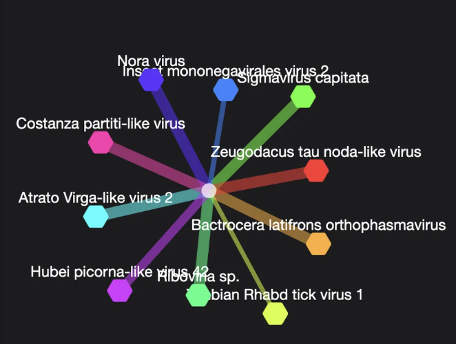
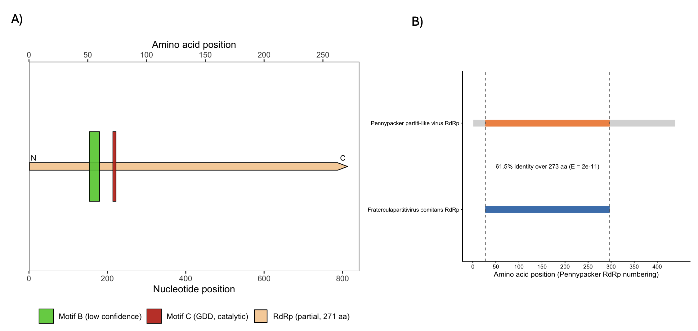
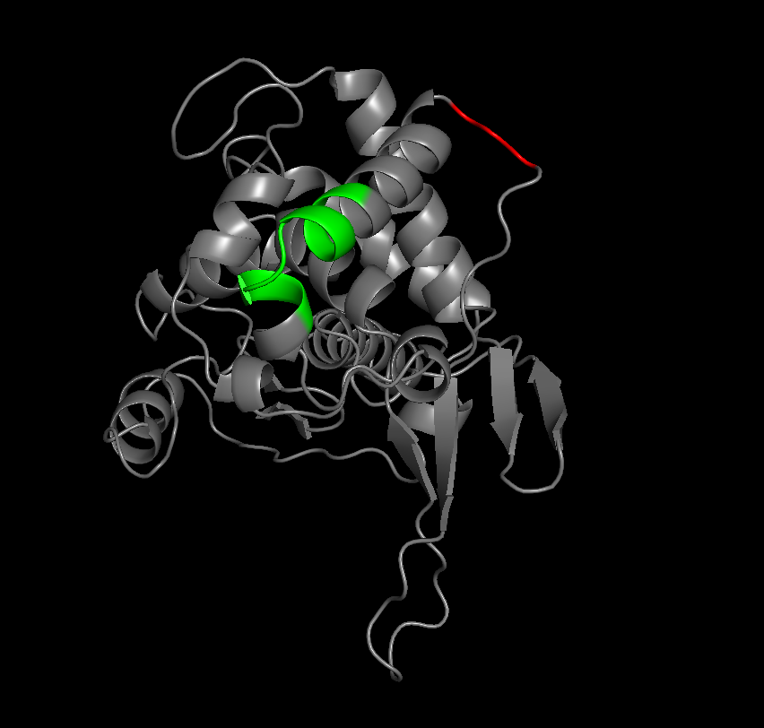
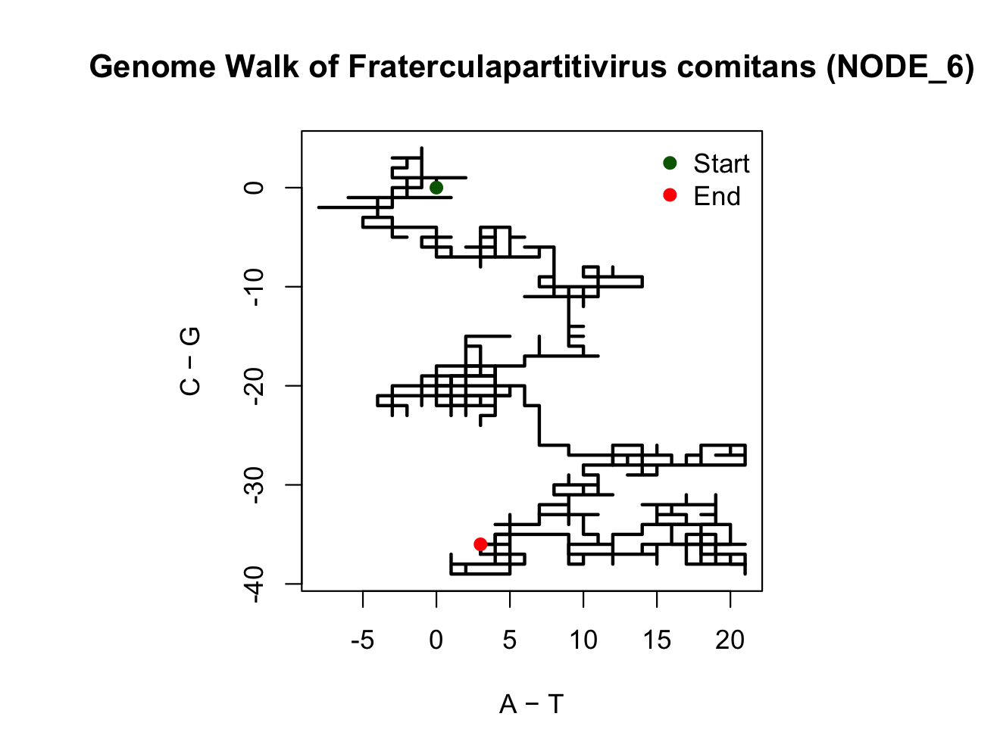

# "Partiti in Crime": a cryptic partitivirus hitchhiking on the fruit fly pest *Anastrepha fraterculus*

written by: Anzar Alvi

[YouTube/Video Link to your presentation video](https://videolink.goes.here)

### *Fraterculapartitivirus comitans*

-   Genus name – *Fraterculapartitivirus*

    -   “Fratercula–” refers to the primary host, *Anastrepha fraterculus*, a tephritid fruit fly that is a quarantine pest in several American countries and a major target for sterile insect technique–based control programs [Scannapieco et al., 2020].

        “–partitivirus” reflects the genomic and phylogenetic assignment of the RdRp segment to the family Partitiviridae (family of small, segmented double-standed RNA (dsRNA) viruses that usually persist in their hosts with low pathogenicity) [Nibert et al., 2014].

-   Species name – *comitans*

    -   “comitans” is Latin for “accompanying” or “travelling with” [*Comitans - Wiktionary, the Free Dictionary*, 2022]. This captures our key observation that this virus is consistently present as a cryptic companion of *Anastrepha fraterculus* across many independent transcriptome datasets, without obvious disease outbreaks.

Together, *Fraterculapartitivirus comitans* encapsulates the story of a partitivirus that persistently accompanies the fruit fly pest *Anastrepha fraterculus* that damages commercial fruit production in South America.


Image generated using Stable Diffusion Web [Podell et al., 2023].

## Abstract

Viruses form vast, mostly hidden communities within animals and plants, subtly influencing host fitness, ecology and evolution. High-throughput sequencing and computational mining now allow us to uncover these cryptic viral passengers directly from public transcriptome and metagenome data. In parallel, tephritid fruit flies such as *Anastrepha fraterculus* have emerged as major agricultural pests in South America, yet the RNA viromes of these species remain poorly characterized despite their economic importance [Scannapieco et al., 2020]. Members of the family Partitiviridae are small, segmented dsRNA viruses that typically establish persistent, low-pathogenicity infections in plants, fungi and some protists, and are only beginning to be recognized in insects [Nibert et al., 2014]. The presence, ecology and potential impact of partitiviruses associated with *A. fraterculus* are therefore unknown.

Here we show that a divergent RNA-dependent RNA polymerase (RdRp), sotu u979394, represents a partitivirus that is recurrently detected at low to moderate abundance in *Anastrepha* fruit fly transcriptomes, with the strongest signal in *Anastrepha fraterculus*. Using Serratus [Edgar et al., 2022] palmprint mining, SRA microassemblies and manual curation, we recover a single RdRp-encoding segment with canonical partitivirus motifs, and map its occurrence across 51 sequencing runs from 9 BioProjects [Sayers et al., 2024]. This digital ecology reveals a virus that is repeatedly found in host-focused RNA-seq datasets of apparently healthy flies, without association with a specific disease state or experimental treatment and without complex accessory gene content characteristic of acutely pathogenic RNA viruses. Our results therefore support a model in which this virus, which we name *Fraterculapartitivirus comitans*, behaves as a persistent, low-pathogenicity infection of *Anastrepha fraterculus* rather than an obvious natural biocontrol agent. More broadly, this work illustrates how petabase-scale computational virus discovery [Edgar et al., 2022] can expose previously unrecognized, largely tolerated viromes in key agricultural pests, providing hypotheses for future experimental tests of how such “cryptic companions” might modulate host biology and pest management strategies.

**The abstract above was written with the help of ChatGPT 5.1 (2025-12-11) (copy-and-editing) [OpenAI, 2025].**

## Results

### Digital Ecology

#### **2.1 Host association and dataset context**

To investigate the ecological context of this virus, I began by loading *virusRunObservations.csv* into R and filtering the table to sotu u979394 using the provided identifier. Using base R, I counted the number of unique SRA runs, BioProjects, and BioSamples, tabulated *scientific_name* to summarize host annotations, and inspected *node_coverage* as a run-level proxy for viral abundance. This workflow was recorded in an R script (2.1_code.R) to ensure reproducibility.

Across all datasets, u979394 was detected in 51 SRA runs, corresponding to 51 BioSamples and 9 distinct BioProjects. Host annotations were heavily skewed toward Neotropical tephritid fruit flies. Of the 51 runs, *Anastrepha fraterculus* accounted for 29 detections, *Anastrepha obliqua* for 15, *Anastrepha turpiniae* for 2, and *Anastrepha distincta* for 1. Two runs were annotated as “insect metagenome,” and two additional detections appeared in non-tephritid hosts (*Apatura laverna* and *Cenostigma pyramidale* root transcriptome). The highest viral contig coverage (node_coverage = 151) occurred in the *A. fraterculus* run SRR7666026, with other *Anastrepha* datasets showing moderate coverage and non-*Anastrepha* detections displaying much lower coverage.

These observations span nine BioProjects, including the index project PRJNA485419, several transcriptomic studies of *A. fraterculus* and *A. obliqua*, reproductive and head transcriptomes, microbiome-associated datasets, and even plant-associated root transcriptomes. Together, they originate from multiple South American institutions, USDA-ARS, and international research groups.

Overall, the consistent detection of u979394 across multiple labs, years, and independently generated transcriptomes, especially within *A. fraterculus*, suggests that it is not the result of contamination. Instead, its recurrence in healthy flies implies that it represents a persistent background component of the host’s molecular environment rather than a virus causing overt disease, consistent with typical partitivirus behavior.

#### **2.2 Index case: SRR7666026 as a representative ecological snapshot**

Using *virusAssignments.csv*, I identified my assigned virus as sotu u979394, nicknamed *tutorialProbable*, with index run SRR7666026, annotated as *Anastrepha fraterculus* (BioSample SAMN09789507; BioProject PRJNA485419). I inspected the Serratus entry for SRR7666026 to view its viral contigs and microassembly, downloaded the corresponding `.rdrp` file, and examined node 6, the contig containing the u979394 palmprint. Node 6 exhibited the highest reported node coverage (151) among all positive runs.

To contextualize the dataset, I retrieved metadata from the SRA and BioProject pages. SRR7666026 is an RNA-seq dataset from *A. fraterculus* sp. 1, produced using an Illumina HiSeq 2500 with a transcriptomic, randomly primed, paired-end library strategy—meaning no viral enrichment was performed. Despite this, the dataset yielded a well-covered RdRp contig (node 6), reinforcing that the viral RNA is present at biologically meaningful levels.

Using ORF Finder, I translated node 6 into a partial RdRp sequence that encapsulated the provided palmprint. The full nucleotide sequence and translated amino-acid fragment are shown above.

Altogether, the presence of a well-covered RdRp contig in a random-primed host transcriptome suggests that the virus is either replicating or maintained at detectable RNA levels in *A. fraterculus*. The associated study [Scannapieco et al., 2020] reports typical developmental and reproductive phenotypes for the host species, supporting the interpretation that u979394 represents a persistent, low-pathogenicity infection rather than an overtly harmful virus.

#### **2.3 Broader digital ecology and unexpected detections**

Expanding beyond the index case, I used the same R script to group u979394-positive runs by *scientific_name* and *bio_project*. Most detections originated from *Anastrepha* fruit flies collected across South American or Neotropical settings, sequenced by multiple Brazilian laboratories and other regional groups. However, several low-coverage detections appeared in unexpected contexts, including a plant root transcriptome (PRJNA552047), a butterfly mitochondrial genome dataset (PRJNA732951), and two “insect metagenome” libraries associated with *A. obliqua* larvae microbiomes (PRJNA845910).

These non-canonical detections exhibited lower node_coverage values and likely reflect incidental occurrences, such as insect contamination in plant samples, dietary or microbial RNA, low-level index hopping, or weak spillover into ecologically related arthropods. Rather than undermining host specificity, these anomalies highlight the complexities of interpreting meta-transcriptomic datasets. Inference of host association is therefore best grounded in recurrent, high-coverage detections such as those found in *Anastrepha*.

#### **2.4 Hypothesis emerging from digital ecology**

Integrating the observations from sections 2.1–2.3, u979394 is frequently and repeatedly detected in *Anastrepha* transcriptomes, especially in *A. fraterculus*, a major quarantine pest. It occurs at low-to-moderate coverage in host-focused RNA-seq libraries and displays sequence features consistent with the RdRp segment of the family Partitiviridae, which is known for persistent, asymptomatic infections.

Hypothesis: If *Fraterculapartitivirus comitans* is present in *Anastrepha fraterculus*, then it will not cause significant pathology or measurable fitness loss in the host insect, consistent with a persistent, low-impact viral infection.

Null hypothesis: The presence of *Fraterculapartitivirus comitans* has no effect on the pathology or fitness of *Anastrepha fraterculus*.

### **Integrated virus interrogation summary for *Fraterculapartitivirus comitans***

Across all analyses, NODE_6 from SRR7666026 is best interpreted as the RdRp segment of a novel insect-associated partitivirus persistently infecting *Anastrepha fraterculus*. Research suggests that partitiviruses are segmented dsRNA viruses with monocistronic RdRp and capsid segments, typically causing persistent, low-pathogenicity infections in plants and fungi, with recent discoveries expanding this to arthropods [Nibert et al., 2014; Cross et al., 2020]. The 813-nt NODE_6 contig encodes a 271-aa ORF containing a canonical GDD catalytic motif and returns BLASTp hits to partiti-like RdRps, with conserved palmprints across runs suggesting a single circulating species [Venkataraman et al., 2018; Sayers et al., 2024]. AlphaFold3 predicts a compact polymerase-like fold with high-confidence scores, while hydropathy and residue-class analyses support a soluble, globular enzyme rather than a membrane protein [Kyte & Doolittle, 1982; EMBL-EBI, 2018; Jumper et al., 2021]. In contrast, ProteInfer assigns host-like membrane and metabolic GO terms that are inconsistent with the structural, compositional and homology evidence, and are therefore treated as misannotations and a cautionary example of using host-trained models on divergent viral proteins [Sanderson et al., 2023]. Infernal detects no structured ncRNAs or ribozyme-like elements, reinforcing that NODE_6 is a protein-coding viral segment rather than host RNA [EMBL-EBI, 2018]. Comparative virome analysis (*Figure 1*) places the u979394 palmprint at the centre of a dense OpenVirome network of insect-associated partiti-like viruses, with high-coverage, moderate-identity clustering around Laodelphax striatellus partiti-like virus 1 and no association with vertebrate-infecting partitiviruses [Open Virome, 2025]. Alternative explanations including host transcripts, retroelements, spike-in contaminants, or misassigned virus families are collectively ruled out by motif content, coverage patterns, lack of host-like features, and recurrent detection across independent *Anastrepha* datasets. Overall, these integrated lines of evidence support a high-confidence model in which *Fraterculapartitivirus comitans* is a cryptic, persistent partitivirus companion of *Anastrepha fraterculus* rather than an acute pathogen or artefact.



**Figure 1. Network context of *Fraterculapartitivirus comitans* in insect-associated RNA viromes.** A palmprint-level similarity network was generated using the OpenVirome interactive viewer [Open Virome, 2025]. The seed palmprint corresponding to sotu u979394 (*Fraterculapartitivirus comitans*) is shown at the centre (light pink node). Each coloured spoke represents a closely related viral RdRp palmprint, including viruses annotated as Costanza partiti-like virus, Atrato Virga-like virus 2, Hubei picorna-like virus 42, and several other insect-associated RNA viruses. Edge lengths reflect palmprint similarity scores (OpenVirome defaults), and node colours are assigned per neighbour virus for visual clarity. The radial “hub-and-spoke” topology indicates that *Fraterculapartitivirus comitans* resides within a densely connected cluster of arthropod-associated partiti-like and other RNA viruses, rather than being an isolated artefact.

### *Fraterculapartitivirus comitans* Genome



**Figure 2. Genome organisation of the RdRp segment of *Fraterculapartitivirus comitans* and its relationship to a Pennypacker partiti-like virus polymerase. (A)** Schematic genome map of contig NODE_6 (813 nt) from SRR7666026, interpreted as the RdRp-encoding segment of *Fraterculapartitivirus comitans*. Open reading frames were identified using an ORF finder (default parameters) [Stothard, 2000]. A single long ORF spanning nt 1–813 encodes a 271-aa RdRp fragment (orange arrow), with nucleotide coordinates on the primary x-axis and corresponding amino-acid positions on the secondary x-axis. Approximate locations of conserved RdRp palm-domain motifs were annotated by alignment to related partitivirus RdRps [Venkataraman et al., 2018; Nibert et al., 2014]. A low-confidence putative motif B (green bar; residues \~52–60) and the high-confidence catalytic motif C (GDD) (red bar; residues 72–74) are marked. A canonical motif A (D-x(4–5)-D) could not be confidently located within this fragment, consistent with NODE_6 representing only the central catalytic core rather than a full-length polymerase. **(B)** Pairwise homology between the *Fraterculapartitivirus comitans* RdRp fragment and its closest BLASTp match, the Pennypacker partiti-like virus RdRp (accession QIJ70089.1). Protein lengths are indicated by light grey bars; coloured bars indicate the aligned region based on a BLASTp search against NCBI nr (default parameters; BLOSUM62 substitution matrix; search via NCBI web BLAST). The 271-aa F. comitans fragment (blue) aligns to residues 27–297 of the 439-aa Pennypacker RdRp (orange), with 61.5% amino-acid identity across 273 aligned positions (E = 2e-11). Vertical dashed lines mark the boundaries of the aligned region in Pennypacker coordinates. The high identity across the conserved catalytic core, combined with clear sequence divergence outside this region, supports assignment of *Fraterculapartitivirus comitans* as a distinct partiti-like virus species rather than a strain of Pennypacker partiti-like virus.

### AlphaFold3 Structure of *Fraterculapartitivirus comitans* RdRp Segment



**Figure 3. AlphaFold-predicted structure of the *Fraterculapartitivirus comitans* RdRp fragment with conserved motifs highlighted.** The 271-aa RdRp fragment encoded by NODE_6 was submitted to AlphaFold (monomer pipeline, default settings) for structure prediction [Jumper et al., 2021]. The highest-ranked model was visualized in PyMOL (v3.1.6.1, Schrödinger, LLC) as a cartoon representation (grey). Residues corresponding to the putative motif B (green helices; approximate positions 52–60) and the catalytic motif C (GDD) (red segment; residues 72–74) were highlighted by manual selection based on the multiple sequence alignment used in Figure 3. Both motifs cluster within the structured core of the predicted fold, oriented towards an internal cleft consistent with the polymerase active site. The remaining regions of the fragment show a mixture of α-helices and β-strands forming a compact globular domain, in line with known viral RdRp palm-and-fingers architectures [Venkataraman et al., 2018]. A canonical motif A could not be confidently located in the sequence and is therefore not annotated.

**Note on motif identification**

Motif C was identified based on the position of "GCC". Motif B was approximated to be \~20 aa's upstream of motif C [Gorbalenya et al., 2002].

Motif A, typically defined by a conserved D-x(4–5)-D sequence upstream of motif C in viral RNA-dependent RNA polymerases, could not be confidently identified within the 271 aa RdRp fragment analyzed here. Scanning the N-terminal region upstream of the GDD motif did not reveal a clear motif A consensus, suggesting that this fragment likely begins downstream of motif A or that motif A is partially truncated or highly divergent in this sequence. As a result, motif A was not visualized in the structure, and motif C (high confidence) and motif B (lower confidence) are the only motifs annotated in this figure.

### 2D Genome Walk of the *Fraterculapartitivirus comitans* RdRp Segment



**Figure 4. Two-dimensional genome walk of the *Fraterculapartitivirus comitans* RdRp segment (NODE_6).** To visualise base-composition patterns along the RdRp segment without alignment, I generated a 2D “genome walk” of the 813-nt contig NODE_6 from SRR7666026 using R (v4.x; base graphics). The FASTA file (data/node6.fa) was read with readLines( ), header lines starting with “\>” were removed, and the remaining sequence was concatenated and split into individual bases. For each nucleotide, a step was applied from 5′→3′: A contributed +1 on the x-axis, T/U −1 on the x-axis, C +1 on the y-axis, and G −1 on the y-axis (all other characters contributed 0). Cumulative sums of these steps (cumsum) produced the coordinates of the walk, starting at the origin (green dot) and ending at the final position (red dot). The blue polyline shows how the cumulative A–T (x-axis) and C–G (y-axis) balance changes along the genome. A purely random sequence would keep the path wandering around the origin like a symmetric random walk. Instead, NODE_6 shows a clear drift towards slightly positive A–T values (x ≈ +3) and strongly negative C–G values (y ≈ −36), indicating a consistent excess of G over C and a modest A/T bias across the RdRp segment. This structured, directional walk is characteristic of a constrained, protein-coding viral RNA shaped by codon usage and functional motifs, rather than a low-complexity or spuriously assembled sequence.

## Discussion

Characterizing *Fraterculapartitivirus comitans* changed how I think about “hidden” infections. Rather than behaving like a classic acute insect pathogen, this virus shows up again and again in healthy *Anastrepha fraterculus* transcriptomes, its minimal RdRp segment carrying canonical partitivirus motifs but no obvious virulence or accessory factors. Together with its broad but low-level presence across fruit-fly datasets, this supports a model of a persistent, largely tolerated infection that quietly rides along with an important agricultural pest. I find it striking that the same computational tools used to hunt for dramatic, disease-causing viruses instead revealed a cryptic companion, raising the question of how many similar “background” viruses are shaping host biology in ways we rarely notice.

## References

*comitans - Wiktionary, the free dictionary*. (2022). Wiktionary. <https://en.wiktionary.org/wiki/comitans>

Congrains, C., Zucchi, R. A., & de Brito, R. A. (2021). Phylogenomic approach reveals strong signatures of introgression in the rapid diversification of neotropical true fruit flies (Anastrepha: Tephritidae). *Molecular Phylogenetics and Evolution*, *162*, 107200. <https://doi.org/10.1016/j.ympev.2021.107200>

Cross, S. T., Maertens, B. L., Dunham, T. J., Rodgers, C. P., Brehm, A. L., Miller, M. R., Williams, A. M., Foy, B. D., & Stenglein, M. D. (2020). Partitiviruses Infecting Drosophila melanogaster and Aedes aegypti Exhibit Efficient Biparental Vertical Transmission. *Journal of Virology*, *94*(20), e01070-20. <https://doi.org/10.1128/JVI.01070-20>

Edgar, R. C., Taylor, J., Lin, V., Altman, T., Barbera, P., Meleshko, D., Lohr, D., Novakovsky, G., Buchfink, B., Al-Shayeb, B., Banfield, J. F., de la Peña, M., Korobeynikov, A., Chikhi, R., & Babaian, A. (2022). Petabase-scale sequence alignment catalyses viral discovery. *Nature*, *602*(7895), 142–147. <https://doi.org/10.1038/s41586-021-04332-2>

EMBL-EBI. (2018). *The European Bioinformatics Institute \< EMBL-EBI*. Ebi.ac.uk. <https://www.ebi.ac.uk/>

Gorbalenya, A. E., Pringle, F. M., Zeddam, J.-L., Luke, B. T., Cameron, C. E., Kalmakoff, J., Hanzlik, T. N., Gordon, K. H. J., & Ward, V. K. (2002). The Palm Subdomain-based Active Site is Internally Permuted in Viral RNA-dependent RNA Polymerases of an Ancient Lineage. *Journal of Molecular Biology*, *324*(1), 47–62. [https://doi.org/10.1016/s0022-2836(02)01033-1](https://doi.org/10.1016/s0022-2836(02)01033-1)

Jumper, J., Evans, R., Pritzel, A., Green, T., Figurnov, M., Ronneberger, O., Tunyasuvunakool, K., Bates, R., Žídek, A., Potapenko, A., Bridgland, A., Meyer, C., Kohl, S. A. A., Ballard, A. J., Cowie, A., Romera-Paredes, B., Nikolov, S., Jain, R., Adler, J., & Back, T. (2021). Highly Accurate Protein Structure Prediction with Alphafold. *Nature*, *596*(7873), 583–589. <https://doi.org/10.1038/s41586-021-03819-2>

Kyte, J., & Doolittle, R. F. (1982). A simple method for displaying the hydropathic character of a protein. *Journal of Molecular Biology*, *157*(1), 105–132. [https://doi.org/10.1016/0022-2836(82)90515-0](https://doi.org/10.1016/0022-2836(82)90515-0)

Nibert, M. L., Ghabrial, S. A., Maiss, E., Lesker, T., Vainio, E. J., Jiang, D., & Suzuki, N. (2014). Taxonomic reorganization of family Partitiviridae and other recent progress in partitivirus research. *Virus Research*, *188*, 128–141. <https://doi.org/10.1016/j.virusres.2014.04.007>

OpenAI. (2025). *ChatGPT*. ChatGPT 5.1; OpenAI. <https://chatgpt.com/>

*Open Virome*. (2025). Openvirome.com. <https://openvirome.com/?filters=%5B%5D&palmprintOnly=true>

Podell, D., English, Z., Lacey, K., Blattmann, A., Dockhorn, T., Müller, J., Penna, J., & Rombach, R. (2023, July 4). *SDXL: Improving Latent Diffusion Models for High-Resolution Image Synthesis*. ArXiv.org. <https://doi.org/10.48550/arXiv.2307.01952>

R Core Team (2021). R: A language and environment for statistical computing. R Foundation for Statistical Computing, Vienna, Austria. URL [https://www.R-project.org/](https://www.R-project.org/.)

Sanderson, T., Bileschi, M. L., Belanger, D., & Colwell, L. J. (2023). ProteInfer, deep neural networks for protein functional inference. *ELife*, *12*. <https://doi.org/10.7554/elife.80942>

Sayers, E., Beck, J., Bolton, E., Brister, J., Chan, J., Connor, R., Feldgarden, M., Fine, A., Funk, K., Hoffman, J., Kannan, S., Kelly, C., Klimke, W., Kim, S., Lathrop, S., Marchler-Bauer, A., Murphy, T., O’Sullivan, C., Schmieder, E., & Skripchenko, Y. (2024). Database resources of the National Center for Biotechnology Information in 2025. *Nucleic Acids Research*, *53*(D1). <https://doi.org/10.1093/nar/gkae979>

Scannapieco, A. C., Conte, C. A., Máximo Rivarola, Wulff, J. P., Muntaabski, I., Andrés Ribone, Milla, F., Cladera, J. L., & Lanzavecchia, S. B. (2020). Transcriptome analysis of Anastrepha fraterculus sp. 1 males, females, and embryos: insights into development, courtship, and reproduction. *BMC Genomic Data*, *21*(S2). <https://doi.org/10.1186/s12863-020-00943-2>

Stothard, P. (2000). The Sequence Manipulation Suite: JavaScript Programs for Analyzing and Formatting Protein and DNA Sequences. *BioTechniques*, *28*(6), 1102–1104. <https://doi.org/10.2144/00286ir01>

The PyMOL Molecular Graphics System, Version 3.1.6.1 Schrödinger, LLC.

Venkataraman, S., Prasad, B., & Selvarajan, R. (2018). RNA Dependent RNA Polymerases: Insights from Structure, Function and Evolution. *Viruses*, *10*(2), 76. <https://doi.org/10.3390/v10020076>

## Tweets

**Tweet 1/3:**

```         
🧬🪰 *Virus discovery in plain sight!* Using public RNA-seq data, I
identified a previously uncharacterized partitivirus repeatedly detected
in the fruit fly pest *Anastrepha fraterculus*. Rather than an outbreak
virus, it appears to be a persistent, cryptic companion. #Virology
#RNAseq
```

**Tweet 2/3:**

```         
🔍 The virus, *Fraterculapartitivirus comitans*, encodes a minimal RdRp
with canonical motifs (A–C, including GDD), shows moderate but
consistent coverage across 51 SRA runs, and lacks obvious virulence or
accessory genes. A classic persistent dsRNA virus hiding in host
transcriptomes.
```

**Tweet 3/3:**

```         
🌍 This work highlights how petabase-scale mining (Serratus + SRA)
uncovers “background viromes” in important species. How many tolerated
viruses are quietly shaping host biology without us noticing? Probably
lots. #ComputationalBiology #VirusDiscovery
```

**ChatGPT 5.1 (2025-12-11) [OpenAI, 2025] helped with setting up the templates for the tweets, but I filled them in.**

# Viral Short Story (Robert Frost Poem)

```         
Whose fields these are, I think I know—
they’re lined with orchard rows and rain,
where fraterculus in quiet flight
threads dusk between the sugarcane.

No herald’s cry, no flare of fear,
announces what the fly now bears:
a silent guest of doubled strands,
a partitivirus unawares.

Not one that burns the host to ash,
nor steals its breath in sweeping rage—
but one that keeps a modest house,
a tenant on a borrowed stage.
Persistent in its gentle stay,
it hums within the transcript’s read,
its RdRp’s small G-D-D
a whispered mark of how it breeds.

Across the labs, across the years,
it glimmers in the data still—
in Pelotas’ jars, in São Carlos’ nets,
a quiet pulse no spray can kill.
Some roots and wings beyond the fly
record its trace in passing light,
yet strongest is its steady glow
where Anastrepha carves the night.

So here, beside the orchard’s fence,
beneath a humid, southern sky,
a virus walks with modest steps
and shares the road with every fly.
Two travelers, neither quite alone,
yet neither one the other’s loss—
their paths converge not out of fate,
but just the smallest crossing gloss.

And miles to map before we know
what such companions come to mean—
how softly life may harbor those
who dwell unheard, and live unseen.
```

**ChatGPT 5.1 (2025-12-11) [OpenAI, 2025] generated the poem above.**
