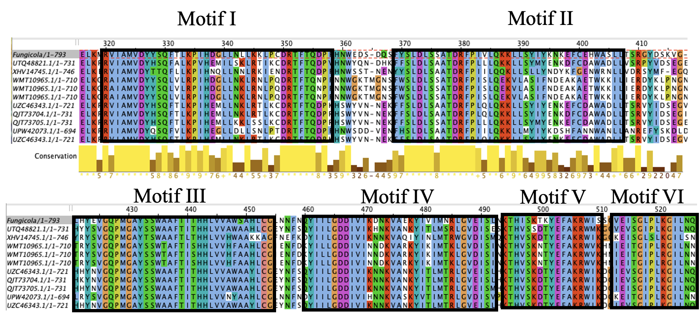
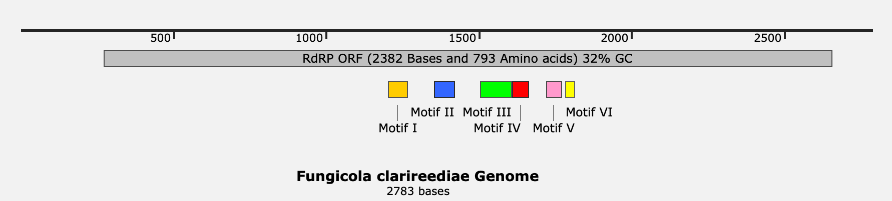
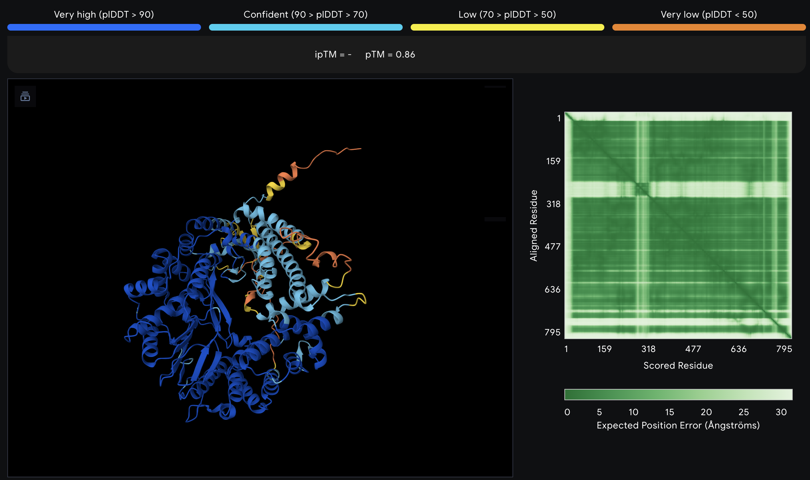
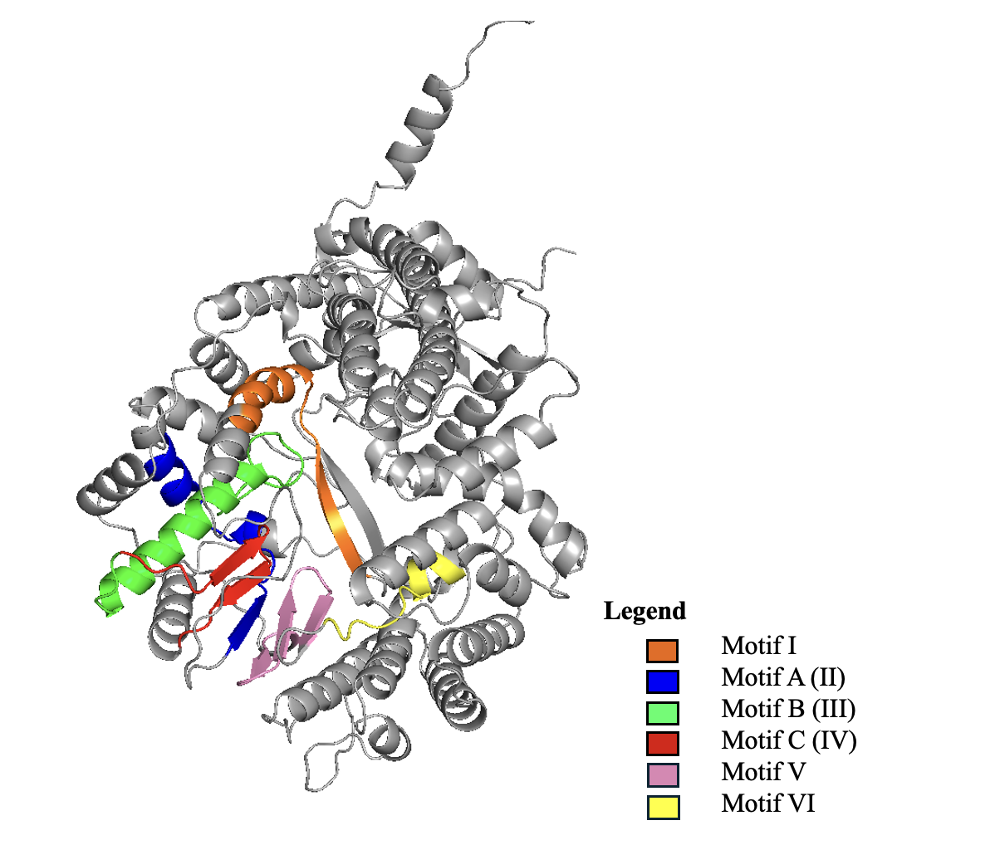
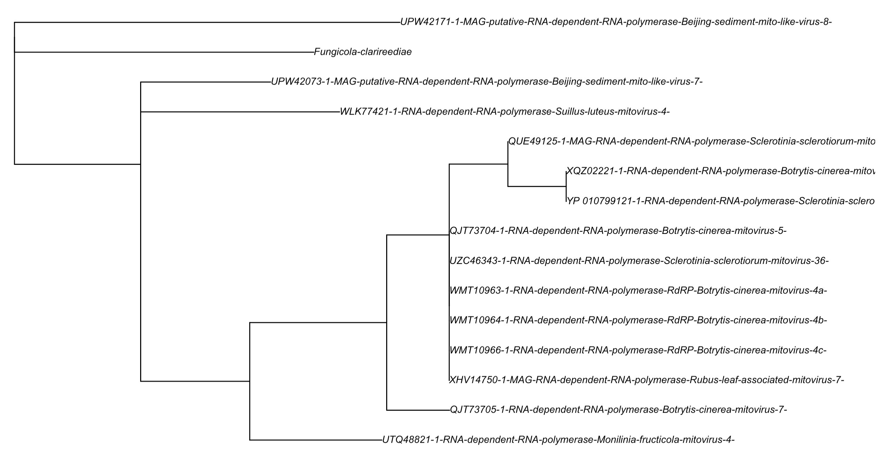
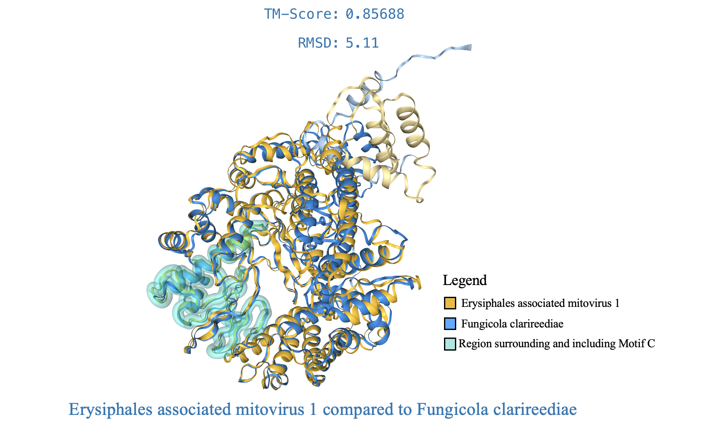
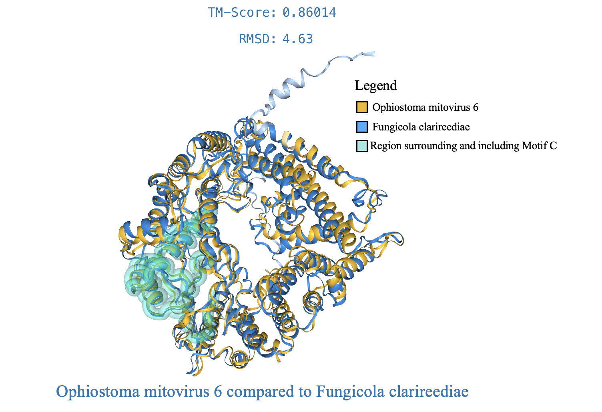

---
output:
  html_document: default
  pdf_document: default
---
# Identification and Characterization of a Novel Mitovirus Infecting the Dollar Spot Fungus Clarireedia homoeocarpa: Turns Out, It’s a Real FunGUY (virus)
written by: Nour Hassan (https://github.com/hassa963)

### Fungicola clarireediae
```
The first part, Fungicola, indicates that the 
virus is a “fungus-dweller,” reflecting its biology as a mitovirus inhabiting a 
fungal mitochondria. The species epithet clarireediae is the Latin genitive 
form of Clarireedia, referring to the fungal genus with which the virus is 
associated. Together, the name means “the fungus-dweller of Clarireedia.” 
Capturing its biology and its host interaction.
```


## Abstract

Advances in high-throughput sequencing have brought viral discovery to a new age, 
revealing vast unexplored viral diversity in both environmental and clinical samples. 
However, this introduces a new challenge: characterizing these viruses and understanding
their biological significance. Mitoviruses are positive-sense single-stranded RNA 
viruses (genome size lies between 2151 and 4955bps (Jacquat et al., 2023) that infect 
the mitochondria of fungi, encoding only a single protein, RNA-dependent RNA polymerase
(RdRp), which is essential for viral replication (Lopez-Jimenez et al., 2023). Here 
we show the identification and characterization of a novel mitovirus, Fungicola 
clarireediae, incidentally discovered within RNA-sequencing data from the plant 
pathogenic fungus Clarireedia homoeocarpa, which causes dollar spot disease in 
turf grass systems. Phylogenetic analysis reveals that Fungicola clarireediae 
clusters closely with mitoviruses infecting diverse plant-pathogenic fungi, and 
structural comparisons via AlphaFold and FoldSeek demonstrate high conservation 
of the catalytic RdRp domain with Erysiphales-associated mitovirus 1 and Ophiostoma 
mitovirus 6. These findings suggest that mitoviral infections may be endemic to 
fungal plant pathogens and functionally conserved across diverse hosts. Our work
expands the known diversity of fungal mitoviruses and provides a framework for 
investigating viral-host interactions that could inform novel strategies for 
managing fungal diseases in economically important plant systems. 

## Results

### Ecology subsection A...

## Identification of Clarireedia homoeocarpa-associated mitovirus 

**The Dataset:**

This dataset was submitted by the University of Massachusetts and is associated 
with two BioProjects, PRJNA167556 and PRJNA400330, and a single publication: 
Hulvey, J., Popko, J. T., Sang, H., Berg, A., & Jung, G. (2012). Overexpression 
of shcyp51b and shatrd in Sclerotinia homoeocarpa isolates exhibiting practical 
field resistance to a demethylation inhibitor fungicide. Applied and Environmental 
Microbiology, 78(18), 6674–6682. https://doi.org/10.1128/aem.00417-12 . 
The original study focused on genetic factors contributing to reduced 
sensitivity to the demethylation inhibitor (DMI) fungicide propiconazole in 
Clarireedia homoeocarpa isolates, which served as a model for understanding the
mechanisms underlying DMI resistance.
  
During analysis of these datasets, a previously unreported viral sequence (later called Fungicola clarireediae) was 
identified. The virus was detected in only one host species, Clarireedia 
homoeocarpa, across both BioProjects, which were initially designed to investigate
fungicide resistance rather than virome composition. In PRJNA167556, the viral 
palmprint was detected in SRR515155 and SRR515154, while in PRJNA400330 it was 
detected in SRR5980381 and SRR5980382. Notably, the virus was absent from other 
runs within these BioProjects. This differential detection likely reflects 
multiple factors: (1) genuine biological variation in viral presence across isolates, 
(2) variation in sequencing depth or coverage among runs, particularly plausible 
given the low coverage even in the best run (SRR5980381 at 7.33×), or (3) 
stochastic sampling effects during library preparation. Importantly, the viral 
sequence was detected in both fungicide-treated and untreated samples, 
suggesting the virus is endemic to C. homoeocarpa rather than treatment-induced 
or transient.

The RNA-seq data were generated using the Illumina HiSeq 2000 platform and 
consist of 27.5 million spots, 5.6 Gbp of sequence, corresponding to 3.6 Gb of 
downloadable data.

**Host Context:**
  
The sample was derived from Clarireedia homoeocarpa isolates collected from 
turfgrass in New England. C. homoeocarpa belongs to the recently established 
genus Clarireedia, which includes five known species:

- C. bennettii

- C. jacksonii

- C. monteithiana

- C. paspali

- C. homoeocarpa

Members of this genus cause dollar spots, a major problem in turfgrass systems 
with substantial economic consequences (Hu et al., 2021). Considerable resources
have been devoted toward fungicide development and evaluation (Hu et al., 2021).

**Virus Sequence Retrieval:**
  
The palmprint amino acid sequence (YSLDLSSATDRFPIVLQKKLLSYIYKNKEFCEHWASLLTSRGYDS
KVGLLHYEVGQPMGAYSSAAFTITHHLVVASAHLCGLNNFNQYIILGDDIVI) was used as a query in tblastn
(Altschul et al., 1990) against the highest-coverage sequencing run (SRR5980381). 
The resulting alignments enabled identification of the corresponding viral contig 
within the Logan assembly. This contig was then analyzed using ORFfinder (Rombel et al., 2002)
with genetic code 4 (Mold, Protozoan, and Coelenterate Mitochondrial Code), restricting 
prediction to a minimum ORF length of 100 amino acids and all three forward reading frames.

When ORFfinder was run with default parameters, it detected only short peptide 
fragments (~70 amino acids). However, because the palmprint region showed strong similarity
to known mitoviruses in initial BLASTp searches (Altschul et al., 1990) and the 
host is fungal, genetic code 4 was used for accurate ORF prediction. Fungal mitochondria
interpret UGA as tryptophan rather than as a stop codon (Nibert, 2017), and the 
candidate mitovirus ORF contained multiple UGA codons; these were incorrectly treated 
as termination signals under the default standard-code setting, thereby producing 
spuriously truncated peptides.
```
    Novel RdRp coding sequence:
    ATGCATAGGTCAGCGGCTAACGGACTGACCGGTCTAATAACTGTTAGATCCAAACCGAGCA
    TCATTATGAAAAATCACAAAATTACAACAATCCTAATAATAAGATTAGTAAGATTATTGTT
    CTCTCGTGATTGTTCACTAATAATTACTCAGTACATGTCTATTATTAATAAAATCCGAAAG
    GATTCTGGTTTAACATACTGTATCAAGTATATGAAAGCTGTAAAGCTTCATATTACTAGAT
    ATATGTGTGGTAAGCCATTATTTATTAATAATAGTGGAGTCGGAGTAGATAGTACTGGTTG
    ACCAACAAAGTTCCTATTTCTTAAAACTTTATTAAAAAGTAATAATGATATAAGAATTTTG
    TTAACTCTTCTATCTTATACACGGGCTATAAAACCCACATATAAGGAGGAGAGTAAGGTAC
    AACCAGACTACCAATCCATTACTAATAAATATACTGGTAAGAATTATACTATACCAGCATG
    GTTTATTAAACAATGGATTGACAAACATCACCTGCACCTAAATCTTCCACAATACTCTAAC
    AAAGATCATTATGTAAGTATGAAAGCTAGTCCTAACGGACCAGCAACATACTCATCATTAT
    GATCTGTTCTTTGTTTAAGTTATCCTCAACTAAATAACTTATATAACATGTTGGGATCATA
    TGGTGAGGTTTTAACCTCATTCTATAATTCCGCATGAAATTTAAGTGATACAATTTCATCT
    ATCCATGTAATGTATAAAAGACCTGACGGAAGTTGGGTCCTTTATAATTATAAGGATGATA
    AAATTGTAATTAGTAAAGGATCATCAGAAGAAATAGTTGAATATGCTAAAAGCAATTCAAT
    TATTATTTCTGATAAAATAAACAAGGAATGAAAGAGTAGAACCGGAAAATTGTCAATTGTA
    AAAGATCCTGAATTAAAAATGAGAGTAATTGCTATGGTAGATTACTATAGTCAATTTACTC
    TTAAACCTATACATGATGGTTTACTTAATTTACTTAAGAAATTACCATGTGATAGGACTTT
    TACTCAGGATCCATTTCACAATTGAGAGGATTCGGATCAGTCCTTCTACTCGTTGGATCTG
    TCAAGCGCTACAGACCGATTTCCAATAGTTTTACAAAAGAAACTTTTATCTTATATTTATA
    AGAATAAAGAATTTTGTGAACATTGGGCATCGCTATTAACCTCAAGAGGATATGATTCCAA
    AGTTGGTCTACTTCATTATGAAGTAGGACAACCAATGGGAGCATATTCTTCTTGAGCAGCC
    TTCACTATAACTCATCACCTAGTAGTTGCTTGATCTGCACATTTGTGCGGGTTAAACAACT
    TTAATCAATATATAATTCTGGGTGACGATATTGTCATAAAAGACAATAAAGTTGCCGAGAA
    GTATATAGTGATTATGAATAGGTTAGGGGTTGAAATATCTTTAAACAAAACTCATATTAGT
    AAAACTAAATATGAATTTGCTAAAAGATGAATTTCAAGTGGGGTTGAGATTTCAGGTTTAC
    CACTAAAGGGAATTTTAAATCAATTTAATAATATTAACGTAGTTTACGTTACATTATTTAC
    TTGATGTAAAAGAACCTTTGTGCAACCTGAACCTATAATAGACCTTGTGGCGAAATTATAT
    TCTAATATACAATACGGTAAAAGACGTAAGTCTTTTAAAGCATTGTATAGAAGTTTATGAG
    ACTTTCACCATTCGATGAGATTTAGCTTTGGATATCTAACATATGATGAACTACGTTCATA
    TATATGTAAGAAATCCTTTAAGCAAGATCTTATCTTCCCTCCTGAAAGTGTAGCTCCTCAA
    TGAATGAGGCACCTCCTTTCGGAAGGATTGGTGAATGAAGCACAGACGGTATCTAAAGAGA
    TATTAGGTCAATACAAAAAGTTTGAAGATAAATTCAAACCTATTGTTAAAGACTTAAACAC
    TCTTAAAGATTATCCACTTATTCATGGATTTGCAAATCATTTGCAAAGCATGAAAAGTAAG
    ATAAAGGCTTACGAGAATGACAATTCTACATTGTTAGACTCTGCTATGTCTTTACGAGTCG
    AGAAAGCGGACAAAATAGTAAACTTGCATAGAAATAAATCTACTCAAGTTGCTGTTATGGC
    CAAGCTTTGACGATCCGCCATTAAGACATTAATCCCAGAAAGGGATGAATGGTACTTAATG
    TTTAATCCTCACTTAGCAGGTGAAGATGTGCTTCCGATTTCATCTTGAGAAGGTGCGCTGG
    ATAAAAATATCCAGTTTACCCTTTCAGAAATGAAACCGTGATTAGAAGGAACAATCAAGAA
    AGAAGAAGAAATTCAAAAGAATTCTTGAGAATCATTAGATTGAGGAGATTTTAAAATCGAC
    TAA
    
    
    Protein Sequence of Novel RdRp:
    MHRSAANGLTGLITVRSKPSIIMKNHKITTILIIRLVRLLFSRDCSLIITQYMSII
    NKIRKDSGLTYCIKYMKAVKLHITRYMCGKPLFINNSGVGVDSTGWPTKFLFLKTLLKSN
    NDIRILLTLLSYTRAIKPTYKEESKVQPDYQSITNKYTGKNYTIPAWFIKQWIDKHHLHL
    NLPQYSNKDHYVSMKASPNGPATYSSLWSVLCLSYPQLNNLYNMLGSYGEVLTSFYNSAW
    NLSDTISSIHVMYKRPDGSWVLYNYKDDKIVISKGSSEEIVEYAKSNSIIISDKINKEWK
    SRTGKLSIVKDPELKMRVIAMVDYYSQFTLKPIHDGLLNLLKKLPCDRTFTQDPFHNWED
    SDQSFYSLDLSSATDRFPIVLQKKLLSYIYKNKEFCEHWASLLTSRGYDSKVGLLHYEVG
    QPMGAYSSWAAFTITHHLVVAWSAHLCGLNNFNQYIILGDDIVIKDNKVAEKYIVIMNRL
    GVEISLNKTHISKTKYEFAKRWISSGVEISGLPLKGILNQFNNINVVYVTLFTWCKRTFV
    QPEPIIDLVAKLYSNIQYGKRRKSFKALYRSLWDFHHSMRFSFGYLTYDELRSYICKKSF
    KQDLIFPPESVAPQWMRHLLSEGLVNEAQTVSKEILGQYKKFEDKFKPIVKDLNTLKDYP
    LIHGFANHLQSMKSKIKAYENDNSTLLDSAMSLRVEKADKIVNLHRNKSTQVAVMAKLWR
    SAIKTLIPERDEWYLMFNPHLAGEDVLPISSWEGALDKNIQFTLSEMKPWLEGTIKKEEE
    IQKNSWESLDWGDFKID
```    
The BLASTp results of the novel RdRp protein sequence had the most significant
match with Monilinia fructicola mitovirus 4 (E value of 0.0 and a percent 
identity of 54.95%). The strong BLASTp similarity between the novel RdRp and 
Monilinia fructicola mitovirus 4 (E-value 0.0; ~55% identity) supports the 
hypothesis that this newly identified virus is a mitovirus infecting the 
mitochondria of the plant pathogen Clarireedia homoeocarpa. Based on this 
similarity, I further hypothesize that it will phylogenetically cluster with 
other mitoviruses known to infect fungal plant pathogens.

### Virus Genome {Q3}

The open reading frame was submitted along with all complete mitovirus RdRp 
sequences available, retrieved using the following Entrez Direct (Kans, 2024) command:

```
esearch -db protein -query "(mitovirus OR Mitoviridae OR mitovirus-like) AND (RNA-dependent RNA polymerase OR RdRp)"| grep -v -i "partial" | sed 's/^\(>.*\)\([^>]\)/\1\n\2/' > mito_filtered.fasta"
```

These sequences were analyzed using NGPhylogeny.fr’s (Lemoine et al., 2019) one-click workflow, where 
they were aligned with MAFFT (Katoh & Standley, 2013), trimmed using BMGE (Criscuolo & Gribaldo, 2010), and used to infer a phylogenetic
tree with FastTree (Price et al., 2009). From this tree, the ten closest sequences to Fungicola 
clarireediae were extracted using a script provided by Claude (model sonnet 4.5, 
12-07-2025). and were These sequences were then re-aligned with MAFFT (Katoh & Standley, 2013) and 
visualized in Jalview to annotate conserved and consensus motifs (Figure 1). 
Using these annotations, a corresponding genome map was generated in SnapGene (Dotmatics, 2025) (Figure 2).  


```
Figure 1.
Shown here are the consensus regions identified from the alignment of Fungicola 
clarireediae with the ten closest sequences in its unrooted subtree. Among the 
six RdRp motifs, Motif IV, containing the well-documented GDD catalytic triad 
and also referred to as Motif C (Ramaswamy et al., 2022), is the most strongly 
conserved. Motif II, which features the characteristic D-x(4,5)-D motif, and 
Motif III are also relatively well conserved and correspond to Motif A and 
Motif B, respectively (Ramaswamy et al., 2022).
```


```
Figure 2. 
Shown here is the genome map of Fungicola clarireediae. The virus contains a 
single 2,382-base coding sequence encoding an RdRp of 793 amino acids and exhibits 
a relatively low GC content of 32%. The map also indicates the positions within 
the ORF corresponding to the conserved consensus motifs identified in the multiple sequence alignment.
```
### Putative Protein structures

The RdRp protein sequence was then submitted to AlphaFold (Jumper et al., 2021) to predict its putative 
tertiary structure (Figure 3). The resulting model was subsequently imported into
PyMOL, where it was annotated to highlight the conserved consensus regions as 
well as the key catalytic Motifs A, B, and C (Figure 4).


```
Figure 3.
Shown here is the AlphaFold-predicted structure of the RdRp. The central catalytic 
palmprint domain is modeled with high confidence (dark blue), whereas the finger and terminus
domains show lower confidence (light blue to orange) and are therefore less reliable in their predicted conformations. The PAE plot (top right, Figure 3) shows the predicted aligned error (PAE) between amino acid pairs in the RdRp structure. Green regions indicate high confidence in the predicted distances between residues, whereas lighter areas represent lower-confidence regions. The prominent dark green diagonal line spanning the sequence reflects AlphaFold’s accurate prediction of inter-residue distances within the RdRp core, which is essential for understanding the geometry of the active site. In contrast, the elevated PAE values at the N- and C-terminal regions indicate increased structural flexibility and reduced prediction reliability in those areas
```


```
Figure 3.
Shown here is the annotated AlphaFold structure, illustrating both the consensus 
sequence regions and the major catalytic motifs in their structural context.
```
### Phylogenetics and Structure comparision

As described above, a phylogenetic tree was generated, and the unrooted subtree (composed of two levels) 
containing Fungicola clarireediae was extracted using a script provided by Claude 
(model Sonnet 4.5, 2025-12-03) (Figure 5). Within this subtree, the sequence clusters 
closely with other mitoviruses infecting plants or fungi, with the sole exception
of the Beijing sediment mito-like virus, whose host remains unclassified. 
This pattern supports the hypothesis that the novel virus identified here is 
indeed a fungal mitovirus. Furthermore, when the AlphaFold-predicted structure 
was queried using Foldseek (van Kempen et al., 2023), it showed strong similarity to the RdRps of 
Erysiphales-associated mitovirus 1 and Ophiostoma mitovirus 6, both of which 
infect fungal hosts (Figures 6 and 7). 


```
Figure 5. 

Shown here is the unrooted subtree containing sequences closely related to Fungicola 
clarireediae, extracted from a phylogenetic tree generated by the FastTree (Price et al., 2009) one-click
workflow on NGPhylogeny (Lemoine et al., 2019). All sequences belong to viruses infecting various plants 
or fungi, with the exception of the Beijing sediment mito-like virus, whose host
remains unclassified.
```

```
Figure 6. 
Shown here is the Foldseek alignment between Erysiphales-associated mitovirus 1 
and Fungicola clarireediae. The region surrounding and including Motif C aligns 
closely between the two structures, and the TM-score of ~0.86 indicates strong 
structural similarity. The RMSD of 5.11 likewise supports a generally similar 
fold, particularly given that the major deviations (visible in the top-right 
region) correspond to low-confidence areas in the original AlphaFold model shown 
in Figure 3.
```


```
Figure 7. 
Shown here is the Foldseek alignment between Ophiostoma mitovirus 6 and Fungicola 
clarireediae. The region surrounding and including Motif C aligns closely between 
the two structures, and the TM-score of ~0.86 indicates strong structural similarity. 
The RMSD of 4.63 further supports a broadly similar fold, especially considering 
that the primary deviation, the terminal helix in the top-right region, corresponds
to a low-confidence area in the original AlphaFold model shown in Figure 3.
```
## Discussion

Characterizing Fungicola clarireediae reveals that mitoviral infections in fungi 
are not rare artifacts of sequencing but rather endemic components of the fungal 
genome. The structural and phylogenetic conservation of Fungicola clarireediae 
with other fungi-infecting mitoviruses suggests that these viral-host relationships
are functionally conserved across diverse fungal hosts. Understanding these 
associations could reveal novel mechanisms for managing fungal diseases in 
agriculture, particularly dollar spot in turf grass systems where fungicide 
resistance is already a critical problem.

## References

Altschul, S. F., Gish, W., Miller, W., Myers, E. W., & Lipman, D. J. (1990). Basic local alignment search tool. Journal of Molecular Biology, 215(3), 403–410.

Criscuolo, A., & Gribaldo, S. (2010). BMGE (block mapping and gathering with entropy): A new software for selection of phylogenetic informative regions from multiple sequence alignments. BMC Evolutionary Biology, 10(1), 210. https://doi.org/10.1186/1471-2148-10-210 

Dotmatics (formerly GSL Biotech). (2025). SnapGene (Version 8.2.1) [Computer software]. https://www.snapgene.com

Hu, J., Zhang, H., Dong, Y., Jiang, S., Lamour, K., Liu, J., Chen, Y., & Yang, Z. (2021). Global distributions of Clarireedia species and their in vitro sensitivity profiles to fungicides. Agronomy, 11(10), 2036. https://doi.org/10.3390/agronomy11102036 

Hulvey, J., Popko, J. T., Sang, H., Berg, A., & Jung, G. (2012). Overexpression of shcyp51b  and  shatrd  in Sclerotinia homoeocarpa isolates exhibiting practical field resistance to a demethylation inhibitor fungicide. Applied and Environmental Microbiology, 78(18), 6674–6682. https://doi.org/10.1128/aem.00417-12 

Jacquat, A. G., Theumer, M. G., & Dambolena, J. S. (2023). Putative mitoviruses without in-frame UGA(W) codons: Evolutionary implications. Viruses, 15(2), 340. https://doi.org/10.3390/v15020340 

Jumper, J., Evans, R., Pritzel, A., Green, T., Figurnov, M., Ronneberger, O., Tunyasuvunakool, K., Bates, R., Žídek, A., Potapenko, A., Bridgland, A., Meyer, C., Kohl, S. A., Ballard, A. J., Cowie, A., Romera-Paredes, B., Nikolov, S., Jain, R., Adler, J., … Hassabis, D. (2021). Highly accurate protein structure prediction with alphafold. Nature, 596(7873), 583–589. https://doi.org/10.1038/s41586-021-03819-2 

Kans, J. (2024). Entrez Direct: E-utilities on the UNIX command line. National Center for Biotechnology Information.

Katoh, K., & Standley, D. M. (2013). MAFFT multiple sequence alignment software version 7: Improvements in performance and usability. Molecular Biology and Evolution, 30(4), 772–780. https://doi.org/10.1093/molbev/mst010 

Lemoine, F., Correia, D., Lefort, V., Doppelt-Azeroual, O., Mareuil, F., Cohen-Boulakia, S., & Gascuel, O. (2019). NGPhylogeny.fr: New Generation Phylogenetic services for non-specialists. Nucleic Acids Research, 47(W1). https://doi.org/10.1093/nar/gkz303 

Nibert, M. L. (2017). Mitovirus UGA(TRP) codon usage parallels that of host mitochondria. Virology, 507, 96–100. https://doi.org/10.1016/j.virol.2017.04.010 

Price, M. N., Dehal, P. S., & Arkin, A. P. (2009). FastTree: Computing large minimum evolution trees with profiles instead of a distance matrix. Molecular Biology and Evolution, 26(7), 1641–1650. https://doi.org/10.1093/molbev/msp077 

Ramaswamy, K., Rashid, M., Ramasamy, S., Jayavelu, T., & Venkataraman, S. (2022). Revisiting viral RNA-dependent RNA polymerases: Insights from recent structural studies. Viruses, 14(10), 2200. https://doi.org/10.3390/v14102200 

Rombel, I. T., Sykes, K. F., Rayner, S., & Johnston, S. A. (2002). ORF-Finder: A vector for high-throughput gene identification. Gene, 282(1–2), 33–41. https://doi.org/10.1016/s0378-1119(01)00819-8 

van Kempen, M., Kim, S. S., Tumescheit, C., Mirdita, M., Lee, J., Gilchrist, C. L., Söding, J., & Steinegger, M. (2023). Fast and accurate protein structure search with foldseek. Nature Biotechnology, 42(2), 243–246. https://doi.org/10.1038/s41587-023-01773-0 

Waterhouse, A. M., Procter, J. B., Martin, D. M., Clamp, M., & Barton, G. J. (2009). Jalview version 2—a multiple sequence alignment editor and Analysis Workbench. Bioinformatics, 25(9), 1189–1191. https://doi.org/10.1093/bioinformatics/btp033 

##Supplementary data 

[Viral Contig](img/Fungicola_Clarireediae/contig_with_rdrp.txt)

[Viral Coding sequence](img/Fungicola_Clarireediae/orf_rdrp_cds.txt)

[Viral Protein Sequence](img/Fungicola_Clarireediae/orf_rdrp.txt)

[Full Phylogeny tree file](img/Fungicola_Clarireediae/FastTree_output_tree.nhx)

[Script to extract Subtree with virus](img/Fungicola_Clarireediae/subtree.R)

[Extracted Phylogeny tree file](img/Fungicola_Clarireediae/subtree.nwk)

[Script to get the 10 closest sequences](img/Fungicola_Clarireediae/get_fastatree.R)

[Closest 10 from Tree](img/Fungicola_Clarireediae/closest_10_from_tree.fasta)

[Alignment file used for motif annotation](img/Fungicola_Clarireediae/subtree_aligned.fasta)

# Viral Short Story

```
Generated using Claude (model Sonnet 4.5, 11-18-2025)

In the age when Florence bloomed with art and Venice commanded the seas, there lived a learned woman named Isabella di Monteferro, who studied the hidden kingdoms of fungi in her family's ancient villa overlooking Tuscany's rolling hills.
One autumn morning, while examining specimens of **Clarireedia homoeocarpa** collected from the gardens, Isabella noticed something peculiar through her brass microscope (small aside, but this made me viscerally angry, only way I could get over it was just imagining it as a magical microscope-Nour) —a discovery that would challenge everything the natural philosophers believed about the nature of life itself.
"Master Lorenzo," she called to her elderly mentor, "come see what dwells within these fungi!"
The old scholar peered through the lens and gasped. "A creature unlike any we have catalogued. **It possesses positive sense RNA**—a form of the invisible seeds of life!"
Isabella spent countless nights by candlelight, comparing this mysterious entity to those described in manuscripts from distant lands. Her calculations revealed that **it's palmprint shared seventy-nine percent sequence identity with the RNA-dependent RNA polymerase of Sclerotinia sclerotiorum mitovirus 39**, a pathogen known to plague the crops of farmers.
"But Master," Isabella pondered, studying her illuminated texts, "if this entity exists within fungi, and **its closest relatives infect other plant-pathogenic fungi**, what does this tell us about the great chain of being?"
Lorenzo stroked his silver beard thoughtfully. "Perhaps, dear pupil, this invisible creature is **likely a mitochondrially replicating virus, belonging to the mitovirus group**—dwelling in the very furnaces that give fungi their life force."
Isabella recorded her findings in elegant script, knowing that this discovery would ripple through the ages, revealing that even in the smallest kingdoms, mysteries awaited those brave enough to look.
```
#Tweet
```
🔬 NEW: We identified Fungicola clarireediae, a novel mitovirus infecting 
dollar spot fungus—the culprit behind those yellow patches on golf courses. 
Phylogenetic analysis reveals it clusters with plant pathogens. Could this 
virus be weaponized against this fungal diseases? #virology #genomics
```