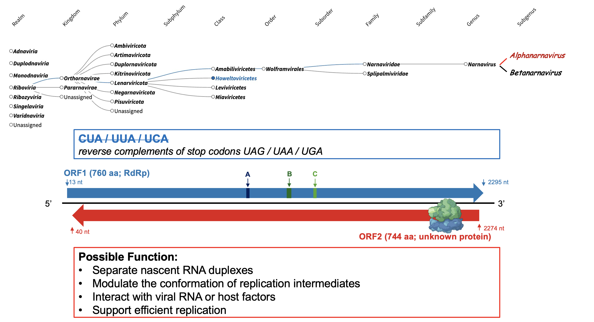

# Reading Between the Strands: Dual-Coding *Glossinamyces chrysopsiformis* Supports Hidden Complexity in Narnaviruses

written by: [Rayna_M](https://github.com/Rayna-Ma)

### *Glossinamyces chrysopsiformis*

```         
Glossinamyces: combining Glossina (the tsetse fly) with “-myces” (fungus-like), 
reflecting its ecological setting in the tsetse holobiont (fungal or other unicellular eukaryotes rather than the insect itself).

chrysopsiformis: meaning “Chrysops-like” which is the closest database hit, Medvezhye Chrysops Narna-like virus, 
reflecting their evolutionary similarity.
```


## Abstract

Viruses are broadly classified into DNA and RNA viruses. RNA viruses are characterized by compact genomes and replication mediated by RNA-dependent RNA polymerase (RdRp).

Narnaviruses are among the simplest RNA viruses known, classically defined as positive-stranded genomes encoding only one single ORF for the RdRp. They infect unicellular eukaryotes such as fungi. Lacking both a capsid and extracellular virion, they represent an extreme form of genomic minimalism and have long served as models for the low limits of viral complexity.

However, recent metagenomic discoveries have begun to challenge this simplicity. In particular, emerging reports of long complementary-strand ORFs contradict the canonical view that narnaviruses encode only a single protein.

**Here we show** a newly detected narna-like virus, *Glossinamyces chrysopsiformis*, prevalent across *Glossina morsitans* (tsetse fly) associated RNA sequencing datasets.

Our results demonstrate that *G. chrysopsiformis* is a dual-coding narnavirus, containing both a canonical 760 aa RdRp and a 744 aa reverse ORF. This reinforces that complementary-strand coding is a recurring feature rather than an anomaly within this group. On the other hand, instead of infecting the tsetse insect or its parasite, the virus is most consistent with infecting a unicellular eukaryote holobiont broadly distributed across *G. morsitans* tissues.

These findings expand the known genomic architecture of Narnaviridae and highlight that dual-coding strategies may be widely deployed in insect-associated lineages.

I anticipate this work to illustrate how hidden coding capacity can reshape our interpretation of ultra-simple RNA viruses, suggesting that even the most minimal genomes may encode uncharacterized biological functions. This framework provides a foundation for future efforts to define the true genetic and ecological diversity of narnaviruses.

## Results

Glossinamyces chrysopsiformis (hereafter G. chrysopsiformis) is a narnavirus detected across tsetse fly holobiont datasets from the USA, UK, and Switzerland. In this study, we will characterize its ecological context and key features.

### Origins of the Virus Across Datasets

To characterize the ecological distribution of this virus, I compiled all SRA libraries where the viral RdRp sequence was detected by SerratusSQL screenning. Metadata for each hit were retrieved through the NCBI SRA, BioSample and BioProject databases.

The resulting dataset (Table 1) associates:

-   6 BioProjects

-   27 Biosamples

-   41 SRA runs

-   6 associated publications

-   3 countries


Across all 41 SRA runs, the virus appears exclusively in samples derived from the tsetse fly *Glossina morsitans*. No viral signal was detected in any other insect, vertebrate, or environmental dataset. This strong taxonomic restriction suggests a tight link to the *Glossina* holobiont and a potentially long-term association rather than environmental contaminant.

Based on Table 1, detections occur in:

-   Parasite-associated samples (*Trypanosoma brucei* )

-   Bacteriome (specialized symbiont-housing organ)

-   Midgut

-   Cardia

-   Larval gut (milk)

-   Antennae

This wide distribution in the tsetse fly *Glossina morsitans* has two major implications. First, the virus is not specific to a single tissue, suggesting it is not infecting organ-specific insect cells. Second, its presence in parasite samples does not imply infection of *T. brucei*. Instead, the virus likely infects a **symbiotic microbe** (e.g., gut- or bacteriome-associated fungi) that is **broadly distributed across tsetse tissues**.

### Virus Family

To determine the taxonomic placement of the detected virus, I performed two complementary analyses using the node sequence: `VSADLSNATDYIPHAYAQSVWAGIVDGLNGSPEWVEEYIAKMFSPVDLEMPDGVTITTKRGIHMGTPLSFLTLCLLHRFAVERSGNRNHPHIIRGDDLIG`.

1.  [BLAST](https://blast.ncbi.nlm.nih.gov/)

    I queried the node sequence against NCBI BLAST (default parameters). As shown in Figure 2, the top matches were exclusively Narna-like virus RdRPs, with the closest hit being *Medvezhye Chrysops* Narna-like virus. This strongly suggests that the virus belongs to a Narna-like virus lineage.


2.  [Serratus](https://serratus.io/)

    I further submitted the node sequence to Serratus (palmID: Viral-RdRP Analysis). As shown in Figure 3, the Family-level taxonomy of PalmDB matches is dominated by Narnaviridae, with counts far exceeding any other family. This also supports the virus as Narnaviridae.


Narnaviruses are known to infect unicellular eukaryotes, most commonly fungi. Many described hosts are fungal endosymbionts of insects or protists. They are not known to infect trypanosomatids or insect cells. This further aligns with the hypothesis that the virus infects a fungal or microeukaryotic symbiont broadly present across *Glossina morsitans* tissues.

### Virus Genome

By combining de novo and reference-guided assembly strategies, I integrated 6 RdRp-containing contigs from 2 SRA runs to construct the 2342 nt *Glossinamyces chrysopsiformis* genome (Figure 4A).

The genome encodes a 760 aa RdRp on the positive strand (containing the conserved motifs characteristic of Narna-like viruses), and a 744 aa complementary-strand ORF of unknown function (Figure 4B).

Coverage decreases between 1,000–1,700 nt correspond to regions with fewer supporting reads. The RPKM is 41.02, indicating relatively low viral abundance in this host-derived dataset (Figure 4C).


**(A) The assembly of the draft genome.** A 198 aa ORF from SRR3956926 contig 7887 and a 373 aa ORF from ERR6594920 contig 45425 were first identified using NCBI ORFfinder (ATG + alternative start codons) and queried by BLASTp. Both ORFs showed strongest similarity to RdRp and VP1-like proteins of Medvezhye Chrysops Narna-like virus 2. Each contig was mapped to the reference mRNA using minimap2, revealing a \~400 nt overlap. These two contigs were assembled with CAP3 (default parameters), producing a \~1.4 kb consensus sequence. Four additional contigs (ERR6594920 IDs 135127, 136640, 117122, 102022) containing short ORFs (\~60–80 aa) were also detected and confirmed by BLASTp to be Narna-like RdRp. Due to limited overlap, these contigs were assembled reference-guided, each sequence was aligned to the Medvezhye Chrysops Narna-like virus genome, placed at the corresponding coordinates, and remaining gaps were filled with reference nucleotides.

**(B) The annotated genome.** The 760 aa positive-strand ORF1 was annotated using InterProScan, identifying the RdRp superfamily domain characteristic of mitoviral and narnaviral RdRps. Conserved motifs were annotated by aligning ORF1 to reference Narnaviridae RdRps (Motif A: 327-341aa, Motif B: 389-408aa, Motif C: 421-429aa). The reverse-strand 744 aa ORF returned no matches in InterProScan, therefore labeled unknown protein. ORFs were predicted using NCBI ORFfinder (ATG + alternative start codons).

**(C) The coverage profile across genome.** Raw reads from ERR6594920 were aligned to the assembled genome using Bowtie2 (--very-sensitive mode). BAM file was sorted and indexed with samtools. Per-base coverage was calculated using samtools depth -aa and imported into R for visualization. RPKM = (mapped_reads × 10\^9) / (total_reads × genome_length) = 41.02

### RdRp Structure Prediction

To investigate the structure of RdRp, I used AlphaFold3 and the model shows a canonical polymerase architecture with a well-formed palm domain. Motif A contains the characteristic DxxxxD metal-binding residues. Motif B contains the flexible SGxxxT loop involved in NTP selection. Motif C carries the essential GDD catalytic triad. These conserved motifs form a continuous catalytic groove (Figure 5).


AlphaFold3 structure prediction of RdRp sequence, the highest-ranked model (based on pLDDT confidence) was imported into PyMOL for visualization. Motif A: 327-341aa (blue), Motif B: 389-408aa (green), Motif C: 421-429aa (red).

### Reverse ORF for Positive-sense RNA Viruses?

I discovered a complementary-strand ORF (744 aa) located opposite to the canonical RdRp in my assembled *Glossinamyces chrysopsiformis* genome. Interestingly, this ORF is not unique. Similar rORFs (reverse ORFs) have been reported in newly discovered Narnaviridae across insects and protists (Dinan 2020; Li 2024; Retallack 2021). Selection against CUA/UUA/UCA maintains a long uninterrupted ORF on the complementary strand.

This supports the hypothesis that Narnaviruses may not be strictly single ORF viruses, but instead may encode a second protein with yet uncharacterized function. One possibility is that translation of the rORF could influence the stability or accessibility of the negative-strand RNA during replication. For example by helping to separate nascent RNA duplexes and modulating the conformation of replication intermediates. Also, the rORF protein itself could interact with viral RNA or host factors to support efficient replication, though expressed at very low levels.

Dinan proposed that the genus Narnavirus be subdivided to form two new subgenera, which they name Alphanarnavirus and Betanarnavirus, with the former clade containing all sequences with long rORFs (Dinan 2020). In this case, *Glossinamyces chrysopsiformis* should belong to the Alphanarnavirus subgenera.



## Discussion

*Glossinamyces chrysopsiformis* shows that Narnaviridae maybe less minimalistic than textbook models imply. Its consistent appearance across diverse *Glossina* tissues suggests a stable symbiont-associated lifestyle, demonstrating how metagenomic virology can uncover interactions that host-focused frameworks overlook. The discovery of a full-length rORF alongside a canonical RdRp supports a growing view that many narnaviruses use hidden complementary coding capacity.

## References

1.  Kolev NG, Franklin JB, Carmi S, Shi H, Michaeli S, et al. (2010) The Transcriptome of the Human Pathogen Trypanosoma brucei at Single-Nucleotide Resolution. PLoS Pathog 6(9): e1001090. <doi:10.1371/journal.ppat.1001090>

2.  Bing XL, Attardo GM, Vigneron A, Aksoy E, Scolari F, Malacrida A, Weiss BL, Aksoy S. 2017 Unravelling the relationship between the tsetse fly and its obligate symbiont Wigglesworthia: transcriptomic and metabolomic landscapes reveal highly integrated physiological networks. Proc. R. Soc. B 284: 20170360. <http://dx.doi.org/10.1098/rspb.2017.0360>

3.  Yang L, Weiss BL, Williams AE, Aksoy E, de Silva Orfano A, Son JH, et al. (2021) Paratransgenic manipulation of a tsetse microRNA alters the physiological homeostasis of the fly’s midgut environment. PLoS Pathog 17(6): e1009475. <https://doi.org/10.1371/journal.ppat.1009475>

4.  Vigneron A, Aksoy E, Weiss BL, Bing X, Zhao X, Awuoche EO, et al. (2018) A fine-tuned vector-parasite dialogue in tsetse’s cardia determines peritrophic matrix integrity and trypanosome transmission success. PLoS Pathog 14(4): e1006972. <https://doi.org/10.1371/journal.ppat.1006972>

5.  Lucas ER, Darby AC, Torr SJ, Donnelly MJ (2021) A gene expression panel for estimating age in males and females of the sleeping sickness vector Glossina morsitans. PLoS Negl Trop Dis 15(9): e0009797. <https://doi.org/10.1371/journal.pntd.0009797>

6.  Naguleswaran A, Fernandes P, Bevkal S, Rehmann R, Nicholson P, Roditi I (2021) Developmental changes and metabolic reprogramming during establishment of infection and progression of Trypanosoma brucei brucei through its insect host. PLoS Negl Trop Dis 15(9): e0009504. <https://doi.org/10.1371/journal.pntd.0009504>

7.  Adam M Dinan, Nina I Lukhovitskaya, Ingrida Olendraite, Andrew E Firth, A case for a negative-strand coding sequence in a group of positive-sense RNA viruses, Virus Evolution, Volume 6, Issue 1, January 2020, veaa007, <https://doi.org/10.1093/ve/veaa007>

8.  Li F, Jia M, Wang A (2024) Hidden viral proteins: How powerful are they?. PLOS Pathogens 20(1): e1011905. <https://doi.org/10.1371/journal.ppat.1011905>

9.  Retallack H, Popova KD, Laurie MT, Sunshine S, DeRisi JL, 2021. Persistence of Ambigrammatic Narnaviruses Requires Translation of the Reverse Open Reading Frame. J Virol 95:10.1128/jvi.00109-21. <https://doi.org/10.1128/jvi.00109-21>

10. Altschul, S. F., Gish, W., Miller, W., Myers, E. W., & Lipman, D. J. (1990). Basic local alignment search tool. Journal of Molecular Biology, 215(3), 403-410. [https://doi.org/https://doi.org/10.1016/S0022-2836(05)80360-2](https://doi.org/https://doi.org/10.1016/S0022-2836(05)80360-2){.uri}

11. Huang, X., & Madan, A. (1999). CAP3: A DNA sequence assembly program. Genome Research, 9(9), 868–877. <https://doi.org/10.1101/gr.9.9.868>

12. Jones, P., Binns, D., Chang, H. Y., Fraser, M., Li, W., McAnulla, C., McWilliam, H., Maslen, J., Mitchell, A., Nuka, G., Pesseat, S., Quinn, A. F., Sangrador‐Vegas, A., Scheremetjew, M., Yong, S. Y., Lopez, R., & Hunter, S. (2014). InterProScan 5: Genome-scale protein function classification. Bioinformatics, 30(9), 1236–1240. <https://doi.org/10.1093/bioinformatics/btu031>

13. Jumper, J., Lin, Z., AlQuraishi, M., & Hassabis, D. (2024). Accurate structure prediction of protein complexes and interactions with AlphaFold 3. Nature. <https://doi.org/10.1038/s41586-024-07566-y>

14. Edgar, R. C., Taylor, J., Lin, V., Altman, T., Barbera, P., Meleshko, D., Baumgartner, W. A., & Holt, J. (2021). Petabase-scale sequence alignment catalyses viral discovery. Nature, 602, 142–147. <https://doi.org/10.1038/s41586-021-04332-2>

# Viral Short Story

```         
The Shadow in the Holobiont.

They call it the Residue.

Something small, silent, older than the neon lights that flicker across the research block. It moves without a shell, without a body—only a signature. A whisper. A code. A ghost. The bioinformaticists didn’t notice it at first; no one ever notices a ghost. Not in a city like this.

But night after night, the same trace kept appearing on my terminal. A streak of nucleotides that refused to disappear. An anomaly spanning continents—Yale, Liverpool, Bern, and more than a decade of forgotten sequencing runs.

It wasn’t a parasite, not really. Parasites need a home; this thing just needed a shadow to cling to. When I dug deeper into its code, the truth crawled out: it carried only a single protein, a polymerase with no armor, no shell, nothing to shield it from the world.

A naked replicon wandering through the wet machinery of life.

Still, it didn’t drift aimlessly. The shadow kept showing up inside tsetse flies—carried in the hum of their midgut, cardia, bacteriome, larval milk, even their antennae.

And it clung to their passengers too, riding the bloodstream of the parasite Trypanosoma brucei like a hitchhiker who never pays the fare.

But the deeper I traced the signal, the clearer the picture became. This specter wasn’t loyal to the fly or to the parasite. It belonged to something else—something hidden in the microbial underbelly of the insect. A tenant living between the cracks of taxonomy, a forgotten eukaryotic microbe that never made it into the world's spotlight.

In a world overflowing with data, it’s easy to lose the ghosts.

But some ghosts refuse to be erased.
```
