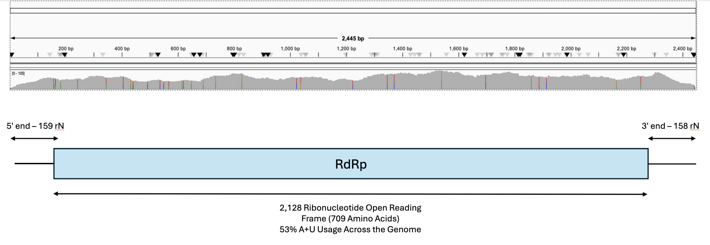
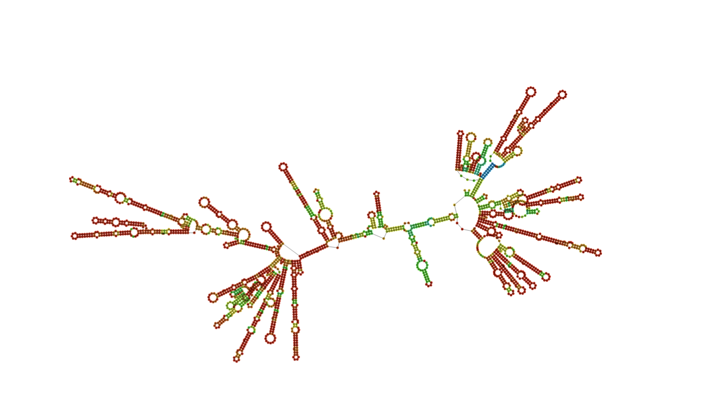
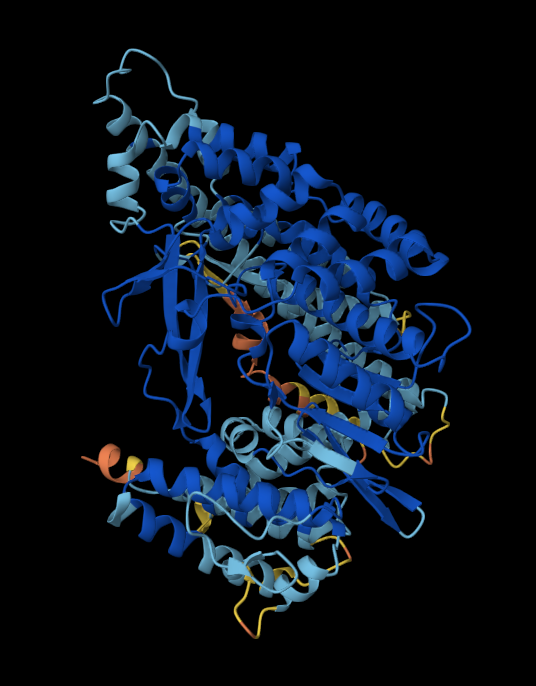
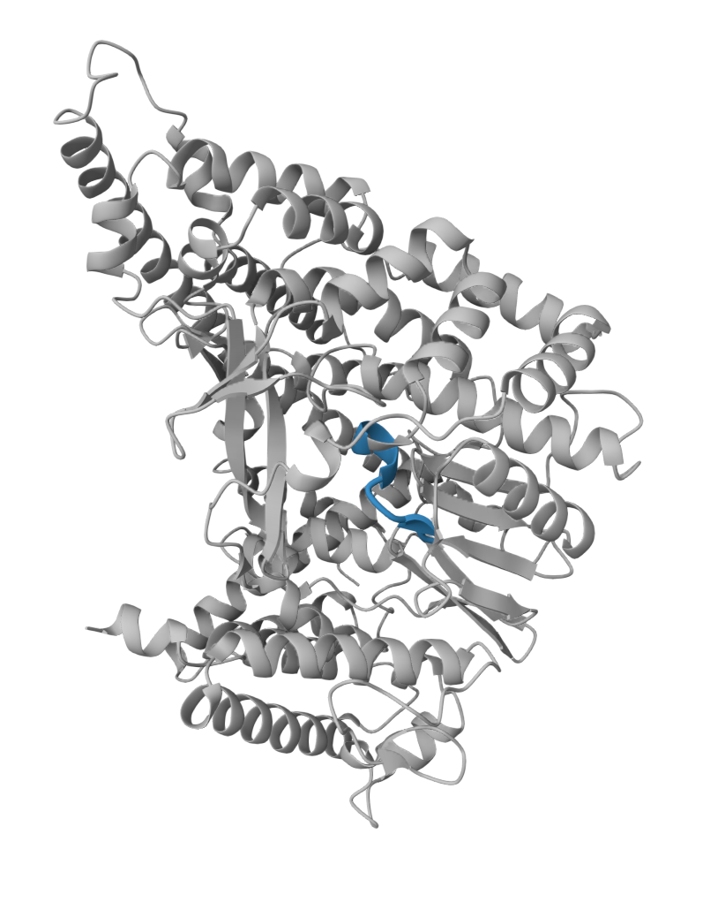
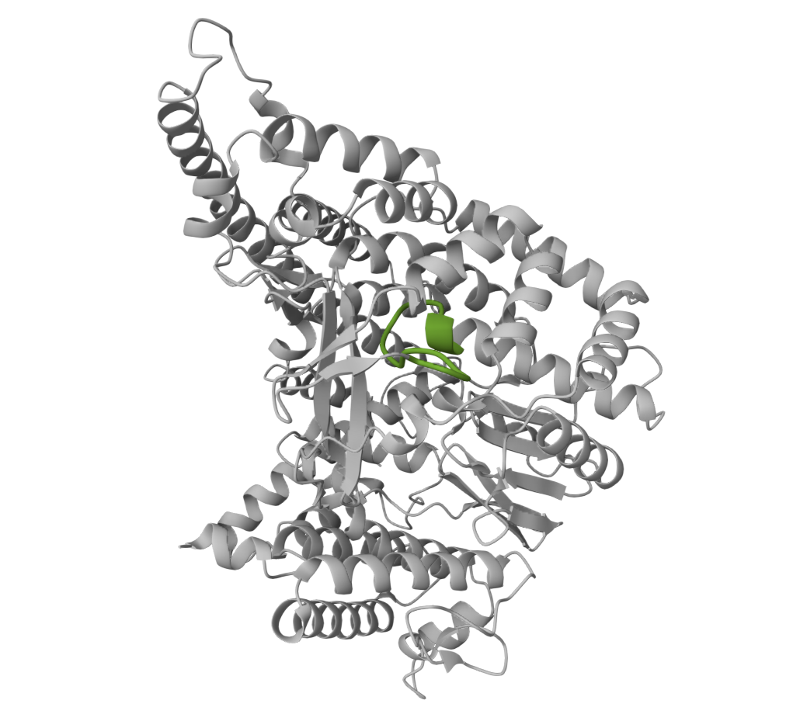
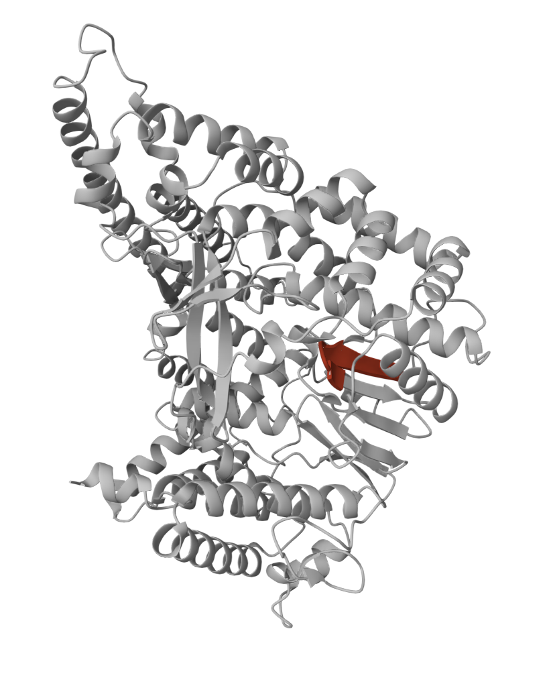
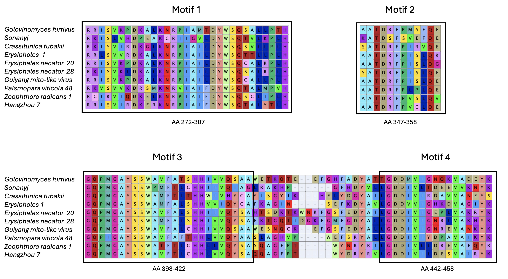
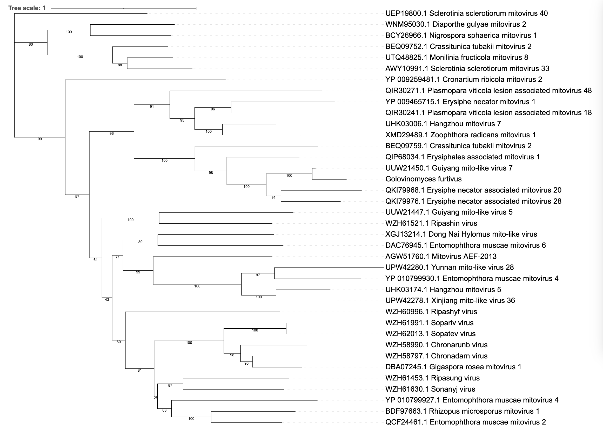

# Golovinomyces furtivus: Leafing Through the Viral Genome in Search of an Answer to Powdery Mildew Disease

Written by: [Abigael Smith](https://github.com/Abs531)

### Golovinomyces furtivus

This name was given to the virus, as it primarily infects Golovinomyces cichoracearum, a powdery mildew found across the globe [Takumatsu et al. 2013], following naming conventions for mitoviruses. As this virus was found in various G. cichoracearum samples, of which many are found in different plant species, it was given the secondary name furtivus, which means hidden or concealed in Latin as until this point it went undiscovered in a broad range of species, hiding in plain sight.  


Image created using Nano Banana Pro

## Abstract

With the looming advent of the platinum age of viral discovery, and the exponential rate of data collection, the ability to parse through the information and obtain relevant results is becoming ever more important. While developing our understanding of the growing global virome, we hope to uncover novel viruses. By analyzing SRA runs from multiple unrelated studies, a new viral genome was discovered. Today, we present Golovinomyces furtivus, a previously uncharacterized mitovirus, that infects the fungal species Golovinomyces cichoracearum. Due to the nature of mitovirus development diverging significantly by host, there were not many closely related species found, yet the genome has maintained conserved sequences seen across most mitoviruses. Through our computational analysis, we have mapped the genome and sole RdRp protein produced by the virus, as well as a phylogenetic analysis of related mitoviruses to uncover other viruses within fungal species. Given that Golovinomyces cichoracearum is the causitive agent of Powdery Mildew disease, and the potential nature of hypovirulence caused by mitoviruses (Khan et al. 2023), this discovery has potential implications for the management of this disease.


## Results

### Host Fungal Ecology 

Golovinomyces cichoracearum, G. furtivus’ primary host, infects a wide array of plants, primarily those in the Asteraceae family, in species such as lettuce, sunflowers, and A. thaliana. Previous phylogenetic analyses and genomic studies have shown that G. cichoracearum has a high divergence between lineages and demonstrates close evolutionary relationships with its host species [Takumatsu et al. 2013].  
 
### Detection  

Golovinomyces furtivus was detected in six different BioProjects, either directly in Golovinomyces cichoracearum samples, or in known hosts of the fungi: (i-ii) A transcriptome analysis of Golovinomyces cichoracearum (iii) A secondary transcriptome analysis targeting mRNA in a comparitive genomic analysis uncovering powdery mildew host adaptations by Wu et al. 2018, (iv) An analysis of poplar species with isoprene (a compound associated with fast growth) suppressed to study its role in plant development conducted by Dani et al. 2021, (v) A leaf metagenone sample with Golovinomyces cichoracearum metatranscriptome isolates, (vi) A transcriptome analysis of Lindernia subracemosa and desiccation tolerance. A table of BioProjects, and associated runs and publications can be found in Table_1_Bioprojects_Golovinomyces_furtivus.xslx.  

### Biological Ecology 

These observations of Golovinomyces furtivus are in line with its biological niche when compared to other mitoviruses, as many of the projects either directly deal with Golovinomyces cichoracearum or its host species. While Golovinomyces cichoracearum was not directly detected in all samples, this is likely an issue with detection as historically it has been difficult to identify. Newly developed deep learning techniques have demonstrated a high success rate in a study done by Balaga and Patayon [2024] which has the potential for great use in the detection of powdery mildew disease going forward.  

In addition, the sequence contains UGA codons that encode for Trp, not a stop codon, indicating the virus does not directly infect plants [Nibert et al. 2018]. Mitoviruses that infect plants use plant codon code, which use UGA as a stop codon, which is used to code for Trp in Golovinomyces furtivus. 

### Digital Ecology 

Since a palmprint sequence was already known for the RdRp protein sequence of the virus, this was used to uncover the full genome of Golovinomyces furtivus.  

A tblastn search [Sayers et al. 2025] was conducted using the palmprint RdRp protein sequence. The top nucleotide alignments were then downloaded, and each one was used to search for matches in the SRA run contigs associated with the virus. The top sequence gave us one hit in SRR6232712, which we later discovered was likely the whole genome of the virus. To verify the sequence, it was translated into protein, and then pblast was used to determine similar sequences. This list was then compared to the palmprint sequence pblast, which showed nearly identical results, with overall lower e-values for the full RdRp sequence when compared with related mitovirus RdRp sequences. The final genome sequence is 2445 nt long, with a RdRp consisting of 709 amino acids, both of which can be found in Golovinomycesfurtivus.fasta. 

Of note, the most closely related RdRp sequence found by pblast was from a guiyang mito-like virus (Accession UUW21450.1), with a percent identity of 77.98%, e-value of 0, and a query cover of 99%.  

### Virus Genome

The Golovinomyces furtivus genome can be seen in figure 1, with contigs sequence reads from SRR6232712 mapped to the genome. Overall, there was a high level of sequences that mapped, with some areas having over 105 mapped sequences, indicating a large presence of Golovinomyces furtivus within the sample. The main area of interest is the RdRp sequence, which comprises the majority of the genome, with 5’ and 3’ ends on either side. 



Figure 1. Sequence reads from SRR6232712 mapped to Golovinomyces furtivus genome using Bowtie2 [Langmead and Salzberg, 2012] in the top part of the figure, visualized using IGV [Robinson et al. 2012]. Read depth ranges from 0-105 reads across the genome. The genome is shown below, with the full open reading frame and RdRp highlighted in blue, along with nucleotide ranges and usage percentage. The open reading frame range was obtained using Sequence Manipulation Suite: ORF Finder [Stothard, 2000].


### RNA Genome Structure

The entire genome can be seen here with a predicted secondary structure. Binding of the 5’ and 3’ were predicted, which is in line with other assembled mitoviruses [Viruses, 2011].  



Figure 2. Whole genome RNA structure built using Mfold [Zuker, 2003]. Ranging from blue (low) through green and yellow (moderate) to red (high), indicates overall confidence in structure prediction for the genome. This was done to visualize the genome and provide a reference structure for discussion.

### RdRp Predicted Structure

To understand how the RdRp functions, and its relation and conserved motifs compared to other mitoviruses, the predicted structure of the RdRp amino acid sequence was created. In addition, conserved motifs A, B, and C found across most mitoviruses [Neupane, 2018] are visualized separately. The conserved sequences are very similar to other mitoviruses, further emphasizing its place as a mitovirus.









Figure 3. Figure 3a. represents the predicted RdRp structure folding via AlphaFold [Jumper, 2021], the colour from orange (low) to blue (high) represents confidence in the predicted structures. Figures 3b-d. represent each motif of the protein visualized with NGL Viewer [Rose et al. 2018], A in blue, B in green, and C in red respectively. Due to issues with protein structure folding and visualization, they are shown seperately.

### Motifs in Aligned Similar Proteins

The top nine pbblast hits from the Golovinomyces furtivus RdRp sequence were aligned using MUSCLE [Edgar, 2022]. These sequences were chosen to analyze motif conservation between closely related species, as despite the high levels of divergence seen in mitoviruses, they tend to contain highly conserved motifs essential to RdRp function.



Figure 4. Conserved motifs of Golovinomyces furtivus and the top 9 pblast hits associated with the viral RdRp sequences. Non-redundant databse was used, and other sequences excluded by only taking those with e values of 1e-50 or lower, and 30% identity or above. MUSCLE [Edgar, 2022] was used to align the sequence, and the visualization of the alignment was done using Mesquite [Maddison and Maddison, 2025].

### Phylogeny of Related Species

To understand how Golovinomyces furtivus evolved, we constructed a phylogenetic tree of 38 closely related species. As seen below, it is most closely related to the Guiyang mito-like virus 5, with high bootstrap support at the node.



Figure 5. Phylogenetic tree of related RdRp sequences to Golovinomyces furtivus. Data retrieved from pblasting the sequence, with a cutoff of 1e-50 or below, and percent identity above 30%. MUSCLE[Edgar, 2022] was used to align the sequences, IQ-TREE3 [Wong et al. 2025] was used to build the tree. iTOL [Letunic and ork, 2021] was used to visualize the tree, with bootstrap support values added with a cutoff of 25.

## Discussion

By characterizing Golovinomyces furtivus’ genome, we are potentially one step closer to being able to utilize mitoviruses for our own gain. The most interesting fact about mitoviruses, are their ability to cause hypovirulence in the host species, due to their residence in the mitochondria. By understanding mitovirus RNA genome and structure, we have the future potential to manipulate the genome to create or amplify a hypovirulence effect in the Golovinomyces cichoracearum. This, and the specificity of mitoviruses restricting its effect to only its host species and spread only by reproduction, could allow millions more crops per year to flourish, instead of decaying by powdery mildew disease. In addition, by understanding how the virus is related to other mitoviruses, we can begin to uncover how these minimal RNA sequences replicate and evolve. 

### Limitations

While the discovery of Golovinomyces furtivus is exciting, and can prove usefull in further study of mitoviruses, there are caveats to this analysis. Due to the high rates of divergence seen in RdRp sequences aside from conserved motifs, creating a truly accurate phylogeny proves difficult. In addition, the lack of any other sequences in the genome makes multiple loci analyses impossible. Despite this, it is useful in attempting to determine the lineage of mitoviruses, and further analysis could prove useful in understand the evolutionary mechanisms of these viruses.  

Unfortunately, no hypovirulent activity of Golovinomyces furtivus could be found to date, due to the limited scope of sequences found and the novelty of the virus. This does not indicate that could not exist, or potentially one day edited to have hypovirulent properties in their host, but in the meantime, further study should be conducted to determine if Golovinomyces furtivus could be a potential solution to powdery mildew disease. This research is fundamental, and can be used as a starting point to search for hypovirulence within the species.  

### Final Conclusion

Ultimately, with monumental amounts of data being made available daily regarding transcriptomes and metagenomes, more viruses will be uncovered as we learn to parse the data. This is a very exciting time to be a part of bioinformatics, and the discovery of Golovinomyces furtivus, and other uncharacterized viruses is only the beginning of possibilities in finding solution to powdery mildew disease, potentially other fungal infections, and wider virology as a whole. 

## References

# Bioinformatic Tools: 

MUSCLE: Edgar, R. C. (2022). Muscle5: High-accuracy alignment ensembles enable unbiased assessments of sequence homology and phylogeny. Nature Communications, 13(1). https://doi.org/10.1038/s41467-022-34630-w 

AlphaFold: Jumper, J. et al. (2021). Highly accurate protein structure prediction with AlphaFold. Nature, 596, pages 583–589. DOI: 10.1038/s41586-021-03819-2 

Bowtie2: Langmead B, Salzberg S. (2012). Fast gapped-read alignment with Bowtie 2. Nature Methods. 9:357-359. 

iTOL: Letunic, I., & Bork, P. (2021). Interactive Tree Of Life (iTOL) v5: an online tool for phylogenetic tree display and annotation. Nucleic acids research, 49(W1), W293–W296. https://doi.org/10.1093/nar/gkab301 

Mesquite: Maddison, W. P. and D.R. Maddison. 2025. Mesquite: a modular system for 
evolutionary analysis.  Version 4.01.  https://www.mesquiteproject.org 

IGV: Robinson, J. T., Thorvaldsdóttir, H., Winckler, W., Guttman, M., Lander, E. S., Getz, G., Mesirov, J. P., (2012). Integrative Genomics Viewer. Nature Biotechnology 29, 24–26. 

NGL: Rose, A. S., Bradley, A. R., Valasatava, Y., Duarte, J. D., Prlić, A., Rose, P. W., (2018) NGL viewer: web-based molecular graphics for large complexes. Bioinformatics 34: 3755–3758 

BLAST: Sayers, E. W., Beck, J., Bolton, E. E., Brister, J. R., Chan, J., Connor, R., Feldgarden, M., Fine, A. M., Funk, K., Hoffman, J., Kannan, S., Kelly, C., Klimke, W., Kim, S., Lathrop, S., Marchler-Bauer, A., Murphy, T. D., O’Sullivan, C., Schmieder, E., . . . Pruitt, K. D. (2024). Database resources of the National Center for Biotechnology Information in 2025. Nucleic Acids Research, 53(D1), D20–D29. https://doi.org/10.1093/nar/gkae979 

SMS: Stothard P., (2000). The Sequence Manipulation Suite: JavaScript programs for analyzing and formatting protein and DNA sequences. Biotechniques 28:1102-1104. 

IQ-TREE3: Wong, T., Ly-Trong, N., Ren, H., Baños, H., Roger, A., Susko, E., Bielow, C., De Maio, N., Goldman, N., Hahn, M., Huttley, G., Lanfear, R., & Minh, B. Q. (2025). IQ-TREE 3: Phylogenomic Inference Software using Complex Evolutionary Models. Pre-print. https://doi.org/10.32942/x2p62n 

Mfold: Zuker, M., (2003). Mfold web server for nucleic acid folding and hybridization prediction. Nucleic Acids Res. 31 (13), 3406-3415. 


# Mitoviruses:

Khan, H. A., Mukhtar, M., & Bhatti, M. F. (2023). Mycovirus-induced hypovirulence in notorious fungi Sclerotinia: a comprehensive review. Brazilian Journal of Microbiology, 54(3), 1459–1478. https://doi.org/10.1007/s42770-023-01073-4 

Nibert, M. L., Vong, M., Fugate, K. K., & Debat, H. J. (2018). Evidence for contemporary plant mitoviruses. Virology, 518, 14–24. https://doi.org/10.1016/j.virol.2018.02.005 

Neupane, A., Feng, C., Feng, J., Kafle, A., Bücking, H., & Marzano, S. L. (2018). Metatranscriptomic Analysis and In Silico Approach Identified Mycoviruses in the Arbuscular Mycorrhizal Fungus Rhizophagus spp. Viruses, 10(12), 707. https://doi.org/10.3390/v10120707

Viruses, I. C. O. T. O., & King, A. M. (2011). Virus taxonomy: Ninth Report of the International Committee on Taxonomy of Viruses. Elsevier. 

# Fungi and Golovinomyces cichoracearum:

Balaga, O. N. R., & Patayon, U. B. (2024). Effectiveness of Background Segmentation Algorithm and Deep Learning Technique for Detecting Anthracnose (leaf blight) and Golovinomyces cichoracearum (powdery mildew) in Rubber Plant. Procedia Computer Science, 234, 294–301. https://doi.org/10.1016/j.procs.2024.03.013 

Takamatsu, S., Matsuda, S., & Grigaliunaite, B. (2013). Comprehensive phylogenetic analysis of the genus Golovinomyces (Ascomycota: Erysiphales) reveals close evolutionary relationships with its host plants. Mycologia, 105(5), 1135–1152. https://doi.org/10.3852/13-046 

Xu, Z., Wu, S., Liu, L., Cheng, J., Fu, Y., Jiang, D., & Xie, J. (2014). A mitovirus related to plant mitochondrial gene confers hypovirulence on the phytopathogenic fungus Sclerotinia sclerotiorum. Virus Research, 197, 127–136. https://doi.org/10.1016/j.virusres.2014.12.023 


# Papers Associated with BioProjects:

Dani, K. G. S., Pollastri, S., Pinosio, S., Reichelt, M., Sharkey, T. D., Schnitzler, J., & Loreto, F. (2021). Isoprene enhances leaf cytokinin metabolism and induces early senescence. New Phytologist, 234(3), 961–974. https://doi.org/10.1111/nph.17833 

VanBuren, R., Wai, C. M., Pardo, J., Giarola, V., Ambrosini, S., Song, X., & Bartels, D. (2018). Desiccation Tolerance Evolved through Gene Duplication and Network Rewiring in Lindernia. The Plant Cell, 30(12), 2943–2958. https://doi.org/10.1105/tpc.18.00517 

Wu, Y., Ma, X., Pan, Z., Kale, S. D., Song, Y., King, H., Zhang, Q., Presley, C., Deng, X., Wei, C., & Xiao, S. (2018). Comparative genome analyses reveal sequence features reflecting distinct modes of host-adaptation between dicot and monocot powdery mildew. BMC Genomics, 19(1), 705. https://doi.org/10.1186/s12864-018-5069-z 

# Viral Short Story

Assisted by AI

```
A long time ago, in the realm of Golarum, villagers, devastated by the Powdery Mildew disease, turned their desperation into curiosity as they explored the mysteries of their ecosystem. Led by scholars, they discovered the genome of Golovinomyces furtivus, a mitovirus linked to the very crop that had caused their suffering. Instead of fearing the virus, they embraced the idea of hypovirulence, learning that it could weaken the harmful effects of their troubles. With renewed hope and knowledge, the villagers tended to their fields, transforming their harvest into a symbol of resilience and understanding, proving that curiosity can illuminate even the darkest challenges.
```
