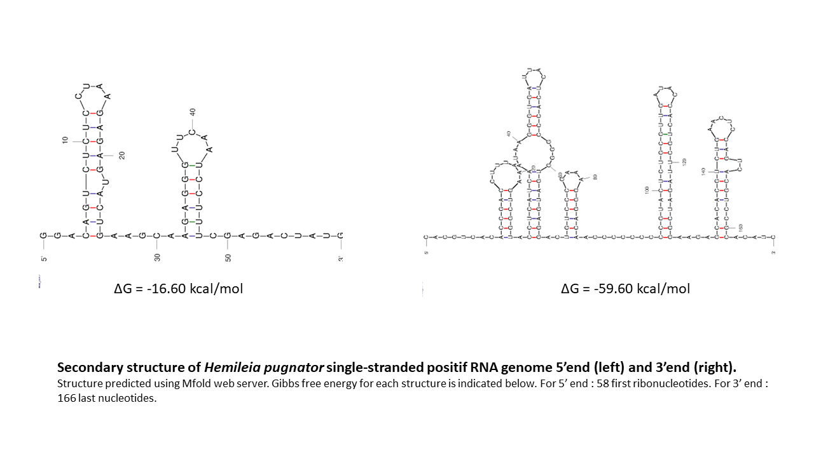

# Hemileia pugnator: Brewing trouble for the Causative Agent of Coffee Leaf Rust disease, Hemileia vastatrix.
written by: Flora HILT

### Hemileia pugnator
As with all newly characterized mitoviruses, the initial segment of this mitovirus name corresponds to the infected host, Hemileia vastatrix. Given its potential role in inducing a hypovirulent state in its host and recognizing that Hemileia vastatrix poses a significant threat to our beloved coffee, the concluding portion of its Latin name symbolizes its potential involvement in this battle, signifying "fighter." Now, let's meet Hemileia pugnator!

)

## Abstract

Viruses are ubiquitous in the living realm, spanning from bacteria to humans. As technological tools advance, the detection of new types of viruses has never been more efficient, leading to the discovery of highly complex and diverse viral world. However, our current understanding falls short of encompassing the entire diversity of viruses. In this report, we present, for the first time, a new mitovirus infecting the mitochondria of Hemileia vastatrix race XXXIII, a Pucciniales fungus responsible for causing Coffee Leaf Rust disease.This novel mitovirus, named Hemileia pugnator, exhibits all the characteristic features attributed to members of the Mitoviridae family. These include a single open reading frame (ORF) encoding a RNA-dependent RNA polymerase, six conserved amino acid motifs, and secondary structures at the 5' and 3' ends of its single-stranded RNA positive genome. Moreover, Hemileia pugnator highlights the widespread presence of mitoviruses across fungal species beyond the confines of ascomycota.Our study suggests the potential existence of numerous other mitovirus species, not only within Hemileia vastatrix race XXXIII but also among other fungal plant pathogens. Given that certain mitoviruses have been reported to diminish pathogen virulence and considering the global threat posed by Coffee Leaf Rust to coffee plantations, the discovery of a new mitovirus infecting a hyper resistant race of Hemileia vastatrix could be a foundational step towards developing innovative strategies to manage this disease.

## Results

### Ecology of Hemileia pugnator: in the middle of the battlefield

#### Global context
The coffee industry is one of the most significant contributors to global trade and holds economic importance for numerous countries. Various coffee plant species exist, with the primary cultivated ones being Coffea arabica and Coffea canephora [Sera et al. 2022]. However, the presence of Hemileia vastatrix, a plant pathogen responsible for Coffee Leaf Rust disease, poses a global threat to coffee plantations. In response to this menace, resistant coffee plant hybrids like Híbrido de Timor have been developed, and cultivating these derivatives remains the primary method to combat the disease [Talhinhas et al. 2017]. Unfortunately, the swift emergence of new Hemileia vastatrix races, capable of overcoming these resistance measures, undermines this defensive strategy [Capucho et al. 2012]. Consequently, farmers are compelled to resort to massive fungicide use, resulting in severe environmental damage. It is imperative to find effective ways to manage and control coffee leaf rust.

Hemileia vastatrix is a basidiomycota fungus belonging to the Pucciniales order. Its life cycle involves both sexual and asexual reproduction, with a notable preference for the latter. Asexual reproduction is facilitated by the formation of uredinospores, highly resistant forms capable of germination under favorable conditions and subsequent infection of coffee plant leaves, potentially spreading to other plants. The fungus enters through stomata on the leaf surface and forms haustoria, intracellular invasive structures responsible for extracting nutrients directly from the plant cells [Silva et al. 2022]. Despite its inclination towards asexual reproduction, the surprising ability of Hemileia vastatrix to rapidly overcome resistance is evident. New races, such as race XXXIII discovered in Brazil in 2012, mark the first instances of infection in Híbrido de Timor derivative coffee plants [Capucho et al. 2012].

To combat this plant pathogen effectively, two essential components are required. Firstly, comprehensive genomic and transcriptomic data of Hemileia vastatrix at various stages of its life cycle are necessary. Secondly, understanding the genome and transcriptome of coffee plants at different time points during infection by Hemileia vastatrix is crucial [Porto et al. 2019; Talhinhas et al. 2014]. The ultimate goal is to gain deeper insights into the "enemy" and its pathogenic mechanisms, uncovering its vulnerabilities for more effective strategies.

#### Detection of Hemileia pugnator
Hemileia pugnator has been detected in the context of five projects aligned with this objective: (i) in the Hemileia vastatrix genome sequencing and assembly conducted by Cristancho et al. in 2018; (ii) in an experiment investigating the Hemileia vastatrix race XXXIII uredinospore transcriptome upon germination; (iii) in the transcriptome analysis of coffee plant leaves from Brazilian regions where Hemileia vastatrix race XXXIII has been identified; (iv and v) in two time-course experiments where leaves of "resistant" coffee plants were infected by germinated uredinospores of Hemileia vastatrix race XXXIII, followed by transcriptome analysis. For the latter four projects, no affiliated publications exist, and three of them originate from the same laboratory at the Universidade Federal de Vicosa (Brazil). All relevant information regarding these projects, including samples and the runs in which Hemileia pugnator was detected, can be found in [Table1_Bioprojects_Samples_Runs_Hemileia_pugnator.xlsx](https://github.com/ababaian/VIRUSxDISCVRY/tree/main/virus/Hemileia_pugnator/Table1_Bioprojects_Samples_Runs_Hemileia_pugnator.xlsx).

The common denominator is the presence of Hemileia vastatrix race XXXIII. Therefore, in accordance with the observation that mitoviruses are preferentially located in the mitochondria of plant pathogenic fungi, and considering the report of mitoviruses in a basidiomycota causing a rust-like disease [Liu et al. 2016], Hemileia pugnator is postulated as a new mitovirus infecting the mitochondria of Hemileia vastatrix race XXXIII. In the case of transcriptomic analysis of non-infected coffee plants, it is conceivable that the genome of Hemileia pugnator was integrated into the mitochondrial genome of these plants during an ancestral infection by Hemileia vastatrix race XXXIII or an unknown mitovirus sharing a high identity degree. Due to the intracellular nature of the infection, the fusion between Hemileia vastatrix cells and the coffee plant cells might have resulted in the integration of the mitovirus into the plant mitochondria as a cryptic virus, which could be present in the descendants of these coffee plants. However, the mechanisms underlying this phenomenon, observed between various mitoviruses and plants [Nibert et al. 2018], remain undefined.


### Hemileia pugnator genome

*Hemileia pugnator* genome with key features can be visualized in the `H_pugnator_genome.png` file. All the sequences related to *Hemileia pugnator* (genome, RdRp) can be found in the text file `H_pugnator_seq`. 

Its genome is composed of one single open reading frame,as assessed by the ORF Finder tool available on NCBI, in the positive sens of the RNA which corresponds to the characteristics of mitoviruses. Moreover, this single open reading frame is predicted to encode for a protein with a mitovirus-like RdRp functional domain using InterProScan (cf `H_pugnator_fct_domains.xlm`).


Figure 1 : Simplified representation of Hemileia pugnator genome with key features.

### Other (bonus) sections

To verify the presence of the six characteristic motifs of mitoviruses RdRp [Shafik et al. 2021] in the *Hemileia pugnator* RdRp, a multiple alignment was performed using the MUSCLE tool on EMBL-EBI [Madeira et al. 2022], incorporating the sequences of the six mitoviruses exhibiting the highest percentage identity based on BLASTp results with the lowest E-value. The sequences used are detailed in the text document `Motifs_H_pugnator_seq_align`, and the resulting alignment can be found in `Motifs_H_pugnator_align.clw`. For clarity, the alignment has been annotated, and this annotated version is accessible in the .png file `Motifs_H_pugnator`. As anticipated, the six motifs distinctive of mitovirus RdRp exhibit a high level of conservation in *Hemileia pugnator*.


Next, using the _Mfold_ web server [Zuker, 2003], three-dimensional structures for the 5' end (first 58 ribonucleotides) and 3' end (last 166 ribonucleotides) of *Hemileia pugnator* RNA genome were determined. Visual representations are available in the PNG files `Structures_H_pugnator_genome`. The 5' end is predicted to fold into two stem-loop structures with a ΔG of -16.60 kcal/mol. The 3' end is anticipated to harbor five stem-loop structures with a ΔG of -59.60 kcal/mol. These ΔG values suggest potential stability for these structures. These predictions align with previously documented mitovirus RdRp RNA structures [Shafik et al. 2021, Liu et al. 2016].



## Discussion

Mitoviruses have emerged as enigmatic entities in recent years, characterized by their remarkable simplicity yet harboring intriguing features that render them particularly captivating. At the heart of their uniqueness is the production of a singular protein— an RNA-dependent RNA polymerase. This protein's sole purpose is to replicate the single-stranded positive RNA from which it originates. Mitoviruses, distinguished by this distinct characteristic, do not form virions, existing strictly as intracellular viruses. Their mode of dissemination relies solely on cell division of the already infected cell or its fusion with another cell. What adds to their mystique is the exclusive presence of mitoviruses in the mitochondria of plant pathogenic fungi. This niche specificity contributes to the complexity of studying these viruses. Typically discovered through transcriptomic experiments involving their hosts, mitoviruses often exhibit symptomless infections, making detection a challenging task. However, advancements in sequencing technologies have facilitated an increasing number of mitovirus discoveries, revealing some with potential implications beyond their seemingly harmless nature [Shafik et al. 2021; Mizutani et al. 2018; Liu et al. 2016; Kitahara et al. 2014].

Indeed, several studies have highlighted correlations between mitovirus infections and mitochondrial malformations, slow growth, and hypovirulence in fungi [Mizutani et al. 2018; Xu et al. 2015; Wu et al. 2007]. Intriguingly, cryptic mitoviruses have been identified in the mitochondrial genomes of certain plants [Nibert et al. 2018], with recent research suggesting potential metabolic effects that could confer advantages under sustained drought conditions [Di Silvestre et al. 2022].

This study delves into a newly identified mitovirus infecting the mitochondria of Hemileia vastatrix race XXXIII. It possesses the key mitoviral features, such as a unique open reading frame (ORF) encoding an RNA-dependent RNA polymerase, six conserved amino acid motifs, and distinct secondary structures in its RNA genome ends [Shafik et al. 2021; Mizutani et al. 2018; Liu et al. 2016; Kitahara et al. 2014]. Nevertheless, this mitovirus shows the polyvalence of its genus by not infecting an ascomycota, which is the case for the majority of the known mitoviruses, but a basidiomycota fungus. However, it has been detected in limited samples, making it challenging to gauge its prevalence in the Hemileia vastatrix population. The broader implications are underscored by phylogenetic analyses and the possible presence of Hemileia pugnator in the mitochondrial genome of certain coffee plants, suggesting the existence of undiscovered mitoviruses in other races of Hemileia vastatrix and fungi.  

While no hypovirulent strains of Hemileia vastatrix race XXXIII have been reported thus far, the potential impact of Hemileia pugnator infection on this plant pathogen instills hope. Hemileia vastatrix serves as the causal agent of coffee rust disease, posing a significant threat to coffee plantations globally [Sera et al. 2022; Talhinhas et al. 2017]. Its ability to infect coffee plants in both extra and intracellular manners, coupled with its predominant reproduction through the formation of highly resistant and easily spread uredinospores, makes finding effective strategies against this pathogen exceedingly challenging [Silva et al. 2022; Talhinhas et al. 2014]. Additionnaly, characterization of its genome and pathogenicity mechanisms through transcriptomic analysis is difficult due to a high number of sequence repeat [Porto et al. 2019]. The emergence of new races of Hemileia vastatrix, impacting previously resistant coffee plant hybrids [Capucho et al. 2012], raises concerns about the resurgence of widespread fungicide use to prevent and treat infections in plantations. This traditional approach poses the risk of causing irreparable environmental damage. Consequently, the potential use of a mitovirus to weaken the fungus and enhance the metabolism and immune response of coffee plants becomes an area of significant interest. Could Hemileia pugnator emerge as an unexpected guardian of our beloved coffee beans? Only time and further research will unveil the answers.

## References

Bioinformatics tools:

Mfold:Zuker, M. « Mfold Web Server for Nucleic Acid Folding and Hybridization Prediction ». Nucleic Acids Research 31, nᵒ 13 (1 juillet 2003): 3406‑15. https://doi.org/10.1093/nar/gkg595.

ModelFinder: Subha Kalyaanamoorthy, Bui Quang Minh, Thomas KF Wong, Arndt von Haeseler,
and Lars S Jermiin (2017) ModelFinder: Fast model selection for
accurate phylogenetic estimates. Nature Methods, 14:587–589.
https://doi.org/10.1038/nmeth.4285

MUSCLE: Madeira, Fábio, Matt Pearce, Adrian R N Tivey, Prasad Basutkar, Joon Lee, Ossama Edbali, Nandana Madhusoodanan, Anton Kolesnikov, et Rodrigo Lopez. « Search and Sequence Analysis Tools Services from EMBL-EBI in 2022 ». Nucleic Acids Research 50, nᵒ W1 (5 juillet 2022): W276‑79. https://doi.org/10.1093/nar/gkac240.

Jalview: Waterhouse, Andrew M., James B. Procter, David M. A. Martin, Michèle Clamp, et Geoffrey J. Barton. « Jalview Version 2—a Multiple Sequence Alignment Editor and Analysis Workbench ». Bioinformatics 25, nᵒ 9 (1 mai 2009): 1189‑91. https://doi.org/10.1093/bioinformatics/btp033.

IQ-TREE: Lam-Tung Nguyen, Heiko A. Schmidt, Arndt von Haeseler, and Bui Quang Minh
(2015) IQ-TREE: A fast and effective stochastic algorithm for estimating
maximum likelihood phylogenies. Mol Biol Evol, 32:268-274.
https://doi.org/10.1093/molbev/msu300

UFboot: Diep Thi Hoang, Olga Chernomor, Arndt von Haeseler, Bui Quang Minh,
and Le Sy Vinh (2017) UFBoot2: Improving the ultrafast bootstrap
approximation. Mol Biol Evol, in press.
https://doi.org/10.1093/molbev/msx281

About Mitoviruses:

Di Silvestre, Dario, Giulia Passignani, Rossana Rossi, Marina Ciuffo, Massimo Turina, Gianpiero Vigani, et Pier Luigi Mauri. « Presence of a Mitovirus Is Associated with Alteration of the Mitochondrial Proteome, as Revealed by Protein–Protein Interaction (PPI) and Co-Expression Network Models in Chenopodium Quinoa Plants ». Biology 11, nᵒ 1 (8 janvier 2022): 95. https://doi.org/10.3390/biology11010095.

Kitahara, Ryoko, Yoji Ikeda, Hanako Shimura, Chikara Masuta, et Tatsuhiro Ezawa. « A Unique Mitovirus from Glomeromycota, the Phylum of Arbuscular Mycorrhizal Fungi ». Archives of Virology 159, nᵒ 8 (août 2014): 2157‑60. https://doi.org/10.1007/s00705-014-1999-1.

Liu, Jun-Jun, Danelle Chan, Yu Xiang, Holly Williams, Xiao-Rui Li, Richard A. Sniezko, et Rona N. Sturrock. « Characterization of Five Novel Mitoviruses in the White Pine Blister Rust Fungus Cronartium Ribicola ». Édité par Minou Nowrousian. PLOS ONE 11, nᵒ 5 (19 mai 2016): e0154267. https://doi.org/10.1371/journal.pone.0154267.

Mizutani, Yukiyoshi, Adane Abraham, Kazuma Uesaka, Hideki Kondo, Haruhisa Suga, Nobuhiro Suzuki, et Sotaro Chiba. « Novel Mitoviruses and a Unique Tymo-Like Virus in Hypovirulent and Virulent Strains of the Fusarium Head Blight Fungus, Fusarium Boothii ». Viruses 10, nᵒ 11 (26 octobre 2018): 584. https://doi.org/10.3390/v10110584.

Nibert, Max L., Minh Vong, Karen K. Fugate, et Humberto J. Debat. « Evidence for Contemporary Plant Mitoviruses ». Virology 518 (mai 2018): 14‑24. https://doi.org/10.1016/j.virol.2018.02.005.

Shafik, Karim, Muhammad Umer, Huafeng You, Hamdy Aboushedida, Zhenhua Wang, Dejiang Ni, et Wenxing Xu. « Characterization of a Novel Mitovirus Infecting Melanconiella theae Isolated From Tea Plants ». Frontiers in Microbiology 12 (17 novembre 2021): 757556. https://doi.org/10.3389/fmicb.2021.757556.

Wu, M. D., L. Zhang, G. Q. Li, D. H. Jiang, M. S. Hou, et H.-C. Huang. « Hypovirulence and Double-Stranded RNA in Botrytis Cinerea ». Phytopathology® 97, nᵒ 12 (décembre 2007): 1590‑99. https://doi.org/10.1094/PHYTO-97-12-1590.

Xu, Zhiyong, Songsong Wu, Lijiang Liu, Jiasen Cheng, Yanping Fu, Daohong Jiang, et Jiatao Xie. « A Mitovirus Related to Plant Mitochondrial Gene Confers Hypovirulence on the Phytopathogenic Fungus Sclerotinia Sclerotiorum ». Virus Research 197 (février 2015): 127‑36. https://doi.org/10.1016/j.virusres.2014.12.023.


About Hemileia vastatrix:

Cristancho, Marco A., David Octavio Botero-Rozo, William Giraldo, Javier Tabima, Diego Mauricio Riaño-Pachón, Carolina Escobar, Yomara Rozo, et al. « Annotation of a hybrid partial genome of the coffee rust (Hemileia vastatrix) contributes to the gene repertoire catalog of the Pucciniales ». Frontiers in Plant Science 5 (31 octobre 2014). https://doi.org/10.3389/fpls.2014.00594.

Porto, Brenda Neves, Eveline Teixeira Caixeta, Sandra Marisa Mathioni, Pedro Marcus Pereira Vidigal, Laércio Zambolim, Eunize Maciel Zambolim, Nicole Donofrio, et al. « Genome Sequencing and Transcript Analysis of Hemileia Vastatrix Reveal Expression Dynamics of Candidate Effectors Dependent on Host Compatibility ». Édité par Richard A. Wilson. PLOS ONE 14, nᵒ 4 (18 avril 2019): e0215598. https://doi.org/10.1371/journal.pone.0215598.

Sera, Gustavo Hiroshi, Carlos Henrique Siqueira De Carvalho, Juliana Costa De Rezende Abrahão, Edson Ampélio Pozza, José Braz Matiello, Saulo Roque De Almeida, Lucas Bartelega, et Deila Magna Dos Santos Botelho. « Coffee Leaf Rust in Brazil: Historical Events, Current Situation, and Control Measures ». Agronomy 12, nᵒ 2 (17 février 2022): 496. https://doi.org/10.3390/agronomy12020496.

Silva, Maria Do Céu, Leonor Guerra-Guimarães, Inês Diniz, Andreia Loureiro, Helena Azinheira, Ana P. Pereira, Sílvia Tavares, Dora Batista, et Vítor Várzea. « An Overview of the Mechanisms Involved in Coffee-Hemileia Vastatrix Interactions: Plant and Pathogen Perspectives ». Agronomy 12, nᵒ 2 (26 janvier 2022): 326. https://doi.org/10.3390/agronomy12020326.

Talhinhas, Pedro, Helena G. Azinheira, Bruno Vieira, Andreia Loureiro, Sílvia Tavares, Dora Batista, Emmanuelle Morin, et al. « Overview of the functional virulent genome of the coffee leaf rust pathogen Hemileia vastatrix with an emphasis on early stages of infection ». Frontiers in Plant Science 5 (14 mars 2014). https://doi.org/10.3389/fpls.2014.00088.

Talhinhas, Pedro, Dora Batista, Inês Diniz, Ana Vieira, Diogo N. Silva, Andreia Loureiro, Sílvia Tavares, et al. « The Coffee Leaf Rust Pathogen Hemileia Vastatrix : One and a Half Centuries around the Tropics ». Molecular Plant Pathology 18, nᵒ 8 (octobre 2017): 1039‑51. https://doi.org/10.1111/mpp.12512.

# Viral Short Story

```
In the desolate landscape of 2023, the last representatives of humankind clung to the branches of one of the final healthy coffee trees. Coffee, the lifeblood of society, had become both salvation and curse as humanity heavily relied on its infinite energetic power. A relentless scourge, disguised as the fungus *Hemileia vastatrix*, unleashed a coffee disease that swept across the plantations, leaving devastation in its wake. The world faced extinction, for the fuel of humanity was on the brink of eradication.

As hope slowly ebbed from humanity, a silent warrior emerged from the shadows: **a Mitovirus** capable of exploiting the almost unlimited growth of Hemileia vastatrix to ensure its own replication. An insidious **ssRNA virus** that **solely produced an RNA-dependent RNA polymerase** and found its way **into the mitochondria of the ruthless *Hemileia vastatrix***. It was a microscopic combatant, unseen and unknown, fighting to preserve the very source of humanity's vitality.

Humanity, teetering on the edge of extinction, observed with cautious hope as this Mitovirus waged its microscopic battle. As it seemed willing to protect coffee plants as much as humanity loved them, it was aptly named *Coffee Lover*. The once barren and desolate coffee plantations now flickered with green life in the imagination of humanity. In their desperate hope, they even began to believe that the air carried the faint aroma of coffee blossoms.

This faith in *Coffee Lover* found its origin in ancient knowledge, almost completely forgotten, dating back to a time when humanity had enough energy – enough coffee – to supply the coffee machines in university laboratories. **Some distant Mitovirus cousins were known to possess a unique power: the capacity to weaken fungi as dangerous as *Hemileia vastatrix* by inducing reduced mitochondrial activity, correlated with a hypovirulent state**.

While *Coffee Lover* infected the mitochondria of *Hemileia vastatrix*, every human had only one question in mind: Was it the unexpected guardian of the precious beans that had been taken for granted?

In this dystopian future, the struggle for survival seemed to be waged not with weapons of war, but with the unseen forces of *Coffee Lover*, a microscopic yet powerful force in the battle for the fuel that powered the heart of humanity – coffee.
```
