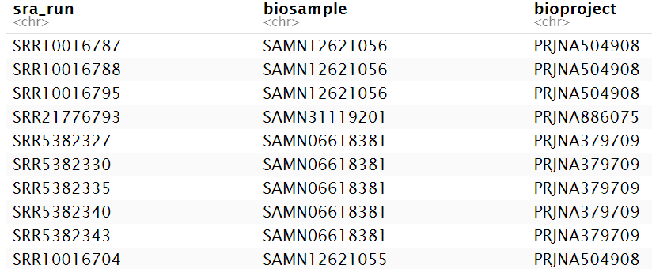
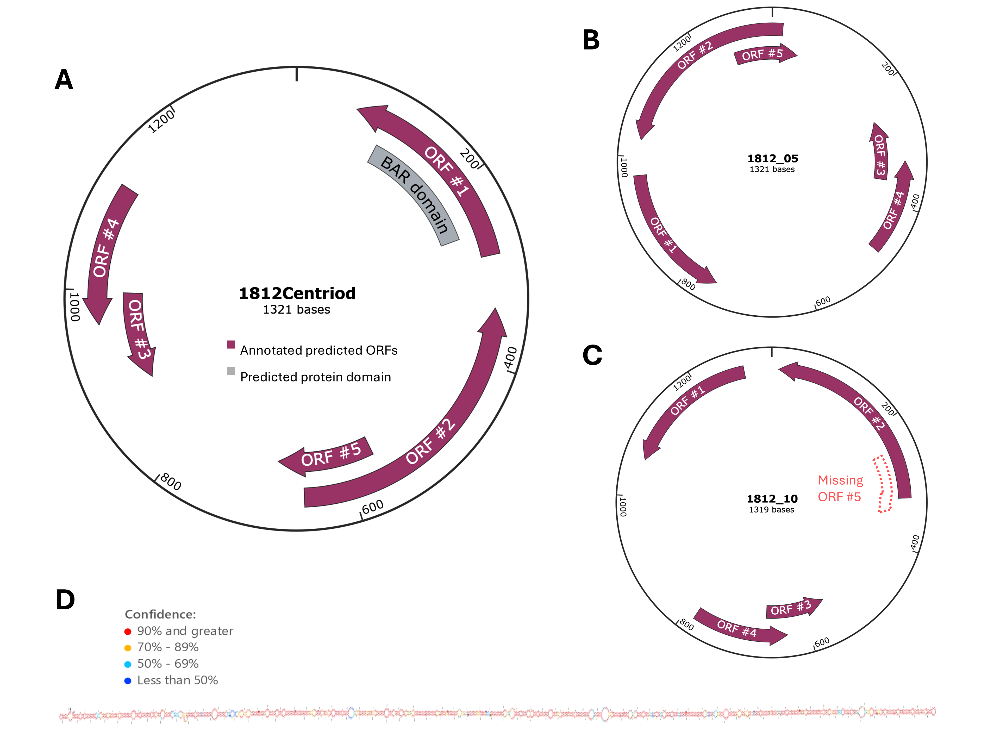
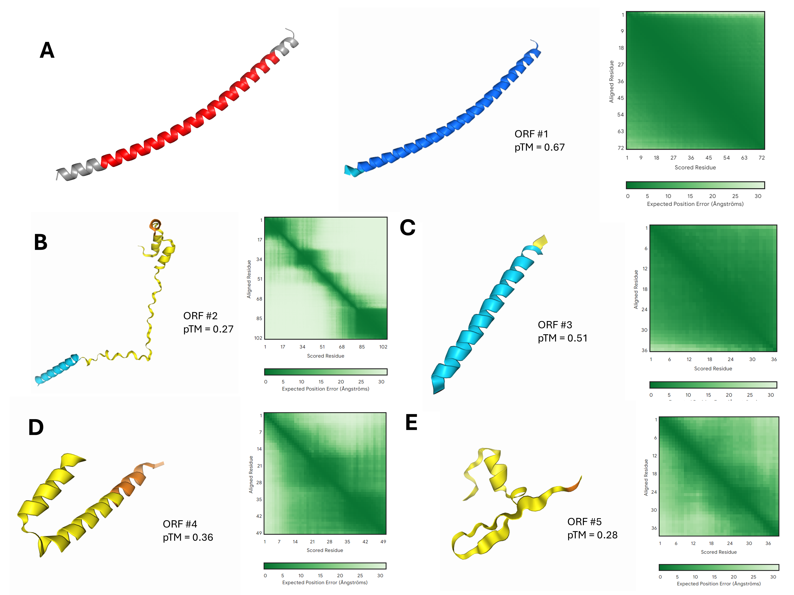
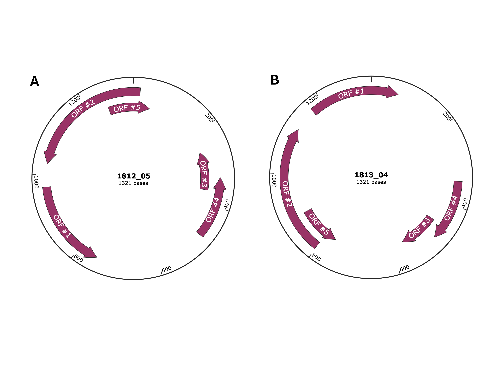
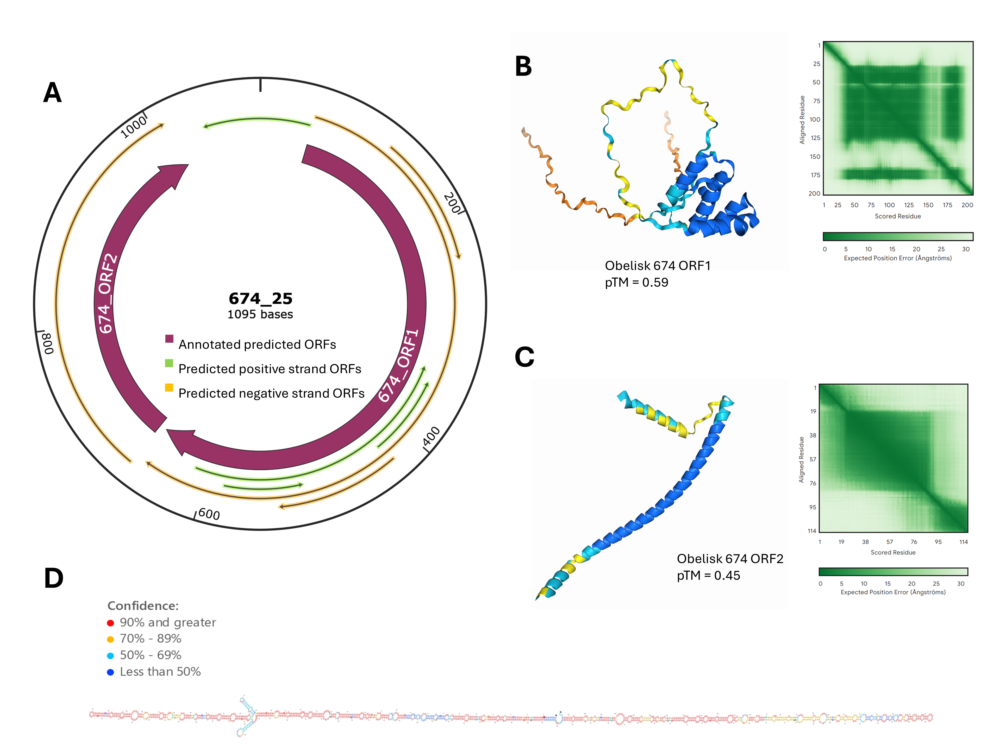

# **Obscurity turned outward: hidden residents of the mouse gut microbiome**

written by: [Meijin Wu]

### Virus Name

*Lineari*: most of the proteins encoded in this obelisk appears to incorporate a vaguely linear shape, and as a reference to the classic obelisk shape; *obscurus*: mysterious/unknown in Latin, refers to the many mysteries around this obelisk)

## Abstract

Obelisks are newly defined RNA-only agents that are distinct from other RNA viruses and viroids. Obelisks feature circular genomes that fold to a needle-like secondary structure and encode a small number of proteins. Obelisk sequences are prevalent in public metatranscriptomic data, and appear to harbor great variations (Zheludev et al., 2024). Overall, very little is known about the ecology, genome products, and host interactions of obelisks. This study reports characterizations of a novel obelisk group, named *Lineari obscurus*, found in the mice gut microbiome, and begins exploring its digital ecology. *L. obscurus* is found to encode several small proteins, one of which includes a potential BAR domain. Furthermore, additional obelisk groups were found in BioSamples containing *L. obscurus*. The results presented in this study demonstrate the immense differences between obelisk groups and the considerable gap in knowledge in our journey to understand these novel agents. This study provides a number of insights into the presence of obelisks in the mice gut and raises questions regarding the mechanisms of these RNA agents.

## Results

***Lineari obscurus*** **is primarily found in laboratory mouse gut microbiomes**

The obelisk sequences included in this study (files/obelisk_clusters.csv) were organized from metatranscriptomic data and were clustered by UCLUST with a nucleotide identity threshold of 80%. *Lineari obscurus* is the given name of the obelisk located in cluster 1812 of this file.

To begin organizing obelisk data, including run data, BioSample, BioProject, cluster, and sequence, I first analyzed the target cluster (cluster 1812) for information on the BioSample and BioProject for each individual run (Table 1). The runs from cluster 1812 originate from 3 separate BioProjects, all with a focus on analysis of the mouse gut microbiome. ProjectA (accession: PRJNA50490) was a study investigating the effects of diet on microbial communities in male BALB/c mice fecal samples (Carnody et al., 2019). ProjectB (accession: PRJNA886075) examined RNA profiles from female C57BI/5 colon tissues of mice fed dextran sodium sulfate to induce colitis (Peters et al., 2023). ProjectC (accession: PRJNA37970) is an unpublished study examining bacterial content from the mouse cecum and its relationship with colorectal cancer. All studies were conducted in the US.

Runs containing *L. obscurus* from ProjectA came from technical replicates of two BioSamples, RC3 and RC2, which were both mice fed a cooked meat diet, as opposed to raw meat or tuber diets tested in the study (Carnody et al., 2019). Only 1 BioSample from ProjectB contained *L. obscurus*, and there were no identifiable variables compared to other BioSamples from the same BioProject that may contribute to the ecology of this obelisk. Runs containing *L. obscurus* from ProjectC are all technical replicates of a single BioSample, however, additional technical replicates of this BioSample also contributed to Obelisks in different clusters, including clusters 674, 1813, 2131, and 2134. Overall, no significant trends in ecology could be identified from the BioSample data from this study.

Using the PebbleScout tool (Shiryev, S.A., Agarwala, R., 2024) to search against all metagenomic and metatranscriptomic runs released in the public SRA, however, a number of similar sequences to the *L. obscurus* genome were also found in BioSamples not listed in the Obelisk_cluster.csv file. While this document focuses analysis on the runs identified in the .csv file, further investigation leveraging the data from PebbleScout can prove to be insightful to the ecology of this obelisk.

Though inferences regarding the hosts of *L. obscurus* remain limited, given that these obelisks are found in mice gut microbiomes, they may share similarities in their genome and genome products with those found in human gut microbiomes as characterized in Zheludev et al.

To further investigate the sources of *L. obscurus*, I next sought to compile other BioSamples and run data within these BioProjects to explore the obelisk ecology found in these projects.

**BioProjects containing *Lineari obscurus* revealed the presence of additional obelisks**

In order to further investigate these BioProjects, I next compiled all individual runs recorded in the (file/obelisk_sraRunInfo.csv) for BioProjects A, B, and C. Each BioProject in Table 1. was found to be associated with a large number of BioSamples and individual runs. For example, ProjectA yielded 60 runs containing obelisks, a number far greater than the 4 runs containing *L. obscurus*.

This observation then prompts the question: "Why is *L. obscurus* only present in a select few samples?". The additional obelisks found in these BioProjects and their relationships to *L. obscurus* remain to be investigated.

In order to investigate the distribution of obelisks in these BioProjects, as well as their potential link to individual BioSamples, I further organized all data from each BioProject, focusing on the distribution of obelisks in each BioProject, the clusters they belong in, and their BioSample information.

Interestingly, the collective data obtained from each BioProject contains a number of obelisks spread across multiple clusters, with notable overlaps in clusters 1813, 2131, and 2134 between the three projects. In addition, obelisks identified in run data from the same BioSample are sometimes found in different clusters - for example, obelisks from the BioSample SAMN06618381 are spread across clusters 674, 1812, 1813, 2131, and 2134; and obelisks from the BioSample SAMN12621060 are present in clusters 345, 2144, and 2145. This is rather unexpected because the material from the same BioSample is expected to yield the same results, though of course there may exist variations within the sample and technical factors that could affect consistency between runs.

Table 1. Summary of SRA runs, BioSample, and BioProject associated with cluster 1812 obelisks.



### Virus Genome predicts multiple ORFs



Figure 1. Visualization of the *Lineari obscurus* genome. A) Visualization of the centroid sequence of obelisk cluster 1812, where *Lineari obscurus* was discovered. Predicted ORFs with a peptide length of \>25 amino acids are annotated in purple and labeled #1-#5. The BAR domain found in ORF #1 is annotated in grey. B)+C) Visualizations of obelisk numbers 05 and 10 were found in cluster 1812. Each run contained sequences starting at different locations in the genome, but core features were conserved. The missing positive strand ORF #5 is annotated in red in C). D) Secondary structure prediction of *Lineari obscurus* genome using the ViennaRNA package (Lorenz et al., 2011) with coloured legend of prediction confidence. All visualizations were made using SnapGene.

Figure 2. AlphaFold predictions of *Lineari obscurus* ORF proteins. A) Predicted structure of ORF #1. Left - conserved BAR domain is highlighted in red. Right - AlphaFold confidence of the predicted structure. B)-E) predicted structures of ORFs #2-#4 with confidence, pTM scores, and the expected position error between scored and aligned residues. All structure predictions were conducted on the AlphaFold server (<https://alphafoldserver.com/>).

***Lineari obscurus*** **include cluster 1813 obelisks**

Analysis of the 1813 cluster obelisks reveal that they are the complementary sequence to the 1812 centroids (Figure 3), which would explain why runs from the same BioSample yielded obelisks sorted to different clusters. However, no additional BioProjects were found in cluster 1813.



Figure 3. Genome comparison of A) run 05 in cluster 1812 and B) run 04 in cluster 1813, which comes from the same BioSample.

**Investigation of BioSamples reveal additional novel obelisk group**

Following this, I also investigated the cluster 674 obelisks, which were found in the same BioSample from ProjectC found in cluster 1812. However, the cluster 647 obelisks share virtually no similarity with *L. obscurus*, and contain very different ORFs compared to the 1812 and 1813 obelisks. I decided to investigate the longest two ORFs. However, no known protein domains were found in the ORF, and sequence homology search returned no results.

Figure 4. Genome visualization and annotation of obelisk identified in run 25 in cluster 674, which is sequenced from the same BioSample as sequence data presented in Figure 3. A) Predicted ORFs in the obelisk genome. All negative strand predictions with a peptide length of \>25 are annotated in orange. All positive strand predictions with a peptide length of \>25 are annotated in green. The two longest ORFs (#1 and #2) are annotated in purple. B) AlphaFold structure prediction of ORF #1 protein product with confidence. C) AlphaFold structure prediction of ORF #2 protein product with confidence. D) Secondary structure prediction of cluster 674 obelisk with coloured confidence legend.

## Discussion

This study reports the discovery of a new obelisk group, *Lineari obscurus,* which is associated with the mouse gut microbiome. No significant trend was found in the ecology of the BioSamples that contained this obelisk, however, the search conducted in this study was limited (only BioSamples from cluster 1812 were analyzed, while *L. obscurus* are represented by both clusters 1812 and 1813), and additional investigations of the details in the respective BioProjects in each BioSample may be valuable.

Specific host information for *L. obscurus* is also inconclusive due to the lack of level-specific info in metatranscriptomic data. Previous bacterium-infecting obelisks were found in the human gut microbiome ((Zheludev et al., 2024)), therefore it may be a reasonable hypothesis that *L. obscurus* may infect bacterial hosts. However, due to the significant differences between *Lineari obscurus* and obelisk-S.s genomes, further investigation is necessary.

A number of predicted ORFs were identified in the *Lineari obscurus* genome, and in particular, a conserved Bin/Amphiphysin/Rvs (BAR) domain was found in one ORF through a search in the NCBI conserved domain database (Wang et al., 2022). Known BAR domains are involved in dynamic membrane remodeling in pathways such as endocytic vesicle and T-tubule formation, as well as in the formation of plasma membrane protrusions (Rao and Haucke, 2011). This insight may point to potential ways *L. obscurus* genome products may interact with the host cell. In addition, the specific effects of the domain on membrane curvature have depended on the mechanisms of different BAR subtypes and cellular localization in literature (Suarez et al., 2014), therefore the mechanisms and function *L. obscurus* ORF #1 domain may be an interesting target for further studies.

Little information could be concluded about the other ORF products found in the *L. obscurus* genome due to a lack of homology with known proteins when searched in the NCBI BLAST databases (Altschul et al., 1990). It is perhaps for this reason that AlphaFold (Jumper et al., 2021) failed to predict confident structures for these potential protein products, and further investigations are needed to draw conclusions on the behaviour of this obelisk.

In addition to *L. obscurus*, an additional novel obelisk was revealed from technical replicates of one BioSample from which *L. obscurus* was observed. This unnamed obelisk found in cluster 674 was briefly characterized and revealed a very different genome compared to *L. obscurus*. However, similar to *L. obscurus*, little can be revealed regarding its potential ORFs and protein products. The cluster 674 obelisks may be related to *L. obscurus* in a variety of ways, including sharing a common or related host. Further investigation is required to characterize the relationship between these two obelisk groups. In addition, there were a number of additional related obelisks identified in this study that were present in the same BioSample as *L. obscurus*, in addition to the wide range of clusters that contain obelisks in the 3 BioProjects from which *L. obscurus* was discovered.

It is worth noting that both obelisks uncovered in this study appear to contain an ORF encoding a protein with a primarily alpha-helical structure (*L. obscurus* ORF #1, cluster 674 obelisk ORF #2), which is a result that shares striking similarity with the obelin-2 protein uncovered by Zheludev et al. However, the obelisks investigated in this project did not appear to share the leucine zipper motif found in the paper.

Overall, the ecology and biology of *Lineari obscurus*, as a part of the newly defined obelisk family, are still shrouded in uncertainty, including its potential hosts, protein products and their functions, their means of replication, and effects on the host. In addition, the wide range of related obelisks derived from similar BioSamples may hold valuable potential in uncovering the mystery of the obelisks through a better understanding of their ecology and potential interactions between obelisk groups.

## References

1.  Zheludev, I. N. et al. Viroid-like colonists of human microbiomes. Cell **187**, 6521-6536.e18 (2024).
2.  Carmody, R. N. et al. Cooking shapes the structure and function of the gut microbiome. Nat. Microbiol. **4**, 2052–2063 (2019).
3.  Peters, L. A. et al. A temporal classifier predicts histopathology state and parses acute-chronic phasing in inflammatory bowel disease patients. Commun. Biol. **6**, 1–12 (2023).
4.  Shiryev, S.A., Agarwala, R. Indexing and searching petabase-scale nucleotide resources. Nature Methods (2024).
5.  Wang, J. et al. The conserved domain database in 2023. Nucleic Acids Res. **51**, D384–D388 (2022).
6.  Lorenz, R. et al. ViennaRNA Package 2.0. Algorithms for Molecular Biology, 6:1 26 (2011)
7.  Suarez, A., Ueno, T., Huebner, R., McCaffery, J. M. & Inoue, T. Bin/Amphiphysin/Rvs (BAR) family members bend membranes in cells. Sci. Rep. **4**, 4693 (2014).
8.  Rao, Y. & Haucke, V. Membrane shaping by the Bin/amphiphysin/Rvs (BAR) domain protein superfamily. Cell. Mol. Life Sci. CMLS **68**, 3983–3993 (2011).
9.  Altschul, S.F. et al. “Basic local alignment search tool.” J. Mol. Biol. 215:403-410. (1990)
10. Jumper, J. et al. “Highly accurate protein structure prediction with AlphaFold.” Nature, 596, pages 583–589 (2021).

# Viral Short Story

```         
I lit a cigarette, ignoring the "no smoking" sign glaring at me from the corner of the office. It had been three days since the first whispers of the pandemic agent hit the news, and I hadn’t slept. Early raw sequencing data was finally available, and I was ready to dive in. But what I found in the code staring back at me wasn’t just strange—it was alien. The sequence didn’t have homology to any known organism or viral sequences. Not a bacterium, not a virus, not even the weird stuff hiding in junk DNA. It was like staring into a cipher written in a language nobody ever spoke.
The file from which the sequence was first found was tagged with metadata. It came from a group at the University of California, part of a long-forgotten project buried in the sea of academia. The kicker? The sequence hadn’t even been intended for infectious agent studies. It had been a tidbit of data from research comparing how mice diets affected their gut microbiomes. Cecal samples, the metadata said—processed by Illumina RNA-seq. It was metatranscriptomics, tracking microbial gene expression in the murky depths of mouse guts. But that wasn’t the weirdest part.
The timestamp was from 2012. A whole decade ago.
I leaned back, staring at the screen. My instincts screamed that this wasn’t just an old artifact. The data had been dismissed back then—ignored, probably mislabeled, like some useless scrap. But now, it had come back to bite us in a way no one saw coming. My coffee was cold, my inbox pinging with desperate emails, but none of that mattered.
I opened the sequence in my editor, each base a brick in a mystery I had no choice but to solve. If this thing was new, what has it been doing for ten years—and why was it waking up now?
```
