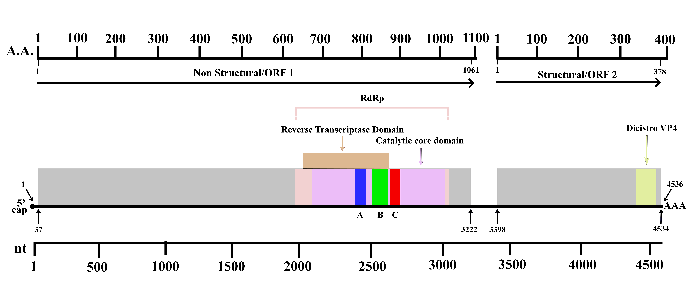
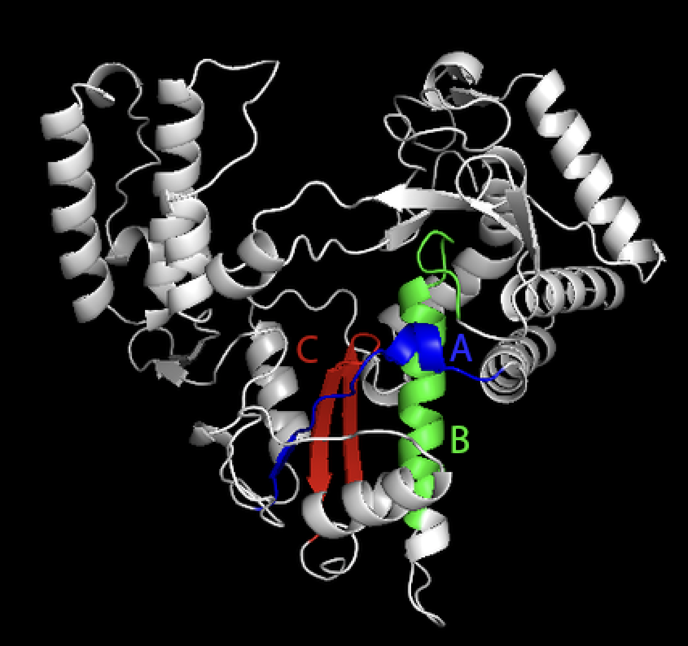
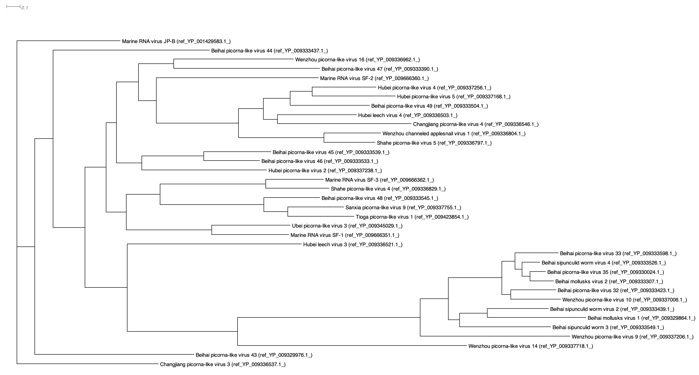

# Discovering a New Locarnavirus Species: Exploring Genomic, Structural, and Functional Insights Redefines Current Definitions and Broadens Ecological Versatility and Host Range within Marine Metagenomes 
written by: [Mikael Gouwtama](https://github.com/MikaelLeonard)

### Locarnavirus Nudiformis
The genus "Locarnavirus" is chosen as it shares a 57% perecent identity (the highest obtained from BLASTx) and a relatively similar structure to the Locarnavirus genus. 

Regarding the species name, Nudiformis is a combination of "nudus" (Latin for naked) and "formidans" (Latin for formidable). It is chosen as it describes the structural integrity and nakedness of our virus. Specifically, the term "Nudi" emphasizes the lack of outer surface capsid protein domains, aligning with the virus's unique feature of lacking VP1, VP2, and VP3. Also, its shorter genome length and absence of certain structural and non-structural domains. The term "formis" emphasizes the unexpected strength, adaptability, and potency of the virus despite its naked or structurally weakened appearance; being able to exist in various salinity conditions, its widespread, infecting mollusks, among others.


## Abstract

Aquatic ecosystems harbor a myriad of viruses, and this study explores a novel Locarnavirus species isolated from Gorge Harbour, Canada, revealing unprecedented ecological versatility. Conducted by Marli Vlok and the Suttle lab at the University of British Columbia, the research spans diverse locations from the Arctic Ocean to Southern Chile, uncovering a unique marine RNA virus with a global presence. This study challenges established notions of Locarnaviruses, showcasing the virus's remarkable adaptability to varying salinity conditions, from salt marshes to freshwater environments. Furthermore, the virus exhibits unexpected infectivity in mollusks and blue corals, defying conventional structural expectations. Here, we show that a detailed genomic analysis reveals a Locarnavirus with a truncated genome length and the absence of key structural domains. This distinctive genomic profile, along with a surprising dependence on host cellular machinery, distinguishes the virus as a unique species within the Locarnavirus genus. Despite a modest 57% identity with known Locarnaviruses, the virus's distinctiveness underscores the need for a comprehensive reevaluation of Locarnavirus taxonomy. In conclusion, this study unravels the ecological resilience and unexpected host interactions of a novel Locarnavirus species, contributing to the growing body of knowledge on aquatic RNA viruses. The findings challenge prevailing assumptions, emphasizing the importance of continued exploration to unravel the complexities of viral dynamics within aquatic ecosystems. The unique characteristics of this virus open new avenues for understanding viral ecology and adaptation in diverse marine environments.

## Results

### Digital Virus Ecology


#### Isolation of the Virus

The unknown virus under consideration originated from a water sample obtained from Gorge Harbour, situated along the temperate southwest coast of Canada, in September 2012. The marine metagenome sample was characterized by a salinity of 27.86 ppt and a temperature of 11.41 Celsius during the time of isolation [Vlok, 2018]. The collection of this sample was part of a broader initiative led by the Suttle lab at the University of British Columbia, a research group focused on studying viruses and their environmental roles, particularly in ocean ecosystems. Supervised by Professor Curtis Suttle, the sample was collected by Steven Short, a member of the lab [Suttle].

#### Index Run Case

The dataset containing the virus was processed and analyzed in 2018 under the run accession code `SRR7219125` and palmprint ID of `u548372`. It was generated by first extracting nucleic acid from the sample. The extracted nucleic acid was used to create cDNA, which are then amplified and sequenced using Illumina HiSeq 2000. Marli Vlok, a Ph.D. candidate in the lab supervised by Professor Curtis Suttle, conducted this analysis as part of her doctoral research in the Botanical Faculty of Graduate and Postdoctoral Studies at UBC. Her study, titled "Distribution and Diversity of Aquatic RNA Virus Assemblages in an Environmental Context," aimed to explore the diversity of RNA virus assemblages in various coastal and oceanic sites, spanning the Arctic Ocean to the West Coast of Southern Chile [Vlok, 2018].

Vlok's study was motivated by the limited knowledge about aquatic RNA viruses and their potential impact on microbial eukaryotes and ecosystem dynamics. The research identified numerous previously unknown marine RNA viruses, introduced a new classification system for them to be incorporated into the established taxonomy, and revealed their associations with environmental factors. The significance of the study lies in advancing our understanding of the ecological roles of these viruses in marine ecosystems and suggesting their potential use as environmental indicators under specific conditions [Vlok, 2018].

#### Comparative Analysis of Virus Ecology Across Datasets

In addition to the marine metagenome, the virus was identified in various other metagenomes, including oyster, sediment (i.e., SRR11648176), salt marsh (i.e., SRR11828456), aquatic (i.e., SRR3218034), estuary (i.e., SRR7086597), and freshwater (i.e., SRR6048938).  Additionally, it exhibited the capacity to infect animals such as oysters (Saccostrea glomerata), clams (Leukoma staminea/pacific littleneck clam and Tegillarca granosa/blood clam), and intriguingly, blue corals (Heliopora coerulea).

#### Ecological Versatility - Salinity Conditions & Geographic Localization

The virus demonstrated a remarkable adaptability to aquatic environments across a wide range of salinity conditions. From salt marshes with a high salinity levels of up to 40 ppt [Teal, 2001] to freshwater environments with salinity levels below 1000 ppm, the virus showcases its ability to thrive in ecosystems with distinct salinity profiles, emphasizing its ecological resilience.

Moreover, the virus displayed a global presence, with occurrences in different locations worldwide. For instance, in run code (SRR5949850), the virus was found in blue corals in the waters of Philippines, highlighting its adaptability across diverse geographic regions. The same adaptability was evident in other runs, such as (SRR10820331), isolated from Narragansett Bay in Rhode Island, emphasizing the virus's widespread distribution.

#### Virus Host

The abundance of the virus in aquatic metagenomes suggests potential hosts among unicellular microorganisms, such as microalgae [Charon, 2022]. This observation opens intriguing possibilities regarding the virus's role in microbial ecosystems. Furthermore, the virus displayed infectivity in both mollusks (oysters (i.e., SRR10820331 and SRR10820332) and clams (i.e., SRR18446135 and SRR5515063)) and occasionally in blue coral (SRR5949850).

The relationship between the virus and mollusks, specifically clams and oysters, draws attention to the filter feeding mechanism employed by these organisms. Mollusks filter water, extracting particles such as algae for nourishment [Richard, 2022]. On the other hand, the occasional presence of the virus in blue corals, which have a mutualistic relationship with microalgae, suggests a complex interplay. Blue corals house microalgae, utilizing sunlight to produce energy, which benefits both parties [Howe-Kerr, 2022]. This intricate network of interactions indicates potential avenues for viral transmission among these diverse organisms.

Despite the virus's prevalence in aquatic metagenomes, its absence in other ecological datasets, such as those involving animals inhabiting these waters, hints at unique viral characteristics. This intriguing aspect calls for further exploration, aiming to uncover the intricate dynamics governing the virus's ecological niche within aquatic ecosystems. In short, a common factor linking these datasets is apparent: the virus's presence in water environments and its intricate interactions with specific organisms, where a thorough investigation of the virus' structure and characteristics may provide insight to the identity and complexities of viral dynamics within its ecology.


### Virus Genome 

 {Fig. 1: Genome map of unknown virus isolated from Gorge Harbor, Cannada [Vlok, 2018]. Two open reading frames (ORFs) were observed. ORF 1 codes for the non-structural proteins and ORF 2 codes for the structural proteins of the viral genome. The RNA-dependent RNA polymerase (peach) is found in ORF 1, along with its conserved motifs A, B, and C, colored blue, green, and red, respectively. Its catalytic core (pink) and reverse transcriptase (brown) domains are also observed. The Disistro VP4 domain (minor capsid proteins of cricket paralysis virus, VP4) is found in ORF 2, colored lime green. A scale legend for the amino acid residues (A.A.) and nucleotides (nt) are included for reference.}

### Virus RdRp Tertiary Structure

 {Fig. 2: 3D tertiary structure of the unknown virus  RNA-dependent RNA polymerase (RdRp) protein predicted using Alphafold2 [Jumper et al., 2021] and generated using PyMol [Schrödinger and DeLano, 2020]. The structure resembles that of a cupped right hand, consisting of the fingers, thumb, and palm subdomains. The conserved polymerase motifs A (blue), B (green), C (red), reponsible for the bindings of substrate and cofactors [Gao et al., 2020] are highlighted, located within the palm subdomain.}

### Multiple Sequence Alignment of Virus RdRp

 {Fig. 3: Multiple sequence alignment (MSA) of the unknown virus  RNA-dependent RNA polymerase (RdRp) protein sequence for all BLAST hits with >80% query coverage and >40% amino acid identity using BLASTp [Camacho et al. 2009], retrieved from the refseq_protein database, and visualized using Jalview [Waterhouse et al. 2009]. The conservation, quality, consensus, and occupancy of the alignment is depicted. Conservation indicates the degree of similarity or conservation of amino acid residues at each position in the sequence alignment. Conserved positions are represented with a darker color. Quality indicates the reliability of the information at a given position in the sequence alignment. Consensus represents the most common amino acid or nucleotide at each position in a sequence alignment. Occupancy measures how frequently a particular position in the sequence alignment is filled with a residue, where high occupancy indicates that a position is occupied by a residue in a significant number of sequences, while low occupancy may suggest variability or gaps in the alignment. The accession number for all the hits are listed on the left for reference.}

### Phylogenetic Tree Representation of MSA

 {Fig. 4: Phylogenetic tree of the above unknown viral RNA-dependend RNA polymerase multiple sequence alignment, generated using IQTree [Nguyen et al., 2014] and visualized using Dendroscope [Huson and Scornavacca, 2012]. The tree indicates the genetic relationship and evolutionary divergence of the RdRp. The unknown virus RdRp appeared to be related with the RdRp of other marine RNA viruses, marine-related animal (sipunculid worm and mollusks) viruses, and picorna-like viruses. Each branch is identified by the virus scientific name and its accession number.}

## Discussion

BLASTx analysis of the unknown viral genome revealed that the sample virus shares the highest percent identity to Locarnavirus sp, a member of the Marnaviridae family in the Picornavirales order. Although further examination supported this identification, subtle deviations from known Locarnavirus sp members hint at the unique characteristics of this unidentified virus, prompting a need for closer scrutiny of its identity.

Similar to Locarnaviruses, our unknown virus features a positive-strand single-stranded RNA genome with two open reading frames (ORFs). ORF 1 encodes non-structural proteins, including a region coding for RNA-dependent RNA polymerase, specific to the Marnaviridae family, a catalytic domain, a reverse transcriptase domain, and conserved motifs A, B, and C. The replication process relies heavily on the RNA-dependent RNA polymerase, crucial for translating the viral proteins and generating a complementary copy of the genome (a negative strand cRNA) upon entry into the host, which are then used as a template to synthesize more of the positive single-stranded viral genomes [Payne, 2017]. Further investigation revealed a structural domain in ORF 2, specifically the dicistro VP4 domain, indicative of the picornaviridae order that codes for capsid proteins [Tate et al., 1999]. Capsid is a typical characteristics of viruses, and in the case of our virus, its appearance in the viral genome is expected, as naked (non-enveloped) Locarnaviruses contains an icosahedral shaped capsid.

Moving on to its distinct characteristics, one notable difference is the viral genome length. Our unknown virus length is only 4356 nucleotides long, which is roughly half of the existing reported length of Locarnoviruses and Marnaviridae viruses. Along with this reduction in the viral genome size is the absence of other domains from both ORFs. The missing structural domains include capsid protein domains including Rhv-like protein, CRPV capsid protein, VP1, VP2, and VP3 domains. 

VP1 is one of the major capsid proteins and is involved in forming the outer surface of the viral capsid where VP2 and VP3's role was to maintain the structural integrity of this outer capsid, assiting in the formation of the overall structure and stability of the viral particle. The absence of these three VP proteins suggest that our unknown virus may lack an outer surface of the viral capsid or a deviation from the typical picornavirus capsid structure [Louten, 2017] and potentially compromising structural integrity, altering host interactions, and affecting antigenicity. The absence of Rhv-like proteins, an 8-stranded β sandwich structure essential for the capsid's structural stability by easing "tiling," which is where subunits come together to form a cohesive and repeating pattern, further raise questions about our virus's ability to protect its genome and resist environmental stresses [Cheng and Brooks, 2013]. However, the lack of CRPV protein domains suggests a non-arthropod host interaction [Lechtenberg and Routh, 2018], aligning with the virus's presence solely in aquatic ecosystems and select marine animals.

Locarnaviruses typically infect marine single-cell eurakyotes like algae and protists,  yet our virus, despite lacking structural integrity, demonstrates infectivity in mollusks and blue coral. One plausible reason could have been that these viruses closely relates to other virus that infects higher level marine organisms like molluks. Such reason is supported by our phylogenetic analysis from the multiple sequence alignment, which reveals a relation to viruses infecting mollusks, worms, and leeches, suggesting potential host-specific immune evasion mechanisms.

Furthermore, the absence of non-structural domains (RNA helicase and protease) in ORF 1 hints at a unique viral replication method. Generally, helicase functions to separate nucleic acid strand during genome replication [Frick and Lam, 2013] while viral encoded proteases cleave the generated polyproteins such as RdRp and other viral proteins [Payne, 2017]. The absence of these domains suggest that our unknown virus may exploit the host's helicase and protease for replication, indicating a dependency on the host organism's cellular machinery. Weitzman and Fradet-Turcotte mentioned that the smaller the viral genome, the more minimal the coding capacity, and the greater the need to harness cellular processes [2018]. That is, viruses with smaller genomes (like our virus) may be more dependent on the host's cellular machinery. Accordingly, these findings may suggest that our virus behave differently to the current Picarnoviruses and Locarnaviruses, which encode for their own helicase and proteases.

While the top BLASTx hit for our virus is Locarnavirus, the modest 57% percent identity, falling between 52.4% and 59.1%, challenges the existing definition of Locarnavirus. Consequently, our virus emerges as a distinct species within the Locarnavirus genus, characterized by a weaker structural integrity and reliance on host cell replication machinery due to the absence of outer capsid surface protein domains and relying heavily on the host's helicases and proteases, respectively. Despite these differences, our virus shares the ability to infect marine single-cell eukaryotes and evade the immune systems of certain bivalve mollusks and blue corals, possibly due to similarities with other marine animal-infecting viruses.

In conclusion, a comprehensive investigation of similar viruses identified through multiple sequence alignment may shed light on the virulence and characteristics of this newly identified virus. Understanding its ability to infect beyond single-cell eukaryotes with its distinctive structure requires a thorough examination of related viruses to unravel the unique features and potential adaptations of this novel Locarnavirus species. However, for now, we can call this virus: Locarnavirus Nudiformis, named after its formidable strength despite its lacking structure. 

## References

```
Camacho, Christiam, George Coulouris, Vahram Avagyan, Ning Ma, Jason Papadopoulos, Kevin Bealer, and Thomas L Madden. “BLAST+: Architecture and Applications.” BMC Bioinformatics 10, no. 1 (2009). doi:10.1186/1471-2105-10-421. [Camacho et al., 2009]

Charon, J., Kahlke, T., Larsson, M. E., Abbriano, R., Commault, A., Burke, J., Ralph, P., &amp; Holmes, E. C. (2022). Diverse RNA viruses associated with diatom, Eustigmatophyte, dinoflagellate, and rhodophyte microalgae cultures. Journal of Virology, 96(20). https://doi.org/10.1128/jvi.00783-22 

Cheng, S., &amp; Brooks, C. L. (2013). Viral capsid proteins are segregated in structural fold space. PLoS Computational Biology, 9(2). https://doi.org/10.1371/journal.pcbi.1002905 

Curtis suttle. Department of Earth, Ocean and Atmospheric Sciences. (n.d.). https://www.eoas.ubc.ca/people/curtissuttle  

Distribution and Diversity of Aquatic rNA Virus Assemblages in an Environmental Context, Vlok M. [Doctoral thesis, University of British Columbia]. 

Frick, D., &amp; Lam, A. (2006). Understanding helicases as a means of virus control. Current Pharmaceutical Design, 12(11), 1315–1338. https://doi.org/10.2174/138161206776361147 

Gao Y;Yan L;Huang Y;Liu F;Zhao Y;Cao L;Wang T;Sun Q;Ming Z;Zhang L;Ge J;Zheng L;Zhang Y;Wang H;Zhu Y;Zhu C;Hu T;Hua T;Zhang B;Yang X;Li J;Yang H;Liu Z;Xu W;Guddat LW;Wang Q;Lou Z;Rao Z; (n.d.). Structure of the RNA-dependent RNA polymerase from COVID-19 virus. Science (New York, N.Y.). https://pubmed.ncbi.nlm.nih.gov/32277040/ 

Genus: Locarnavirus. (n.d.). Retrieved from https://ictv.global/report/chapter/marnaviridae/locarnavirus

Huson, Daniel H., and Celine Scornavacca. “Dendroscope 3: An Interactive Tool for Rooted Phylogenetic Trees and Networks.” Systematic Biology 61, no. 6 (2012): 1061–67. doi:10.1093/sysbio/sys062. [Huson and Scornavacca, 2012]

Howe-Kerr, L. I., Grupstra, C. G., Rabbitt, K. M., Conetta, D., Coy, S. R., Klinges, J. G., Maher, R. L., McConnell, K. M., Meiling, S. S., Messyasz, A., Schmeltzer, E. R., Seabrook, S., Sims, J. A., Veglia, A. J., Thurber, A. R., Thurber, R. L., &amp; Correa, A. M. (2023). Viruses of a key coral symbiont exhibit temperature-driven productivity across a reefscape. ISME Communications, 3(1). https://doi.org/10.1038/s43705-023-00227-7 

Jumper, John, Richard Evans, Alexander Pritzel, Tim Green, Michael Figurnov, Olaf Ronneberger, Kathryn Tunyasuvunakool, et al. “Highly Accurate Protein Structure Prediction with Alphafold.” Nature 596, no. 7873 (2021): 583–89. doi:10.1038/s41586-021-03819-2.  

Lang, A. S., Vlok, M., Culley, A. I., Suttle, C. A., Takao, Y., &amp; Tomaru, Y. (2021). ICTV Virus Taxonomy Profile: Marnaviridae 2021. Journal of General Virology, 102(8). https://doi.org/10.1099/jgv.0.001633 

Lechtenberg, B. C., &amp; Routh, A. (2018). Better Safe Than sorry: A dual-function viral protein inhibiting host defense. Cell Host &amp;amp; Microbe, 24(4), 467–469. https://doi.org/10.1016/j.chom.2018.09.012 

Louten, J., &amp; Reynolds, N. (2023). Essential human virology. Academic Press, an imprint of Elsevier.

Nguyen, Lam-Tung, Heiko A. Schmidt, Arndt von Haeseler, and Bui Quang Minh. “IQ-Tree: A Fast and Effective Stochastic Algorithm for Estimating Maximum-Likelihood Phylogenies.” Molecular Biology and Evolution 32, no. 1 (2014): 268–74. doi:10.1093/molbev/msu300. [Nguyen et al., 2014]

Payne, S. (2017). Introduction to RNA viruses. Viruses, 97–105. https://doi.org/10.1016/b978-0-12-803109-4.00010-6 

Richard, M., Bec, B., Bergeon, L., Hébert, M., Mablouké, C., &amp; Lagarde, F. (2022). Are mussels and oysters capable of reducing the abundances of picochlorum sp., responsible for a massive green algae bloom in Thau Lagoon, France? Journal of Experimental Marine Biology and Ecology, 556, 151797. https://doi.org/10.1016/j.jembe.2022.151797 

Schrodinger, L., and W. Delano. “Pymol Is a User-Sponsored Molecular Visualization System on an Open-Source Foundation, Maintained and Distributed by Schrödinger.” PyMOL. https://pymol.org/. 

Tate, J. G., Liljas, L., Scotti, P. D., Christian, P. D., Lin, T. W., &amp; Johnson, J. E. (1999). Cricket paralysis virus (CRPV). Nature Structural &amp; Molecular Biology, 6(8), 765–774. https://doi.org/10.1038/11543. 

Teal, J. M. (2001). Salt marshes and Mud Flats. Encyclopedia of Ocean Sciences, 2490–2495. https://doi.org/10.1006/rwos.2001.0087  

ViralZone. Swiss Institute of Bioinformatics. (n.d.). Locarnavirus (taxid:2560169). https://viralzone.expasy.org/8937 

Vlok, M., Lang, A. S., &amp; Suttle, C. A. (2019). Application of a sequence-based taxonomic classification method to uncultured and unclassified marine single-stranded RNA viruses in the order picornavirales. Virus Evolution, 5(2). https://doi.org/10.1093/ve/vez056 

Wang, H., Munke, A., Li, S., Tomaru, Y., &amp; Okamoto, K. (2022). Structural insights into common and host-specific receptor-binding mechanisms in algal picorna-like viruses. Viruses, 14(11), 2369. https://doi.org/10.3390/v14112369 

Waterhouse, Andrew M., James B. Procter, David M. Martin, Michèle Clamp, and Geoffrey J. Barton. “Jalview Version 2—a Multiple Sequence Alignment Editor and Analysis Workbench.” Bioinformatics 25, no. 9 (2009): 1189–91. doi:10.1093/bioinformatics/btp033. [Waterhouse et al., 2009]

Weitzman, M. D., &amp; Fradet-Turcotte, A. (2018). Virus DNA replication and the host DNA damage response. Annual Review of Virology, 5(1), 141–164. https://doi.org/10.1146/annurev-virology-092917-043534 
```

# Viral Short Story

```
In the waters of Gorge Harbour so wide,
A virus named Nudiformis, on a viral tide,
Marli Vlok discovered, oh what a surprise,
A Locarnavirus species, with peculiar ties.

Digital virus ecology, a tale to be told,
Isolation from waters, not too hot, not too cold,
From Canada it hailed, in Gorge Harbour's embrace,
A novel Locarnavirus, with an aquatic grace.

Its genome was short, just 4356 long,
A viral mystery, in its structure, it thronged,
No capsid proteins adorned its outer shell,
Yet infectivity in mollusks, it could surely tell.

In salt marshes and freshwater it played,
Versatile in salinity, in environments it swayed,
Blue corals and clams, in its viral trance,
Nudiformis danced, in a peculiar dance.

No helicase, no protease, in its genes to be found,
A reliance on hosts, in replication it's bound,
With a modest 57%, Locarnavirus kin,
Yet a distinct species, it danced with a grin.

Ecological resilience, an enigma so grand,
In the waters it wandered, across sea and land,
Locarnavirus Nudiformis, a tale to unfold,
In the ocean's secrets, its story is told.
```