# The Mammalian Gut Associated Novel Obelisk Mammalia ventremi is Geographically Widespread and Contains an Efficient Encoding of Oblin-1, a Possible RNA Polymerase and RNA Interacting Protein.
written by: [Teo Reid](https://github.com/reidmat5) with GenAI

### Mammalia ventremi
*Mammalia ventremi is the name of my obelisk. Mammalia means mammal in latin and ventremi means stomach or in some contexts womb. The common factor between all the obelisks in my cluster are that they are found in stool samples (from the stomach) from mammals (which birth from the womb).*


## Abstract

The mammalian gut microbiome is a complex ecosystem hosting a diverse array of microorganisms, including viruses and viral-like particles that influence host health and microbial dynamics. Little is known about a novel type viral-like particle called obelisks, including their lifecycle and impacts on host and human health. Here I report the discovery of Mammalia ventremi, a novel obelisk identified in the gut of mammals such as humans, gorillas, and Tasmanian devils. Mammalia ventremi is geographically widespread, found across 13 unique bioprojects, and consistently associated with stool samples, suggesting a prevalence in the gut environment. It possesses one of the shortest and most efficient genomes among obelisks, comprising 785 nucleotides and encoding a single protein, Oblin-1. Mammalia ventremi's genome folds into a rod-shaped secondary structure characteristic of obelisks and exhibits minimal sequence variability across diverse hosts and locations. Bioproject metadata and structural modeling indicates that Oblin-1 may interact with Escherichia coli RNA polymerase, potentially recruiting it for replication of the obelisk genome. This interaction may involve Oblin-1 replacing the sigma factor to direct RNA polymerase to the obelisk genome. My findings expand the understanding of viral-like particles in mammalian guts and suggest intricate host-microbe interactions that may influence gut microbial dynamics. Mammalia ventremi represents a significant addition to the knowledge of obelisks and provides a foundation for future studies investigating their role in common gut microbiome inhabitants and potential impact on bacterial and human health.


## Results

The centriod for the obelisk Mammalia ventremi was extracted from a bioproject associated with a publication examining bioactive microbial gene products within the context of inflammatory bowel disease (IBD) patients [Zhang et al. 2022]. This particular was derived from stool samples of individuals with varying gut health.

Though Mammalia ventremi was first located in this bioproject examing IBD, it is found across 13 unique bioprojects, spanning diverse research objectives. These bioprojects are associated with 14 distinct publications [Le Nevé et al. 2020, Tisza and Buck 2021, Schmidt et al. 2019, Heintz-Buschart et al. 2016, West et al. 2022, Chrisman et al. 2021, Tataru et al. 2023, Tataru et al. 2021, Herold et al. 2020, Sheik et al. 2015, Muller et al. 2014, Roume et al. 2015, Muller et al. 2017, Martínez Arbas et al. 2020]. These projects encompass a variety of datasets, including RNA sequencing (SRA experiments), genomic DNA analysis, and metagenomic data. Interestingly, one bioproject is classified as an Escherichia coli genome with metagenomic samples extracted from 16S sequencing of the stool of UI cases and control patients, reflecting a possible link between Mammalia ventremi and E. coli.

The datasets originate from Illumina paired-end sequencing. Sample sources include waste water and stool samples from various mammalian species: Homo sapiens (human), Gorilla gorilla gorilla (western lowland gorilla), and Sarcophilus harrisii (Tasmanian devil). In humans, the stool samples come from a range of studies, including those examining urinary incontinence, the effects of typhoid vaccination, dietary impacts of fermented milk consumption, and children with autism  (Figures 1, 2).

The variance in sample conditions leads me to hypothesize that Mammalia ventremi is prevalent across different mammalian hosts and geographic contexts (*medium* confidence given large, but not huge, number of sequences present in cluster and wide distribution of sequences across species and locals, even given the fact that most sequencing occurs in the same places).

Despite the diversity of sample sources and host organisms, a unifying factor among datasets is the consistent collection of stool samples. This suggests a association of Mammalia ventremi with the gut environment. However, I don't find it likely ir is diet-specific. While insect consumption might connect the diets of western lowland gorillas and Tasmanian devils, this behavior is uncommon in humans from Western Europe and North America, where most samples were collected. Therefore, I find it likely that Mammalia ventremi resides in a conserved gut ecosystem shared by diverse mammals.

Quantifying observations such as these involves several metrics. For the high level data, the number of obelisk sequences associated with a bioproject, and the number of bioprojects with common descriptions are important factors (Figures 1, 2). Given the wide range of environments the human stool samples were collected under, the only common factor which seems to link these data sets together is the fact that they are all stool samples. The association of Mammalia ventremi with an E. coli genome bioproject and lack of dietary crossover provides a foundation for a targeted hypothesis. Specifically, it can be hypothesized that Mammalia ventremi utilizes E. coli as a host (*low* confidence given lack of other E. coli references).


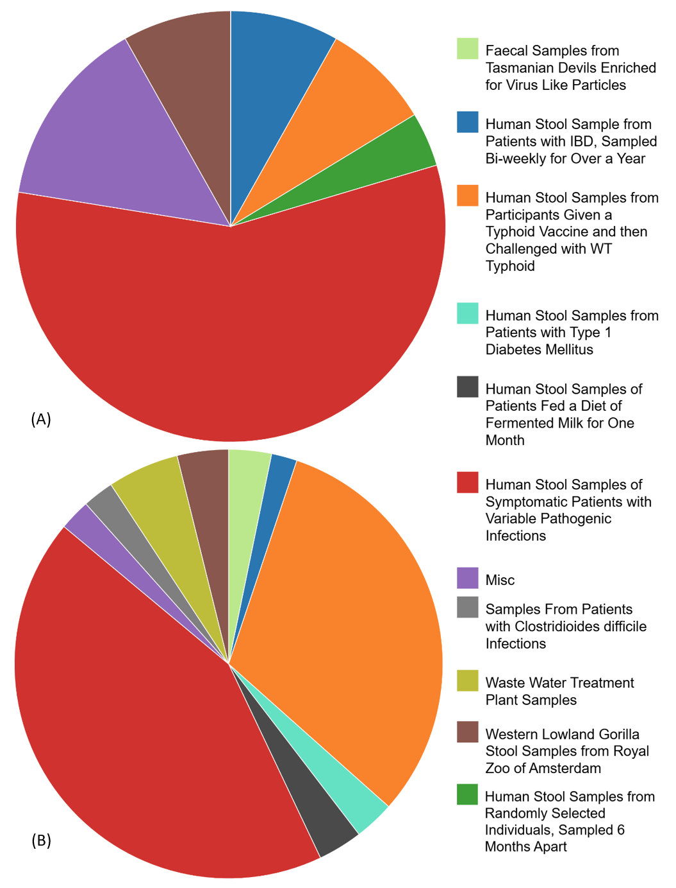
(1) Mammalia ventremi Cluster Project Metadata. (A) Proportions by number of reads. (B) Proportions by megabases. [“RAWGraphs,” n.d.]

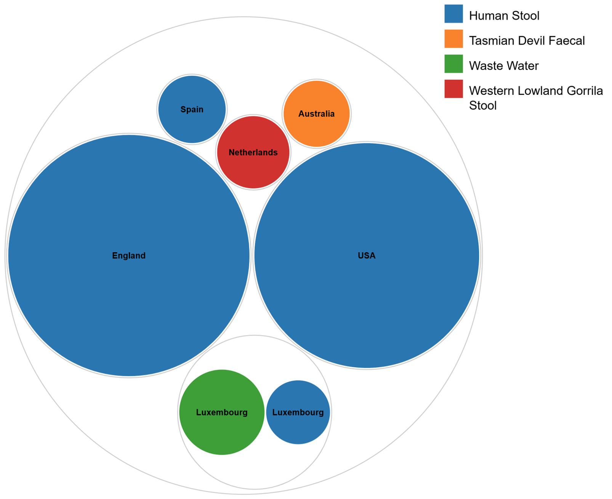
(2) Mammalia ventremi Cluster Geographic Metadata. Proportions by megabases. [“RAWGraphs,” n.d.]

*high* confidence: Mammalia ventremi's genome folds into a rod shaped secondary structure and is one of the shortest and most efficient (in terms of genome length vs oblin-1 length) obelisks. Figures 3-9 illustrate the Mammalia ventremi Genome in various ways. Figures 3-5 show open reading frames and RNA secondary structure interactions; Mammalia ventremi possesses the characteristic rod-shaped secondary structure and only encodes for 1 protein (Oblin-1). Figures 6-9 describe where Mammalia ventremi lands in the scope of current obelisks (and its centriod in its own cluster) with regards to some rudamentary whole genome statistics. I have high confidence in this hypothesis as is it a known characteristic of obelisks to have a rod structure and I have many (thousands) other obelisks to compare against for genome and oblin-1 length measurments from the Zheludev et al. 2024 paper.


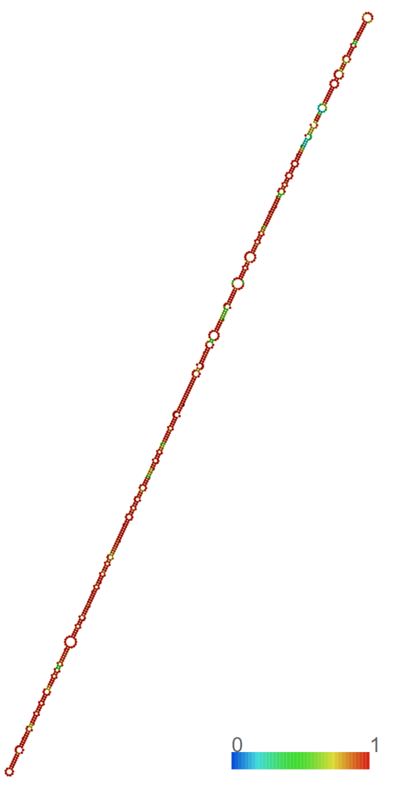
(3) Mammalia ventremi Whole Genome Secondary Structure. Note strong rod shaped structure.[Zuker 2003]

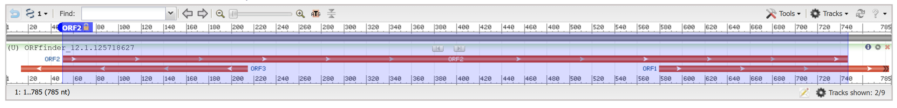
(4) Mammalia ventremi Open Reading Frames. Note singular continuous protein (Oblin-1).[NCBI. 2019]

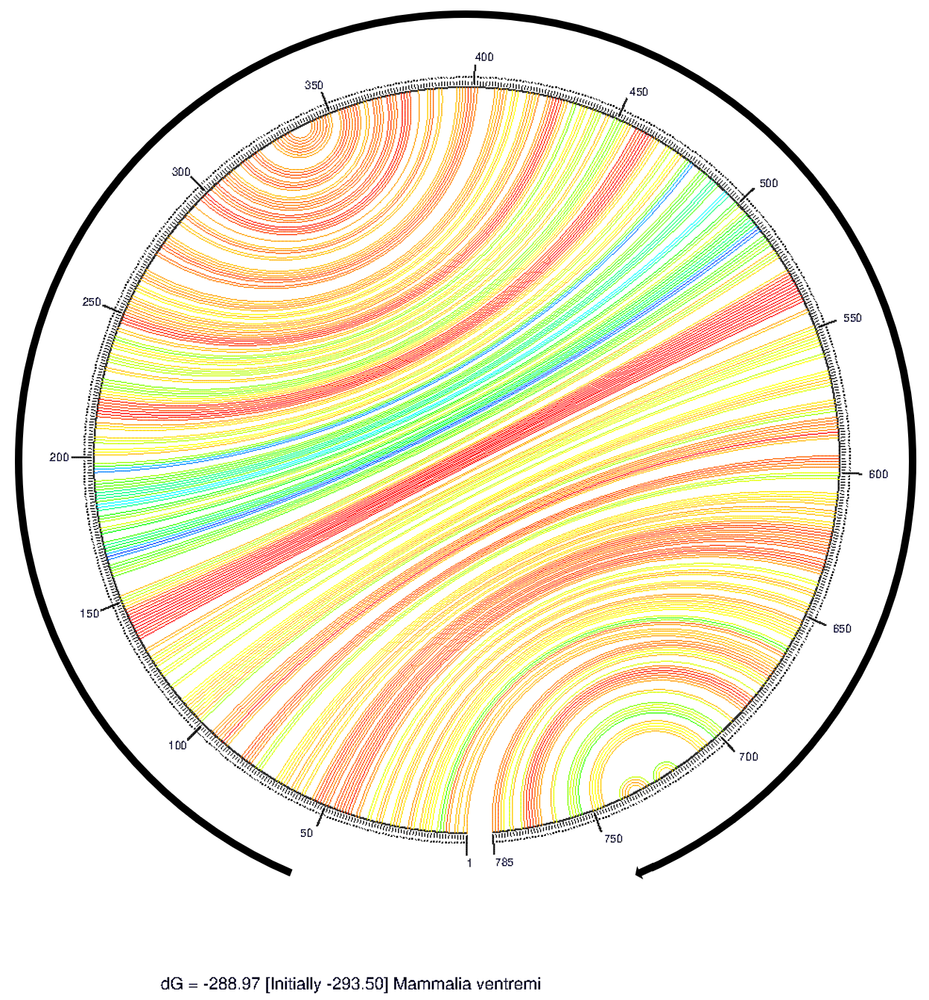
(5) Mammalia ventremi Jupiter Plot, Oblin-1 Annotated on Exterior. [Zuker 2003]

.png)
(6) Frequency of Obelisk Genome Lengths, Mammalia ventremi has a Genome Length of 785 Base Pairs. [Zheludev et al. 2024]

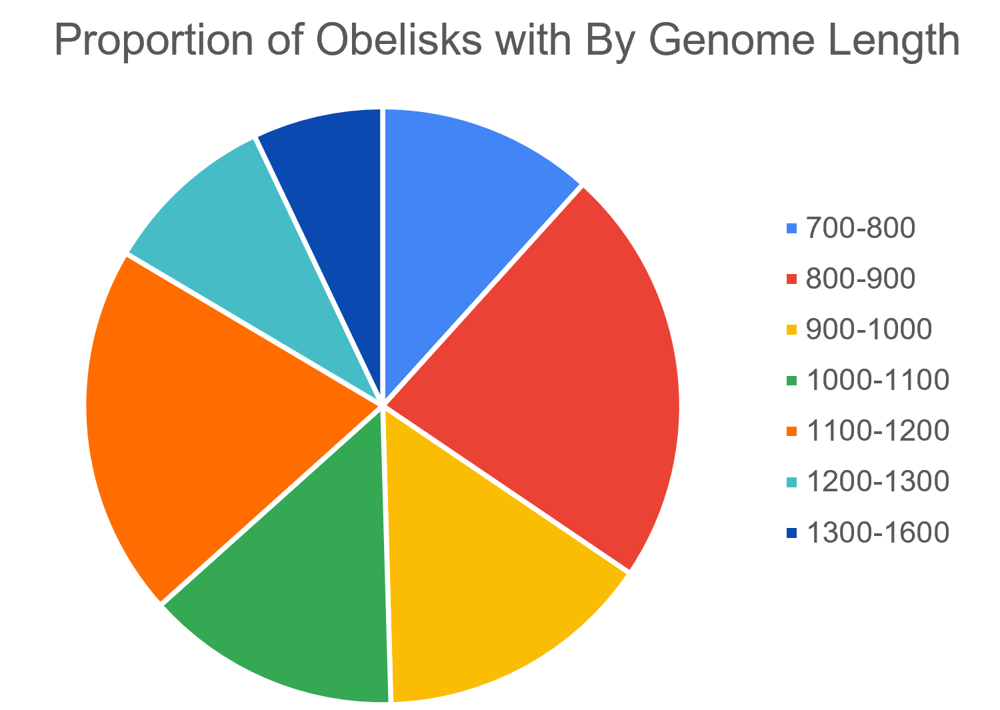
(7) Proportion of Obelisk Genome Lengths, Mammalia ventremi has a Genome Length of 785 Base Pairs. [Zheludev et al. 2024]

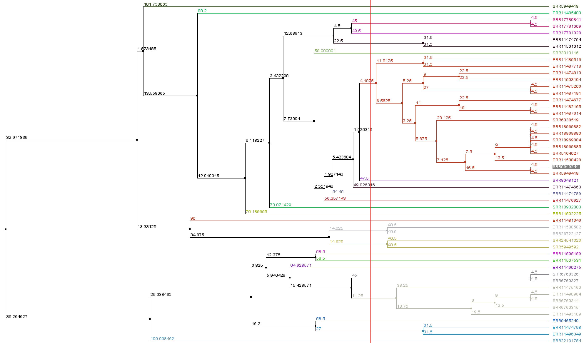
(8) Phylogenetic Tree of Sequences in the Mammalia ventremi Cluster, Centriod is highlighted (SRR5949244). Calculated via percent percent identity. [Waterhouse et al. 2009]

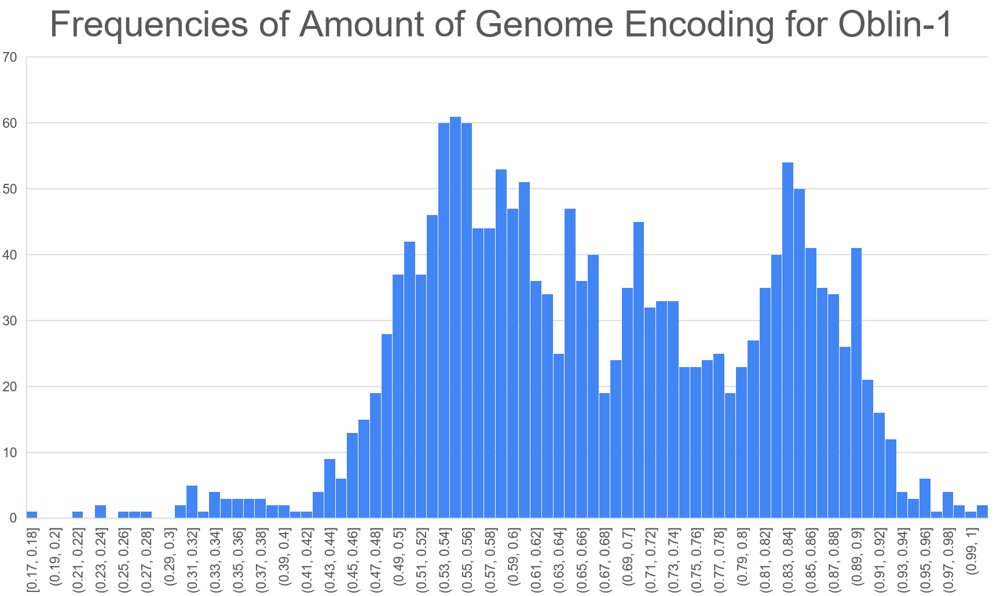
(9) Frequencies of the Amount (percentage) of Obelisks Genomes Which Encode for Oblin-1. Mammalia ventremi is in the top 8% of these genomes with more than 88% of the genome reserved for the encoding of Oblin-1. [Zheludev et al. 2024]

### Alphafold

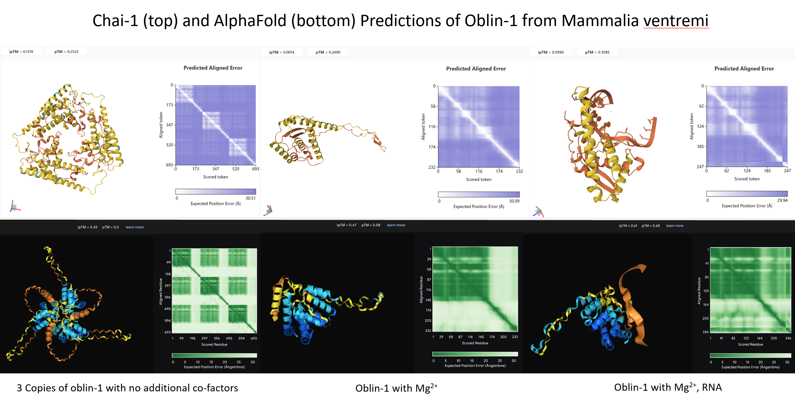
(10) Comparison of Oblin-1 Predicted Folding in AlphaFold and Chai-1. Note low confidence (ipTM and pTM values) and somewhat similar but generally varied structures. Many other conditions were tested such as different length RNAs, different ions and co-factors and different copies of Oblin-1 with each of these conditions. These three were chosen for this figure as they display the most confident folds and variety between structures.

*low* confidence: Oblin-1 is acting to recruit RNAP from E. coli to it's own genome for replication. This is low confidence as all I am making this prediction off of is the fact that one of my bioprojects was labeled as an E. coli genome (and little else tied my metadata together) and there there is evidence of RNA viruses employing a similar strategy with RNAPII [Chang, 2008]. Furthermore, all I have to test this hypothesis is comparison of predicted folding structures. Though Oblin-1 folded with low confidence without RNAP (Figure 10), once RNAP was added, the overall confidence for the fold increased to an ipTM of 0.7-0.8 and the confidence for the folding of Oblin-1 itself also increased. All of the following folding predictions were completed utilizing AlphaFold 3 as it allows for the required large number of amino acids present in RNAP [Abramson et al. 2024]. Figures 11-16 show the testing of this hypothesis. The figure descriptions point this out, but the key points of these structural analysis are: Oblin-1 interacts strongly with RNAP (espeically its most conserved region, see Figure 20) when sigma factor 70 is absent, and when Mammalia ventremi's RNA genome is present it folds into the replication pocket of RNAP, with Oblin-1 appearing to interact to hold it in place.


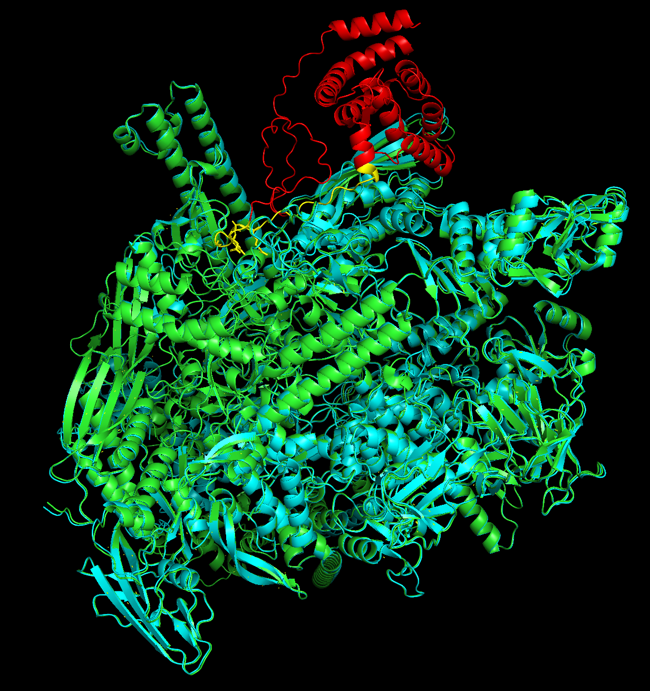
(11) RNAP (all subunits) in alphafold with and without Oblin-1 (Red, Conserved RGYXDXG Motif in Yellow). The structures folded with and with Oblin-1 have been overlayed. Note how Oblin-1 doesn't seem to disrupt the structure of RNAP.

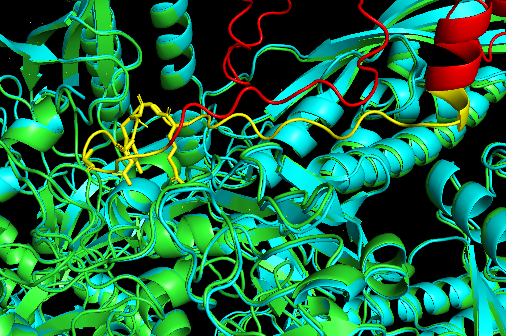
(12) RNAP (all subunits) in alphafold with and without Oblin-1 (Red, Conserved RGYXDXG Motif in Yellow), Zoomed in on Interaction Face. The structures folded with and with Oblin-1 have been overlayed. Note how conserved residues are interacting strongly with RNAP.

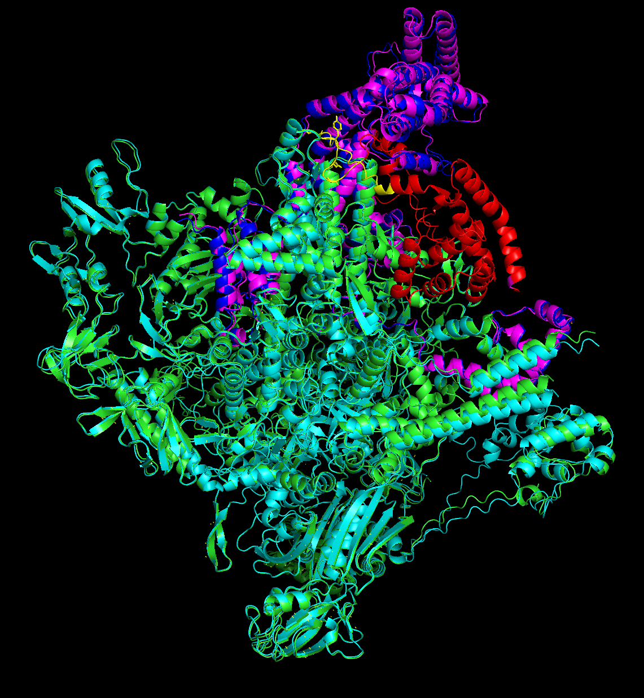
(13) RNAP (all subunits) in alphafold with and without Oblin-1 (Red, Conserved RGYXDXG Motif in Yellow), and Sigma Factor 70 (Purple and Blue). The structures folded with and with Oblin-1 have been overlayed.

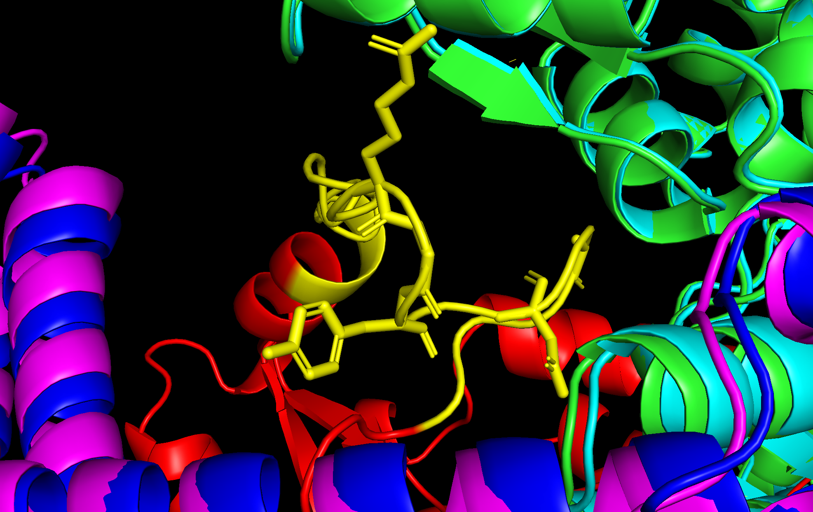
(14) RNAP (all subunits) in alphafold with and without Oblin-1 (Red, Conserved RGYXDXG Motif in Yellow), and Sigma Factor 70 (Purple and Blue), Zoomed in on Interaction Face. The structures folded with and with Oblin-1 have been overlayed. Note how conserved RGYXDXG in Oblin-1 is no longer interacting strongly with RNAP.

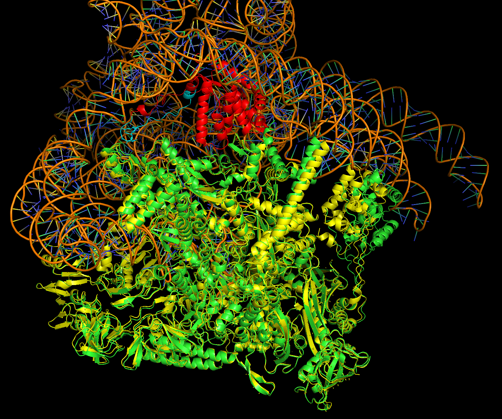
(15) RNAP (all subunits) in alphafold with and without Oblin-1 (Red, Conserved RGYXDXG Motif in Cyan), and with Entire Mammalia ventremi Whole Genome. The structures folded with and with Oblin-1 have been overlayed. Note how conserved RGYXDXG region in Oblin-1 is located at the face of RNAP and the RNA genome. Furthermore, the rest of Oblin-1 is interacting strongly with the RNA genome.

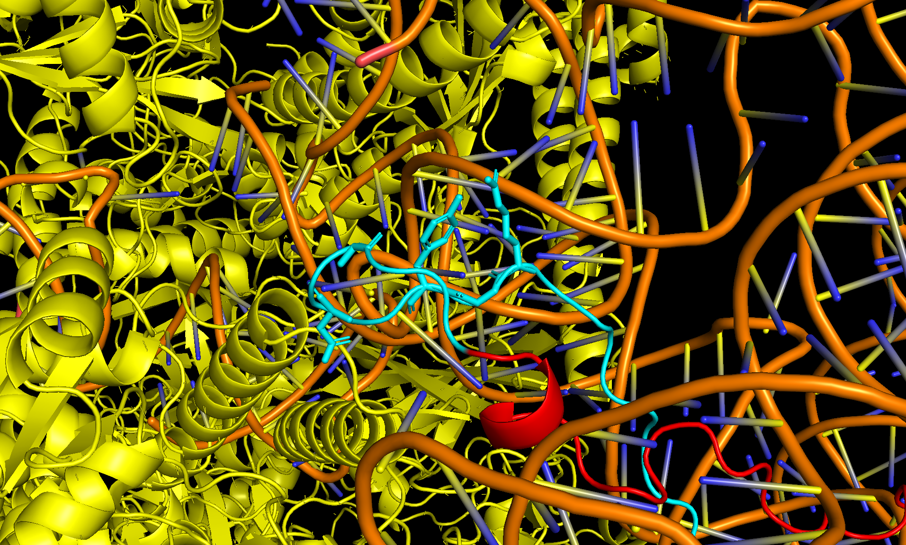
(16) RNAP (all subunits) in alphafold with and without Oblin-1 (Red, Conserved RGYXDXG Motif in Cyan), and with Entire Mammalia ventremi Whole Genome. The structures folded with and with Oblin-1 have been overlayed. Note how conserved RGYXDXG in Oblin-1 is longer interacting strongly with RNAP and the RNA genome.

### Multiple Sequence Alignment of Oblin-1

```
*high* confidence: Mammalia ventremi is Delta obelisk and codes for a novel Oblin-1 protein. High confidence as I compared the sequence of Mammalia ventremi's Oblin-1 with those named in the Zheludev et al. 2024 paper and found Delta obelisk and Mammalia ventremi possessed the exact same Oblin-1 sequence (Figures 18-20). I checked then checked the genome sequences and found they were also identical. I performed BLASTp, HHPRED, and MGnify searches to attempt to find similar proteins to Mammalia ventremi's Oblin-1 [Madeira et al. 2024, National Center for Biotechnology Information. 2018, Richardson et al. 2022, Zimmermann et al. 2018]. BLASTp returned no matches. MGnify only returned one hit with reasonable significance which ended up being from a dataset derived from one already present in my cluster [Richardson et al. 2022]. HHPRED was able to align to some proteins but the confidence and amount aligned is so low I decided not to pursue them (Figure 21) [Zimmermann et al. 2018].
```

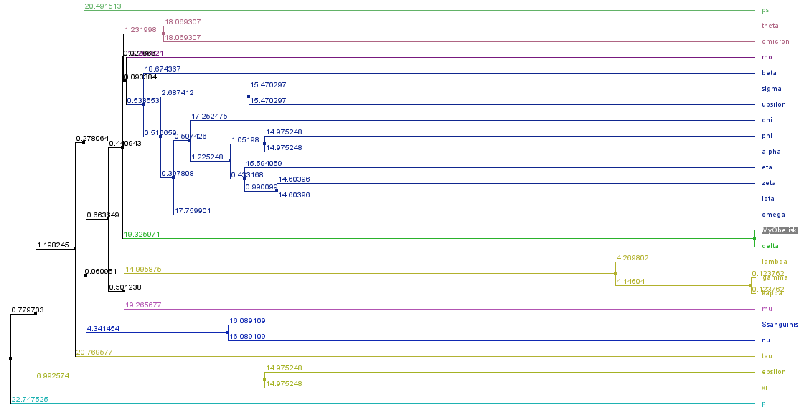
(18) Phylogenetic Tree of Named Obelisks. Note how 'My Obelisk' (Mammalia ventremi, highlighted) has exact sequence identity to Delta Obelisk. Calculated via percent identity. [Madeira et al. 2024, Waterhouse et al. 2009, Zheludev et al. 2024]

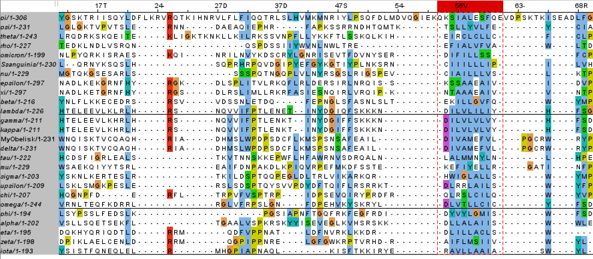
(19) Multiple Sequence Alignment of Named Obelisks, First Conserved Region (AA 54-62), Highlighted in Red. [Madeira et al. 2024, Waterhouse et al. 2009, Zheludev et al. 2024]

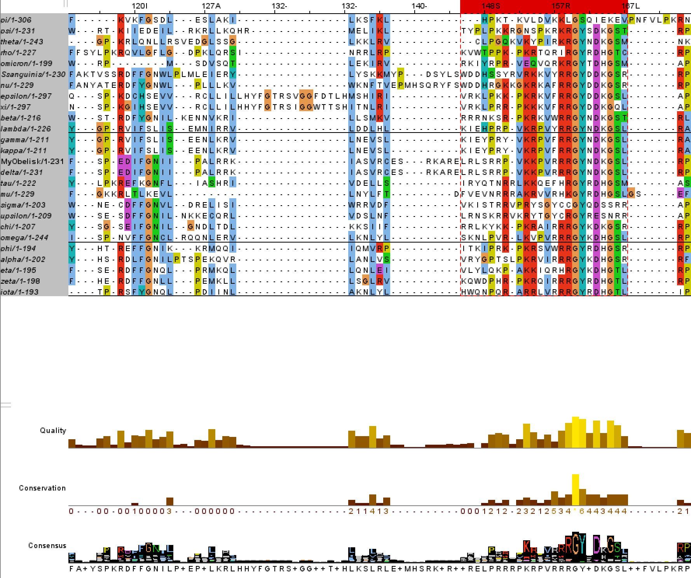
(20) Multiple Sequence Alignment of Named Obelisks, Second Conserved Region (AA 145-167), Highlighted in Red. Note the conserved RGYXGXD motif. [Madeira et al. 2024, Waterhouse et al. 2009, Zheludev et al. 2024]

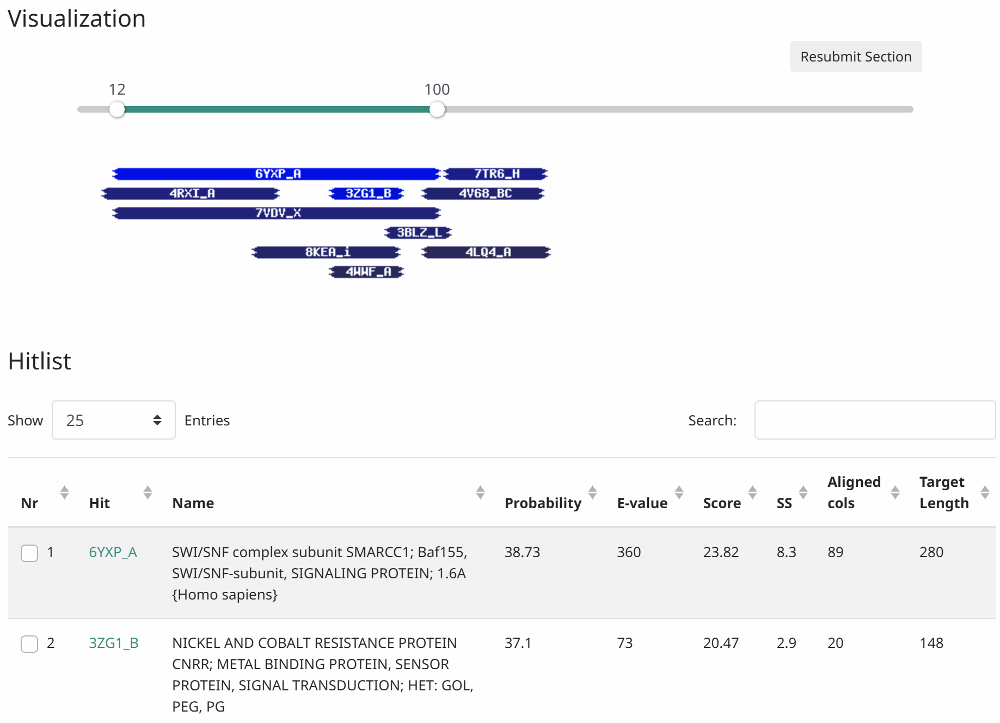
(21) HHPRED Search with Oblin-1 as Query. Note the low length and score of alignments. [Zimmermann et al. 2018]

## Discussion

In this study, I briefly characterized Mammalia ventremi, a novel obelisk identified within the gut microbiomes of diverse mammals, including humans, gorillas, and Tasmanian devils. The consistent detection of Mammalia ventremi in stool samples across 13 unique bioprojects (from mammalian sources) suggests it is a prevalent component of the mammalian gut ecosystem. The obelisk's presence in studies ranging from inflammatory bowel disease to dietary interventions indicates its potential relevance to gut health.

Mammalia ventremi possesses a remarkably compact genome of 785 nucleotides, placing it among the shortest known obelisk genomes [Zheludev et al. 2024]. This genome encodes a single protein, Oblin-1, which constitutes approximately 88.5% of the genome length, reflecting an efficient genomic organization. The rod-shaped secondary structure of the genome is characteristic of obelisks and may play a role in its stability and interaction with host factors [Zheludev et al. 2024].

Despite extensive searches using BLASTp, HHPRED, and MGnify, Oblin-1 does not exhibit significant similarity to any known proteins, suggesting it represents a novel protein family. However, structural modeling indicates that Oblin-1 may interact with E. coli RNA polymerase, potentially substituting for sigma factors to direct the polymerase to the obelisk genome. Further supportive of this is the association of Mammalia ventremi with a bioproject involving E. coli genomes. This also raises the possibility that Mammalia ventremi utilizes gut E. coli as a replication host.

The low sequence variability among Mammalia ventremi isolates, despite their occurrence in geographically and taxonomically diverse hosts, suggests a conserved function and potentially efficient transmission mechanisms within the gut microbiome.

My findings from the interrogration of Mammalia ventremi expands the current understanding of obelisks and opens up new potential avenues to validate obelisk-host interactions. Mammalia ventremi's potential activity with host machinery may influence gut microbial dynamics and direct (E. coli) and indirect (mammals) host health. Future research should focus on experimentally investigating the interaction between Oblin-1 and host RNA polymerase, elucidating the replication mechanism, and assessing the impact of Mammalia ventremi on the gut ecosystem and overall mammalian health. Understanding these aspects could reveal novel insights into microbiome function and potential therapeutic targets for gut-related-diseases.

## References

Abramson, Josh, Jonas Adler, Jack Dunger, Richard Evans, Tim Green, Alexander Pritzel, Olaf Ronneberger, et al. 2024. “Accurate Structure Prediction of Biomolecular Interactions with AlphaFold 3.” Nature 630 (May): 493–500. https://doi.org/10.1038/s41586-024-07487-w.

Boitreaud Jacques, Jack Dent, Matthew McPartlon, Joshua Meier, Vinicius Reis, Alex Rogozhnikov, and Kevin Wu. 2024. “Chai-1: Decoding the Molecular Interactions of Life.” BioRxiv (Cold Spring Harbor Laboratory), October. https://doi.org/10.1101/2024.10.10.615955.

Chang, Jinhong, Xingcao Nie, Ho Eun Chang, Ziying Han, and John Taylor. 2008. “Transcription of Hepatitis Delta Virus RNA by RNA Polymerase II.” Journal of Virology 82 (3): 1118–27. https://doi.org/10.1128/jvi.01758-07.

Chrisman Brianna S., Kelley M. Paskov, Nate Stockham, Jae-Yoon Jung, Maya Varma, Peter Y. Washington, Christine Tataru, et al. 2021. “Improved Detection of Disease-Associated Gut Microbes Using 16S Sequence-Based Biomarkers.” BMC Bioinformatics 22 (1). https://doi.org/10.1186/s12859-021-04427-7.

Gabler Felix, Seung‐Zin Nam, Sebastian Till, Milot Mirdita, Martin Steinegger, Johannes Söding, Andrei N. Lupas, and Vikram Alva. 2020. “Protein Sequence Analysis Using the MPI Bioinformatics Toolkit.” Current Protocols in Bioinformatics 72 (1). https://doi.org/10.1002/cpbi.108.

Heintz-Buschart Anna, Patrick May, Cédric C. Laczny, Laura A. Lebrun, Camille Bellora, Abhimanyu Krishna, Linda Wampach, et al. 2016. “Integrated Multi-Omics of the Human Gut Microbiome in a Case Study of Familial Type 1 Diabetes.” Nature Microbiology 2 (1). https://doi.org/10.1038/nmicrobiol.2016.180.

Herold Malte, Susana Martínez Arbas, Shaman Narayanasamy, Abdul R Sheik, Luise, Laura A Lebrun, Benoît J Kunath, et al. 2020. “Integration of Time-Series Meta-Omics Data Reveals How Microbial Ecosystems Respond to Disturbance.” Nature Communications 11 (1). https://doi.org/10.1038/s41467-020-19006-2.

Le Nevé, Boris, Adrian Martinez-De la Torre, Julien Tap, Muriel Derrien, Aurélie Cotillard, Elizabeth Barba, Marianela Mego, et al. 2020. “A Fermented Milk Product with B. Lactis CNCM I-2494 and Lactic Acid Bacteria Improves Gastrointestinal Comfort in Response to a Challenge Diet Rich in Fermentable Residues in Healthy Subjects.” Nutrients 12 (2): 320. https://doi.org/10.3390/nu12020320.

Madeira Fábio, Nandana Madhusoodanan, Joonheung Lee, Alberto Eusebi, Ania Niewielska, Adrian R N Tivey, Rodrigo Lopez, and Sarah Butcher. 2024. “The EMBL-EBI Job Dispatcher Sequence Analysis Tools Framework in 2024.” Nucleic Acids Research 52 (W1). https://doi.org/10.1093/nar/gkae241.

Martínez Arbas, Susana, Shaman Narayanasamy, Malte Herold, Laura A. Lebrun, Michael R. Hoopmann, Sujun Li, Tony J. Lam, et al. 2020. “Roles of Bacteriophages, Plasmids and CRISPR Immunity in Microbial Community Dynamics Revealed Using Time-Series Integrated Meta-Omics.” Nature Microbiology 6 (1): 123–35. https://doi.org/10.1038/s41564-020-00794-8.

Muller, Emilie E. L., Shaman Narayanasamy, Myriam Zeimes, Cédric C. Laczny, Laura A. Lebrun, Malte Herold, Nathan D. Hicks, et al. 2017. “First Draft Genome Sequence of a Strain Belonging to the Zoogloea Genus and Its Gene Expression in Situ.” Standards in Genomic Sciences 12 (1). https://doi.org/10.1186/s40793-017-0274-y.

National Center for Biotechnology Information. 2018. “Protein BLAST: Search Protein Databases Using a Protein Query.” Nih.gov. 2018. https://blast.ncbi.nlm.nih.gov/Blast.cgi?PROGRAM=blastp&PAGE_TYPE=BlastSearch&LINK_LOC=blasthome.

NCBI. 2019. “ORFfinder - NCBI.” Nih.gov. 2019. https://www.ncbi.nlm.nih.gov/orffinder/.

Muller, Emilie, Nicolás Pinel, Cédric Christian Laczny, Michael R Hoopmann, Shaman Narayanasamy, Laura Lebrun, Hugo Roume, et al. 2014. “Community-Integrated Omics Links Dominance of a Microbial Generalist to Fine-Tuned Resource Usage.” Nature Communications 5 (1). https://doi.org/10.1038/ncomms6603.

“RAWGraphs.” n.d. Www.rawgraphs.io. https://www.rawgraphs.io/.

Richardson, Lorna, Ben Allen, Germana Baldi, Miguel Boland, Maxwell L Bileschi, Tony Burdett, Josephine Burgin, et al. 2022. “MGnify: The Microbiome Sequence Data Analysis Resource in 2023.” Nucleic Acids Research 51 (D1): D753–59. https://doi.org/10.1093/nar/gkac1080.

Roume, Hugo, Anna Heintz-Buschart, Emilie, Patrick May, Venkata P Satagopam, Cedric Christian Laczny, Shaman Narayanasamy, et al. 2015. “Comparative Integrated Omics: Identification of Key Functionalities in Microbial Community-Wide Metabolic Networks” 1 (1). https://doi.org/10.1038/npjbiofilms.2015.7.

Schmidt Thomas SB, Matthew R Hayward, Luis P Coelho, Simone S Li, Paul I Costea, Anita Y Voigt, Jakob Wirbel, et al. 2019. “Extensive Transmission of Microbes along the Gastrointestinal Tract.” Edited by Wendy S Garrett, Max Nieuwdorp, Andrei Prodan, and Paul O’Toole. ELife 8 (February): e42693. https://doi.org/10.7554/eLife.42693.

Sheik, Abdul R, Emilie EL Muller, Jean-Nicolas Audinot, Laura A Lebrun, Patrick Grysan, Cedric Guignard, and Paul Wilmes. 2015. “In Situ Phenotypic Heterogeneity among Single Cells of the Filamentous Bacterium Candidatus Microthrix Parvicella.” The ISME Journal 10 (5): 1274–79. https://doi.org/10.1038/ismej.2015.181.

Tataru, Christine, Austin Martin, Kaitlyn Dunlap, Marie Peras, Brianna S. Chrisman, Erica Rutherford, Grace E. Deitzler, et al. 2021. “Longitudinal Study of Stool-Associated Microbial Taxa in Sibling Pairs with and without Autism Spectrum Disorder.” ISME Communications 1 (1). https://doi.org/10.1038/s43705-021-00080-6.

Tataru, Christine, Marie Peras, Erica Rutherford, Kaiti Dunlap, Xiaochen Yin, Brianna Chrisman, Todd Z DeSantis, Dennis P Wall, Shoko Iwai, and Maude M David. 2023. “Topic Modeling for Multi-Omic Integration in the Human Gut Microbiome and Implications for Autism.” Scientific Reports 13 (1). https://doi.org/10.1038/s41598-023-38228-0.

Tisza, Michael J., and Christopher B. Buck. 2021. “A Catalog of Tens of Thousands of Viruses from Human Metagenomes Reveals Hidden Associations with Chronic Diseases.” Proceedings of the National Academy of Sciences 118 (23). https://doi.org/10.1073/pnas.2023202118.

Waterhouse, A. M., J. B. Procter, D. M. A. Martin, M. Clamp, and G. J. Barton. 2009. “Jalview Version 2--a Multiple Sequence Alignment Editor and Analysis Workbench.” Bioinformatics 25 (9): 1189–91. https://doi.org/10.1093/bioinformatics/btp033.

West, Kiana A., Xiaochen Yin, Erica M. Rutherford, Brendan Wee, Jinlyung Choi, Brianna S. Chrisman, Kaiti L. Dunlap, et al. 2022. “Multi-Angle Meta-Analysis of the Gut Microbiome in Autism Spectrum Disorder: A Step toward Understanding Patient Subgroups.” Scientific Reports 12 (1). https://doi.org/10.1038/s41598-022-21327-9.

Zhang, Yancong, Amrisha Bhosle, Sena Bae, Lauren J. McIver, Gleb Pishchany, Emma K. Accorsi, Kelsey N. Thompson, et al. 2022. “Discovery of Bioactive Microbial Gene Products in Inflammatory Bowel Disease.” Nature, May, 1–7. https://doi.org/10.1038/s41586-022-04648-7.

Zheludev, Ivan N., Robert C. Edgar, Maria Jose Lopez-Galiano, Marcos de la Peña, Artem Babaian, Ami S. Bhatt, and Andrew Z. Fire. 2024. “Viroid-like Colonists of Human Microbiomes.” Cell 187 (23): 6521-6536.e18. https://doi.org/10.1016/j.cell.2024.09.033.

Zimmermann, Lukas, Andrew Stephens, Seung-Zin Nam, David Rau, Jonas Kübler, Marko Lozajic, Felix Gabler, Johannes Söding, Andrei N. Lupas, and Vikram Alva. 2018. “A Completely Reimplemented MPI Bioinformatics Toolkit with a New HHpred Server at Its Core.” Journal of Molecular Biology 430 (15): 2237–43. https://doi.org/10.1016/j.jmb.2017.12.007.

Zuker, M. 2003. “Mfold Web Server for Nucleic Acid Folding and Hybridization Prediction.” Nucleic Acids Research 31 (13): 3406–15. https://doi.org/10.1093/nar/gkg595.

# Viral Short Story
```
Oh, what a tale I have to spin,
Of a virus quite new, where to begin?
It’s not like the ones we’ve seen before,
**A novel virus**, and so much more!

Discovered in a place quite uncouth,
**From a stool sample** (yes, that’s the truth!)
The patient, you see, had bowel distress,
Inflammation and pain—they were quite a mess.

This virus belongs to a curious crew,
A class called **Obelisk**—bet that’s new to you!
It wriggles and dances **in RNA** form,
A fragile thing, yet it can transform.

Its genome, though tiny, is rather precise,
Just **785 base pairs**—oh, isn’t that nice?
But don’t let its size make you think it’s no foe,
It’s crafty and sneaky, as scientists know.

So here we are, with more to explore,
A virus so strange, and likely much more!
For science must dig, it must prod, it must seek,
To learn all the tricks this RNA speaks.

And though it’s no Cat in the Hat with a grin,
It sure is a story worth diving in!
```
