# MUSt see: mus musculus' microbiome marauderer, _Murinavoid maximus_ -- many mansions but no master
written by: [Caleb Ji](https://github.com/calebji123)

### Murinavoid maximus
The first part comes from "Murine" + "RNA" + "Viroid" which describes how this Obelisk is a viroid (RNA) that infects murines (the class of animals that includes mice). The second part describes its prevalence throughout bioprojects and its seemingly high read count throughout many of the samples from the TB-ARC bioproject


## Abstract

Metagenomic and metatranscriptomic studies have revealed how little biological information we have categorized, much being set aside as dark matter. Recently, thousands of new viroids called Obelisks have been identified in the SRA databases, found throughout the world in humans, mice and many other animals. Viroids are infectious small circular RNA strands, and are poorly classified. Understanding Obelisks helps build a knowledge base on viroids and potentially unlocks a new lens into understanding diseases. Here, we name and study _Murinavoid maximus_, a novel Obelisk strain that is found in mus musculus and most commonly in lab mice. Its protein and RNA structure show striking homology to the original Obelisk strain found, however with notable individualism. The results bring confidence that _Murinavoid maximus_ is a real biological element and not a computational or experimental error. It also describes how widespread _Murinavoid maximus_ is, especially in the TB-ARC bioproject by the Broad Institute. Further study into these rich databases could pinpoint hosts for this Obelisk and provide an insight into the biological workings of _Murinavoid maximus_. I anticipate this Obelisk to exist in lab mice far beyond what was expected, and could be an interesting biomarker for various microbes within mice microbiomes. 

## Results

### Ecology

_Murinavoid maximus_ appears in 28 SRA runs over 11 bioprojects. Remarkably, each and every bioproject deals with mice (lab mice, mus musculus, murine) guts, either studying bacteria living there or the effects of dietary stress on the microbiome. This is significant and striking, evidently _Murinavoid maximus_ specifically infects mice gut cells or gut bacteria!

However, this is where the similarities end. Upon describing these bioprojects:

1. [Observing glucose intolerance from hyperglycemia after organophosphate ingestion (PRJNA356127)](https://pubmed.ncbi.nlm.nih.gov/28115022/)

2. [Response of gut microbiota to social stress (PRJEB32472)](https://journals.asm.org/doi/full/10.1128/msystems.00292-18)

3. [Response of gut microbiota to high sugar and fat diet (PRJNA563913)](https://journals.asm.org/doi/full/10.1128/msystems.00317-20)

4. [Tuberculosis resistance in mouse gut microbiome (PRJNA219721)](https://www.broadinstitute.org/genome-sequencing-and-analysis/tb-arc-project-tuberculosis-antibiotic-resistance-catalog-project)

5. [Fibre supplementation to reduce gut microbiome dysbiosis (PRJNA984334)](https://www.nature.com/articles/s41467-023-40553-x)

6. [Gut microbiome and colon cancer (PRJNA379709)](https://pmc.ncbi.nlm.nih.gov/articles/PMC5613170/)

7. [Acute inflammation and murine microbiota activity (PRJNA209309)](https://www.ncbi.nlm.nih.gov/pmc/articles/pmid/24401855/)

8. [Bifidobacterium breve - Role of early life gut microbiota in colonisation resistance development (PRJEB6921, no paper)](https://trace.ncbi.nlm.nih.gov/Traces/?view=run_browser&page_size=10&acc=ERR3523737&display=metadata)

9. [Citrobacter rodentium adaptation to murine host metabolic environment (PRJEB22196)](https://www.nature.com/articles/s41467-018-06701-4)

10. [Clostridioides difficile uses inflammation to reduce competitors in gut microbiome (PRJNA612095)](https://pmc.ncbi.nlm.nih.gov/articles/PMC7815924/)

11. [Probiotic alleviates oxidative stress in gut microbiota (PRJNA547714)](https://pmc.ncbi.nlm.nih.gov/articles/PMC7229148/)

Many of the projects are related to specific bacteria or diets and trial on lab mice of similar strains, but detangling these similarities from common-practice and third variables leaves _Murinavoid maximus_ without a specific host. To make matters worse, within each project, there is no consistence to where _Murinavoid maximus_ appears in relation to experimental condition. These projects are spread across the globe, in America, Europe and China. As well, they are spread across many different sequencing technologies.

Given the widespread nature of _Murinavoid maximus_ and its existence regardless of experimental condition, I hypothesize that this Obelisk infects certain common microbes with the mouse gut. 

### RNA folding

First, I folded the RNA sequence using minimum free energy on the RNAfold web server on the centroid sequence. This showed a straight rod-like structure, very unusual for random RNA sequences to observe. There are areas of lower confidence, indicating that other configuration may be possible, so the possibility of ribozymes should not be ignored. 
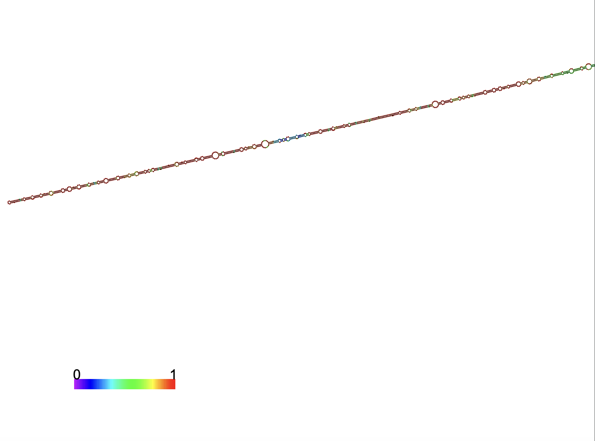
Figure 1: RNA folding prediction of the centroid sequence

Confusingly, when I performed RNA folding with UNAfold, a completely different structure was predicted. Of the 22 predicted foldings, only structure 4 was similar to a rod shape. Structure 13 held interesting properties as well, being like a sword. However, the rest were a range of disorganized foldings. Given the data, I have *moderate* confidence that the RNA folds into a complete rod-like shape, and I have *high* confidence that it has many folding configurations, of which some of them may exhibit ribozyme activity. 

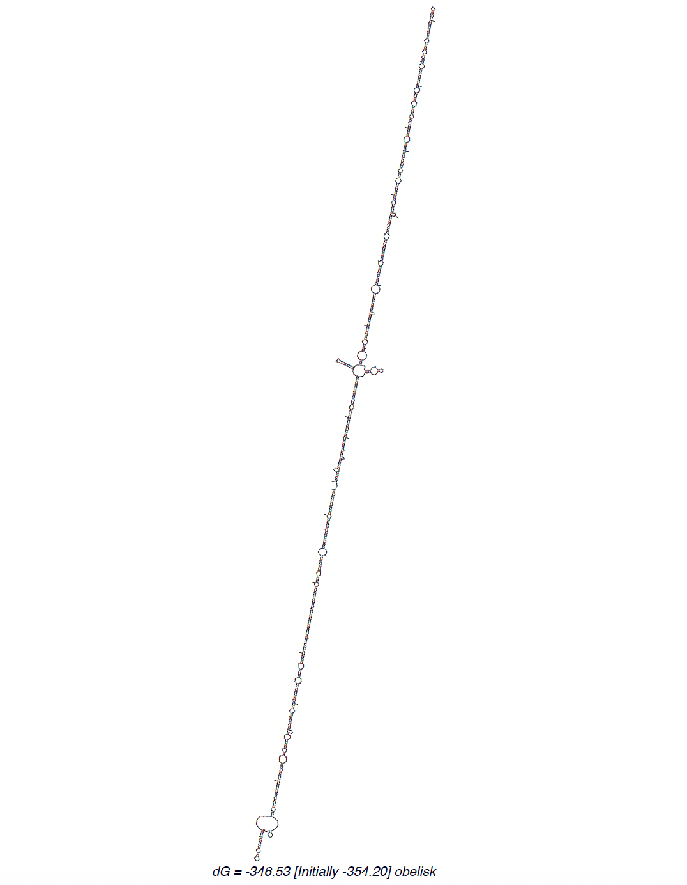
Figure 2: UNAfold prediction structure 4, rod-like shape

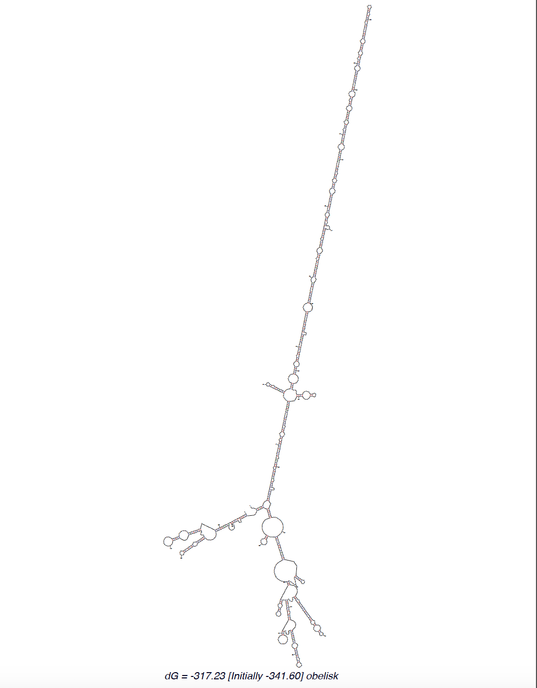
Figure 3: UNAfold prediction structure 13

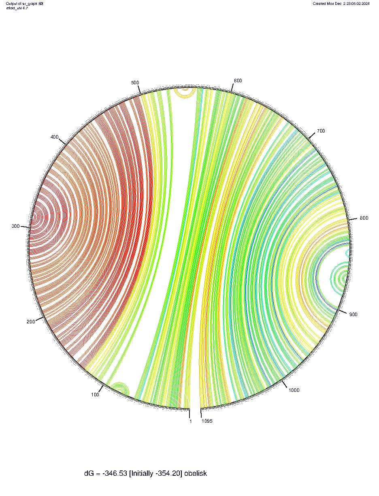
Figure 4: Jupiter plot of RNA fold in UNA Fold structure 4

### Open reading frames

Using Orffinder, I analyzed the open reading frames (ORFs) of the centroid sequence. I noticed two long segments that I labeled as my proposed Oblin-1 and Oblin-2 (named Oblin-1max and Oblin-2max). I saw five other open reading frames, nested in Oblin-1max, which require further exploration. Oblin-1max existed in the span of base pairs (bp) 51-659, 606 nucleotides long and 202 amino acids long. Oblin-2max existed in the span of bp 668-1012, 345 nucleotides long and 114 amino acids long. These were both CDS complete. Given the understanding of Obelisks and nested ORFs, I have *moderate* confidence in saying that the other ORFs have little biological impact.

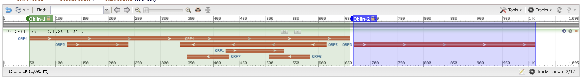
Figure 5: The open reading frames of the centroid sequence

### Oblin-1

I confirm Oblin-1max's identity by comparing to Oblin-1. They are both ~200 aa protein. Using AlphaFold3, I confirm the tertiary structure as similar as well, as it contains a central alpha-helix globule with high folding confidence. The N-terminal and C-terminal domains are more disordered than Oblin-1. I predict with *moderate* confidence that the central region is the active site of this protein.

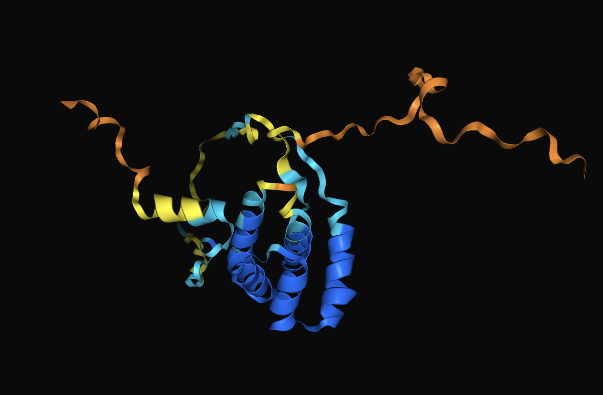
Figure 6: Structure of Oblin-1max from centroid sequence

I experimented with AlphaFold3 and different folding configurations using Oblin-1max. I conclude with *moderate* confidence that Oblin-1max does not form a dimer nor does it bind directly to the RNA sequence in monomer or dimer form. There are, of course, limitations in AlphaFold's knowledge base on RNA folding, which holds back my confidence on this matter.

There were some protein homology among the UniProt database using UniProt BLAST, mainly low-identity hits with endonucleases. InterProScan showed that there was a predicted disordered sequence near the C terminal of the protein. Disordered sequences often are not easily predicted because it binds to other proteins or nucleotides. With *low* confidence, I assume that this region is an RNA binding region which aligns with its homology with endonucleases.


Figure 7: Oblin-1max predicted protein features

### Oblin-2

I subsequently compared Oblin-2max to the original paper's Obelisk-a version of Oblin-2. Oblin-2max has more amino acids (114 vs 53) in the sequence. However, their tertiary structure conformed decently well. The original paper described Oblin-2 as a confidently predicted alpha helix, as was mine. I noticed less confident predictions at either end of the protein. Removing these portions gives a 64 aa protein that confidently folds into an alpha helix. I hypothesize with *very low* confidence that post translational modifications may occur on Oblin-2max to make it functional. 

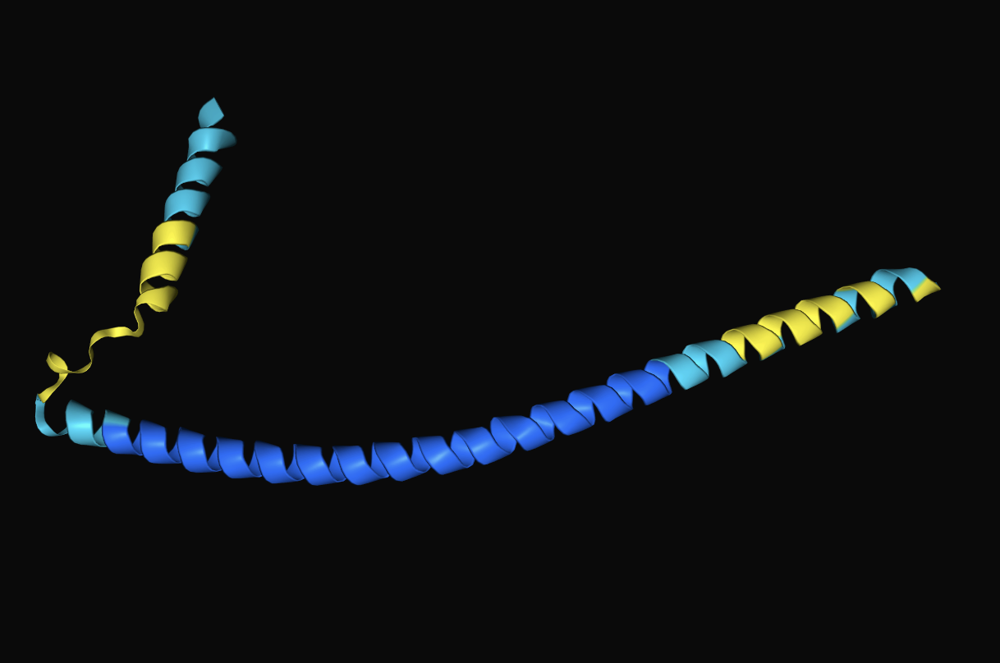
Figure 8: Oblin-2max AlphaFold3 structure

I then tested various structural configurations like I did with Oblin-1max. I found that Oblin-2max folds confidently in a dimer configuration. However, it does not fold confidently when the RNA sequence is introduced, nor does it fold confidently with Oblin-1max. I claim with *high* confidence that Oblin-2 forms a dimer, potentially also similar to a leucine zipper that the paper claimed Oblin-2 was.

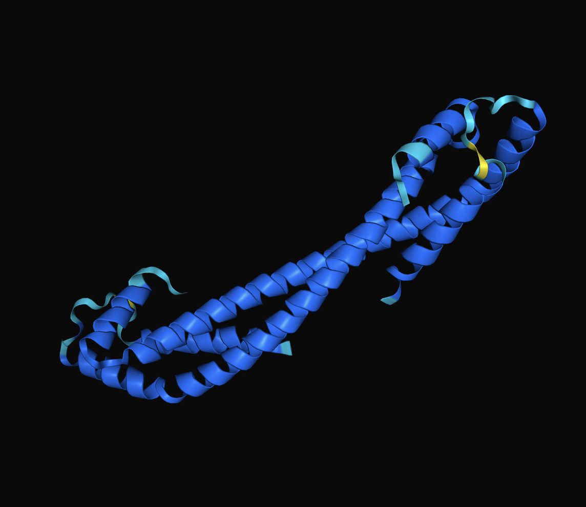
Figure 9: Predicted Oblin-2max dimer structure

InterProScan confirmed the existence of a coiled coil, but no other protein domain. UniProt BLAST contained no significant hits that had any pattern.

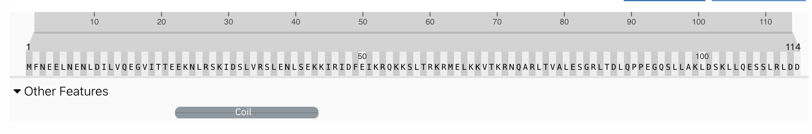
Figure 10: Oblin-2 predicted protein features

I confirm with *high* confidence the homology between _Murinavoid maximus_ and Obelisk-a given the sequences and foldings of Oblin-1max and Oblin-2max.

### Sequence analysis

Using Blast, I analyzed the number of reads mapped to the centroid _Murinavoid maximus_ in its respective SRA run (SRR5074530; bioproject PRJNA356127). I obtained 931 reads. The SRA run had 52,646,434 reads, but 105,292,868 sequences given the paired-end nature of the experiment. Each read was approximately 100bp in length. The Obelisk length is 1095bp.

Thus, calculating RKPM, I obtained:
RPKM = 931 / (1095 * 105292868 / 1000000) = 0.00807488984

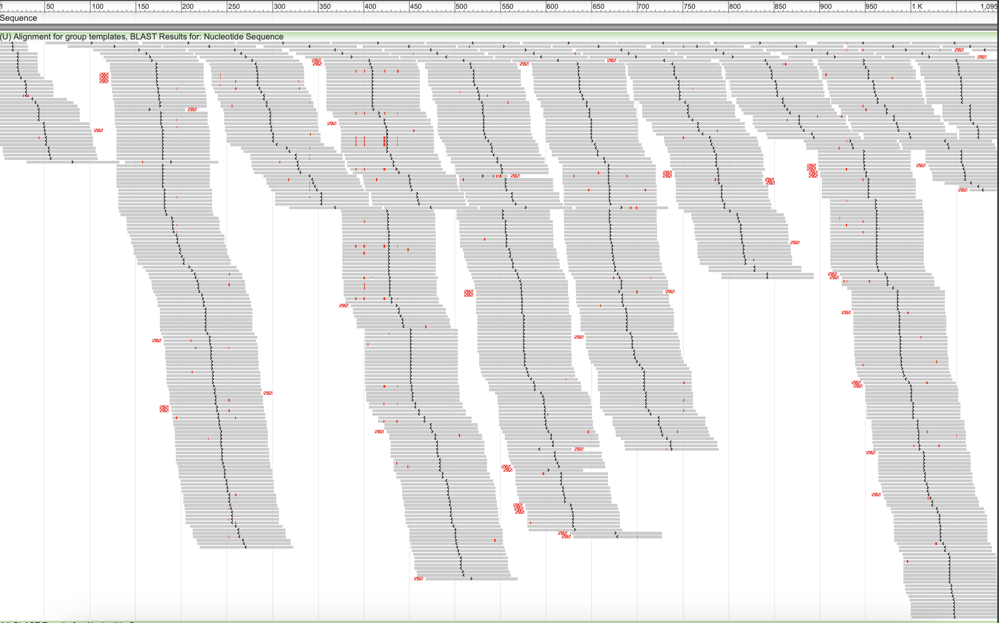
Figure 11: Reads mapped to _Murinavoid maximus_ from bioproject PRJNA356127

Curious, I hypothesized that there must be _Murinavoid maximus_ fragments in the other samples of this project. Thus, I ran Blast on the other three conditions. For reference, the centroid Obelisk was found in sample Organophosphate-1.
Organophosphate-2: 56 reads. 
Control-2: 79 reads
Control-1: 411 reads

Which in RKPM is:
Organophosphate-2: 0.00048570765
Control-2: 0.00068519473
Control-1: 0.00356474728

Control-1 condition had a lot more hits and coverage compared to the other two samples. However, I found no known similarities between the control-1 and organophosphate-1 samples in the procedure. I can with *moderate* confidence claim that the Obelisk exists in the Control-1 mice sample. Note that it is possible each sample is a mixture of many mice, which means a lower RKPM could mean proportionally fewer mice were infected with the Obelisk. Unfortunately, the pattern of the experimental conditions does not provide any more information.

### Cluster analysis

I then looked at the 28 sequences in the cluster. Each had the same length at 1095, meaning they did not have any frameshift mutations. Doing a multiple sequence similarity search using Clustal Omega, I found that many of the sequences in the cluster were identical. In total, there were 11 unique sequences. Some bioprojects had identical sequences across the samples, such as bioproject PRJNA379709 with sequences 24, 25, 26, 27 having 100% identity.  

There were 11 low frequency SNV, and 4 high frequency SNV. Most existed within Oblin-1 or Oblin-2 ORF. Their affects on the protein sequence remains to be explored, however I hypothesize with *low* confidence that there are little impactful variations in the protein structure between the sequences. This is because all the seqeunces in the cluster have very high sequence similarity and therefore cannot incur many high impact variations. 

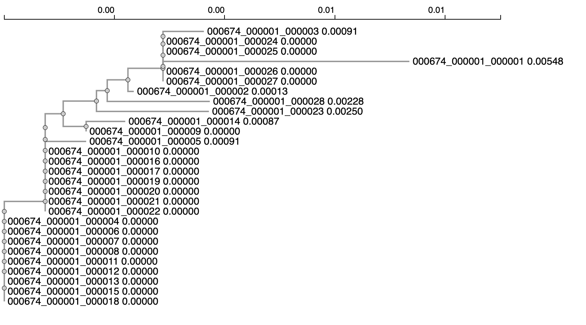
Figure 12: Obelisk 674 cluster phylogeny

### A deep dive into bioproject PRJNA219721

One interesting group of Obelisks was from bioproject PRJNA219721. This bioproject is a study done by Broad Institute from their TB-ARC project, a project dedicated to studying Tuberculosis antibiotic resistance. It was released in 2013, and potentially had papers writted on the data, though specific ones were not easy to find. Five individual SRA runs contained my Obelisk and six different SRA runs contained another Obelisk. 

The main appeal to this bioproject was the depth of information. This bioproject had over 900 SRA experiments, 480 samples, and 2000 runs. Most SRA experiments had eight runs. As well, each run was labeled with the condition, the mouse, and the relative time point. This confirmed that each mouse was sequenced individually. As well, the time points allowed for longitudinal analysis of the mice. 

I first hypothesized that if the Obelisk was in a mouse one day, it must be in that mouse for other days. I investigated mouse 1, a Balbc tuberculosis infected mouse. There were 19 SRA experiments for this mouse, a mixture of RNA-seq and DNA amplification at different time points. I knew from prior information that one SRR run in the day 7 sample had my Obelisk.

| Day | Total Read Hits | Avg Read Hits Per SRA Run  | Std Read Hits Per SRA Run | Total Reads | RPKM |
| :---: | :---: | :---: | :---: | :---: | :---: |
| 3pre | 67,180 | 8397.5 | 175.21 | 15,559,416 | 3.943 |
| 7 | 22,221 | 2777.6 | 89.95 | 34,364,852 | 0.591 |
| 21 | 146,157 | 18269 | 254.53 | 15,022,808 | 8.885 |
| 31 | 69,626 | 8703.3 | 78.62 | 42,177,206 | 1.508 |

Table 1: Read hit information for Obelisk 18 from cluster 674 in RNA-seq SRA runs for mouse 1 using BLASTn. 3pre means the third day before infection of tuberculosis. All other days are counted after infection.

There are a couple main takeaways from this analysis. First, I have *moderate* confidence that the presence of the Obelisk does not depend on infection by tuberculosis. Second, I have *high* confidence there the Obelisk is present across the entirety of the mouse's lifespan. Third, the number of Obelisk reads vary greatly between days in the lifespan, which indicates non stable population across the lifespan. Fourth, the SRA run that originally had the full Obelisk sequence in it had the least amount of Obelisk reads in total. I have *high* confidence that this means only a small fraction of the Obelisk transcripts were detected in the original publicaiton.

Notably, when I ran BLASTn on the metagenomic (DNA amplification) runs of the same mouse and day, I got zero results. This confirms with *high* confidence that this sequence is only present in RNA, and is not a transcript of some other DNA source. 

Based on my *moderately* confident hypothesis that if a mouse has the Obelisk infection, it will have it across all days, I screened for Obelisk infection in all mice in the database by checking for read alignment in a singular day. 

| Mouse | Day | Strain  | Infected | Reads (capped at 5000) | Predicted Obelisk existence |
| :---: | :---: | :---: | :---: | :---: | :---: | :---: |
| M1 | All | Balbc | TB | 5000 | Y |
| M2 | 31 | Balbc | TB | 5000 | Y |
| M4 | 21 | Balbc | TB | 921 | M |
| M6 | 31 | Balbc | No | 127 | N |
| M7 | 31 | Balbc | No | 5000 | Y |
| M9 | 31 | Balbc | No | 5000 | Y |
| M11 | 21 | Black6 | TB | 5000 | Y |
| M12 | 21 | Black6 | TB | 1271 | M |
| M14 | 21 | Black6 | TB | 5000 | Y |
| M16 | 31 | Black6 | No | 5000 | Y |
| M17 | 31 | Black6 | No | 1452 | M |
| M19 | 31 | Black6 | No | 5000 | Y |
| M21 | 21 | Rag | TB | 5000 | Y |
| M21 | 21 | Rag | TB | 5000 | Y |
| M24 | 21 | Rag | TB | 82 | N |
| M26 | 28 | Rag | No | 53 | N |
| M27 | 28 | Rag | No | 12 | N |
| M29 | 28 | Rag | No | 25 | N |
| M31 | 21 | MyD88 | TB | 5000 | Y |
| M32 | 21 | MyD88 | TB | 5000 | Y |
| M34 | 21 | MyD88 | TB | 5000 | Y |
| M36 | 28 | MyD88 | No | 5000 | Y |
| M37 | 28 | MyD88 | No | 31 | N |
| M39 | 28 | MyD88 | No | 3405 | M |
| M41 | 21 | Balbc | M avium | 5000 | Y |
| M42 | 21 | Balbc | M avium | 5000 | Y |
| M43 | 21 | Balbc | M avium | 24 | N |
| M44 | 21 | Black6 | M smeg | 5000 | Y |
| M45 | 21 | Black6 | M smeg | 5000 | Y |
| M46 | 21 | Black6 | M smeg| 5000 | Y |
Table 2: The Obelisk presence in each mouse in the bioproject, as extrapolated by a singular day. 

For speed and computational resource issues, I ran all these BLAST queries on their web server. This limited how many reads I could view, giving 5000 per sample. "M" stood for maybe, as in there were a non-trivial amount of reads mapped to the Obelisk. However, I thresholded Obelisk presence to require 5000+ reads in the sample (knowing that the sample always has 8 runs). This is in line with the significance of Obelisk read presence in my mouse 7 analysis, as the minimum there was 22,000 reads. It is important to mention that my centroid bioproject had reads in the order of 100s for datasets with 100 million sequences. Any amount of read alignment was significant, but for the sake of this analysis, relative amounts were more important. 

To test for enrichment with any mouse strain or viral infection, I performed a hypergeometric test (r dhy) on these categories.
```
Balbc enrichment: 0.3129051
Black6 enrichment: 0.1937031
MyD88 enrichment: 0.3590249
RAG enrichment: 0.095036
Uninfected enrichment: 0.04436463
TB enrichment: 0.1762262
M Avium enrichment: 0.4633005
M smeg enrichment: 0.23867
Uninfected RAG enrichment for negative: 0.04064039
```
The hypergeometric tests statistically confirmed that there was low enrichment for most of these categories. There was slight significance in the uninfected being enriched for no Obelisk, especially because all RAG and uninfected samples had no Obelisk. I have *low* confidence that there is some biological factor that explains why uninfected RAG mice do not have the Obelisk. I have *high* confidence that the presence of the Obelisk does not depend on these experimental conditions. 

### Meta-transcriptome association study design

Therefore, the specific host of this Obelisk is still unclear. A quick look at the Krona plots did not uncover any major associations, as common bacteria dominated the graph. I hypothesized that the Obelisk infects a ubiquitous murine gut bacteria or some subset of murine gut bacteria. To test this hypothesis, I created an experimental design to do mass scale meta-transcriptome association analysis. Due to computational and time limitations, this experiment cannot be completed. However, it outlines a future point of research.

1. From all RNA-seq runs of all timepoints of all 30 mice, run sequence alignment to the Obelisk and calculate RPKM.
2. Look over all the timepoints of each mouse and associate RPKM with the frequency of taxonomical assignments.
3. Look over all the timepoints of each mouse and associate RPKM with transciptome reads that align to each other. 
4. This will give high correlation with reads mapped to the Obelisk, so filter those out.
5. Take reads of high association and map them to taxonomical assignments.
6. Also align them to other Obelisk clusters
7. Take all possible alignments of these high association reads and analyze its structure, to make sure that the Obelisk reads did not come fragmented from another possible viroid or RNA transcript.

Given this experiment, potentially large amounts of read sequences would be highly associated with the Obelisk reads and would provide insight into what organism the Obelisk infects. I have high confidence in this experimental design because of the quality of the TB-ARC datasets.

## Discussion

This Obelisk, _Murinavoid maximus_, is typical to the definition of Obelisks. Its 1095 length RNA sequence encodes for two main proteins, which have high homology to the described Oblin-1 and Oblin-2 from Obelisk-a, which I name Oblin-1max and Oblin-2max. Oblin-1max has a disordered site and a globular section of alpha helices. Oblin-2max is longer than Oblin-2, but folds into the same long alpha helix structure. No protein-protein or protein-RNA conformations could be confidently predicted except for the dimerization of Oblin-2max.

_Murinavoid maximus_'s secondary structure is a straight rod-like shape with minimal protrusions, as described by RNAFold. This is strikingly simple compared to other Obelisk foldings, and displays its biological significance given the low possibility of such a folding to occur with a random sequence. However, much of the rod-like structure's base pairing is of low confidence, meaning a potential for high variability or a completely different structure.

_Murinavoid maximus_ exists exclusively in databases studying the mouse gut microbiome and its related bacteria. It mainly occurs in lab mice of various strains. However, it also finds itself in mus musculus and general murine populations. Throughout the sequences in the cluster, minimal variations occur, but further analysis must be done on the effect of these variations on the proteins themselves. _Murinavoid maximus_ also coexists with many other Obelisk colonizers of the mouse gut microbiome, which could imply Obelisks symbiotically existing.

Its centroid sequence is found within a bioproject studying glucose intolerance of organophosphate digestion. Unfortunately, its existence is not specific to an experimental condition. In fact, a cursory glance at every bioproject shows that the Obelisk does not confidently occur exclusively in an experimental condition.

Analysis into the TB-ARC bioproject led by the Broad Institute confirmed these ideas. The Obelisk frequency was not found to co-occur significantly with most experimental conditions. Notable exception is the RAG uninfected sample which had no Obelisk hits. However, this analysis did show that the Obelisk was found in many more samples than initially speculated. Originally, five separate runs each from five different samples flagged _Murinavoid maximus_. After deeper analysis at least 22 samples from 19/30 different mice showed confident signs of the Obelisk in all 8 of their runs. In addition, calculating RPKM of mouse 1 throughout its four timepoints showed how Obelisk RNA levels varied significantly, but were always present, within an individual throughout a time period. 

It is important to not that the TB-ARC project also records DNA metagenomic analysis for the same mice at the same timepoints, and alignment analysis on these databases produced negative results. Therefore, I can say with confidence that _Murinavoid maximus_ is not derived from any DNA in the sample.

Finding a host of _Murinavoid maximus_ remains a challenge given little information from the experiments themselves. The current hypothesis is that this Obelisk is a widespread viroid amongst lab mice microbiomes. It could infect a wide variety of common murine bacterial colonists, which makes associations difficult to spot with the simple tools. However, given the depth and scale of the Broad Institute TB-ARC project, and the level at which Obelisk reads are being discovered in these samples, I have high hopes in meta-transcriptome wide association studies to elucidate key connections to _Murinavoid maximus_ existence. 

As far as the data tells us, each mouse infected with _Murinavoid maximus_ does not exhibit phenotypic responses to  require it to be kept out of the studies. Therefore, _Murinavoid maximus_, however cryptic its origin, is peaceful to its meta-host, the mouse. 

## References

Bioprojects:

	1.	Velmurugan, G., Ramprasath, T., Swaminathan, K., Mithieux, G., Rajendhran, J., Dhivakar, M., Parthasarathy, A., et al. (2017). Gut microbial degradation of organophosphate insecticides induces glucose intolerance via gluconeogenesis. Genome Biology, 18(1), 8. https://doi.org/10.1186/s13059-016-1134-6
	2.	Werbner, M., Barsheshet, Y., Werbner, N., Zigdon, M., Averbuch, I., Ziv, O., Brant, B., et al. (2019). Social-Stress-Responsive Microbiota Induces Stimulation of Self-Reactive Effector T Helper Cells. mSystems, 4. https://doi.org/10.1128/mSystems.00292-18
	3.	Cabral, D.J., Wurster, J.I., Korry, B.J., Penumutchu, S., & Belenky, P. (2020). Consumption of a Western-Style Diet Modulates the Response of the Murine Gut Microbiome to Ciprofloxacin. mSystems, 5. https://doi.org/10.1128/mSystems.00317-20
	4.	Broad Institute. (n.d.). TB-ARC Project: Tuberculosis Antibiotic Resistance Catalog Project. Available at: https://www.broadinstitute.org/genome-sequencing-and-analysis/tb-arc-project-tuberculosis-antibiotic-resistance-catalog-project
	5.	Penumutchu, S., Korry, B.J., Hewlett, K., et al. (2023). Fiber supplementation protects from antibiotic-induced gut microbiome dysbiosis by modulating gut redox potential. Nature Communications, 14, 5161. https://doi.org/10.1038/s41467-023-40553-x
	6.	Daniel, S.G., et al. (2017). Functional Changes in the Gut Microbiome Contribute to Transforming Growth Factor β-Deficient Colon Cancer. mSystems, 2(5), e00065-17. https://doi.org/10.1128/mSystems.00065-17
	7.	Schwab, C., et al. (2014). Longitudinal study of murine microbiota activity and interactions with the host during acute inflammation and recovery. The ISME Journal, 8(5), 1101-1114. https://doi.org/10.1038/ismej.2013.223
	8.	NCBI. (n.d.). Run Browser Metadata: ERR3523737. Available at: https://trace.ncbi.nlm.nih.gov/Traces/?view=run_browser&acc=ERR3523737&display=metadata
	9.	Connolly, J.P.R., Slater, S.L., O’Boyle, N., et al. (2018). Host-associated niche metabolism controls enteric infection through fine-tuning the regulation of type 3 secretion. Nature Communications, 9, 4187. https://doi.org/10.1038/s41467-018-06701-4
	10.	Fletcher, J.R., et al. (2021). Clostridioides difficile exploits toxin-mediated inflammation to alter the host nutritional landscape and exclude competitors from the gut microbiota. Nature Communications, 12(1), 462. https://doi.org/10.1038/s41467-020-20746-4
	11.	Feng, P., et al. (2020). Tibet plateau probiotic mitigates chromate toxicity in mice by alleviating oxidative stress in gut microbiota. Communications Biology, 3(1), 242. https://doi.org/10.1038/s42003-020-0968-3

Bioinformatics Tools:

	12.	Gruber, A.R., Lorenz, R., Bernhart, S.H., Neuböck, R., & Hofacker, I.L. (2008). The Vienna RNA Websuite. Nucleic Acids Research, 36(Suppl_2), W70-W74. https://doi.org/10.1093/nar/gkn188
	13.	Zuker, M. (2003). Mfold web server for nucleic acid folding and hybridization prediction. Nucleic Acids Research, 31(13), 3406-3415. https://doi.org/10.1093/nar/gkg595
	14.	Rombel, I.T., Sykes, K.F., Rayner, S., & Johnston, S.A. (2002). ORF-FINDER: a vector for high-throughput gene identification. Gene, 282(1–2), 33-41. https://doi.org/10.1016/S0378-1119(01)00819-8
	15.	Abramson, J., Adler, J., Dunger, J., et al. (2024). Accurate structure prediction of biomolecular interactions with AlphaFold 3. Nature, 630, 493–500. https://doi.org/10.1038/s41586-024-07487-w
	16.	The UniProt Consortium. (2025). UniProt: the Universal Protein Knowledgebase in 2025. Nucleic Acids Research, 53(D0-D0). https://doi.org/10.1093/nar/gkaa1100
	17.	Jones, P., Binns, D., Chang, H.Y., et al. (2014). InterProScan 5: genome-scale protein function classification. Bioinformatics. PMID: 24451626
	18.	Camacho, C., Coulouris, G., Avagyan, V., et al. (2009). BLAST+: architecture and applications. BMC Bioinformatics, 10, 421. https://doi.org/10.1186/1471-2105-10-421
	19.	Sievers, F., Wilm, A., Dineen, D.G., et al. (2011). Fast, scalable generation of high-quality protein multiple sequence alignments using Clustal Omega. Molecular Systems Biology, 7, Article number: 539. https://doi.org/10.1038/msb.2011.75

Other:

	20.	Zheludev, I.N., Edgar, R.C., Lopez-Galiano, M.J., de la Peña, M., Babaian, A., Bhatt, A.S., & Fire, A.Z. (2024). Viroid-like colonists of human microbiomes. Cell, 187(23), 6521-6536.e18. https://doi.org/10.1016/j.cell.2024.09.033
	21.	Lorenz, R., Bernhart, S.H., Höner zu Siederdissen, C., Tafer, H., Flamm, C., Stadler, P.F., & Hofacker, I.L. (2011). ViennaRNA Package 2.0. Algorithms for Molecular Biology, 6(1), 26. https://doi.org/10.1186/1748-7188-6-26


# Viral Short Story

_Disclaimer: short story created when I was exploring the possibility of C57BL/6J mice being the commonality for the viroid_
```
The mice rule the world. Not the puny ones from the woods or the fields. No, the strong rule, lab mice bred for genetic idenity and a symbol of unity. I, a lab mice of the Jackson C57BL/6J (C6J) origin, wishes to understand the rife political structure of mice society. 

Eugenics hits key as genetic clones find themselves bounded to societal status before they were aware of society. C6J mice fight for the political supremacy among inbred mice. But BALB/c mice from Charles River Laboratory (Bab) fight over them for power. The affluence of the two competing groups are third to none. However, C6J mice have recently been putting on the tin hat, claiming an unknown viroid agent sent by Bab special ops have been **largely infecting the C6J**. 

C6J news reports many cases of **hyperglycemia** especially on those experimenting with new **diet methods**. Those infected with **tuberculosis** and **bacteria causing inflamed guts** have recentently reported the symptoms of the viroid. Local resident claims: "The Bab want us controlled. They fear us. They let our **guts be infected** and will explode our bowels whenever they please". Receipts show Taco Bell was the last restaurant they visited. 

C6J hysteria continues, as I am left wondering what being infected means to me. With **no known phenotype** I find skepticism in the validity of the presence of the viroid. The claims, seemingly an artifact of the insane mind, holds no basis into the present. But this also means, I will have no way of knowing if Bab has already sneaked their way into my guts.

Bab popularity has risen, with no surprise from the most extreme C6J compatriots. Though confusing reports of **Bab cases of the viroid** muddle the idea of a targetted attack. Anti-Bab conspiricist says the Bab extremists planned the fake exposure to confuse C6J unity. No matter what, C6J must stick together.

In the face of determining the truth, I find my mouth harbouring distaste for any Bab sympathetic. Perhaps my body is warning me of the viroid Bab planted inside my gut. New medicine found exclusively on C6J patriotic sites seem to be the only promise for a healthy future, $40 is cheap for salvation.

Living in C6J life makes one realize how often conspiracy is conflated with truth. We must warn the population of the viroid or else all of us will be compromised. Viva C6J! 
```